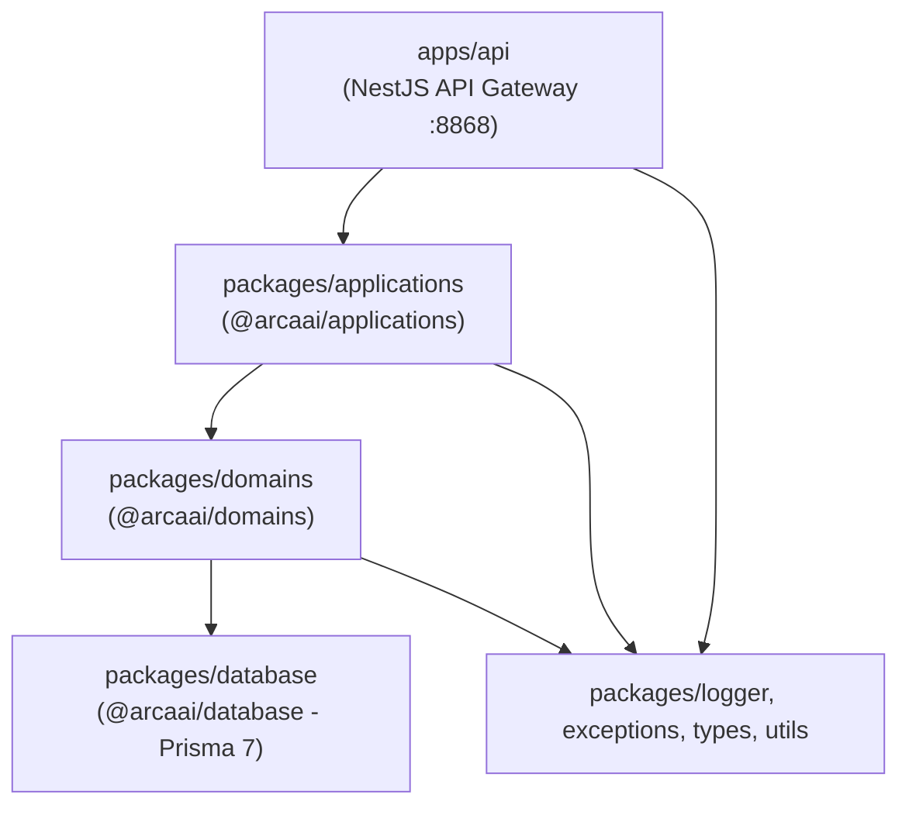
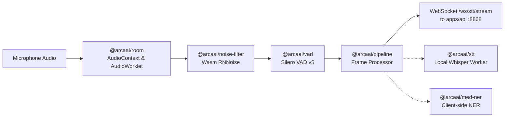
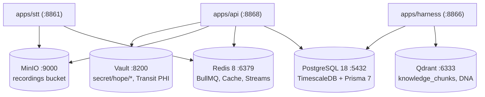

# HOPE Codebase Topology & Service Linkage Guide (dev-2.2)

> **Authoritative mapping of the HOPE Healthcare AI Platform codebase on branch `dev-2.2`:** what packages exist, how they link to each other, how microservices communicate at runtime, and how data flows across infrastructure layers.

---

## 1. Monorepo Structural Dependency Hierarchy (DDD Layers)

The backend follows a strict **Domain-Driven Design (DDD)** dependency structure managed by Turborepo and pnpm workspaces:



### Layer Breakdown

1. **[`packages/database`](../../packages/database)** (`@arcaai/database`):
   - **Role**: Data access & Prisma 7 client generation.
   - **Schema**: Split into domain `.prisma` files under [`packages/database/src/prisma/db_main/`](../../packages/database/src/prisma/db_main/) (e.g., `consultation.prisma`, `tenant.prisma`, `harness.prisma`, `user.prisma`).
   - **Extensions**: Custom Prisma client extensions for tenant isolation (`tenantId` auto-injection) and soft-deletes.

2. **[`packages/domains`](../../packages/domains)** (`@arcaai/domains`):
   - **Role**: Pure domain logic, domain entities, value objects, mappers, repositories, and domain events.
   - **Rules**: Zero dependencies on HTTP controllers, framework decorators, or external third-party services.
   - **Core Enums**: Defines system-wide enums like `JobQueue`, `ConsultationStatus`, and `HarnessGateStatus`.

3. **[`packages/applications`](../../packages/applications)** (`@arcaai/applications`):
   - **Role**: Application services, use-case orchestration, DTOs, BullMQ queue processors, and NestJS modules.
   - **Key Services**:
     - `ConsultationService`: Consultation lifecycle and timeline aggregation.
     - `StreamingAudioBridgeService`: Redis stream ingestion and WebSocket frame distribution.
     - `SummaryService`: Orchestrates pre-summary, SOAP, and comprehensive summary generation via `apps/text`.
     - `LiveDocumentationService`: Debounced real-time running note generation during consultations.

4. **[`apps/api`](../../apps/api)**:
   - **Role**: System API Gateway and system of record facade on `:8868`.
   - **Responsibilities**: Request routing, guards (`UnifiedAuthGuard`, `RbacGuard`), WebSocket gateway (`/ws/stt/stream`), Server-Sent Events (SSE), and rate limiting.

---

## 2. Browser SDK Client Architecture

The clinician client application embeds the `@arcaai/vox` SDK ([`packages/agentic-sdk-v2`](../../packages/agentic-sdk-v2)):



- **[`packages/room`](../../packages/room)**: Encapsulates cross-browser WebAudio capture and AudioWorklet pipelines.
- **[`packages/noise-filter`](../../packages/noise-filter)**: WebAssembly AI background noise cancellation using RNNoise.
- **[`packages/vad`](../../packages/vad)**: Silero Voice Activity Detection v5 running client-side.
- **[`packages/pipeline`](../../packages/pipeline)**: Sequential/parallel audio buffer processing.
- **[`packages/agentic-sdk-v2`](../../packages/agentic-sdk-v2)**: React hooks (`useConsultation`, `useAudioStream`, `useLiveSummary`) coordinating recording controls, stream tickets, and SSE consumption.

---

## 3. Microservice Runtime Communication Matrix

| Source Service | Target Service | Protocol / Channel | Purpose & Key Details |
|---|---|---|---|
| **Clinician SDK** | **`apps/api`** | WebSocket (`/ws/stt/stream`) | Binary 16kHz PCM audio frames authenticated via one-time stream tickets (`POST /api/v1/auth/stream-ticket`). |
| **Clinician SDK** | **`apps/api`** | SSE (`/api/v1/consultations/:id/live-summary/stream`) | Real-time live consultation running notes and transcription updates. |
| **`apps/admin-console`** | **`apps/api`** | HTTP Proxy (`/api/hope/*`) | Next.js 16 BFF proxy forwarding requests with encrypted httpOnly session cookies and `X-Tenant-Id`. |
| **`apps/api`** | **Redis Streams** | `XADD stt:audio:{sessionId}` | Audio frame buffer decoupling WebSocket ingress from STT worker processing. |
| **`apps/stt`** | **Redis Streams** | `XREAD stt:audio` / `XADD stt:result` | Reads audio buffers, runs VAD/ASR/diarization, and emits partial & final transcript segments. |
| **`apps/api` (LiveDoc)** | **`apps/text`** | HTTP POST (`/api/v1/generate`) | Calls Text generation service on `:8862` every debounced segment (3 segments or 5s idle) to compile running SOAP notes. |
| **`apps/api` (LiveDoc)** | **`apps/nlp`** | HTTP POST (`/api/v1/classify/tokens`) | Extracts medical entities live as speech is transcribed. |
| **`apps/api` (BullMQ)** | **`apps/text`** | HTTP POST (`/api/v1/generate`) | Asynchronous summary generation jobs (`GeneratePreSummary`, `GenerateSummary`). |
| **`apps/text`** | **`apps/guardrail`** | HTTP POST (`/api/v1/guardrail/analyze`) | Pre-generation and post-generation safety checks (PII, prompt injection, medical validity). |
| **`apps/text`** | **LLM Engines** | HTTP (OpenAI-compatible) | Text service dispatches prompt templates to LM Studio (`:1234`), Azure OpenAI, or Bedrock. |
| **`apps/harness`** | **Temporal Server** | gRPC (`:7233`) | Orchestrates `HarnessDocWorkflow` on task queue `harness-task-queue`. |
| **`apps/harness`** | **`apps/nlp`** | HTTP POST (`/api/v1/extract`) | Clinical NER extraction for sensor checks. |
| **`apps/harness`** | **`apps/api`** | HTTP Internal (`/internal/harness/*`) | Authenticated via `X-Service-Token` to read policies and write sensor scores/gate decisions. |
| **`apps/api`** | **`apps/tts`** | HTTP POST (`/api/v1/speech/synthesize`) | Text-to-speech synthesis (Kokoro, Indic Parler, or Azure Speech). |

---

## 4. Data Stores & Infrastructure Links



1. **PostgreSQL 18** (`hope-postgres` on `:5432`):
   - **System of Record**: Tenants, users, RBAC roles, consultations, transcripts, SOAP notes (`ContextItem`), and audit logs.
2. **Redis 8** (`hope-redis` on `:6379`):
   - **DB 0**: In-process BullMQ task queues.
   - **DB 1**: Multi-tenant rate limiting and cache.
   - **DB 2**: Real-time STT audio/result streams (`stt:audio:{id}`, `stt:result:{id}`).
   - **DB 5**: Dramatiq message broker for offline batch transcription jobs.
3. **MinIO** (`hope-minio` on `:9000`):
   - Stores raw audio `.wav`/`.pcm` recordings in the `recordings` bucket.
4. **Qdrant** (`:6333`) + **BGE Reranker** (`:8870`):
   - Stores institutional RAG knowledge chunks and clinician writing style embeddings.
5. **HashiCorp Vault** (`:8200`):
   - KV secrets engine (`secret/hope/*`) and Transit encryption key (`hope-globalsetting`) for encrypting patient identifiers and tokens.

---

## 5. End-to-End Core Workflows

### Flow A: Live Consultation & Real-time Transcription + Running Note
1. **Clinician** opens consultation via SDK → `POST /api/v1/consultations/open`.
2. SDK requests stream ticket → `POST /api/v1/audio/transcription-jobs/stream/session` → gateway provisions session in `apps/stt`.
3. SDK establishes WebSocket connection to `/ws/stt/stream` with one-time ticket.
4. Audio frames stream as binary PCM:
   - Gateway writes frames via `XADD stt:audio:{sessionId}`.
   - `apps/stt` reads via `XREAD`, runs Silero VAD + ASR + diarization, and publishes to `stt:result:{sessionId}`.
   - Gateway relays partial/final transcript frames back to SDK over WebSocket.
5. In parallel, `LiveDocumentationService` subscribes to `stt:result:{sessionId}`:
   - Debounces segments (default: 3 segments or 5s idle).
   - Calls `apps/text` (`POST /api/v1/generate`) for a bounded running SOAP note.
   - Calls `apps/nlp` (`POST /api/v1/classify/tokens`) for entities.
   - Emits updates over SSE: `GET /api/v1/consultations/:id/live-summary/stream`.

### Flow B: Asynchronous Clinical Note Generation
1. Client requests final note → `POST /api/v1/consultations/:id/summary/async`.
2. Gateway enqueues job into BullMQ (`GenerateSummary` queue in Redis DB 0).
3. BullMQ worker picks up job:
   - Fetches prompt template hierarchy (preferred → department → default).
   - Calls `apps/text` `POST /api/v1/generate`.
   - `apps/text` passes generation through `apps/guardrail` (`POST /api/v1/guardrail/analyze`).
   - Calls LLM provider (LM Studio, Azure OpenAI, or Bedrock).
   - Saves final clinical note to PostgreSQL as a `ContextItem` (`RAW_SUMMARY`).
   - Emits job progress over SSE: `GET /api/v1/consultations/jobs/:jobId/stream`.

### Flow C: Clinical Documentation Harness Loop (Temporal)
1. Triggered via `POST /api/v1/internal/consultations/{id}/document:start`.
2. Harness initiates `HarnessDocWorkflow` on Temporal task queue `harness-task-queue`.
3. Workflow stages:
   - **Guides**: Retrieves relevant institutional knowledge from Qdrant + Reranker.
   - **Generate**: Dispatches structured generation activities to `apps/text`.
   - **Sensors**: Evaluates clinical consistency, unsupported claims, and omissions via `apps/nlp` and judge models.
   - **Gate**: Evaluates scores against `HarnessPolicy`. Clinician attestation required before final signed note persistence.

---

## 6. Directory Map & Code Locations

```
project-hope/ (dev-2.2)
├── apps/
│   ├── api/                   # NestJS API Gateway (8868)
│   ├── stt/                   # FastAPI Speech-to-Text & Diarization (8861) + Dramatiq worker
│   ├── text/                  # FastAPI LLM Text Generation & Summarization (8862) [replaces SMR]
│   ├── guardrail/             # FastAPI Content Safety & PII (8863)
│   ├── nlp/                   # FastAPI Medical NER & Clinical Coding (8864)
│   ├── harness/               # FastAPI Clinical Documentation Harness & Temporal Worker (8866)
│   ├── tts/                   # FastAPI Text-to-Speech (8865)
│   ├── admin-console/         # Next.js 16 Governance BFF Console (5176)
│   └── example/               # Minimal live-transcription demo (5173)
├── packages/
│   ├── database/              # Prisma 7 multi-file schema & extended client
│   ├── domains/               # DDD domain entities, mappers, repos, enums
│   ├── applications/          # Application services, DTOs, BullMQ workers
│   ├── agentic-sdk-v2/        # @arcaai/vox React consultation SDK
│   ├── room/                  # WebAudio capture and room framework
│   ├── vad/                   # Silero VAD v5 wrapper
│   ├── noise-filter/          # RNNoise WebAssembly filter
│   ├── pipeline/              # Audio buffer processing pipelines
│   ├── ui/                    # Shared Radix / shadcn React component library
│   └── logger/                # Winston structured logging
├── infrastructure/
│   ├── docker/                # Docker compose (Postgres, Redis, MinIO, Vault, Temporal)
│   └── grafana/               # Dashboards and monitoring
└── docs/
    └── architecture/
        ├── diagrams/
        │   ├── platform/            # HOPE Platform Architecture (HTML + JSON + visual checks)
        │   ├── stt/                 # STT Subsystem Architecture (HTML + JSON + visual checks)
        │   └── text/                # Text & Summarization Subsystem (HTML + JSON + visual checks)
        └── overview.md              # Authoritative high-level architecture overview
```
