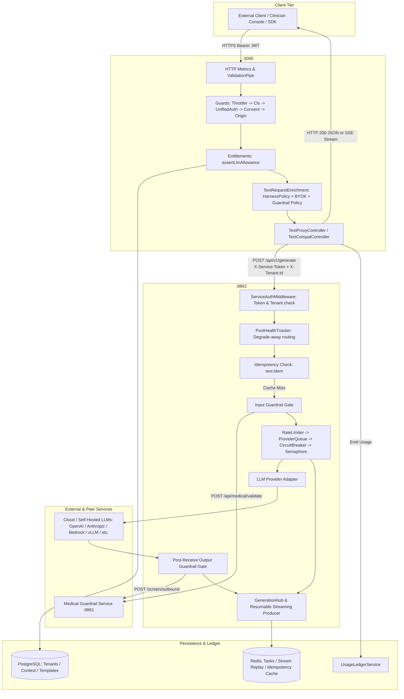
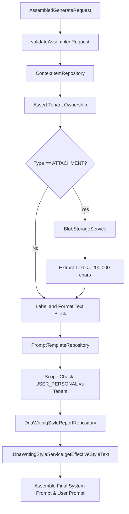

# End-to-End LLM Service Request Lifecycle Architecture

## 1. Architectural Overview & System Topology

The platform's LLM generation capability is structured as a two-tier decoupled architecture:
1. **API Gateway / Control Plane** (`apps/api` — NestJS on Port `3000`, route prefix `/api/v1`):
   * Authenticates external clients (clinicians, admin consoles, background workers, SDKs).
   * Enforces tenant context, rate limiting, and monthly token quota entitlement gates.
   * Manages prompt templates, context retrieval, attachment text extraction, and clinician DNA writing-style injection.
   * Resolves effective provider/model defaults via `HarnessPolicyService`.
   * Injects tenant Bring-Your-Own-Key (BYOK) cloud credentials into internal payloads.
   * Emits metered usage events to the billing and usage ledger.
2. **Text Generation Service** (`apps/text` — FastAPI on Port `8862`):
   * Stateless, high-throughput Python inference gateway.
   * Authenticates requests via inter-service tokens (`X-Service-Token`) and enforces tenant identification (`X-Tenant-Id`).
   * Manages provider-specific token bucket rate limiters, priority queues, circuit breakers, and concurrency semaphores.
   * Integrates two-phase safety validation with the Medical Guardrail Service (`apps/guardrail` on Port `8861`): input prompt validation and post-receive output screening.
   * Manages streaming via a decoupled `GenerationHub` where stream producers run independently of HTTP client connection state, writing to a Redis stream replay buffer for gapless resumption.
   * Dispatches generation to multi-cloud and self-hosted model engines (OpenAI, Azure OpenAI, Anthropic, AWS Bedrock, Google Vertex AI, vLLM, Ollama, LM Studio, llama.cpp).



---

## 2. API Endpoint Inventory

### A. API Gateway Endpoints (`apps/api`)

| HTTP Method & Route | Controller Class & File | Purpose |
| :--- | :--- | :--- |
| `POST /api/v1/text-generations/generate` | `TextProxyController.generate` (`src/modules/streaming/text-proxy.controller.ts`) | General-purpose text generation proxy for client apps / playground (sync JSON or stream initiation). |
| `POST /api/v1/text-generations/generate/assembled` | `TextProxyController.generateAssembled` (`src/modules/streaming/text-proxy.controller.ts`) | Server-side prompt assembly: fetches DB context items (transcripts, case notes, attachments), prompt templates, and DNA writing styles, then dispatches to TEXT. |
| `GET /api/v1/text-generations/tasks/:taskId/stream` | `TextProxyController.streamTaskEvents` (`src/modules/streaming/text-proxy.controller.ts`) | Long-lived Server-Sent Events (SSE) proxy relaying stream chunks from TEXT to client. Supports cursor resumption via `Last-Event-ID`. |
| `GET /api/v1/text-generations/tasks/:taskId` | `TextProxyController.getTaskStatus` (`src/modules/streaming/text-proxy.controller.ts`) | Polls status and completion payload of a background or completed task. |
| `POST /api/v1/text-generations/tasks/:taskId/cancel` | `TextProxyController.cancelTask` (`src/modules/streaming/text-proxy.controller.ts`) | Explicit cancellation of an in-flight generation task. |
| `POST /api/smr/api/v1/summary/sync` | `TextCompatController.summarySync` (`src/modules/text-compat/text-compat.controller.ts`) | Clinical encounter summary endpoint; maps consultation session metadata into structured schema-bound prompts. |
| `POST /api/smr/api/v1/presummary` | `TextCompatController.presummary` (`src/modules/text-compat/text-compat.controller.ts`) | Pre-summary generation endpoint from transcripts. |

### B. Downstream Internal Endpoints (`apps/text`)

| HTTP Method & Route | Handler Function & File | Purpose |
| :--- | :--- | :--- |
| `POST /api/v1/generate` | `generate` (`src/text/api/endpoints/generate.py`) | Main generation entry point. If `stream: false`, returns `GenerateResponse` JSON. If `stream: true`, immediately starts detached producer in `GenerationHub` and returns `EventSourceResponse` SSE stream. |
| `GET /api/v1/tasks/{task_id}/stream` | `stream_task_events` (`src/text/api/endpoints/stream.py`) | SSE stream subscription by task ID with sequence cursor (`Last-Event-ID` or `?last_event_id=`). Replays unflushed events from in-memory ring buffer or Redis stream. |
| `GET /api/v1/generations/{generation_id}/stream` | `stream_generation_events` (`src/text/api/endpoints/stream.py`) | Same subscriber handler under modern generation ID route (returns 204 if generation completed/unknown). |
| `GET /api/v1/tasks/{task_id}` | `get_task` (`src/text/api/endpoints/tasks.py`) | Retrieves task metadata and cached completion result from Redis. |
| `POST /api/v1/tasks/{task_id}/cancel` | `cancel_task` (`src/text/api/endpoints/tasks.py`) | Flags task as cancelled in Redis and notifies the in-memory `Producer`. |
| `POST /api/v1/judge` | `judge` (`src/text/api/endpoints/judge.py`) | Internal judge lane with isolated concurrency pool; moderation bypass tripwired so it cannot cycle through Guardrail. |

---

## 3. End-to-End Sequence Walkthrough

```
Client → API Gateway → Enrichment/Auth → Downstream Service → Admission/Guardrails → LLM Provider → Post-Gating → Client Response
```

### Step 1: External Ingress & Gateway Middleware Pipeline
1. **Client Request**:
   * Client issues `POST /api/v1/text-generations/generate` with JWT in `Authorization: Bearer <token>`.
2. **Metrics & Validation**:
   * `httpResponseMetricsMiddleware` (`apps/api/src/observability/http-response-metrics.ts`) registers request at entry.
   * Global `ValidationPipe` (`apps/api/src/main.ts`) rejects unknown body keys.
3. **Guard Stack Execution** (`apps/api/src/app.module.ts`):
   * `TieredThrottlerGuard`: Evaluates IP-level rate limits.
   * `ClsGuard`: Initializes AsyncLocalStorage context.
   * `UnifiedAuthGuard`: Decodes JWT / API key / stream ticket, attaches user and tenant ID to CLS context.
   * `PatientConsentGuard`: Verifies consent constraints if applicable.
   * `OriginTenantBindingGuard`: Matches browser `Origin` with tenant configuration.
   * Route scope check: Verifies `@RequiredScopes('consultation:report:write')`.

### Step 2: Gateway Enrichment & Pre-checks (`TextProxyController`)
1. **Quota Pre-check**:
   * Executes `assertLlmAllowance()` -> `IEntitlementsService.assertMeterQuota(tenantId, 'monthlyLlmTokens')`. Fails with `429 Too Many Requests` if monthly budget is exhausted.
2. **Model Selection**:
   * Executes `applyTextModelSelection()`. If `model` or `provider` is omitted, resolves from `HarnessPolicyService.resolveTextSelection(tenantId)`. Fails closed (`400 Bad Request`) if unresolvable.
3. **Moderation Policy Push**:
   * `TextRequestEnrichmentService.applyTenantGuardrailPolicy()` injects tenant-specific moderation overrides (`require_medical`, `include_reasoning`).
4. **Reasoning Posture**:
   * `TextRequestEnrichmentService.applyTextRuntimeProfile()` sets reasoning effort level (`minimal`, `low`, `medium`, `high`) if not explicitly specified.
5. **BYOK Credential Injection**:
   * `applyTenantProviderOverrides()` queries `IProviderConnectionService` for tenant BYO credentials or SYSTEM platform keys, injecting `provider_overrides: { [provider]: { api_key, base_url, funding } }`.
6. **Internal Forwarding**:
   * Builds headers via `getForwardHeaders()`:
     * `X-Tenant-Id: <tenant-id>`
     * `X-Service-Token: <INTERNAL_ACCESS_TOKEN>`
     * `Content-Type: application/json`
     * (If streaming) `Accept: text/event-stream`
   * Posts to `${TEXT_URL}/api/v1/generate` with bounded retry restricted strictly to socket connect-phase failures (`ECONNREFUSED`, `ENOTFOUND`).

### Step 3: Text Service Ingress & Middleware (`apps/text`)
1. **Service Authentication**:
   * `ServiceAuthMiddleware` (`apps/text/src/text/api/middleware/auth.py`) checks `X-Service-Token` using `hmac.compare_digest` against accepted service tokens (returns `401 Unauthorized` if invalid).
   * Checks mandatory `X-Tenant-Id` header (returns `428 Precondition Required` if absent).
2. **Observability**:
   * `hope_obs` binds OpenTelemetry trace spans, request ID contextvars, and access logs.

### Step 4: Text Service Admission Control (`generate.py`)
1. **Shutdown Check**:
   * `shutdown_manager.is_shutting_down` raises `503 ShutdownError`.
2. **Degrade-Away Routing**:
   * `resolve_pool_route()` (`apps/text/src/text/services/pool_router.py`) checks `PoolHealthTracker`. If primary provider is unhealthy, reroutes to `fallback_provider` or raises `503 PoolUnhealthyError`.
3. **Idempotency Verification**:
   * Reads Redis key `text:idem:{idempotency_key}`. On cache hit, immediately returns cached `GenerateResponse` JSON without model invocation.
4. **Input Guardrail Safety Validation**:
   * `_apply_guardrail_gate()` calls `ExternalGuardrailClient.validate()` (`POST /api/medical/validate` to port `8861`).
   * Fail-closed semantics:
     * Guardrail unreachable/timed out -> raises `503 GuardrailUnavailableError`.
     * Content rejected -> raises `422 ContentBlockedError` with `CONTENT_BLOCKED_NOT_MEDICAL` or `CONTENT_BLOCKED`.
   * Gathers input `guardrail_usage`.
5. **Model Parameter Check**:
   * Raises `422 Unprocessable Entity` if `model` is blank.
6. **Rate Limiting & Queuing**:
   * Evaluates `RateLimitTracker.can_proceed(estimated_tokens)`.
   * If limited: attempts to enqueue in `ProviderQueue` up to `queue_max_wait_s`.
   * Raises `429 RateLimitError` / `429 QueueTimeoutError` / `429 QueueFullError` if queue capacity is exhausted.
7. **Circuit Breaker**:
   * Evaluates `CircuitBreaker.allow_request()`. If `OPEN`, raises `503 CircuitOpenError` with `Retry-After: 30`.
8. **Provider Resolution**:
   * Retrieves provider instance from `ProviderRegistry`.
9. **Task Record**:
   * Creates task row in Redis via `TaskManager.create_task()`.

---

## 4. Streaming vs Non-Streaming Flow

### Non-Streaming Path (`stream: false`)
1. **Permit Acquisition**:
   * Acquires slot on `ResizableSemaphore`. Raises `503 ConcurrencyLimitError` if timed out after 30s.
2. **Execution & Retries**:
   * Sets task status to `RUNNING` in Redis.
   * Invokes `provider.generate(request_body)` within provider timeout.
   * If provider responds with rate limit (`429`), drops permit during jittered exponential backoff and re-acquires permit upon retry.
3. **Post-Receive Output Guardrail Gate (TASK-871)**:
   * Concurrency permit is dropped before safety screening to avoid provider capacity starvation.
   * Executes `gate_completion()` -> `ExternalGuardrailClient.screen_output()` (`POST /api/v1/guardrail/screen/outbound`).
   * Validates response against toxicity, refusal, and PII leakage relative to source prompt.
   * If rejected: task marked `FAILED`, raises `OutputRejectedError` (HTTP 422 or 503). Output is never returned or cached!
4. **Finalization & Response**:
   * Builds `GenerationStats` and `UsageDetail`.
   * Updates task status to `COMPLETED` in Redis.
   * Caches response JSON under `text:idem:{idempotency_key}` (TTL 24h).
   * Logs `GenerationAuditEvent` and updates Prometheus metrics.
   * Returns `GenerateResponse` JSON to Gateway.
   * Gateway calls `emitSyncGenerationUsage()`, emitting LLM and guardrail screening usage batches to `IUsageLedgerService`.
   * Gateway returns `200 OK` JSON to client.

### Streaming Path (`stream: true`)
1. **Detached Producer Start**:
   * `GenerationHub.start()` registers and spawns `run_generation_producer()` as an independent `asyncio.Task`.
   * **Core Invariant**: HTTP connection disconnects **never** cancel the producer. The producer runs until its own terminal frame or an explicit `/cancel` API invocation.
2. **Immediate Handshake**:
   * Text service immediately answers `POST /api/v1/generate` with `200 OK` and `text/event-stream`.
   * Gateway reads `task_id` from first SSE frame, closes setup subscription, and returns JSON:
     ```json
     {
       "task_id": "task_abc123",
       "status": "streaming",
       "stream_url": "text-generations/tasks/task_abc123/stream",
       "created_at": "2026-10-07T03:30:00Z"
     }
     ```
3. **Client Stream Subscription**:
   * Client calls `GET /api/v1/text-generations/tasks/:taskId/stream`.
   * Can pass `Last-Event-ID: <seq>` to resume from last acknowledged chunk.
4. **Relaying & Coalescing**:
   * Gateway opens `GET /api/v1/tasks/:taskId/stream` to Text service with SSE heartbeat `:keepalive\n\n` every 15s.
   * In Text service, provider yields token deltas.
   * `Producer.publish(event)` pushes immediately to attached in-memory subscribers (sub-millisecond latency).
   * `BatchFlusher` coalesces deltas (16-32 chunks or 25ms) and executes a single `XADD` to Redis stream `text:stream:{generation_id}`.
5. **Post-Receive Output Gate for Streams**:
   * Run after provider stream finishes and **before** terminal frame delivery.
   * Assembled content screened by `ExternalGuardrailClient.screen_output()`.
   * If rejected: terminal `error` frame emitted with code `GUARDRAIL_REJECTED`, task marked `FAILED`.
6. **Teardown & Metering**:
   * Flusher drains remaining events.
   * Terminal event published with `done` chunk containing full `usage`, `usage_detail`, and `guardrail_usage`.
   * Gateway's `LlmStreamUsageCollector` scans SSE stream and emits metered events to `IUsageLedgerService` on stream completion or client close.

---

## 5. Prompt Construction, Context Items & RAG Pipeline

For server-side assembled generation (`TextProxyController.generateAssembled`) and clinical summary generation (`TextCompatController.summarySync`):



1. **Context Items Assembly**:
   * Evaluated in `assemblePrompt()`.
   * Fetches IDs from `ContextItemRepository` (transcripts, case notes, work notes, raw/modified summaries, pre-summaries).
   * Cross-tenant barrier: If `contextItem.tenantId !== callerTenantId`, throws `404 Not Found` (never leaks resource existence).
   * For attachments: downloads object storage payload via `BlobStorageService`, extracts text, and enforces `ATTACHMENT_TEXT_LIMIT = 200,000` chars (~50k tokens).
2. **Prompt Template Resolution**:
   * Fetches template via `PromptTemplateRepository`.
   * Enforces scope isolation: `USER_PERSONAL` templates owned by other doctors throw `403 Forbidden`.
   * Default fallback templates applied based on type (`pre-summary` vs `summary`).
3. **DNA Writing Style Injection**:
   * Resolves style via `DnaWritingStyleReportRepository`.
   * Invokes `IDnaWritingStyleService.getEffectiveStyleText()`: checks tenant/doctor opt-outs, decrypts ciphertext column, and appends instructions to system prompt:
     `Apply the following writing style:\n<style_text>`.
4. **Structured JSON Output Constraints**:
   * Configures `response_format`:
     ```json
     {
       "type": "json_schema",
       "json_schema": {
         "name": "MedicalSummary",
         "schema": { ... },
         "strict": true
       }
     }
     ```
   * Enforced on provider wire (OpenAI `json_schema`, Anthropic tool schemas, or vLLM guided decoding).

---

## 6. Error & Fallback Handling

### Gateway Boundary Sanitization
* **Prompt Protection**:
  * Upstream raw error details from Text service are **never** forwarded to clients, as provider exceptions frequently echo sensitive clinical prompts.
  * Gateway allows only fixed, non-PHI phrases defined in `RELAYABLE_ERROR_PHRASES`:
    * `CONTENT_BLOCKED_NOT_MEDICAL`: *"The prompt was not classified as clinical content and was blocked by the guardrail."*
    * `CONTENT_BLOCKED`: *"Content was blocked by the safety guardrail."*
    * `GUARDRAIL_UNAVAILABLE`: *"The safety guardrail is temporarily unavailable. Please retry shortly."*
    * `RATE_LIMITED`: *"The AI provider is rate limiting this request. Retry after the interval given in the Retry-After header."*
    * `CONTEXT_WINDOW_EXCEEDED`: *"The request exceeds the selected model's context window."*
* **Retry-After Header Clamping**:
  * Relayed upstream `Retry-After` headers are sanitized and capped at `MAX_RELAYED_RETRY_AFTER_SECONDS = 3600` (1 hour) in `relayRetryAfter()`.

### Text Service Exception Mapping
Domain exceptions in `apps/text/src/text/core/exceptions.py` are mapped in `text_exception_handler()`:

| Domain Exception | HTTP Status | Headers | Description |
| :--- | :--- | :--- | :--- |
| `ContentBlockedError` | `422 Unprocessable Entity` | — | Prompt rejected by input safety/clinical guardrail |
| `InputValidationError` | `422 Unprocessable Entity` | — | Missing model or malformed payload |
| `RateLimitError` | `429 Too Many Requests` | `Retry-After: <s+1>`, `RateLimit-Remaining` | Internal RPM/TPM limit or upstream provider 429 |
| `QueueFullError` / `QueueTimeoutError` | `429 Too Many Requests` | — | Provider queue saturated or wait exceeded |
| `ProviderNotFoundError` | `404 Not Found` | — | Specified provider adapter is not registered |
| `CircuitOpenError` | `503 Service Unavailable` | `Retry-After: 30` | Circuit breaker tripped open due to provider failures |
| `PoolUnhealthyError` | `503 Service Unavailable` | `Retry-After: 30` | Provider marked unhealthy and no fallback configured |
| `ConcurrencyLimitError` | `503 Service Unavailable` | `Retry-After: 5` | Maximum concurrent requests on provider exceeded |
| `ProviderCredentialsError` | `503 Service Unavailable` | — | Missing or invalid BYOK connection credential |
| `GuardrailUnavailableError` | `503 Service Unavailable` | — | Guardrail service unreachable |
| `ProviderTimeoutError` | `502 Bad Gateway` | — | Provider failed to answer within configured timeout |
| `ProviderError` | `502 Bad Gateway` | — | Upstream LLM provider threw an internal 5xx error |
