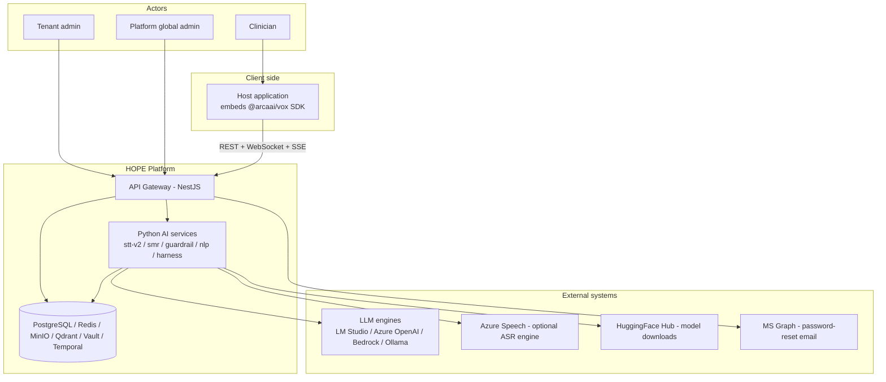
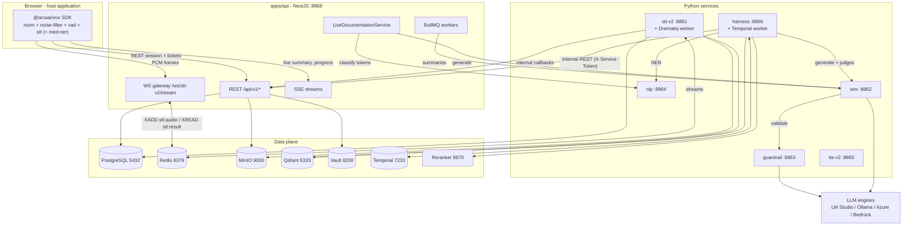
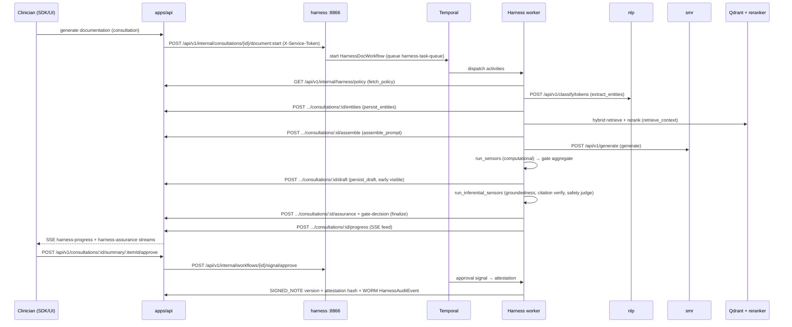

# HOPE Architecture Overview

Last updated: 2026-07-04

Authoritative high-level design of the HOPE healthcare AI platform. Every port, route, and name in this document is verified against code as of the date above. Companion documents: [data-and-domain-model.md](./data-and-domain-model.md) (domain model), [../traceability-matrix.md](../traceability-matrix.md) (capability-to-code mapping).

---

## 1. System Context

HOPE is a multi-tenant healthcare AI platform for clinical consultations. It provides:

- **Live consultation transcription** — real-time speech-to-text of doctor–patient conversations with VAD, noise filtering, and speaker diarization.
- **Medical NLP** — medical named-entity recognition (NER), text/token classification, diagnosis suggestion, ontology coding (UMLS/SNOMED/RxNorm/ICD/LOINC).
- **Summarization** — LLM-generated pre-summaries, final summaries, and comprehensive summaries of consultations (SOAP-style clinical notes), including a live "running note" during recording.
- **Guardrails** — content-safety, PII, and medical-validation checks on LLM output.
- **Clinical documentation harness** — a bounded `guides → generate → sensors → gate` loop, run as a durable Temporal workflow, that produces grounded, cited, sensor-scored clinical drafts and gates them through clinician attestation into immutable signed notes.

### Actors and tenants

| Actor | Description | Entry point |
|---|---|---|
| Clinician (doctor) | Records consultations, reviews/edits/attests AI-generated documentation | Host application embedding the `@arcaai/vox` SDK |
| Tenant admin | Manages a tenant's users, departments, prompt templates ("agents"), pipelines, storage config | `/api/v1/admin/*` routes (tenant-scoped) |
| Platform global admin | Cross-tenant platform operations: tenants, entitlements, global settings, rate limits, harness policy, platform metrics | `/api/v1/admin/*` routes (global-admin tier) |
| Host application / SDK integrator | Third-party EMR/clinic software embedding the consultation SDK; server-to-server via API keys | `@arcaai/vox` SDK + REST/WS/SSE |
| Patient | External subject of a consultation. Referenced by `patientId` (external system identifier, no FK) — patient records are NOT stored in HOPE | — |

Tenancy: every business row carries a `tenantId`. A reserved system tenant (`00000000-0000-0000-0000-000000000000`) owns platform-wide rows (system policies, system AI models). See [data-and-domain-model.md](./data-and-domain-model.md#3-multi-tenancy-mechanics).

### Context diagram



---

## 2. Service Topology

### Applications (`apps/`)

| App | Role | Port | Protocols | Key dependencies |
|---|---|---|---|---|
| `api` | NestJS 11 API gateway — auth, multi-tenancy, all client-facing REST/WS/SSE, system of record | 8868 | REST (`/api/v1`), WS (`/ws/stt-v2/stream`), SSE | PostgreSQL (Prisma), Redis (BullMQ + cache + streams), MinIO, Vault (secrets/transit), SMR, NLP, Harness, STT-v2 |
| `stt-v2` | Speech-to-text — multi-model ASR, VAD (Silero), diarization (wespeaker), streaming + batch | 8861 | REST (`/api/v1`, `/internal/*`) | PostgreSQL, Redis (streams + Dramatiq), MinIO (`recordings`), Qdrant (speaker embeddings), HuggingFace models, Azure Speech (optional) |
| `smr` | SMR v2 — multi-provider LLM text generation / summarization | 8862 | REST (`/api/v1`), SSE streaming | Redis (task manager), LLM providers (LM Studio default, Ollama, Azure OpenAI, Bedrock), Guardrail (external client) |
| `guardrail` | Safety engine — content-safety / PII / prompt-injection analysis, medical validation | 8863 | REST (`/api/v1`) | Redis (job queue), LLM engines (LM Studio / Azure / Bedrock / Ollama), PostgreSQL (optional per-tenant config via SQLAlchemy) |
| `nlp` | Medical NLP — extraction, text/token classification, correction, diagnosis suggestions | 8864 | REST (`/api/v1`), WS (`/api/v1/classify/{token,text}/{session_id}`) | HuggingFace transformer models (emotion classifier, Medical-NER, symptom/disease BERT) |
| `harness` | Clinical Documentation Harness — FastAPI HTTP surface + Temporal durable workflows (`HarnessDocWorkflow`) | 8866 | REST (`/api/v1`) | Temporal (gRPC 7233), NLP, SMR, API gateway internal endpoints, Qdrant + reranker (hybrid RAG), Granite Guardian judge |
| `tts-v2` | Text-to-speech — realtime multi-provider synthesis (Azure Speech cloud + self-hosted Kokoro / Indic Parler-TTS), English + Malayalam, OpenAI-compatible | 8865 | REST (`/api/v1`), chunked audio + SSE | Azure Speech (cloud), local ONNX/Torch models (GPU), reached via gateway `/api/v1/speech/*` |
| `ui-playground` | SDK playground + admin console — React 19/Vite/TanStack Router. **Deprecated** (no development/maintenance plan) | 5175 (dev) | HTTP | API gateway |
| `example` | Minimal live-transcription demo of the SDK (`live-transcription-example`) | 5173 (dev) | HTTP | API gateway |

Two additional long-running processes are not HTTP services:

| Process | Started by | Role |
|---|---|---|
| STT-v2 Dramatiq worker | `stt-v2-worker` / `pnpm dev:stt-v2` stack | Consumes batch transcription jobs from Redis (Dramatiq broker, DB 5); loads VAD/ASR/diarization models per worker process |
| Harness Temporal worker | `pnpm dev:harness:worker` (`harness.temporal.worker`) | Executes `HarnessDocWorkflow` / `HarnessPingWorkflow` activities on task queue `harness-task-queue` |

The API gateway also runs in-process BullMQ workers (queues from the `JobQueue` enum in `@arcaai/domains`: `AuditLog`, `SysEvent`, `GeneratePreSummary`, `GenerateSummary`, `IngestKnowledgeDocument`, etc.).

### Backing infrastructure

| Service | Port(s) | Used by | Dev provisioning |
|---|---|---|---|
| PostgreSQL 18 (TimescaleDB image, pgvector extension available) | 5432 | api (Prisma 7), stt-v2, guardrail (optional), Temporal (dedicated `temporal` + `temporal_visibility` DBs) | `infrastructure/docker/docker-compose.yml` (`hope-postgres`) |
| Redis 8 | 6379 | BullMQ (DB 0), cache/rate-limit (DB 1), STT streams (DB 2), SMR streams (DB 3), Celery (DB 4, legacy), Dramatiq (DB 5) | base compose (`hope-redis`) |
| MinIO | 9000 (API), 9001 (console) | Media/recordings object storage. Buckets: `recordings`, `generated-audio`, `documents`, `backups`, `mlflow` (legacy) | base compose (`hope-minio` + `minio-setup`) |
| Qdrant | 6333 | Speaker embeddings (`stt_speaker_embeddings`), institutional-RAG knowledge chunks, prompt/DNA collections | dev compose (`qdrant`, opt-in) |
| Vault | 8200 | Secrets (KV v2 `secret/hope/*`), Transit encryption (`hope-globalsetting`, PHI key), dynamic PG credentials | dev compose (`vault` + `vault-init`, opt-in `vault` profile) |
| Temporal | 7233 (gRPC), 8233 (UI) | Harness durable workflows | dev compose (opt-in `temporal` profile) |
| Reranker (HF text-embeddings-inference, BAAI/bge-reranker-v2-m3) | 8870 | Harness hybrid-RAG reranking | dev compose (opt-in `rag` profile) |
| Prometheus / Grafana | 9090 / 3001 (host; container 3000) | Platform metrics (TASK-386) + dashboards | dev compose (opt-in `prometheus`/`observability` profile) |
| LM Studio (OpenAI-compatible) / Ollama | 1234 / 11434 (typical) | Default local LLM engines for SMR, Guardrail, Harness judges | host-run (dev); k3s deployments (cluster) |

### Container diagram



---

## 3. Core Data Flows

### 3.1 Live consultation transcription + live documentation

Verified against `apps/api/src/modules/streaming/` (gateway, controllers), `packages/applications/src/services/stt/streaming/` (Redis bridge), `packages/applications/src/services/consultation/live-documentation/`, and `apps/stt-v2/src/stt_v2/streaming/`.

```mermaid
sequenceDiagram
    participant SDK as Browser SDK (@arcaai/vox)
    participant API as apps/api :8868
    participant R as Redis Streams
    participant STT as stt-v2 :8861
    participant SMR as smr :8862
    participant NLP as nlp :8864

    SDK->>API: POST /api/v1/consultations/open
    SDK->>API: POST /api/v1/consultations/:id/recording/start
    SDK->>API: POST /api/v1/audio/transcription-jobs/stream/session
    API->>STT: POST /internal/streaming/sessions
    API-->>SDK: sessionId + one-time stream ticket
    SDK->>API: WS connect /ws/stt-v2/stream?sessionId&ticket
    loop while recording
        SDK->>API: binary PCM frames (after room/noise-filter/vad)
        API->>R: XADD stt:audio:{sessionId}
        STT->>R: XREAD stt:audio → VAD/ASR/diarization
        STT->>R: XADD stt:result:{sessionId}
        R-->>API: XREAD stt:result
        API-->>SDK: partial/final transcripts over WS (seq + resume buffer)
    end
    Note over API: LiveDocumentationService also subscribes to stt:result
    API->>SMR: POST /api/v1/generate (debounced running SOAP note)
    API->>NLP: POST /api/v1/classify/tokens (entities)
    API-->>SDK: SSE GET /api/v1/consultations/:id/live-summary/stream
    SDK->>API: POST /api/v1/consultations/:id/recording/stop
    API->>STT: end session; persist TRANSCRIPT ContextItem + AudioRecording
```

Key mechanics:

- WS handshake auth uses one-time stream tickets minted by `POST /api/v1/auth/stream-ticket` (or bundled by the session-create endpoint); all handshake failures close with generic code `4401`.
- Audio/control/result travel via Redis Streams: `stt:audio:{sessionId}`, `stt:control:{sessionId}`, `stt:result:{sessionId}` (`StreamingAudioBridgeService`).
- The gateway keeps a 200-message resume buffer per session for reconnect replay, and applies egress backpressure (drops partials, queues finals) above a 512 KiB WS buffer watermark.
- `LiveDocumentationService` (TASK-339/340) debounces final segments (default: 3 segments or 5 s idle), calls SMR for a bounded running note and NLP for entities, and republishes over the consultation live-summary SSE stream. Kill switch: `LIVE_DOC_ENABLED`.
- STT-v2 calls back into the gateway's internal surface (`/api/v1/internal/stt/*`: transcripts, job lifecycle, audio-records, media) authenticated by service token.

### 3.2 Batch transcription

`POST /api/v1/audio/transcription-jobs` (single/batch/streaming variants) creates `TranscriptionJob` rows; STT-v2's Dramatiq worker consumes jobs via Redis (broker DB 5), pulls audio from MinIO (`recordings` bucket), transcribes, and reports lifecycle transitions back through `/api/v1/internal/stt/jobs/:id/{start,progress,complete,fail}`. Job status streams to clients via SSE `GET /api/v1/audio/transcription-jobs/:id/stream`.

### 3.3 Summary generation (BullMQ jobs)

`POST /api/v1/consultations/:id/summary[/async|/pre-summary|/comprehensive]` → `ConsultationJob` (BullMQ `GeneratePreSummary` / `GenerateSummary` / `ComprehensiveSummary` queues) → `SummaryService` resolves the prompt (preferred → department → default tier), calls SMR `POST /api/v1/generate`, SMR validates output through Guardrail, and the result persists as a `ContextItem` (`PRE_SUMMARY` / `RAW_SUMMARY`) with `SummaryMeta` provenance (model, tokens, prompt tier, scores). Job progress streams via SSE `GET /api/v1/consultations/jobs/:jobId/stream`.

### 3.4 Clinical documentation harness (Temporal)

Verified against `apps/harness/src/harness/temporal/{workflows,activities}.py`, `apps/harness/src/harness/api/endpoints/internal.py`, and `apps/api/src/modules/consultation/harness-internal.controller.ts`.



Key mechanics:

- The loop body (`guides → generate → sensors → gate`) is a deterministic Temporal workflow; all I/O happens in activities with bounded retry policies. Gate decisions: `PASS | REGEN | FLAG`.
- Two-phase assurance (TASK-355): the draft persists early (`DRAFT_PENDING_SENSORS` consultation status) while the inferential sensor pass (groundedness, per-claim citation verification, safety screen — LLM-judge based, concurrency-governed) completes; sign-off is blocked until `assuranceCompletedAt` is set and safety did not FLAG.
- Consultation lifecycle: `OPEN → RECORDING → DRAFT_PENDING_SENSORS → PENDING_REVIEW → SIGNED` (+ `CLOSED`/`REOPENED`) — typed `ConsultationStatus` enum.
- Attestation writes an immutable `SIGNED_NOTE` context item version with `attestationHash` anchored to an append-only `HarnessAuditEvent` (WORM audit).
- Institutional-RAG ingestion: gateway BullMQ processor (`IngestKnowledgeDocument`) → harness `POST /api/v1/knowledge/ingest` (chunk → dense+sparse embed → Qdrant upsert), tracked by `KnowledgeDocument`/`KnowledgeChunk` rows.
- Admin/observability: `/api/v1/admin/harness/*` in the gateway (policy, observe, workflow ops) proxied to harness `/api/v1/admin/harness/workflows*`; per-tenant realtime toggles under `/api/v1/admin/harness/pipeline-policy`.

### 3.5 Voice profile enrollment

`POST /api/v1/voice-profile/enroll` (gateway) → STT-v2 `POST /internal/voice-profile` → speaker embedding (512-dim, wespeaker) upserted into Qdrant collection `stt_speaker_embeddings`; `UserVoiceProfile` row tracks state. Diarization during live sessions matches speakers against enrolled profiles.

---

## 4. API Gateway Structure

Global prefix `/api/v1` (only `/metrics` is excluded — internal controllers are therefore at `/api/v1/internal/*`). Swagger at `/api/v1/docs` (non-production). WebSocket via `@nestjs/platform-ws` adapter.

### Feature modules (`apps/api/src/modules/`)

| Group | Modules | Route prefixes |
|---|---|---|
| Identity & access | `auth`, `api-key`, `rbac`, `user` | `auth`, `admin/api-keys`, `admin/rbac/{roles,policies}`, `rbac/check`, `users`, `admin/users`, `user/me/*`, `users/password-reset` |
| Tenancy & platform | `tenant`, `tenant-frontend-config`, `tenant-storage-config`, `tenant-bucket`, `storage-access-key`, `global-setting`, `entitlements`, `admin-rate-limit`, `platform-metrics`, `throttle` | `tenant`, `admin/tenants`, `admin/tenant-frontend-config`, `admin/tenants/storage/{config,buckets,keys}`, `admin/settings`, `entitlements`, `admin/entitlements`, `admin/rate-limit`, `admin/platform` |
| Clinical domain | `consultation`, `department`, `dna-writing-style`, `prompt-management`, `voice-profile` | `consultations`, `consultations/jobs`, `admin/consultations`, `admin/departments`, `dna-writing-styles`, `admin/dna-writing-styles`, `prompt-templates`, `admin/prompt-templates`, `voice-profile` |
| Audio & AI pipeline | `streaming`, `pipeline`, `ai-model` | `audio/transcription-jobs`, `admin/audio/transcription-jobs`, `audio/pipelines`, `admin/audio/pipelines`, `admin/ai-models`, `text` (SMR proxy) |
| Harness | `harness-admin`, `pipeline-policy-admin`, consultation `harness-internal` controller | `admin/harness`, `admin/harness/pipeline-policy`, `internal/harness` |
| Ops & internal | `health`, `monitoring`, `audit-log`, `queue-admin`, `pstudio`, `internal` | `health`, `monitoring`, `admin/audit-logs`, `admin/queues`, `admin/schedulers`, `admin/pstudio`, `internal/stt` |

The SMR proxy (`SmrProxyController`, prefix `text`) exposes `POST /api/v1/text/generate`, `POST /api/v1/text/generate/assembled`, task polling/cancel/stream, and provider listings — it is a standalone controller (the legacy `BaseProxyController` in `src/shared/` is currently unused by any controller).

### Cross-cutting request pipeline

Order matters (verified in `app.module.ts` / `main.ts`):

1. `TieredThrottlerGuard` — Redis-backed tiered rate limiting (default tier on every route; strict/heavy/relaxed opt-in; per-tenant plan tiers via entitlements).
2. `UnifiedAuthGuard` — deny-by-default authentication (JWT session, API key, OIDC); `@Public()` is the explicit opt-out; boot-time audit refuses to start if any route lacks `@Public()` or a permission decorator.
3. `TenantOwnedResourceSseGuard` — pre-stream tenant-ownership assertion for `@Sse()` handlers.
4. `RequiresIfMatchGuard` + `ETagInterceptor` — RFC 7232 optimistic concurrency (`_version` → strong ETag; `If-Match` required on annotated PATCH routes, else 428).
5. Interceptors: metrics, CLS context, exception mapping, maintenance mode, impersonation audit, tenant-owned-resource (404-over-403 posture).
6. `ValidationPipe` with `whitelist + forbidNonWhitelisted + forbidUnknownValues` (mass-assignment protection).
7. CLS (`nestjs-cls`) carries `userId`/`tenantId`/correlation id; the `tenantScopeFilter` Prisma extension injects tenant predicates on every query (see data model doc).

Authorization is policy-based RBAC (CASL-style `PolicyEngine` in `@arcaai/applications`): `@Authorize()` / `@CanManage()` decorators at controllers; roles/policies persisted in `Role`/`Policy`/`RolePolicy` and assigned via `UserRoleAssignment`.

---

## 5. DDD Layering

```
packages/database   → Prisma 7 schema (packages/database/src/prisma/db_main/*.prisma),
                      generated client (src/generated/core-prisma-client),
                      extensions (tenant-scope), migration URL resolution
packages/domains    → entities / factories / mappers / models / repositories
                      (generated per-model under src/*/generated/core/ + handwritten)
packages/applications → application services, DTOs, NestJS service modules,
                      authorization (PolicyEngine), base services (config, redis,
                      blob storage, secrets, sys-events)
apps/api            → controllers, guards, gateways, interceptors only
```

Enforced conventions (see `.cursor/rules` and `eslint-plugin-arcaai-internal`):

- Controllers never touch Prisma; services never import `@arcaai/database` directly — they use `@arcaai/domains` repositories.
- Entities are created via `XxxFactory.CreateXxx()`, never `new XxxEntity()`.
- Services extend `BaseService` (tenant scoping, `broadcastSysEvent`, tenant guards), map entities to response DTOs, and broadcast `SysEvent` after every mutation.
- Deletes are soft (`resourceStatus: DELETED` via `repository.softDelete()`).
- Python services do not use Prisma; they access Postgres (stt-v2, guardrail) via their own async clients and are otherwise reached only through the gateway.

Shared TypeScript packages: `logger` (Winston), `exceptions`, `types`, `utils`, `tools` (code generators: `gen:model|entity|mapper|repository|factory|service|controller`), `config-*` (eslint/ts/tailwind/rollup), `ui` (@arcaai/ui shadcn/Radix component library).

Browser SDK packages: `agentic-sdk-v2` (`@arcaai/vox` — Zustand store, consultation client, WS/SSE clients) composing `room` (audio track management), `noise-filter` (RNNoise WASM), `vad` (Silero VAD v5), `stt` (Whisper WebWorker, local/offline STT), optional `med-ner` (client-side NER), `pipeline` (sequential/parallel processing primitives).

---

## 6. Deployment Topologies

### 6.1 Local development (Docker Compose + host processes)

Infrastructure in containers; application services run on the host (Node via pnpm/turbo, Python via conda env `arcaenv` + uv).

- Base: `infrastructure/docker/docker-compose.yml` — `hope-postgres` (TimescaleDB pg18 image), `hope-minio` (+ bucket setup), `hope-redis`.
- Dev overlay: `infrastructure/docker/docker-compose.dev.yml` — opt-in profiles: `vault` (+`vault-init` AppRole bootstrap), `qdrant` (+collection init), `temporal` (+`temporal-ui`; shares hope-postgres via dedicated `temporal`/`temporal_visibility` DBs), `rag` (`hope-reranker` TEI), `prometheus`/`observability` (Prometheus + Grafana).
- Entry points: `pnpm dev:setup` (full bootstrap), `pnpm infra:up`, `pnpm dev:stack` (spawns api, stt, smr, guardrail, nlp, harness, worker, ui subsets), `pnpm dev:doctor` (health checks).
- Env files: `.env.dev` (dev), `.env.test` (isolated test infra: PG 5433, Redis 6380, MinIO 9002), `.env.example` (canonical template). Host env always wins; production loads host env only.

### 6.2 Cluster (k3s + ArgoCD) — primary deployment target

GitOps via ArgoCD ApplicationSet (`deployment/argocd/bootstrap.{dev,prod}.yaml.example`), namespaces `hope-v2-dev` (auto-sync) and `hope-v2-prod` (manual sync), GitLab CI (`.gitlab-ci.yml`) builds per-service images on change.

- Kustomize base (`deployment/k3s/base/kustomization.yaml`) deploys: `redis`, `ollama`, `lmstudio`, `api`, `guardrail`, `reranker`, `smr`, `stt-v2`, `stt-v2-worker`, `ui` (ui-playground image — deprecated app), and a `db-migrate` Job (ArgoCD PreSync hook). An `nlp.yaml` manifest exists but is not currently listed in the kustomization resources.
- PostgreSQL is not deployed in-cluster by the base; the platform targets the external HA Postgres cluster (Patroni + HAProxy + PgBouncer, VMs 500–502 — see `docs/research/deployments/deploy-vm500-502-postgres-ha.md`). Production requires the `DATABASE_URL` (PgBouncer 6432, transaction mode) / `DIRECT_URL` (un-pooled, migrations) split.
- Harness + Temporal are not yet part of the k3s base (compose-profile / host-run only at this time).
- Ingress: Traefik (k3s default). Overlays (`overlays/dev`, `overlays/prod`) patch image tags, hostnames, replicas.
- Vault: HA 3-node Raft cluster with Transit auto-unseal on k3s — deployment artifacts in `infrastructure/single-deployment/vault/`, operator runbook in `docs/operations/vault/README.md`.

### 6.3 Single-server deployment

`infrastructure/single-deployment/` currently contains only the Vault deployment tree (`vault/` — helm values, manifests, bootstrap, seal-vault, monitoring, test). The former full single-server app deployment has been superseded by the k3s + ArgoCD path; `infrastructure/SECURITY_DEPLOYMENT_GUIDE.md` documents the security posture for production deployments.

---

## 7. Observability & Security Summary

| Concern | Mechanism |
|---|---|
| Logging | `@arcaai/logger` (Winston, file + console) in Node; structlog-style `get_logger` in Python services; request-id propagation (`X-Request-Id`, CLS) |
| Metrics | `/metrics` Prometheus endpoints on the gateway and Python services; platform-metrics module aggregates via `PROMETHEUS_URL`; Grafana dashboards in `infrastructure/grafana/` |
| Tracing | OpenTelemetry, opt-in (`OTEL_EXPORTER_OTLP_ENDPOINT` empty by default — TASK-411) |
| Secrets | `SecretsService` provider chain (`SECRETS_PROVIDER=env|vault|aws|azure|in-memory`); Vault AppRole auth; rotation worker tails Vault audit log |
| PHI encryption | Vault Transit envelope encryption for clinical free text — plaintext columns dropped (TASK-369); see data model doc |
| At-rest encryption | Postgres volumes on LUKS (prod), MinIO SSE (KES/KMS in prod), Redis persistence disabled in dev |
| Audit | `AuditLog` (event-driven via BullMQ, scheduled retention purge), `HarnessAuditEvent` (append-only WORM for clinical attestation), impersonation audit interceptor |
| Rate limiting | Tiered throttler (Redis-backed), DB-configured limits (`admin/rate-limit`), per-tenant plan tiers via entitlements |
