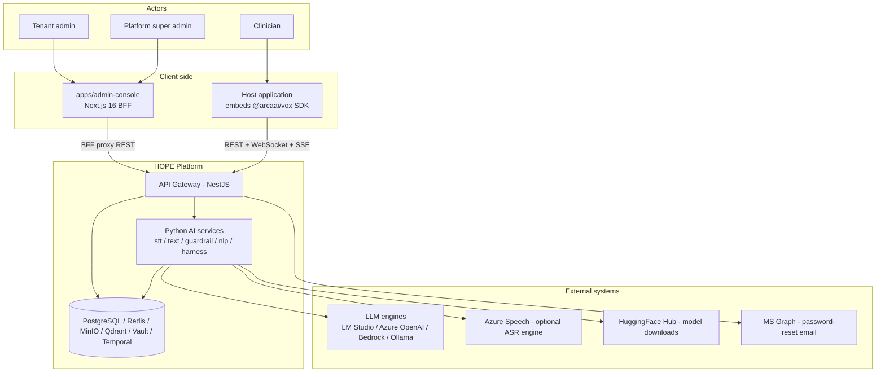
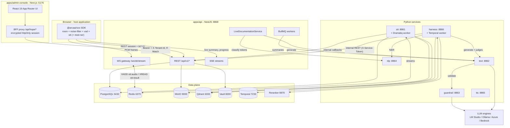
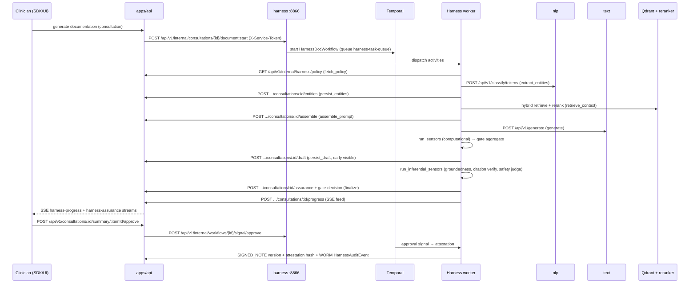

# HOPE Architecture Overview

| | |
|---|---|
| **Owner** | Platform / Architecture | **Introduced** docs/archive/TASK-412-Documentation-Realignment · **Last verified** 2026-07-21 |

Authoritative high-level design of the HOPE healthcare AI platform. Every port, route, and name in this document is verified against code. Companion documents: [data-and-domain-model.md](./data-and-domain-model.md) (domain model), [model-and-config-plane.md](./model-and-config-plane.md) (model / configuration control plane), [../traceability-matrix.md](../traceability-matrix.md) (capability-to-code mapping).

---

## 1. System Context

HOPE is a multi-tenant healthcare AI platform for clinical consultations. It provides:

- **Live consultation transcription** — real-time speech-to-text of doctor–patient conversations with VAD, noise filtering, and speaker diarization.
- **Medical NLP** — medical named-entity recognition (NER), text/token classification, diagnosis suggestion, ontology coding (UMLS/SNOMED/RxNorm/ICD/LOINC).
- **Summarization** — LLM-generated pre-summaries, final summaries, and comprehensive summaries of consultations (SOAP-style clinical notes), including a live "running note" during recording.
- **Guardrails** — content-safety, PII, and medical-validation checks on LLM output.
- **Clinical documentation harness** — a bounded `guides → generate → sensors → gate` loop, run as a durable Temporal workflow, that produces grounded, cited, sensor-scored clinical drafts and gates them through clinician attestation into immutable signed notes.
- **Text-to-speech** — realtime multi-provider synthesis (Azure Speech cloud + self-hosted Kokoro / Indic Parler-TTS), English + Malayalam, per-tenant configurable.
- **Governance & administration** — a Next.js admin console for tenant, RBAC, pipeline, prompt, harness-policy, AI-config, model and platform governance across super-admin and tenant-admin tiers.

### Actors and tenants

| Actor | Description | Entry point |
|---|---|---|
| Clinician (doctor) | Records consultations, reviews/edits/attests AI-generated documentation | Host application embedding the `@arcaai/vox` SDK |
| Tenant admin | Manages a tenant's users, departments, prompt templates ("agents"), pipelines, storage, TTS and identity-provider config | `apps/admin-console` → `/api/v1/admin/*` routes (tenant-scoped) |
| Platform super admin | Cross-tenant platform operations: tenants, entitlements, global settings, rate limits, harness policy, AI/model config, platform metrics | `apps/admin-console` → `/api/v1/admin/*` routes (super-admin tier) |
| Host application / SDK integrator | Third-party EMR/clinic software embedding the consultation SDK; server-to-server via API keys | `@arcaai/vox` SDK + REST/WS/SSE |
| Patient | External subject of a consultation. Referenced by `patientId` (external system identifier, no FK) — patient records are NOT stored in HOPE | — |

Tenancy: every business row carries a `tenantId`. A reserved system tenant (`00000000-0000-0000-0000-000000000000`) owns platform-wide rows (system policies, system AI models). See [data-and-domain-model.md](./data-and-domain-model.md#3-multi-tenancy-mechanics).

### Context diagram



---

## 2. Service Topology

### Applications (`apps/`)

| App | Role | Port | Protocols | Key dependencies |
|---|---|---|---|---|
| `api` | NestJS 11 API gateway — auth, multi-tenancy, all client-facing REST/WS/SSE, system of record | 8868 | REST (`/api/v1`), WS (`/ws/stt/stream`), SSE | PostgreSQL (Prisma), Redis (BullMQ + cache + streams), MinIO, Vault (secrets/transit), Text, NLP, Harness, STT |
| `stt` | Speech-to-text — processor-registry pipeline (schema v2): multi-model ASR, VAD (Silero), embedding + diarization, streaming + batch | 8861 | REST (`/api/v1`, `/internal/*`) | PostgreSQL, Redis (streams + Dramatiq), MinIO (`recordings`), Qdrant (speaker embeddings), HuggingFace / NeMo models, Azure Speech (optional) |
| `text` | Text (formerly SMR) — multi-provider LLM text generation / summarization | 8862 | REST (`/api/v1`), SSE streaming | Redis (task manager), LLM providers (LM Studio default, Azure OpenAI, Bedrock, vLLM, llama.cpp), Guardrail (external client) |
| `guardrail` | Safety engine — content-safety / PII / prompt-injection analysis, medical validation | 8863 | REST (`/api/v1`) | Redis (job queue), LLM engines (LM Studio / Azure / Bedrock / Ollama), PostgreSQL (optional per-tenant config via SQLAlchemy) |
| `nlp` | Medical NLP — extraction, text/token classification, correction, diagnosis suggestions | 8864 | REST (`/api/v1`), WS (`/api/v1/classify/{token,text}/{session_id}`) | HuggingFace transformer models (emotion classifier, Medical-NER, symptom/disease BERT) |
| `harness` | Clinical Documentation Harness — FastAPI HTTP surface + Temporal durable workflows (`HarnessDocWorkflow`) | 8866 | REST (`/api/v1`) | Temporal (gRPC 7233), NLP, Text, API gateway internal endpoints, Qdrant + reranker (hybrid RAG), Granite Guardian judge |
| `tts` | Text-to-speech — realtime multi-provider synthesis (Azure Speech cloud + self-hosted Kokoro / Indic Parler-TTS), English + Malayalam, OpenAI-compatible | 8865 | REST (`/api/v1`), chunked audio + SSE | Azure Speech (cloud), local ONNX/Torch models (GPU), reached via gateway `/api/v1/speech/*` |
| `admin-console` | Governance & administration console — Next.js 16 App Router, React 19, BFF auth (encrypted httpOnly session, catch-all `/api/hope/*` proxy, stream tickets); tier-mirrored route groups `(global)` / `(shared)` / `(tenant)` | 5176 (dev) | HTTP (BFF) | API gateway (via server-side proxy) |
| `example` | Minimal live-transcription demo of the SDK (`live-transcription-example`) | 5173 (dev) | HTTP | API gateway |

Two additional long-running processes are not HTTP services:

| Process | Started by | Role |
|---|---|---|
| STT Dramatiq worker | `pnpm stt:worker:dev` (`dramatiq stt.worker`), or as part of `pnpm stack:dev`; in the cluster, the `worker` stage of `apps/stt/docker/Dockerfile` | Consumes batch transcription jobs from Redis (Dramatiq broker, DB 5); loads VAD/ASR/diarization models per worker process. A SEPARATE process from `pnpm stt:dev` — without it batch jobs stay `QUEUED` (BUG-011) |
| Harness Temporal worker | `pnpm worker:dev` (`harness.temporal.worker`) | Executes `HarnessDocWorkflow` / `HarnessPingWorkflow` activities on task queue `harness-task-queue` |

The API gateway also runs in-process BullMQ workers (queues from the `JobQueue` enum in `@arcaai/domains`: `AuditLog`, `SysEvent`, `GeneratePreSummary`, `GenerateSummary`, `IngestKnowledgeDocument`, etc.).

### Backing infrastructure

| Service | Port(s) | Used by | Dev provisioning |
|---|---|---|---|
| PostgreSQL 18 (TimescaleDB image, pgvector extension available) | 5432 | api (Prisma 7), stt, guardrail (optional), Temporal (dedicated `temporal` + `temporal_visibility` DBs) | `infrastructure/docker/docker-compose.yml` (`hope-postgres`) |
| Redis 8 | 6379 | BullMQ (DB 0), cache/rate-limit (DB 1), STT streams (DB 2), Text streams (`smr:stream:` prefix, DB 3), Celery (DB 4, legacy), Dramatiq (DB 5) | base compose (`hope-redis`) |
| MinIO | 9000 (API), 9001 (console) | Media/recordings object storage. Buckets: `recordings`, `generated-audio`, `documents`, `backups`, `mlflow` (legacy) | base compose (`hope-minio` + `minio-setup`) |
| Qdrant | 6333 | Institutional-RAG knowledge chunks (`knowledge_chunks`), prompt/DNA collections. **Not** speaker embeddings — see below | dev compose (`qdrant`, opt-in) |
| Vault | 8200 | Secrets (KV v2 `secret/hope/*`), Transit encryption (`hope-globalsetting`, PHI key), dynamic PG credentials | dev compose (`vault` + `vault-init`, opt-in `vault` profile) |
| Temporal | 7233 (gRPC), 8233 (UI) | Harness durable workflows | dev compose (`temporal` profile; base tier via `infra:up`) |
| Reranker (HF text-embeddings-inference, BAAI/bge-reranker-v2-m3) | 8870 | Harness hybrid-RAG reranking | dev compose (`rag` profile; base tier via `infra:up`) |
| Prometheus / Grafana | 9090 / 3001 (host; container 3000) | Platform metrics (TASK-386) + dashboards | dev compose (`prometheus` profile; `-o` tier) |
| LM Studio (OpenAI-compatible) / Ollama | 1234 / 11434 (typical) | Default local LLM engines for Text, Guardrail, Harness judges | host-run (dev); cluster deploys (see §7.2) |

### Container diagram



---

## 3. Core Data Flows

### 3.1 Live consultation transcription + live documentation

Verified against `apps/api/src/modules/streaming/` (gateway, controllers), `packages/applications/src/services/stt/streaming/` (Redis bridge), `packages/applications/src/services/consultation/live-documentation/`, and `apps/stt/src/stt/streaming/`.

```mermaid
sequenceDiagram
    participant SDK as Browser SDK (@arcaai/vox)
    participant API as apps/api :8868
    participant R as Redis Streams
    participant STT as stt :8861
    participant TEXT as text :8862
    participant NLP as nlp :8864

    SDK->>API: POST /api/v1/consultations/open
    SDK->>API: POST /api/v1/consultations/:id/recording/start
    SDK->>API: POST /api/v1/audio/transcription-jobs/stream/session
    API->>STT: POST /internal/streaming/sessions
    API-->>SDK: sessionId + one-time stream ticket
    SDK->>API: WS connect /ws/stt/stream?sessionId&ticket
    loop while recording
        SDK->>API: binary PCM frames (after room/noise-filter/vad)
        API->>R: XADD stt:audio:{sessionId}
        STT->>R: XREAD stt:audio → VAD/ASR/diarization
        STT->>R: XADD stt:result:{sessionId}
        R-->>API: XREAD stt:result
        API-->>SDK: partial/final transcripts over WS (seq + resume buffer)
    end
    Note over API: LiveDocumentationService also subscribes to stt:result
    API->>TEXT: POST /api/v1/generate (debounced running SOAP note)
    API->>NLP: POST /api/v1/classify/tokens (entities)
    API-->>SDK: SSE GET /api/v1/consultations/:id/live-summary/stream
    SDK->>API: POST /api/v1/consultations/:id/recording/stop
    API->>STT: end session; persist TRANSCRIPT ContextItem + AudioRecording
```

Key mechanics:

- WS handshake auth uses one-time stream tickets minted by `POST /api/v1/auth/stream-ticket` (or bundled by the session-create endpoint); all handshake failures close with generic code `4401`.
- Audio/control/result travel via Redis Streams: `stt:audio:{sessionId}`, `stt:control:{sessionId}`, `stt:result:{sessionId}` (`StreamingAudioBridgeService`).
- The gateway keeps a 200-message resume buffer per session for reconnect replay, and applies egress backpressure (drops partials, queues finals) above a 512 KiB WS buffer watermark.
- `LiveDocumentationService` (TASK-339/340) debounces final segments (default: 3 segments or 5 s idle), calls Text for a bounded running note and NLP for entities, and republishes over the consultation live-summary SSE stream. Kill switch: `LIVE_DOC_ENABLED`.
- STT calls back into the gateway's internal surface (`/api/v1/internal/stt/*`: transcripts, job lifecycle, audio-records, media) authenticated by service token.
- Per-tenant STT fallback (TASK-567): the session-create request carries an optional `provider_overrides` (BYOK) + `fallback_pipeline_id`; on a classified ASR outage (or a user-triggered `POST stream/session/:sessionId/switch-to-fallback`), `SessionManager`'s `EngineSwitchController` swaps the session's ASR engine one-way and publishes a `status`/`provider_switched` result over `stt:result:{sessionId}` — the gateway relays it on the existing WS `status` frame with zero protocol change. Batch jobs re-dispatch once on the fallback within the same Dramatiq attempt.

### 3.2 Batch transcription

`POST /api/v1/audio/transcription-jobs` (single/batch/streaming variants) creates `TranscriptionJob` rows; STT's Dramatiq worker consumes jobs via Redis (broker DB 5), pulls audio from MinIO (`recordings` bucket), transcribes, and reports lifecycle transitions back through `/api/v1/internal/stt/jobs/:id/{start,progress,complete,fail}`. Job status streams to clients via SSE `GET /api/v1/audio/transcription-jobs/:id/stream`.

### 3.3 Summary generation (BullMQ jobs)

`POST /api/v1/consultations/:id/summary[/async|/pre-summary|/comprehensive]` → `ConsultationJob` (BullMQ `GeneratePreSummary` / `GenerateSummary` / `ComprehensiveSummary` queues) → `SummaryService` resolves the prompt (preferred → department → default tier), calls Text `POST /api/v1/generate`, Text validates output through Guardrail, and the result persists as a `ContextItem` (`PRE_SUMMARY` / `RAW_SUMMARY`) with `SummaryMeta` provenance (model, tokens, prompt tier, scores). Job progress streams via SSE `GET /api/v1/consultations/jobs/:jobId/stream`.

### 3.4 Clinical documentation harness (Temporal)

Verified against `apps/harness/src/harness/temporal/{workflows,activities}.py`, `apps/harness/src/harness/api/endpoints/internal.py`, and `apps/api/src/modules/consultation/harness-internal.controller.ts`.



Key mechanics:

- The loop body (`guides → generate → sensors → gate`) is a deterministic Temporal workflow; all I/O happens in activities with bounded retry policies. Gate decisions: `PASS | REGEN | FLAG`.
- Two-phase assurance (TASK-355): the draft persists early (`DRAFT_PENDING_SENSORS` consultation status) while the inferential sensor pass (groundedness, per-claim citation verification, safety screen — LLM-judge based, concurrency-governed) completes; sign-off is blocked until `assuranceCompletedAt` is set and safety did not FLAG.
- Consultation lifecycle: `OPEN → RECORDING → DRAFT_PENDING_SENSORS → PENDING_REVIEW → SIGNED` (+ `CLOSED`/`REOPENED`) — typed `ConsultationStatus` enum.
- Attestation writes an immutable `SIGNED_NOTE` context item version with `attestationHash` anchored to an append-only `HarnessAuditEvent` (WORM audit).
- Institutional-RAG ingestion: gateway BullMQ processor (`IngestKnowledgeDocument`) → harness `POST /api/v1/knowledge/ingest` (chunk → dense+sparse embed → Qdrant upsert), tracked by `KnowledgeDocument`/`KnowledgeChunk` rows.
- Admin/observability: `/api/v1/admin/harness/*` in the gateway (policy, observe, workflow ops) proxied to harness `/api/v1/admin/harness/workflows*`; per-tenant realtime toggles under `/api/v1/admin/harness/pipeline-policy`.

### 3.5 Speaker diarization & voice-profile enrollment

Verified against `apps/stt/src/stt/diarization/`, `.../voice_profile/`, `.../processors/base.py`, and `.../core/config/settings.py`.

STT is built on a **processor registry** (`processors/base.py`): a closed set of pipeline stage kinds (`normalize`, `denoise`, `resample`, `vad`, `embedding`, `asr`, `diarization`, `stabilizer`, `punctuation`, `disfluency`, `merge`) with open implementations. Pipeline YAML (schema v2, `pipeline/yaml_parser.py`) references stages by **registry key only** — never import paths — so tenant-editable configs cannot execute arbitrary code, and each processor self-declares its device/compute support so the resolver fails fast at pipeline-load time.

Two diarization strategies exist behind the per-pipeline `DiarizationConfig.backend` selector:

- **Embedding + clustering (default path).** Speaker embeddings are extracted (`create_embedding_service()` picks the backend by HuggingFace model-id prefix — `SpeechBrainEmbeddingService` for ECAPA models, `PyannoteEmbeddingService` otherwise) and matched by cosine similarity. The **deployed default embedding model is `pyannote/wespeaker-voxceleb-resnet34-LM` (256-dim)**; the `UserVoiceProfile.embedding` `vector(N)` column must match that dimension. An **ECAPA-TDNN backend** (`speechbrain/spkrec-ecapa-voxceleb`, 192-dim) is implemented as an alternative; cutting over to it is a config + `vector(192)` migration + re-enroll step and is **not yet applied**.
- **Streaming Sortformer (live 2-speaker loop core).** `StreamingSortformerDiarizer` wraps NVIDIA Streaming Sortformer (`nvidia/diar_streaming_sortformer_4spk-v2.1`, NVIDIA Open Model License, self-hosted only), selected via `backend == "sortformer"`. The NeMo loader is implemented but **unvalidated pending GPU** — the weights are not staged and there is no CPU/ONNX path, so `load_default_backend` raises `SortformerModelUnavailableError` and the diarizer **degrades to "no labels"** (today's default diarization-off behaviour). No path ever fabricates a speaker turn the model did not emit, and no cloud vendor may receive clinical audio.

Voice-profile enrollment: `POST /api/v1/voice-profiles/enroll` (gateway) → STT `POST /internal/voice-profile` → the speaker embedding is stored on the `UserVoiceProfile` row, which also tracks enrollment state. **Qdrant is not involved**: diarization is in-memory and session-scoped, and cross-session identity comes from the PostgreSQL voice profile via `diarization.preseed.preseed_speaker()`. The legacy `stt_speaker_embeddings` collection is no longer read or written (`apps/stt/README.md:563`); a missing collection is not an error (TASK-624 Q-10). During live sessions the embedding path matches segment speakers against enrolled profiles.

Transcript results persist as a `TRANSCRIPT` `ContextItem` plus ordered `TranscriptSegment` rows (time span, speaker label, character offsets used to anchor NER grounding).

---

## 4. API Gateway Structure

Global prefix `/api/v1` (only `/metrics` is excluded — internal controllers are therefore at `/api/v1/internal/*`). Swagger at `/api/v1/docs` (non-production). WebSocket via `@nestjs/platform-ws` adapter.

### Feature modules (`apps/api/src/modules/`)

| Group | Modules | Route prefixes |
|---|---|---|
| Identity & access | `auth`, `api-key`, `rbac`, `user`, `tenant-idp-config` | `auth`, `admin/api-keys`, `admin/rbac/{roles,policies}`, `rbac/check`, `users`, `admin/users`, `user/me/*`, `users/password-reset`, `admin/tenant-idp-config` |
| Tenancy & platform | `tenant`, `tenant-frontend-config`, `tenant-storage-config`, `tenant-bucket`, `storage`, `storage-access-key`, `global-setting`, `settings-catalog`, `entitlements`, `admin-rate-limit`, `platform-metrics`, `throttle` | `tenant`, `admin/tenants`, `admin/tenant-frontend-config`, `admin/tenants/storage/{config,buckets,keys}`, `admin/settings` (global-setting + settings-catalog), `entitlements`, `admin/entitlements`, `admin/rate-limit`, `admin/platform` |
| Clinical domain | `consultation`, `department`, `dna-writing-style`, `prompt-management`, `voice-profile`, `notification`, `resource-subscription` | `consultations`, `consultations/jobs`, `admin/consultations`, `admin/departments`, `dna-writing-styles`, `admin/dna-writing-styles`, `prompt-templates`, `admin/prompt-templates`, `voice-profile` |
| Audio & AI pipeline | `streaming`, `pipeline`, `ai-model`, `speech` | `audio/transcription-jobs`, `admin/audio/transcription-jobs`, `audio/pipelines`, `admin/audio/pipelines`, `admin/ai-models`, `speech` (TTS proxy), `text` (Text proxy) |
| AI config & model plane | `ai-provider-connection`, `ai-runtime-profile`, `ai-task-default`, `ai-inference`, `ai-service-admin`, `mcp-admin`, `agentic-admin`, `agent-trajectory`, `tenant-tts-config` | `admin/ai-providers`, `admin/ai-runtime-profiles`, `admin/ai-task-defaults`, `ai` (user-plane inference proxy), `admin/ai-services`, `admin/mcp-servers`, `admin/agentic`, `admin/agent-trajectory`, `admin/tts-config` — see [model-and-config-plane.md](./model-and-config-plane.md) |
| Harness | `harness-admin`, `pipeline-policy-admin`, consultation `harness-internal` controller | `admin/harness`, `admin/harness/pipeline-policy`, `internal/harness` |
| Ops & internal | `health`, `monitoring`, `audit-log`, `queue-admin`, `pstudio`, `webhook`, `internal` | `health`, `monitoring`, `admin/audit-logs`, `admin/queues`, `admin/schedulers`, `admin/pstudio`, `internal/stt`, `internal/effective-config` |

The Text proxy (`TextProxyController`, prefix `text-generations`) exposes `POST /api/v1/text-generations/generate`, `POST /api/v1/text-generations/generate/assembled`, task polling/cancel/stream, and provider listings — it is a standalone controller (the legacy `BaseProxyController` in `src/shared/` is currently unused by any controller). The `internal/effective-config` route is the service-token-authenticated read side of the config plane (`GET /api/v1/internal/effective-config?service=<name>`).

### Cross-cutting request pipeline

Order matters (verified in `app.module.ts` / `main.ts`):

1. `TieredThrottlerGuard` — Redis-backed tiered rate limiting (default tier on every route; strict/heavy/relaxed opt-in; per-tenant plan tiers via entitlements).
2. `UnifiedAuthGuard` — deny-by-default authentication (JWT session, API key, OIDC); `@Public()` is the explicit opt-out; boot-time audit refuses to start if any route lacks `@Public()` or a permission decorator.
3. `TenantOwnedResourceSseGuard` — pre-stream tenant-ownership assertion for `@Sse()` handlers.
4. `RequiresIfMatchGuard` + `ETagInterceptor` — RFC 7232 optimistic concurrency (`_version` → strong ETag; `If-Match` required on annotated PATCH routes, else 428).
5. Interceptors: metrics, CLS context, exception mapping, maintenance mode, impersonation audit, tenant-owned-resource (404-over-403 posture).
6. `ValidationPipe` with `whitelist + forbidNonWhitelisted + forbidUnknownValues` (mass-assignment protection).
7. CLS (`nestjs-cls`) carries `userId`/`tenantId`/correlation id; the `tenantScopeFilter` Prisma extension injects tenant predicates on every query (see data model doc).

Authorization is policy-based RBAC (CASL-style `PolicyEngine` in `@arcaai/applications`): `@Authorize()` / `@CanManage()` decorators at controllers; roles/policies persisted in `Role`/`Policy`/`RolePolicy` and assigned via `UserRoleAssignment`.

---

## 5. DDD Layering

```
packages/database   → Prisma 7 schema (packages/database/src/prisma/db_main/*.prisma),
                      generated client (src/generated/core-prisma-client),
                      extensions (tenant-scope), migration URL resolution
packages/domains    → entities / factories / mappers / models / repositories
                      (generated per-model under src/*/generated/core/ + handwritten)
packages/applications → application services, DTOs, NestJS service modules,
                      authorization (PolicyEngine), base services (config, redis,
                      blob storage, secrets, sys-events)
apps/api            → controllers, guards, gateways, interceptors only
```

Enforced conventions (see `.claude/rules` and `eslint-plugin-arcaai-internal`):

- Controllers never touch Prisma; services never import `@arcaai/database` directly — they use `@arcaai/domains` repositories.
- Entities are created via `XxxFactory.CreateXxx()`, never `new XxxEntity()`.
- Services extend `BaseService` (tenant scoping, `broadcastSysEvent`, tenant guards), map entities to response DTOs, and broadcast `SysEvent` after every mutation.
- Deletes are soft (`resourceStatus: DELETED` via `repository.softDelete()`).
- Python services do not use Prisma; they access Postgres (stt, guardrail) via their own async clients and are otherwise reached only through the gateway.

Shared TypeScript packages: `logger` (Winston), `exceptions`, `types`, `utils`, `tools` (code generators: `gen:model|entity|mapper|repository|factory|service|controller`), `config-*` (eslint/ts/tailwind/rollup), `ui` (@arcaai/ui shadcn/Radix component library).

Browser SDK packages: `agentic-sdk-v2` (`@arcaai/vox` — Zustand store, consultation client, WS/SSE clients) composing `room` (audio track management), `noise-filter` (RNNoise WASM), `vad` (Silero VAD v5), `stt` (Whisper WebWorker, local/offline STT), optional `med-ner` (client-side NER), `pipeline` (sequential/parallel processing primitives).

---

## 6. Model & Configuration Plane

HOPE resolves *which model runs a task, where its provider lives, how it is authenticated, its hyperparameters, and how long it stays resident* through a **control plane in Postgres that the gateway reads at request time and injects into (or serves to) the stateless Python services**. No Python service reads Postgres directly. Full detail — including resolution cascades, credential encryption, and open tails — is in [model-and-config-plane.md](./model-and-config-plane.md); the summary:

| Concern | Mechanism |
|---|---|
| Admin-controllable settings | Settings registry (`HOPE_SETTINGS_REGISTRY`) + catalog; `EffectiveSettingsService` resolves a registry key with a first-set-wins cascade and refuses `secret` keys |
| Task → model selection | `AiTaskDefault` (per-`(tenant, taskKey)`; SYSTEM row = platform default; **super-admin-only** writes; resolution tenant → SYSTEM → env) |
| Provider location + auth | `AiProviderConnection` (per-`(tenant, provider)`; BYO cloud key as Vault-Transit ciphertext, never returned; tenant rows only for azure/bedrock, self-host SYSTEM-only) |
| Hyperparameters / concurrency | `AiRuntimeProfile` (per provider or per model; super-admin/SYSTEM-only; injection cascade under request params) |
| Model registry + discovery | `AiModel` + `AiModelDiscoveryService` merge view (registered vs discovered vs missing-on-server) over server-managed providers |
| Model source resolution | `AiModel.sourceUri` scheme grammar (`hf:` / `file://` / `s3://`) + `localPath` override, honoured by every service's `resolve_model_dir` |
| Model lifecycle / retention | load-on-first-request, idle-TTL eviction (default 600 s, pinned models never evicted), set via `global-kv` settings, served over `internal/effective-config` (~60 s apply) |
| Pipeline governance | `AsrPipeline` template lineage — SYSTEM templates cloned per tenant; locked copies are read-only (clone to customize); resync fast-forwards pristine copies |
| Per-tenant TTS / identity / tools | `TenantTtsConfig` (+ BYO credential), `TenantIdentityProvider` (OIDC federation), `McpServer` (harness external-tool registry, Vault-path auth only) |
| Per-tenant STT fallback / BYOK | `TenantSttConfig` (`fallbackPipelineId`, `autoSwitchEnabled`) + `TenantSttProviderCredential` (`azure-speech`/`sarvam`/`openai`, Vault-Transit ciphertext); streaming credentials injected at session-create, batch credentials pulled by the worker via `GET /internal/stt/provider-overrides` (TASK-567) |

Runtime services stay stateless with respect to this plane: the config plane degrades safely — an unreachable control plane leaves each service on its own env/bootstrap defaults.

## 7. Deployment Topologies

### 7.1 Local development (Docker Compose + host processes)

Infrastructure in containers; application services run on the host (Node via pnpm/turbo, Python via conda env `arcaenv` + uv).

- Base: `infrastructure/docker/docker-compose.yml` — `hope-postgres` (TimescaleDB pg18 image), `hope-minio` (+ bucket setup), `hope-redis`.
- Dev overlay: `infrastructure/docker/docker-compose.dev.yml` — profile tiers (TASK-555): base `vault` (+`vault-init`) + `temporal` (+`temporal-ui`) + `rag` (`hope-reranker` TEI); `-o` adds `prometheus`/`observability` (Prometheus + Grafana); `-e` adds `inference` (vLLM / llama.cpp / TEI embed). Qdrant (+collection init) starts unprofiled with core.
- Entry points: `pnpm setup:dev` / `dev:setup-o` / `dev:setup-e` (bootstrap tiers), `pnpm infra:dev:up` (`-- -o` / `-- -e`), `pnpm stack:dev` / `dev:stack-o` / `dev:stack-e` (ensure infra then spawn api/stt/text/guardrail/nlp/harness/worker/admin), `pnpm stack:dev:doctor` (health checks). The admin console runs as its own Next.js dev server (`apps/admin-console`, `next dev -p 5176`); tts runs via `pnpm tts:dev`.
- Env files: `.env.dev` (dev, gitignored, generated), `.env.test` (isolated test infra: PG 5433, Redis 6380, MinIO 9002; gitignored, generated), `.env.sample` (the single tracked template both are created from — `pnpm setup:dev`/`pnpm setup:test`; generated end to end by `pnpm env:sync`, its first section is the bootstrap floor). Host env always wins; production loads host env only (per-service `.env.prod` files are ops reference, not loaded).

### 7.2 Cluster (k3s + ArgoCD) — primary deployment target

**The k3s manifests are not in this repo.** They live in a separate GitLab project,
`arca/hope-v2-deployment` (Kustomize `deployment/k8s/base/` + `overlays/{dev,staging,prod}`).
The in-repo `deployment/k3s/` tree was deleted; anything still pointing at it is stale.

GitOps via ArgoCD; only **`hope-v2-dev` exists** on the cluster today. Promotion is
digest-pinned by CI (`promote-dev` / `promote-staging` / `promote-prod` in
`.gitlab/ci/deploy.yml`) into that deployment repo — never by editing the live cluster
or moving a mutable tag.

- Application images include `api`, `text` (port 8862; formerly the `smr` process name),
  `stt`, `stt-worker`, `guardrail`, `nlp`, `tts`, `admin-console`, plus inference engines
  (vLLM, llama.cpp) and a `db-migrate` Job. Harness + Temporal are not yet part of the
  cluster base (compose-profile / host-run).
- PostgreSQL is not deployed in-cluster by the base; the platform targets the external HA
  Postgres cluster (Patroni + HAProxy + PgBouncer). Production requires the `DATABASE_URL`
  (PgBouncer 6432, transaction mode) / `DIRECT_URL` (un-pooled, migrations) split.
- Vault: HA 3-node Raft cluster with Transit auto-unseal on k3s — deployment artifacts in
  `infrastructure/single-deployment/vault/`, operator runbook in `docs/operations/vault/README.md`.

### 7.3 Single-server deployment

`infrastructure/single-deployment/` currently contains only the Vault deployment tree (`vault/` — helm values, manifests, bootstrap, seal-vault, monitoring, test). The former full single-server app deployment has been superseded by the k3s + ArgoCD path; `infrastructure/SECURITY_DEPLOYMENT_GUIDE.md` documents the security posture for production deployments.

---

## 8. Observability & Security Summary

| Concern | Mechanism |
|---|---|
| Logging | `@arcaai/logger` (Winston, file + console) in Node; structlog-style `get_logger` in Python services; request-id propagation (`X-Request-Id`, CLS) |
| Metrics | `/metrics` Prometheus endpoints on the gateway and Python services; platform-metrics module aggregates via `PROMETHEUS_URL`; Grafana dashboards in `infrastructure/grafana/` |
| Tracing | OpenTelemetry, opt-in (`OTEL_EXPORTER_OTLP_ENDPOINT` empty by default — TASK-411) |
| Secrets | `SecretsService` provider chain (`SECRETS_PROVIDER=env|vault|aws|azure|in-memory`); Vault AppRole auth; rotation worker tails Vault audit log |
| PHI encryption | Vault Transit envelope encryption for clinical free text — plaintext columns dropped (TASK-369); see data model doc |
| At-rest encryption | Postgres volumes on LUKS (prod), MinIO SSE (KES/KMS in prod), Redis persistence disabled in dev |
| Audit | `AuditLog` (event-driven via BullMQ, scheduled retention purge), `HarnessAuditEvent` (append-only WORM for clinical attestation), impersonation audit interceptor |
| Rate limiting | Tiered throttler (Redis-backed), DB-configured limits (`admin/rate-limit`), per-tenant plan tiers via entitlements |
