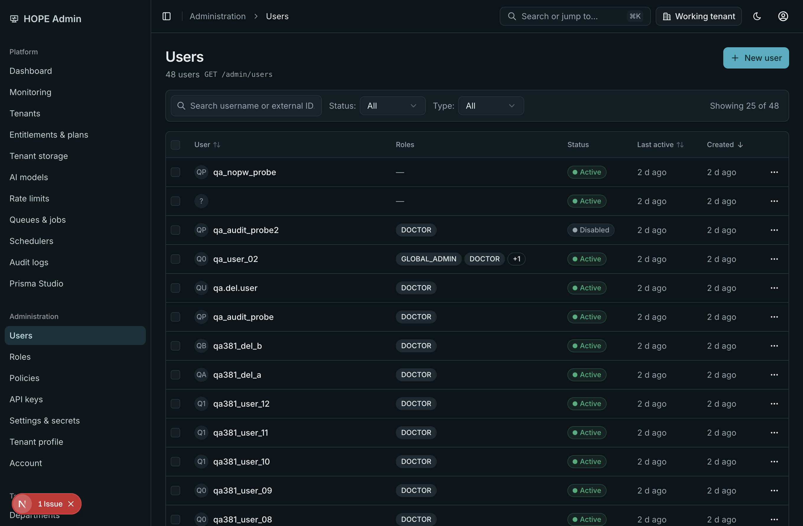
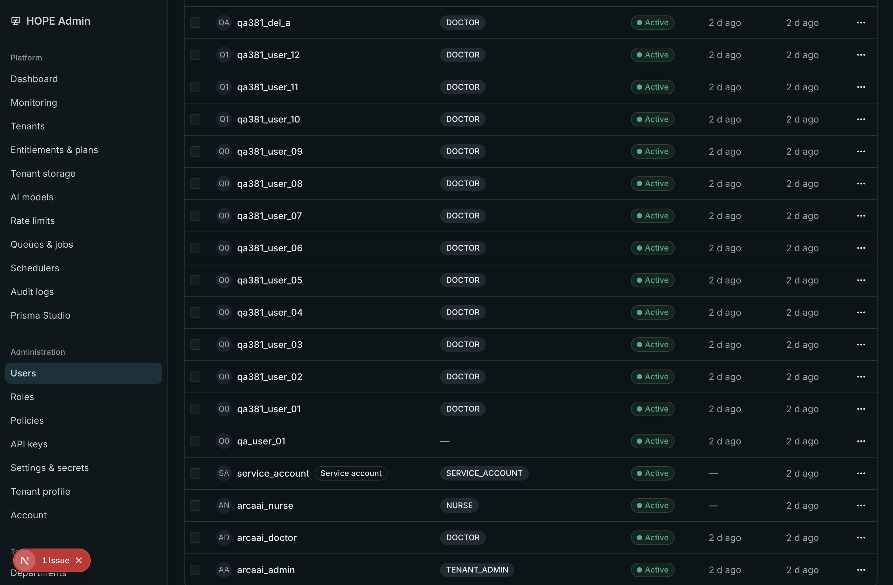
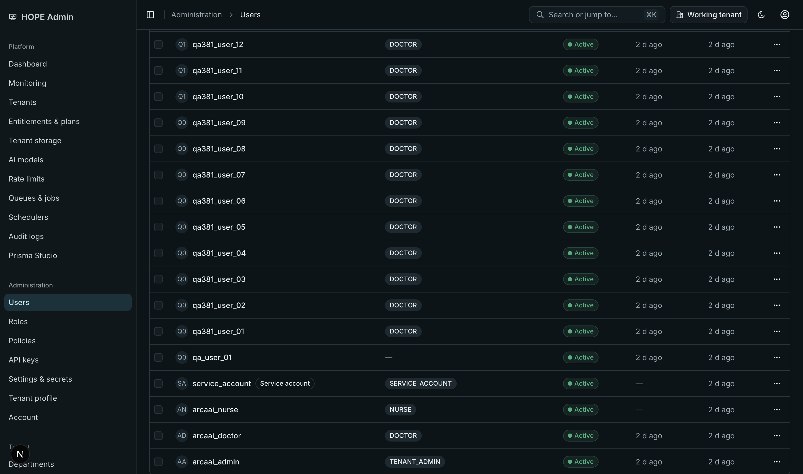
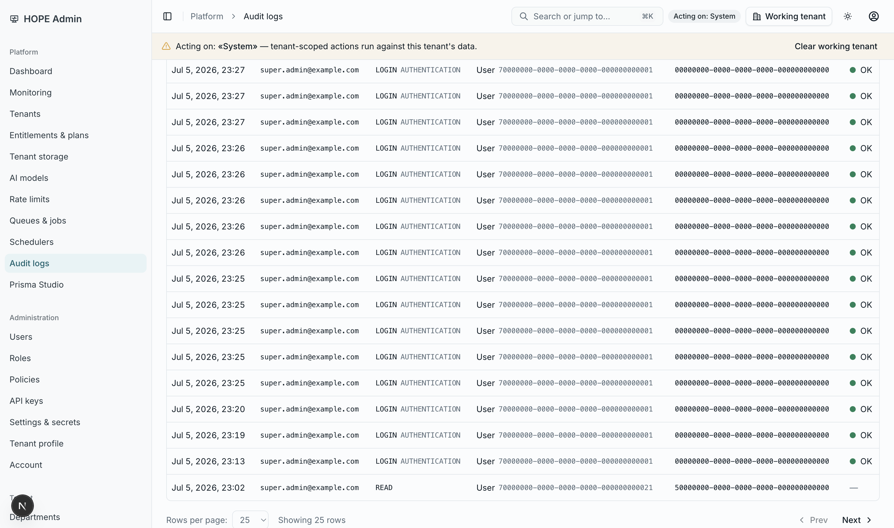

# BUG-004 — Admin Console: Page Header (Breadcrumb Topbar) Scrolls Away

| | |
|---|---|
| **Status** | Completed |
| **Type** | bugfix (UX-UI design rule violation) |
| **App** | `apps/admin-console` (Next.js 16, port 5176) |
| **Parent ticket** | [TASK-415 Hope Admin Console](../TASK-415-Hope-Admin-Console/README.md) |
| **Design reference** | Figma frame `07 - App Shell & Navigation` (topbar chrome), rule `11-ux-ui-principles.mdc`, rule `12-design-workflow.mdc` §4 (sticky chrome / WCAG 2.4.11) |
| **Reported** | 2026-07-05 by the user |

## Requirement Analysis

UX-UI design rule (stated by the user, binding for all console screens):

> The page header which contains the breadcrumb must always be at top. It MUST NOT be scrollable.

Interpretation: the app-shell chrome — the topbar (sidebar trigger, breadcrumb, ⌘K search, working-tenant switcher, theme toggle, account menu) **and** the session banners (Impersonation, "Acting on: «Tenant»") — must stay pinned at the viewport top while the page content scrolls. The banners are included because the capabilities matrix (row 16) specs the impersonation banner as *persistent*, and both are safety chrome an admin must never lose sight of mid-page.

## Current State Evaluation (root cause)

Reproduced on `/users` (48 seeded users, `scrollHeight` 1564 > viewport 891): scrolling ~400px removed the entire topbar from view while the sidebar stayed (the shadcn sidebar is `position: fixed`), leaving the content area with no chrome.

**Root cause** — two facts confirmed by runtime CSS inspection (CDP):

1. The window is the only scroll container: `SidebarProvider`'s wrapper is `min-h-svh` (grows with content) and `SidebarInset` computes `overflow-y: visible`, so long pages scroll the document.
2. Nothing pins the chrome: the `<header>` rendered by `src/shared/layout/site-header.tsx` computed `position: static`, and the session banners below it are plain in-flow strips. They all scroll away with the document.

This was a layout-composition gap in the TASK-415 shell (`src/app/(console)/layout.tsx`) — no screen-level code is at fault.

### Evidence (before)

| | |
|---|---|
|  |  |
| At scroll top: breadcrumb topbar visible | After ~400px scroll: topbar gone, sidebar orphaned |

## Implementation Plan

TDD, smallest change that enforces the rule, keeping the window as the scroll container (Next.js scroll restoration and scroll-to-top-on-navigation stay untouched — an inner `overflow-y-auto` shell would break both and require extra machinery):

1. **RED** — new Playwright spec `tests/e2e/app-shell.spec.ts`: at a 480px-tall viewport, scroll `/users` to the bottom and assert the breadcrumb stays in the viewport and the `<header>` box top stays at 0.
2. **GREEN** — in `src/app/(console)/layout.tsx`, wrap `SiteHeader` + `ImpersonationBanner` + `WorkingTenantBanner` in one `sticky top-0 z-40 bg-background` group (solid backdrop needed: the header is transparent and the banner tints are 10%-alpha).
3. **WCAG 2.4.11 (Focus Not Obscured)** — pair the new sticky chrome with `scroll-pt-32` on `<html>` (root layout) so keyboard-focus and anchor scrolls land clear of the pinned chrome (topbar 56px + up to two banners ≈ 122px worst case), per rule 11 §11 / rule 12 §4.
4. Verify: full admin-console Vitest, lint, `tsc --noEmit`, full Playwright E2E suite against the running stack, both themes in a driven browser.
5. Encode the invariant in `.cursor/rules/11-ux-ui-principles.mdc` (App Shell subsection + anti-pattern row) so future surfaces inherit the rule.

## Implementation Summary

### Files changed

| File | Change |
|---|---|
| `apps/admin-console/src/app/(console)/layout.tsx` | Topbar + session banners wrapped in a `sticky top-0 z-40 bg-background` chrome group (z-40 stays under portaled overlays at z-50) |
| `apps/admin-console/src/app/layout.tsx` | `scroll-pt-32` on `<html>` — focus/anchor scrolls clear the pinned chrome (WCAG 2.4.11) |
| `apps/admin-console/tests/e2e/app-shell.spec.ts` | New regression spec: chrome stays pinned while a long page scrolls (fails on the pre-fix layout, passes after) |
| `.cursor/rules/11-ux-ui-principles.mdc` | §1 gains "App Shell & Chrome" (pinned chrome invariant); anti-pattern row added |
| `.cursor/rules/README.md` | Changelog v6.3.3 |

### Evidence (after)

| | |
|---|---|
|  |  |
| Dark theme, `scrollY` 600: topbar pinned at `top: 0` | Light theme, `scrollY` 600 with working tenant set: topbar at 0, "Acting on" banner pinned right below (top: 56px) |

Runtime measurements after the fix (CDP, `/users` and `/audit-logs` scrolled to 600px): `headerTop: 0`, `bannerTop: 56`, chrome `position: sticky`.

### Verification (actual output)

- **RED run** (pre-fix): `app-shell.spec.ts` failed as designed — `expect(breadcrumb).toBeInViewport()` received `viewport ratio 0`.
- **GREEN run** (post-fix): `1 passed (2.1s)`.
- Unit tests: `Test Files 73 passed (73) · Tests 498 passed (498)`.
- Lint: `eslint src --max-warnings 0` clean. Types: `tsc --noEmit` clean. `next build` clean.
- Serial E2E subset (app-shell + dashboard + users): `5 passed` incl. both dashboard axe themes and the users-list light axe scan — the one failure and 3 skips were login-throttle artifacts (below), not screen regressions.
- Both themes verified in a driven browser (screenshots above).

**Full-suite E2E caveat (environmental, pre-existing):** the complete 112-test suite cannot run green against the **dev** gateway — `POST /auth/login` is throttled at 5/min (`@Throttle` in `auth.controller.ts`; `.env.dev` leaves `RATE_LIMIT_ENABLED` on), every spec logs in fresh, and the parallel run burns the budget within seconds (`ThrottlerException: Too Many Requests` at `loginAsAdmin`, confirmed in the failure artifacts; a serial re-run reproduced it deterministically — 5 passed, the 6th login of the minute throttled, remainder skipped). The suite is designed for the **test-env** API (`pnpm test:api:up`, `.env.test` sets `RATE_LIMIT_ENABLED=false`) — TASK-415's closure evidence (111 passed) was produced that way. The dev API on :8868 was the user's live terminal, so it was not restarted; re-running the full suite against a test-env gateway is the remaining (environment-only) step.

### Related observations (out of scope, not fixed here)

1. **`DataTable` sticky header is cosmetic-only**: `TableHeader` has `sticky top-0 z-10`, but the shadcn `Table` wraps it in an `overflow-x-auto` container, which makes that container — not the window — its scrollport. Since the container never scrolls vertically, the table header does not actually stick during page scroll (visible in the before-evidence screenshot). If frame 09's "muted sticky header" is meant literally, that needs its own ticket (viewport-bounded table regions).
2. **Tenant-scoped `/users` fetch degrades**: with a working tenant selected ("System"), the users screen showed "Internal server error (showing last loaded data)" from the list endpoint — backend surface, unrelated to this layout fix.
3. **Dev-only hydration warning** on `/login` (`Label` from `@arcaai/ui`, Next dev overlay); does not reproduce as a user-visible defect.

## Change History

| Date | Change |
|---|---|
| 2026-07-05 | Ticket created from user bug report. Root cause isolated (static-positioned chrome + window scroll container). RED spec written and observed failing; sticky chrome group + `scroll-pt-32` landed; spec GREEN. Unit 498/498, lint 0 warnings, types clean. Both themes verified in driven browser with working-tenant banner pinned. Rule 11 updated (App Shell & Chrome + anti-pattern), rules README v6.3.3. |
