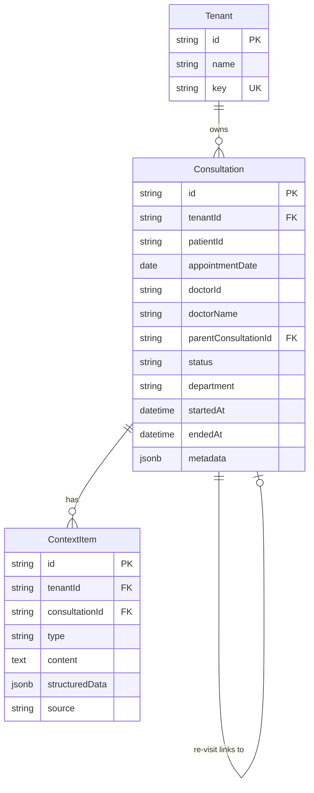

# Plan 01: Prisma Schema Changes


| Field             | Value        |
| ----------------- | ------------ |
| **Parent Ticket** | SDK-200      |
| **Phase**         | 1 - Database |
| **Created Date**  | 2026-01-11   |
| **Last Updated**  | 2026-01-11   |
| **Status**        | Completed    |


---

## Overview

This plan creates a minimal, focused database schema for the Agentic SDK V2:

1. **Remove Session entirely** - Unnecessary layer; Consultation is the top-level entity
2. **Remove legacy models** - `Session`, `SessionEvent`, `SessionSyncLog` and related enums
3. **Create simple Consultation domain** - Just 2 models: Consultation + ContextItem

## Design Principles

- **Minimal Models**: Only 2 models needed
- **No Unnecessary Layers**: No Session wrapper; Consultation is the entry point
- **Flexible Fields**: Use `metadata` JSON for extensibility
- **Simple Strings**: Avoid enums; use strings for status/type fields

## Key Business Rules

- **Unique Consultation**: `tenantId + patientId + appointmentDate + doctorId`
- **Visit Type Derivation**: `parentConsultationId = NULL` = new-visit, `!= NULL` = re-visit
- **Day Grouping**: Query by `patientId + appointmentDate` to get all consultations for a day

---

## Schema Changes Summary

### Models to DELETE


| Model            | Reason                                        |
| ---------------- | --------------------------------------------- |
| `Session`        | Unnecessary layer; Consultation is sufficient |
| `SessionEvent`   | Over-engineered; not needed                   |
| `SessionSyncLog` | Not needed                                    |


### Enums to DELETE


| Enum            | Reason               |
| --------------- | -------------------- |
| `SessionType`   | Removed with Session |
| `SessionStatus` | Removed with Session |


---

## New Schema Design (2 Models Only)

### 1. Consultation Model

**File**: `packages/database/src/prisma/db_main/consultation.prisma`

```prisma
// Consultation Domain Models
// Consultation is the top-level entity for SDK v2

model Consultation {
    // Meta fields (following BaseEntity pattern)
    metaData Json?  @map("_metadata") @db.JsonB
    version  Int    @default(1) @map("_version")
    id       String @id @default(uuid(7))

    // Multi-tenant
    tenantId String @default("50000000-0000-0000-0000-000000000000")

    // Patient & Date (for day grouping)
    patientId       String
    appointmentDate DateTime @db.Date  // Date only, no time

    // Doctor for this consultation
    doctorId   String
    doctorName String?

    // Visit linking: NULL = new-visit, NOT NULL = re-visit (follow-up)
    parentConsultationId String?

    // Status: active, paused, completed, cancelled
    status String @default("active")

    // Optional department/specialty
    department String?

    // Timestamps
    startedAt DateTime  @default(now())
    endedAt   DateTime?

    // Flexible metadata
    metadata Json? @db.JsonB

    // Resource status fields
    resourceStatus          ResourceStatusType @default(ENABLED)
    resourceStatusUpdatedAt DateTime?
    resourceStatusUpdatedBy String?

    // Audit fields
    createdBy String?  @default("60000000-0000-0000-0000-000000000000")
    updatedBy String?
    createdAt DateTime @default(now())
    updatedAt DateTime @updatedAt

    // Relations
    Tenant             Tenant         @relation("_Tenant_Consultations", fields: [tenantId], references: [id])
    ParentConsultation Consultation?  @relation("ConsultationChain", fields: [parentConsultationId], references: [id])
    ChildConsultations Consultation[] @relation("ConsultationChain")
    ContextItems       ContextItem[]  @relation("_Consultation_ContextItems")

    // Constraints - one consultation per doctor per patient per day
    @@unique([tenantId, patientId, appointmentDate, doctorId], name: "Consultation_unique_per_doctor")

    // Indexes
    @@index([tenantId], name: "Consultation_tenantId_idx")
    @@index([patientId], name: "Consultation_patientId_idx")
    @@index([appointmentDate], name: "Consultation_appointmentDate_idx")
    @@index([doctorId], name: "Consultation_doctorId_idx")
    @@index([parentConsultationId], name: "Consultation_parentId_idx")
    @@index([status], name: "Consultation_status_idx")
    @@schema("core")
}

model ContextItem {
    // Meta fields
    metaData Json?  @map("_metadata") @db.JsonB
    version  Int    @default(1) @map("_version")
    id       String @id @default(uuid(7))

    // Multi-tenant
    tenantId String @default("50000000-0000-0000-0000-000000000000")

    // Parent consultation
    consultationId String

    // Type: transcription, case_note, summary, pre_summary, audio_segment, etc.
    type String

    // Content
    content String @db.Text

    // Optional structured data (e.g., transcription segments, audio metadata)
    structuredData Json? @db.JsonB

    // Source: user, system, transcription, ai
    source String @default("user")

    // Resource status fields
    resourceStatus          ResourceStatusType @default(ENABLED)
    resourceStatusUpdatedAt DateTime?
    resourceStatusUpdatedBy String?

    // Audit fields
    createdBy String?  @default("60000000-0000-0000-0000-000000000000")
    updatedBy String?
    createdAt DateTime @default(now())
    updatedAt DateTime @updatedAt

    // Relations
    Consultation Consultation @relation("_Consultation_ContextItems", fields: [consultationId], references: [id])

    // Indexes
    @@index([tenantId], name: "ContextItem_tenantId_idx")
    @@index([consultationId], name: "ContextItem_consultationId_idx")
    @@index([type], name: "ContextItem_type_idx")
    @@index([source], name: "ContextItem_source_idx")
    @@index([createdAt], name: "ContextItem_createdAt_idx")
    @@schema("core")
}
```

### 2. Tenant Model Update

**File**: `packages/database/src/prisma/db_main/tenant.prisma`

```prisma
model Tenant {
    // ... existing fields ...

    // Relations (add this)
    Consultations Consultation[] @relation("_Tenant_Consultations")
}
```

### 3. Session File (DELETE)

**File**: `packages/database/src/prisma/db_main/session.prisma`

Delete this file entirely or replace with empty/comment.

---

## Entity Relationship Diagram



---

## Usage Examples

### Get all consultations for a patient on a day

```typescript
const consultations = await prisma.consultation.findMany({
  where: {
    tenantId: "...",
    patientId: "patient-123",
    appointmentDate: new Date("2026-01-11"),
  },
  include: { ContextItems: true },
});
```

### Create a new consultation (first visit)

```typescript
const consultation = await prisma.consultation.create({
  data: {
    tenantId: "...",
    patientId: "patient-123",
    appointmentDate: new Date("2026-01-11"),
    doctorId: "doctor-456",
    doctorName: "Dr. Smith",
    // parentConsultationId is NULL = new visit
  },
});
```

### Create a follow-up consultation (re-visit)

```typescript
const followUp = await prisma.consultation.create({
  data: {
    tenantId: "...",
    patientId: "patient-123",
    appointmentDate: new Date("2026-01-11"),
    doctorId: "doctor-789", // Different doctor
    doctorName: "Dr. Jones",
    parentConsultationId: firstConsultation.id, // Links to first visit
  },
});
```

---

## Migration Strategy

### Single Migration

```bash
cd packages/database
pnpm prisma migrate dev --name consultation_domain --schema=src/prisma/db_main/schema.prisma
```

This migration will:

- Create `Consultation` table with unique constraint
- Create `ContextItem` table
- Drop `Session`, `SessionEvent`, `SessionSyncLog` tables
- Drop `SessionType`, `SessionStatus` enums
- Add relation to `Tenant`

### Rollback Plan

```sql
-- Rollback consultation domain
DROP TABLE IF EXISTS "core"."ContextItem" CASCADE;
DROP TABLE IF EXISTS "core"."Consultation" CASCADE;
```

---

## Files to Create/Modify


| Action     | File Path                                                  | Description                |
| ---------- | ---------------------------------------------------------- | -------------------------- |
| **Delete** | `packages/database/src/prisma/db_main/session.prisma`      | Remove entirely            |
| **Create** | `packages/database/src/prisma/db_main/consultation.prisma` | Consultation + ContextItem |
| **Modify** | `packages/database/src/prisma/db_main/tenant.prisma`       | Add Consultations relation |
| **Auto**   | `packages/database/src/prisma/db_main/migrations/...`      | Generated migration        |


---

## Validation Checklist

- [x] Prisma schema validates without errors (`pnpm prisma validate`)
- [x] Database schema pushed successfully (`pnpm exec prisma db push`)
- [x] All indexes are created
- [x] Unique constraint works (tenant + patient + date + doctor)
- [x] Self-referential relation on Consultation works
- [ ] Rollback script tested
- [x] Run `pnpm prisma generate` to update client

---

## Comparison: Before vs After


| Aspect           | Before                                       | After                               |
| ---------------- | -------------------------------------------- | ----------------------------------- |
| **Models**       | Session, SessionEvent, SessionSyncLog        | Consultation, ContextItem           |
| **Total Models** | 3                                            | **2**                               |
| **Enums**        | SessionType, SessionStatus                   | **0**                               |
| **Layers**       | Tenant → Session → (medical data in Session) | Tenant → Consultation → ContextItem |
| **Complexity**   | High (25+ fields on Session)                 | **Low (focused models)**            |


---

## Next Phase

After completing this phase, proceed to **Plan 02: Domain Layer Changes** to create entities, factories, mappers, and repositories using the `@arcaai/tools` generators.