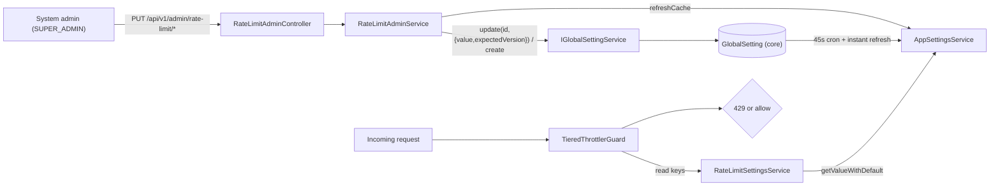

# TASK-316 — DB-Backed, Admin-Controlled Rate-Limit Configuration

| | |
|---|---|
| **Ticket** | TASK-316 |
| **Title** | DB-Backed, Admin-Controlled Rate-Limit Configuration |
| **Type** | feature |
| **Created** | 2026-05-29 |
| **Updated** | 2026-05-29 |
| **Status** | Completed |
| **Depends on** | [TASK-315 — Throttle Guard Not Wired](../TASK-315-Throttle-Guard-Not-Wired/README.md) |

---

## 1. Requirement Analysis

### Description
Make API rate-limit configuration **database-backed and live-editable by a system administrator**, with no redeploy. This mirrors the existing dynamic-scheduler pattern (`dna-regen.cron` / `dna-regen.enabled`): values live in the `GlobalSetting` key/value table, are cached by `AppSettingsService` (45s auto-refresh + instant `refreshCache()`), and the `TieredThrottlerGuard` resolves the effective limit/ttl **per request** from that cache.

### Business context
TASK-315 wired a working tiered throttler, but every limit was a code constant or a per-route `@Throttle` decorator value — tuning required a code change and a redeploy. Operationally, rate limits need to move with traffic conditions (incident response, abuse mitigation, partner onboarding). A system admin must be able to raise/lower a limit or flip a global kill-switch in seconds.

### Acceptance criteria
- [x] Rate-limit values (global on/off, per-tier baselines, per-endpoint overrides) are stored in `GlobalSetting` — **no migration, no new domain stack**.
- [x] A dedicated admin API (`/api/v1/admin/rate-limit`) lets a **system admin only** read and update the policy.
- [x] The throttler reads limits live per request; an admin write takes effect within the cache window (instant via `refreshCache()`) **without a restart**.
- [x] When no DB rows exist (or the settings service is absent), behavior is **identical to the TASK-315 baseline** (backward compatible).
- [x] Precedence is well-defined: global kill-switch → per-route disable → per-endpoint override → `@Throttle` decorator → tier DB baseline → static default.
- [x] Defaults are seeded for the platform tenant; per-route overrides are intentionally **not** seeded (absence = use the decorator).
- [x] Unit + integration tests cover the read accessor, the admin service, the live guard precedence, and the admin controller.

---

## 2. Current State Evaluation

### Existing code reviewed
| Area | File | Relevance |
|---|---|---|
| Tiered guard (TASK-315) | `apps/api/src/modules/throttle/tiered-throttler.guard.ts` | Extended to resolve limits live. |
| Static throttler config | `apps/api/src/modules/throttle/rate-limit-config.service.ts` | Remains the bootstrap fallback (`getThrottlers()`, env `skipIf`). |
| Throttle module | `apps/api/src/modules/throttle/throttle.module.ts` | Registers `ThrottlerModule` + guard; left as the static fallback. |
| Scheduler admin pattern | `packages/applications/src/services/queue-admin/scheduler-admin.service.ts` | Reference: `GlobalSetting` write + `refreshCache()` + DTO policy. |
| Settings cache | `packages/applications/src/services/baseServices/_meta/appSettings/appSettings.service.ts` | `getValueWithDefault`, `hasSetting`, `getFromCache`, `getValueFromCache`, `refreshCache`; flat-by-`key` cache; boot duplicate-key invariant; `GLOBAL_TENANT_ID = 50000000-…`. |
| GlobalSetting write path | `packages/applications/src/services/globalSetting/globalSetting.service.ts` | `update(id, { value, expectedVersion })` (optimistic lock) / `create(...)`. |
| Tenant-scope bypass | `packages/database/src/extensions/tenant-scope.ts`, `apps/api/src/database/tenant-context.provider.ts` | SUPER_ADMIN resolves CLS `tenantId → undefined`, so cross-tenant platform-row writes pass through (same as `TenantService.updateTenantConfigs`). |
| CASL authorization | `packages/applications/src/authorization/policy.engine.ts` | `manage all` is granted **only** by `system-full-access` (SUPER_ADMIN); tenant admins hold `manage GlobalSetting` scoped to their tenant. |

### Key findings / constraints
- **`GlobalSetting` is reusable as-is** → no migration required.
- **AppSettings cache is keyed by flat `key` across all tenants** → store exactly **one** authoritative row per key, under the platform tenant `50000000-…`, to keep lookups deterministic and avoid the boot duplicate-key invariant.
- **Authorization gap**: `manage GlobalSetting` is *not* sufficient — tenant admins have it (tenant-scoped). Platform-wide gateway limits must be gated to `manage all` (SUPER_ADMIN). **This is a deliberate deviation from the plan's `@Authorize(['manage','GlobalSetting'])`.**
- **Module wiring**: importing the DB-backed `RateLimitServiceModule` into `ThrottleConfigModule` would pull heavy DB dependencies into the standalone TASK-315 tests. Resolved by making the guard injection `@Optional()` and wiring `RateLimitServiceModule` at the **app-module** level instead. **Deviation from the plan's "import in throttle.module".**

---

## 3. Implementation Plan

(Plan of record: `.cursor/plans/db-backed_throttle_config_af10f9d5.plan.md`.)

Layer order, TDD throughout:
1. **`packages/applications` (read)** — constants + `RateLimitSettingsService` (`IRateLimitSettingsService`) over `IAppSettingsService` with static-default fallback.
2. **`packages/applications` (admin)** — `RateLimitAdminService` (`IRateLimitAdminService`): `getPolicy/setEnabled/setTier/setRoute` writing via `IGlobalSettingService` + `refreshCache()`, with validation.
3. **`apps/api` (guard)** — `TieredThrottlerGuard` injects `@Optional() IRateLimitSettingsService`, applies precedence; wire `RateLimitServiceModule` into `app.module`.
4. **`apps/api` (admin API)** — `RateLimitAdminController` (`/api/v1/admin/rate-limit`) + DTOs, gated to system admin; register in `app.module`.
5. **Seed (no migration)** — platform-tenant `rate-limit.*` rows (kill-switch + tier baselines).
6. **Tests** — settings unit, guard live-override integration, admin service unit, admin controller test.
7. **Docs** — this file.

---

## 4. Implementation Summary

### Key scheme (namespace `rate-limit`, platform tenant `50000000-0000-0000-0000-000000000000`)
| Key | Type | Meaning |
|---|---|---|
| `rate-limit.enabled` | Boolean | Global kill-switch (default `true`). |
| `rate-limit.tier.<default\|strict\|heavy\|relaxed>.limit` | Integer | Tier max requests per window. |
| `rate-limit.tier.<…>.ttl` | Integer | Tier window (ms). |
| `rate-limit.route.<routeId>.limit` | Integer | Per-endpoint max requests (override). |
| `rate-limit.route.<routeId>.ttl` | Integer | Per-endpoint window (ms) (override). |
| `rate-limit.route.<routeId>.enabled` | Boolean | Per-endpoint on/off (override). |

`routeId` is a stable slug (`auth.login`, `auth.refresh`, `auth.impersonate`, `health`, `monitoring`) mapped from the live controller class + handler name by `resolveRouteId()`.

**Seeded defaults** (tiers): `default 100`, `strict 10`, `heavy 20`, `relaxed 300`; all `ttl 60000`. Plus `rate-limit.enabled = true`. **Per-route override keys are not seeded** — absence means "fall back to the `@Throttle` decorator", so shipped behavior is unchanged until an admin opts a route in.

### Precedence (evaluated in `TieredThrottlerGuard.handleRequest`)
1. `rate-limit.enabled === false` → **allow/skip** (global kill-switch). (Env `RATE_LIMIT_ENABLED=false` remains a hard kill-switch via the module `skipIf`.)
2. Non-`default` tier with no `@Throttle` decorator → **skip** (TASK-315 opt-in preserved).
3. `rate-limit.route.<id>.enabled === false` → **skip** that route (default tier only).
4. Effective `limit`/`ttl` = first defined of: **per-endpoint DB override** → **`@Throttle` decorator value** → **tier DB baseline** → **static tier default**. Then `super.handleRequest({ ...requestProps, limit, ttl })`.



### Files created
| File | Purpose |
|---|---|
| `packages/applications/src/services/rate-limit/rate-limit.constants.ts` | Single source of truth: namespace, platform tenant id, tier names + `RATE_LIMIT_TIER_DEFAULTS`, `KNOWN_THROTTLED_ROUTES`, key builders, `resolveRouteId`/`isKnownTier`/`findKnownRoute`. |
| `packages/applications/src/services/rate-limit/IRateLimitSettingsService.ts` | Read accessor interface (`isEnabled`, `getTier`, `getRouteOverride`) + Symbol token + `RateLimitRouteOverride`. |
| `packages/applications/src/services/rate-limit/rate-limit-settings.service.ts` | Reads `IAppSettingsService` with static-default fallback. |
| `packages/applications/src/services/rate-limit/IRateLimitAdminService.ts` | Admin write interface + policy DTO types (`RateLimitPolicy`, tier/route policies, `RateLimitValueSource`). |
| `packages/applications/src/services/rate-limit/rate-limit-admin.service.ts` | `getPolicy/setEnabled/setTier/setRoute`; upsert via `IGlobalSettingService` + `refreshCache()`; positive-int + known tier/route validation. |
| `packages/applications/src/services/rate-limit/rate-limit.service.module.ts` | Provides + exports both services; imports `CommonServiceModule` + `GlobalSettingServiceModule`. |
| `packages/applications/src/services/rate-limit/index.ts` | Barrel. |
| `packages/applications/src/services/rate-limit/__tests__/rate-limit-settings.service.test.ts` | Read accessor unit tests. |
| `packages/applications/src/services/rate-limit/__tests__/rate-limit-admin.service.test.ts` | Admin write/validation/policy-source unit tests. |
| `apps/api/src/modules/admin-rate-limit/rate-limit-admin.controller.ts` | `/api/v1/admin/rate-limit` controller, `@Authorize(['manage','all'])`. |
| `apps/api/src/modules/admin-rate-limit/rate-limit-admin.module.ts` | Feature module; imports `RateLimitServiceModule`. |
| `apps/api/src/modules/admin-rate-limit/dto/rate-limit.dto.ts` | Request (`SetRateLimitEnabledRequest`/`…TierRequest`/`…RouteRequest`) + response (`RateLimitPolicyResponse`) DTOs. |
| `apps/api/src/modules/admin-rate-limit/dto/index.ts` | DTO barrel. |
| `apps/api/src/modules/admin-rate-limit/index.ts` | Module barrel. |
| `apps/api/src/modules/admin-rate-limit/__tests__/rate-limit-admin.controller.test.ts` | Controller unit test (mocked service). |
| `packages/database/src/prisma/db_main/seed/12-rate-limit-settings.ts` | Idempotent upsert of the platform `rate-limit.*` rows. |

### Files modified
| File | Change |
|---|---|
| `packages/applications/src/services/index.ts` | `export * from './rate-limit'`. |
| `apps/api/src/modules/throttle/tiered-throttler.guard.ts` | Injects `@Optional() IRateLimitSettingsService`; live precedence resolution (kill-switch, per-route disable, override > decorator > tier > default). |
| `apps/api/src/modules/throttle/__tests__/throttle-guard.test.ts` | Added "DB-backed live overrides" integration cases with a stub settings service. |
| `apps/api/src/app.module.ts` | Imports `RateLimitServiceModule` (into `common[]`) so the root `APP_GUARD` can inject the accessor; registers `RateLimitAdminModule` in `featureModules[]`. |
| `packages/database/src/prisma/db_main/seed/00-constants.ts` | Added `RATE_LIMIT_*` ids to `SEED_GLOBAL_SETTING_IDS` (`85000000-…-03xx`). |
| `packages/database/src/prisma/db_main/seed/index.ts` | Registers `seedRateLimitSettings` after `seedGlobalSetting` (Phase 4). |

### API surface
All routes under `/api/v1/admin/rate-limit`, `@ApiBearerAuth()`, gated to **SUPER_ADMIN** (`manage all`).
| Method | Path | Body | Returns |
|---|---|---|---|
| `GET` | `/` | — | `RateLimitPolicy` (enabled + tiers + known routes, each with `source: db\|code\|default`). |
| `PUT` | `/enabled` | `{ enabled: boolean }` | updated `RateLimitPolicy`. |
| `PUT` | `/tiers/:tier` | `{ limit?, ttl? }` | updated `RateLimitPolicy`. |
| `PUT` | `/routes/:routeId` | `{ limit?, ttl?, enabled? }` | updated `RateLimitPolicy`. |

### Migrations
**None.** Reuses the existing `GlobalSetting` table; config is added via the seed only.

### Deviations from plan
1. **Authorization**: gated with `@Authorize(['manage','all'])` (SUPER_ADMIN-only) instead of `['manage','GlobalSetting']`, because tenant admins hold the latter scoped to their tenant and must not retune platform-wide gateway limits.
2. **Module wiring**: `RateLimitServiceModule` is imported in `app.module.ts` (+ `RateLimitAdminModule`), **not** in `throttle.module.ts`. Combined with the guard's `@Optional()` injection, this keeps the TASK-315 standalone throttle tests hermetic (no DB dependency) while making the accessor available to the live gateway.

---

## 5. Verification

Evidence captured 2026-05-29:

- **Applications (rate-limit) unit tests** — `pnpm --filter @arcaai/applications vitest run src/services/rate-limit`
  ```
  Test Files  2 passed (2)
       Tests  18 passed (18)
  ```
- **API full unit suite** (regression check for the `app.module` wiring) — `pnpm --filter @arcaai/api vitest run`
  ```
  Test Files  78 passed | 2 skipped (80)
       Tests  1439 passed | 4 skipped (1443)
  ```
- **Database package typecheck** — `pnpm --filter @arcaai/database exec tsc --noEmit` → exit 0.
- **Lints** — `ReadLints` on all touched files → clean.

**Manual smoke (operator runbook):** seed → start API → `GET /api/v1/admin/rate-limit` (as SUPER_ADMIN) → `PUT /api/v1/admin/rate-limit/routes/auth.login {"limit":3}` → confirm the new login limit is enforced on the next requests, **without restart**.

---

## 6. Change History

| Date | Description | Files |
|---|---|---|
| 2026-05-29 | Initial implementation: DB-backed rate-limit read accessor + admin service (`packages/applications`), live `TieredThrottlerGuard` precedence, `/api/v1/admin/rate-limit` admin API, platform-tenant seed, and tests. SUPER_ADMIN-gated; no migration. | See §4. |
