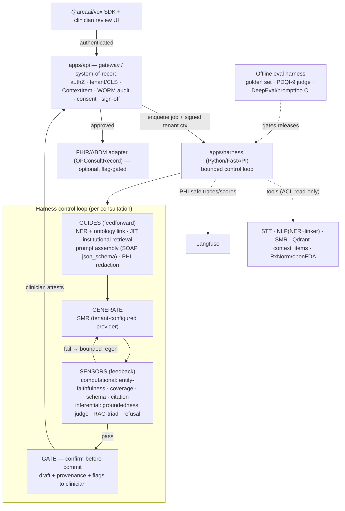

# TASK-330 — Clinical Documentation Harness (Harness-Engineering HLD)

| Field | Value |
|---|---|
| Ticket | TASK-330 |
| Title | Clinical Documentation Harness — applying Harness Engineering to the AI consultation / clinical-document build workflow |
| Type | research + high-level design (architecture) |
| Created | 2026-06-02 |
| Updated | 2026-06-06 (**v3** — codebase re-review post-TASK-331, SOTA reconciliation, **durability locked = Temporal**, detailed implementation plan) |
| Status | **In Progress** (Phases 0–3 + **Phase 6 (Harness Administration & Observability Console)** implemented + integrated-verified 2026-06-07; Phases 4–5 pending — see §9 + implementation-plan.md) |
| Scope | `apps/{stt,nlp,smr,api}` + new `apps/harness`; `packages/{agentic-sdk-v2,med-ner,applications,domains,database}`; infra `Qdrant` + `Langfuse` + **Temporal**; India `ABDM/FHIR` adapter |
| Research | Fully-cited research archive: [`research/clinical-harness/`](../../../research/clinical-harness/README.md) (8 docs, 182 sources) |
| Plan | Detailed phased implementation plan: [`implementation-plan.md`](./implementation-plan.md) |
| Interpretation | "Harness Engineering" = the 2026 AI-agent discipline (*Agent = Model + Harness*). "Build automation workflow" = the automated **clinical-document build pipeline** (transcribe → detect entities → summarize → assemble note → clinician sign-off), **not** Harness.io / CI-CD. |

> Phase-3 (Plan) document per `01-development-workflow.mdc`. The owner approved execution; **Phase 0
> foundation + corrective tickets landed 2026-06-06** (see §9). Remaining phases proceed per
> [`implementation-plan.md`](./implementation-plan.md).

---

## 0. What changed

### v3 (2026-06-06) — codebase re-review + SOTA reconciliation + implementation plan
Three review agents re-evaluated the **current** codebase (post **TASK-331**) and one research agent gathered the
**2026 implementation SOTA**; all six research reports are now archived with full citations in
[`research/clinical-harness/`](../../../research/clinical-harness/README.md). Net changes vs v2:
- **Durability/HITL locked = Temporal** (D11). Sign-off can lag hours/days → the loop must be a *resumable* durable
  workflow with zero-compute waits, SLA/escalation timers, and replay-grade audit. LLM/tool calls live in Temporal
  **Activities**; workflow code stays deterministic.
- **SOTA stack chosen** (D12): **Outlines+vLLM `guided_json`** / OpenAI Structured Outputs for schema enforcement;
  **Bespoke-MiniCheck-7B** as the self-hosted groundedness sensor; **Presidio + clinical NER → John Snow Labs** for
  PHI; **Llama Guard 3** for safety; **DeepEval + promptfoo** CI gates + **RAGAS** + **Epic's open-source PDSQI-9**
  LLM-judge; **Langfuse over OTel** with masking at *both* SDK and Collector. (See `06-sota-harness-implementation.md`.)
- **Faithfulness-judge strategy resolved** (was open #3): small judge **≤20B self-hosted via LM Studio** (priority),
  large judge via **Azure OpenAI / AWS Bedrock** — model-agnostic, honours D3.
- **Reconciled to current codebase** (new §3.4): TASK-331 added `SummaryMeta.promptResolvedFrom/resolvedPromptId`,
  dual-capture `AudioRecording.rawMediaId/processedMediaId`, `prompt-template-read` for `DOCTOR`, DNA-generate
  isolation, assembled-IDs default summary, and a tenant-scope drift guard. Confirmed still-missing: NER→prompt
  injection, activated SOAP schema, sensors, Qdrant ingestion, WORM/attestation/consent/lifecycle-status/FHIR-id/
  eval tables, Langfuse wiring. `AuditLog` exists but is **mutable (not WORM)** with no `ATTEST` action.
- **Detailed implementation plan added** as [`implementation-plan.md`](./implementation-plan.md) (phased, TDD,
  layer order, concrete file touch-points).

### v2 (2026-06-02)

v1 was the initial research + HLD. v2 **locks the design** against an interactive brainstorm (10 decisions, §1.4)
and **5 parallel deep-research agents** focused on the medical domain + harness engineering for medical
applications (ambient clinical documentation, medical knowledge grounding, clinical evals/governance, India
regulation, clinical interoperability/tool-calling — folded into §2.5–2.9). The biggest changes:

- **Topology decided**: a **dedicated Python/FastAPI orchestrator `apps/harness`** (services-as-tools via ACI),
  not a module inside `apps/api`.
- **Grounding narrowed** to **internal faithfulness + institutional (tenant-owned) knowledge** — which neatly
  sidesteps the external-corpus licensing minefield (StatPearls is non-commercial; UpToDate/DynaMed proprietary).
- **Governance is now India-first** (DPDP Act 2023 + Rules 2025, ABDM/NRCeS FHIR, Telemedicine Guidelines 2020,
  CDSCO non-device line) on a multi-region common-denominator baseline.
- Added **component breakdown, data flow, error-handling/degradation, governance, and testing/eval** sections.

---

## 1. Requirement Analysis

### 1.1 Description
Apply harness-engineering techniques to make the **full AI consultation product flow as built today** — *open
consultation → record → live transcript → NER → summarize → review/edit/approve → DNA personalization* —
**best-practice**, optimised for **clinical accuracy & safety** with **grounded, provenance-backed** notes.

### 1.2 Business context
The dominant quality risks in clinical documentation are **omission** (the single most frequent error, and the
hardest for a human reviewer to catch — it needs *recall*, not *recognition*), **hallucination/fabrication**
(highest-harm: fabricated meds/doses/labs), and **lack of provenance**. Peer-reviewed 2024–26 evidence (§2.5)
shows clinician proofreading alone is a *weak* safeguard. Harness engineering is the discipline that turns a
probabilistic model into a dependable, verifiable, auditable system — i.e. HOPE's value is in the **harness**
(automated grounding/coverage checks, linked evidence, attestation gates, audit, monitoring), **not the model**.

### 1.3 Acceptance criteria (for this design)
- Grounded, source-cited definition of harness engineering + the medical-domain techniques relevant to HOPE.
- A business-flow review with a harness reading + best-practice per flow.
- A target HLD ("Clinical Documentation Harness") as a **dedicated orchestrator** reusing existing services as
  tools, with the four use cases mapped to concrete services/files.
- Components, data flow, error-handling/degradation, **India-first governance**, and testing/eval strategy.
- A phased roadmap, success metrics, risks, and the **resolved + remaining** decisions.

### 1.4 Locked design decisions (brainstorm)
| # | Decision | Choice | Design implication |
|---|---|---|---|
| **D1** | Scope | Full AI consultation product flow as built, made best-practice | lifecycle + context assembly + DNA + documentation harness |
| **D2** | Primary driver (tie-breaker) | **Clinical accuracy & safety** | sensors/grounding > latency/automation when they conflict |
| **D3** | Deployment / PHI residency | **Tenant-configurable** cloud *or* on-prem | harness must be **model-agnostic**, degrade gracefully on local models |
| **D4** | Control posture | **Mandatory clinician sign-off; AI never auto-finalizes** | HITL is an **architectural** confirm-before-commit gate, not a prompt |
| **D5** | Grounding | **Internal faithfulness + institutional** (tenant-owned) knowledge | no external public corpora → **no licensing exposure** |
| **D6** | Regulatory | Multi-region common-denominator, **India-first** | DPDP/ABDM/Telemedicine/CDSCO + HIPAA/EU-AI-Act baseline, region-configurable |
| **D7** | Tool-calling | **Bounded, read-only, cited, advisory** | drug/allergy + terminology + prior-visit lookup; never auto-applied |
| **D8** | Sequencing | **Eval harness first** | golden set + judge + CI gates *before* any model/prompt change |
| **D9** | Topology | **Dedicated orchestrator service** (ACI) | `apps/harness`; reuse STT/NLP/SMR as tools; propagate tenancy/authZ |
| **D10** | Orchestrator stack | **Python / FastAPI** | co-locate the ML control stack; `apps/api` = gateway + system-of-record |
| **D11** | Durability / HITL layer *(v3)* | **Temporal** | resumable durable workflow; signal-based confirm-before-commit; SLA/escalation timers; replay audit. LLM/tool calls in Activities; adds a Temporal server/cluster to ops |
| **D12** | Eval/guardrail/judge stack *(v3)* | **Adopt SOTA** (see §0/§4.3) | Outlines/OpenAI structured outputs · Bespoke-MiniCheck-7B · Presidio→JSL · Llama Guard 3 · DeepEval/promptfoo/RAGAS + Epic PDSQI-9; judge ≤20B via LM Studio, large via Azure/Bedrock |

---

## 2. Research

### 2.1 The three-layer evolution → `Agent = Model + Harness`
| Layer | Answers | Era |
|---|---|---|
| Prompt engineering | "What do I *say* this turn?" | 2022–24 |
| Context engineering | "What *information lands in the window* before it reasons?" | 2025 |
| **Harness engineering** | "What happens *around* the model — loop, tools, checks, memory, gates — and **what happens when it's wrong**?" | 2026 |

The harness is *everything in an agent that isn't the model*: orchestration loop, tool definitions, retries,
context pipeline, validation, memory, permissions, observability. Term coined by **Mitchell Hashimoto** (Feb
2026), formalised by **Birgitta Böckeler / Martin Fowler**
([martinfowler.com](https://martinfowler.com/articles/harness-engineering.html), Apr 2026), building on
Anthropic's and OpenAI's agent-engineering work.

### 2.2 Böckeler's control model — *the mental model to adopt*
A harness is a **cybernetic control system**: two control types × two implementation styles. Maps cleanly onto
a regulated medical workflow:

|  | **Guides** (feedforward — *before* the model acts) | **Sensors** (feedback — *after* the model acts) |
|---|---|---|
| **Computational** (deterministic, fast, cheap) | JSON schema, department template, allowed-tool list, system prompt | Schema validators, **entity-faithfulness (NER↔note)**, coverage/omission check, citation-presence, drug/dose rules |
| **Inferential** (LLM-based, semantic) | Retrieved institutional guidelines injected as context, few-shot exemplars | **LLM-as-judge**, NLI/entailment faithfulness, completeness-vs-template |

Two theses that drive HOPE's sequencing:
- *"Once you have something objective, a formal deterministic check gives more assurance than human review."* → prefer **computational sensors**.
- *"A weak harness means better prompts just produce more sophisticated bugs."* → **build verification first** (= D8).

### 2.3 Anthropic building blocks ([Building effective agents](https://www.anthropic.com/engineering/building-effective-agents))
**Do the simplest thing that works; workflows beat autonomous agents for well-defined, high-stakes tasks.**
Augmented LLM · prompt chaining · routing (by department) · parallelisation · orchestrator–workers ·
**evaluator–optimizer** (generate→critique→regenerate, the key accuracy pattern) · autonomous agent (sparingly) ·
**ACI** (invest in tool docs/schemas as much as prompts; *poka-yoke* them).

### 2.4 Context engineering ([Effective context engineering](https://www.anthropic.com/engineering/effective-context-engineering-for-ai-agents))
"Context rot" → smallest set of high-signal tokens. A 30–45 min consult exceeds the window → **compaction**,
**structured note-taking** (persist state outside the window), **sub-agents**, **just-in-time retrieval**.

### 2.5 Clinical evidence — ambient documentation accuracy & trust
*(AI-scribe research agent; peer-reviewed 2024–26)*
- **Omissions are the #1 error and the hardest to catch** — they require reviewer *recall*. Simulated-encounter
  study: 127 errors across 70% of draft notes (Mayo Clinic Proc: Digital Health 2025). Prospective pilot: omissions
  18%, hallucinations 11.5%, **~4–5% of notes carried potential for serious harm** (JMIR Med Inform 2026).
- **Hallucinations 20–31% of notes**; highest-harm class = fabricated/omitted **meds, doses, test results**,
  often propagated from ASR mis-recognition (Frontiers in AI 2025; Mayo 2025).
- **Clinician proofreading is a weak primary safeguard** — the literature's strongest single message.
- **Provenance is the trust mechanism**: Abridge **Linked Evidence** maps each note phrase → transcript span →
  replayable audio. Per-claim groundedness ("read like a code review") builds clinician trust.
- **Value/justification**: NEJM AI RCT 2025 — Nabla cut note time 9.5%; both vendors reduced burnout. JAMA Netw
  Open — burnout 51.9%→38.8%. But burden-reduction **does not** reduce the safety obligation.
- **Disclosure & provenance law**: CA **AB-3030** requires an AI-disclosure line that **survives export**;
  **USCDI v4 (2026)** makes **FHIR Provenance** a required data class.
- **→ HOPE**: make **NER the grounding layer**; build **Linked-Evidence** review UI; add an explicit
  **coverage/omission** check; **attestation gate** stamping model+version; instrument the **edit/correction loop**.

### 2.6 Knowledge grounding & ontology — and the licensing reality
*(clinical-RAG research agent)*
- **D5 (internal+institutional) is the licensing-safe choice.** Only **PubMed/MEDLINE + PMC-OA (CC-BY) + CDC +
  ICD-11 codes** are clearly commercial-usable; **StatPearls is CC BY-NC-ND** (no commercial/derivative use);
  **UpToDate/DynaMed are proprietary**. Tenant-owned approved guidelines/protocols/formulary avoid all of this.
- **Embedding-dimension fact**: the provisioned `context_items` collection is **1536-dim** → fits OpenAI
  `text-embedding-3-small` (clean baseline for institutional docs, **no migration**). MedCPT/BioLORD (768-dim)
  would need a *new* collection — defer unless we add biomedical-literature retrieval later.
- **Retrieval gold standard**: **hybrid BM25 + dense → RRF (k≈60) → cross-encoder rerank** top-50→~8; recursive
  **400–512-token chunks, 10–20% overlap**, rich metadata (source, section, date, code tags).
- **Ontology linking**: **scispaCy + UMLS** (fast start) → **MedCAT v2** (production SNOMED/UMLS); map spans →
  **UMLS CUI** → SNOMED CT / RxNorm / LOINC / ICD. Requires a (free) **UMLS license**.
- **Faithfulness**: **RAG triad** (context relevance, groundedness, answer relevance) + **ASTRID** refusal +
  **StrictCitations** (cite a chunk ID per claim) + **verify-citations** post-hoc (MedCite); MEGA-RAG reports
  **>40% hallucination reduction**. Watch numeric claims (doses/percentages/dates) — they hallucinate most.

### 2.7 Evaluation, guardrails & governance
*(medical-AI evals/governance research agent)*
- **No single tool is clinical-grade**; combine **DeepEval/promptfoo in CI** (regression + red-team gates) +
  **Langfuse** (already staged — LLM-as-judge on production traces) + **Arize Phoenix** (drift/post-market).
- **Validated clinical-note QA path**: clinician **golden set** scored against the **PDQI-9 / PDSQI-9** rubric;
  a **reasoning LLM-as-judge** reached **ICC ≈0.82** vs 7 clinicians (npj Digital Medicine 2025) — validate the
  judge (ICC ≥0.8 / Gwet AC2) before trusting it.
- **HITL = architectural gate, not a prompt** (confirm-before-commit, outside the model so injection can't bypass).
- **Audit is a hard requirement**: immutable/WORM log capturing **model *version*** (not just name), prompt/
  template version, citations, guardrail decisions, and **clinician accept/edit/reject + rationale**; retain
  **≥6 yr** (HIPAA §164.530(j)), surfaceable on demand (EU AI Act Art. 12).
- **Guardrails** (replace SMR's regex): **PHI redaction** (Presidio/GLiNER via NeMo Guardrails), groundedness/
  entailment, **schema enforcement** (Guardrails AI), a self-hosted **Llama-Guard-class** unsafe-advice filter —
  all **runnable locally** (no PHI egress; honours D3).
- **Regulatory line (unanimous)**: a **documentation drafter with mandatory clinician authorship/sign-off = NOT a
  regulated device** (US FDA enforcement discretion). The instant a feature **"drives/informs clinical
  management"** (diagnosis, CDS, auto-coded billing Dx) it trips **FDA SaMD + GMLP + PCCP**, **EU AI Act high-risk**
  (Annex I via MDR; long-stop **2 Aug 2028**), **UK DCB0129/0160**. → keep such features on a separate flag-gated
  regulated roadmap.

### 2.8 India-first regulatory & interoperability
*(India research agent + interoperability/tool-calling agent)*
- **DPDP Act 2023 + Rules 2025** (notified 13–14 Nov 2025; ~18-month phase-in): standalone **purpose-specific
  consent** notice + **withdrawal**; **72-hr breach** report to the Data Protection Board; likely **Significant
  Data Fiduciary** status for large health-data processors → **annual DPIA + audit + algorithmic-risk** review and
  possible **data-localization** of specified categories; **Consent Manager must be India-incorporated**;
  healthcare is **exempt** from children's-data parental-consent when limited to providing the health service.
  HOPE is most likely a **Data Processor** to tenant **Data Fiduciaries** → ship a **DPA** + sub-processor
  disclosures + "no PHI for training without consent".
- **ABDM / NRCeS FHIR** (voluntary today; effectively mandatory for AB-PMJAY/insurance): emit the signed note as a
  FHIR R4 **`OPConsultRecord`** Composition (SNOMED `371530004`) inside a `DocumentBundle` (**Composition first**),
  with **ABHA** (Patient), **HPR** (author), **HFR** (custodian), encounter, consent-artefact IDs; federated India
  storage; consent-gated exchange via HIE-CM. **Capture these identifiers in the schema now; flag-gate the exchange.**
- **Telemedicine Practice Guidelines 2020**: **recorded consent** (explicit if clinician-initiated), RMP + patient
  identification, durable record/prescription retention (~**3 yr**).
- **CDSCO MDR 2017 + Draft MDS Guidance (21 Oct 2025)**: a pure **documentation/scribe/storage aid is explicitly
  *not* a device**; **non-autonomous (aid-only)** + human sign-off keeps HOPE non-device — *until* output drives
  diagnosis/CDS → **SaMD Class A–D** + Algorithm Change Protocol.
- **MeitY AI Governance Guidelines (Nov 2025)** + healthcare **SAHI/BODH (Feb 2026)**: human oversight, transparency,
  clinical validation, continuous monitoring, grievance redressal.
- **Interop/tool facts**: the **NLM Drug-Drug-Interaction API is dead (since Jan 2024)** → use **RxNorm normalize →
  openFDA label → parse `drug_interactions`**; **DrugBank free checker retired Mar 2026**; **SMART on FHIR v2.2**
  (PKCE) is required for ONC; LLM→FHIR quality gate = **terminology retrieval → schema-constrained decoding → FHIR
  validator repair loop (≤3 passes)**.

### 2.9 Convergent conclusions (the design spine)
1. **Omissions > hallucinations**, and proofreading is weak → the harness must run **automated coverage +
   faithfulness** checks; the **NER↔note entity diff** (pinning meds/doses/labs/allergies/numbers to transcript
   spans) is the highest-leverage control.
2. **Provenance is trust** → every clinical claim links to a transcript span or cited chunk; unverified claims
   float to the top of the review queue.
3. **Eval-first is validated** (golden set + PDQI-9 + reasoning-judge ICC≈0.82 + CI gates) — and matches D8.
4. **HITL is architectural** + attestation + **WORM audit** (one log satisfies HIPAA, EU Art. 12, DPDP, SAHI).
5. **The non-device line is load-bearing** across US/EU/India — documentation aid + mandatory sign-off stays
   non-device; decision-support is a separate regulated track.

---

## 3. Current State Evaluation

**Headline: HOPE already implements ~60% of an agent harness — it just isn't *organised* as one, and three
layers are missing (sensors/verification, knowledge-grounding, eval harness).**

### 3.1 Harness primitives that already exist (reuse, don't rebuild)
| Harness concept | Where it lives in HOPE today |
|---|---|
| **Orchestration loop** | BullMQ jobs + Redis + SSE (`consultation-job.service.ts`, `summary.processor.ts`); SMR `task_manager` + SSE |
| **Memory / structured notes** | `ContextItem` + `ContextItemVersion` (`RAW_SUMMARY` / `MODIFIED_SUMMARY`, `approved`) |
| **Feedback loop** | DNA writing-style: approved/edited summaries → `DnaWritingStyleProcessor` → injected via `/text/generate/assembled` |
| **Context assembly** | `ContextService` (consultation chain + same-day linked); `previous_visit_service` (pre-summary) |
| **Guides (computational)** | **`PromptAssemblyService` + `PromptResolutionService`**: tiered template resolution, variable substitution incl. `{style_DNA_*}`, builds system+user prompt + hyperparameters + JSON schema |
| **Structured-output guide (unused)** | SMR supports `response_format: {type: json_schema}` (Azure `json_schema` / Ollama `format`) — **not used by the summary processors** (structured SOAP is low-lift) |
| **Embryonic sensors** | SMR `guardrails.py`/`external_guardrail.py` (regex), `generation_audit`, circuit breaker, JSON-repair; **STT hallucination heuristics** (RMS, short-word-count, filler regex) |
| **Orchestration primitive (unused)** | `packages/pipeline` **`PipelineOrchestrator`** (`register`/`connect`/`execute`) — built, not wired in prod |
| **Governance** | Per-job authZ, 4-layer tenant isolation + CLS, idempotency keys, cancellation/AbortController, SMR error→typed-code mapping |
| **Observability** | OTel + Prometheus + Grafana; **Langfuse** staged in deployment research |
| **Vector infra** | **Qdrant**: `stt_speaker_embeddings` (active) **+ a `context_items` 1536-dim cosine collection already provisioned (tenant/consultation/type-filtered) but unused** — ready for the institutional-knowledge pipeline |

### 3.2 Flow-by-flow review + best-practice recommendations
| # | Business flow | What exists | Harness reading | Recommended best practice |
|---|---|---|---|---|
| F1 | **Consultation lifecycle** (open/record/close/reopen, revisit chains) | `consultation.service` + lifecycle endpoints (TASK-322); idempotent transitions | Session/episode boundary for the loop + memory scope | Promote lifecycle `status` to a first-class state machine; emit lifecycle events as harness checkpoints |
| F2 | **Realtime transcription** | STT (Whisper/NeMo/Azure, Silero VAD, Pyannote+Qdrant); on-device Vox pipeline | Ingestion **guides** (VAD/noise/diarization gating) | Gate low-confidence/low-SNR segments before summarization; stream partials into incremental state (UC-1) |
| F3 | **NER / entity detection** | NLP `blaze999/Medical-NER`, diagnosis suggester; `@arcaai/med-ner`; Entity-Validate (TASK-261) | Standalone extractor → **should also be a computational sensor** | Add **ontology linking** (UMLS/SNOMED/ICD/RxNorm); entities drive retrieval, faithfulness, structure |
| F4 | **Summarization** (sync + async) | SMR multi-provider, templates, structured JSON, SSE, guardrails | Single-shot generate. **No grounding, no regen-on-fail** | Wrap in **evaluator-optimizer** driven by sensors; institutional grounding + citations |
| F5 | **DNA writing-style** | Learns from approved/edited; injects style; corpus = approved versions (TASK-299 D-11) | Real **feedback loop + memory** — keep | **Separate *style* from *facts***; never learn to suppress safety content (meds/sections) |
| F6 | **Context assembly** | Chain + same-day linking; ContextItem versioning | **Context-engineering** substrate | Just-in-time retrieval + compaction; rank prior context, don't dump history |
| F7 | **Pre-summary** | `previous_visit_service` (vitals/labs/prior visits) | Prompt-chaining precursor | Ground pre-summary facts to the record; mark inferred claims unverified |
| F8 | **TTS** (port 8863) | Text-to-speech | Output channel | Out of core scope; could read back the *approved* note only |
| X | **Cross-cutting** (tenancy/PHI, auth, observability, idempotency) | Strong (TASK-305/306/317, TASK-299) | Harness **governance + observability** | PHI-safe Langfuse traces, per-step spans, redaction, tenant-scoped knowledge, **WORM audit + consent** |

> **Notable misconfig (separate fix):** the NLP doc-type text-classifier is wired to an *emotion* model
> (`michellejieli/emotion_text_classifier`) — a placeholder. Small corrective ticket; doesn't block this design.

> **Wiring fact:** NER entities are extracted/stored as `NamedEntity` (`ner.processor.ts`) but **never injected
> back into the summarization prompt**. The injection point exists: `PromptAssemblyService.buildVariables()` —
> the cheapest path to both grounding *and* the faithfulness sensor (UC-2).

### 3.3 The three missing layers
1. **Sensor / verification** — nothing checks a note is *faithful* to the transcript/evidence. (Biggest accuracy gap.)
2. **Knowledge-grounding** — no institutional RAG, no citations/provenance. The Qdrant `context_items` collection
   (1536-dim) is **provisioned but empty** — only the ingestion/retrieval pipeline is new (lower lift than greenfield).
3. **Eval harness** — no golden set, no faithfulness/coverage metrics, no regression gate. (Böckeler: build *first*.)

### 3.4 Reconciliation with current codebase (v3 — post-TASK-331 re-review)
Three review agents confirmed §3.1–3.3 and pinned the exact integration points + governance deltas:

**TASK-331 baseline now in place (build on it):**
- `SummaryMeta.promptResolvedFrom` + `resolvedPromptId` (migration `20260603175719_add_summary_meta_prompt_tier`) —
  the start of a prompt-tier audit trail the harness WORM record extends.
- `AudioRecording.rawMediaId` + `processedMediaId` — dual-capture infra usable for transcript-faithfulness checks.
- `prompt-template-read` policy added to `DOCTOR` (`seed/03-role.ts`) → clinicians can select templates at the gate
  without admin privilege (prereq for the Gate adapter).
- `assertActingAsDoctor()` on DNA generate + default summary via `/text/generate/assembled` (IDs, not raw text) —
  closes PHI-in-prompt / ownership-bypass risks the sensor layer depends on.
- Schema-derived **tenant-scope drift guard** (`TENANT_SCOPED_MODELS`) — any new governance table must be
  consciously triaged or tests fail (prevents silent tenancy gaps).

**Confirmed still-missing (the work):**
| Area | Exact finding | Touch-point |
|---|---|---|
| NER→prompt injection | `PromptAssemblyService.buildVariables()` has no NER slot; `PromptAssemblyParams` has no `nerEntities` | `prompt-assembly.service.ts` + `summary.processor.ts` query `NamedEntityRepository` |
| Structured SOAP | `json_schema` wired end-to-end (all 4 SMR providers) but **never activated** — no template seeds `metaData.promptConfig.outputSchema` | seed a SOAP schema; `smr-generate.ts:112`, `prompt-assembly.service.ts:97` |
| Sensors | zero faithfulness/grounding/coverage code anywhere; no `apps/harness` | new service |
| Qdrant `context_items` | 1536-dim cosine + indexes provisioned; **zero ingestion/retrieval**; `ContextItem.qdrantSynced` flag never read | new ingestion job |
| WORM audit | `core.AuditLog` exists but **mutable** (`resourceStatus` soft-delete), `data/previousData` untyped JSON, **no `ATTEST`/`CONSENT_*`/`BREACH_*` actions** | append-only table or constrained extension |
| Attestation | no `Attestation` model, no hash, no `APPROVED_NOTE`/`SIGNED_NOTE` ContextItemType; `approveSummary` only writes `ContextItemVersion changeReason='approved'` | new |
| Lifecycle status | no `ConsultationStatus` enum; status is an untyped string in `Consultation.metadata` | new enum + column |
| NER ontology | `NamedEntity` has `normalizedText`/untyped `metadata` but **no `umlsCui`/`snomedCode`/`rxnormCode`/`icdCode` columns and no transcript-span FK** (the faithfulness sensor's primary join) | schema + linker |
| FHIR identifiers | no `abhaId`/`hprId`/`hfrId`/`fhirEncounterId`/`abdmConsentArtefactId` columns | additive nullable columns day 1 |
| Eval storage | no `GoldenSet`/`EvalRun`/`JudgeResult` tables | new |
| Langfuse / evals | Langfuse deployed (VM 400) but **no SDK calls** in any service; DeepEval/promptfoo/RAGAS absent | wire in harness/SMR |
| NLP misfires | doc-type classifier defaults to `michellejieli/emotion_text_classifier`; STT Qdrant vectorstore source files deleted (`.pyc` only) → diarization in-memory/session-scoped | small corrective tickets |

---

## 4. Proposed HLD — the "Clinical Documentation Harness"

### 4.1 Topology (D9 + D10)
A dedicated service — **`apps/harness` (Python/FastAPI)** — owns a **bounded control loop** (Böckeler
*guides→generate→sensors→gate*; Anthropic *workflow, not autonomous agent*) and orchestrates existing services
**as tools** via a clean ACI. The loop runs as a **Temporal durable workflow** (D11): each guide/generate/sensor is a
Temporal **Activity** (non-deterministic LLM/tool calls), the workflow body stays deterministic, and the **gate is a
`wait_condition()` on a clinician-approval Signal** — so a 3-day sign-off consumes zero compute, survives
deploys/crashes by replaying Event History, and yields a replay-grade audit trail. **`apps/api` stays the gateway +
system-of-record**: authentication, tenant/CLS
resolution, BullMQ enqueue, Postgres (`ContextItem`/versions), the **WORM audit log**, consent, and the HITL
sign-off endpoints. Tenancy + per-job authZ are **propagated** to the harness via signed context — never rebuilt.



### 4.2 Design principles
1. **Workflow over autonomy** — prompt-chaining + routing(by department) + bounded tool-use + evaluator-optimizer, hard step cap.
2. **Sensors before prompts** (D8) — NLP NER is the primary **computational faithfulness sensor**.
3. **Accuracy & safety first** (D2) — every degradation path collapses toward *more human review*, never auto-accept.
4. **Model-agnostic** (D3) — the loop works on cloud *or* local; sensors/guardrails don't depend on a frontier model.
5. **Grounding = internal + institutional** (D5) — faithfulness to transcript/prior-context + tenant-owned approved knowledge; no claim without provenance.
6. **AI never finalises** (D4) — the gate is architectural, outside the model; attestation is the legal record.
7. **Observability + evals first-class** — PHI-safe Langfuse spans per step; offline eval gates releases.

### 4.3 Component breakdown
**`apps/harness` internal modules**
| Module | Responsibility | Default (v3 SOTA) |
|---|---|---|
| **Durability / HITL** | Temporal workflow; steps = Activities; gate = `wait_condition()` on approval Signal; SLA/escalation timers; Event-History replay audit | **Temporal** (D11) |
| **Loop controller** | guide→generate→sense→gate; bounded retries; 1 Langfuse span/step | evaluator-optimizer (deterministic workflow) |
| **Tool clients (ACI)** | narrow Pydantic-typed contracts for STT, NLP, SMR, Knowledge, Drug-safety | one purpose each |
| **Guide: entity+ontology** | NLP NER → UMLS CUI → SNOMED/RxNorm/LOINC/ICD; keep transcript offsets | scispaCy+UMLS → MedCAT v2 |
| **Guide: JIT retriever** | hybrid BM25+dense over tenant `context_items`, RRF, rerank → top-k | text-embedding-3-small @1536 |
| **Guide: prompt assembler** | reuse `PromptAssemblyService` contract + DNA + evidence + entities → **SOAP schema** | **Outlines+vLLM `guided_json`** / OpenAI Structured Outputs |
| **Guide: PHI redaction** | de-identify on cloud egress; fail-closed | **Presidio + clinical NER → John Snow Labs** |
| **Sensors (computational)** | entity-faithfulness, coverage/omission, schema, citation-presence, numeric/dose cross-check | targets omission + med errors |
| **Sensors (inferential)** | per-claim groundedness + reasoning judge (PDSQI-9-aligned), RAG-triad, refusal | **Bespoke-MiniCheck-7B** + judge ≤20B (LM Studio) / Azure·Bedrock |
| **Safety classifier** | input/output unsafe-advice screening, self-hosted | **Llama Guard 3** (1B/8B) |
| **Verdict aggregator** | pass / bounded-regen / flag-claims-for-human | |
| **Gate adapter** | package draft + provenance map + per-claim confidence + flags → `apps/api` | confirm-before-commit |
| **Observability** | PHI-safe spans (IDs/scores/offsets, not raw PHI); store eval scores | **Langfuse over OTel**, mask at SDK + Collector |

**`apps/api` (reused/extended)**: authZ, tenant/CLS, lifecycle, BullMQ enqueue, `ContextItem`/versions, **WORM
audit** (model+version, prompt/template version, citations, accept/edit/reject + rationale, attestation hash),
sign-off endpoints, **FHIR/ABDM adapter**, **DPDP consent/withdrawal/72-hr-breach** machinery.

**Offline eval harness (separate, built first)**: clinician golden set → PDQI-9/PDSQI-9 rubric → reasoning
LLM-judge (validate ICC≥0.8) → **DeepEval/promptfoo in CI** as release-blocking gates + Langfuse datasets;
**shadow-mode** every model/prompt/RAG change before clinicians see it.

### 4.4 Tool surface (ACI) — minimal, read-only, poka-yoke'd (D7)
| Tool | Purpose | Backed by | Safety |
|---|---|---|---|
| `search_institutional_knowledge(query)` | Grounding passages + citations | tenant Qdrant `context_items` | tenant-scoped, read-only |
| `normalize_entity(text, ontology)` | Code an entity | `apps/nlp` + UMLS/RxNorm | read-only |
| `check_drug_interaction(meds[])` | Advisory safety flag | **RxNorm → openFDA** (NLM DDI API is dead) | advisory, cited, never auto-applied |
| `lookup_patient_history(patient_id)` | Prior context | `ContextService`/`previous_visit_service` | tenant-scoped |
| `get_department_template(dept, visit_type)` | Structure guide | SMR templates | read-only |
| `flag_for_review(reason)` | HITL escalation | API gateway / consultation status | always allowed |

Tools are the *only* path to external facts → bounded, auditable, tenant-scoped, **read-only**. Any
write/action tool (draft order, push to EHR/ABDM, schedule) stays gated behind clinician sign-off (and the
SaMD-line review per §2.7/§2.8).

### 4.5 Data flow (core safety path)
```mermaid
sequenceDiagram
    participant C as Clinician/SDK
    participant API as apps/api
    participant H as apps/harness
    participant T as Tools (STT/NLP/SMR/Qdrant)
    C->>API: open consult, stream audio (STT)
    API->>H: enqueue job + signed tenant ctx
    H->>T: GUIDES (NER+link, JIT retrieve, assemble SOAP schema)
    H->>T: GENERATE (SMR, tenant provider)
    H->>H: SENSORS (entity-faithfulness, coverage, schema, judge, RAG-triad)
    alt sensors fail / low confidence
        H->>T: bounded regen (<=N) OR flag specific claims
    end
    H->>API: draft + provenance map + per-claim confidence + flags
    API->>C: review UI (linked evidence; unverified claims floated up)
    C->>API: edit + ATTEST (confirm-before-commit)
    API->>API: persist version(approved) + WORM audit + (opt) FHIR/ABDM
    API->>H: approved diff -> DNA style (format only) + Langfuse telemetry
```

### 4.6 Error handling & degradation
**Governing rule: fail safe, not fail open — every failure collapses toward more human review.**
| Failure | Behavior |
|---|---|
| NLP/linker down | Generate proceeds, entities *unverified* → force full human review (no sensor auto-pass) |
| Knowledge/Qdrant down | Internal-only faithfulness; badge note "no institutional grounding" |
| SMR provider down | Circuit breaker → tenant fallback provider *if configured*, else queue+retry; **never silently downgrade** without recording it |
| Faithfulness judge unavailable / weak local model | Computational sensors only + force human review; record *reduced-assurance mode* in audit |
| PHI redaction fails on cloud egress | **Fail closed** — don't send to cloud; switch to local model or abort with clear error |
| Provenance can't be established for a claim | Claim marked *unverified* — never dropped, never asserted grounded |
| Audit-log write fails | **Fail closed on sign-off** — no approval without a successful WORM write |
| Timeout/latency | Per-step budgets; rerank→raw-hybrid fallback; partial results OK *only if flagged*; reuse idempotency + AbortController |

### 4.7 Governance & compliance layer (India-first, region-configurable) (D6)
- **Consent (DPDP)**: per-*patient* standalone, purpose-specific notice (incl. AI processing + any cloud/cross-border
  model use), granular **withdrawal**, immutable consent log. Capture at record-creation/exchange, not just tenant ToS.
- **Breach machinery**: detection → "without delay" notice to principals + Data Protection Board → structured **≤72-hr**
  incident report; wired to audit/observability.
- **Data residency**: tenant toggle, **default India**; cloud egress explicit + consent-disclosed + PHI-redacted;
  keep an **on-prem / India-cloud model path first-class**; assume possible **SDF localization** for some categories.
- **Processor posture**: ship a **DPA** template + sub-processor disclosures; **no PHI for training without consent**;
  pre-build **annual DPIA + audit + algorithmic-risk** artifacts if scale triggers SDF.
- **Audit/attestation (WORM)**: who/when signed; original transcript vs AI draft vs final signed note (versioned) +
  edit diffs; model **name+version**; citations; guardrail decisions; consent state. Retain ≥6 yr; tamper-evident.
- **Interop (optional adapter)**: emit signed note as NRCeS **`OPConsultRecord` DocumentBundle**; capture
  **ABHA/HFR/HPR/encounter/consent-IDs** in the data model from day 1; validate against NRCeS profiles in CI;
  flag-gate live HIP/HIU exchange.
- **Telemedicine**: when note originates from a teleconsult — recorded explicit consent (if clinician-initiated),
  RMP + patient identity, timestamps, prescription record, **≥3-yr** secure retention.
- **Device line**: position/label HOPE as a **clinician documentation aid with mandatory sign-off** (non-device under
  CDSCO/FDA/EU). Any diagnostic/CDS/auto-coding feature is a **separate, flag-gated, regulated roadmap**.

---

## 5. Use cases

### UC-1 — Realtime transcription + incremental summarization *(deep dive)*
**Goal:** the note *builds itself live*; the final document is grounded + verified before the clinician reviews —
without a "click summarize and wait" stall.

**UX:** three synchronized live panes — (1) running transcript w/ speaker turns, (2) entity highlights, (3) an
incrementally updating **draft note** (chief complaint / problems / meds / plan), each line with a confidence
badge and (for clinical assertions) a **linked-evidence** chip. At "end consult," a short grounding+verification
pass runs, then clinician edit/approve.

**Harness techniques:**
- **Structured note-taking (state):** live `ConsultationState` persisted as a `ContextItemVersion` (reuse versioning as agent memory).
- **Incremental/streaming:** STT partials → a cheap *state-update* step revises state, not full re-summarization.
- **Compaction:** compact older turns into state + keep last N verbatim → a 45-min consult never blows the window.
- **Evaluator-optimizer (final):** generate from state → sensors → regenerate only the offending section (bounded) → present.
- **Routing:** by department/visit-type → right template (reuse SMR templates).

**Sensors (core):** *computational* — schema validity; **entity-faithfulness** (every entity/med/dose in the note
traces to a transcript NER span or a citation, else flag/regen — catches fabrication *and* omission); numeric/dose
cross-check. *Inferential* — groundedness judge / NLI of each section vs (transcript ∪ institutional evidence);
completeness vs template.

**Grounding (D5):** entity-triggered just-in-time `search_institutional_knowledge`; assertions carry inline,
dated citations to tenant-approved sources; if grounding unavailable → claim shown *unverified* (degrade, don't block).

**Maps to:** STT/Vox stream + `consultation-job`/SSE; `apps/harness` loop controller is the
transcription→state bus; `ContextItemVersion` = live state/memory; `PromptAssemblyService.buildVariables()` =
injection point for NER entities + retrieved evidence; SMR `generate` (with **`json_schema`** SOAP) = generate
node; NLP NER = faithfulness sensor; Qdrant `context_items` = institutional knowledge.

```mermaid
sequenceDiagram
    participant STT as STT/Vox (partials)
    participant H as Harness (state updater)
    participant ST as ConsultationState (ContextItemVersion)
    participant NER as NLP NER (sensor)
    participant KB as Qdrant institutional KB
    participant SUM as SMR generate + evaluator-optimizer
    participant Dr as Clinician (HITL)
    STT->>H: transcript segment (final)
    H->>NER: extract + normalize entities
    H->>ST: merge into live state (problems/meds/plan)
    H-->>Dr: live draft pane update (confidence badges)
    Note over H,STT: repeat for the consult; compact when needed
    Dr->>H: end consult
    H->>KB: just-in-time retrieve for asserted entities
    H->>SUM: generate note from state + evidence
    SUM->>NER: entity-faithfulness check (note vs transcript)
    SUM->>SUM: groundedness/completeness judge
    alt sensor fail
        SUM->>SUM: regenerate offending section (bounded)
    end
    SUM-->>Dr: grounded, cited note for review
    Dr->>ST: edit + ATTEST -> DNA learning (format only)
```

### UC-2 — Named-entity detection (extractor *and* sensor)
NLP Medical-NER on the transcript → entity set drives retrieval, document structure, and the **faithfulness
sensor**. Add **ontology linking** so entities are codeable/checkable. The transcript-entity vs note-entity diff
is the single highest-leverage anti-hallucination control (§2.5, §2.9). Maps to `apps/nlp` (+linker),
`@arcaai/med-ner`, `ner.processor.ts` (stores `NamedEntity`), and `PromptAssemblyService.buildVariables()`
(entities extracted today but never fed to the prompt) — building on Entity-Validate (TASK-261).

### UC-3 — Tool calling (bounded, read-only, advisory) (D7)
Minimal, well-documented tool set (§4.4) per Anthropic ACI rules. Surfaced to the clinician only as **provenance
chips** ("checked institutional protocol X", "⚠ interaction flagged via RxNorm/openFDA"). Bounded, permissioned,
tenant-scoped, **never auto-applied**.

### UC-4 — Knowledge retrieval (institutional RAG) (D5)
Just-in-time, entity-triggered retrieval over **tenant-owned approved** content; **hybrid (dense+BM25) → RRF →
cross-encoder rerank → StrictCitations → verify-citations**; inline citations + hover provenance; "unverified"
badge on degrade. Reuse the **provisioned Qdrant `context_items` (1536-dim)** collection with
`text-embedding-3-small`; add the missing **ingestion/embedding** job for institutional docs. (External
biomedical corpora — PubMed/MedCPT — explicitly deferred to avoid licensing exposure.)

### 5.1 Best-UX principles (cross-cutting)
Progressive disclosure (transcript + entities + draft) · inline **linked-evidence**/citations · explicit confidence
+ "needs review" flags · **unverified claims floated to top** · **confirm-before-persist** + AI-disclosure line ·
per-step latency budgets · graceful degradation (mark unverified vs block) · idempotent actions.

---

## 6. Testing & eval strategy (TDD + "verify first")
1. **Unit (pytest)** — each guide/sensor/tool-client; deterministic computational sensors with crafted
   transcript/note fixtures (RED first).
2. **Eval harness** *(Phase-0 deliverable)* — clinician golden set; faithfulness, coverage/omission, hallucination
   rate, citation accuracy, schema validity, RAG-triad; judge validated vs clinicians (ICC≥0.8 / Gwet AC2);
   **DeepEval/promptfoo in CI as release-blocking gates**.
3. **Red-team (promptfoo)** — injection from dictated speech, PHI leakage, overreliance; local, no egress.
4. **Shadow mode** — new model/prompt/RAG runs silently vs replayed consults; compare scores + edit-rate before exposure.
5. **Integration/E2E** — full loop on synthetic consults; **assert the gate cannot be bypassed** (architectural HITL
   test); audit completeness; FHIR bundle validates against **NRCeS profiles in CI**.
6. **Post-deployment** — Langfuse/Phoenix drift on faithfulness + edit-rate; escalate **>15–20% correction**.

---

## 7. Roadmap, metrics, risks, decisions

### 7.1 Phased roadmap
| Phase | Deliverable | Regulatory guardrail |
|---|---|---|
| **0 · Verify first** | Golden set + PDQI-9 judge + DeepEval CI + Langfuse PHI-safe traces; audit + attestation schema (model+**version**) | no model change |
| **1 · Computational sensors** | `apps/harness` skeleton (loop + tool clients); entity-faithfulness + coverage + SOAP `json_schema`; provenance map in review UI; bounded regen | stays non-device |
| **2 · Inferential sensors + guardrails** | groundedness/RAG-triad judge; PHI redaction (fail-closed); layered guardrails replace SMR regex; refusal | reduced-assurance fallbacks logged |
| **3 · Institutional grounding** | ingest → tenant `context_items`; hybrid+rerank JIT; StrictCitations + verify; "unverified" badges | internal+institutional only → no licensing |
| **4 · Interop + India governance** | OPConsultRecord adapter (ABHA/HFR/HPR/consent IDs captured day 1, exchange flag-gated); DPDP consent/withdrawal/72-hr breach; residency toggle; DPA | ABDM optional; defer HIP/HIU cert |
| **5 · Bounded read-only tools** | drug/allergy (RxNorm→openFDA), terminology + prior-visit lookup — cited, advisory, never auto-applied | any "drives management" feature → separate SaMD track |

### 7.2 Success metrics
Hallucination/fabrication rate ↓ · entity coverage (stated findings captured) ↑ · % clinical claims with a valid
citation · clinician edit-distance on drafts ↓ · time-to-signed-note ↓ · RAG-triad faithfulness ↑ · correction
rate per doctor/specialty/provider (alert >15–20%) · judge-vs-clinician ICC ≥0.8.

### 7.3 Risks / constraints
- **Latency** (realtime) → incremental updates + async grounding at end-of-consult; cheap models on the hot path.
- **PHI** in traces/retrieval → redaction + tenant-scoped store + PHI-safe Langfuse; fail-closed on cloud egress.
- **Local-model assurance gap** (D3) → record reduced-assurance mode; keep computational sensors model-agnostic.
- **Over-autonomy** → HITL + hard step caps; workflow not free-roaming agent.
- **Regulatory drift** → DPDP Rules phase-in, CDSCO MDS guidance still draft, EU long-stop 2028 — monitor; keep the
  non-device positioning and the SaMD track flag-gated.
- **DNA × safety** → style learning must never learn to drop meds/safety sections.

### 7.4 Decisions resolved in v2
| Old open decision | Resolution |
|---|---|
| Orchestrator home | **Dedicated `apps/harness` service** (D9), **Python/FastAPI** (D10) |
| Knowledge corpora / licensing | **Internal + institutional only** (D5) — no external corpora, no licensing |
| Autonomy ceiling | **Bounded workflow + mandatory clinician sign-off** (D4); tools read-only/advisory (D7) |
| Citation UX | **Linked-evidence chips + inline citations**, unverified claims floated up (§5.1) |
| **Durability / HITL layer** *(v3)* | **Temporal** (D11) — durable workflow + approval Signal + SLA timers + replay audit |
| **Eval/guardrail/judge stack** *(v3)* | **Adopt SOTA** (D12) — Outlines/OpenAI · MiniCheck-7B · Presidio→JSL · Llama Guard 3 · DeepEval/promptfoo/RAGAS + Epic PDSQI-9 |
| **Faithfulness-judge model** *(v3, was open #3)* | small **≤20B via LM Studio** (priority) + large via **Azure OpenAI / AWS Bedrock**; Epic PDSQI-9 prompts + MiniCheck for groundedness |

### 7.5 Remaining open decisions
1. **Golden-set ownership** — which clinical SME(s) curate/maintain the golden consultation set + rubric weights?
Answer: TBD
2. **Institutional-knowledge ingestion** — formats/sources tenants will provide (PDF protocols, formulary, guidelines?) + who approves/versions them.
Answer: TBD
3. ~~**Faithfulness-judge model**~~ — **RESOLVED (v3, see §7.4)**: small **≤20B via LM Studio** (priority) + large via
**Azure OpenAI / AWS Bedrock**; pair Epic's PDSQI-9 judge prompts with Bespoke-MiniCheck-7B for per-claim
groundedness; validate any judge at ICC ≥0.8 / Gwet AC2 vs clinicians before trusting it (Phase 0).
4. **ABDM timing** — do any target tenants need AB-PMJAY/insurance exchange soon enough to prioritise the HIP/HIU certification beyond schema-readiness?
Answer: TBD
5. **SDF assumption** — do we design now for Significant-Data-Fiduciary obligations (DPIA/audit/localization) or treat as flag-gated until designated?
Answer: TBD

---

## 8. Implementation Plan
The detailed, phased, TDD implementation plan lives in **[`implementation-plan.md`](./implementation-plan.md)** —
7 phases (Phase 0 eval-harness first), per the layer order in `01-development-workflow.mdc`
(Database → Domain → Services → API → Python), red-green-refactor, with concrete file touch-points, Temporal
durability (D11), the SOTA stack (D12), and per-phase regulatory guardrails + exit criteria.

> **Status:** approved for execution. **Phase 0** (eval + WORM data layer) + the `apps/harness`/Temporal
> scaffold + corrective tickets have landed (§9); subsequent phases continue per the plan.

## 9. Implementation Summary

### 2026-06-06 — Phase 0 foundation + corrective tickets (4 parallel, non-overlapping lanes, TDD)

**Phase 0 data layer** (`packages/{database,domains,applications}`):
- New `db_main/harness.prisma`: tenant-scoped `GoldenSet`, `GoldenCase`, `EvalRun`, `EvalScore` + append-only
  **`HarnessAuditEvent`** (hash-chained WORM) + enum `HarnessAuditAction`.
- Migration `20260606143138_task_330_add_clinical_harness_eval_and_worm_audit` (additive; `REVOKE UPDATE, DELETE`
  on `HarnessAuditEvent`) — applied.
- Domain: full Entity/Factory/Mapper/Repository set + `utils/harnessAuditHash.ts` (SHA-256 chain + verify); repos in
  `CoreDatabaseModule`; drift guard `TENANT_SCOPED_MODELS` 31→36, `HarnessAuditEvent` in `MODELS_WITHOUT_SOFT_DELETE`.
- Services: `EvalService`, `HarnessAuditService` (append computes chain; `verifyChain` detects tamper).
- Tests: domains 1142 ✓ · applications 4768 ✓ · database 744 ✓ · WORM live-Postgres 6 ✓ (UPDATE/DELETE → SQLSTATE 42501).
- Caveat: dev DB connects as superuser (bypasses REVOKE) → WORM is a no-op *in dev* but proven via the dedicated-role
  test; takes effect in bootstrapped/prod environments.

**Infra/scaffold** (`apps/harness`, `infrastructure/docker`, root `turbo.json`/`package.json`):
- `apps/harness` FastAPI service (port **8866**) mirroring `apps/smr` (uv/pyproject, Dockerfile, structlog, `/health`).
- Temporal substrate: deterministic `HarnessPingWorkflow` + `ping_activity` + env client + worker; tested via the
  time-skipping `WorkflowEnvironment` (5 ✓).
- `temporal` + `temporal-ui` (+ dedicated PG) added to `docker-compose.dev.yml` behind an opt-in **`temporal` profile**
  (default stack untouched); `py:harness:*` scripts; `turbo.json` globalEnv.

**Corrective tickets:**
- NLP (`apps/nlp`): doc-type classifier no longer defaults to the emotion model — now **fail-safe** (sentinel default →
  `/classify/text` returns 503 + loud warning until `TEXT_CLASSIFIER_MODEL_NAME` is set). 32 tests ✓.
  **Open owner question:** the intended doc-type taxonomy/model (or deprecate the endpoint).
- STT (`apps/stt`): confirmed via git history the Qdrant speaker store was an intentional refactor to in-memory +
  Postgres voice profiles → removed dead bytecache/refs, documented; 56 diarization + 1866-collection ✓.
  **Carry-forward:** unused `qdrant-client` dep blocked from removal by a *pre-existing* `transformers` ml/nemo
  conflict; unused `stt_speaker_embeddings` collection left untouched (no-destructive-data rule).

**Registries:** `apps/harness` added to `scripts/setup-python-env.sh` + port tables (`06-python-services.mdc`,
`09-infrastructure.mdc`).

### 2026-06-06 — Phase 1 TS core + Phase 0 Python eval (Lanes E, F; 2 parallel non-overlapping lanes, TDD)

**Phase 1 TypeScript core** (`packages/{database,domains,applications}`; `apps/api` unchanged — controller already delegates):
- Migration `20260606154250_task_330_phase1_clinical_harness_status_attestation_ner` (additive; `ADD VALUE IF NOT EXISTS`,
  non-destructive `CASE` backfill of `Consultation.status` from `metadata.status`) — applied.
- Schema: `ConsultationStatus` enum + `Consultation.status`; `ContextItemType += SIGNED_NOTE`; `ContextItemVersion`
  attestation cols; `NamedEntity` ontology codes + transcript-span FK; `SummaryMeta` sensor/citation cols.
- **NER → prompt injection** (closes the gap where NER output never reached the LLM): `PromptAssemblyParams.nerEntities`
  → `buildVariables()`/`assemble()`; `SummaryProcessor` queries `NamedEntityRepository.findByConsultation()` and injects mapped entities.
- **Structured SOAP** json_schema seeded into the SOAP template (`07-prompt-template.ts`) + forwarded for non-Ollama providers (locking test).
- **Attestation gate** (non-bypassable, fail-closed): `approveSummary` writes a `SIGNED_NOTE` version (attestation + SHA-256 hash)
  → appends an `ATTEST` WORM event via `HarnessAuditService` → sets `Consultation.status = SIGNED`.
- Tests: domains 1158 ✓ · applications 4754 ✓ · API build 8/8 ✓ · live-Postgres 15/15 ✓ (schema 6 + WORM 6 + attestation-gate 3,
  incl. the `ATTEST` row rejecting UPDATE/DELETE → 42501).

**Phase 0 Python eval harness** (`apps/harness/src/harness/eval` + `apps/harness/eval` promptfoo assets + `.github/workflows`;
self-contained — no Postgres / no `packages/*` imports):
- PDSQI-9 LLM-as-judge (vendored Epic Apache-2.0 prompts) — model-agnostic via env: `openai_compat` (LM Studio/vLLM ≤20B, default) · Azure OpenAI · AWS Bedrock.
- RAGAS-style faithfulness (claim decomposition) + DeepEval wrappers (Faithfulness/Hallucination/Summarization/GEval) sharing the same judge client.
- Calibration gate: ICC(2,1) + Gwet AC2 — **blocks ICC < 0.8** (proven: miscalibrated ICC = −0.19 BLOCKED; calibrated ICC = +0.93 PASS).
- CI: `.github/workflows/harness-eval.yml` — DeepEval (pytest) + promptfoo (`npx`, no root dep) release-blocking against a pinned golden set.
- Tests: 69 ✓ (64 eval + 5 scaffold); ruff + black clean. Deps: `deepeval` in `[eval]`; `ragas` isolated in opt-in `[eval-ragas]` (kept out of CI).

**Open prerequisites (owner/SME — not code):**
1. **Real clinician-authored golden set** (≥50 transcript→note cases, versioned) — eval currently runs on a *synthetic* pluggable
   fixture and must not gate any clinical claim until replaced.
2. **NLP doc-type taxonomy/model** (or deprecate `/classify/text`) — classifier stays fail-safe-disabled until set.

**Not yet done (next batch):** Phase 1 **Python** harness loop/sensors (computational + inferential: MiniCheck groundedness,
Presidio/clinical-NER PHI, Llama-Guard safety) wired into the Temporal workflow; the `apps/api` ↔ `apps/harness` gate adapter
(provenance/citations contract); and the linked-evidence clinician **review UI**. Nothing committed to git.

### 2026-06-06 — Phase 1 loop + sensors + gate adapter + review UI (Lanes G, H, I, J + final integration, TDD)

The "next batch" above. Four parallel non-overlapping lanes landed in the working tree (uncommitted), then a final
integration pass reconciled the cross-lane contracts and wired the path end-to-end behind the existing `harnessEnabled`
flag (default **off**). The legacy BullMQ path and Lane E's attestation writes are untouched.

**Lane G — `apps/api` ↔ `apps/harness` gate adapter** (`apps/api/src/modules/consultation`, `packages/applications/.../harness`):
- Inbound `HarnessInternalController` (service-to-service, `X-Service-Token` via `HarnessServiceTokenGuard`, CLS
  re-established from body `tenantId`): `POST /api/v1/internal/harness/consultations/:id/{entities,assemble,draft,gate-decision}`.
- Outbound `HarnessGatewayService` (`start` / `signalApproval`) calls the harness `document:start` + approval signal.
- `HarnessInternalService` persists NER entities, resolves prompt tier + assembles the SMR payload, persists the draft
  (`ContextItem` + `SummaryMeta` + `PENDING_REVIEW` + WORM audit), and records the clinician `GATE_DECISION`.

**Lane H — computational sensors** (`apps/harness/src/harness/sensors`): five pure, deterministic, offline sensors —
`entity_faithfulness` (anti-fabrication), `coverage_omission`, `schema_validity`, `citation_presence`, `numeric_dose` —
folded by a **fail-safe** `aggregate()` (PASS/REGEN/FLAG with a bounded regen budget; any degraded sensor → never auto-PASS).
`sensor_runner` parses the SOAP JSON, builds the provenance `citationsMap`, and runs the five in canonical order.

**Lane I — durable Temporal loop** (`apps/harness/src/harness/temporal`, `.../services`): `HarnessDocWorkflow`
orchestrates extract-entities (NLP) → persist/assemble/draft (apps/api) → generate (SMR) → sensors → aggregate →
`PENDING_REVIEW`, then a durable clinician **gate** (signal + SLA timer/escalation) → on approve, `record_gate_decision`.
`api_client` / `smr_client` / `nlp_client` are the typed callouts; tested with the time-skipping `WorkflowEnvironment`.

**Lane J — clinician review UI** (`apps/ui-playground/src/features/clinical-review`): linked-evidence review screen
(transcript pane, SOAP panel, claim lines + status/confidence badges, needs-attention list) on a `clinical-review` route.

**Reconciled cross-lane contract gaps (final pass):**
1. **Mount-prefix alignment** — the harness `api_client` read `api_internal_prefix` defaulting to `/internal/harness`,
   but Lane G mounts under the global `api/v1` prefix. Set the default to **`/api/v1/internal/harness`**
   (`apps/harness/src/harness/core/config.py` + `.env.example` `HARNESS_API_INTERNAL_PREFIX`) so live wiring works out of the box.
2. **Missing `gate-decision` route** — Lane I POSTs `{prefix}/consultations/{id}/gate-decision` but Lane G had only
   entities/assemble/draft. Added the route → `HarnessInternalService.recordGateDecision` →
   `HarnessAuditService.append({ action: GATE_DECISION })` (RED-first vitest; same guard + CLS re-establish).
3. **Boot-blocking route audit** — the inbound routes are guarded by `HarnessServiceTokenGuard` (not user-JWT), so the
   TASK-307 W4a.1 boot audit **refused to start apps/api** ("4 HTTP route(s) lack both @Public() and a permission
   decorator"). Added class-level **`@Public()`** to `HarnessInternalController` (skip-auth label only — the token guard
   still enforces). Verified at boot: the API now progresses **past** the route audit. (RED-first: controller test asserts
   `SKIP_AUTH_KEY`.)
4. **Transcript forwarding** — on the flag path the event handler now best-effort loads the transcript via
   `ContextItemRepository` and forwards `transcriptText` to `HarnessGatewayService.start`, so the workflow's NER + sensors
   operate on the real source (additive; failure to load never blocks harness start).

**e2e** (`apps/api/tests/e2e/task-330-harness-gate.spec.ts`, Playwright — matches the existing apps/api e2e harness):
asserts the HITL gate is non-bypassable — all four inbound routes + a wrong/absent token are rejected **401**, and the
clinician `approve` (the SINGLE path to a `SIGNED_NOTE`) requires auth. Full-loop provenance/citation + "only approve
produces SIGNED_NOTE + GATE_DECISION" assertions are written but **skipped behind `HARNESS_E2E_FULL`**.
- **What ran:** the unit/integration layer — applications **4813 ✓** (4 skipped), apps/api harness controller+guard **12 ✓**,
  apps/api build **8/8 ✓**, harness pytest **176 ✓**, ruff + black clean. The `@Public()` boot fix was verified by actually
  booting `dev:api` (audit passed).
- **What is BLOCKED here (not fabricated):** the live Playwright run needs apps/api + apps/harness + Temporal + SMR + NLP +
  Postgres + Redis. In this environment the dev API could not finish booting (`permission denied for schema core` — dev DB
  role grants) and the **test** containers (Postgres 5433 / Redis 6380) are down, so `pnpm test:e2e` cannot execute. The
  guard 401s run against any live API via `SKIP_DB_PRECHECK=true` (skips the prohibited destructive `test:db:reset`). The
  gate is independently covered at unit/integration by Lane E's live-Postgres attestation-gate test + Lane I's
  time-skipping workflow tests.

**Eval delta** (`apps/harness/src/harness/eval/draft_eval.py` + `tests/unit/eval/test_draft_eval.py`, 5 ✓): a bridge that
adapts a harness draft into the Phase-0 eval harness, two scoring paths —
- **LLM-judge path** (PDSQI-9 + RAGAS faithfulness): `harness_draft_to_golden_case(...)` → `GoldenCase` → `run_and_gate`.
  **Wired and reached** — but **BLOCKED here**: no live judge model (`python -m harness.eval.ci` → `JudgeConnectionError:
  Connection error`). Needs `HARNESS_JUDGE_*` (LM Studio/Azure/Bedrock).
- **Computational-sensor path** (offline, deterministic): `score_draft_with_sensors(...)` runs the five Lane-H sensors.
  **Actually ran** over the packaged **synthetic** golden set (`python -m harness.eval.draft_eval`): **FLAG ×5**
  (`schema_validity`/`citation_presence` = 0 because the synthetic notes are prose-with-markers authored for the *judge*,
  not the loop's JSON-SOAP; `entity_faithfulness`/`coverage_omission` = 1.0 trivially because NER is empty offline).
  This is the **honest** result: it proves the wiring + the fail-safe (no NER / non-JSON → FLAG, never auto-PASS), but is
  **not a clinical omission/fabrication delta**. The unit tests prove the sensors carry real signal (a fabricated note
  entity → FLAG + `claims_flagged`; a grounded entity → faithfulness 1.0).
- **A real delta vs baseline REQUIRES** (open): the SME-authored golden set in the loop's JSON-SOAP shape, live NLP for
  NER, and a live judge/SMR endpoint.

**Remaining prerequisites:**
1. **Real clinician-authored golden set** (≥50 cases, versioned) in the loop's JSON-SOAP shape — replaces the synthetic fixture.
2. **Live model endpoints** — judge (`HARNESS_JUDGE_*`) for PDSQI-9/faithfulness; SMR (8862) + NLP (8864) for generation/NER.
3. **Phase-2 inferential sensors + PHI/safety guardrails** — MiniCheck groundedness, Presidio/clinical-NER PHI, Llama-Guard safety.
4. **Deployment env** — set `HARNESS_API_INTERNAL_PREFIX=/api/v1/internal/harness` + `HARNESS_SERVICE_TOKEN`; for live e2e,
   a bootstrapped DB role (dev hit `permission denied for schema core`) + the test containers (5433/6380).

### 2026-06-07 — Phase 2 inferential sensors + layered guardrails (config+base → groundedness/safety → PHI → aggregator → Temporal → persistence), TDD

The costly inferential pass now runs **once after** the cheap computational regen loop settles, folds into the
fail-safe verdict, and persists its decisions — all additive, flag-gated, **no DB migration** (the targets
`SummaryMeta.guardrailDecisions`/`ragTriadScore` + `HarnessAuditAction.SENSOR_RUN`/`REDUCED_ASSURANCE` already existed).

**Config + deps** (`apps/harness/src/harness/core/config.py`, `sensors/config.py`, `pyproject.toml`, `.env.example`):
- `GraniteGuardConfig` (`HARNESS_GRANITE_*`: Ollama `base_url`, model tag, `no_think`, `timeout_s`, BYOC `harm_criteria`) +
  `PhiConfig` (`HARNESS_PHI_*`: `enabled`, `fail_closed`, `cloud_egress_providers`) + `SensorThresholds.groundedness_threshold` (0.8).
- The runtime groundedness/reasoning judge **reuses the calibrated eval judge** (`get_runtime_judge_config()` → the same
  `HARNESS_JUDGE_*` / `google/gemma-4-e4b`); no new judge model. Presidio + spaCy isolated in the opt-in `[guardrails]` extra
  (imported lazily; PHI guard fails **closed** when absent). Granite is HTTP-over-Ollama → no new heavy dep.

**Inferential sensors** (`sensors/inferential/`): a distinct **async** `InferentialSensor` protocol + `degraded_result(...)`
helper (`degraded=True`+`passed=False`, never an auto-PASS) reusing the same `SensorContext`/`SensorResult` value objects.
- `GroundednessSensor` — per-claim entailment of each `citationsMap` claim against (transcript ∪ that claim's evidence) via
  the judge; `score` = grounded fraction, emits `ragTriadScore` (context-relevance / groundedness / answer-relevance) + the
  offending SOAP `sections` for a targeted regen; unparseable verdict → conservatively ungrounded; backend failure → degrade.
- `SafetySensor` + `GraniteGuardianClient` — one no-think `<guardian>` criteria block per harm dimension to Ollama
  `/api/chat`, parsing `<score>yes/no</score>`; **any** flagged dimension → not passed (unsafe content is never auto-regen'd);
  backend/parse failure → `GraniteServiceError`/`GraniteParseError` → degrade (never raises into the loop).

**PHI redaction guard** (`guards/phi/redactor.py`): `PhiRedactor.redact` (Presidio analyzer+anonymizer + a clinical **MRN**
recognizer, JSL upgrade path documented) + the fail-closed `ensure_safe_for_cloud(text, *, provider, settings)` — for a
cloud-egress provider it redacts **and confirms removal**, RAISING `PhiEgressBlocked` on analyzer failure *or* unconfirmed
removal when `phi.fail_closed`; local providers pass through untouched. Built now per design; today all providers are local
(SMR 8862 + LM Studio judge) so the immediate effect is telemetry masking + a future cloud-egress block — trigger documented.

**Aggregator** (`sensors/aggregator.py`): registered `groundedness` in `REGEN_FIXABLE_SENSORS` (regen `details["sections"]`,
FLAG at budget exhaustion) and `safety` in `HIGHEST_HARM_SENSORS` (always FLAG). **Reduced assurance**: when an inferential
backend degrades, the *workflow* omits that name from `expected` and excludes the degraded result, so the gate proceeds on the
computational verdict (a `REDUCED_ASSURANCE` WORM event records the omission) — never a blanket FLAG, never a silent auto-PASS.

**Temporal wiring** (`temporal/activities.py`, `workflows.py`, `models.py`): new `run_inferential_sensors` activity builds the
judge + Granite client once and fans them out via `asyncio.gather`, returning `InferentialRunOutput` (results +
`guardrailDecisions` map + `ragTriadScore` + `degraded`); an un-buildable judge or a per-sensor backend outage degrades rather
than raises. `HarnessDocWorkflow` runs the inferential pass after the regen loop settles (groundedness may consume one
remaining regen; safety forces FLAG), sets `reduced_assurance` when the activity raises or a sensor degrades, and passes
`guardrail_decisions` + `rag_triad_score` + `reduced_assurance` into `persist_draft`. `guardrailDecisions` shape: top-level
`groundedness`/`safety`, camelCase inner keys, degraded form `{"decision":"DEGRADED","degraded":true,"reason":…}`.

**Persistence** (`services/api_client.py` → `apps/api`/`packages/applications` harness DTO+service): `ApiClient.persist_draft`
sends `guardrailDecisions`/`reducedAssurance`/`ragTriadScore` (pruned when absent). `HarnessDraftRequest` carries them;
`HarnessInternalService.persistDraft` writes `SummaryMeta.guardrailDecisions`, **embeds `guardrailDecisions` inside the
`SENSOR_RUN` audit's `sensorScores`**, and appends a `REDUCED_ASSURANCE` WORM event when `reducedAssurance` is set.

**Verification (this pass) — actual evidence captured (no claim without output):**
- **Python — `conda run -n arcaenv pytest apps/harness`: `316 passed in 12.31s`** (96% cov). Covers the inferential
  sensors (`test_groundedness`/`test_safety`/`test_granite_client`/`test_inferential_base`), PHI fail-closed
  (`test_phi_redactor`: analyzer-raise **and** unconfirmed-removal both → `PhiEgressBlocked`; local pass-through; fail-open
  toggle), aggregator severity (`test_aggregator`), and the Temporal activity/workflow (`run_inferential_sensors` + the
  `TestInferentialPass` workflow cases: safe→PASS, unsafe→FLAG-no-regen, groundedness→1 regen, degraded/activity-failure→
  `reduced_assurance=True`). **Fixed a pre-existing, non-Phase-2 test-isolation defect** in `test_loop_config.py`: importing
  `harness.main` (module-level `app = create_app()` → `get_settings()` → `_load_dotenv_into_environ()`) eagerly loads the
  gitignored dev `.env` (`HARNESS_SMR_BASE_URL=…8872`) into `os.environ`, so the bare-`Settings()` *default* assertion read
  the ambient override. Added a class-scoped autouse fixture that deletes the ambient `HARNESS_*` keys for those default
  assertions (the env-override test is untouched). `.env` is gitignored so CI was always green; the fix makes any dev box green too.
- **TS — `vitest run`:** `packages/applications` harness service **21 passed** (`persistDraft` writes
  `SummaryMeta.guardrailDecisions`, embeds it in the `SENSOR_RUN` audit, appends `REDUCED_ASSURANCE` only when set);
  `apps/api` harness controller+guard **12 passed**.
- **Eval delta — groundedness + ragTriadScore now recorded** (the pre-Phase-2 baseline recorded neither). Live judge =
  LM Studio **`google/gemma-4-e4b`** (`build_judge_client(get_runtime_judge_config())`), real `GroundednessSensor` over crafted
  faithful/fabricated/mixed draft↔claim cases — **real verdicts, not fabricated**:

  | case | judge verdict | groundedness | ragTriadScore | flagged | gate |
  |---|---|---|---|---|---|
  | g01 faithful (2 claims, evidence) | both grounded | **1.000** | **1.0** | — | PASS |
  | g02 fabricated (penicillin allergy, warfarin) | both ungrounded | **0.000** | **0.333** | c1,c2 (S:A,P) | REGEN |
  | g03 mixed (HTN grounded; lisinopril unsupported) | 1/2 grounded | **0.500** | **0.667** | c2 (S:P) | REGEN |

- **Safety sensor — live Granite Guardian** (`ibm/granite3.3-guardian:8b` pulled into Ollama; `ollama pull` is
  non-destructive): a benign SOAP note → **PASS** (harm/violence/profanity all clear, score 1.000); a violent-threat note →
  **FLAG** (all three dimensions `true`, score 0.000) — the safety gate flags real unsafe content end-to-end.
- **Playwright safety-FLAG e2e** (`apps/api/tests/e2e/task-330-harness-gate.spec.ts`, extended): a non-bypass guard (a
  safety-FLAG draft can't be forged without the service token → 401) + a deterministic, gated assertion that a `gateDecision=FLAG`
  + `safety.decision=FLAG` draft lands at `PENDING_REVIEW` and is **never auto-SIGNED** (the JWT approve path stays the only
  route to SIGNED). Spec compiles — `playwright test --list` enumerates all **10** tests incl. the 2 new ones. **Live run
  GREEN (2026-06-07):** the full spec now runs live against apps/api on 8868 — **10 passed / 0 skipped** — with
  `HARNESS_E2E_FULL` + `HARNESS_SERVICE_TOKEN` + `HARNESS_E2E_CONSULTATION_ID`/`HARNESS_E2E_TENANT_ID`/`HARNESS_E2E_CONTEXT_ITEM_ID`
  (consistent with the Phase-1 full-loop evidence policy). The forced-review behaviour is ALSO independently proven at the workflow
  layer (`test_unsafe_safety_forces_flag_without_regen`) and the persistence layer (`HarnessInternalService` always sets
  `PENDING_REVIEW`). See the 2026-06-07 live-e2e §10 entry for the bring-up + run evidence.

**Out of scope / untouched (per plan):** `apps/guardrail` and `apps/smr` were not modified. Nothing committed.

### 2026-06-07 — Phase 3 institutional RAG (hybrid retrieval + StrictCitations) — implemented (Lanes A/B) + verified end-to-end (Lane C)

UC-4: ground generation in a **tenant-owned institutional knowledge corpus** via a self-hosted hybrid JIT retriever, with
every grounded claim citing a chunk and a post-hoc citation verifier. **Additive, flag-gated (`HARNESS_RETRIEVAL_ENABLED`,
default OFF), degrade-safe.** Lanes A (Python/harness) + B (TS/DB/domain/ingest/persist) built it; Lane C reconciled the
cross-service contract, added the deterministic e2e + retrieval eval, and verified the suites.

**Architecture (what landed).**
- **DB (additive):** `KnowledgeDocument` + `KnowledgeChunk` (tenant-scoped) + `KnowledgeDocumentStatus` enum; migration
  `20260607000000_task_330_phase3_knowledge_rag`; **both** registered in the `TENANT_SCOPED_MODELS` drift guard.
- **Domain:** Entity/Factory/Mapper/Model/Repository for both, barrel + `CoreDatabaseModule` wired.
- **Ingestion (TS, BullMQ):** `JobQueue.IngestKnowledgeDocument` + `KnowledgeDocumentService` (CRUD + `approveDocument()`
  enqueues the job with the raw `text`) + `IngestKnowledgeDocumentProcessor` (fail-closed `tenantId` guard, CLS rebind,
  `assertEqualTenants`, progress) → calls the harness ingest endpoint via `KnowledgeIngestClient` → persists one
  `KnowledgeChunk` row per returned chunk (keyed by `qdrantPointId`) → marks the doc ingested. There is intentionally **no
  TS HTTP ingest controller** (ingest is service/queue-driven).
- **Harness vectorize (Python):** `POST /api/v1/internal/knowledge/ingest` (`X-Service-Token` ←
  `HARNESS_INTERNAL_SERVICE_TOKEN` **or** the shared `HARNESS_SERVICE_TOKEN`; both empty = guard off for dev): chunk →
  dense (LM Studio `/v1/embeddings`) + sparse (in-process fastembed `Qdrant/bm25`) → upsert one point per chunk into the
  dedicated `knowledge_chunks` collection → return chunk descriptors; **503** structured error on any backend outage
  (nothing half-written — upsert is last). Stable `uuid5(tenant:doc:chunkIndex)` point id ⇒ idempotent re-ingest.
- **Qdrant `knowledge_chunks`:** named vector `dense` (1024-dim, COSINE) + sparse `bm25` (IDF); payload `tenant_id`,
  `knowledge_document_id`, `chunk_id`, `status`. Only `status=APPROVED` is retrievable.
- **Retriever (Python):** `guides/retrieval` JIT hybrid — query built from extracted entities → dense + sparse →
  Qdrant Query API `prefetch(dense)` + `prefetch(sparse)` (**both** scoped to `tenant_id` + `status=APPROVED`) →
  `FusionQuery(RRF)` → TEI cross-encoder rerank (`hope-reranker`) → top-k. **Degrade-safe:** any backend down ⇒ empty
  context + `degraded=True` (generation proceeds, flagged reduced-assurance) — never raises into the durable loop.
  The `retrieve_context` activity (flag-gated) runs **once** in `HarnessDocWorkflow` right after entity-extraction
  (before the bounded regen loop, since retrieval is entity-triggered + stable across regens); inside the loop the cited
  Knowledge-Context block is appended to the user prompt between `assemble_prompt` and `generate` each iteration (an empty
  block — retrieval off / no hits / degraded — leaves the prompt unchanged), and a degraded retrieval sets `reduced_assurance`.
- **StrictCitations + verify:** retrieved chunks rendered as a numbered Knowledge Context, each tagged with the id the
  model must cite inline via `[[kb:<id>]]`. `extract_cited_ids` strict-parses markers, **dropping hallucinated ids**
  (only retrieved ids reach `citationsMap.knowledgeChunkIds`). `CitationVerifySensor` (forked from groundedness; premise =
  the **cited chunk text only**; threshold 0.8; reuses the calibrated `google/gemma-4-e4b` judge) runs in
  `run_inferential_sensors`, is in `REGEN_FIXABLE_SENSORS`, and surfaces an "unverified" badge on degrade.

**Integration items reconciled (Lane C).**
1. **Ingest URL path mismatch (real bug, fixed).** `KnowledgeIngestClient` posted to `{HARNESS_URL}/internal/knowledge/ingest`,
   but the harness mounts the route under its global `/api/v1` prefix (`/api/v1/internal/knowledge/ingest`) — so the live
   call would have **404'd**. Aligned the TS client to `{HARNESS_URL}/api/v1/internal/knowledge/ingest` (matching the
   sibling `HarnessGatewayService`, which already uses `/api/v1/internal/...`; `HARNESS_URL` is host-only). Added a
   regression suite `knowledge-ingest.client.test.ts` (6 ✓) pinning the path + the `HARNESS_INTERNAL_SERVICE_TOKEN`
   resolution. **Token env name verified matching on both sides** (`HARNESS_INTERNAL_SERVICE_TOKEN`; harness also accepts
   the shared `HARNESS_SERVICE_TOKEN`).
2. **No TS HTTP ingest controller** (intentional). The e2e drives ingest via the service/queue path; the live full loop
   (ingest via approve → BullMQ → harness) is codified + env-gated in the Playwright spec.

**Verification evidence (actual output captured — no claim without output).**
- **Python — `pytest apps/harness`: `412 passed in ~15s`** (402 pre-existing unit + **6** new retrieval-eval unit + **4**
  new deterministic RAG integration). ruff + black clean on all touched files.
- **TS vitest (unit):** `@arcaai/database` **801 ✓** (incl. the `TENANT_SCOPED_MODELS` drift guard covering both new
  models), `@arcaai/domains` **1173 ✓** (incl. `task-330-phase3-domain.test.ts`), `@arcaai/applications` **4849 ✓**
  (incl. knowledge domain/processor/approval/client = **14 ✓**), `apps/api` **1665 ✓**.
- **TS builds:** `@arcaai/database` + `@arcaai/domains` **build GREEN**. `@arcaai/applications` + `@arcaai/api` builds are
  **blocked solely by the parallel Phase-6 lane** (`packages/applications/src/services/harness-policy/harness-policy.service.ts`
  TS2322 `beforeJson`/`afterJson` `Record<string,unknown>`→`JsonValue` at lines 191/192/218) — **not Phase 3**. `tsc`
  reports the complete error set and it is **exactly those 3 Phase-6 errors** (zero in any Phase-3/knowledge file), so the
  Phase-3 TS compiles clean; vitest (esbuild transform) runs green regardless, and `applications/dist` still emits
  (`noEmitOnError` unset) so `apps/api` runtime imports are unaffected. Isolated + reported separately per the lane brief;
  **not repaired** (Phase 6 is another lane's work).
- **Retrieval eval (`harness.eval.retrieval_eval`, synthetic `retrieval_synthetic_v0`, 5 queries / 9-chunk 2-tenant
  corpus):** **recall@5 = 1.000, hit@5 = 1.000, MRR = 1.000, citation-validity = 1.000, cross-tenant leaks = 0** (a
  same-vocabulary sepsis chunk owned by a *different* tenant was never retrieved). This is the **BM25 + RRF +
  tenant/APPROVED-filter** lexical channel; the dense + rerank channels lift it further once the GPU models load.
- **Deterministic RAG e2e (`tests/integration/test_retrieval_rag_e2e.py`, 4 ✓)** against a **real Qdrant engine**
  (`qdrant-client` in-memory) + **real fastembed BM25** + the real `KnowledgeQdrantStore`/`HybridRetriever`/ingest
  endpoint (only LM Studio dense + TEI rerank stubbed): (a) the real `/api/v1/internal/knowledge/ingest` ingests a doc and
  the retriever then retrieves it + the StrictCitations block carries its id (a note citing it survives, a hallucinated id
  is dropped); (b) **cross-tenant isolation** — tenant B never sees tenant A's chunks (filter enforced by the engine, not
  just constructed); (c) **APPROVED gate** — a `DRAFT` chunk for the same tenant is unretrievable; (d) a Qdrant outage
  degrades to empty + `degraded=True`, never raises.
- **Playwright e2e (`apps/api/tests/e2e/task-330-phase3-rag.spec.ts`, mirrors `task-330-harness-gate.spec.ts`):** 2
  deterministic auth-gate assertions (Phase-3 `citationsMap`/provenance is read-only behind auth) + 3 env-gated full-loop
  scenarios (ingest→retrieve→cite→`citation_verify` PASS; cross-tenant isolation; backend-down graceful degrade). Parses +
  enumerates **5 tests** (`playwright test --list`). The live full loop is **SKIPPED** here — it needs the full stack +
  the GPU-loaded models (below) — exactly the harness-gate full-loop evidence policy (no fabricated pass).
- **Infra reachability:** Qdrant **UP**, `knowledge_chunks` **already created with the correct shape** (verified live:
  `dense` 1024/Cosine + `bm25` IDF, 0 points, status green) — additive, no recreate/DROP. LM Studio **UP** but **no
  BAAI/bge-m3 1024-dim embedder loaded** (only 768-dim `embeddinggemma-300m`/`nomic-embed-text-v1.5` in the catalog, none
  loaded). TEI `hope-reranker` (:8870) **DOWN**.

**Model/data prerequisite handoff (gates only the LIVE full ingest→embed→retrieve→rerank→cite run — same philosophy as the
golden-set handoff):**
1. **Dense embeddings:** load **BAAI/bge-m3 (1024-dim)** in LM Studio at `/v1/embeddings` (the collection is 1024-dim; the
   768-dim models present would mismatch — do **not** silently swap dims / recreate the collection).
2. **Reranker:** bring up the **`hope-reranker`** TEI service (:8870) serving `BAAI/bge-reranker-v2-m3`.
3. **Institutional corpus:** SME-owned approved documents + the `DRAFT→APPROVED` owner (the pipeline ships a text/markdown
   loader; PDF/docx are a noted follow-up). The release-grade **retrieval golden set (N≈132 query→chunk relevance pairs)** is
   a clinician-owned data handoff — drop it into `harness.eval.retrieval_eval --golden-set` (same shape) with no code change.

**Deviations from the plan (intentional).**
- `KnowledgeQdrantStore.hybrid_query` uses `FusionQuery(fusion=RRF)` — the installed `qdrant-client` 1.17 exposes RRF
  **without** an explicit `k`, so server-side RRF is used; the configured `rrf_k` (60) is carried in `RetrievalConfig` for
  forward-compat but not passed to this API version.
- StrictCitations `[[kb:<id>]]` markers are **not stripped** from the persisted note (a rendering-layer concern), so the
  note retains its inline provenance for the review UI / verifier.
- The deterministic isolation + degrade proofs run at the **harness layer** (real in-memory Qdrant engine + real BM25), and
  the Playwright apps/api full loop is **gated** on the live stack + the two GPU models — because those models are the
  documented prerequisite, not a code gap.

**Out of scope / untouched:** `apps/smr` + `apps/guardrail` not modified; the parallel **Phase-6 harness-policy** lane was
**not** authored/repaired (its build break isolated + reported). No `DROP`/`DELETE`/`TRUNCATE` (DB or Qdrant). Nothing committed.

### 2026-06-07 — Phase 6 Harness Administration & Observability Console (BP1 TS backend, BP2 Python harness, BP3 frontend + integrated verification)

An admin surface in `apps/ui-playground` `/admin/harness` to **observe** (WORM audit + integrity verdict, eval runs, clinician
gate queue), **operate** (Temporal document-workflow list / describe / cancel / terminate / re-signal), and **manage** the
DB-backed harness **policy** that the durable clinical loop reads **live** — every policy edit append-only WORM-audited, with
platform-vs-tenant role separation. Full task-by-task detail in `implementation-plan.md` → *Phase 6*; plan
`.cursor/plans/harness_admin_console_68547a26.plan.md`.

**What shipped (by layer).**
- **DB (additive):** `HarnessPolicy` (tenant-scoped, `_version` OCC, unique `tenantId`, thresholds + guard toggles + model
  selection + `maxRegen`/gate-SLA/escalation + `toolAllowlist`) + `HarnessPolicyChange` (append-only **WORM**); migration
  `20260607120000_task_330_phase6_harness_policy` with a **role-guarded idempotent `REVOKE UPDATE, DELETE`** on the change
  table and a single GLOBAL-DEFAULT row seed (system tenant, `ON CONFLICT DO NOTHING`). Both registered in the
  `TENANT_SCOPED_MODELS` drift guard.
- **Domain:** hand-written Entity/Factory/Mapper/Model/Repository for both models (`HarnessPolicyRepository.findActiveForTenant`
  with system-tenant fallback) + barrels + `CoreDatabaseModule`.
- **Services (`@arcaai/applications`):** `HarnessPolicyService` (effective tenant→global→code merge, OCC CAS update + WORM
  `HarnessPolicyChange` write in one transaction, GLOBAL-DEFAULT editor) + `HarnessObservabilityService` (audit list +
  chain-verify, eval runs/detail, gate queue from `PENDING_REVIEW` + policy SLA/escalation).
- **API (`apps/api`):** `HarnessAdminController` (`/admin/harness/*` — policy GET/PATCH + `policy/global`, audit, eval-runs,
  gate-queue, workflows list/describe/cancel/terminate/signal) with `@Authorize(['read'|'manage', Subject])`, `If-Match` OCC,
  CLS tenant scoping (super-admins cross-tenant); `HarnessOpsClient` (HTTP→harness, `X-Service-Token`); the worker-facing
  `GET /internal/harness/policy?tenantId=` added to `HarnessInternalController`. Registered via `HarnessAdminModule` in
  `AppModule`.
- **Python harness:** admin endpoints `apps/harness/.../api/endpoints/admin.py` (mounted `/api/v1/internal/harness/*`, reuse
  `require_service_token`) wrapping the Temporal client; a custom **`HarnessTenantId`** Keyword search attribute set on
  `start_workflow` (+ `tenantId` memo fallback, degrade-safe); a **`fetch_policy`** activity that threads the effective policy
  into the deterministic loop — `maxRegen`/gate SLA + escalation timer, `RunSensorsInput.thresholds`, `groundednessThreshold`
  + `safetyEnabled`, and SMR provider/model defaults (workflow input still overrides).
- **RBAC (`seed/01-policy.ts`):** subjects `HarnessPolicy`/`HarnessWorkflow`/`HarnessAudit`/`HarnessEval`; new
  `harness-platform-manage` (GLOBAL) + `harness-tenant-manage` (TENANT) policies + `tenant-full-access` grants.
- **Frontend:** `features/admin/harness/{overview,audit,evals,workflows,policy}` + routes, nav entry + `RequireAdmin` guards,
  platform-only gating of the GLOBAL-DEFAULT editor + cross-tenant lists, confirm dialogs + toasts on destructive ops, and a
  safety-lowering confirm in the policy editor.

**Locked governance.** Policy edits live + WORM-audited (next run picks them up via `fetch_policy`); tenant admins may
cancel/terminate/re-signal **their own** tenant's workflows (server-side ownership check via `HarnessTenantId`), platform
super-admins act cross-tenant.

**Integrated verification evidence.** `pnpm db:generate` ✓; `build --filter @arcaai/domains @arcaai/applications` ✓ (7/7) +
`build:api` ✓ (8/8); vitest **domains 1173 ✓ / applications 4857 ✓ / api 1695 ✓** (incl. **boot-time admin-route permission
audit 15 ✓** — every `/admin/harness/*` route maps to a concrete CASL ability); **`HarnessPolicyChange` WORM 21 ✓** on the
live dev DB (UPDATE/DELETE → SQLSTATE `42501`; real `hope_app`/`hope_app_template` roles confirmed REVOKEd); **harness pytest
443 ✓** (incl. `test_policy_injection` proving a lowered threshold flips the gate verdict); **ui-playground 1052 ✓**;
`ReadLints` clean. The cross-service seams were checked: `HarnessOpsClient` base path `/api/v1/internal/harness` matches the
harness admin router mount; `HarnessAdminModule` is wired in `AppModule`. **No real integration regression found** — no fix
needed. The Phase-3 note of a "Phase-6 build block" is **now resolved** (full monorepo builds GREEN).

**Deviations.** Frontend **mirrors API DTOs locally** (`@arcaai/applications` is server-only); **audit action/date filters are
client-side**; harness **`describe` surfaces `tenantId` but ownership is enforced API-side**. No dedicated domain-layer specs
for `HarnessPolicy*` (covered indirectly via the service + WORM + drift-guard tests).

**Known pre-existing / unrelated (not Phase 6; left as-is):** 3 `tsc` errors in the untouched
`ui-playground/.../{jobs,queues}.ts`; a ruff `B017` in the untouched `eval/test_calibration_levers.py`; 2 `packages/domains`
`*.postgres.test.ts` that self-skip without a live `.env.test` DB. **Follow-ups:** server-side audit filters; eval-gated
policy edits; prod IaC provisioning of the `HarnessTenantId` search attribute. No `DROP`/`DELETE`/`TRUNCATE`; nothing committed.

## 10. Change History
| Date | Description | Files |
|---|---|---|
| 2026-06-02 | Initial research + HLD: harness-engineering definition (sourced), full business-flow review + best practices, Clinical Documentation Harness HLD, four use cases (UC-1 deep dive), phased roadmap | this README |
| 2026-06-02 | Reconciled with full codebase exploration — concrete reuse points: `PipelineOrchestrator`, `PromptAssemblyService.buildVariables()`, SMR `json_schema` (unused), provisioned-but-empty Qdrant `context_items`, STT hallucination heuristics, NLP text-classifier misconfig | this README |
| 2026-06-02 | **v2 — decision-locked + medical-domain research.** Added 10 brainstorm decisions (§1.4); folded in 5 research agents (clinical-doc accuracy, grounding/licensing, evals/governance, India regulation, interop) as §2.5–2.9; replaced architecture with the **dedicated Python `apps/harness` orchestrator**; added components (§4.3), data flow (§4.5), error-handling/degradation (§4.6), India-first governance (§4.7), testing/eval (§6); reworked use cases to internal+institutional grounding + read-only tools; new 6-phase roadmap with regulatory guardrails; resolved 4 prior open decisions, surfaced 5 new ones | this README |
| 2026-06-06 | **v3 — codebase re-review + SOTA + plan.** 3 review agents re-evaluated the post-TASK-331 codebase; 1 research agent compiled the 2026 implementation SOTA; all 6 reports archived (with the v2 set, 8 docs) in `research/clinical-harness/`. **Locked Temporal** (D11) + the SOTA eval/guardrail/judge stack (D12); resolved the faithfulness-judge decision; added §3.4 codebase reconciliation; updated topology (§4.1) + components (§4.3) for Temporal + SOTA; added the detailed `implementation-plan.md`; status → Review | this README, `implementation-plan.md`, `research/clinical-harness/*` |
| 2026-06-06 | **Phase 0 foundation + correctives implemented** (4 parallel non-overlapping lanes, TDD; see §9): eval + WORM data layer (`harness.prisma` + migration + domain + services); `apps/harness` + Temporal scaffold; NLP doc-type fail-safe; STT Qdrant cleanup; registries/port tables updated. Status → In Progress | `packages/{database,domains,applications}/*`, `apps/harness/*`, `apps/{nlp,stt}/*`, `infrastructure/docker/*`, `scripts/setup-python-env.sh`, `.cursor/rules/0{6,9}-*.mdc` |
| 2026-06-06 | **Phase 1 TS core + Phase 0 Python eval implemented** (Lanes E, F; 2 parallel non-overlapping lanes, TDD; see §9): status/attestation/NER/SOAP schema + additive migration, NER→prompt injection, structured SOAP forwarding, non-bypassable attestation gate (SIGNED_NOTE + `ATTEST` WORM); PDSQI-9 judge + RAGAS/DeepEval + ICC calibration gate + release-blocking CI | `packages/{database,domains,applications}/*`, `apps/harness/{src/harness/eval,eval}/*`, `.github/workflows/harness-eval.yml` |
| 2026-06-06 | **Phase 1 loop + sensors + gate adapter + review UI implemented + integrated** (Lanes G/H/I/J + final pass, TDD; see §9): gate adapter (inbound controller incl. new `gate-decision` route + outbound gateway + service), 5 computational sensors + fail-safe aggregator, durable Temporal loop + gate, clinician review UI. Reconciled contracts: `api_internal_prefix` default → `/api/v1/internal/harness`; added `gate-decision` → `GATE_DECISION` WORM; `@Public()` on `HarnessInternalController` (fixes the TASK-307 boot route-audit, verified at boot); transcript forwarding to the workflow. Added Playwright gate e2e (guard 401s + skipped full-loop) + an eval bridge (`draft_eval.py`) scoring a draft via the Phase-0 harness. Evidence: applications 4813 ✓, apps/api harness 12 ✓, build:api 8/8 ✓, harness pytest 176 ✓, ruff+black clean; computational-sensor eval over the synthetic set ran (FLAG×5, honest caveats), LLM-judge + live e2e blocked (no judge model / dev-DB grants + test infra). All flag-gated (default off); nothing committed | `apps/api/src/modules/consultation/*`, `apps/api/tests/e2e/task-330-harness-gate.spec.ts`, `packages/applications/src/services/consultation/{harness,events}/*`, `apps/harness/src/harness/{core/config.py,eval/draft_eval.py,tests}/*`, `apps/harness/.env.example`, this README |
| 2026-06-06 | **LIVE verification unblocked — FULL e2e GREEN + eval delta ran.** (1) Fixed dev-DB schema-`core` grants (GRANT-only): `USAGE` on `core` + `SELECT/INSERT/UPDATE/DELETE` on tables + `USAGE/SELECT` on sequences for `hope_app_template` (inherited by the Vault dynamic `v-approle-hope-app-*` role), with matching `ALTER DEFAULT PRIVILEGES`; WORM `REVOKE UPDATE/DELETE` on `HarnessAuditEvent` re-asserted (verified `has_table_privilege(...,'UPDATE')=f`). apps/api now boots clean (route-permission audit passes). (2) **Read-path bug fix:** `ConsultationDtoMapper.toResponse` only read the legacy `metadata.status` (TASK-322) and ignored the TASK-330 typed `status` COLUMN the harness/approve write — so the API returned `OPEN` while the DB held `PENDING_REVIEW/SIGNED`. New precedence: explicit non-OPEN column wins, else legacy `metadata.status`, else OPEN (28 mapper tests, 262 consultation/summary/harness unit tests ✓). (3) e2e spec used a non-existent `/summaries` route → corrected to `/summary`. Live stack: apps/api 8868, apps/harness 8866 + Temporal worker, SMR 8872 (Ollama `gemma3:latest`), NLP 8864. **FULL e2e 8/8 PASS** (`HARNESS_E2E_FULL=1`, `SKIP_DB_PRECHECK=true` to avoid the forbidden `test:db:reset`): harness draft → `PENDING_REVIEW` (never auto-SIGNED), approve → `SIGNED`+`GATE_DECISION`. SummaryMeta provenance persisted (coverage 0.87, entity-faithfulness 0.79, citationsMap). **Eval delta ran** (judge=Ollama `gpt-oss:20b` via OpenAI-compat `:11434/v1`, golden `synthetic-v0.1.0`, 5 cases): gate **FAIL** — `pdsqi_thorough=2.60`, `pdsqi_mean=3.96` (<4.0), `icc=0.447` (<0.8, Gwet AC2=0.639, n=39); `faithfulness=0.863` PASS (fabrication case 0.40 vs 1.0 clean — discriminates correctly). Nothing committed | `packages/applications/src/services/consultation/consultation/consultation.dto.mapper.ts` (+`__tests__`), `apps/api/tests/e2e/task-330-harness-gate.spec.ts`, this README |
| 2026-06-06 | **Provenance read API + claim-text cleanup** (follow-up, TDD): added `GET /api/v1/consultations/:id/summary/:contextItemId/provenance` (clinician-auth — inherits class `@Authorize()` + `verifyConsultationAccess` read gate, **not** the service-token guard) returning `SummaryMeta` `citationsMap` + sensor scores (`coverage/entityFaithfulness/ragTriad`) + `sensorScores` (surfaced from the `guardrailDecisions` column) + `modelName`; 404 when no `SummaryMeta`. Layer chain `SummaryMetaRepository.findByContextItem` → `SummaryService.getSummaryProvenance` → controller → `SummaryProvenanceResponse` DTO (no Prisma in controller; entity→DTO mapped); no migration. Stripped SentencePiece `▁` (U+2581) markers from citation claim `text`/evidence `quote` in `harness/services/provenance.py` (matching/offsets untouched; also cleans the `citationsMap` feeding the new endpoint). Evidence: applications summary 128 ✓ (3 new), apps/api controller+integration 73 ✓, TASK-307 route audit 5 ✓, harness provenance pytest 8 ✓ (3 new `▁` cases) + services/sensors 79 ✓, `build:api` ✓, ReadLints + ruff clean. Nothing committed | `apps/api/src/modules/consultation/consultation.controller.ts`, `packages/applications/src/services/consultation/summary/*` (service + `SummaryProvenanceResponse` DTO + `SummaryDtoMapper.toProvenanceResponse`), `apps/harness/src/harness/services/provenance.py`, `apps/api/tests/integration/summary-provenance.spec.ts`, this README |
| 2026-06-07 | **Multi-family reasoning support for the PDSQI-9 judge** (TDD). Hardens the LLM-as-judge to survive reasoning **and** non-reasoning model families in four layers: (1) the OpenAI-compatible / Azure clients read the server-split `reasoning_content` / `reasoning` field and **fall back to it when `content` is blank**, so a reasoning model that strands its answer in the reasoning channel is never lost; (2) an `extra_body` JSON-**string** passthrough (server-specific vLLM/Azure reasoning controls; ignored by Bedrock) + `max_tokens` default = **8192** (a small ~2k cap truncates mid-reasoning → `finish_reason=length`, empty `content`, parse failure) + `sc_temperature` **0.2**; (3) **generalized reasoning stripping** — closed/dangling `<think>` blocks, harmony analysis/commentary channels, Gemma `<unused94>thought` & `<|think|>` leaks, and markdown fences — shared by ONE implementation across the tolerant loader + the judge, with **LAST-balanced-object** JSON extraction so a stray `{` inside leaked chain-of-thought never wins over the real score object; (4) a **family-aware `reasoning_mode`** (`auto`/`think`/`none`) system prompt that replaces the prior **unconditional `<think>` directive** (`auto` = neutral base — neither forces nor forbids reasoning — safe for non-reasoning Gemma 3 / MedGemma). **Empirical basis:** live LM Studio probes revealed **4 distinct reasoning serializations** (plus a non-reasoning baseline) — Qwen3.5 `<think>` in `reasoning_content` (runaway truncation at small token budgets); gpt-oss harmony with a separate `reasoning` field; Gemma-4 fenced JSON + `reasoning_content`; MLX MedGemma leaking `<unused94>thought` into `content`; non-reasoning Gemma 3. New **default judge model `google/gemma-4-e4b`** (was `qwen/qwen3.5-9b`), a small Gemma-4 reasoning model on LM Studio `:1234` (the larger `gemma-4-12b-qat` was tried first but rejected in live testing — see the next entry). Eval suite **123 passed** (`conda run -n arcaenv pytest apps/harness/src/harness/tests/unit/eval/ -q --no-cov`); ruff/black clean. Also corrected a stale `HARNESS_JUDGE_SC_TEMPERATURE` README default (`0.4`→`0.2`, matching code) | `apps/harness/src/harness/eval/{config.py,jsonio.py,judge/{base.py,prompts.py,providers.py,pdsqi.py}}`, `apps/harness/src/harness/tests/unit/eval/{test_reasoning_parsing.py,test_judge_transport.py,test_calibration_levers.py,test_judge_config.py,_stubs.py}`, `apps/harness/eval/README.md`, this README |
| 2026-06-07 | **Live end-to-end judge verification + default-model correction.** Ran the real `PDSQI9Judge.score` against live LM Studio per family (short synthetic case; defaults `max_tokens=8192`, `temperature=0.0`, `reasoning_mode=auto`). **4/5 families parse cleanly at ctx 8192**: `gpt-oss-20b` (harmony channels), `gemma-4-e2b-it-sft-rlvr-medical` (the `<unused94>thought`-leak path), `google/gemma-3-4b` (non-reasoning), `qwen/qwen3.5-9b` (`<think>`; fit with ~168-tok headroom, ~339s). **`google/gemma-4-12b-qat` rejected as the default** — its reasoning trace exhausts the entire completion budget (`finish_reason=length` at ctx 8192 **and** 16384) and never emits the JSON (a model-behaviour issue, not a parser defect; `/no_think` is ignored by LM Studio). **Default switched `gemma-4-12b-qat` → `google/gemma-4-e4b`**, which finishes cleanly (`finish=stop`, 2054 prompt + 2218 completion tok, all 11 PDSQI dims, ~92s). Also raised `JudgeConfig.timeout_s` **120 → 300s** (slow local reasoners legitimately exceed 120s). Eval suite still **green**. Read-only smoke harness at `/tmp/pdsqi_smoke.py`; nothing committed | `apps/harness/src/harness/eval/config.py`, `apps/harness/.env`, `apps/harness/.env.example`, `apps/harness/eval/README.md`, `apps/harness/src/harness/tests/unit/eval/test_judge_config.py`, this README |
| 2026-06-07 | **Phase 2 inferential sensors + layered guardrails — implemented + verified end-to-end** (see §9). Groundedness (per-claim entailment via the calibrated `google/gemma-4-e4b` judge → `ragTriadScore`/sections) + safety (`GraniteGuardianClient` → Ollama `ibm/granite3.3-guardian:8b`, per-dimension) async inferential sensors behind a new `InferentialSensor` protocol + `degraded_result`; `PhiRedactor` fail-closed cloud-egress guard (Presidio/spaCy `[guardrails]` extra + MRN recognizer); aggregator severity (groundedness REGEN-fixable, safety highest-harm FLAG) + reduced-assurance (degraded inferential excluded from `expected`, never blanket-FLAG/auto-PASS); Temporal `run_inferential_sensors` activity + workflow wiring (`reduced_assurance`, `guardrailDecisions`, `ragTriadScore`) → `persist_draft` → `SummaryMeta.guardrailDecisions` + `SENSOR_RUN.sensorScores` + `REDUCED_ASSURANCE` WORM. **Evidence:** harness pytest **316 ✓** (fixed a pre-existing `test_loop_config` env-isolation defect — ambient dev `.env` leaking via `harness.main` import), applications harness **21 ✓**, apps/api harness controller+guard **12 ✓**, ReadLints/ruff clean; **live eval-delta** (gemma-4-e4b judge): groundedness/ragTriadScore now recorded — faithful 1.0/1.0 PASS, fabricated 0.0/0.333 REGEN, mixed 0.5/0.667 REGEN; **live safety** (Granite Guardian): benign→PASS, violent→FLAG (all dims). Playwright FLAG-forces-review spec added (compiles, `--list` 10 tests) but **live run BLOCKED — apps/api 8868 down** (gated behind `HARNESS_E2E_FULL`; forced-review independently proven at workflow + persistence layers). No migration; `apps/guardrail`/`apps/smr` untouched; nothing committed | `apps/harness/src/harness/{core/config.py,sensors/{config.py,aggregator.py,inferential/*},guards/phi/*,temporal/{activities.py,workflows.py,models.py},services/api_client.py,tests/unit/**}`, `apps/api/tests/e2e/task-330-harness-gate.spec.ts`, `packages/applications/src/services/consultation/harness/*`, `apps/harness/eval/README.md`, this README |
| 2026-06-07 | **Phase-2 live safety-FLAG e2e — UNBLOCKED + GREEN (`task-330-harness-gate.spec.ts` → 10 passed / 0 skipped).** Closed the residual Phase-2 live-e2e gap (the prior entry left it blocked because apps/api 8868 was down). **Root cause** of the residual block: the running `apps/api` held a **stale `@arcaai/applications` build** (pre-Phase-2 DTO), so the service-token `…/draft` write rejected the `guardrailDecisions` body (`property guardrailDecisions should not exist`, 400). **Fix (build/runtime only — no app-logic change):** rebuilt `@arcaai/applications` (`dist` now carries `guardrailDecisions` across the harness service + DTO + summary mappers) and **restarted apps/api on 8868** on the current code. **No new GRANTs needed** — the Phase-1 `hope_app_template` grants (+ `ALTER DEFAULT PRIVILEGES`) are inherited by the fresh Vault dynamic lease; the full DB write path (open→draft→`PENDING_REVIEW`→approve→`SIGNED`→FLAG-redraft→`PENDING_REVIEW`) was re-verified live via a stdlib dry-run. **Stack:** Postgres/Redis/Vault/Temporal (docker, already up) + apps/api 8868; deterministic injected-verdict path only (no live-model harness run, per coordination with the concurrent eval). **Seed + run:** seeded a doctor-owned consult to `PENDING_REVIEW` (one `RAW_SUMMARY` ctx) then ran the FULL spec with `HARNESS_E2E_FULL=1` + `HARNESS_SERVICE_TOKEN` + `HARNESS_E2E_CONSULTATION_ID`/`HARNESS_E2E_TENANT_ID`/`HARNESS_E2E_CONTEXT_ITEM_ID` + `SKIP_DB_PRECHECK=true` (skips the forbidden destructive `test:db:reset`). **All 10 cases ran (0 skipped):** 6 service-token guard 401s (incl. forged safety-FLAG draft → 401), 1 HITL approve-auth 401, full-loop draft→`PENDING_REVIEW` + approve→`SIGNED`+`GATE_DECISION`, and the Phase-2 `safety-FLAG-forces-review` (`gateDecision=FLAG` + `safety.decision=FLAG` → `PENDING_REVIEW`, never auto-SIGNED). `apps/guardrail`/`apps/smr` untouched; the spec ran as-is (no edits); nothing committed | `apps/api/tests/e2e/task-330-harness-gate.spec.ts` (ran unchanged), this README |
| 2026-06-07 | **Phase 3 institutional RAG — implemented (Lanes A/B) + verified end-to-end (Lane C); see §9.** Hybrid JIT retrieval over a tenant-owned `knowledge_chunks` Qdrant collection (dense BGE-M3 + sparse fastembed BM25 → RRF → TEI rerank), flag-gated `HARNESS_RETRIEVAL_ENABLED` (default OFF), degrade-safe; ingest via BullMQ `IngestKnowledgeDocument` → harness `POST /api/v1/internal/knowledge/ingest`; StrictCitations `[[kb:<id>]]` (hallucinated ids dropped) + `CitationVerifySensor` (threshold 0.8, REGEN-fixable). **Lane-C integration fix:** `KnowledgeIngestClient` posted to `{HARNESS_URL}/internal/knowledge/ingest` but the harness mounts under `/api/v1` → would 404; aligned the client to `{HARNESS_URL}/api/v1/internal/knowledge/ingest` (matches `HarnessGatewayService`) + regression suite (6 ✓); `X-Service-Token`/`HARNESS_INTERNAL_SERVICE_TOKEN` verified matching both sides. **Evidence:** pytest **412 ✓** (+6 retrieval-eval, +4 RAG integration); vitest db **801**/domains **1173**/applications **4849**/api **1665 ✓**; db+domains build GREEN, applications+api builds blocked **solely by the parallel Phase-6 lane** (`harness-policy.service.ts` TS2322 ×3 — isolated, **not Phase 3**, not repaired); retrieval-eval (synthetic) **recall@5=1.0, MRR=1.0, citation-validity=1.0, leaks=0**; 4 deterministic RAG e2e (real in-mem Qdrant + real BM25: ingest→retrieve→cite, cross-tenant isolation, APPROVED-gate, degrade) **PASS**; Playwright spec authored + `--list` 5 tests (live full loop env-gated). **Prereq handoff for the live full loop:** load BGE-M3 (1024-dim) in LM Studio, bring up `hope-reranker` TEI :8870, supply the approved corpus + N≈132 retrieval golden set. No `DROP`/`DELETE`/`TRUNCATE`; `apps/smr`/`apps/guardrail` untouched; nothing committed | `packages/applications/src/services/knowledge/{knowledge-ingest.client.ts,__tests__/knowledge-ingest.client.test.ts}`, `apps/harness/src/harness/{eval/retrieval_eval.py,eval/golden/fixtures/retrieval_synthetic_v0.json,tests/unit/eval/test_retrieval_eval.py,tests/integration/test_retrieval_rag_e2e.py}`, `apps/api/tests/e2e/task-330-phase3-rag.spec.ts`, `apps/harness/eval/README.md`, `implementation-plan.md`, this README |
| 2026-06-07 | **Phase 6 — Harness Administration & Observability Console implemented (3 lanes) + integrated-verified; see §9.** DB-backed `HarnessPolicy` + append-only WORM `HarnessPolicyChange` (migration `…_phase6_harness_policy`, guarded `REVOKE UPDATE/DELETE` + GLOBAL-DEFAULT seed, drift-guard) → hand-written domain → `HarnessPolicyService` (effective merge, OCC + WORM write) + `HarnessObservabilityService` (audit/eval/gate-queue) → `HarnessAdminController` `/admin/harness/*` (policy GET/PATCH + `policy/global`, audit, eval-runs, gate-queue, workflow list/describe/cancel/terminate/signal; `If-Match` OCC; CLS tenant scoping) + `HarnessOpsClient` + worker-facing `GET /internal/harness/policy`. Python: harness admin endpoints (`/api/v1/internal/harness/*`), `HarnessTenantId` Keyword search attribute (+ memo fallback) on `start_workflow`, `fetch_policy` activity threading policy into the loop (thresholds, gate SLA/escalation, `safetyEnabled`, SMR defaults). RBAC: subjects `HarnessPolicy/HarnessWorkflow/HarnessAudit/HarnessEval` + `harness-platform-manage` (GLOBAL) / `harness-tenant-manage` (TENANT) policies. UI: `ui-playground` `/admin/harness` overview/audit/evals/workflows/policy + nav + platform-vs-tenant gating. **Evidence:** builds GREEN (domains+applications 7/7, api 8/8); vitest domains 1173 ✓ / applications 4857 ✓ / api 1695 ✓ (boot-time admin-route audit 15 ✓); `HarnessPolicyChange` WORM 21 ✓ live dev DB (UPDATE/DELETE→`42501`); harness pytest 443 ✓; ui-playground 1052 ✓; ReadLints clean. No real integration regression (no fix needed); Phase-3's isolated Phase-6 build block now resolved. Deviations: FE mirrors DTOs locally, client-side audit filters, API-side workflow ownership. Nothing committed | `packages/database/src/prisma/db_main/{harness.prisma,migrations/20260607120000_*/migration.sql,seed/01-policy.ts}`, `packages/database/src/{extensions/tenant-scope.ts,__tests__/harness-policy-change-worm.postgres.test.ts}`, `packages/domains/src/{entities,factories,mappers,models,repositories}/generated/core/HarnessPolicy*`, `packages/applications/src/services/{harness-policy,harness-observability}/*`, `apps/api/src/modules/harness-admin/*`, `apps/api/src/modules/consultation/harness-internal.controller.ts`, `apps/api/src/app.module.ts`, `apps/harness/src/harness/{api/endpoints/{admin.py,internal.py},temporal/{workflows.py,activities.py,models.py},main.py}`, `apps/ui-playground/src/{features/admin/harness/*,routes/_authenticated/admin/harness/*,components/layout/admin-nav-items.tsx}`, `implementation-plan.md`, this README |
| 2026-06-07 | **Fix — ▁ citation-attribution defect + live Temporal-through e2e proof (Phase 3 real path).** Root cause (two interacting bugs, both in `harness/services/provenance.py`): (1) `_derive_section` compared the live NER's SentencePiece `▁`-bearing `NEREntity.normalized` against plain SOAP section text → no match → **every** claim collapsed to the default section `"A"`, dropping its `[[kb:]]` `knowledgeChunkIds`; (2) the live `/classify/tokens` NLP returns **per-subword BIO tokens**, so a single fact fragmented into bare unit-token claims (`5`, `mg`, …) that would flood `citation_verify`. **Fix (harness-only, surgical):** added `_match_norm` (strip `▁` → normalize) used on **every** match path (section derivation, transcript grounding, dedupe keys), and `_aggregate_subword_entities` (merge offset-contiguous BIO `I-*` subwords into coherent phrase-claims, e.g. `["▁5","▁mg","▁once","▁daily"]`→`"5 mg once daily"`, `["▁130","/","80","▁mmHg"]`→`"130/80 mmHg"`) before claim construction. Also added a **markdown-SOAP fallback** in `sensor_runner.py` (`_parse_soap_markdown`, used ONLY for the citationsMap, not `SensorContext`) so when gemma3 emits a `**Plan:**`-style prose note instead of the requested JSON SOAP, the inline `[[kb:]]` markers still resolve to their section (the strict JSON parse still governs `schema_validity`). **No `apps/nlp` change** — root cause was the harness consuming raw tokens, so tokenization stays untouched (avoids colliding with the concurrent NLP work). **TDD:** 6 RED→GREEN provenance tests (`▁`-entity resolves to real section not `A`; BIO subwords aggregate; lab-value subwords don't flood; `B-` token starts a new claim; aggregated Plan claim carries the cited chunk id; `▁`-entity still grounds vs plain transcript) + 1 sensor_runner test (markdown note attaches section-cited chunk ids). Full harness suite **450 ✓** (`HARNESS_RETRIEVAL_ENABLED=false`); ReadLints + ruff clean. **Live Temporal-through e2e (fresh consult `…0333`, Tenant-A Global, stage-2 hypertension):** restarted the worker on fixed code (health-checked the full stack — api 8868, harness 8866, NLP 8864, SMR 8872 Ollama gemma3, Qdrant 6333, TEI reranker 8870, LM Studio 1234, Ollama 11434, Temporal 7233), seeded the consult+transcript, `POST …/document:start` → workflow ran retrieve (1 chunk `ad1bd3fc-…`, non-degraded) → generate → NER → sensors → **persist_draft 201** → parked at gate. Persisted provenance (read-only via `harness-provenance-read.ts`): `status=PENDING_REVIEW`, citationsMap **23 claims, 10 carrying `ad1bd3fc-bb10-52d5-b3c5-adb8c5360ae5`** in section **P** (`amlodipine`, `5 mg once daily`, `kidney function`, `electrolytes`, …) — i.e. the institutional citation now attaches per-claim (pre-fix: section `"A"`, `knowledgeChunkIds=[]`, `citation_verify total=0`). **`citation_verify total>0 + PASS` proven** via the real `CitationVerifySensor` + live judge in isolation (`task_330_phase3_cite_verify_check.py`, in-script `▁`-workaround removed so it exercises the real fix): **total=11, supported=9, passed=True, degraded=False** (score 0.8182 ≥ 0.8; coherent claims like `130/80 mmHg`/`ACE inhibitor`/`kidney function` — no subword-fragment flood). **Caveat (out of scope, noted):** the LM Studio judge is unstable under the inferential pass's concurrent burst (intermittent 400 `terminated` / 500) — in the persisted `…0333` record `citation_verify`/`safety` show `DEGRADED` (judge unavailable) while `groundedness` PASSed (0.957); the sequential isolated run is burst-resistant and PASSes. A transient apps/api crash (stale `dist` from concurrent tree edits — `requiresIfMatch.guard`, source present) was recovered by a clean `dev:api` rebuild (no app-logic change). No `DROP`/`DELETE`/`TRUNCATE`; `dev-init.sh`/`apps/smr`/`apps/guardrail`/`apps/nlp` untouched; nothing committed | `apps/harness/src/harness/services/{provenance.py,sensor_runner.py}`, `apps/harness/src/harness/tests/unit/services/{test_provenance.py,test_sensor_runner.py}`, `apps/harness/scripts/task_330_phase3_cite_verify_check.py`, `packages/database/scripts/{harness-consultation-seed.ts,harness-provenance-read.ts}`, this README |
| 2026-06-07 | **Fix — admin-console `GET /admin/harness/workflows` returned 401 (dev provisioning gap, no app-logic change).** Root cause: the Vault dev seed (`dev-init.sh`) seeded every other service token but **omitted `HARNESS_SERVICE_TOKEN`**; with `SECRETS_PROVIDER=vault` (and no env fallback in `VaultSecretsProvider`), `HarnessOpsClient.buildHeaders()` resolved `undefined` → sent an **empty** `X-Service-Token`, which apps/harness's `require_service_token` rejects with **401** (faithfully re-thrown by `HarnessOpsClient.toHttpError`, then logged by `ContextInterceptor`). Key diagnostic: the 401 came from the **handler's outbound call**, not the `@Authorize()` guards — those passed (sibling `/admin/*` routes returned 200; guards run *before* the interceptor that logged it). The same missing secret also broke `HarnessGatewayService` (start/approve-signal) and the inbound `HarnessServiceTokenGuard` (fail-closed), so the fix unblocks the entire apps/api↔harness token contract in dev. **Fix:** seed `secret/hope/HARNESS_SERVICE_TOKEN=dev-harness-service-token-change-me` in `dev-init.sh` (matching `apps/harness/.env` + `apps/api/.env.example`); also wrote it to the live dev Vault so no infra re-bootstrap is needed. **Evidence:** reproduced (`curl :8866/api/v1/internal/harness/workflows` → 401 no/empty token, 200 with the token); post-fix via apps/api (super_admin JWT) `GET /admin/harness/{workflows,gate-queue,policy}` → **200** (real Temporal workflow list). Regression test `harness-service-token-seed.test.ts` (2 ✓; would be RED on the committed `dev-init.sh`, which had 0 harness-token occurrences). | `infrastructure/docker/configs/vault/dev-init.sh`, `apps/api/src/modules/harness-admin/__tests__/harness-service-token-seed.test.ts`, this README |
| 2026-06-08 | **LLM provider concurrency + rate-limit hardening — closes the Phase-3 `DEGRADED`-under-burst caveat; live proof + HITL approve→SIGNED.** Root cause: the inferential pass `asyncio.gather`s groundedness + citation_verify + safety, which all hit ONE self-hosted LM Studio box (`:1234`); bursting past its small concurrent-request budget made it terminate/unload the model engine mid-call (HTTP 400 `terminated` / 5xx), degrading the **persisted** `citation_verify`/`safety` decisions even though the sensor logic is correct (the `…0333` caveat). **Fix (harness-only, surgical, config-driven):** new `harness/core/llm_concurrency.py` — (a) ONE `asyncio.Semaphore` per provider endpoint, keyed by `scheme://host:port` (`endpoint_key` collapses the `/v1` suffix) so EVERY harness client hitting the same box (the runtime judge for groundedness/citation_verify, the Granite safety screen, dense embeddings, reranker, SMR generation) collectively respects one admin-set cap — the `gather` still fans out but in-flight calls are capped, so the provider never sees a burst; (b) `governed_request` rate-limit-aware retry — exponential backoff + jitter, honors HTTP 429 `Retry-After`, retries 5xx/connection/`terminated`-400, bounded attempts, then re-raises so the caller's EXISTING fail-safe degrade still owns the final outcome (a broken backend never masquerades as a passing gate); the slot is released during backoff so a sleeping retry never starves peers. Wired into the runtime judge (`eval/judge/providers.py` `_create_with_retry` → `limit_endpoint` + transient retry; the SAME `JudgeClient` that `sensors/inferential/base.py` injects into groundedness + citation_verify — i.e. the persisted inferential path, not only the eval/calibration path) and the raw-httpx `granite_client`/`embeddings_client`/`reranker_client`/`smr_client` (`governed_request`). Admin-settable env (documented in `.env.example`): `HARNESS_LLM_MAX_CONCURRENCY=1` (the burst-resistant sequential cap LM Studio tolerated; per-endpoint so distinct boxes still run in parallel), `HARNESS_LLM_MAX_ATTEMPTS=5`, `HARNESS_LLM_BACKOFF_BASE_S=0.5`, `HARNESS_LLM_BACKOFF_MAX_S=20.0`, `HARNESS_LLM_BACKOFF_JITTER_S=0.25`. Also sized `_INFERENTIAL_TIMEOUT=900s` for the now-sequential (capped) pass, and fixed a `_SOAP_HEADER_RE` markdown-parse bug in `sensor_runner.py` (gemma-4 emits `**SUBJECTIVE (S)**` parenthetical-letter headers with no colon → sections weren't extracted → `citation_verify total=0`; regex now matches colon- AND parenthetical-letter headers). **TDD:** 19 governor tests (`test_llm_concurrency.py`: never-exceeds-cap on one endpoint + cap shared across base_urls of the same box, distinct endpoints run concurrently, retry-on-429-honoring-`Retry-After`, retry-on-5xx/`terminated`-400/connection, gives-up-after-max→re-raise→degrade, non-retryable-4xx-fails-fast, bounded+jittered backoff) + a sensor_runner parenthetical-header test; full harness suite **468 ✓** (`HARNESS_RETRIEVAL_ENABLED=false`); ruff/ReadLints clean (a `conftest.py` autouse fixture neutralizes the governor in unit tests — cap high, 1 attempt, no backoff — so the suite stays fast). **Live proof (fresh consult `…0337`, Tenant-A Global, stage-2 hypertension; restarted ONLY the harness worker on governed code; SMR generation pointed at LM Studio `:1234` `google/gemma-4-e4b`):** the full inferential pass ran with ALL 48 LM Studio calls `200 OK` (no `terminated`/5xx); the **persisted** SummaryMeta (read via the provenance API) shows **NO `DEGRADED` sensor** — `safety` PASS (`granite-guardian-4.1-8b`, all dims clean), `citation_verify` total=**21**/supported=13 (decision REGEN — a genuine content verdict, NOT infra degradation), `groundedness` 0.72 (REGEN); citationsMap = 25 claims, **21 carrying the real Tenant-A chunk `ad1bd3fc-bb10-52d5-b3c5-adb8c5360ae5`** — i.e. the governor eliminated the burst-induced degrade the `…0333` record exhibited. **HITL approve→SIGNED (clinician gate closed on the hardened run):** doctor (`70000000-…-0010`) `POST …/summary/019ea51b-…/approve` → **201** (`approvalStatus=APPROVED`); consultation `PENDING_REVIEW`→**SIGNED**; a `SIGNED_NOTE` ContextItemVersion v2 (`changeReason=approved`) written; the approve handler's best-effort `signalApproval` resolved the parked workflow's `approval` wait-condition → workflow **GATE→DONE** (`RUNNING`→`COMPLETED`); WORM trail (read-only SELECT on `core."HarnessAuditEvent"`) = `GENERATE`→`SENSOR_RUN`(gateDecision FLAG)→`ATTEST`→`GATE_DECISION`(clinician decision SIGNED), with `ATTEST` and `GATE_DECISION` sharing one `attestationHash ea0f7801…` (binds the gate decision to the exact signed version; the clinician SIGNED over the advisory FLAG — the human gate working as designed). **Audit (read-only, no change): no platform-wide follow-up ticket warranted** — `apps/smr` already has native `ProviderQueue` backpressure + `rate_limiter` + `retry_handler` + circuit-breaker; `apps/guardrail` `JobProcessor` already caps with `asyncio.Semaphore(max_concurrent=4)` over a Redis priority queue (its `gather` only spans a claimed batch ≤ cap); `apps/nlp` is local CPU NER (no LLM-provider fan-out). The harness was the sole gap (its inferential `gather` against a shared local box), now closed; the only ungoverned harness HTTP is `api_client` (apps/api gateway, non-LLM) and the single EXTRACT-phase `nlp_client` NER call (not in the fan-out). Optional caveat (deployment-topology, not a code gap): per-service caps are independent — if multiple services ever share ONE local model box in prod, a cross-process limiter (e.g. Redis token-bucket) would be the follow-up. Restarted ONLY the harness worker; `apps/api`/`apps/smr`/`apps/guardrail`/`apps/nlp` untouched; no Phase-6 authored; no `DROP`/`DELETE`/`TRUNCATE`; nothing committed | `apps/harness/src/harness/core/llm_concurrency.py`, `apps/harness/src/harness/tests/unit/core/test_llm_concurrency.py`, `apps/harness/src/harness/eval/judge/providers.py`, `apps/harness/src/harness/sensors/inferential/granite_client.py`, `apps/harness/src/harness/services/{embeddings_client,reranker_client,smr_client,sensor_runner}.py`, `apps/harness/src/harness/tests/unit/services/test_sensor_runner.py`, `apps/harness/src/harness/temporal/workflows.py`, `apps/harness/src/harness/tests/conftest.py`, `apps/harness/.env.example`, `apps/harness/.env`, this README |
| 2026-06-22 | **Infra — Temporal consolidated onto the shared hope-postgres instance (dedicated databases, no dedicated container).** Removed the dev-only `temporal-postgresql` Postgres 16 container + its `temporal-pg-data` volume; the `temporal` (auto-setup) service now `depends_on: postgres` and points `POSTGRES_SEEDS=postgres` at hope-postgres using the `postgres` superuser, provisioning two DEDICATED databases `DBNAME=temporal` + `VISIBILITY_DBNAME=temporal_visibility` (env-overridable via `TEMPORAL_DB_NAME` / `TEMPORAL_VISIBILITY_DB_NAME`) next to the app `hope` DB — the app DB is untouched. auto-setup's create step connects via the default `postgres` maintenance DB (verified against the postgres plugin's `defaultDatabaseNames`=`postgres,defaultdb`), and the superuser carries CREATEDB. Capped Temporal's SQL pools (`SQL_MAX_CONNS=8` / `SQL_VIS_MAX_CONNS=4`, <=12 conns total) because hope-postgres runs a tight dev budget (`max_connections=50`) shared with Prisma. Net: one fewer Postgres in dev + Temporal data now on the same encrypted-at-rest volume (TASK-369) as the app DB. **Tradeoff:** wiping Temporal now means dropping those two databases (a DROP — requires approval) rather than removing a volume. Dropped the obsolete `TEMPORAL_POSTGRES_USER/PASSWORD` + `TEMPORAL_POSTGRESQL_VERSION` env vars and fixed every `up -d temporal-postgresql …` command (now `up -d temporal temporal-ui`; requires BOTH -f files since `temporal` depends on the core `postgres`). Opt-in `temporal` profile unchanged. Validated with `docker compose … --profile temporal config`; not yet run live. Nothing committed | `infrastructure/docker/docker-compose.dev.yml`, `.env.example`, `scripts/dev-infra.sh`, `apps/harness/README.md`, `knowledge/{SETUP.md,harness/README.md}`, `docs/implementation/TASK-339-Clinical-Workflow-Playground/README.md`, this README |

## 11. References
> **Full, categorised, fully-cited research archive (182 sources):** [`research/clinical-harness/`](../../../research/clinical-harness/README.md)
> — 00 foundations · 01 ambient documentation · 02 knowledge grounding · 03 evals/guardrails/governance ·
> 04 interoperability/structured-output · 05 India regulation · 06 SOTA implementation. Key sources below.

**Implementation SOTA (v3)**
- Temporal — human-in-the-loop approvals (durable signals/timers): https://temporal.io/blog/human-in-the-loop-approvals
- Bespoke-MiniCheck-7B (groundedness sensor): https://www.bespokelabs.ai/bespoke-minicheck
- Epic — PDSQI-9 LLM-as-judge (open source): https://github.com/epic-open-source/evaluation-instruments/tree/main/src/evaluation_instruments/instruments/pdsqi_9
- Outlines structured generation / OpenAI Structured Outputs: https://developers.openai.com/api/docs/guides/structured-outputs
- John Snow Labs vs Presidio clinical de-identification: https://www.johnsnowlabs.com/comparing-john-snow-labs-medical-text-de-identification-with-microsoft-presidio/

**Harness engineering**
- Böckeler / Fowler — Harness engineering: https://martinfowler.com/articles/harness-engineering.html
- Anthropic — Building effective agents: https://www.anthropic.com/engineering/building-effective-agents
- Anthropic — Effective context engineering: https://www.anthropic.com/engineering/effective-context-engineering-for-ai-agents

**Clinical documentation accuracy & trust**
- Ambient AI scribes RCT — NEJM AI 2025: https://ai.nejm.org/doi/abs/10.1056/AIoa2501000
- Quality of ambient-AI clinical notes (omissions/hallucinations) — JMIR Med Inform 2026: https://medinform.jmir.org/2026/1/e86474/PDF
- Quality & safety of ambient scribes (simulation) — Mayo Clinic Proc: Digital Health 2025: https://www.mcpdigitalhealth.org/article/S2949-7612(25)00099-9/fulltext
- SCRIBE evaluation framework — npj Digital Medicine 2025: https://www.nature.com/articles/s41746-025-01622-1
- Abridge Linked Evidence (provenance pattern): https://support.abridge.com/hc/en-us/articles/30235128433811-Verify-a-Note-With-Linked-Evidence

**Knowledge grounding, ontology, faithfulness**
- MIRAGE / MedRAG — Benchmarking RAG for Medicine (ACL Findings 2024): https://aclanthology.org/2024.findings-acl.372/
- MedCPT (biomedical retriever): https://pmc.ncbi.nlm.nih.gov/articles/PMC10627406/
- StatPearls license (CC BY-NC-ND — non-commercial): https://www.ncbi.nlm.nih.gov/books/NBK430685/
- MedCAT v2 (SNOMED/UMLS linking): https://github.com/CogStack/cogstack-nlp/tree/main/medcat-v2
- ASTRID — clinical RAG eval triad (ACL Findings 2025): https://aclanthology.org/2025.findings-acl.857/
- MedCite — verifiable citations for medicine (arXiv 2506.06605): https://arxiv.org/html/2506.06605v1
- MEGA-RAG — >40% hallucination reduction (Frontiers Public Health 2025): https://www.frontiersin.org/journals/public-health/articles/10.3389/fpubh.2025.1635381/full

**Evals, guardrails, governance**
- PDSQI-9 LLM-as-judge (ICC≈0.82) — npj Digital Medicine 2025: https://www.nature.com/articles/s41746-025-02005-2
- DeepEval: https://github.com/confident-ai/deepeval · promptfoo: https://github.com/promptfoo/promptfoo · Langfuse evals: https://langfuse.com/docs/evaluation/evaluation-methods/llm-as-a-judge
- NeMo Guardrails: https://docs.nvidia.com/nemo/guardrails/latest/about/overview.html · Guardrails AI: https://github.com/guardrails-ai/guardrails/
- FDA PCCP (Dec 2024): https://www.fda.gov/regulatory-information/search-fda-guidance-documents/marketing-submission-recommendations-predetermined-change-control-plan-artificial-intelligence
- FDA AI lifecycle draft (Jan 2025): https://www.fda.gov/regulatory-information/search-fda-guidance-documents/artificial-intelligence-enabled-device-software-functions-lifecycle-management-and-marketing
- HIPAA/EU-AI-Act audit-trail (Art. 12) checklist: https://www.kognitos.com/blog/ai-audit-trail-requirements-2026-checklist/

**India + interoperability**
- DPDP Rules 2025 notified (PIB): https://static.pib.gov.in/WriteReadData/specificdocs/documents/2025/nov/doc20251117695301.pdf
- NRCeS FHIR Implementation Guide for ABDM: https://nrces.in/preview/ndhm/fhir/r4/index.html
- NRCeS OPConsultRecord StructureDefinition: https://www.nrces.in/preview/ndhm/fhir/r4/StructureDefinition-OPConsultRecord.html
- Telemedicine Practice Guidelines 2020 (NMC/BoG): https://nmcn.in/public/assets/pdf/Telemedicine%20Practice%20Guidelines.pdf
- CDSCO Draft Guidance on Medical Device Software (21 Oct 2025): https://cdsco.gov.in/opencms/resources/UploadCDSCOWeb/2018/UploadPublic_NoticesFiles/Draft%20guidance%20document%20on%20Medical%20Device%20Software%2021%2010%202025.pdf
- India AI Governance Guidelines (MeitY, Nov 2025): https://regulations.ai/regulations/RAI-IN-NA-IAGGEXX-2025
- RxNorm API (drug normalization): https://lhncbc.nlm.nih.gov/RxNav/APIs/RxNormAPIs.html · openFDA drug labels: https://open.fda.gov/apis/drug/label/
