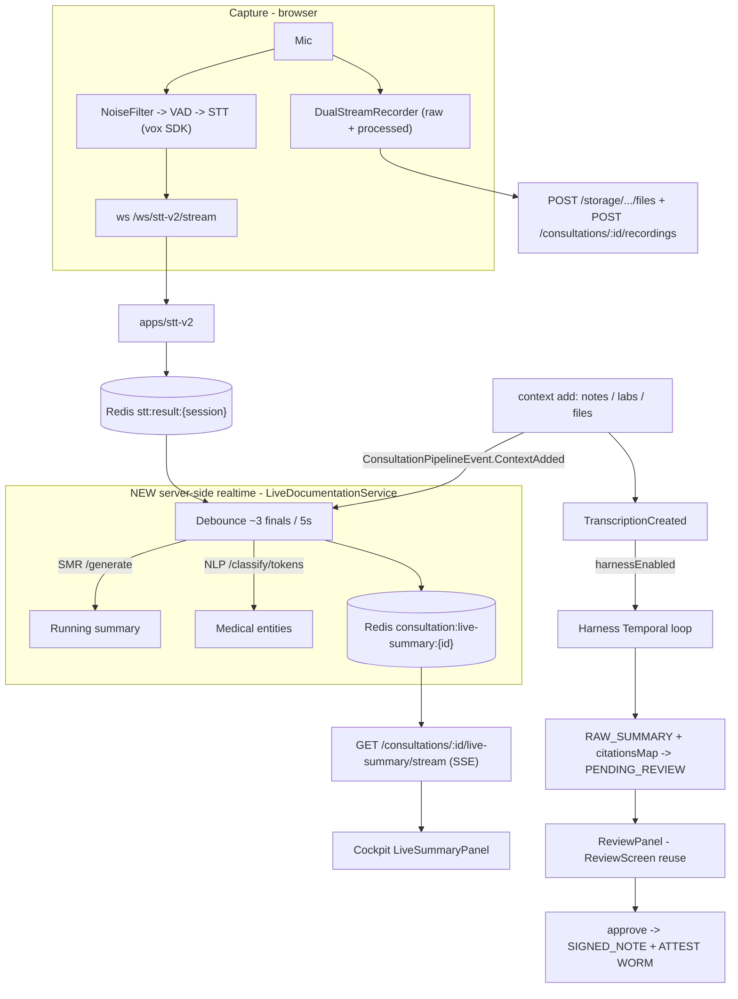

# Clinical Workflow Demonstration Playground

| | |
|---|---|
| **Ticket** | TASK-339 |
| **Name** | Clinical Workflow Demonstration Playground (backend + frontend + integrated verification) |
| **Created** | 2026-06-08 |
| **Updated** | 2026-06-08 |
| **Status** | Completed |
| **Cross-ref** | TASK-330 (Clinical Documentation Harness), TASK-333/334 (dual capture), TASK-322 (consultation lifecycle), TASK-299 (job-updates SSE), TASK-307/309/310 (`@TenantOwnedResource` + SSE auth), TASK-258 (TenantFrontendConfig) |
| **Plan** | `.cursor/plans/clinical_workflow_playground_c26028bc.plan.md` |

> This ticket now spans the **whole** playground — backend foundation (`packages/applications` + `apps/api`), admin-console polish, the frontend cockpit (`apps/ui-playground`), and the integrated build/test/lint + live bring-up verification. (The folder was renamed from `TASK-339-Clinical-Workflow-Playground-Backend` → `TASK-339-Clinical-Workflow-Playground` once the frontend + verification phases landed. No other file referenced the old name.)

---

## 1. Requirement Analysis

### Description
An end-to-end, best-practice demonstration of the HOPE ambient-documentation pipeline, composed from existing building blocks plus **one net-new server-side realtime service**. A doctor is impersonated, opens a consultation, records with live captioning, adds notes/labs/files mid-visit, and watches a **running summary + medical-entity highlights** stream in real time. On stop, the existing **harness** produces the final SOAP draft with sentence-level provenance, which the clinician reviews, edits, and signs.

Lives in `apps/ui-playground` (the real admin/playground home; there is no `apps/admin`).

### Business context
Shows the full "ambient scribe" value loop — capture → live assistance → AI draft → human sign-off → durable artifacts — using the production harness for the authoritative note, with clinician-in-the-loop guardrails (never auto-sign, click-to-inspect evidence, confidence flags).

### Locked decisions
- **Final SOAP = the harness.** The authoritative note is produced by the existing Temporal harness loop (NER → assemble → SMR SOAP → sensors → `citationsMap` → `PENDING_REVIEW` → sign-off → `SIGNED_NOTE` + WORM). Requires Temporal + harness worker + SMR/NLP up, and `harnessEnabled` per consult. This service does **not** reinvent SOAP generation.
- **Realtime partial summarization + NER = server-side orchestration**, streamed to the UI over **SSE** (not the client-side SDK). New `LiveDocumentationService` + Redis pub/sub + a `GET …/live-summary/stream` endpoint.

### Acceptance criteria
- **WS1** — per-consultation `LiveDocumentationService` consumes the STT result stream + context-add events, debounces, calls the existing SMR + NLP clients, and publishes a running-summary snapshot to Redis; a `GET /consultations/:id/live-summary/stream` SSE endpoint relays it with auth + heartbeat.
- **WS2** — `POST /consultations/:id/recording/start|stop` toggle `Consultation.status` (→ `RECORDING` / back to `OPEN`) and start/stop the live-doc session; context adds emit a `ConsultationPipelineEvent.ContextAdded` the live-doc service reacts to.
- **WS3** — dual raw+processed audio capture, uploaded + registered via `POST /consultations/:id/recordings`.
- **WS4** — three-pane cockpit: live captions + consent (left), live summary with entity highlights (center), mid-visit context entry (right).
- **WS5** — SOAP review reusing the clinical-review screen with click-to-inspect provenance, edit (`PATCH`), and sign-off (`POST …/approve` → `SIGNED_NOTE`); artifacts panel listing all stored items. Lab/exam results modelled as `ATTACHMENT` with `metadata.subType = 'LAB_RESULT'`.
- **WS6** — `captureRawAudio` enabled for the demo tenant; demo doctor/patient/tenant documented; harness-enable convention documented.
- **WS7** — consolidated ticket doc + integrated verification (this document).
- **Admin polish** — error states + `toast.error`, Skeletons over `Loading…`, **server-side** audit filters, Overview refresh + Workflows reset, relative/UTC timestamps.

### Out of scope
- No Prisma models added (live summary is transient/Redis-only; only an optional `PRE_SUMMARY` on stop).
- No harness/Temporal/Python-service code changes.
- Bringing up real STT-v2/SMR (models/GPU/mic) is best-effort only — see the runbook for graceful degradation.

---

## 2. Current State Evaluation
- **SSE pattern** already exists for consultation job-updates (`consultation_job_updates:{jobId}` + `@Sse()` + `RedisSubscriberService`) and for stream auth via `@StreamScope` + the `@TenantOwnedResource` pre-stream guard (TASK-299 / TASK-307 / TASK-309). Mirrored, not reinvented.
- **SMR + NLP clients** already exist in `@arcaai/applications` (used by the harness `summary.processor.ts` / `ner.processor.ts`). Reused via `HttpService`.
- **STT result stream** `stt:result:{sessionId}` is produced by `apps/stt-v2`; the streaming session (`POST /api/v1/audio/transcription-jobs/stream/session`) embeds the consultationId.
- **`Consultation.status`** column existed but had **no recording transition**; the harness flips it to `PENDING_REVIEW` post-visit. (Close/reopen lifecycle uses `metadata.status`, separate, left untouched.)
- **`TenantFrontendConfig.captureRawAudio`** (migration `20260605073615`) defaults `false`; effective SDK enablement = platform capability `enable-local-raw-capture` **AND** this per-tenant column (computed in `GET /tenant/me/config`).
- **Clinical-review screen** (`apps/ui-playground/src/features/clinical-review`) already implements linked-evidence / float-ungrounded / click-to-inspect; reused by the review panel.

---

## 3. Architecture



### End-to-end data flow (happy path)
1. **Impersonate** doctor `…010` (`POST /auth/impersonate`) → scoped session.
2. **Open consult** (`POST /consultations/open`) with `metadata.pipelineConfig.harnessEnabled = true`, patient `PAT-20250101-001`.
3. **Create STT stream session** (`POST /api/v1/audio/transcription-jobs/stream/session` with consultationId) → `sessionId`.
4. **Start recording** (`POST /consultations/:id/recording/start { sessionId }`) → `Consultation.status = RECORDING`; `LiveDocumentationService.start(...)` subscribes to `stt:result:{sessionId}` + context events.
5. **Live captions** stream over the STT WebSocket; the browser also runs a `DualStreamRecorder` capturing **raw** (pre-DSP) and **processed** audio in parallel.
6. **Live summary (SSE)**: as final STT segments arrive (or notes/labs/files are added), the service debounces, calls SMR (running summary) + NLP (`/classify/tokens` → entities), and publishes a `LiveSummaryEventDto` to `consultation:live-summary:{id}`. The cockpit `LiveSummaryPanel` renders the running summary with inline NER highlights (`start`/`end` offsets) + confidence.
7. **Add notes/labs/files** mid-visit (`POST /consultations/:id/context`); labs are `ATTACHMENT` + `metadata.subType = 'LAB_RESULT'`. Each emits `ContextAdded` so the next summary folds it in.
8. **Stop recording** (`POST /consultations/:id/recording/stop { persistSnapshot }`): the dual-capture blobs flush + register (`POST …/recordings`), the live-doc session tears down (optional `PRE_SUMMARY` snapshot, terminal `closed:true` SSE event), and `status` reverts to `OPEN`.
9. **Harness SOAP draft**: the `TranscriptionCreated`/visit completion triggers the harness loop → `RAW_SUMMARY` + `citationsMap` → `Consultation.status = PENDING_REVIEW`.
10. **Review** (`ReviewPanel`): loads `GET /consultations/:id/summary/:ctxId/provenance` → maps to the reused `ReviewScreen` (S/O/A/P, ungrounded/low-confidence floated first, click a claim → highlight its transcript span).
11. **Edit** (`PATCH /consultations/:id/summary/:summaryId`) then **sign-off** (`POST /consultations/:id/summary/:ctxId/approve`) → `SIGNED_NOTE` + `ATTEST` WORM. Never auto-run.
12. **Artifacts panel** lists every stored item: raw+processed audio, `TRANSCRIPT`, `WORKNOTE`/`CASE_NOTE`, `ATTACHMENT` files + labs, `RAW_SUMMARY` draft, `SIGNED_NOTE`.

### Frontend flow state machine (`lib/flow.ts`)
`launch → ready (consult open) → recording → stopped`; the review tab unlocks once `stopped` or a draft `noteContextItemId` exists. Invalid transitions are ignored (double-click / stray event safe).

---

## 4. Integration contract (endpoints, SSE, Redis, conventions)

### 4a. Endpoints (consultation controller)
| Method | Path | Request | Response | Notes |
|---|---|---|---|---|
| `POST` | `/consultations/:id/recording/start` | `StartRecordingRequest` `{ sessionId? }` | `RecordingStateResponse` | owner check → `startRecording` (→ `RECORDING`) → `LiveDocumentationService.start`. |
| `POST` | `/consultations/:id/recording/stop` | `StopRecordingRequest` `{ persistSnapshot? }` | `RecordingStateResponse` | `LiveDocumentationService.stop` (optional `PRE_SUMMARY` + terminal `closed`) → `stopRecording` (→ `OPEN`). |
| `GET` | `/consultations/:id/live-summary/stream` | — (JWT **or** `?ticket=`) | SSE of `LiveSummaryEventDto` | `@Sse()` + `@TenantOwnedResource({ modelName: 'Consultation', paramName: 'id' })` + `@StreamScope({ namespace: 'consultation_live_summary', param: 'id' })`; 15s heartbeat; replays last snapshot on (re)connect. |
| `POST` | `/consultations/:id/context` | `AddContextRequest` (+ optional `metadata`) | `ContextItemResponse` | Emits `ContextAdded` for `WORKNOTE`/`CASE_NOTE`/`ATTACHMENT`. |
| `POST` | `/consultations/:id/recordings` | `AddAudioRecordingRequest` `{ mediaId, rawMediaId?, processedMediaId? }` | `ContextItemResponse` | Dual capture (WS3). |
| `GET` | `/consultations/:id/summary/:contextItemId/provenance` | — | `SummaryProvenanceResponse` | `citationsMap` + sensor scores + modelName (clinician auth). |
| `PATCH` | `/consultations/:id/summary/:summaryId` | `UpdateSummaryRequest` | `SummaryResponse` | Edit draft (new version). |
| `POST` | `/consultations/:id/summary/:contextItemId/approve` | — | approval DTO | Sign-off → `SIGNED_NOTE` + WORM. Never auto-called. |

Supporting: `POST /auth/impersonate`, `POST /auth/stream-ticket` (scope `consultation_live_summary:<id>`), `POST /api/v1/audio/transcription-jobs/stream/session`.

### 4b. SSE payload (`LiveSummaryEventDto`)
```json
{
  "consultationId": "string",
  "runningSummary": "string",
  "sections": [
    { "title": "Subjective", "content": "string" },
    { "title": "Objective", "content": "string" },
    { "title": "Assessment", "content": "string" },
    { "title": "Plan", "content": "string" }
  ],
  "entities": [
    { "text": "amoxicillin", "type": "MEDICATION", "confidence": 0.98, "start": 42, "end": 53 }
  ],
  "lastSegmentId": "seg-123",
  "updatedAt": "2026-06-08T00:00:00.000Z",
  "closed": false
}
```
- **`sections`** is the structured **S/O/A/P** note parsed from the realtime SMR output: exactly four entries in order — `Subjective`, `Objective`, `Assessment`, `Plan` — each `content` possibly `''` until populated (rendered as a skeleton placeholder). If SMR returns unstructured text, it falls back to a single `[{ "title": "Running Summary", "content": … }]`.
- **`runningSummary`** is retained (flat join of the section bodies). NER runs over `runningSummary`, so entity `start`/`end` index the rendered text; the panel maps each global offset into its section for per-section highlighting (cross-boundary entities are dropped defensively).
- `closed: true` is the **terminal** event sent when recording stops; clients may then close the stream.
- `lastSegmentId`, `confidence`, `start`, `end`, `closed` are optional. The frontend `normalizeLiveSummaryEvent` defensively drops entities lacking numeric `start`/`end`; heartbeats (`{ "type": "heartbeat" }`) are ignored.

### 4c. Redis pub/sub channel
```
consultation:live-summary:{consultationId}             # pub/sub
consultation:live-summary:{consultationId}:last        # last-snapshot cache, TTL 1h (late-join replay)
```

### 4d. Live-documentation behavior
- **Debounce**: flush on **≥3 new final segments** *or* **~5s idle** (env-tunable: `LIVE_DOC_SEGMENT_THRESHOLD=3`, `LIVE_DOC_DEBOUNCE_MS=5000`, `LIVE_DOC_HEARTBEAT_MS=15000`).
- **Fault-tolerant**: if SMR or NLP fails, the last good value is retained and a warning logged (no crash) — the panel degrades gracefully.
- **Transient** (Redis only); the only optional persistence is a single `PRE_SUMMARY` `ContextItem` on stop.

### 4e. Lab/exam convention (no new enum)
Send an `ATTACHMENT` context item with `metadata: { "subType": "LAB_RESULT" }`. The `subType` surfaces on `ContextItemResponse.metadata` and in the `ContextAdded` payload.

### 4f. Harness enablement (no code change)
Open the demo consult with `metadata.pipelineConfig.harnessEnabled = true` so the existing `harness-gateway.service.ts` auto-trigger fires.

---

## 5. Implementation Summary — files changed (all phases)

> The working tree also contains a **concurrent TASK-330 Phase 3** effort (harness Python `provenance.py`/`sensor_runner.py` + tests, `packages/database/scripts/task-330-phase3-*.ts`, and the TASK-330 README). Those are **not** part of TASK-339 and are listed separately at the end for transparency.

### 5a. Backend foundation (WS1, WS2, WS5-backend, WS6-config)
**`packages/domains`**
- `src/entities/generated/core/ContextItemEntity.ts` — tracked `metaData` getter/setter (enables metadata persistence).

**`packages/applications`** (`src/services/consultation/`)
- `live-documentation/live-documentation.service.ts` *(new)* — the realtime watcher.
- `live-documentation/live-documentation.service.module.ts` *(new)* — DI module (HttpModule, ConfigModule, CoreDatabaseModule, EventEmitterModule, RedisCacheModule, StreamingSessionServiceModule; provides + exports the service).
- `live-documentation/dto/{live-summary.dto.ts, recording.dto.ts, index.ts}` *(new)* — DTOs + barrel.
- `live-documentation/__tests__/live-documentation.service.test.ts` *(new)*.
- `live-documentation/index.ts` *(new)* + `consultation/index.ts` — barrels (`export * from './live-documentation'`).
- `events/consultation.events.ts` — `ContextAdded` enum value + `ContextAddedPayload` + payload map.
- `events/__tests__/consultation.events.test.ts` — event count 5→6 + `ContextAdded` assertions.
- `context/context.service.ts` — persist `metadata`, emit `ContextAdded` for live context types.
- `context/dto/add-context.request.ts` — optional `metadata`.
- `context/dto/context-item.response.ts` — expose `metadata` (+ lab `subType` doc).
- `context/context.dto.mapper.ts` — map `metaData → metadata`.
- `context/__tests__/context.service.context-added.test.ts` *(new)*.
- `consultation/IConsultationService.ts` + `consultation/consultation.service.ts` — `startRecording` / `stopRecording`.
- `consultation/__tests__/consultation.service.recording.test.ts` *(new)*.

**`apps/api`**
- `src/modules/consultation/consultation.controller.ts` — 3 new endpoints (`recording/start`, `recording/stop`, `live-summary/stream`) + injected `LiveDocumentationService`.
- `src/modules/consultation/consultation.module.ts` — import `LiveDocumentationServiceModule`.
- `src/common/tenant-owned-resource.decorator.ts` — `Consultation` added to the model-name union.
- `src/common/tenant-owned-resource.interceptor.ts` — `Consultation` resolver branch (`consultationRepository.findById`, tenant-scoped).

**`packages/database`** (seed — additive, idempotent upserts)
- `src/prisma/db_main/seed/05-tenant.ts` — demo tenant `captureRawAudio: true`.
- `src/prisma/db_main/seed/11-global-setting.ts` — platform flag `enable-local-raw-capture` value `'true'` (locked `defaultValue` stays `'false'`).

### 5b. Admin-console polish (server-side audit filters + UI)
**`apps/api`**
- `src/modules/harness-admin/harness-admin.controller.ts` — `listAudit` now accepts `action` / `from` / `to` query params (server-side filtering).
- `src/modules/harness-admin/__tests__/harness-admin.controller.test.ts` — filter coverage.

**`packages/applications`**
- `src/services/harness-observability/harness-observability.service.ts` — `listAuditEvents` honours `action` / `from` / `to`.
- `src/services/harness-observability/__tests__/harness-observability.service.test.ts` — filter coverage.

**`apps/ui-playground/src/features/admin/harness/`**
- `overview/index.tsx`, `audit/index.tsx`, `evals/index.tsx`, `workflows/index.tsx` — error states + `toast.error`, Skeletons over `Loading…`, server-side audit filters, Overview refresh + Workflows reset.
- `api/harness.ts` (+ `api/__tests__/harness.test.ts`) — filter params + error handling.
- `lib/format.ts` (+ `lib/__tests__/format.test.ts` *(new)*) — relative/UTC timestamp helpers.
- `components/error-state.tsx` *(new)*, `components/relative-time.tsx` *(new)*.
- `__tests__/audit-page.test.tsx`, `__tests__/workflows-page.test.tsx`, `__tests__/evals-page.test.tsx` *(new)*, `__tests__/overview-page.test.tsx` *(new)*.

### 5c. Frontend cockpit + review (WS3, WS4, WS5)
**`apps/ui-playground/src/features/clinical-workspace/`** *(new feature, 28 files)*
- `clinical-workspace-page.tsx` — page shell (impersonate → launch → cockpit → review).
- `constants.ts` — demo IDs, endpoint builders, SSE scope, lab subtype.
- `types.ts` — local DTO mirrors (kept in lockstep with `@arcaai/applications`).
- `api/clinical-workspace.api.ts`, `api/queries.ts` — API wrappers + TanStack Query hooks.
- `hooks/use-live-summary-stream.ts` — SSE subscription (ticket → `EventSource`).
- `hooks/use-dual-capture.ts` — raw+processed recorder + upload/register.
- `components/` — `cockpit.tsx` (3-pane), `capture-panel.tsx`, `live-summary-panel.tsx`, `context-panel.tsx`, `review-panel.tsx`, `artifacts-panel.tsx`, `launch-panel.tsx`, `consent-banner.tsx`.
- `lib/` — `flow.ts`, `live-summary.ts`, `dual-capture.ts`, `provenance.ts`, `artifacts.ts` (all pure + unit-tested).
- `__tests__/` — `live-summary.test.ts`, `dual-capture.test.ts`, `flow.test.ts`, `provenance.test.ts`, `artifacts.test.ts`, `live-summary-panel.test.tsx`, `review-panel.test.tsx`.
- `index.ts` — barrel.

**Routing / nav**
- `apps/ui-playground/src/routes/_authenticated/clinical-workspace/index.tsx` *(new)* — route → `ClinicalWorkspacePage`.
- `apps/ui-playground/src/routeTree.gen.ts` — regenerated (`/clinical-workspace/` registered).
- `apps/ui-playground/src/components/layout/app-sidebar.tsx` — "Clinical Workspace" nav entry (Stethoscope icon, `NEW` badge).

### 5d. Demo IDs (Global demo tenant)
| Role | Constant | ID |
|---|---|---|
| Tenant | `SEED_TENANT_ID` / `DEMO.tenantId` | `50000000-0000-0000-0000-000000000000` |
| Doctor (impersonate) | `SEED_USER_IDS.DOCTOR` / `DEMO.doctorId` | `70000000-0000-0000-0000-000000000010` |
| Doctor (ER alt) | `SEED_USER_IDS.DOCTOR_ER` | `70000000-0000-0000-0000-000000000018` |
| Patient | `PATIENT_IDS.PAT_001` / `DEMO.patientId` | `PAT-20250101-001` |

Re-run `pnpm db:seed` to apply the raw-capture config to the demo tenant.

### 5e. NOT part of TASK-339 (concurrent TASK-330 Phase 3, present in the working tree)
- `apps/harness/scripts/task_330_phase3_cite_verify_check.py`
- `apps/harness/src/harness/services/provenance.py`, `sensor_runner.py` (+ their unit tests)
- `packages/database/scripts/task-330-phase3-consultation-seed.ts`, `task-330-phase3-provenance-read.ts`
- `docs/implementation/TASK-330-Clinical-Documentation-Harness/README.md`

---

## 6. Manual E2E Runbook

> Goal: bring up every dependency and walk the full flow. The demo degrades gracefully if STT-v2/SMR are unavailable (no models/GPU/mic) — the live-summary panel and harness SOAP step are the only parts that need them.

### 6a. Bring up dependencies (in order)

**1. Core infra (Postgres + Redis) + Temporal (opt-in `temporal` profile)** — from monorepo root:
```bash
# Core (postgres :5432, redis :6379, minio, qdrant, vault)
pnpm docker:dev:up            # ./scripts/start-infra.sh

# Temporal stack (gRPC :7233, UI :8233; persists into dedicated temporal/
# temporal_visibility databases inside the shared hope-postgres instance)
docker compose -f infrastructure/docker/docker-compose.yml \
               -f infrastructure/docker/docker-compose.dev.yml \
               --profile temporal up -d temporal temporal-ui

# (Optional) harness Phase-3 RAG reranker (:8870)
docker compose -f infrastructure/docker/docker-compose.yml \
               -f infrastructure/docker/docker-compose.dev.yml \
               --profile rag up -d hope-reranker
```
Verify:
```bash
docker exec hope-postgres pg_isready -U postgres     # accepting connections
docker exec hope-redis redis-cli ping                # PONG
curl -s -o /dev/null -w "%{http_code}\n" http://localhost:8233/   # 200 (Temporal UI)
```

**2. Database — apply seed (raw-capture + demo identities):**
```bash
pnpm db:seed
```

**3. Harness Temporal worker** (conda env `arcaenv`):
```bash
pnpm py:harness:worker        # python -m harness.temporal.worker (task queue: harness-task-queue)
```

**4. Python AI services** (conda env `arcaenv`; require models/GPU/mic — best-effort):
```bash
pnpm dev:nlp                  # NLP  :8864  (NER /api/v1/classify/tokens) — required for entity highlights
pnpm dev:smr-v2               # SMR  :8862  — required for running summary + harness SOAP
pnpm dev:stt-v2               # STT  :8861  — required for live captions / STT result stream
# (optional) pnpm dev:harness  # Harness API :8866
```

**5. API gateway:**
```bash
pnpm dev:api                  # NestJS :8868
```

**6. Playground UI:**
```bash
pnpm dev:ui-playground        # Vite :5175  → http://localhost:5175/clinical-workspace
```

### 6b. Health checks
```bash
curl -s http://localhost:8868/api/v1/health    # api      → {"status":"healthy",...}
curl -s http://localhost:8864/api/v1/health    # nlp      → token_classifier healthy
curl -s http://localhost:8862/api/v1/health    # smr
curl -s http://localhost:8861/api/v1/health    # stt-v2
curl -s http://localhost:8866/api/v1/health    # harness  → temporal "configured"
# SSE must reject unauthenticated callers (guard runs before stream opens):
curl -s -o /dev/null -w "%{http_code}\n" \
  http://localhost:8868/api/v1/consultations/test-id/live-summary/stream   # 401
```

### 6c. Click-path (browser)
1. Open `http://localhost:5175/clinical-workspace` (log in if prompted).
2. **Launch panel** → impersonate doctor `70000000-0000-0000-0000-000000000010`, patient `PAT-20250101-001`; click **Open consultation** (opens with `harnessEnabled`). *Expect: stage → ready.*
3. **Consent banner** appears; click **Start recording**. *Expect: status `RECORDING`; live-summary badge → Connecting → Live; mic capture begins (raw + processed).*
4. Speak / play audio. *Expect (STT+SMR+NLP up): live captions on the left; the center LiveSummaryPanel fills with a structured **S/O/A/P** note (four labeled sections, skeletons until populated) and inline medical-entity highlights + a type legend.*
5. **Add context** (right pane): a Case note, a Work note, and a Lab/exam result (file → `ATTACHMENT` + `subType=LAB_RESULT`). *Expect: items appear in the context list; the next summary tick folds them in.*
6. Click **Stop recording**. *Expect: dual-capture blobs upload + register; SSE terminal `closed:true`; status reverts to `OPEN`; review tab unlocks.*
7. The **harness** SOAP draft is awaited automatically — a "Generating the SOAP draft…" state shows while the review surface polls (~3.5–8s backoff, 2.5-min timeout), with a manual "Check again" fallback. *Expect: the Review tab auto-advances to the `PENDING_REVIEW` draft once the harness worker + SMR finish.*
8. **Review tab**: S/O/A/P with ungrounded/low-confidence floated first; click a claim → its transcript span highlights side-by-side (provenance).
9. **Edit draft** (optional) → Save (new version). Then **Approve & sign**. *Expect: `SIGNED_NOTE` + `ATTEST` WORM; edit disabled once signed.*
10. **Artifacts panel**: raw+processed audio, `TRANSCRIPT`, notes, lab `ATTACHMENT`, `RAW_SUMMARY`, `SIGNED_NOTE`.

### 6d. Graceful degradation (what was NOT live-validated here)
- **STT-v2 down** → no real captions / STT result stream; the live summary still reacts to context-add events; manual transcript ingest is the fallback.
- **SMR down** → `runningSummary` stays empty (last-good retained) **and** the harness SOAP draft stalls at `RECORDING`/`OPEN` — the authoritative note cannot be produced. NLP entity highlights still work if a transcript is present.

---

## 7. Verification Evidence (integrated, 2026-06-08)

All three workstreams coexisting; conda env `arcaenv` for Python.

### Builds
```
pnpm build --filter @arcaai/applications  → Tasks: 7 successful, 7 total
pnpm build:api                            → Tasks: 8 successful, 8 total
```

### Unit / component tests
```
@arcaai/applications  (src/services/consultation + harness-observability)
    Test Files  31 passed (31)        Tests  879 passed (879)
apps/api              (src/modules/consultation + harness-admin)
    Test Files   8 passed (8)         Tests  125 passed (125)
apps/ui-playground    (full vitest — clinical-workspace + admin harness)
    Test Files 132 passed (132)       Tests 1125 passed (1125)
```

### Typecheck — `pnpm --filter @arcaai/ui-playground exec tsc --noEmit`
Only **3 pre-existing** errors, all in untouched files (NOT this work):
```
src/features/admin/jobs/api/jobs.ts(126,100)   TS2345 (AdminConsultationParams index signature)
src/features/admin/jobs/api/jobs.ts(139,101)   TS2345 (AdminTranscriptionJobParams index signature)
src/features/admin/queues/api/queues.ts(144,88) TS2345 (ListJobsParams index signature)
```
No new type errors from clinical-workspace or admin/harness.

### Lint — `ReadLints` on all key changed files
- Backend (applications + api + domains): **no errors**.
- Frontend: **0 errors**; only cosmetic warnings in sibling-landed code — `cockpit.tsx` (×6 Tailwind v4 shorthand suggestions, `min-h-[32rem]` → `min-h-128`) and `evals/index.tsx` (×1 dynamic inline-style on a data-driven bar-chart height — a legitimate computed `%` that cannot be a Tailwind class). Left as-is (surgical scope; not regressions).

### Live bring-up (best-effort)
| Component | Port | Status | Evidence |
|---|---|---|---|
| Postgres (`hope-postgres`) | 5432 | ✅ healthy | `pg_isready`: accepting connections |
| Redis (`hope-redis`) | 6379 | ✅ healthy | `redis-cli ping` → PONG |
| Temporal (gRPC + UI) | 7233 / 8233 | ✅ up | UI HTTP 200; 7233 open |
| Harness Temporal worker | — | ✅ running | PID in `arcaenv`; task queue `harness-task-queue` |
| Harness API | 8866 | ✅ healthy | `/api/v1/health` → temporal `configured` @ `localhost:7233` |
| NLP | 8864 | ✅ healthy | `token_classifier` healthy (the NER endpoint) |
| **API gateway** | 8868 | ✅ healthy | `/api/v1/health` 200; **all 3 new routes mapped**; `LiveDocumentationServiceModule dependencies initialized`; **0** compile errors |
| live-summary SSE auth | 8868 | ✅ guarded | unauthenticated GET → **HTTP 401** (guard runs before stream opens) |
| ui-playground | 5175 | ✅ running | Vite ready |
| RAG reranker | 8870 | ✅ up | harness Phase-3 |
| SMR | 8862 | ⛔ down | no model/GPU (expected — not blocked) |
| STT-v2 | 8861 | ⛔ down | no model/GPU/mic (expected — not blocked) |

Runtime route map (from API startup log):
```
Mapped {/api/v1/consultations/:id/recording/start, POST}
Mapped {/api/v1/consultations/:id/recording/stop, POST}
Mapped {/api/v1/consultations/:id/live-summary/stream, GET}
```

### Known pre-existing issues (NOT caused by this work)
- `ui-playground` `tsc`: 3 index-signature errors in untouched `admin/{jobs,queues}/api/*.ts` (see above).
- `packages/domains` `*.postgres.test.ts` require a live DB (excluded from the unit run).
- `ruff B017` in an untouched harness eval test.

### Integration regression scan
No REAL integration regression found. Statically + at runtime verified: SSE + recording routes registered and DI-wired (`LiveDocumentationServiceModule dependencies initialized`); `LiveDocumentationService` provided/exported by its module; DTOs barrel-exported from `@arcaai/applications`; the `/_authenticated/clinical-workspace/` route + sidebar entry exist; `routeTree.gen.ts` consistent; the SSE scope string (`consultation_live_summary:<id>`) matches `@StreamScope`; endpoint path builders match the controller routes; `Consultation` is in both the `@TenantOwnedResource` union and the interceptor switch.

---

## 8. Deviations / Notes
1. **Platform flag flipped (WS6).** `GET /tenant/me/config` computes raw-capture as `platformCapability AND TenantFrontendConfig.captureRawAudio`. Enabling only the per-tenant column would leave the effective flag `false`, so the seed also flips `enable-local-raw-capture` to `'true'` (locked `defaultValue` stays `'false'`, so a reset reverts). **Needs an explicit owner decision** on whether to keep this platform-wide flip (see §10).
2. ~~**Processed audio is a browser-side approximation.**~~ **Resolved (2026-06-08).** Dual capture now records the **genuine post-noise-filter PCM** via the opt-in SDK helper `@arcaai/vox#createProcessedAudioTap` (the same RNNoise `NoiseFilterProcessor` the pipeline uses); when RNNoise is unavailable it falls back to the old approximation (uploaded as `processed-approx-capture.*`) and surfaces a `processedSource` flag. See Change History.
3. ~~**No aggressive polling for the harness draft.**~~ **Resolved (2026-06-08).** The review surface now polls for the `RAW_SUMMARY` draft (TanStack `refetchInterval`, ~3.5–8s backoff, 2.5-min timeout) and stops as soon as the draft appears, with a "Generating the SOAP draft…" state, a Review-tab spinner, and a manual "Check again" fallback. See Change History.
4. **Admin audit filters moved server-side.** `action`/`from`/`to` are applied in `harness-observability.service.listAuditEvents` (was client-side).
5. **Recording controller orchestration.** `ConsultationService.start/stopRecording` only transition `status`; the `LiveDocumentationService.start/stop` calls are orchestrated in the controller to keep the service unit tests light.
6. **`stopRecording` reverts to `OPEN`** (not `PENDING_REVIEW`); the harness owns the promotion to `PENDING_REVIEW`.
7. ~~**Live sectioning is MVP.**~~ **Resolved (2026-06-08).** The transient service now emits a structured **S/O/A/P** live summary (`Subjective`/`Objective`/`Assessment`/`Plan`) parsed from the realtime SMR output, falling back to a single `Running Summary` section for unstructured output. See Change History.
8. **DTO mirrors.** The Vite app cannot import `@arcaai/applications`, so `features/clinical-workspace/types.ts` mirrors the contracts (admin-console pattern). The mirror types `confidence`/`start`/`end` as required while the server marks them optional; the runtime reducer defends against missing values (a missing `confidence` only yields a cosmetic "NaN%" tooltip — see §10 follow-up).

---

## 9. Completion checklist
- [x] All new/modified tests pass (applications 879, api 125, ui-playground 1125 — see §7).
- [x] Affected packages build (`@arcaai/applications` 7/7, `build:api` 8/8).
- [x] No new linter errors (backend clean; frontend only cosmetic warnings in sibling code).
- [x] Barrel exports updated (`live-documentation/index.ts`, `consultation/index.ts`).
- [x] Module registrations complete (`LiveDocumentationServiceModule` in `ConsultationModule`; runtime-confirmed).
- [x] Route + nav present (`/clinical-workspace` route, sidebar entry, `routeTree.gen.ts`).
- [x] Live bring-up performed; health captured (§7).
- [x] Ticket documentation consolidated + folder renamed.

---

## 10. Follow-ups
1. ~~**Structured S/O/A/P live summary**~~ — ✅ **Done (2026-06-08)**. Service emits `Subjective`/`Objective`/`Assessment`/`Plan` sections; panel renders four labeled sections with per-section highlights + skeletons. See Change History.
2. ~~**Real processed-PCM exposure**~~ — ✅ **Done (2026-06-08)**. New `@arcaai/vox#createProcessedAudioTap` surfaces the genuine post-noise-filter PCM; dual-capture records it (approximation fallback marked via `processedSource`). See Change History.
3. ~~**Draft-ready push/poll**~~ — ✅ **Done (2026-06-08)**. Bounded `refetchInterval` poll (3.5–8s backoff, 2.5-min timeout) auto-detects the `RAW_SUMMARY` draft and advances Review. See Change History.
4. **Platform-flag decision (owner needed)** — decide whether to keep the `enable-local-raw-capture` platform-wide flip in the seed, or scope raw-capture enablement per-tenant only (and revert the platform flag).
5. **Live-summary entity robustness** — coerce a default for missing `confidence` so the highlight tooltip never shows "NaN%" when NLP omits it.

---

## Change History
| Date | Description | Files |
|---|---|---|
| 2026-06-08 | Backend foundation: `LiveDocumentationService` + SSE, recording lifecycle, `ContextAdded` event + lab `subType`, demo raw-capture config. | §5a |
| 2026-06-08 | Admin-console polish: server-side audit filters, error states/toasts, Skeletons, relative/UTC timestamps. | §5b |
| 2026-06-08 | Frontend cockpit + review/sign-off + dual capture + route/nav. | §5c |
| 2026-06-08 | Integrated verification (builds/tests/typecheck/lint) + best-effort live bring-up; folder renamed `…-Backend` → `…`; consolidated this doc. | §7, this file |
| 2026-06-08 | **Follow-up 1 — Structured S/O/A/P live summary.** Realtime SMR now produces a structured SOAP note; server parses it into `LiveSummaryEventDto.sections` (`Subjective`/`Objective`/`Assessment`/`Plan`; `runningSummary` retained; NER run over `runningSummary` so highlight offsets index the rendered text), and the cockpit renders four labeled sections with per-section highlights + skeletons; unstructured output falls back to a single `Running Summary` section. | `live-documentation/{soap-parser.ts,live-documentation.service.ts,dto/live-summary.dto.ts}` (+ tests); `clinical-workspace/{lib/live-summary.ts,components/live-summary-panel.tsx}` (+ tests) |
| 2026-06-08 | **Follow-up 2 — Draft-ready polling.** After stop, the review surface polls for the harness draft (TanStack `refetchInterval`, ~3.5–8s backoff, 2.5-min timeout), stopping the moment the `RAW_SUMMARY` draft appears; adds a "Generating the SOAP draft…" state, a Review-tab spinner, and a manual "Check again" fallback — replacing manual-refresh-only. | `clinical-workspace/{lib/draft-polling.ts,api/queries.ts,clinical-workspace-page.tsx,components/review-panel.tsx}` (+ tests) |
| 2026-06-08 | **Follow-up 3 — Real processed-PCM.** New opt-in SDK helper `@arcaai/vox#createProcessedAudioTap` exposes the genuine post-noise-filter PCM (same RNNoise `NoiseFilterProcessor` as the pipeline) as a recordable `MediaStream`; dual-capture records it (raw = pre-DSP unchanged), falling back to the WebAudio approximation (`processed-approx-capture.*`) and surfacing a `processedSource` flag when RNNoise is unavailable. | `agentic-sdk-v2/src/core/ProcessedAudioTap.ts`, `agentic-sdk-v2/src/plugins.ts` (+ tests); `clinical-workspace/{lib/dual-capture.ts,hooks/use-dual-capture.ts}` (+ tests) |
| 2026-06-08 | **Bugfix — impersonated ASR pipeline not delivered → live-transcription 404.** Recording as an impersonated doctor failed with `Pipeline …0002 not found`. Root cause (proven via API logs + code, not the DB/seed/backend, all of which were correct): the SDK injects the per-user server-resolved `remoteConfig.pipelineId` into the config cascade (`stt.transcriptionPipelineId`) **only in the mount-time `init()`**, which runs once with the *admin's* identity. The same-tab impersonation re-init effect refreshed `tenantConfig` for display but **never re-applied the cascade tenant tier** (no `GET /user/me/preferences` after `/auth/impersonate` in the logs), so the field stayed empty and the capture panel fell back to the hardcoded SYSTEM `DEFAULT_TRANSCRIPTION_PIPELINE_ID = …0002` (404 for a customer tenant). Fix: the re-init effect now re-fetches `GET /user/me/preferences` for the switched-in identity and **rebuilds the cascade tenant tier** (model + features + captureRawAudio + pipeline), so the resolution order (per-user assignment → tenant default → global default, computed by `resolveRemoteConfig`) is honored during impersonation. TDD RED→GREEN; 122/122 SDK provider+ConfigManager tests pass; `@arcaai/vox` rebuilt. | `agentic-sdk-v2/src/providers/AgenticProvider.tsx` (+ `__tests__/AgenticProvider.remotePipeline.task334.test.ts`) |
| 2026-06-08 | **Known follow-up (footgun).** `apps/ui-playground/src/features/audio/constants.ts` `DEFAULT_TRANSCRIPTION_PIPELINE_ID` is a SYSTEM-tenant pipeline; the capture panel silently falls back to it whenever the SDK config isn't ready, producing a confusing cross-tenant 404 instead of a clear error. Recommend replacing the silent fallback with a "pipeline not configured / config loading" guard. (Not yet implemented.) | — |
