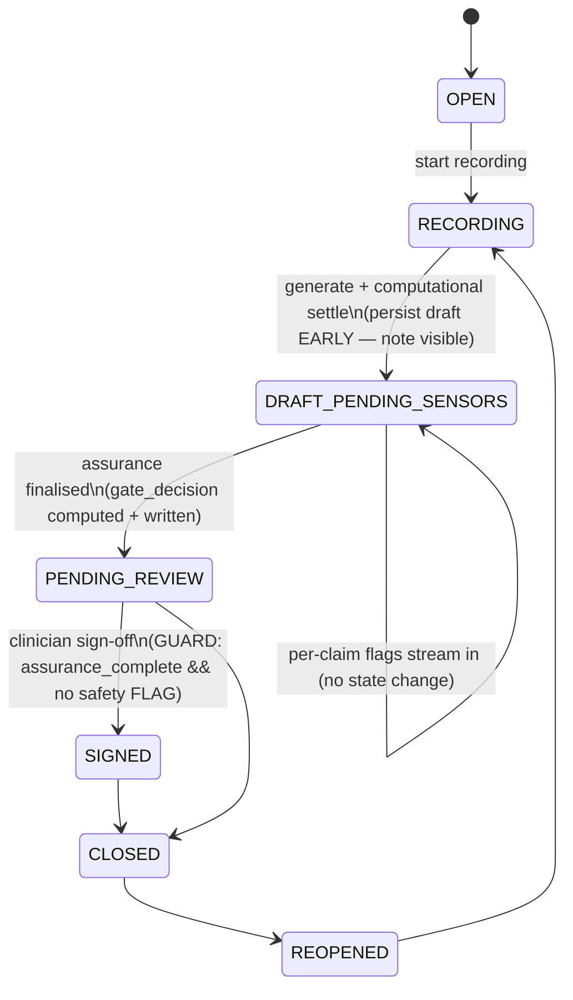

# TASK-355 · Phase D — Optimistic Draft Delivery (R-7): Design + TDD Implementation Plan

| | |
|---|---|
| **Ticket** | TASK-355 |
| **Phase** | D (R-7 — optimistic draft delivery) |
| **Type** | architecture (workflow + schema + API + UI) |
| **Status** | **Implemented end-to-end (2026-06-14)** — Phase D optimistic delivery, Slices 1–6 (1, 2, 3, 4a, 4b, 5a, 5b, 5c, 5d, 6) all shipped; **default-OFF** behind `HARNESS_OPTIMISTIC_DELIVERY_ENABLED` + two patch markers (`task-355-optimistic-delivery`, `task-355-assurance-signals`). Governance Q2a/Q4 sub-decisions were revised to the lowest-friction audited form (§7.1 LOCKED). |
| **Depends on** | Phases A–C landed; TASK-354 (heartbeat + per-call timeout); TASK-348 (replay-gate discipline) |
| **Risk** | Med–High — touches the clinical sign-off gate + WORM truthfulness (README §7 #2, #5) |
| **Goal** | Deliver the draft to the clinician immediately after `generate`, run the assurance (inferential) pass **concurrently** with human review, stream per-claim flags into the review UI, and make it **structurally impossible** to sign off before assurance lands or past a safety FLAG. |

> Scope note (Karpathy §3 surgical changes): this phase changes **one structural thing** — *when* the draft is persisted/delivered relative to the inferential pass — and adds the guards that the change makes necessary. Everything else (sensor logic, aggregator, attestation hashing, NER, retrieval) is untouched.

---

## 0. Grounding — what exists today (verified against source)

| Concern | Today's behaviour | Source |
|---|---|---|
| Workflow order | `generate → extract_entities(note) → run_sensors → aggregate(comp) → [regen?] → run_inferential_sensors → aggregate(comp+infer) → [regen?] → persist_draft → gate wait_condition(approval) → record_gate_decision` | `apps/harness/src/harness/temporal/workflows.py:320-527` |
| Draft persisted | **After** the 344 s inferential pass (`persist_draft` at +366 s) — `gate_decision=str(verdict.decision)` already computed | `workflows.py:445-477`; Appendix 01 §2 |
| WORM events at persist | `GENERATE` + `SENSOR_RUN` (carries `gateDecision` + `guardrailDecisions`) + optional `REDUCED_ASSURANCE` — all written in `persistDraft` | `harness-internal.service.ts:256-302` |
| Lifecycle flip | `persistDraft` sets `Consultation.status = PENDING_REVIEW` | `harness-internal.service.ts:236-241` |
| Gate wait | `wait_condition(lambda: self._approval is not None, timeout=sla)` raced against escalation timer | `workflows.py:486-507` |
| Sign-off path | `SummaryService.approveSummary()` → SIGNED_NOTE version + `ATTEST` WORM + `status=SIGNED` + best-effort `signalApproval` → workflow's `approval` signal | `summary.service.ts:322-435`; `harness-gateway.service.ts:93-102`; `internal.py:196-230` |
| Lifecycle enum | `OPEN, RECORDING, PENDING_REVIEW, SIGNED, CLOSED, REOPENED` | `enums.prisma:224-233` |
| `SummaryMeta` | has `guardrailDecisions`, `citationsMap`, `ragTriadScore`, scores — **no** `gateDecision` column, **no** assurance-state column | `consultation.prisma:204-268` |
| Patch gates | `task-345-harness-progress`, `task-348-failure-terminal` | `workflows.py:161,208` |
| Replay fixtures | `doc_workflow_pre_task345_history.json`, `doc_workflow_task345_history.json`; capture script `_capture_replay_fixture.py` | `tests/unit/temporal/` |
| Progress SSE | ephemeral Redis channel `consultation:harness-progress:{id}`, full-state folding, terminal at "draft ready" | `harness-progress.service.ts` |
| Review UI | `ReviewScreen` renders SOAP + needs-attention + transcript; `Approve & sign` button calls `onApprove`; `useHarnessProgress` streams generation stages | `review/review-screen.tsx`; `hooks/use-harness-progress.ts` |

**The single structural problem to solve:** the draft is invisible until the assurance pass finishes (94 % of pipeline). Phase D delivers it after `generate`/computational settle, and moves the assurance into a branch that runs *while the clinician reads*.

---

## 1. Lifecycle state machine + invariants

### 1.1 State machine (proposed)



Only **one new state** is introduced: `DRAFT_PENDING_SENSORS` (between `RECORDING` and `PENDING_REVIEW`). The clinician sees and may read/edit the note in `DRAFT_PENDING_SENSORS`; they **cannot sign** until `PENDING_REVIEW`.

`PENDING_REVIEW` keeps its exact prior meaning ("summary generated, awaiting clinician review/attestation") **plus** the now-true guarantee that assurance has completed and a gate verdict is recorded — i.e. legacy single-phase runs (feature flag off) still land directly in `PENDING_REVIEW`, unchanged.

### 1.2 Invariants table

| # | Invariant | Mechanism |
|---|---|---|
| I1 | A draft is **visible** to the clinician without waiting on the inferential pass | Early `persist_draft` after computational settle → `DRAFT_PENDING_SENSORS` |
| I2 | `gate_decision` is recorded **only when computed** — never provisional | Early persist writes `gateDecision=null`; `SENSOR_RUN` WORM + `gateDecision` written **only** by `finalize_assurance` (README §7 #5) |
| I3 | Sign-off is **impossible** before assurance completes | Two layers: workflow gate `wait_condition` requires `assurance_complete`; API `approveSummary` guard rejects when `SummaryMeta.assuranceCompletedAt is null` |
| I4 | A safety FLAG can **never** be signed past | API guard hard-rejects when `guardrailDecisions.safety.decision == 'FLAG'` (or `gateDecision == 'FLAG'` with safety in the flagged set); inferential is **assurance-only** for a delivered draft (never silently regenerated) (README §7 #2) |
| I5 | Gate **never auto-PASSes** on degraded/missing inputs | `finalize_assurance` reuses the existing `aggregate()` (degraded → FLAG); a failed assurance branch finalises with `gate_decision=FLAG` + `reduced_assurance` (forced review), never `PASS` (README §7 #1, #3) |
| I6 | `assurance_complete` means *attempted + verdict recorded* — not *passed* | A degraded/failed inferential branch still sets `assuranceCompletedAt` with a FLAG verdict, so the consultation can never wedge in `DRAFT_PENDING_SENSORS` forever |
| I7 | Workflow-sequence change is replay-safe | New `workflow.patched("task-355-optimistic-delivery")` gate + captured `doc_workflow_task355_history.json` (README §7 #4) |

---

## 2. Temporal workflow redesign

### 2.1 Ordering: today vs Phase D

```
TODAY (single-phase):
  … run_sensors → aggregate(comp) → [regen loop] → run_inferential_sensors
     → aggregate(comp+infer) → [regen loop] → persist_draft(PENDING_REVIEW, gate_decision=X)
     → gate wait_condition(approval) → record_gate_decision

PHASE D (optimistic, behind patch gate + feature flag):
  … run_sensors → aggregate(comp) → [COMPUTATIONAL regen loop only]
     → persist_draft(DRAFT_PENDING_SENSORS, gate_decision=null)   ← note visible (~25–30s)
     → start TWO concurrent branches:
          Branch A (assurance):  run_inferential_sensors → aggregate(comp+infer)
                                 → finalize_assurance(PENDING_REVIEW, gate_decision=X,
                                   guardrailDecisions, per-claim flags) → self._assurance_complete=True
          Branch B (gate):       wait_condition(approval AND assurance_complete) raced w/ SLA escalation
     → await Branch A (propagate/finalise) → record_gate_decision
```

Key changes:
1. **`persist_draft` moves earlier** and gains a `phase` discriminator (`DRAFT_PENDING_SENSORS`). It no longer carries a gate decision or fires the `SENSOR_RUN`/`REDUCED_ASSURANCE` WORM events.
2. **A new activity `finalize_assurance`** folds the inferential results, writes `gateDecision` + `guardrailDecisions` + `ragTriadScore` onto the existing `SummaryMeta`, flips `DRAFT_PENDING_SENSORS → PENDING_REVIEW`, sets `assuranceCompletedAt`, fires the `SENSOR_RUN` (+ `REDUCED_ASSURANCE`) WORM events, and publishes per-claim flags to the assurance SSE channel.
3. **The gate `wait_condition` precondition becomes `self._approval is not None AND self._assurance_complete`** — the clinician may signal early, but the workflow will not record SIGNED until assurance has landed (defence in depth alongside the API guard).
4. **The inferential pass is assurance-only for a delivered draft** — it no longer feeds the regen loop (a draft under the clinician's eyes is never silently swapped). The **computational** regen loop is retained *before* delivery (cheap: ~`generate` cost per iter; bounds the delivered draft to be schema/coverage/citation-settled). This is the deliberate trade-off that matches the Abridge model (Appendix 05 Topic 5) and is the **#1 open governance question** (§7).

### 2.2 Concurrency pattern (deterministic, workflow-safe)

Temporal's asyncio event loop is deterministic, so running an activity branch concurrently with a signal wait is the standard pattern (Appendix 05 Topic 4; `samples-python/hello/hello_parallel_activity.py`). Sketch (illustrative — NOT to be committed by this doc):

```python
# inside _run(), AFTER early persist_draft(DRAFT_PENDING_SENSORS):
self._assurance_complete = False

async def _assurance_branch() -> None:
    inferential = None
    try:
        inferential = await workflow.execute_activity(
            run_inferential_sensors, ..., start_to_close_timeout=_INFERENTIAL_TIMEOUT,
            retry_policy=_INFERENTIAL_RETRY,
        )
    except ActivityError:
        reduced_assurance = True  # degrade, never raise (I5/I6)
    verdict = aggregate(comp + non_degraded_inferential, ...)   # same pure aggregator
    await workflow.execute_activity(
        finalize_assurance,
        FinalizeAssuranceInput(gate_decision=str(verdict.decision),
                               guardrail_decisions=..., reduced_assurance=...,
                               claims_flagged=verdict.claims_flagged, ...),
        start_to_close_timeout=_ACTIVITY_TIMEOUT, retry_policy=_API_RETRY,
    )
    self._gate_decision = str(verdict.decision)
    self._assurance_complete = True            # I3/I6

assurance = asyncio.ensure_future(_assurance_branch())

# Gate: requires BOTH the signal AND assurance completion (I3)
deadline = gate.gate_sla_seconds
while not (self._approval is not None and self._assurance_complete):
    try:
        await workflow.wait_condition(
            lambda: self._approval is not None and self._assurance_complete,
            timeout=timedelta(seconds=deadline))
    except TimeoutError:
        await workflow.execute_activity(escalate_gate, ...)
        deadline = gate.gate_escalation_seconds
await assurance   # surface any branch defect; finalize already ran inside it
```

`_assurance_branch` swallows backend failures internally (mirrors today's `run_inferential_sensors` degrade contract at `workflows.py:419-420`), so the `await assurance` never raises for a backend outage — it finalises with FLAG + reduced assurance (I5/I6).

### 2.3 Patch gate + replay fixture (mandatory — README §7 #4)

Because this reorders the command stream, it ships behind a new gate:

```python
if workflow.patched("task-355-optimistic-delivery"):
    # NEW optimistic path (early persist → parallel assurance → gate-on-both)
else:
    # LEGACY single-phase path (unchanged command sequence) — replay-safe for
    # any pre-355 history still parked at the gate wait_condition.
```

- The `else` branch is the **byte-for-byte** current sequence, so `doc_workflow_pre_task345_history.json` and `doc_workflow_task345_history.json` still replay.
- Capture a new fixture `doc_workflow_task355_history.json` from the optimistic path via `_capture_replay_fixture.py` (extend `StubConfig`/stubs to cover the early-persist + `finalize_assurance` activities and the assurance-then-signal ordering), and add a `test_task355_history_replays_on_current_definition`.
- **Feature-flag vs patch-gate interaction:** the patch gate guarantees *replay* safety; a separate runtime flag `HARNESS_OPTIMISTIC_DELIVERY_ENABLED` (snapshotted at workflow start via `fetch_policy`, like the other gate knobs in `HarnessGateConfig`) guarantees *behavioural* roll-back without redeploy. **The flag must be read once and snapshotted** so a flag flip mid-run can never split a single execution across both paths (determinism). Recommended: thread it through `HarnessGateConfig`/`HarnessPolicy` so it is captured in the workflow input.

### 2.4 New/changed Temporal artefacts

| Artefact | File | Change |
|---|---|---|
| `persist_draft` activity + `PersistDraftInput` | `temporal/activities.py:417`, `temporal/models.py:329` | add `phase: Literal["DRAFT_PENDING_SENSORS","FINALIZE"]` (or split into two payloads); early call omits `gate_decision` |
| `finalize_assurance` activity (**new**) + `FinalizeAssuranceInput` (**new**) | `temporal/activities.py`, `temporal/models.py` | folds inferential → API `…/assurance` endpoint; registered in `DOCUMENT_ACTIVITIES` (`activities.py:507`) |
| `HarnessDocWorkflow` | `temporal/workflows.py` | patch-gated reorder; `self._assurance_complete`, `self._gate_decision`; query `assurance_complete` (ops/UI) |
| `HarnessGateConfig` / `HarnessPolicy` | `temporal/models.py:32`, policy mapping | add `optimistic_delivery_enabled: bool` |
| Replay fixture | `tests/unit/temporal/fixtures/doc_workflow_task355_history.json` (**new**) | captured from optimistic path |

---

## 3. Schema migration sketch (PROPOSED ONLY — do **not** run)

> Migrations are gated in this repo. The following is a Prisma sketch + the SQL it would generate. Per `02-database-prisma.mdc`: additive/nullable, indexed, `@@schema("core")`, schema + migration committed together, **no destructive statements**.

### 3.1 `ConsultationStatus` enum — add one state

`packages/database/src/prisma/db_main/enums.prisma`:

```prisma
enum ConsultationStatus {
    OPEN
    RECORDING
    DRAFT_PENDING_SENSORS   // TASK-355 Phase D — draft delivered, assurance running concurrently
    PENDING_REVIEW          // assurance complete + gate verdict recorded; awaiting sign-off
    SIGNED
    CLOSED
    REOPENED
    @@schema("core")
}
```

### 3.2 `SummaryMeta` — assurance state + gate decision

`packages/database/src/prisma/db_main/consultation.prisma` (model `SummaryMeta`):

```prisma
    // TASK-355 Phase D — two-phase assurance. Both nullable/additive.
    gateDecision        String?   // 'PASS' | 'REGEN' | 'FLAG' — written ONLY when computed (I2)
    assuranceCompletedAt DateTime? // null = DRAFT_PENDING_SENSORS; set = assurance finalised (I3/I6)
```

(`gateDecision` is intentionally a `String?` to mirror the harness `GateDecision` StrEnum values without coupling the DB to a Python enum; the sign-off guard reads it plus `guardrailDecisions.safety`.)

### 3.3 Generated SQL (sketch)

```sql
-- enum value add (Postgres ALTER TYPE ... ADD VALUE is forward-only; place before PENDING_REVIEW)
ALTER TYPE "core"."ConsultationStatus" ADD VALUE IF NOT EXISTS 'DRAFT_PENDING_SENSORS' BEFORE 'PENDING_REVIEW';

-- additive nullable columns (no backfill needed; existing rows are already past assurance)
ALTER TABLE "core"."SummaryMeta" ADD COLUMN "gateDecision" TEXT;
ALTER TABLE "core"."SummaryMeta" ADD COLUMN "assuranceCompletedAt" TIMESTAMP(3);
```

> Note: `ALTER TYPE … ADD VALUE` cannot run inside a transaction block with other statements in some Postgres versions — Prisma typically emits it as its own migration step. Reviewer must confirm at migration-generation time. **No data is destroyed; no `DROP`/`DELETE`/`TRUNCATE`.**

### 3.4 Domain / mapper / repository impacts (per `02`/`03`)

After the schema change, the standard downstream layers regenerate/update:

| Layer | File (generated/core) | Change |
|---|---|---|
| Enum | `packages/domains` `ConsultationStatus` | add `DRAFT_PENDING_SENSORS` |
| Entity | `entities/generated/core/SummaryMeta*` | add `gateDecision`, `assuranceCompletedAt` |
| Factory | `factories/generated/core/SummaryMetaFactory` | accept the two new fields (default null); **early** persist sets both null |
| Mapper | `mappers/generated/core/SummaryMeta*` | map new columns ↔ entity |
| Model | `models/generated/core/SummaryMeta*` | typed fields |
| Repository | `repositories/generated/core/SummaryMetaRepository` | a finalise update method (or reuse `update`) to set the two fields by `contextItemId` |

`ContextItemFactory.CreateRawSummary` is unchanged (the draft content is identical; only the meta + lifecycle differ).

---

## 4. API + UI changes (file granularity)

### 4.1 Applications layer (`packages/applications`)

| Change | File | Detail |
|---|---|---|
| **Split `persistDraft`** into the early phase | `services/consultation/harness/harness-internal.service.ts:202` | Accept `phase`. For `DRAFT_PENDING_SENSORS`: create `RAW_SUMMARY` + `SummaryMeta` (`gateDecision=null`, `assuranceCompletedAt=null`), set `Consultation.status=DRAFT_PENDING_SENSORS`, fire **only** the `GENERATE` WORM event, notify progress "Draft ready — verifying". **Do NOT** fire `SENSOR_RUN`/`REDUCED_ASSURANCE` (I2). |
| **New `finalizeAssurance`** method | same service (new method) | Update the existing `SummaryMeta` by `contextItemId`: set `guardrailDecisions`, `ragTriadScore`, `gateDecision`, `assuranceCompletedAt=now`; flip `status → PENDING_REVIEW`; fire `SENSOR_RUN` (+ `REDUCED_ASSURANCE`) WORM (the block currently at `harness-internal.service.ts:256-302` moves here); publish per-claim flags to the assurance channel. |
| **New DTOs** | `services/consultation/harness/dto/harness-internal.dto.ts` | `HarnessFinalizeAssuranceRequest` (gateDecision, guardrailDecisions, ragTriadScore, reducedAssurance, claimsFlagged, citationsMap delta), `HarnessFinalizeAssuranceResponse`. Add `phase` to `HarnessDraftRequest`. |
| **Assurance SSE service** | `services/consultation/harness/harness-assurance.service.ts` (**new**, mirrors `harness-progress.service.ts`) | Redis channel `consultation:harness-assurance:{id}`; incremental per-claim flag events + a terminal `assurance_complete` event carrying the final `gateDecision`. Best-effort, no PHI beyond claim ids/sections already in `citationsMap`. |
| **Sign-off guard** | `services/consultation/summary/summary.service.ts:322` (`approveSummary`) | Before writing the SIGNED_NOTE version: load the draft's `SummaryMeta`; **reject** (`ConflictException`) if `assuranceCompletedAt == null` (I3) or if a safety FLAG is present (`guardrailDecisions.safety.decision === 'FLAG'`, or `gateDecision === 'FLAG'` with `safety` in the flagged set) (I4). A `REGEN`/groundedness/reduced-assurance FLAG remains **signable** by the human (that is the purpose of review). |

### 4.2 API gateway (`apps/api`)

| Change | File | Detail |
|---|---|---|
| **New internal endpoint** | `modules/consultation/harness-internal.controller.ts:84` | `POST internal/harness/consultations/:id/assurance` → `harnessInternalService.finalizeAssurance(...)`. Guarded by `HarnessServiceTokenGuard` (same as siblings). |
| **`draft` endpoint** passes `phase` | same controller | unchanged route; DTO gains `phase`. |
| **Assurance SSE stream** | `modules/consultation/consultation.controller.ts` (alongside the existing `harness-progress/stream`) | `GET consultations/:id/harness-assurance/stream` (ticket-authed, scope `consultation_harness_assurance:<id>`). Stream-ticket scope added in the auth controller (mirrors `consultation_harness_progress`). |
| **Sign-off guard surfaces** | `consultation.controller.ts` sign-off route | propagate the new `409` from `approveSummary` (no behaviour change — exceptions already bubble). |
| **Harness gateway (outbound)** | `harness-gateway.service.ts` | no change — assurance finalise goes harness→api (inbound), not api→harness. `signalApproval` stays as-is. |
| **harness FastAPI client** | `apps/harness/src/harness/services/api_client.py` + `internal.py` | add `finalize_assurance(...)` client call; the harness `finalize_assurance` activity posts to the new endpoint. |

### 4.3 UI (`apps/ui-playground`)

| Change | File | Detail |
|---|---|---|
| **Render draft in `DRAFT_PENDING_SENSORS`** | `features/clinical-workspace/lib/draft-polling.ts` | `draftWaitStatus` treats `DRAFT_PENDING_SENSORS` (RAW_SUMMARY present) as `ready` for *rendering*, with a new sub-flag `assurancePending`. |
| **Assurance stream hook** | `features/clinical-workspace/hooks/use-harness-assurance.ts` (**new**, mirrors `use-harness-progress.ts`) | SSE to `harness-assurance/stream`; accumulates per-claim flag events; exposes `{ flags, gateDecision, assuranceComplete, safetyFlagged, status }`. |
| **Review screen gating** | `features/clinical-workspace/components/review/review-screen.tsx:84,134` | Disable `Approve & sign` while `!assuranceComplete`; show an "Assurance running — N claims verified" banner; render a hard, non-dismissable block + reason when `safetyFlagged` (I4). |
| **Stream per-claim flags** | `review/needs-attention-list.tsx`, `review/soap-note-panel.tsx` | merge live assurance flags into the existing needs-attention/section views as they arrive (these already render `selectClaimsNeedingAttention`/`groupClaimsBySection` from `@arcaai/vox`). |
| **API wrapper + scope** | `features/clinical-workspace/api/clinical-workspace.api.ts:57`, `constants.ts` | `buildHarnessAssuranceStreamUrl` + `harnessAssuranceScope` (mirror the progress ones). |
| **SDK types** | `@arcaai/vox` review types | extend `ClinicalReviewData` with `assuranceComplete`/`gateDecision`/`safetyFlagged` (consumed by `review-screen.tsx`). |

---

## 5. TDD test list (RED first, by layer)

> Per `01-development-workflow.mdc` + `methodology/test-driven-development`: write each test, watch it fail for the right reason, then implement the minimum to green.

### 5.1 Harness — workflow replay / determinism (Python, pytest)
1. **RED** `test_replay_compat.py::test_pre_task345_history_replays_on_current_definition` must still pass (legacy `else` branch unchanged) — guards the reorder didn't break old histories.
2. **RED** `test_replay_compat.py::test_task355_history_replays_on_current_definition` — new fixture `doc_workflow_task355_history.json` replays on the current definition (fails until the patch gate + capture exist).
3. **RED** `test_doc_workflow.py::test_optimistic_persists_draft_before_inferential` — assert `persist_draft(phase=DRAFT_PENDING_SENSORS)` activity is recorded **before** `run_inferential_sensors` (stub recorder ordering).
4. **RED** `test_doc_workflow.py::test_gate_does_not_complete_until_assurance` — signal `approval` **before** the (stubbed, delayed) assurance branch finishes; assert the workflow stays at the gate until `finalize_assurance` runs, then records SIGNED.
5. **RED** `test_doc_workflow.py::test_assurance_backend_failure_finalises_flag` — inferential stub raises; assert `finalize_assurance` is still called with `gate_decision='FLAG'` + `reduced_assurance=True`, `assurance_complete` becomes True (I5/I6 — no wedge).
6. **RED** `test_doc_workflow.py::test_feature_flag_off_uses_legacy_path` — flag off ⇒ single-phase ordering (`persist_draft` after inferential, status `PENDING_REVIEW`).

### 5.2 Sensors / aggregator (Python, pytest) — unchanged logic, new fold site
7. **RED** `test_aggregator.py` (existing) re-asserted at the `finalize_assurance` fold: safety FLAG ⇒ `FLAG`; degraded ⇒ `FLAG`; comp+infer combine identically to today (verdict parity golden test on a fixture note — Karpathy §4 "verdicts must not change").

### 5.3 Applications — sign-off guard + finalise (Vitest)
8. **RED** `summary.service.test.ts::approve_rejected_when_assurance_pending` — `SummaryMeta.assuranceCompletedAt=null` ⇒ `approveSummary` throws `ConflictException`; no SIGNED_NOTE version, no `ATTEST`, status unchanged (I3).
9. **RED** `summary.service.test.ts::approve_rejected_past_safety_flag` — `guardrailDecisions.safety.decision='FLAG'` ⇒ throws; never signs (I4).
10. **RED** `summary.service.test.ts::approve_allowed_when_assured_no_safety_flag` — `assuranceCompletedAt` set, no safety FLAG (even with a groundedness/REGEN FLAG) ⇒ signs normally.
11. **RED** `harness-internal.service.test.ts::early_draft_writes_no_sensor_run` — `persistDraft(phase=DRAFT_PENDING_SENSORS)` writes `GENERATE` only, `gateDecision=null`, status `DRAFT_PENDING_SENSORS` (I2).
12. **RED** `harness-internal.service.test.ts::finalize_writes_sensor_run_and_flips_state` — `finalizeAssurance` writes `SENSOR_RUN` (+`REDUCED_ASSURANCE` when degraded) with `gateDecision`, sets `assuranceCompletedAt`, flips → `PENDING_REVIEW`.
13. **RED** `harness-assurance.service.test.ts` — folds/publishes per-claim flag events + terminal `assurance_complete`; best-effort (returns `{ok:false}` on Redis failure, never throws).

### 5.4 API — two-phase lifecycle (Vitest + Playwright e2e)
14. **RED** `harness-internal.controller.test.ts` — `POST …/assurance` routes to `finalizeAssurance`; token-guarded.
15. **RED** e2e `harness-optimistic-lifecycle.e2e` — start → draft `POST` ⇒ `status=DRAFT_PENDING_SENSORS`, `gateDecision=null`, sign-off ⇒ **409**; assurance `POST` ⇒ `status=PENDING_REVIEW`, `gateDecision` set, sign-off ⇒ **200/SIGNED**; safety-FLAG variant ⇒ sign-off **409** even after assurance.

### 5.5 UI — streaming flags + gating (Vitest)
16. **RED** `use-harness-assurance.test.ts` — accumulates streamed per-claim flag events; `assuranceComplete` flips on terminal; reconnect/backoff parity with `use-harness-progress`.
17. **RED** `review-screen.test.tsx::approve_disabled_until_assurance` — `Approve & sign` disabled while `assuranceComplete=false`; enabled after.
18. **RED** `review-screen.test.tsx::safety_flag_hard_blocks` — `safetyFlagged=true` ⇒ approve disabled + reason shown regardless of assurance completion (I4).
19. **RED** `review-screen.test.tsx::flags_stream_into_needs_attention` — flags arriving mid-review appear in needs-attention/section views.

---

## 6. Safety invariants (README §7) — mapped one-by-one

| README §7 invariant | Phase-D mechanism | Verified by |
|---|---|---|
| **#1 Gate never auto-PASSes** (degraded/missing ⇒ FLAG/forced review) | `finalize_assurance` reuses the unchanged pure `aggregate()` (degraded → FLAG at `aggregator.py:104-109`); early persist never records a verdict at all | tests 5, 7 |
| **#2 Safety FLAG never regenerated away; can never be signed past** | Inferential is **assurance-only** for a delivered draft (never feeds the regen loop → never regenerated away); API guard hard-rejects sign-off on a safety FLAG; workflow gate requires `assurance_complete` | tests 9, 15(variant), 18; §2.1 design |
| **#3 Conservative-failure directions maintained** | Truncation/parse/timeout → ungrounded (sensor-internal, unchanged); assurance backend failure → `reduced_assurance` + FLAG, never PASS | tests 5, 7 |
| **#4 Workflow-sequence changes ship with `workflow.patched()` + replay fixture** | `task-355-optimistic-delivery` gate + `doc_workflow_task355_history.json`; legacy `else` branch preserves old command stream | tests 1, 2 |
| **#5 WORM truthfulness — `gate_decision` recorded only when computed; two-phase state, not provisional** | Early persist writes `gateDecision=null` + only `GENERATE`; `SENSOR_RUN`/`REDUCED_ASSURANCE` + `gateDecision` written **only** by `finalize_assurance`; the two-phase lifecycle state replaces any provisional value | tests 11, 12 |

This is the highest-risk phase precisely because it touches #2 and #5; the design's answer is **two independent guards** (workflow precondition + API guard) for #2 and **a hard split of the WORM emission point** for #5.

---

## 7. Open questions (clinical-governance / UX) + sequencing

### 7.1 LOCKED decisions (2026-06-13 — supersede the recommendations below + invariant #2)

> Clinician-autonomy + full-audit model. The user chose the permissive option on all 5; the
> sub-decisions on Q2/Q4 were revised on 2026-06-13 to the lowest-friction audited form.
> **These decisions are authoritative** and override any "Recommended: …" prose and the
> "safety FLAG never signable" invariant elsewhere in this doc. Enforcement lands in
> **Slice 5 (API)**; the Slice-3 sign-off guard hard-blocks early-sign + safety-FLAG as the
> safe interim superset until then.

1. **Regen vs optimistic delivery — LOCKED: regen-only-if-untouched.** The inferential pass is
   assurance for a delivered draft and may **silently regenerate it ONLY while it is still
   untouched**; once the clinician starts editing, a REGEN verdict converts to **surfaced
   per-claim flags** (never swap the note under the clinician's eyes). Wired signal-driven
   (Slice 4): assurance runs after early delivery; `REGEN + budget remaining + draft untouched`
   → one workflow regen + re-deliver; otherwise → flags.
2. **Sign-off before assurance completes — LOCKED: allow, NO acknowledgment.** The clinician may
   sign while the draft is `DRAFT_PENDING_SENSORS` (assurance still running) with **no
   acknowledgment step — just sign**. The API records an **audit annotation that the sign
   occurred before assurance completed** (no user-facing ack, but the WORM trail must show it so
   the late-verdict path can correlate).
   - **Late verdict after an early sign (note already immutable) — LOCKED: note stands +
     annotate + alert.** If assurance later returns a safety FLAG/REGEN after the note is signed,
     the signed note **stands** (a signed note cannot be un-signed); record a **post-sign FLAG
     audit annotation** + surface an **amendment/follow-up alert**. Handled in
     `finalize_assurance`'s already-signed branch.
3. **Edit-during-assurance — LOCKED: editable + re-run.** The draft stays **editable** during
   `DRAFT_PENDING_SENSORS`; an edit re-binds assurance to the edited version and **re-runs** the
   assurance pass (signal-driven, Slice 4).
4. **Safety-FLAG override — LOCKED: allow via ONE-CLICK acknowledgment (no free-text).** A
   clinician may sign past a *completed* safety FLAG via a **one-click risk acknowledgment**,
   recorded as a `SAFETY_OVERRIDE` WORM event, with **no free-text justification required**.
5. **Per-claim flag presentation — LOCKED: live, per-claim.** Stream assurance flags **live,
   per-claim** (best-effort, non-blocking).

> **Safety consequence to keep in view (accepted):** with Q2a (early sign, no ack) the sign
> button has *zero* friction while assurance runs, so a clinician can sign before any safety
> FLAG exists and thereby bypass the Q4 one-click ack entirely. The only safety net on that
> path is the Q2b post-sign annotation + amendment/follow-up alert. This is the deliberate
> autonomy+audit trade-off.

#### Original recommendations (historical — see LOCKED decisions above)
1. ~~Regen vs optimistic delivery: assurance-only, no silent regen (Rec: yes).~~
2. ~~Sign-off before assurance completes (Rec: no for v1 — button disabled until `PENDING_REVIEW`).~~
3. ~~Edit-during-assurance: bind to `RAW_SUMMARY`, re-run or defer (Rec: re-run).~~
4. ~~Safety-FLAG override: invariant #2 *never* signable (Rec: none in v1).~~
5. ~~Per-claim flag presentation: UX batching to avoid alarm.~~

### 7.2 Sequencing — must land AFTER Phases A–C
- Phase D delivers *perceived* latency, not actual; it is only comfortable once **A–C** crush the real assurance window to ~30–45 s (README §5 end-state math) so the "verifying" banner is short.
- **Hard dependency on TASK-354** (heartbeat + per-call timeout): the concurrent assurance branch must not be able to hang the workflow indefinitely while the clinician waits to sign.
- Order: A (config) → B (sensor efficiency) → C (warm start) → **D (this)**. Do not start D implementation until A–C are merged and the inferential pass is measured at the reduced cost.

---

## 8. Risks · rollback · feature-flag strategy

### 8.1 Risks + mitigations
| Risk | Severity | Mitigation |
|---|---|---|
| Clinician signs a stale (edited) note while assurance ran against the original | High | Bind assurance to the RAW_SUMMARY version; re-run on edit or defer editing (§7.1 #3) |
| Assurance branch wedges → consultation stuck in `DRAFT_PENDING_SENSORS`, sign-off blocked forever | High | Finalise-on-degrade (I6): a failed/timed-out branch still writes FLAG + `assuranceCompletedAt`; inferential heartbeat/timeout (TASK-354); gate SLA escalation unchanged |
| Two-phase WORM ordering bug (e.g. `SENSOR_RUN` fires twice or at the wrong phase) | High | Hard split: `GENERATE` at early persist, `SENSOR_RUN`/`REDUCED_ASSURANCE` only at finalise; tests 11, 12 |
| Replay non-determinism wedges in-flight runs | High | Patch gate + both replay fixtures (tests 1, 2); legacy `else` branch byte-identical |
| Sign-off guard false-negative lets a pending/safety-flagged draft sign | Critical | Two independent guards (workflow precondition + API guard); tests 8, 9, 15 |
| Feature-flag flip mid-run splits a single execution across both paths | Med | Flag snapshotted at workflow start (`HarnessGateConfig`); never re-read mid-run |
| Per-claim flag stream overwhelms/alarms the reviewer | Low–Med | UX batching (§7.1 #5); stream is best-effort and non-blocking |

### 8.2 Rollback
- **Runtime:** set `HARNESS_OPTIMISTIC_DELIVERY_ENABLED=false` → new executions take the legacy single-phase path (persist after inferential, straight to `PENDING_REVIEW`). No redeploy required. In-flight optimistic runs complete on their snapshotted path.
- **Schema:** additions are additive/nullable; `assuranceCompletedAt`/`gateDecision` simply stay null on legacy runs. The `DRAFT_PENDING_SENSORS` enum value is forward-only (Postgres can't drop an enum value cleanly) but is **inert** when the flag is off — acceptable, documented.
- **API/UI:** the assurance SSE channel + sign-off guard are no-ops on legacy runs (assurance is already complete at `persistDraft`, so `assuranceCompletedAt` would be set by the legacy finalise too — or the guard treats legacy single-phase persists as immediately assured). The guard must therefore **also** set `assuranceCompletedAt` on the legacy persist path so the guard's "pending" check never blocks a legacy draft.

### 8.3 Feature-flag strategy
- **Flag:** `HARNESS_OPTIMISTIC_DELIVERY_ENABLED` (harness env + `HarnessPolicy`), default **false** until A–C land and Phase D is verified.
- **Dark-launch:** enable per-tenant via policy first (a low-volume pilot tenant), watch the assurance-window metric + sign-off-guard rejection counts, then widen.
- **Two-key safety:** the patch gate is the *replay* key (permanent); the feature flag is the *behaviour* key (operational). Both must be set for the optimistic path to run on a new execution.

---

## 9. Files touched (summary, for the implementation phase — none changed by this doc)

- Harness: `temporal/workflows.py`, `temporal/activities.py`, `temporal/models.py`, `services/api_client.py`, `api/endpoints/internal.py`, `tests/unit/temporal/{test_doc_workflow.py,test_replay_compat.py,_capture_replay_fixture.py,_harness_stubs.py}`, new fixture `doc_workflow_task355_history.json`.
- DB: `prisma/db_main/enums.prisma`, `prisma/db_main/consultation.prisma` + generated domain/mapper/factory/model/repository for `SummaryMeta` + `ConsultationStatus`.
- Applications: `consultation/harness/harness-internal.service.ts`, `consultation/harness/harness-assurance.service.ts` (new) + module, `consultation/harness/dto/harness-internal.dto.ts`, `consultation/summary/summary.service.ts`, relevant `__tests__`.
- API: `modules/consultation/harness-internal.controller.ts`, `modules/consultation/consultation.controller.ts`, auth stream-ticket scope, e2e.
- UI: `clinical-workspace/hooks/use-harness-assurance.ts` (new), `components/review/review-screen.tsx`, `needs-attention-list.tsx`, `soap-note-panel.tsx`, `api/clinical-workspace.api.ts`, `constants.ts`, `lib/draft-polling.ts`, `@arcaai/vox` review types + tests.

---

## 10. Slice 6 (UI) — verified implementation plan (2026-06-13)

> Grounded in a 4-agent read-only exploration + direct reads of the clinician review surface, the apps/api approve route, the assurance SSE route, and the SDK status types. **This section supersedes §4.3 and §5.5 for Slice 6** — those were written against the *pre-revision* governance (disable-sign-until-assured + hard-block-regardless). The implemented/locked governance (§7.1, revised) is: **Q2a** early sign **allowed, no ack** (backend already writes `SIGNED_BEFORE_ASSURANCE`); **Q4** sign past a *completed* safety FLAG via **one-click acknowledge** (`overrideSafetyFlag` → `SAFETY_OVERRIDE`, already in `summary.service.ts:355`); **Q5** **true-live per-claim** (the harness already streams each groundedness verdict — Slice 5d); **Q2b** late FLAG after early sign ⇒ terminal `postSignAlert` (note stands + amendment alert).

### 10.0 Verified ground truth
- Clinician record→review→sign lives in `apps/ui-playground/src/features/clinical-workspace/`: `review-panel.tsx` (provenance load + edit/sign wiring) → `review/review-screen.tsx` (note body, sensor chips, `data-testid="approve-note-button"`). This is a real surface, not an SDK demo.
- The "Review & sign" tab unlocks when a `RAW_SUMMARY`/`MODIFIED_SUMMARY` context item appears (`useDraftReadiness` polling). The early `DRAFT_PENDING_SENSORS` persist creates that context item, so the draft surfaces here automatically — no new "render the draft" plumbing needed.
- `data.status` on the review surface is the **provenance status string** (`status?: string`), not the SDK `ConsultationStatus` union — so review gating can read `'DRAFT_PENDING_SENSORS'` directly. `SIGNED_STATUSES = {APPROVED, LOCKED, SIGNED}`; edit + sign disable once signed.
- Approve path: `approveNote()` → `POST /consultations/:id/summary/:ctxId/approve` (body today `{}`) → apps/api `approveSummary(id, ctxId)` → `summaryService.approveSummary(ctxId, options?)`. **Gap:** the controller drops the body, so `overrideSafetyFlag` never reaches the (already-implemented) service param — 6a closes this.
- Assurance SSE already exists end-to-end: `GET :id/harness-assurance/stream`, `@StreamScope({namespace:'consultation_harness_assurance', param:'id'})`; terminal `assurance_complete` carries `gateDecision / safetyFlag / reducedAssurance / postSignAlert / closed`; per-claim events stream the live verdicts. The proven client template to mirror is `hooks/use-harness-progress.ts` + `lib/harness-progress.ts` + `fetchStreamTicket`/`buildHarnessProgressStreamUrl` + `harnessProgressScope`.
- Edit→Q3 re-run needs **no UI change**: the existing edit dialog already calls `PATCH …/summary/:id`, and `updateSummary` (Slice 5c) fires the `edit` signal only while `DRAFT_PENDING_SENSORS`.
- **Flag-OFF safety:** with `HARNESS_OPTIMISTIC_DELIVERY_ENABLED` off, drafts go straight to `PENDING_REVIEW`; every new branch is keyed on `status==='DRAFT_PENDING_SENSORS'` + the assurance stream, so they stay dormant and today's UI is preserved. **No UI feature flag required.**

### 10.1 Sub-slices + file changes

| Sub-slice | Change | File(s) | Detail |
|---|---|---|---|
| **6a** (Q4 enabler) | Thread `overrideSafetyFlag` through approve | `apps/api/.../consultation.controller.ts:1147` | Add optional `@Body() SummaryApprovalRequestDto { overrideSafetyFlag?: boolean }` → `approveSummary(contextItemId, { overrideSafetyFlag })`. |
| **6a** | UI forwards the flag | `clinical-workspace/api/clinical-workspace.api.ts:93` | `approveNote(client, id, ctxId, options?: { overrideSafetyFlag?: boolean })` → POST that body. |
| **6b** | Assurance reducer + types | `clinical-workspace/lib/harness-assurance.ts` (**new**) | `HarnessAssuranceClaim`/`HarnessAssuranceEvent` + `reduceHarnessAssuranceMessage` (event/closed/heartbeat/invalid), mirroring `lib/harness-progress.ts`. |
| **6b** | Scope + endpoint + URL builder | `constants.ts:38,46` · `api/clinical-workspace.api.ts` | `harnessAssuranceScope(id)`; `WORKSPACE_ENDPOINTS.harnessAssuranceStream`; `buildHarnessAssuranceStreamUrl`. |
| **6b** | SSE hook | `clinical-workspace/hooks/use-harness-assurance.ts` (**new**) | Clone of `use-harness-progress.ts` (ticket re-mint, bounded backoff, MIN-6 replayed-terminal guard). Returns `{ claims, total, gateDecision, safetyFlag, reducedAssurance, postSignAlert, closed, status, error }`. |
| **6c** | Review wiring | `components/review-panel.tsx:46,264` | Subscribe `useHarnessAssurance` when `status==='DRAFT_PENDING_SENSORS'`; thread `overrideSafetyFlag` through `handleApprove`→`approveNote`; render an amendment alert when `postSignAlert`. |
| **6c** | Review screen UX | `components/review/review-screen.tsx:46,84,134` | (i) assurance-pending banner + live N-of-M claim counter (Q5); (ii) Approve stays **enabled** with a "signing before safety checks complete" hint (Q2a); (iii) on terminal `safetyFlag` → destructive alert + Approve becomes a one-click **"Acknowledge risk & sign"** that sends `overrideSafetyFlag:true` (Q4); (iv) `DRAFT_PENDING_SENSORS` status pill. |
| **6d** (polish) | Status maps | `@arcaai/vox` `types/consultation.ts:21,37`; `features/consultation/components/{consultation-list,consultation-detail,consultation-workspace}.tsx`; `features/admin/components/status-badge.tsx` | Add `DRAFT_PENDING_SENSORS`/`PENDING_REVIEW`/`SIGNED` to the union + `statusVariant`/badge maps (`DRAFT_PENDING_SENSORS` → amber "in-progress"). |

### 10.2 TDD list (RED first — mirror the existing co-located tests)

1. **6a** `apps/api harness/consultation.controller.test.ts` — approve forwards `overrideSafetyFlag` to `summaryService.approveSummary`; omits/undefined when no body.
2. **6b** `lib/__tests__/harness-assurance.test.ts` — reducer classifies event / terminal `closed` / heartbeat / invalid; accumulates the full claim list.
3. **6b** `hooks/__tests__/use-harness-assurance.test.ts` — accumulates streamed per-claim events; `closed`+`gateDecision`+`safetyFlag` set on terminal; reconnect/backoff + MIN-6 parity with `use-harness-progress`.
4. **6c** `review-screen.test.tsx::assurance_pending_shows_banner_and_keeps_sign_enabled` — `DRAFT_PENDING_SENSORS` + not-closed ⇒ banner + N-of-M counter; Approve enabled with the early-sign hint (Q2a).
5. **6c** `review-screen.test.tsx::safety_flag_requires_one_click_override` — terminal `safetyFlag=true` ⇒ destructive alert + Approve calls `onApprove(noteId,{overrideSafetyFlag:true})` only after the one-click acknowledge (Q4).
6. **6c** `review-screen.test.tsx::clean_assurance_signs_normally` — terminal PASS/REGEN, no safety flag ⇒ normal sign, no override.
7. **6c** `review-panel.test.tsx::post_sign_alert_renders_amendment_banner` — terminal `postSignAlert=true` ⇒ amendment/follow-up alert (Q2b).
8. **6c** `review-screen.test.tsx::live_claims_stream_into_needs_attention` — claim events arriving mid-review surface as ungrounded/needs-attention.
9. **6d** existing status-map tests extended for `DRAFT_PENDING_SENSORS` where present.

### 10.3 Verification gate
- `pnpm vitest run` for the touched ui-playground files + the clinical-workspace feature suite; apps/api `consultation.controller` test; SDK type build if the union changes.
- `typecheck` + `lint` clean on changed files; README §10 Change History row.
- Build order: 6a → 6b → 6c → 6d (6a unblocks the Q4 override end-to-end; 6c is the visible feature).

---

## 11. Change history
| Date | Description | Files |
|---|---|---|
| 2026-06-13 | Phase D (R-7) design + TDD plan created from README §5/§6/§7 + appendices 01/02/05 and verified against current source (`workflows.py`, `activities.py`, `aggregator.py`, `harness-internal.service.ts`, `summary.service.ts`, `internal.py`, prisma `consultation.prisma`/`enums.prisma`, UI review surface). Planning only — no code/schema/migration changed. | `08-phase-d-design-and-implementation-plan.md` |
| 2026-06-13 | **§10 added — Slice 6 (UI) verified implementation plan** (after Slices 1–5 shipped). Grounded in a 4-agent read-only exploration + direct reads of the clinician review surface (`clinical-workspace/components/review-panel.tsx`, `review/review-screen.tsx`), the apps/api approve route (`consultation.controller.ts:1147` — found the `overrideSafetyFlag` body gap), the assurance SSE route + `@StreamScope`, the progress-hook SSE template, and the SDK `ConsultationStatus` union. **Supersedes §4.3/§5.5 for Slice 6**: aligns the UI to the *revised* §7.1 governance (Q2a early-sign ENABLED + hint, not disabled; Q4 one-click `overrideSafetyFlag` override, not a hard block; Q5 true-live per-claim; Q2b `postSignAlert`). Defines sub-slices 6a (override plumbing) → 6b (assurance SSE hook) → 6c (review UX) → 6d (status maps) with file-level changes + a RED-first TDD list. Planning only — no code changed; awaiting approval before implementation. | `08-phase-d-design-and-implementation-plan.md` |
| 2026-06-14 | **Slice 6 (UI) IMPLEMENTED — all 4 sub-slices, RED-first; Phase D complete end-to-end (flag default-OFF).** 6a override plumbing (DTO + interface + apps/api `@Body()` forward + UI `approveNote` options), 6b assurance SSE client (`lib/harness-assurance.ts` reducer, scope+endpoint+URL builder, `use-harness-assurance` hook), 6c review UX (Q5 live N-of-M pending banner + Q2a enabled-Approve+hint + Q4 one-click `overrideSafetyFlag` "Acknowledge risk & sign" + Q2b post-sign amendment banner + "Verifying" pill), 6d status maps (`DRAFT_PENDING_SENSORS`/`PENDING_REVIEW`/`SIGNED` in the three `statusVariant` maps). **Source correction to §10.0:** the provenance response carries no lifecycle `status`, so the pending/flag UI is gated on the **live assurance stream** (publishes only on the optimistic path) — this is what makes it flag-OFF-safe, not `data.status`. **Deviation:** the `@arcaai/vox` `ConsultationStatus` union was left unchanged (string-keyed badge maps don't need it; avoids SDK type-test/build risk). **Verification:** ui-playground clinical-workspace+consultation **254 passed**, apps/api controller **74 passed**, applications build + summary-service **68 passed**, typecheck clean except pre-existing admin `jobs`/`queues` errors, eslint 0 errors. | `apps/ui-playground/...`, `apps/api/...consultation.controller.ts`, `packages/applications/...summary/{ISummaryService,dto/summary-approval.request}` |
