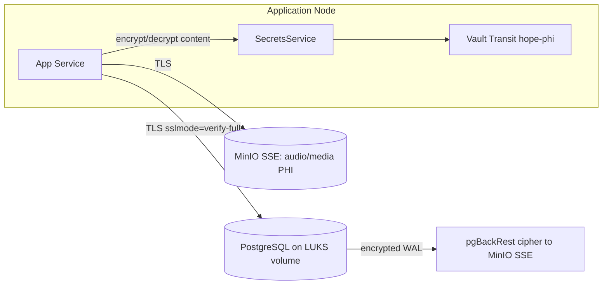
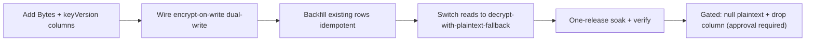

# TASK-369 — Data Encryption (At-Rest + PHI/PII Field-Level + In-Transit + Backups)

| Field | Value |
|---|---|
| **Ticket Number** | TASK-369 |
| **Ticket Name** | Data Encryption |
| **Type** | `feature` (security/compliance) + `infrastructure` + `refactor` (crypto debt) |
| **Created** | 2026-06-18 |
| **Last Updated** | 2026-06-19 |
| **Status** | **Review** — repo deliverables landed (infra + app) incl. **Phase 6** plaintext-column DROP + decrypt-only reads (dev-applied, user-approved 2026-06-19); operator actions + deferred follow-ups remain (see §6.7, §6.8) |
| **Source Plan** | Data Encryption Initiative (approved) |
| **Reusable Foundation** | TASK-302 Phase 4 — Vault Transit envelope-encryption recipe |
| **Workspace Rules** | `.cursor/rules/00-project-context.mdc`, `.cursor/rules/01-development-workflow.mdc` |

---

## TL;DR — what this ticket is

Move HOPE from an essentially unencrypted PostgreSQL posture to a **defense-in-depth, HIPAA-grade encryption posture** delivered in safe, additive phases. The initiative spans **five encryption layers** — at-rest disk encryption, application-level field encryption for free-text clinical PHI, in-transit TLS, encrypted backups, and key management / rotation / DR.

The single most important scope decision: **indexed and unique identifiers are intentionally NOT field-encrypted.** `User.username`, `User.externalId`, `UserProfile.email`, and `Consultation.patientId` stay plaintext columns protected by at-rest disk encryption + RBAC, so all existing lookups and uniqueness constraints keep working with zero query changes. Only **free-text clinical content** is field-encrypted, using **randomized Vault Transit** encryption (no exact-match search needed on those fields).

> This ticket is executed in parallel across **infra**, **application**, and **docs** workstreams. This README is owned by the docs workstream and is the consolidation point for per-phase Implementation Summaries as they land.

---

## 1. Requirement Analysis

### 1.1 Description

HOPE stores clinical and personal health information for a healthcare AI platform, but the database is currently largely unencrypted. This ticket brings the data tier to a HIPAA-aligned encryption posture covering all five layers, reusing the Vault Transit envelope-encryption pattern already prototyped under TASK-302 Phase 4 and extending it to clinical free-text fields, while standing up the infrastructure layers (disk, TLS, backups) and the operational layer (key rotation, DR).

### 1.2 Business & Compliance Context

| Concern | Why it matters |
|---|---|
| **PHI/PII at rest is unencrypted** | Clinical transcripts, summaries, highlights, NLP entities, and audit payloads sit in plaintext columns. A stolen disk, VM snapshot, decommissioned drive, or leaked DB dump exposes PHI directly. |
| **HIPAA Security Rule — encryption** | HIPAA treats encryption of ePHI at rest (45 CFR 164.312(a)(2)(iv)) and in transit (45 CFR 164.312(e)(2)(ii)) as **addressable** implementation specifications: a covered entity must implement them where reasonable and appropriate, or document an equivalent alternative. For a healthcare AI platform handling clinical content, encryption is the reasonable-and-appropriate choice. |
| **HIPAA Security Rule — audit controls** | Audit controls (45 CFR 164.312(b)) are a **required** standard. Audit payloads (`AuditLog.data`/`previousData`) themselves contain PHI snapshots and must be protected without breaking the audit trail. |
| **Healthcare PHI/PII sensitivity** | Free-text clinical content (transcripts, reference notes, highlights, summaries) is the highest-sensitivity data class. A compromised DB (SQL-injection read, leaked dump, malicious DBA) must not yield readable clinical content without separate possession of Vault capability. |
| **Largest PHI store is object storage** | Audio/media files dwarf the DB in PHI volume; the DB holds only references (`Media.uri`). Object-storage SSE + TLS is required to cover that store. |
| **Crypto debt** | `StorageAccessKey.secretAccessKey` is labeled "encrypted at app layer" but stored as plain `String`; `crypto.service.ts` uses AES-256-CBC (finding APP-002). Both are remediated in Phase 5. |

### 1.3 Locked Scope Decisions

These decisions are fixed for this initiative (from the approved plan):

1. **Comprehensive + phased.** All five layers (at-rest, field-level PHI, in-transit, backups, key management), delivered in safe additive phases.
2. **Identifiers stay plaintext.** Searchable identifiers — `User.username` (`@unique`), `User.externalId` (`@unique`), `UserProfile.email` (indexed), `Consultation.patientId` (indexed) — are **NOT** field-encrypted. They remain plaintext columns protected by **Phase 1 disk encryption + RBAC**. This preserves all existing lookups and uniqueness with zero query changes.
3. **Field encryption targets free-text clinical content only**, using **randomized Vault Transit** encryption (no exact-match requirement on those fields).

### 1.4 Acceptance Criteria

This ticket is **Completed** when all of the following are true (per-phase verification gates are in §6):

- [ ] **Phase 1** — LUKS/dm-crypt enabled on Postgres data + WAL volumes (`lsblk -f` shows `crypto_LUKS`); MinIO SSE enabled on media + pgBackRest buckets; Redis PHI-cache volume encrypted or persistence disabled; LUKS auto-unlock key custody documented.
- [ ] **Phase 2** — All Postgres connection strings enforce TLS (`sslmode=require`, target `verify-full`); non-TLS connections rejected in staging/prod; MinIO `MINIO_USE_SSL=true` in prod.
- [ ] **Phase 3A** — Dedicated `hope-phi` Vault Transit key provisioned (dev + prod); `SecretsService.encrypt/decrypt` supports a keyed API; `VAULT_TRANSIT_KEY_PHI` env wired.
- [ ] **Phase 3B** — `ContextItem.content` field-encrypted end-to-end (additive columns, entity/mapper/repo, service wiring, idempotent backfill, full test suite).
- [ ] **Phase 3C** — All Category B free-text clinical fields field-encrypted via the same recipe.
- [ ] **Phase 3D** — `AuditLog` batch/DEK approach benchmarked and chosen; WORM hash-chained tables encrypt-before-hash for new rows; voiceprint decision recorded; audio confirmed covered by object-storage SSE.
- [ ] **Phase 4** — pgBackRest repo cipher (`aes-256-cbc` + Vault-managed pass) enabled; encrypted backup + restore verified; hardcoded S3 creds rotated.
- [ ] **Phase 5** — Key rotation/rewrap procedure; DR/break-glass runbook; Transit monitoring/alerts (fail-closed); `crypto.service.ts` migrated to AES-256-GCM; `StorageAccessKey.secretAccessKey` actually encrypted.
- [x] **Phase 6** — Gated plaintext cleanup completed (user-approved 2026-06-19): 30 free-text clinical PHI columns + `NamedEntity_text_idx` dropped across 14 models; read paths switched to decrypt-only. Coded identifiers + `Notification.title` + `AuditLog`/WORM plaintext intentionally retained (see §6.2).
- [x] All migrations were additive (`ADD COLUMN`) until Phase 6; the single Phase 6 `DROP COLUMN` migration ran only with explicit user sign-off (no `DELETE`/`TRUNCATE`).

### 1.5 Out of Scope

- Field-encrypting identifiers (`email` / `username` / `externalId` / `patientId`) — intentionally excluded per the locked decision.
- Re-architecting voiceprint similarity search (`UserVoiceProfile.embedding` stays searchable under disk encryption + RBAC).
- Client-side / end-to-end encryption in the SDK.

### 1.6 Key Risks

| Risk | Mitigation |
|---|---|
| **Performance** — Vault Transit adds a round-trip per encrypt/decrypt; hot read paths (a consultation's many `ContextItem`s, high-volume audit logs) could regress. | Benchmark in Phase 3B/3D before broad rollout; use Transit batch and/or per-request DEK envelope for high-volume tables. |
| **Loss of queryability** on encrypted columns. | Confirmed safe by excluding all indexed/unique identifiers; still must verify no ad-hoc filters on the free-text fields (e.g. `NamedEntity_text_idx`). |
| **Vault as a hard dependency** — the app cannot read PHI if Vault is down. | HA Vault + fail-closed handling + DR/break-glass runbook (Phase 5). |

---

## 2. Threat Model

Each layer defends against a distinct class of attacker. Layers are additive — defense-in-depth, not either/or.

| # | Layer | Defends against | Does **not** cover |
|---|---|---|---|
| 1 | **At-rest disk encryption** (LUKS/dm-crypt; MinIO SSE; Redis volume) | Stolen disks, VM snapshots, decommissioned hardware, raw on-disk backup files. Covers every column / index / WAL / temp file at once — the compliance floor. | A live DB read by an authenticated/compromised query path (the OS sees plaintext while mounted). |
| 2 | **Field-level encryption** (randomized Vault Transit `hope-phi`, free-text clinical content) | A compromised DB — SQL-injection read, leaked dump, or malicious DBA — cannot read clinical content without separately holding Vault capability. | Identifiers (left plaintext by design); a fully compromised API node (see note). |
| 3 | **In-transit TLS** (`sslmode=require`/`verify-full`; MinIO SSL) | Network sniffing / MITM between services and the DB or object store. | Data at rest or in the application's memory. |
| 4 | **Encrypted backups** (pgBackRest repo cipher `aes-256-cbc`, Vault-managed pass) | Stolen backup archives or a compromised backup bucket — backup repos are readable plaintext today. | The live cluster (covered by Layers 1–3). |
| 5 | **Key management / rotation / DR** (dedicated `hope-phi` key, rotation/rewrap, break-glass, monitoring) | A leaked key version (rotation + rewrap limit blast radius); permanent data loss on Vault/key loss (DR runbook); silent fail-open on a Vault outage (fail-closed alerts). A separate PHI key isolates rotation/policy blast radius from secrets. | Mis-issued but legitimate capability on a compromised node. |

> **Residual risk (out of scope):** A fully compromised **API node** can still decrypt, because it legitimately holds Vault capability. This is handled by node hardening + RBAC, not by these encryption layers.



---

## 3. Data Classification

PHI/PII inventory grouped by disposition. Categories **A** (identifiers) and **B-bio** (biometric/audio) are **not** field-encrypted; Category **B** (free-text clinical) is field-encrypted; Category **C** (credentials/secrets) is handled by hashing / the existing envelope recipe / Phase 5 crypto hardening.

### (A) Indexed / unique identifiers — left **plaintext** (Layer 1 disk encryption + RBAC)

Field-encrypting these would break uniqueness constraints, indexed lookups, and exact-match queries. The locked decision keeps them searchable and relies on at-rest disk encryption + access control.

| Field | Constraint / use | Disposition |
|---|---|---|
| `User.username` | `@unique` login identifier | Plaintext — preserves uniqueness + lookups |
| `User.externalId` | `@unique` external IdP subject | Plaintext — preserves uniqueness + lookups |
| `UserProfile.email` | indexed contact identifier | Plaintext — preserves indexed lookups |
| `Consultation.patientId` | indexed patient reference | Plaintext — preserves indexed lookups |
| `UserProfile.phone` | demographic PII | Plaintext — not a field-encryption target this initiative |
| `UserProfile.firstName` | demographic PII | Plaintext — not a field-encryption target this initiative |
| `UserProfile.lastName` | demographic PII | Plaintext — not a field-encryption target this initiative |

### (B) Free-text clinical content — **field-encrypted** (randomized Vault Transit `hope-phi`)

Additive `Bytes?` ciphertext column + `keyVersion Int?` per field; encrypt-on-write / decrypt-on-read. The one-release dual-read soak is complete: **Phase 6 (2026-06-19) dropped the plaintext columns**, so these fields now persist as ciphertext only and are repopulated as transient in-memory properties by repository decrypt-on-read (Vault required at runtime). See §6.2 Phase 6.

| Model.field(s) | Service area | Phase |
|---|---|---|
| `ContextItem.content` | Consultation context (pilot) | 3B |
| `ContextItemVersion.content`, `.contentDiff`, `.changeSummary`, `.fieldChanges` | Consultation context history | 3C |
| `Highlight.exact`, `.prefix`, `.suffix`, `.note` | Consultation highlights | 3C |
| `NamedEntity.text`, `.normalizedText`, `.codes`, `.metadata` | Medical NLP entities | 3C (drop unused `NamedEntity_text_idx` if not used for search) |
| `SummaryMeta.citationsMap`, `.guardrailDecisions` | Summarization metadata (JSONB) | 3C |
| `TranscriptionJob.resultText`, `.resultMetadata` | STT transcripts | 3C |
| `GoldenCase.transcript`, `.referenceNote` | Harness eval datasets | 3C |
| `EvalRun.notes`, `EvalScore.rationale`, `EvalScore.details` | Harness eval results | 3C |
| `DnaWritingStyleReport.styleText`/`.reportData`, `DnaWritingStyleVersion.styleText`/`.reportData` | DNA writing style | 3C |
| `KnowledgeChunk.text` | Knowledge base chunks | 3C |
| `Notification.message*` | User notifications | 3C |
| `PromptTemplate.lastTestOutput` | Prompt test output | 3C |
| `AuditLog.data`, `.previousData` (JSONB) | Audit payloads | **3D** — very high write volume → Transit **batch** and/or per-request **DEK envelope** (benchmark first) |

**Special handling within Category B (Phase 3D):**

- **WORM hash-chained tables** (`HarnessAuditEvent`, `HarnessPolicyChange`, `PipelinePolicyChange`): encrypt the payload **before** computing the integrity hash and before insert. **New rows only** — rows are immutable (`REVOKE UPDATE/DELETE`); historical rows rely on Layer 1 (cannot be rewritten).
- **JSONB fields**: encrypt the whole blob as bytes; first confirm no query filters reach inside them.

### (B-bio) Biometric / audio special cases — **not field-encrypted**

| Asset | Type | Disposition |
|---|---|---|
| `UserVoiceProfile.embedding` (pgvector) | Biometric voiceprint | Encrypting breaks similarity search → keep in DB under Layer 1 + RBAC; flagged as a **separate decision**. |
| Audio / media files (targets of `Media.uri`) | Audio/media PHI (largest store) | Covered by **Layer 1 (MinIO SSE)** + **Layer 3 (TLS)**; DB holds only references. |

### (C) Credentials / secrets

Largely out of the free-text field-encryption scope — these are one-way hashed, handled by the existing `GlobalSetting` envelope recipe, or remediated as crypto debt in Phase 5.

| Field | Nature | Disposition / action |
|---|---|---|
| `GlobalSetting.value` | Platform secret values | TASK-302 Phase 4 envelope recipe (`encryptedValue Bytes?` + `keyVersion Int?`); the pilot completes the missing live write/read wiring. |
| `StorageAccessKey.secretAccessKey` | Object-store secret key | Currently plain `String` despite an "encrypted at app layer" label → **Phase 5** makes it actually encrypted. |
| `User.password` | Authentication credential | Credential material; out of field-encryption scope; Layer 1 + access control. |
| `User.secret1`, `User.secret2` | Auth/secret material | Out of field-encryption scope; Layer 1 + access control. |
| `ApiKey.keyHash` | API key digest | One-way hash; not a reversible-encryption target. |
| `Webhook.hashedSecret` | Webhook signing secret digest | One-way hash; not a reversible-encryption target. |

> **Phase 5 crypto-debt note:** migrate `crypto.service.ts` from **AES-256-CBC → AES-256-GCM** (finding APP-002).

---

## 4. Current State Evaluation

The encryption pattern is **not greenfield** — TASK-302 Phase 4 built a reusable foundation that this initiative extends. The pilot (Phase 3B) completes the one piece TASK-302 left unfinished.

| Already built (TASK-302 Phase 4) | Location (existing) |
|---|---|
| Crypto API — `encrypt(Buffer) -> string` / `decrypt(string) -> Buffer` (capability-checked, Vault-only) | `packages/applications/src/services/baseServices/_meta/secrets/SecretsService.ts` |
| Transit calls — `transit/encrypt|decrypt/<key>` | `packages/applications/src/services/baseServices/_meta/secrets/providers/vault-secrets.provider.ts` |
| Column + repo + mapper recipe (Bytes-safe) | `GlobalSettingRepository.encryption.ts`, `GlobalSettingEntityMapper.ts`, `globalSetting.prisma` (`encryptedValue Bytes?` + `keyVersion Int?`) |
| Read-only PHI decrypt CLI (admin/dev) | `packages/database/scripts/decrypt-row.ts` (backfill scripts removed — see §6.9) |
| Vault provisioning | `infrastructure/docker/configs/vault/dev-init.sh`, env in `.env.dev` |

**Known gap:** the live service **write/read path was never wired** under TASK-302 (Phase 4C/4D). The Phase 3B pilot completes that missing wiring and generalizes the recipe to clinical free-text fields.

> File references above describe **existing** code (the reusable foundation); they are not changes made under this ticket. Concrete per-phase changes are recorded in §6 as they land.

---

## 5. Implementation Plan

Layer order for every code-touching change follows the HOPE dependency chain: **Database → Domain → Service → API.** Every migration is additive (`ADD COLUMN`) until Phase 6.

### 5.1 Phase summary

| Phase | Name | Scope |
|---|---|---|
| **1** | At-rest disk encryption (infra) | LUKS/dm-crypt on Postgres data + WAL volumes (dev compose, single-deployment, HA Patroni VMs); MinIO SSE for media + pgBackRest buckets; Redis volume; LUKS auto-unlock key custody (clevis-tang or Vault-stored passphrase). Compliance floor — covers every column/index/WAL/temp file. |
| **2** | In-transit TLS | `sslmode=require` (target `verify-full` with CA) on `DATABASE_URL`/`DIRECT_URL` for `api`, `stt-v2`, `smr`, `guardrail`, `harness`; server TLS on Patroni/pgBouncer; confirm MinIO SSL. Verify non-TLS rejected. |
| **3A** | Field-level: PHI key + keyed crypto API | Provision dedicated `hope-phi` Transit key (`min_decryption_version=1`, `deletion_allowed=false`, `exportable=false`); extend `VaultProviderConfig` + `SecretsService.encrypt/decrypt` to accept an optional key name; add `VAULT_TRANSIT_KEY_PHI`. Separate key = independent rotation/policy blast radius. |
| **3B** | Field-level: pilot on `ContextItem.content` | Additive `encryptedContent Bytes?` + `contentKeyVersion Int?`; entity getters/setters + `@Secret()`; Bytes-safe mapper; new `ContextItemRepository.encryption.ts` sibling; service encrypt-on-write / decrypt-on-read (generic `findById` never decrypts; DTOs never expose ciphertext); idempotent `--dry-run` backfill; full test suite. |
| **3C** | Field-level: rollout | Apply the recipe to all remaining Category B fields (`ContextItemVersion`, `Highlight`, `NamedEntity`, `SummaryMeta`, `TranscriptionJob`, `GoldenCase`, `EvalRun`/`EvalScore`, DNA style, `KnowledgeChunk`, `Notification`, `PromptTemplate`). |
| **3D** | Field-level: special cases | `AuditLog` JSONB via batch/DEK (perf); WORM hash-chained tables encrypt-before-hash (new rows only); voiceprint embedding decision; confirm audio covered by object-storage SSE. |
| **4** | Backup encryption | pgBackRest `repo-cipher-type=aes-256-cbc` + `repo-cipher-pass` (from Vault); verify encrypted backup + restore; rotate hardcoded S3 creds committed in `pgbackrest.conf`. |
| **5** | Key management, rotation, DR, ops | `hope-phi` rotation policy + `transit/rewrap` (tracked by `keyVersion` columns); DR/break-glass runbook (Vault unseal + LUKS recovery); Transit latency/error alerts + fail-closed; migrate `crypto.service.ts` CBC→GCM; encrypt `StorageAccessKey.secretAccessKey`. |
| **6** | Gated plaintext cleanup | **Done 2026-06-19 (user-approved, dev).** Dropped 30 free-text clinical PHI columns across 14 models + `NamedEntity_text_idx`; reads switched to decrypt-only. One `DROP COLUMN` migration; coded identifiers / `Notification.title` / `AuditLog` + WORM plaintext retained. |

### 5.2 Per-field migration lifecycle

Every encrypted field follows this lifecycle; the final (destructive) step is gated on approval.



### 5.3 HIPAA Security Rule mapping

Citations verified 2026-06-18 against **45 CFR §164.312** (Cornell LII e-CFR and the GovInfo CFR text). Note the type: **(a)(2)(iv)** and **(e)(2)(ii)** are *Addressable* implementation specifications; **(b)** is a *Required* standard. HHS Risk Analysis guidance groups (a)(2)(iv) and (e)(2)(ii) together as the encryption decisions.

| Encryption concern | Phase(s) | HIPAA citation | Type | Regulatory text (summary) |
|---|---|---|---|---|
| **Encryption at rest** | 1 (disk) + 3 (field-level) | **45 CFR 164.312(a)(2)(iv)** — Encryption and decryption | Addressable | "Implement a mechanism to encrypt and decrypt electronic protected health information." Both disk encryption and field-level encryption render ePHI unreadable at rest. |
| **Encryption in transit** | 2 | **45 CFR 164.312(e)(2)(ii)** — Encryption (under Transmission Security) | Addressable | "Implement a mechanism to encrypt electronic protected health information whenever deemed appropriate." |
| **Audit controls** | 3D (`AuditLog` encryption) + 5 (Transit monitoring) | **45 CFR 164.312(b)** — Audit controls | Required (Standard) | "Implement hardware, software, and/or procedural mechanisms that record and examine activity in information systems that contain or use electronic protected health information." |

> Backup encryption (Phase 4) falls under the same encryption-at-rest umbrella — 45 CFR 164.312(a)(2)(iv) applied to backup media.

### 5.4 Testing strategy (TDD, per layer)

- **Domain unit (Vitest):** entity getters/setters; Bytes-safe mapper round-trip (Buffer not destructured); repo encrypt/decrypt helpers with a mock `SecretsServiceLike`.
- **Service unit (Vitest):** encrypt-on-write called before persist; decrypt-on-read where needed; DTOs exclude ciphertext; generic `findById` does not decrypt.
- **Integration (`test:integration`, real Vault dev container):** round-trip through actual Transit; key-version parsing; backfill idempotency + `--dry-run`.
- **Migration review:** every migration additive (`ADD COLUMN`); no destructive SQL until Phase 6.
- **Infra verification:** LUKS present (`lsblk -f`); TLS enforced (non-TLS rejected); pgBackRest encrypted restore succeeds.

---

## 6. Implementation Summary

> **Consolidated 2026-06-18** from the infra and application workstreams. Each phase below records files changed, migrations, decisions, and verification. Items requiring real-host execution are in §6.7 (Outstanding Operator Actions); not-yet-built items are in §6.8 (Deferred / Follow-up Work). Status remains **In Progress** because of the deferred items.

### 6.1 Phase status (tracking)

Updated 2026-06-18 after the infra and application workstreams reported. "Operator action" = real-host work that cannot be performed in the repo (see §6.7).

| Phase | Workstream | Status |
|---|---|---|
| 0 — Ticket docs (this README) | docs | In Progress (kept current as deferred items land) |
| 1 — At-rest disk encryption | infra | Repo deliverables complete — host execution is an operator action |
| 2 — In-transit TLS | infra | Client config complete — server-side TLS is an operator action |
| 3A — PHI key + keyed crypto API | application | Complete (verified green) — prod key init + ACL are operator actions |
| 3B — Pilot: `ContextItem.content` | application | Complete (verified green) |
| 3C — Rollout (remaining Category B) | application | Complete (verified green) — only Python-owned bulk-write paths remain (§6.8) |
| 3D — Special cases | application | Complete (verified green) — AuditLog envelope + WORM encrypt-before-hash |
| 4 — Backup encryption | infra | Config complete — credential rotation is an operator action |
| 5 — Key mgmt / rotation / DR | infra + application | Code + runbooks + alerts complete — operator actions pending |
| 6 — Gated plaintext cleanup | application | **Complete (verified green)** — user-approved 2026-06-19; 30 plaintext PHI columns + `NamedEntity_text_idx` dropped (dev); decrypt-on-read switched to ciphertext-only |

### 6.2 Per-phase detail

#### Phase 1 — At-rest disk encryption (infra)
Repo deliverables complete; host LUKS/SSE execution is an operator action (§6.7).
- Runbook: `research/deployments/encryption-at-rest-luks-minio-sse-runbook.md`.
- `infrastructure/docker/docker-compose.yml`: at-rest comments on `postgres-data` + `redis`; opt-in MinIO SSE.

#### Phase 2 — In-transit TLS (infra)
Client-side TLS enforced across services; server-side TLS on Patroni/PgBouncer + CA distribution remain operator actions (§6.7).
- `.env.production`: `DATABASE_URL` `sslmode=require` (target `verify-full`); `MINIO_USE_SSL=true`.
- `.env.dev` & `.env.test`: documented dev/test no-TLS; HA examples `sslmode=require`.
- `apps/api/.env.example`: TLS guidance on `DATABASE_URL`/`DIRECT_URL`.
- `apps/stt-v2/.env.production`: `?ssl=require` + `MINIO_SECURE=true`.
- `apps/guardrail/.env.example`: `?ssl=require`.

#### Phase 3A — PHI Transit key + keyed crypto API (application) — verified green
- `hope-phi` Transit key added to `infrastructure/docker/configs/vault/dev-init.sh`.
- Keyed `encrypt` / `decrypt(…, keyName?)` on `SecretsService` + `VaultSecretsProvider`.
- `secrets.module` wires `VAULT_TRANSIT_KEY_PHI ?? 'hope-phi'`.
- Integration fix (resolved in-repo): the `hope-app` Vault policy now grants Transit encrypt/decrypt on `hope-phi` in `infrastructure/docker/configs/vault/policies/hope-app.hcl` (dev) and `infrastructure/single-deployment/vault/bootstrap/configure-app-auth.sh` (prod-HA, which also creates the prod `hope-phi` key). Loading the edited policy + prod key init on the running Vault remain operator actions (§6.7).

#### Phase 3B — Pilot: `ContextItem.content` (application) — verified green
- New `packages/domains/src/common/field-encryption.ts` — PHI encrypt/decrypt primitives (default key `hope-phi`).
- Fixed a latent Buffer/Date corruption bug in `removeNullValues.ts`.
- `ContextItem` entity/model/mapper + `ContextItemRepository.encryption.ts` + barrel + tests.
- `context.service.ts`: encrypt-on-write + audit-payload ciphertext stripping.
- Backfill: `packages/database/scripts/backfill-contextitem-content-encryption.ts` (batched, idempotent, `--dry-run`).

#### Phase 3C — Rollout to remaining Category B fields (application) — complete (verified green)
Domain layer complete for all **13** models; encrypt-on-write is now wired across their TS application services. Only Python-owned bulk-write paths remain (§6.8).
- Models: `ContextItemVersion`, `Highlight`, `NamedEntity`, `SummaryMeta`, `TranscriptionJob`, `GoldenCase`, `EvalRun`, `EvalScore`, `DnaWritingStyleReport`, `DnaWritingStyleVersion`, `KnowledgeChunk`, `Notification`, `PromptTemplate`.
- Per model: `encrypted<Field> Bytes` + `keyVersion Int`, `@Secret()`, Bytes-safe mapper handlers, repo `.encryption.ts` siblings.
- **Encrypt-on-write** wired for all 12 models across their TS application services; additionally `consultation/harness/harness-internal.service.ts` was wired for `NamedEntity`, `SummaryMeta` (two sites: `persistDraft` create + `finalizeAssurance` update), and `ContextItemVersion`.
- **Backfills:** an idempotent batched script per model under `packages/database/scripts/`, backed by a shared engine `packages/database/scripts/_phi-encryption-backfill.shared.ts`.
- Verification: full `@arcaai/applications` unit suite green — 235 passed / 1 skipped files, 5320 passed / 4 skipped tests.

#### Phase 3D — Special cases (application) — complete (verified green)
- `AuditLog.data`/`previousData`: **envelope encryption** — a cached DEK is wrapped once via Vault Transit `hope-phi`, then used for local AES-256-GCM per row. Wired into all 3 write paths + decrypt-on-read in `fetchById` only (`list` / `export` stay on retained plaintext during the soak).
- WORM tables (`HarnessAuditEvent`, `HarnessPolicyChange`, `PipelinePolicyChange`): PHI payloads encrypted **before** the integrity hash, **new-rows-only**; encrypt-before-hash applied in both the insert and chain-verify paths.
- `UserVoiceProfile.embedding`: **NOT** encrypted (pgvector similarity search) — stays under disk encryption + RBAC.
- Audio/media: object-storage-only (MinIO SSE + TLS); no field encryption (DB holds only references).
- Verification: 31 domain + 27 applications Phase 3D tests pass; domains suite 1260 passed / 2 skipped; no regressions.
- Benchmark: local AES-GCM adds ~8 µs/row (~3%); envelope dual-write insert throughput statistically identical to plaintext. The Vault-Transit DEK-wrap latency number is **pending** loading the `hope-phi` ACL grant on the running Vault (policy file edited; operator action §6.7).

#### Phase 4 — Backup encryption (infra)
Config complete; rotating the compromised `pgbackrest-svc` MinIO credentials + setting a fresh cipher pass in Vault is an operator action (§6.7).
- `research/configs/postgres-ha/pgbackrest/pgbackrest.conf`: `repo1-cipher-type=aes-256-cbc`; removed hardcoded S3 creds → env-injected.
- `pgbackrest-local.conf.example`: same cipher.
- `research/configs/postgres-ha/docker-compose.yml`: inject `PGBACKREST_REPO1_S3_KEY` / `_SECRET` / `_CIPHER_PASS` into patroni.
- `research/configs/postgres-ha/.env.example`: placeholders for the 3 `PGBACKREST_*` secrets.

#### Phase 5 — Key management, rotation, DR, crypto debt (infra + application)
**Infra:**
- Runbooks: `research/deployments/dr-break-glass-runbook.md`, `research/deployments/vault-transit-key-rotation.md`.
- `research/configs/postgres-ha/prometheus/vault-transit-alerts.yml` — 5 Prometheus rules: `VaultSealed`, `VaultTargetDown`, `VaultNoActiveNode`, `VaultRequestLatencyHigh`, `VaultLeadershipFlapping`.
- `infrastructure/SECURITY_DEPLOYMENT_GUIDE.md` — consolidated index + operator checklist.
- Verification: `promtool` 5 rules OK; `yq` parse OK; ReadLints clean.

**Application:**
- `crypto.service.ts` migrated to **AES-256-GCM** with back-compat legacy CBC decrypt (had zero production callers). Verification: CryptoService 41/41 passing.
- `StorageAccessKey.secretAccessKey`: **deviation** (§6.6) — already a one-way peppered HMAC-SHA256 hash with Vault-managed backend creds; reversible encryption is not applicable. Stale schema comment corrected.
- Operator actions: load Vault alerts into Prometheus; init `hope-phi` `auto_rotate_period` (§6.7).

#### Phase 6 — Gated plaintext cleanup (application) — complete (verified green), user-approved 2026-06-19
The dual-read soak is over: the plaintext PHI columns are **dropped** and all read paths are **decrypt-only**. Dev DB only (`localhost:5432/hope`, `SECRETS_PROVIDER=vault`); no staging/prod, no commit/push.

**Migration:** `20260619100000_task_369_phase6_drop_plaintext_phi_columns` — a single non-additive migration with only `DROP COLUMN`s (+ one `DROP INDEX`). **30 plaintext columns across 14 models** + the now-unused `NamedEntity_text_idx`:
- `ContextItem.content`
- `ContextItemVersion.content` / `.contentDiff` / `.changeSummary` / `.fieldChanges`
- `Highlight.exact` / `.prefix` / `.suffix` / `.note`
- `NamedEntity.text` / `.normalizedText` / `.metadata`  (+ drop `NamedEntity_text_idx`)
- `SummaryMeta.citationsMap` / `.guardrailDecisions`
- `TranscriptionJob.resultText` / `.resultMetadata`
- `GoldenCase.transcript` / `.referenceNote`
- `EvalRun.notes`
- `EvalScore.rationale` / `.details`
- `DnaWritingStyleReport.styleText` / `.reportData`
- `DnaWritingStyleVersion.styleText` / `.reportData`
- `KnowledgeChunk.text`
- `Notification.messageText` / `.messageRichText` / `.messageContent`
- `PromptTemplate.lastTestOutput`

**Intentionally retained (NOT dropped), with rationale:**
- **`NamedEntity` coded fields** (`umlsCui` / `snomedCode` / `rxnormCode` / `icdCode` / `loincCode`) and **`Notification.title`** — structured identifiers / short labels, no `encrypted*` counterpart; outside the "free-text clinical content only" scope.
- **`AuditLog.data` / `.previousData`** — DEK-envelope encrypted on a separate path; plaintext retained for legacy rows (decrypt-on-read stays `fetchById`-only; §6.6).
- **WORM payloads** (`HarnessAuditEvent` / `HarnessPolicyChange` / `PipelinePolicyChange`) — append-only (UPDATE/DELETE revoked); `encrypted*` coexists with the immutable plaintext.

**Code — entities / models / mappers / repos:** Each dropped field is now a **transient in-memory property** (declaration + constructor assignment removed from the 14 `models/generated/core/*Model.ts`, so the auto-mappers persist ciphertext only — they iterate real model columns). The 14 `*Repository.encryption.ts` siblings had their **dead plaintext fallback removed** — `decrypt*FromEntity` returns `null` when the ciphertext is null (no legacy column to read).

**Decrypt-on-read (Option A — auto-decrypt in the repository):**
- New `packages/domains/src/common/phi-read-decrypt.ts` — one **global registry** `PHI_CIPHERTEXT_FIELDS` maps the 26 unique `encrypted<Field>` columns (covering all 30 dropped fields) to their transient plaintext target (+ JSON flag).
- The base `Repository.db` getter wraps the Prisma delegate (`wrapDelegateWithPhiDecrypt`) **only when a SecretsService is wired** (Vault mode), so every row-returning read — generic finders, hand-written custom finders, **and nested PHI rows pulled via `include` from any repository** — flows through `decryptPhiRows`. One wrap point; zero overhead in non-Vault dev/test (the wrap is skipped).
- **Batch:** one Vault Transit `decryptBatch` round-trip per result set (all ciphertext across all rows + nested relations decrypted together under `hope-phi`). Added `decryptBatch` to `SecretsServiceLike`, `SecretsService`, and `VaultSecretsProvider` (Transit `batch_input` / `batch_results`).
- Wiring: `secrets.module.ts` calls `setPhiReadSecrets(svc)` once when a Transit-capable (Vault) provider is active.

**Consequence — Vault is now hard-required for these PHI reads/writes:** with no plaintext column, any environment that must read or persist these fields runs `SECRETS_PROVIDER=vault`. The write path is already env-gated **fail-closed** (§6.9-(2)); in soft (non-Vault) dev/test the fields are simply left unpersisted (no silent plaintext).

**Reseed (dev):** seeds now write ciphertext via a seed-time helper `packages/database/src/prisma/db_main/seed/phi-encryption.ts` (`encryptSeedRow`) that calls Vault Transit `hope-phi` directly through `node-vault` — same `vault:vN:<b64>`-as-bytes format the services write (the leaf `@arcaai/database` package cannot import `@arcaai/domains`/`@arcaai/applications` without a dependency cycle, mirroring the sanctioned `decrypt-row.ts`). Wired into `09-consultation.ts` (ContextItem, ContextItemVersion, NamedEntity, TranscriptionJob) and `08-dna-writing-style.ts` (DnaWritingStyleReport / Version). Dev was synced + reseeded with `SECRETS_PROVIDER=vault` and a round-trip decrypt verified.

**Dev apply note:** the dev DB had never run the Phase 3 additive migrations (its `encrypted*` columns were missing), so dev was synced with `prisma db push --accept-data-loss` (adds the missing `encrypted*` columns **and** applies the Phase 6 drops) rather than `migrate dev`. The committed `DROP COLUMN` migration above is the artifact for environments with a clean migration history. To reproduce on dev:

```
SECRETS_PROVIDER=vault VAULT_ADDR=… VAULT_ROLE_ID=… VAULT_WRAPPED_SECRET_ID=… \
  pnpm --filter @arcaai/database db:push          # or db:migrate where history is clean
pnpm --filter @arcaai/database db:generate
SECRETS_PROVIDER=vault VAULT_ADDR=… …             pnpm --filter @arcaai/database db:seed
```

**Perf follow-up:** decrypt-on-read issues one batch Transit call per result set. Hot **list / index** reads that return PHI rows but don't need the plaintext still pay that batch call — a future optimisation can make decryption opt-in per query (skip when the caller only needs non-PHI columns). Recorded here, not redesigned now.

**Verification:** `@arcaai/database` 783 / `@arcaai/domains` 1263 (+2 skipped, 9 todo) / `@arcaai/applications` 5328 (+4 skipped) unit tests pass; touched files lint-clean. Integration paths that exercise real decrypt-on-read require a live Vault.

### 6.3 Files changed (rolled up)

**Infra — created:**
- `research/deployments/encryption-at-rest-luks-minio-sse-runbook.md`
- `research/deployments/dr-break-glass-runbook.md`
- `research/deployments/vault-transit-key-rotation.md`
- `research/configs/postgres-ha/prometheus/vault-transit-alerts.yml`
- `infrastructure/SECURITY_DEPLOYMENT_GUIDE.md`

**Infra — modified:**
- `.env.production`, `.env.dev`, `.env.test`
- `apps/api/.env.example`, `apps/stt-v2/.env.production`, `apps/guardrail/.env.example`
- `research/configs/postgres-ha/pgbackrest/pgbackrest.conf`, `pgbackrest-local.conf.example`
- `research/configs/postgres-ha/docker-compose.yml`, `research/configs/postgres-ha/.env.example`
- `infrastructure/docker/docker-compose.yml`

**Application — created:**
- `packages/domains/src/common/field-encryption.ts`
- `ContextItemRepository.encryption.ts` + `.encryption.ts` repo siblings for the 13 Category B models
- `packages/database/scripts/backfill-contextitem-content-encryption.ts` _(removed in §6.9 follow-up)_
- `packages/database/scripts/_phi-encryption-backfill.shared.ts` (shared backfill engine) + per-model backfill scripts under `packages/database/scripts/` (3C) _(all removed in §6.9 follow-up; replaced by the read-only `decrypt-row.ts` CLI)_

**Application — modified:**
- `infrastructure/docker/configs/vault/dev-init.sh` (`hope-phi` key)
- `SecretsService` + `VaultSecretsProvider` + `secrets.module` (keyed crypto API)
- `ContextItem` entity/model/mapper + barrel; `context.service.ts`; `removeNullValues.ts`
- Domain entity/model/mapper for the 13 Category B models
- TS application services for the 12 Category B models + `consultation/harness/harness-internal.service.ts` (3C encrypt-on-write); `AuditLog` + WORM service write paths (3D)
- Vault policy: `infrastructure/docker/configs/vault/policies/hope-app.hcl` (dev) + `infrastructure/single-deployment/vault/bootstrap/configure-app-auth.sh` (prod-HA `hope-phi` grant + prod key)
- `crypto.service.ts` (AES-256-GCM); `StorageAccessKey` schema-comment correction

**Application — Phase 6 (plaintext DROP + decrypt-on-read):**
- Migration `20260619100000_task_369_phase6_drop_plaintext_phi_columns` (30 `DROP COLUMN` + 1 `DROP INDEX`); 7 `packages/database/src/prisma/db_main/*.prisma` (dropped the 30 columns + `NamedEntity_text_idx`).
- 14 `packages/domains/src/models/generated/core/*Model.ts` (dropped fields → transient) + the 14 entities' comments; 14 `*Repository.encryption.ts` siblings (removed dead plaintext fallback).
- `packages/domains/src/common/phi-read-decrypt.ts` (new global decrypt-on-read) + `field-encryption.ts` (`decryptBatch`), `common/index.ts`, `common/repository.ts` (`db`-getter wrap).
- `SecretsService` + `VaultSecretsProvider` (`decryptBatch`) + `secrets.module.ts` (`setPhiReadSecrets`).
- Write-path comment corrections: `context` / `highlight` / `notification` / `eval` / `dna-writing-style` / `harness-internal` services + `common/phi-field-encryption.ts`.
- Seeds: `seed/phi-encryption.ts` (new) + `09-consultation.ts` + `08-dna-writing-style.ts`.
- Tests: 6 domains + 2 applications encryption test files updated for transient-field / decrypt-only.

### 6.4 Migrations (rolled up)

Four additive (`ADD COLUMN`) through Phase 3 + one Phase 6 destructive (`DROP COLUMN`, user-approved).
- `20260618100000_task_369_phase3b_contextitem_encrypted_content` — `ContextItem` encrypted content + key-version columns.
- `20260618110000_task_369_phase3c_clinical_fields_encrypted` — encrypted columns + `keyVersion` for the 13 Category B models.
- `20260618120000_task_369_phase3d_worm_encrypted_payloads` — encrypted PHI-payload columns for the 3 WORM tables.
- `20260618130000_task_369_phase3d_auditlog_envelope_encryption` — `AuditLog` envelope-encryption columns for `data` / `previousData` (now added — supersedes the earlier "not added this pass" note).
- `20260619100000_task_369_phase6_drop_plaintext_phi_columns` — **Phase 6 (destructive, user-approved):** drops the 30 plaintext clinical-PHI columns across 14 models + `NamedEntity_text_idx`. Reads are now decrypt-only.

### 6.5 Endpoints affected

No HTTP endpoint contracts changed. Field encryption is transparent at the service/repository layer (encrypt-on-write / decrypt-on-read); Response DTOs continue to exclude ciphertext.

### 6.6 Deviations from plan

- **`StorageAccessKey.secretAccessKey` not field-encrypted** — the plan listed it as a Phase 5 "make it actually encrypted" item, but it is already a one-way peppered HMAC-SHA256 hash and backend creds are Vault-managed, so reversible encryption is not applicable. The stale "encrypted at app layer" schema comment was corrected instead.
- **`SummaryMeta` encrypted at `finalizeAssurance`, not `persistDraft`** — `harness-internal.service.ts` `finalizeAssurance` is a 4th encrypted site; `SummaryMeta.citationsMap` / `guardrailDecisions` receive real values there and are written `NULL` at `persistDraft` create.
- **Authorization-audit emitter intentionally not wired** — it writes empty `{}` data (no PHI), so it is left unencrypted.
- **`AuditLog` decrypt-on-read limited to `fetchById`** — `list` / `export` paths intentionally stay on retained plaintext (AuditLog plaintext is retained, not dropped in Phase 6).
- **Phase 6 retained non-free-text columns** — `NamedEntity` coded fields (`umlsCui` / `snomedCode` / `rxnormCode` / `icdCode` / `loincCode`) and `Notification.title` were **not** dropped: structured identifiers / short labels with no `encrypted*` counterpart, outside the "free-text clinical content only" scope. `AuditLog` + WORM plaintext likewise retained (separate encrypt paths / append-only immutability).
- **Vault ACL policy scope (resolved in-repo)** — the Transit grant was scoped only to `hope-globalsetting`; the `hope-app` policy now grants `hope-phi` in the dev `.hcl` and the prod bootstrap script. Loading it on the running Vault is an operator action (§6.7).
- **Out-of-plan bug fix** — a latent Buffer/Date corruption bug in `removeNullValues.ts` was found and fixed during the 3B pilot.

### 6.7 Outstanding Operator Actions

Real-host actions that cannot be performed in the repo. Tracked in `infrastructure/SECURITY_DEPLOYMENT_GUIDE.md`.
- Rotate the compromised `pgbackrest-svc` MinIO credentials + set a fresh cipher pass in Vault.
- LUKS-format the Postgres data/WAL disks + establish auto-unlock key custody.
- Stand up KES/KMS + enable MinIO SSE.
- Enable server-side Postgres TLS on Patroni/PgBouncer + distribute the CA (move `sslmode=require` → `verify-full`).
- Initialize the `hope-phi` Transit key with `auto_rotate_period` + attach its ACL policy.
- Load the Vault Transit alert rules into Prometheus.

### 6.8 Deferred / Follow-up Work

- Python-owned bulk-write paths in STT-v2 / NLP that write directly to encrypted models (the TS HTTP API paths are wired).
- ~~Phase 6 gated plaintext cleanup (approval-gated).~~ **Done 2026-06-19 (dev, user-approved)** — see §6.2 Phase 6.
- **Fail-closed coverage for the audit/WORM paths** — the `AuditLog` DEK-envelope service and the WORM `encryptPayloads` callers (`harness-audit`, `harness-policy`, `pipeline-policy`) were **intentionally left best-effort** in the §6.9 follow-up (different encrypt shape + an availability requirement: the clinical audit append "must never fail closed"). Whether to make these fail-closed in staging/prod is an open decision.

### 6.9 Follow-up — decrypt CLI, fail-closed encrypt-on-write, backfill removal (2026-06-19)

Greenfield (no production data) follow-up. **No schema/migration changes and no destructive SQL** — plaintext columns and the decrypt-on-read fallback are unchanged.

**(1) Read-only decrypt CLI — `packages/database/scripts/decrypt-row.ts`**

An admin/dev tool to decrypt a single row's encrypted PHI field(s) out-of-band (support/debugging), without the running API. It reuses the former backfill bootstrap (Vault AppRole auth + the unscoped platform-admin Prisma client — copied in, since the backfill scripts were removed in (3)). **Strictly read-only** (`findUnique` only — no create/update/delete); **error-message-only** logging that never prints ciphertext/DEK/secrets (`DECRYPT_DEBUG=1` for a full stack, never in prod); requires `SECRETS_PROVIDER=vault` (exits `2` otherwise). Per-field models decrypt each `encrypted<Field>` via Transit `hope-phi` (JSONB fields are `JSON.parse`d); `AuditLog` unwraps the row's `dekWrapped` DEK once then locally AES-256-GCM-decrypts `data`/`previousData` (mirrors `CryptoService` + `AuditLogEncryptionService`). Not-yet-encrypted rows fall back to the retained plaintext column (dual-read soak).

```
SECRETS_PROVIDER=vault VAULT_ADDR=… VAULT_ROLE_ID=… VAULT_WRAPPED_SECRET_ID=… \
  pnpm --filter @arcaai/database decrypt:row -- --model <ModelName> --id <rowId> [--field <name>] [--json]
pnpm --filter @arcaai/database decrypt:row -- --help
```

Models: `AuditLog` + the 14 per-field PHI models (`ContextItem`, `ContextItemVersion`, `NamedEntity`, `SummaryMeta`, `Highlight`, `TranscriptionJob`, `GoldenCase`, `EvalRun`, `EvalScore`, `DnaWritingStyleReport`, `DnaWritingStyleVersion`, `KnowledgeChunk`, `Notification`, `PromptTemplate`). `GlobalSetting` is out of scope (non-PHI secrets under `hope-globalsetting`). Unit test: `scripts/__tests__/decrypt-row.test.ts` (20 cases — arg parsing, validation, per-field + AuditLog-envelope decrypt with mocked Vault/crypto; no live Vault/DB). Added a `decrypt:row` pnpm alias.

**(2) Env-gated FAIL-CLOSED encrypt-on-write — `packages/applications/src/common/phi-field-encryption.ts`**

Phase 3 wired encrypt-on-write as "best-effort" (silently persist plaintext-only when the SecretsService/Vault was unavailable) — correct for the dev/test soak, unsafe in staging/prod. The new shared helper `encryptPhiFields(secrets, label, run, logger, env?)` centralises the policy:

- dev/test (`SECRETS_PROVIDER` != `vault`) → **SOFT** no-op (logged, message-only, never PHI).
- staging/prod (`SECRETS_PROVIDER` == `vault`) → **FAIL-CLOSED**: a missing SecretsService **or** an encryption error **throws** so the write aborts instead of persisting plaintext-only.

All **15** per-field encrypt-on-write helpers now route through it: the 13 `encryptBestEffort` services (`harness-internal`, `ner.processor`, `comprehensive-summary.processor`, `chain-summary`, `summary`, `sttInternal`, `transcriptionJob`, `prompt-management`, `ingest-knowledge-document.processor`, `dna-writing-style.service`, `dna-writing-style.processor`, `eval`, plus `context`'s sibling-model writes) + `context.service.ts`'s `encryptContent` + `highlight.service.ts`'s `encryptHighlight` + `notification.service.ts`'s `encryptMessage`. The schema and decrypt-on-read fallback are unchanged. Tests: `common/__tests__/phi-field-encryption.test.ts` (helper — both regimes) + a fail-closed service test in `harness-internal.service.test.ts` (`persistEntities` aborts the write, `create` not called, when a Vault failure occurs under `SECRETS_PROVIDER=vault`). The `AuditLog`/WORM paths were left best-effort by design (see §6.8).

**(3) Backfill machinery removed (greenfield — nothing to backfill)**

Deleted all 15 `scripts/backfill-*-encryption.ts` (incl. the TASK-302 `backfill-globalsetting-encryption.ts`), the shared engine `scripts/_phi-encryption-backfill.shared.ts`, and their 3 `__tests__`. **Kept:** the domain `*Repository.encryption.ts` helpers, all migrations, `benchmark-auditlog-envelope-encryption.ts`, and `vault-db-smoke.*`. No `pnpm` aliases pointed at the backfills (they ran via `pnpm --filter @arcaai/database tsx scripts/…`), so none to remove; the §"unscoped client" allow-list table was repointed from the deleted globalsetting backfill to `decrypt-row.ts`.

**(4) Phase 6 (plaintext-column DROP)** was still **gated / pending approval** at the time of this §6.9 follow-up. It has since been **approved and executed (2026-06-19, dev)** — see §6.2 Phase 6 and the Change-History entry below.

**Verification:** `@arcaai/applications` 236 files / 5328 tests pass (1 file, 4 tests skipped); `@arcaai/database` 21 files / 783 tests pass; `@arcaai/domains` 99 files / 1263 tests pass (unchanged by this follow-up).

---

## 7. Change History

| Date | Author | Description | Files modified |
|---|---|---|---|
| 2026-06-18 | docs workstream | Ticket created; plan approved; implementation started in parallel across infra/app/docs workstreams. HIPAA citations verified against 45 CFR §164.312. | `docs/implementation/TASK-369-Data-Encryption/README.md` |
| 2026-06-18 | infra + application + docs workstreams | Implementation Summary consolidated. **Infra:** LUKS/MinIO-SSE + DR + Transit-rotation runbooks, 5 Vault Transit Prometheus alerts, pgBackRest `aes-256-cbc` cipher + hardcoded-S3-cred removal, TLS env hardening across services, security deployment guide. **Application:** `hope-phi` keyed crypto API (3A), `ContextItem.content` pilot (3B), domain-layer field encryption for 13 clinical models + 2 additive migrations (3C), 3D special-case decisions, CryptoService → AES-256-GCM (5). Recorded outstanding operator actions (§6.7), deferred follow-ups (§6.8), and deviations (StorageAccessKey hash; AuditLog/WORM deferral; Vault ACL `hope-phi` extension in progress). Status remains **In Progress**. | `docs/implementation/TASK-369-Data-Encryption/README.md` |
| 2026-06-18 | application + docs workstreams | Phase 3C & 3D completed. **3C:** encrypt-on-write wired for all 12 models across their TS services + `harness-internal.service.ts` (`NamedEntity`, `SummaryMeta` at `persistDraft`/`finalizeAssurance`, `ContextItemVersion`); per-model idempotent batched backfills via shared engine `_phi-encryption-backfill.shared.ts`; `@arcaai/applications` 5320 passed / 4 skipped. **3D:** `AuditLog` envelope encryption (cached DEK wrapped via Transit `hope-phi`, local AES-256-GCM per row) on all 3 write paths + decrypt-on-read in `fetchById`; WORM encrypt-before-hash (new-rows-only) in insert + chain-verify; 31 domain + 27 app tests pass, domains 1260 passed / 2 skipped. Migrations now 4 additive (added WORM payloads + AuditLog envelope; corrected the earlier "AuditLog not added" note). Vault `hope-app` policy extended to grant Transit on `hope-phi` (dev `.hcl` + prod bootstrap, which also creates the prod `hope-phi` key). New deviations recorded (`finalizeAssurance` 4th site; authorization-audit emitter not wired; `AuditLog` decrypt-on-read limited to `fetchById`). Status remains **In Progress** (operator actions §6.7 + Phase 6 cleanup remain). | `docs/implementation/TASK-369-Data-Encryption/README.md` |
| 2026-06-19 | application + docs | **Follow-up (§6.9), greenfield, no schema/destructive SQL.** (1) Added read-only `decrypt-row` CLI (`packages/database/scripts/decrypt-row.ts` + `decrypt:row` alias + 20-case unit test) — per-field Transit + `AuditLog` DEK-envelope decrypt, `SECRETS_PROVIDER=vault` gated, error-message-only. (2) Centralised **env-gated fail-closed** encrypt-on-write in `packages/applications/src/common/phi-field-encryption.ts` (`encryptPhiFields`) and routed all 15 per-field encrypt-on-write helpers through it (soft no-op in dev/test; throws under `SECRETS_PROVIDER=vault`); `AuditLog`/WORM left best-effort by design. (3) Removed all 15 `backfill-*-encryption.ts` + the shared engine + their 3 tests (kept `*Repository.encryption.ts`, migrations, benchmark, smoke). (4) Phase 6 plaintext DROP still gated/pending. Verified: applications 5328 / database 783 / domains 1263 tests pass. | `packages/database/scripts/decrypt-row.ts`, `packages/database/scripts/__tests__/decrypt-row.test.ts`, `packages/database/package.json`, `packages/database/README.md`, `packages/applications/src/common/phi-field-encryption.ts` (+`index.ts`, `__tests__`), 15 encrypt-on-write services, `harness-internal.service.test.ts`, `docs/implementation/TASK-369-Data-Encryption/README.md` |
| 2026-06-19 | database + tests + docs | **Fix — seed-time PHI encryption now environment-gated (E2E unblock), greenfield, no schema/destructive SQL.** Root cause: Phase 6's `seed/phi-encryption.ts` `encryptSeedRow` called Vault Transit **unconditionally**, but `.env.test` sets neither `SECRETS_PROVIDER` nor `VAULT_ADDR`, so `pnpm test:db:seed` threw `VAULT_ADDR is required to seed PHI ciphertext` at `08-dna-writing-style.ts:534`, aborting `test:db:reset` in Playwright `globalSetup` → the entire E2E suite failed before any test ran. The application **write-path was already env-gated** (`phi-field-encryption.ts` `isPhiEncryptionRequired`, soft no-op when `SECRETS_PROVIDER` != `vault`), but the seed was not. Fix: added `isSeedPhiEncryptionRequired()` (mirrors the app gate; can't import across the dep cycle) and made `encryptSeedRow` soft no-op in non-Vault mode — strip the dropped plaintext PHI keys, leave the nullable `encrypted*` + key-version columns NULL (byte-for-byte the app's dev/test write behaviour); `SECRETS_PROVIDER=vault` still encrypts + fails closed on missing Vault. **Verified:** new 4-case `seed/__tests__/phi-encryption.test.ts` (RED→GREEN) + full `@arcaai/database` suite 787 pass, lint clean, and live `pnpm test:db:seed` under `.env.test` completes ("Seeded 8 DNA reports" … "Database seeding completed successfully!"). | `packages/database/src/prisma/db_main/seed/phi-encryption.ts`, `packages/database/src/prisma/db_main/seed/__tests__/phi-encryption.test.ts`, `docs/implementation/TASK-369-Data-Encryption/README.md` |
| 2026-06-19 | application + database + docs | **Phase 6 — gated plaintext cleanup, user-approved (dev only).** Dropped **30 free-text clinical PHI columns across 14 models** + `NamedEntity_text_idx` via one `DROP COLUMN` migration `20260619100000_task_369_phase6_drop_plaintext_phi_columns`. Each dropped field is now a **transient** entity property; the auto-mappers persist ciphertext only; the 14 `*Repository.encryption.ts` siblings drop their plaintext fallback. **Decrypt-on-read (Option A):** new `phi-read-decrypt.ts` global registry + base `Repository.db` proxy (`wrapDelegateWithPhiDecrypt`, Vault-mode only) batch-decrypts every read incl. nested `include`d PHI rows in one Transit round-trip; added `decryptBatch` to `SecretsServiceLike` / `SecretsService` / `VaultSecretsProvider` + `setPhiReadSecrets` wiring. **Retained (rationale):** NamedEntity coded fields + `Notification.title` (no ciphertext counterpart); AuditLog + WORM plaintext (separate path / append-only). **Reseed:** seed-time `phi-encryption.ts` (`encryptSeedRow` via `node-vault` `hope-phi`) wired into `09-consultation` + `08-dna-writing-style`; dev synced via `prisma db push --accept-data-loss` (dev lacked the Phase 3 additive columns) + reseeded with `SECRETS_PROVIDER=vault`, round-trip verified. **Consequence:** Vault now hard-required for these PHI reads/writes (write path already fail-closed). **Perf follow-up:** list/index reads that don't need plaintext still pay one batch Transit call — opt-in decryption recorded for later. Stale "dual-read soak / plaintext fallback" comments corrected on the 14 entities/siblings + write-path services (AuditLog/WORM/GlobalSetting comments kept — still accurate). **Verified:** database 783 / domains 1263 (+2 skip, 9 todo) / applications 5328 (+4 skip) tests pass; lint clean. Status → **Review**. | Phase 6 migration; 14 `models/generated/core/*Model.ts`; 14 `repositories/generated/core/*Repository.encryption.ts` + entities; `common/phi-read-decrypt.ts` (+ `field-encryption.ts`, `index.ts`, `repository.ts`); `secrets.module.ts`, `SecretsService.ts`, `vault-secrets.provider.ts`; 7 `*.prisma`; `seed/phi-encryption.ts` (+ `09-consultation.ts`, `08-dna-writing-style.ts`); 6 domains + 2 applications test files; this README |
