# TASK-437 — Admin Console Redesign: Foundation (Shared Frame, Detail Drawer, JSON Editor, Theming, Responsive)

- **Status**: Completed
- **Type**: feature (UX/UI foundation — enabler for TASK-438…TASK-442)
- **Owner**: admin-console / packages-ui
- **Design source**: claude.ai design project **"ARCAAI Hope Admin console"** (`https://claude.ai/design/p/6a582386-939b-47d3-8c19-cd9338b34814`) — `Build Spec - Admin Redesign.dc.html` §1–§3 + §9; artboards `Admin Redesigns.dc.html` ids `5b`/`5c` (dark), `5e`–`5i` (mobile).
- **Related**: TASK-427 (ScreenTemplate), TASK-423 (Data Grid), TASK-415 (Admin Console). **Blocks**: TASK-438 (Roles), TASK-439 (Settings), TASK-440 (Tenant settings), TASK-441 (Tenant pages), TASK-442 (Playground).

## Redesign ticket map (epic index)

| Ticket | Screen(s) | Artboard |
|---|---|---|
| **TASK-437** (this) | Shared foundation: detail drawer, JSON code editor, per-page tenant banner, accent tokens, responsive tiers | §1–§3, 5b/5c |
| TASK-438 | `/rbac/roles` — role list + permission matrix | 1d, 5g |
| TASK-439 | `/settings` — list + detail drawer w/ code editor | 1b, 5c, 5f |
| TASK-440 | `/tenant-profile` — tabs + category sub-nav | 2b, 5h |
| TASK-441 | Six tenant resource pages — shared frame, slide-over, 3-pane | 3c, 5e |
| TASK-442 | `/playground/*` — minimalist impersonation canvas + renames | 4a, 5i |

## Requirement Analysis

The redesign build spec (§3 "Shared page frame", §1 theming, §2 responsive, §9 cross-cutting) requires foundation pieces that every finalist screen consumes. Data contracts, permission gates and OCC behaviour are explicitly unchanged — this is layout/interaction infrastructure.

1. **One console-wide detail surface**: a right slide-over drawer on desktop that becomes a full-screen sheet on mobile (< 768px). Ad-hoc record dialogs are retired (dialogs remain only for short confirmations and break-glass). Contract: header (title · badges · close) + meta line + optional tabs + scrollable body + pinned footer actions.
2. **A real code editor** for JSON/Array values: line numbers, syntax highlight, **Format**, live **validate** (parse error with line/col), copy. Dark editor surface shared across both themes (artboard 5c).
3. **Tenant-scope banner in the page frame**: "Acting on {tenant}" rendered in the `ScreenTemplate` `statusBanner` slot on tenant-scoped pages (info-tinted), per §3 region 1.
4. **Theming**: single accent variable; supported set teal (default) / indigo / green / amber; derived tints computed from it. `.dark` remap only — no component restyle. Respect `prefers-color-scheme` on first load; persist explicit choice per user (already via next-themes).
5. **Responsive tiers** (§2): Desktop ≥ 1280 full multi-pane; Tablet 768–1279 sidebar → 56px icon rail, 3-pane → 2-pane, split views stack < ~900px; Mobile < 768 single column, drawers → full-screen sheets, tables → stacked cards, hit targets ≥ 44px.
6. **Cross-cutting** (§9): OCC 412 inline conflict alert that never discards input; break-glass step-up with in-dialog errors; `CanAny`-parity gating (hide, don't disable, without read); AA contrast both themes; focus never obscured.

## Current State Evaluation

Verified 2026-07-08 against the working tree (exploration agents, five reports).

**Already exists — reuse as-is:**
- `ScreenTemplate` / `PageHeader` / `StatusFooter` (`apps/admin-console/src/shared/page/`) — region contract from TASK-427 matches §3 exactly (slots `header/stats/statusBanner/toolbar/tabs/footer`, `contentMode: 'scroll' | 'fill'`).
- `OccConflictAlert` (`shared/occ/occ-alert.tsx`) — handles 412 (`isVersionConflict`) + 428 (`isMissingPrecondition`) with "Reload latest".
- `BreakGlassDialog` (`shared/confirm/break-glass-dialog.tsx`) — password + exact-name, creds in body, in-dialog errors. `ConfirmDialog` for plain confirms.
- OCC HTTP helpers (`shared/api/http.ts`): `getWithEtag`, `patchWithEtag`, `versionFromEtag`; BFF proxy (`src/server/hope-proxy.ts`) forwards `if-match` / returns `etag` — confirmed.
- `@arcaai/ui`: `Sheet`, `Drawer` (vaul), `Sidebar` with `collapsible="icon"` (+ `SidebarRail`, already used by `app-sidebar.tsx`), `Tabs` `variant="line"`, `Spinner`, `Empty`, `Skeleton`, `VirtualizedDataGrid`; app-side `AdminDataGrid` wrapper with nuqs URL state.
- Theme plumbing: next-themes `attribute="class"`, `defaultTheme="system"` in `shared/providers.tsx`.
- Testing: Vitest (happy-dom) + `vitest-axe` pattern in use; Playwright e2e harness in `apps/admin-console/tests/e2e/`.

**Gaps — net-new in this ticket:**
- **No shared slide-over wrapper.** Eight features hand-roll Sheets (`role-detail-sheet`, `policy-form-sheet`, `audit-log-detail-sheet`, `api-key-usage-sheet`, `model-form-sheet`, `job-detail-sheet`, `eval-run-detail-sheet`, `bucket-browser-sheet`); none become full-screen on mobile.
- **No code editor.** Only read-only highlighters exist (`CodeBlock` prompt-kit; Shiki in `registries/kibo-ui/code-block`); Lexical registry is rich-text. JSON values are edited in a plain `Textarea` today.
- **No per-page tenant banner.** `WorkingTenantBanner` is global in `(console)/layout.tsx` ("Acting on: «name»…"); no page uses the `statusBanner` slot for tenant scope.
- **Single hard-wired accent.** `--primary`/`--accent`/`--sidebar-*` are teal-fixed in `packages/ui/src/styles/globals.css`; raw ramps for `--teal/indigo/green/amber-*` exist but no switch mechanism.
- **No tablet auto-collapse**: sidebar icon rail exists but is user-toggled, not tied to the 768–1279 tier; no container-query usage in app screens.

## Implementation Plan

Layer order: `packages/ui` (editor, tokens) → `apps/admin-console/src/shared` (drawer, banner, tier hook) → pilot consumption (screen tickets). TDD throughout — each component lands with failing tests first.

### Task 1 — `DetailDrawer` shared component

`apps/admin-console/src/shared/detail/detail-drawer.tsx`, built on `@arcaai/ui` `Sheet`.

- Props: `open`, `onOpenChange`, `title: ReactNode`, `badges?`, `meta?` (definition row under the header), `tabs?` (TabsList; panels in children), `footer?` (pinned actions), `size?: 'md' | 'lg' | 'xl'` (`sm:max-w-xl` / `[40vw]` / `[56vw]`), `children`.
- Behaviour: desktop = right slide-over (`flex flex-col`, body `min-h-0 flex-1 overflow-y-auto`); `< 768px` = full-screen (`w-full h-svh max-w-none inset-0`) with back/close affordance. Focus-managed by Radix; header/footer `shrink-0`.
- Tests (`shared/detail/__tests__/detail-drawer.test.tsx`, write first): renders title/badges/meta/footer; body scroll container present; mobile width class applied; `onOpenChange` on close; axe 0 violations.

### Task 2 — `CodeEditor` (JSON) component in `@arcaai/ui`

`packages/ui/src/components/custom/code-editor.tsx` (+ export from barrel, story, tests). No new heavy dependency: transparent `<textarea>` overlaying a Shiki-highlighted `<pre>` (Shiki already ships via kibo-ui), synchronized scroll, gutter line numbers. Fixed dark surface (`--code-editor-*` tokens) in both themes per artboard 5c.

- Props: `value`, `onChange`, `language: 'json'` (extensible), `validate?: (v) => { ok } | { error, line, col }`, `onFormat?`, `readOnly?`, `aria-label`.
- Companion helpers `formatJson(value)` / `validateJson(value)` (parse error → line/col) in `packages/ui/src/lib/json-editor.ts`.
- Toolbar row (Format · validity badge "Valid JSON"/error · Copy) as a composable `CodeEditorToolbar`.
- Tests first (Vitest, jsdom): typing round-trips; invalid JSON → error with line/col and `aria-invalid`; Format pretty-prints; readOnly blocks edits; axe clean. Story in `src/components/__stories__/custom/`.
- Decision recorded: if the overlay approach proves inadequate during build (e.g. IME issues), escalate to the user before adding CodeMirror as a dependency.

### Task 3 — `TenantScopeBanner`

`apps/admin-console/src/shared/tenant-scope/tenant-scope-banner.tsx`: info-tinted strip "Acting on {tenant} — tenant-scoped actions run against this tenant's data", derived from the session's working tenant (same source as `WorkingTenantBanner`), for the `statusBanner` slot. Renders null for tenant-pinned admins without cross-tenant powers only if design confirms; default: always show tenant name on tenant-scoped pages.
- Coordination rule (to avoid double banners): pages that adopt `TenantScopeBanner` are listed in TASK-441; the global `WorkingTenantBanner` remains for non-migrated pages during the transition and is reduced to impersonation + clear-tenant control at the end of TASK-441.
- Tests: renders name from session; hidden when no working tenant; role="status".

### Task 4 — Accent token layer

`packages/ui/src/styles/globals.css`: add `:root[data-accent="indigo" | "green" | "amber"]` (and `.dark` counterparts) remapping the accent-derived semantic tokens (`--primary`, `--primary-foreground`, `--accent`, `--accent-foreground`, `--ring`, `--sidebar-primary`, `--sidebar-accent`, chart-1) from the existing raw ramps. Teal stays the no-attribute default — zero visual change without opt-in.
- Console wiring: none by default (tenant/brand theming is a follow-up consumer); the mechanism + a Storybook accent toggle story is the deliverable.
- Tests: story-level visual check; a token unit test asserting the CSS defines the four accent blocks (string-level check in `packages/ui` tests); AA contrast spot-check of primary-on-background per accent in both themes (documented in the story).

### Task 5 — Responsive tier utilities

- `apps/admin-console/src/shared/layout/use-viewport-tier.ts`: `'desktop' | 'tablet' | 'mobile'` via `matchMedia` (1280/768), SSR-safe.
- Auto-collapse: in `app-sidebar.tsx`/`SidebarProvider` wiring, default the sidebar to icon rail on the tablet tier (user toggle still wins per session).
- Tests: hook returns tiers under mocked `matchMedia`; sidebar receives `collapsible="icon"` + default collapsed state on tablet.

### Task 6 — Docs & rules

- Update `.claude/rules/11-ux-ui-principles.md` (§1: shared detail surface = DetailDrawer; anti-pattern row "bespoke record modal → DetailDrawer") and `docs/development-patterns-and-standards.md`.
- Record the accent mechanism in `packages/ui/README.md`.

### Verification criteria (gate for dependent tickets)

- [x] `pnpm --filter @arcaai/ui build lint test` green (CodeEditor + tokens) — 642 tests, build + Tailwind CSS
- [x] `pnpm --filter @arcaai/admin-console build lint test` green (DetailDrawer, banner, tier hook) — 752 tests, `next build` all routes
- [x] axe: 0 violations on DetailDrawer + CodeEditor tests
- [x] Both themes verified for the editor surface and all four accents (Storybook screenshots in [`./screenshots/`](./screenshots/))
- [x] No behavioural change to existing screens (they migrate in TASK-438…442) — all pre-existing suites still green; only additive files + the desktop-inert `SidebarTierSync` mount

## Implementation Summary

All six tasks implemented TDD (failing test first for every component). No behavioural change to existing screens — new files are additive; the only edit to existing chrome is mounting the inert-on-desktop `SidebarTierSync` in the console layout.

### Files created

**`packages/ui` (Task 2 editor, Task 4 tokens):**
- `src/lib/json-editor.ts` — `formatJson` / `validateJson` (line+column via a grammar scan, since Node 24's `JSON.parse` messages don't carry a reliable position) / `tokenizeJson` (loss-less).
- `src/components/custom/code-editor.tsx` — `CodeEditor` + `CodeEditorToolbar`.
- `src/lib/__tests__/json-editor.vitest.ts`, `src/components/__tests__/custom/code-editor.vitest.tsx`, `src/styles/__tests__/accent-tokens.vitest.ts`.
- `src/components/__stories__/custom/code-editor.stories.tsx`, `src/components/__stories__/foundation/accent-themes.stories.tsx`.
- Edited: `src/styles/globals.css` (fixed dark `--code-editor-*` tokens; `:root[data-accent=…]` + `.dark[data-accent=…]` blocks for indigo/green/amber), `src/index.ts` (barrel: `CodeEditor`, `formatJson`/`validateJson`/`tokenizeJson`), `README.md` (§Accent themes).

**`apps/admin-console` (Tasks 1, 3, 5):**
- `src/shared/detail/detail-drawer.tsx` (+ `__tests__/detail-drawer.test.tsx`).
- `src/shared/tenant-scope/tenant-scope-banner.tsx` (+ `__tests__/tenant-scope-banner.test.tsx`).
- `src/shared/layout/use-viewport-tier.ts`, `src/shared/layout/sidebar-tier-sync.tsx` (+ `__tests__/use-viewport-tier.test.tsx`, `__tests__/sidebar-tier-sync.test.tsx`).
- Edited: `src/app/(console)/layout.tsx` (mount `SidebarTierSync`), `package.json` (add `vitest-axe` devDep — the app had only `@axe-core/playwright`).

**Docs/rules (Task 6):** `.claude/rules/11-ux-ui-principles.md` (§1 Detail Surface + two anti-pattern rows), `docs/development-patterns-and-standards.md` (§3.8).

### Build-time decision — highlighter (deviation from plan, lighter not heavier)

The plan specified a Shiki overlay. Shiki's `codeToHtml` is **async** and **theme-switching**, which fights the two hard requirements: a *fixed* dark editor surface in *both* themes (artboard 5c) and per-keystroke highlighting with no async flash. Implemented instead a ~40-line synchronous `tokenizeJson` mapping to `--code-editor-*` tokens — no new dependency, deterministic in tests, exact control of the fixed surface. This is strictly lighter than the plan (no Shiki wiring, no CodeMirror), so the plan's "escalate before adding CodeMirror" clause did not trigger.

### Verification evidence

| Gate | Result |
|---|---|
| `pnpm --filter @arcaai/ui test` | **642 passed** (241 files) |
| `pnpm --filter @arcaai/admin-console test` | **752 passed** (100 files) |
| `pnpm --filter @arcaai/ui lint` / `admin-console lint` | clean (`--max-warnings 0`) |
| `pnpm --filter @arcaai/ui build` | success (ESM/CJS + d.ts + Tailwind CSS) |
| `pnpm --filter @arcaai/admin-console build` | success (`next build`, all 33 routes) |
| axe | 0 violations — DetailDrawer + CodeEditor tests |

New tests: DetailDrawer 6, CodeEditor 8, json-editor 7, accent-tokens 5, TenantScopeBanner 2, useViewportTier 3, SidebarTierSync 2.

### Visual evidence (Storybook, both themes)

Captured against a running Storybook (`pnpm --filter @arcaai/ui storybook`) via Playwright; PNGs in [`./screenshots/`](./screenshots/).

**CodeEditor** — the surface is a FIXED dark colour in both themes; live validation reports line/column; Format disables on invalid.

| Default (light chrome) | Default (dark chrome) | Invalid | Read-only |
|---|---|---|---|
| 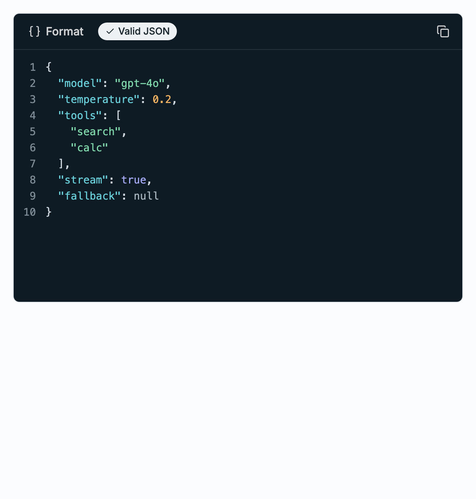 | 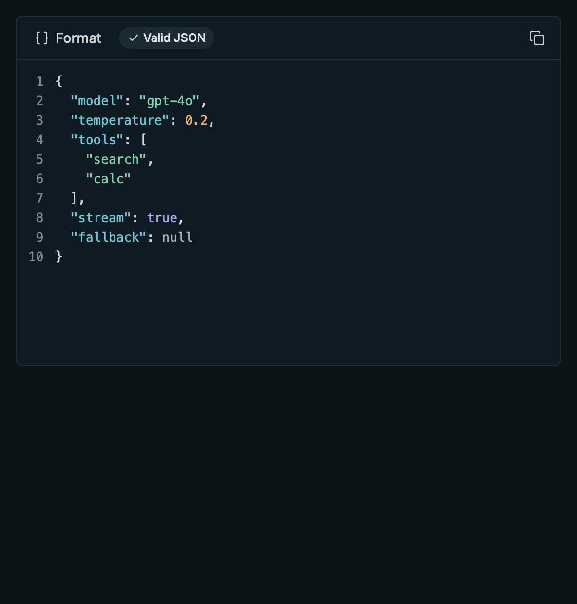 | 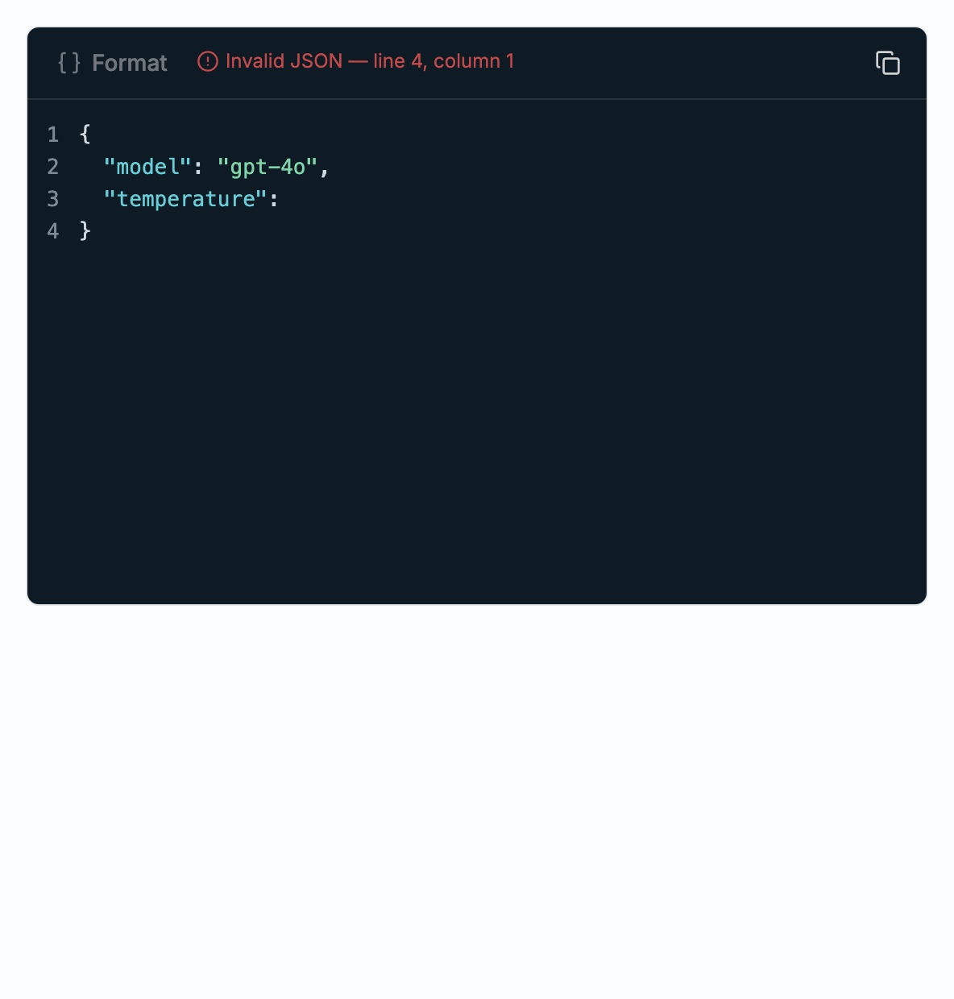 | 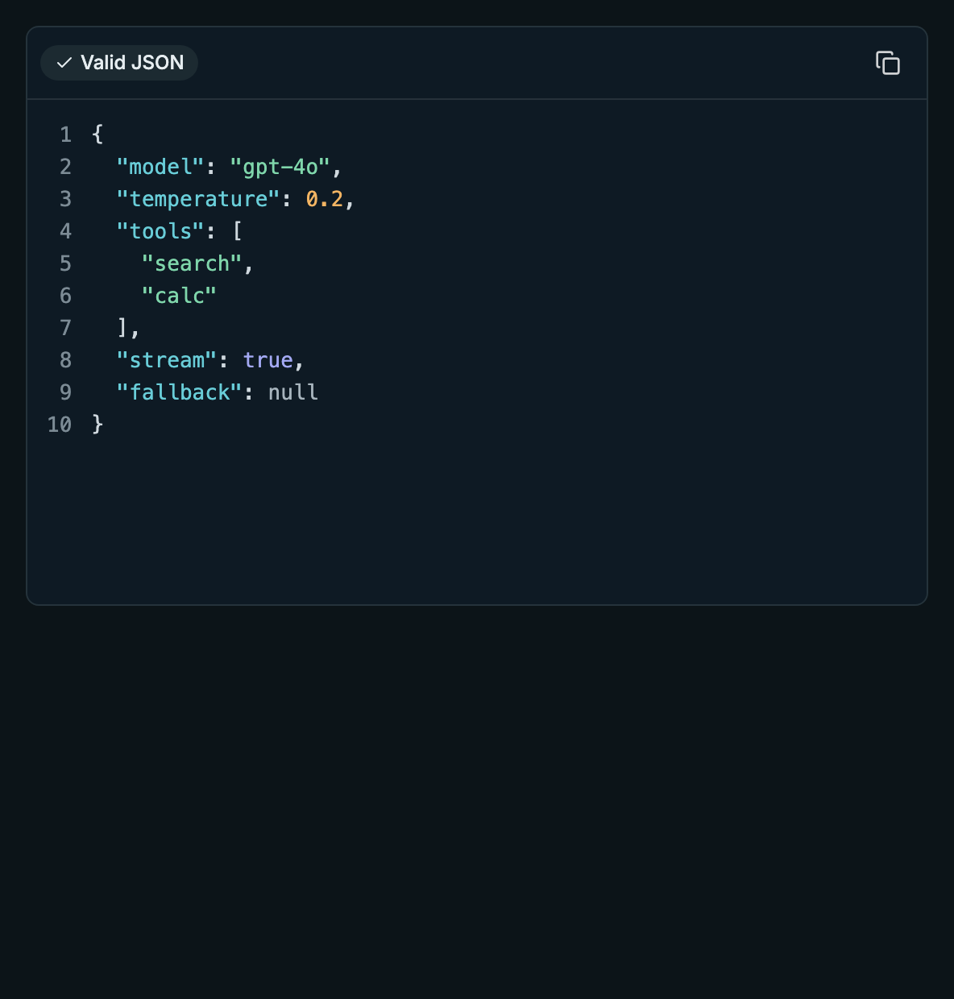 |

**Accent themes** — primary / accent surface / ring; AA-clearing foregrounds in both themes.

| Accent | Light | Dark |
|---|---|---|
| Teal (default) | 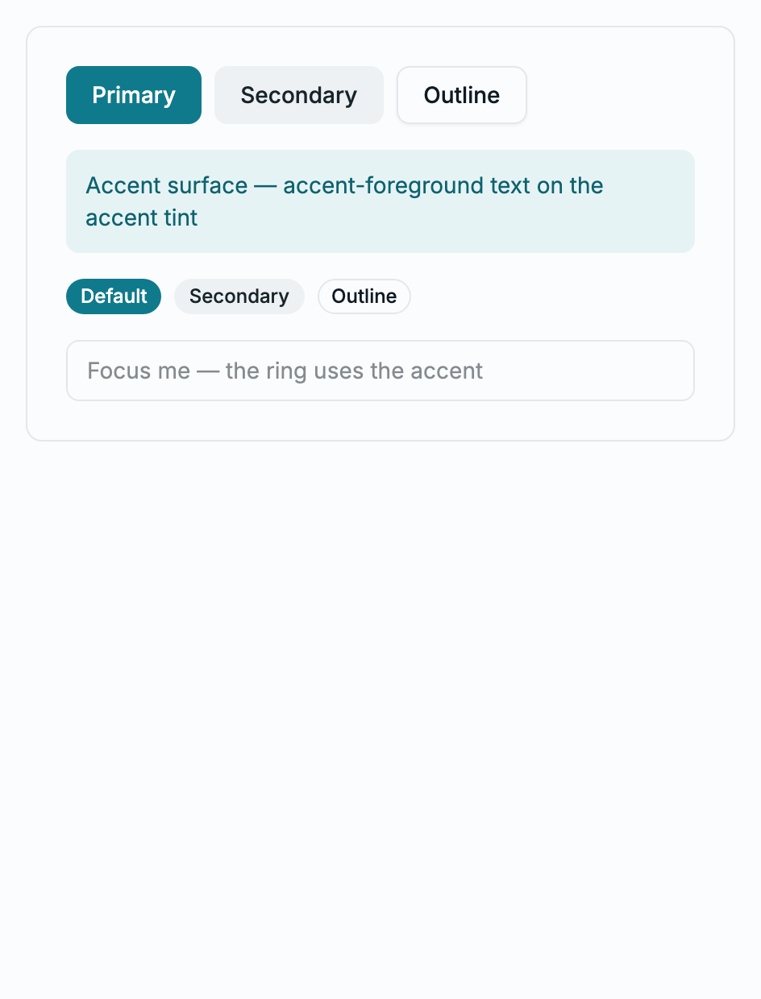 | 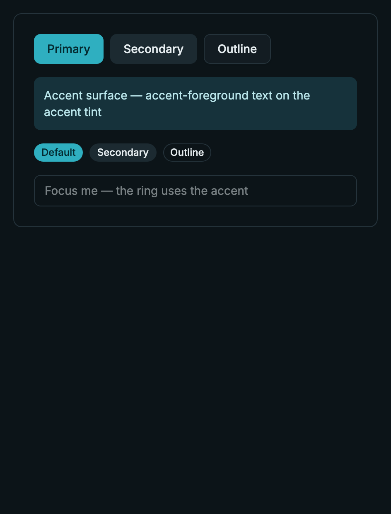 |
| Indigo | 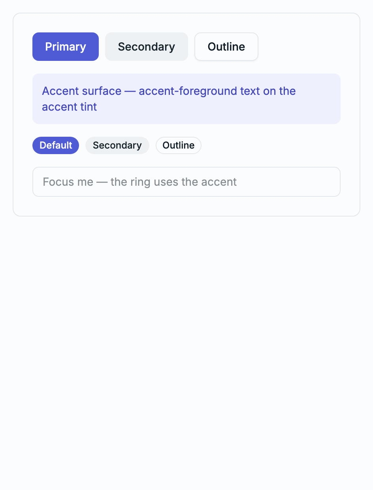 | 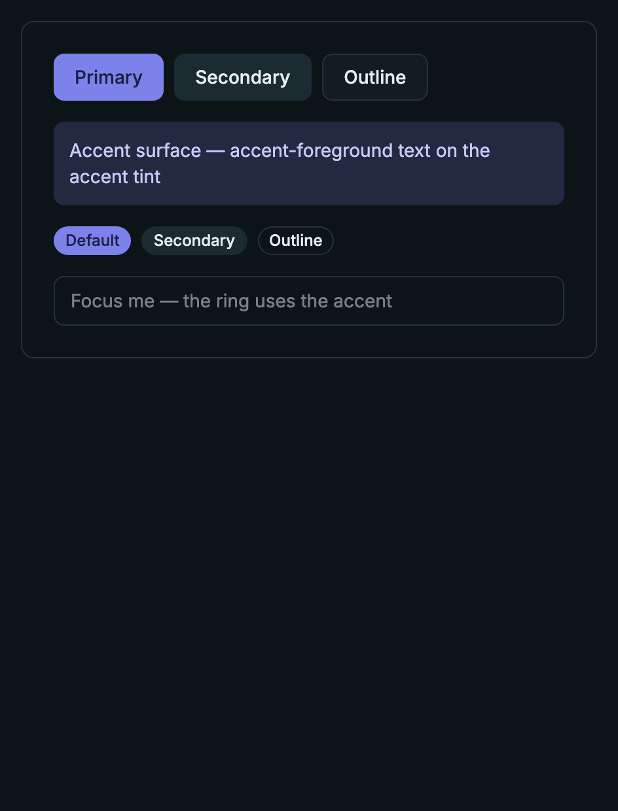 |
| Green | 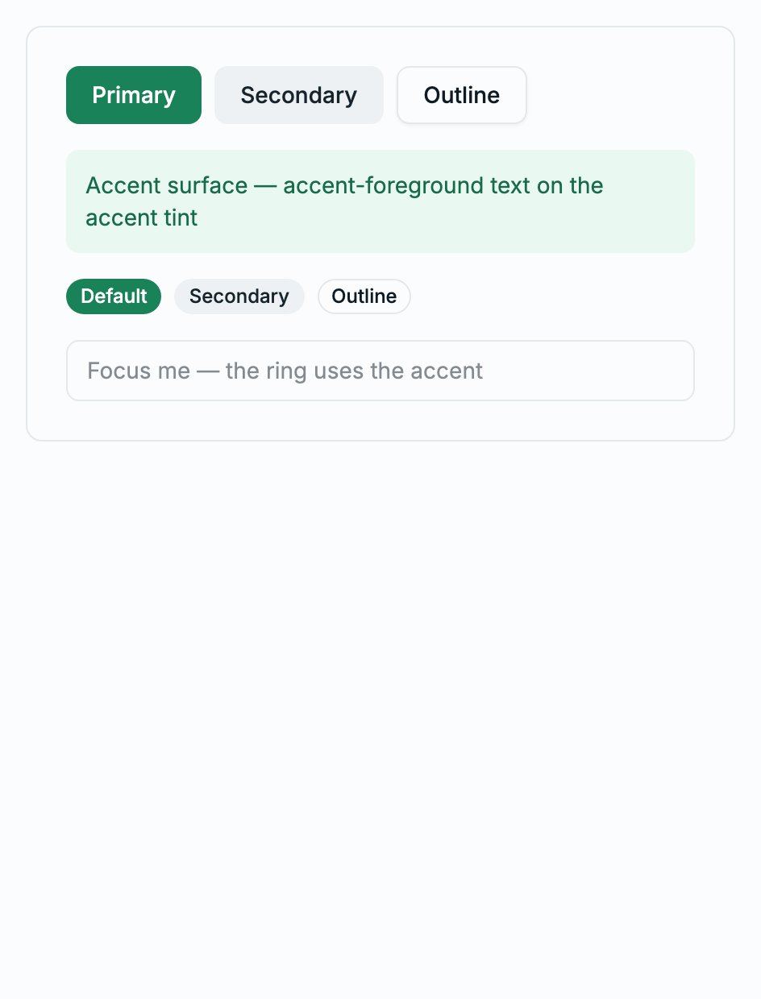 | 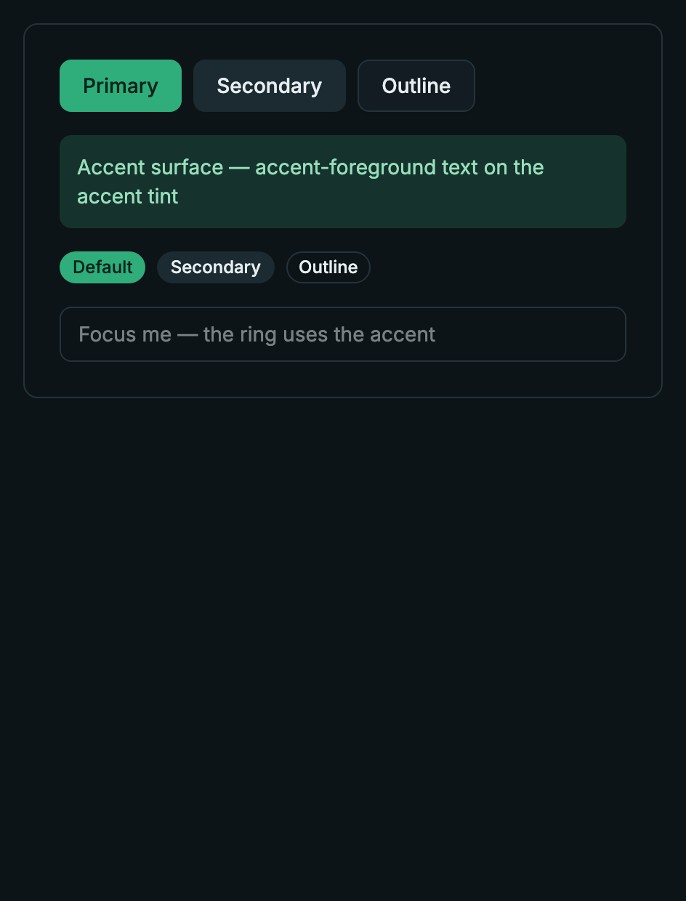 |
| Amber | 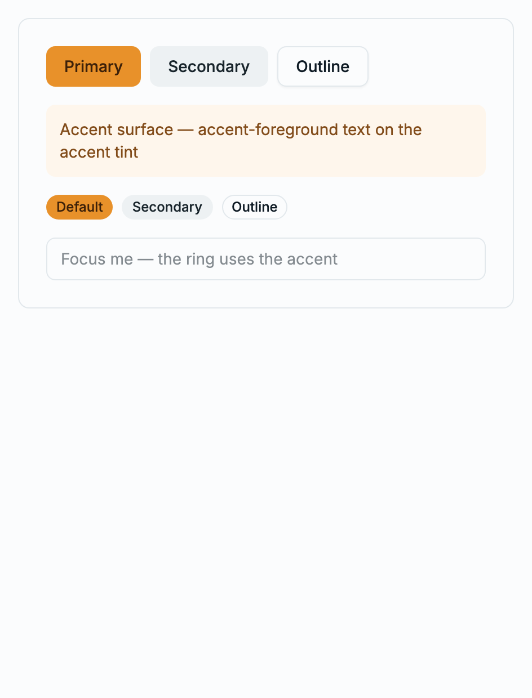 | 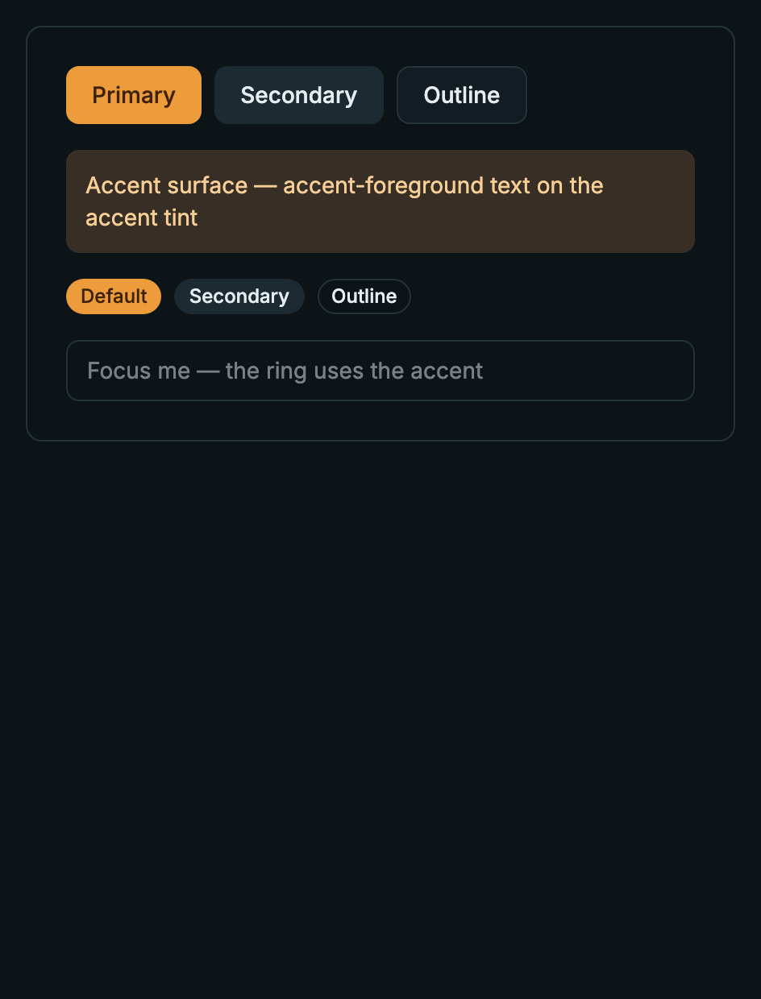 |

Capturing these surfaced a real robustness gap in the dark accent selectors: a **nested** `.dark` wrapper (Storybook's theme decorator adds one) re-declared the base teal tokens for its subtree, so accents showed teal in dark mode. Fixed by matching nested `.dark` regions too — `.dark[data-accent=…], [data-accent=…] .dark`. Production (next-themes: `.dark` + `data-accent` on the same `<html>`) was already correct; the fix hardens the mechanism for any nested-dark region. Re-verified live (indigo-dark primary now `#7c82ea`), UI build + accent-token test re-run green.

## Change History

| Date | Change |
|---|---|
| 2026-07-08 | Ticket created from redesign build spec (design project 6a582386, `Build Spec - Admin Redesign.dc.html` §1–§3/§9); current-state evaluation from code exploration. Status: Pending (awaiting plan approval). |
| 2026-07-08 | Implemented all six tasks TDD (DetailDrawer, CodeEditor + JSON helpers, TenantScopeBanner, accent token layer, `useViewportTier`/`SidebarTierSync`, docs). All package build/lint/test gates green (UI 642, admin 752; axe 0 violations). Highlighter built as a synchronous JSON tokenizer over `--code-editor-*` tokens rather than Shiki (lighter, fixed-dark-surface requirement). Status → Review (Storybook visual-evidence gate pending manual capture). |
| 2026-07-08 | Captured the Storybook visual-evidence set (12 PNGs, both themes × four accents + editor states) in `./screenshots/`. Capture surfaced a dark-accent bug under a nested `.dark` wrapper (accents showed teal in dark); fixed the dark accent selectors to also match nested `.dark` regions (`[data-accent=…] .dark`). UI build + accent-token test re-run green. Visual-evidence gate closed. |
| 2026-07-08 | All five verification-criteria gates met; ticket closed. Status → Completed. Foundation is ready for the dependent tickets (TASK-438…442). Eligible to move to `docs/archive/` once TASK-438 begins consuming `DetailDrawer`. |
