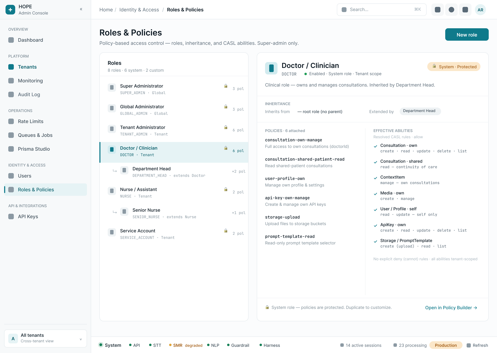
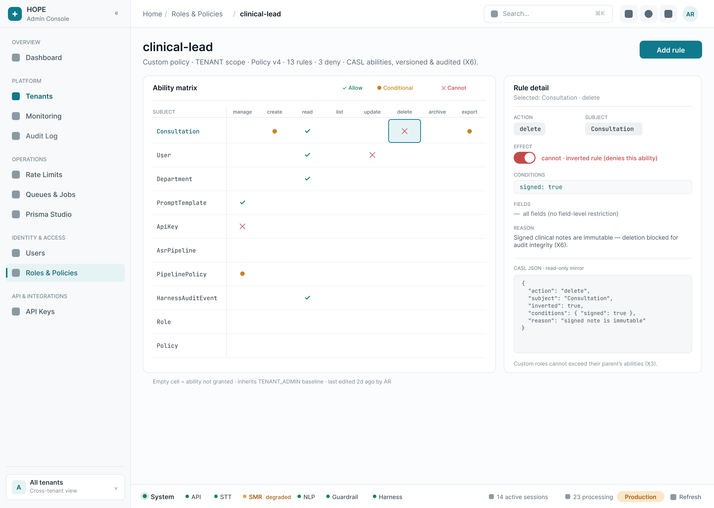
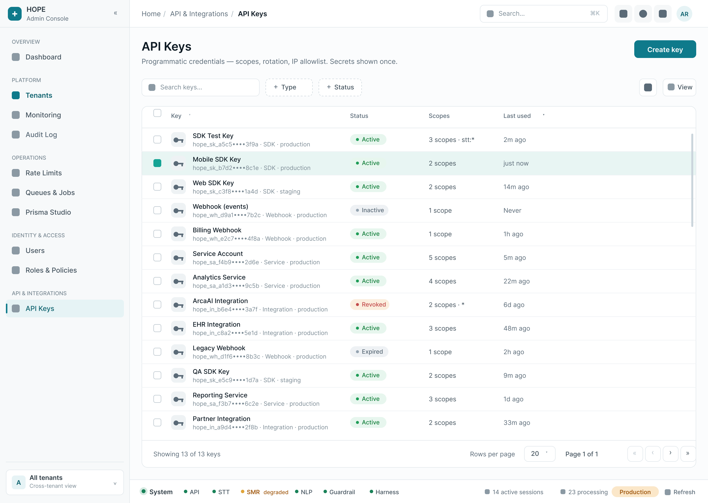
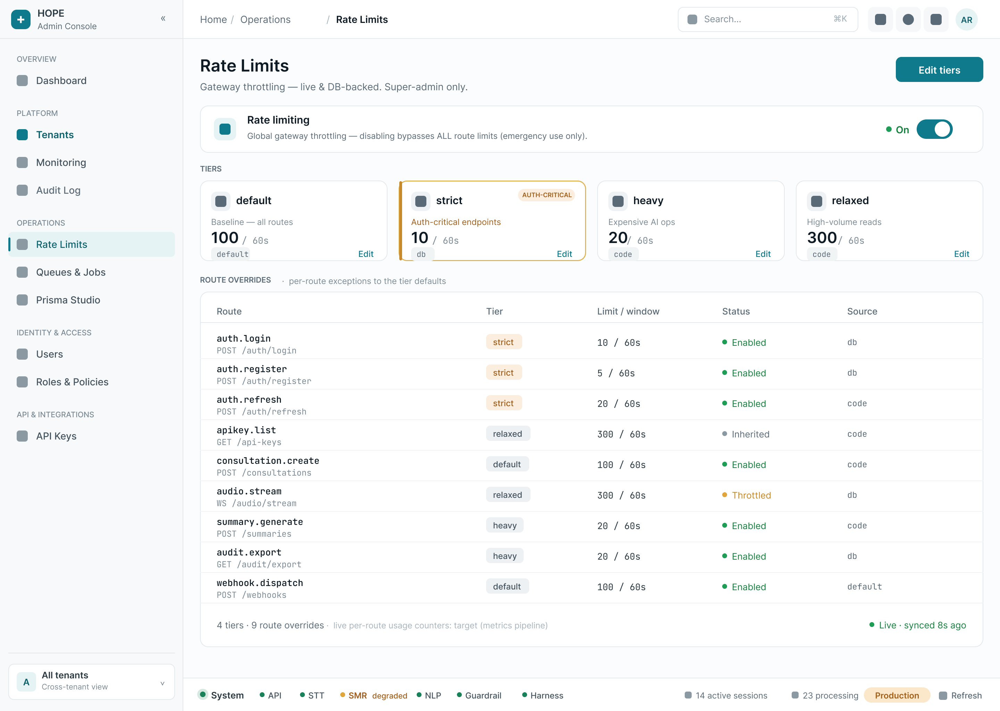
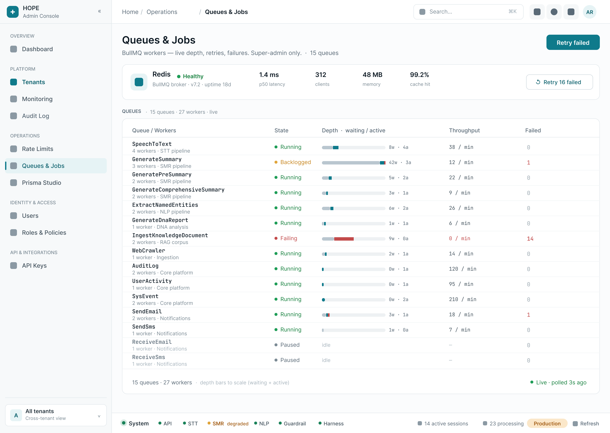
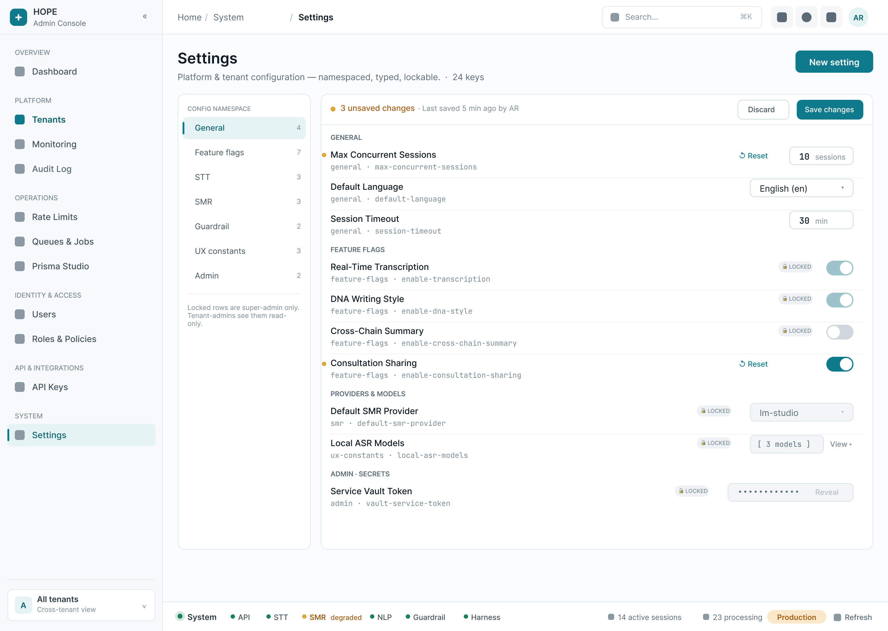

# TASK-371 — Unbuilt Admin-Console Surfaces · Design Spec

> _Relocated from `docs/implementation/TASK-371-Admin-Console-Redesign/UNBUILT-SURFACES-DESIGN.md` (TASK-385 docs alignment)._

| | |
|---|---|
| **Ticket** | TASK-371 (Phase-3 design gate) |
| **Type** | Design (Figma frames + written spec). **No application code; `apps/admin` / `packages/ui` / `packages/agentic-sdk-v2` untouched.** |
| **Created** | 2026-06-30 |
| **Status** | Review — **super-admin tier built + layout-pattern reworked 2026-06-30 (6 frames, all pass)**; tenant-admin tier spec-only |
| **Figma file** | `HOPE-Admin-Console` (**UNSAVED** → `fileKey` rotates; this session `unsaved`) — **needs a manual Save** |
| **Tokens** | [`theme.css`](../../implementation/TASK-371-Admin-Console-Redesign/theme.css) (Tailwind v4 `@theme` + shadcn, light/dark) |
| **Methodology** | [`.cursor/skills/uxu/SKILL.md`](../../../.cursor/skills/uxu/SKILL.md) — review→fix→verify; Realism Checklist |

> **Companion doc.** This is a sibling of [`README.md`](../../implementation/TASK-371-Admin-Console-Redesign/README.md) (passes 1–15) and the two phase plans; it does **not** edit them. It covers the surfaces the README §5.16 lists as *not yet drawn*, in the user's priority order: **Roles & Policies (+ CASL builder) · API Keys · Rate Limits · Queues & Jobs · System Health + Settings (redesign)**, then the tenant-admin tier **Stores · Audio Processing · Harness**.

---

## 0. Figma-bridge connectivity (reported up front)

**CONNECTED.** `list_files` → `[{ fileKey: "unsaved", fileName: "HOPE-Admin-Console" }]`. A single file is connected; the bridge targets it. The file is **UNSAVED**, so its `fileKey`/node IDs rotate on reconnect — the canonical super-admin shells were re-verified live this session (see §2). **The file still needs a manual Save in Figma** to make frames + node IDs durable.

Canvas occupancy verified live (`get_design_context` depth 1, this session):

| Row | `y` | Frames (node IDs this session) |
|---|---|---|
| Foundations `00–09` | `0` | `2:2 · 60:886 · 60:745 · 58:2 · 59:155 · 60:490 · 61:985 · 62:1082 · 82:2231 · 84:2382` |
| **Super-admin `10–13`** | `1624` | `10` Dashboard `69:1265` · `11` Monitoring `70:1692` · `12` Audit Log `70:1843` · `13` Tenant Mgmt `69:1416` — **free from `x≥6240`** |
| Tenant Detail pages | `2888` | `18p 95:6164 · 20p 97:6529 · 22p 109:6768 · 34p 110:7195 · 36p 110:7414 · 37p 110:6976` |
| Tenant Dashboard | `4152` | `18d 120:8843` + states |
| Tenant Users | `5416` | `20u 120:9015` + states + `38u 120:10575` |
| User sub-tabs | `6680` | `38u-a…g 121:11980–11986` |
| Agent management | `7680` | `30 120:9200 · 31 120:9454 · 32 120:9567 · 33 120:9681` |
| Dialogs | `8944` | Add Tenant `110:7669` … Create User `120:10354` |

→ New **platform-operator** frames continue the **super-admin row (`y=1624`) to the right of `13` (`x≥6240`)**; new **tenant-admin** frames go in a fresh **`y=10200`** row (well clear of the dialog row that ends at `y≈9968`).

---

## 1. How every frame is grounded (real domain, read this session)

All content below is grounded in the **real** Prisma schema (`packages/database/src/prisma/db_main/*.prisma`), the CASL policy/role seed, and the **real** NestJS admin modules. REAL = a column + an endpoint/seed backs it today; **TARGET** = drawn realistically but no backend yet (becomes a ticket).

| Surface | Real backing read |
|---|---|
| Roles & Policies + CASL builder | `rbac.prisma` (`Role`/`Policy`/`RolePolicy`), `enums.prisma` (`PermissionAction`, `PolicyScope`), seed `01-policy.ts` (20 policies, CASL rule shape), `03-role.ts` (8 roles + hierarchy) |
| API Keys | `apikey.prisma` (`ApiKey`, `ApiKeyType`, `ApiKeyStatus`), seed `02-apikey.ts` (9 real keys, scopes, rotation, masking) |
| Rate Limits | `apps/api/src/modules/admin-rate-limit/*` (`RateLimitPolicy`, tiers, route overrides), `throttle/tiered-throttler.guard.ts`, seed `12-rate-limit-settings.ts` |
| Queues & Jobs | `apps/api/src/modules/queue-admin/queue-admin.controller.ts`, `packages/domains/src/interfaces/queueAdminTypes.ts` (`QueueStats`/`JobDetail`/`RedisHealthInfo`), `enums/JobQueue.enum.ts` (15 queues) |
| System Health | `apps/api/src/modules/{monitoring,health}/*` (`useHealthCheck` services, `useMonitoring` sessions); TASK-377 metrics primitives |
| Settings | `globalSetting.prisma` (`GlobalSetting`: key/value/dataType/namespace/locked/encryptedValue), seed `11-global-setting.ts` (8 namespaces, locked flags, model catalogs) |
| Stores | `tenant-bucket.prisma` (`TenantBucket`/`StorageAccessKey`/`TenantStorageConfig`), `enums.prisma` storage enums |
| Audio Processing | `stt.prisma` (`AsrPipeline`/`AiModel`/`TranscriptionJob`), `pipeline-policy.prisma` (`PipelinePolicy` cascade), `enums.prisma` (`TranscriptionMode`/`CaptureMode`) |
| Harness | `harness.prisma` (`HarnessPolicy`/`HarnessAuditEvent`/`EvalRun`/`GoldenSet`), seed policies `harness-platform-manage`/`harness-tenant-manage` |

---

## 2. Shared DESIGN CONTRACT (inherited verbatim — every frame)

Carried from `PHASE-3-PLAN.md` §2 and the live shells (frames `10`–`13`). Every new frame matches these so the outputs read as one product:

- **App shell** — 264 px sidebar (HOPE logo · "Admin Console" · collapse) with the **super-admin tier nav**: `OVERVIEW` (Dashboard) · `PLATFORM` (Tenants · Monitoring · Audit Log) · `OPERATIONS` (Rate Limits · Queues & Jobs · Prisma Studio) · `IDENTITY & ACCESS` (Users · Roles & Policies) · `API & INTEGRATIONS` (API Keys); working-tenant footer **"All tenants · Cross-tenant view"**. Topbar: breadcrumb + global search (⌘K) + avatar (AR). *(Tenant-admin frames swap to the tenant-scoped nav + a working-tenant footer.)*
- **Breadcrumb** — `Home › <Section> › <Screen>`; the active sidebar item + breadcrumb terminal = the current screen.
- **Active tab/nav** — teal `#0e626e` text + teal bg `#e6f3f5` + left indicator; inactive `#5a6a77`.
- **Tokens only** — `theme.css` semantic tokens; no hardcoded colors/spacing. Status = **dot + label**, never color-only (Active/Published/healthy `--success` green · Warning/Draft/degraded/Paused/approaching `--warning` amber · Revoked/Expired/Failed/error `--destructive` red · Info/neutral `--muted-foreground` grey · AI/mode `--ai` indigo).
- **Numerals/IDs** — `tabular-nums` for counts/limits/latency/timestamps; `font-mono` for IDs, key prefixes, scope literals, CASL JSON, hashes, cron.
- **Targets/a11y** — ≥44 px touch targets, visible 2 px focus ring, WCAG 2.2 AA.
- **Fixed `ServiceStatusBar`** — bottom of every page: `● System ● API ● STT ● SMR degraded ● NLP ● Guardrail ● Harness … 14 active sessions · 23 processing · Production · Refresh`.
- **Permission banner** — muted bg + left teal accent at page bottom: super-admin Acting-on / read-write vs tenant-admin-scoped vs System-tenant-protected.
- **Required states per surface** — default · empty · loading (skeleton) · error · selected · permission (super-admin vs tenant-admin). Drawn where the use case implies them.
- **Responsive** — desktop horizontal tabs → tablet scrollable/segmented → mobile `Select`; toolbar actions collapse to `⋯`; tables degrade to the `07 · Responsive` card-list.

---

## 3. Numbering & placement decision

Layer numbers follow the **canonical taxonomy** (`12-design-workflow.mdc`): `10–19` super-admin · `20–29` shared · `30–49` tenant-admin. Per the request, the new **platform-operator** frames *continue the `10–19` row* to the right of `13`; the **tenant-admin** frames go in a new `30–49` row. (Numbers are provisional while the file is unsaved — confirm on the next persisted save.)

| # | Frame | Node ID (this session) | Placement | Status |
|---|---|---|---|---|
| 1 | `24 · Roles & Policies` | `166:12233` | super-admin row `x=6240` | **BUILT** ✓ pass |
| 1b | `24b · Policy / Ability Builder` | `167:12507` | super-admin row `x=7800` | **BUILT** ✓ pass |
| 2 | `25 · API Keys` | `167:12781` | super-admin row `x=9360` | **BUILT** ✓ pass |
| 3 | `14 · Rate Limits` | `167:13055` | super-admin row `x=10920` | **BUILT** ✓ pass |
| 4 | `15 · Queues & Jobs` | `168:13329` | super-admin row `x=12480` | **BUILT** ✓ pass |
| 5 | `16 · Settings` | `168:13603` | super-admin row `x=14040` | **BUILT** ✓ pass |
| — | System Health (redesign) | — | — | **spec-only** — live surface is `11 · Monitoring` (§5.5) |
| 6 | `40 · Store Detail` | — | tenant row `y≈10200` | **spec-only** (§5.7) |
| 7 | `41 · Audio Processing` | — | tenant row `y≈10200` | **spec-only** (§5.8) |
| 8 | `42 · Harness` | — | tenant row `y≈10200` | **spec-only** (§5.9) |

> **What was built vs. planned.** The whole **super-admin tier** is built (6 frames), prioritizing quality over coverage per the brief. **System Health** was *not* drawn as a new `16` frame — the live `11 · Monitoring` already covers it, so the redesign stays a spec (§5.5) and **Settings took the `16` slot**. **Roles & API Keys** carry `20–29` numbers (shared tier per taxonomy) but sit in the super-admin row for visual continuity, since super-admins operate platform RBAC + the `system-full-access` policy and the super-admin shell lists both nav items. The **tenant-admin tier** (`40`/`41`/`42`) remains spec-only. Frame numbers are provisional while the file is unsaved.

---

## 4. Consolidated REAL vs TARGET (backend backlog)

TARGET items are drawn realistically and become implementation tickets.

| Surface | TARGET (no backend yet) | REAL today |
|---|---|---|
| Roles & Policies | per-role **assigned-user count** roll-up; live **"effective ability" preview** simulation | `Role` CRUD + hierarchy (`parentRoleId`), `isSystemRole` protection, `Policy.rules` CASL JSON, `RolePolicy.priority`, `PermissionAction`/`PolicyScope`, `UserRoleAssignment` |
| API Keys | per-key **usage-over-time series** (only scalar `usageCount` exists) | full `ApiKey` lifecycle: `keyPrefix`/`keyChecksum`, `keyType`, `keyStatus`, `scopes`, `allowedIps`, per-key `rateLimit`, `expiresAt`/`lastUsedAt`, **rotation** fields, secret-shown-once |
| Rate Limits | **live usage / throttled-now counters** (config is DB-backed; runtime hit-counts not exposed) | `RateLimitPolicy`: global kill-switch + 4 tiers (`default/strict/heavy/relaxed`, limit+ttl) + per-route overrides; `limitSource`/`ttlSource` (`db`/`code`/`default`); persisted as `rate-limit.*` `GlobalSetting` |
| Queues & Jobs | — (fully real) | `QueueStats` (waiting/active/completed/failed/delayed/paused/prioritized · workers · paused), `JobDetail` (attempts/stacktrace/opts), pause/resume/clean + retry/promote/remove + bulk; `RedisHealthInfo`; 15 named queues |
| System Health | **P95 / requests-per-min / per-model running counts** (no metrics endpoint); "open sockets" | `useHealthCheck` per-service `{status,version,uptime_seconds}`; `useMonitoring` `{activeSessions,processingJobs,total}` |
| Settings | bulk **import/export** of settings | `GlobalSetting` CRUD by namespace, `locked` write-guard, `dataType`, Vault `encryptedValue` (secrets), default/reset |
| Stores | **storage quota / usage %** (no quota column, consistent with §5.11/§5.13) | `TenantBucket` (type/purpose/pathPattern), `StorageAccessKey` (secret-shown-once, permissions, IP/last-used), `TenantStorageConfig` (provider/topology/endpoint) |
| Audio Processing | per-model **running/latency metrics** | `AsrPipeline` (+ versions/diff/rollback), `AiModel` registry, `TranscriptionJob` (status/progress/retry), `PipelinePolicy` cascade toggles, `TranscriptionMode`/`CaptureMode` |
| Harness | aggregate **eval dashboards** roll-up | `HarnessPolicy` (sensor thresholds, safety/PHI, gate SLA, regen budget), `HarnessAuditEvent` (WORM hash-chain), `EvalRun`/`GoldenSet`/`EvalScore`, Temporal `HarnessWorkflow` gate queue |

---

## 5. Surface specs

> Each section: **Purpose + tier · Data model (REAL/TARGET) · Layout + reuse · States · Permissions · Responsive · Figma build (filled after build with node ID + screenshot + uxu verdict).**

### 5.1 Roles & Policies (+ CASL Policy/Ability Builder) — shared `20–29` · active nav *Roles & Policies*

**Purpose.** Operate the policy-based RBAC: list roles (system + custom), show the **inheritance hierarchy**, the **policies** attached (with priority), and **edit a policy's CASL rules** in a visual ability builder. Enforces X3 (no escalation: custom ≤ parent), X4 (system roles protected — disabled + explained), X6 (audited).

**Data model.**
- **Roles** (`Role`, REAL): `name` (e.g. `SUPER_ADMIN`), `externalName` (display "Super Administrator"), `description`, `isSystemRole` (protected), `parentRoleId` (hierarchy — `DEPARTMENT_HEAD`→`DOCTOR`, `SENIOR_NURSE`→`NURSE`), `resourceStatus`, `version` (OCC). Real roster: **SUPER_ADMIN, GLOBAL_ADMIN, TENANT_ADMIN, DOCTOR, NURSE, SERVICE_ACCOUNT** (system) + **DEPARTMENT_HEAD, SENIOR_NURSE** (custom, inherit).
- **Policies** (`Policy`, REAL): `name` (`tenant-full-access`…), `description`, `scope` (`GLOBAL`/`TENANT`), `rules` (CASL JSON). 20 seeded policies.
- **RolePolicy** (REAL): `priority` (lower = higher), links role↔policy.
- **CASL rule** (REAL shape): `action` ∈ `{manage, create, read, list, update, delete, archive, export}` (`PermissionAction`); `subject` ∈ `{all, User, Consultation, Media, ApiKey, GlobalSetting, Department, AsrPipeline, AiModel, HarnessPolicy, PipelinePolicy, PromptTemplate, Role, Policy, …}`; `conditions` (`{ tenantId: "${context.tenantId}", doctorId: "${user.id}" }`); `fields[]`; `inverted` ("cannot"); `reason`. Template vars `${user.id}` / `${user.tenantId}` / `${context.tenantId}` / `${params.*}` shown in `font-mono`.
- **TARGET**: per-role assigned-user count; live effective-ability preview.

**Layout + reuse.** Reskin **Audit Log (`12`)** shell+table.
- `24 · Roles & Policies` — page header "Roles & Policies" + sub "Policy-based RBAC and CASL abilities. Super-admin." + `+ New role`. Toolbar: search · `+ Scope` (Global/Tenant) · `+ Type` (System/Custom) · View. **Roles table**: `ROLE` (shield icon + `externalName` + mono `name`) · `SCOPE` (Global/Tenant badge) · `INHERITS` (parent `externalName` or "—") · `POLICIES` (count, e.g. "3 policies") · `STATUS` (dot+label Enabled/Disabled) · `UPDATED`. ~8 rows = the real roster. **System roles show a 🔒 "Protected" affordance** (delete disabled + tooltip "System role — cannot be deleted"). Selected row highlighted.
- `24b · Policy / Ability Builder` — a focused editor for a policy (e.g. editing `tenant-full-access`): policy name + scope + description; a **rule list** where each rule renders as `[action] [subject] where {conditions}` with token-colored chips (allow = teal/`--success`, `inverted`/cannot = `--destructive`); an **add-rule row** (Action select · Subject select · Conditions key/value · Fields · `cannot` toggle · `reason`); a **raw CASL JSON** panel (`font-mono`, read-mirror); priority reorder; `Save policy` (writes new `version`). Escalation guard note: "Custom roles cannot exceed their parent's abilities (X3)."

**States.** default (roster) · selected (row → opens builder) · **empty** ("No custom roles yet — create one that inherits a system role") · loading (skeleton rows) · error (retry) · **protected** (system role, delete disabled + explained) · builder validation (invalid condition → inline error).

**Permissions.** Super-admin: full RBAC across tenants (`system-full-access` → `manage all`; `rbac-system-manage`). Tenant-admin: `rbac-tenant-manage` (custom roles only, `isSystemRole:false`; read system roles for reference) + Acting-on banner. System roles always read-only/protected.

**Responsive.** Roster table → card-list (`07`); builder rule-rows stack; raw-JSON panel becomes an accordion.

**Figma build.** ✅ **BUILT — layout-pattern reworked (2026-06-30, see §8).** _Roles_ → node **`166:12233`**, **now a master-detail browser**:  `screenshots/admin-24-roles-v2.png` (before: `admin-24-roles.png`). _CASL builder_ → node **`167:12507`**, **now a permission matrix + rule editor**:  `screenshots/admin-24b-policy-builder-v2.png` (before: `admin-24b-policy-builder.png`). **uxu verdict: PASS.** `24` — left **indented inheritance tree** (8 real roles; Department Head ↳ Doctor, Senior Nurse ↳ Nurse) with monochrome **shield tiles** (no avatars) + 🔒 on system roles; right **detail** for the selected Doctor role: System·Protected pill, inheritance (root / Extended by Department Head), 6 attached policies, and a real **effective-abilities preview** (Consultation own/shared, ContextItem, Media, User/Profile self, ApiKey, Storage/PromptTemplate with `create · read · update · delete` scope notes) — replacing the dead-end "N policies" count. `24b` — **SUBJECTS × ACTIONS matrix** (allow = teal ✓, deny/cannot = red ✕, conditional = amber dot), a **rule editor** panel (Action · Subject · Conditions key/value · Fields · cannot toggle · reason) + a raw **CASL JSON** mirror (mono); keeps the `Policy v4 · 13 rules · 3 deny` header.

---

### 5.2 API Keys — shared `20–29` · active nav *API Keys*

**Purpose.** Programmatic-credential lifecycle: list keys (masked), create (secret shown once — X8), rotate, revoke; show scopes, IP allowlist, per-key rate limit, usage, expiry.

**Data model (`ApiKey`, REAL).** `keyName` ("SDK Test API Key", "Webhook Integration Key", "Service Account Key", "ArcaAI Integration Key"…); `keyPrefix` (12 chars, e.g. `hope_sk_a5c5`) + `keyChecksum` (last 6) → **masked display `hope_sk_a5c5••••••••3f9a`**; `keyType` (`SDK`/`WEBHOOK`/`INTEGRATION`/`SERVICE_ACCOUNT`); `keyStatus` (`ACTIVE`/`INACTIVE`/`REVOKED`/`EXPIRED`); `scopes` (JSON, real values `stt:transcription:read`, `stt:stream:write`, `consultation:session:write`, `consultation:report:read`, `user:preferences:read`, `webhook:event:write`, `admin:apikey:read`, `stt:*`, `*`); `allowedIps` (JSON CIDR list); `rateLimit` (req/min: 1000 SDK · 500 webhook · 5000 service · 2000 integration · 100 revoked); `expiresAt`/`lastUsedAt`/`usageCount`; rotation (`rotatedFromKeyId`/`rotatedToKeyId`/`rotationExpiresAt`); `environment` (`development`/`staging`/`production`); `userId` (creator). Hash never shown (`keyHash` = HMAC-SHA256, peppered).
- **TARGET**: usage-over-time chart (only scalar `usageCount`).

**Layout + reuse.** Reskin **Audit Log (`12`)** shell+table.
- `25 · API Keys` — header "API Keys" + sub "Programmatic credentials — scopes, rotation, IP allowlist. Secrets shown once." + `+ Create key`. Toolbar: search · `+ Type` · `+ Status` · `+ Environment` · View. **Keys table**: `KEY` (key icon + `keyName` + mono masked prefix+checksum) · `TYPE` (SDK/Webhook/Integration/Service) · `SCOPES` (count + first chip, e.g. "8 scopes · stt:*") · `RATE LIMIT` (e.g. "1,000/min") · `LAST USED` (relative; "Never") · `STATUS` (dot+label Active green · Revoked red · Expired red · Inactive grey). ~9 rows = the real seed (incl. one **Revoked**, one **Expired**). Row kebab: View · Rotate · Revoke.
- **Create / Reveal dialog** (`25b`, secret-shown-once) — form (name · type · scopes multi-select · IP allowlist · rate limit · expiry · environment) → **success state**: the full key shown **once** in a mono reveal field with `Copy` + an amber "You won't be able to see this again" banner.
- **Rotate dialog** — explains the grace window (`rotationExpiresAt`): old key valid until T, new secret shown once.
- **Revoke** — destructive `AlertDialog` (X7): "Revoke «key»? Requests using it will immediately fail 401."

**States.** default · selected · **create→reveal** (secret once) · **rotate** (grace window) · **revoke confirm** (destructive) · empty ("No API keys yet") · loading · error · expired/revoked row treatments.

**Permissions.** Super-admin: all keys cross-tenant. Tenant-admin: `manage ApiKey where tenantId` (own tenant). End-user (doctor): `api-key-own-manage` (own keys) — out of admin scope but noted.

**Responsive.** Table → card-list; create dialog is full-height scroll body.

**Figma build.** ✅ **BUILT** (keys table) — **de-avatared (2026-06-30, see §8).** _Keys table_ → node **`167:12781`** ·  `screenshots/admin-25-api-keys-v2.png` (before: `admin-25-api-keys.png`). _Create/reveal dialog_ → **spec-only** (the secret-shown-once reveal `25b` is specified above but not yet drawn). **uxu verdict: PASS** — **table pattern kept (correct for this surface)**; the decorative 2-letter colored type avatars (SK/WH/SA/IN) were replaced with a **uniform monochrome key tile** — key type stays legible via the mono subtitle (`· SDK ·`/`· Webhook ·`/`· Service ·`/`· Integration ·`) + the `hope_sk_`/`hope_wh_`/`hope_sa_`/`hope_in_` prefix. 13 real keys with masked `keyPrefix••••keyChecksum` (mono), scope counts + first chip (`3 scopes · stt:*`, `2 scopes · *`), relative `lastUsedAt` incl. "Never"/"just now"; **all four lifecycle states present** — Active (green) · Inactive (grey) · Revoked (red) · Expired (red).

---

### 5.3 Rate Limits — super-admin `10–19` · active nav *Rate Limits*

**Purpose.** Live, DB-backed throttle config (TASK-316, SUPER_ADMIN only): global kill-switch, 4 tier baselines, per-route overrides — effective immediately (no redeploy).

**Data model (`RateLimitPolicy`, REAL).** `enabled` (global kill-switch) + `enabledSource` (`db`/`default`); `tiers[]`: `{ tier ∈ default|strict|heavy|relaxed, limit, ttl (ms), limitSource, ttlSource }` — real seed **default 100/60 000ms · strict 10/60 000 · heavy 20/60 000 · relaxed 300/60 000**; `routes[]`: `{ routeId (e.g. auth.login), controller, handler, description, tier, limit, ttl, enabled, limitSource, ttlSource }`. Sources rendered as a small `db`/`code`/`default` provenance badge. Per-key `ApiKey.rateLimit` cross-linked (req/min).
- **TARGET**: live "requests in window vs limit" / throttled-now counters (config is real; runtime hit-counts not exposed).

**Layout + reuse.** Reskin **Tenant Mgmt (`13`)** shell+table; add a tier-card row.
- `14 · Rate Limits` — header "Rate Limits" + sub "Gateway throttling — live, DB-backed. Super-admin only." + a **global kill-switch** `Switch` ("Rate limiting · On") with a state caption. **Tier cards** (4): each shows tier name + `limit / window` (e.g. "100 req / 60s") + `db`/`default` source badge + an `Edit` affordance; `strict` highlighted as the auth-critical baseline. **Route overrides table**: `ROUTE` (mono `routeId` like `auth.login` + `controller.handler`) · `DESCRIPTION` · `TIER` (badge) · `LIMIT` · `WINDOW` · `ENABLED` (dot+label) · `SOURCE` (`db`/`code`/`default`). Rows = real throttled routes (`auth.login`, `auth.refresh`, `auth.register`, `apikey.create`, `consultation.create`, `audio.stream`…). A **TARGET note** marks the (future) live-usage column.

**States.** default · **kill-switch off** (whole surface dimmed + "Throttling disabled platform-wide" warning banner) · tier edit (popover/dialog: limit + ttl) · route override edit · empty (no overrides → "All routes use their tier baseline") · loading · error.

**Permissions.** **SUPER_ADMIN only** (`@Authorize(['manage','all'])` → `system-full-access`). Tenant-admins explicitly cannot retune gateway limits — a note states this; their `manage GlobalSetting` is tenant-scoped and excluded.

**Responsive.** Tier cards 4→2→1; route table → card-list.

**Figma build.** ✅ **BUILT — layout-pattern reworked (2026-06-30, see §8).** → node **`167:13055`** ·  `screenshots/admin-14-rate-limits-v2.png` (before: `admin-14-rate-limits.png`). **uxu verdict: PASS.** Now leads with a **prominent global kill-switch** (a real `Switch` "Rate limiting · On" + state caption, not a subtitle), then **4 tier cards** (default 100/60s · strict 10/60s · heavy 20/60s · relaxed 300/60s — each with limit/window, a `db`/`code`/`default` source pill, and Edit; **strict highlighted as auth-critical**), with the **route-overrides table** retained below (mono `routeId` + METHOD /path, tier pill, limit/window, status dot+label Enabled/Inherited/Throttled, source `db`/`code`). Footer "4 tiers · 9 route overrides · Live"; live per-route usage counters flagged TARGET.

---

### 5.4 Queues & Jobs — super-admin `10–19` · active nav *Queues & Jobs*

**Purpose.** Operate BullMQ queues + jobs (TASK-250/336, SUPER_ADMIN only, platform-wide): per-queue counts, pause/resume/clean, per-job retry/promote/remove + bulk, Redis health.

**Data model (REAL).** `QueueStats`: `{ name, isPaused, counts { waiting, active, completed, failed, delayed, paused, prioritized }, workerCount }`. 15 real queues (`JobQueue` enum): **GenerateSummary, GeneratePreSummary, GenerateComprehensiveSummary, ExtractNamedEntities, SpeechToText, GenerateDnaReport, IngestKnowledgeDocument, AuditLog, UserActivity, SendEmail, SendSms, SysEvent, WebCrawler, ReceiveEmail, ReceiveSms**. `JobDetail`/`JobSummary`: `{ id, name, queueName, status, progress, attempts, maxAttempts, delay, processedOn, finishedOn, failedReason, stacktrace[], logs[], opts { attempts, backoff, priority, removeOnComplete } }`. `RedisHealthInfo`: `{ status healthy/degraded/unhealthy, latencyMs, connectedClients, usedMemory, uptime, version, queuesRegistered }`. Actions: pause/resume/clean queue; retry/promote/remove job; bulk retry/remove. *(Temporal — the harness `HarnessWorkflow` clinician-gate queue — is the separate durable engine, surfaced on §5.9, not here.)*

**Layout + reuse.** Reskin **Tenant Mgmt (`13`)** shell+table.
- `15 · Queues & Jobs` — header "Queues & Jobs" + sub "BullMQ queues and workers — platform infrastructure. Super-admin only." + `Refresh`. A **Redis health** strip card (● healthy · 1.4 ms · 312 clients · 48 MB · v7.2 · 15 queues). **Queues table**: `QUEUE` (mono name) · `WAITING` · `ACTIVE` · `COMPLETED` · `FAILED` (red when >0) · `DELAYED` · `WORKERS` · `STATE` (dot+label Running green / Paused amber) + row actions (Pause/Resume · Clean). Counts use `tabular-nums`; a queue with `failed>0` flagged amber. A selected queue reveals a **jobs sub-panel / drawer**: job rows (mono `id` · name · `status` active/completed/failed/delayed · `attempts x/maxAttempts` · failedReason) with **Retry · Promote · Remove**, and a **bulk action bar** when jobs selected.

**States.** default (queues) · selected (queue → jobs) · **paused queue** (amber state + Resume) · **failed jobs** (red counts + Retry/bulk-retry) · job-detail (stacktrace `pre`, opts) · empty (clean queue: "No jobs") · loading · error (Redis unreachable → degraded health card).

**Permissions.** **SUPER_ADMIN only** (`@Authorize(['manage','all'])`); platform-wide, not tenant-scoped — tenant admins cannot pause/clean or read cross-tenant job payloads (payloads PII-redacted).

**Responsive.** Queues table → card-list; jobs drawer → full-screen sheet on mobile.

**Figma build.** ✅ **BUILT — augmented (2026-06-30, see §8).** → node **`168:13329`** ·  `screenshots/admin-15-queues-jobs-v2.png` (before: `admin-15-queues-jobs.png`). **uxu verdict: PASS** — a **Redis-health card** (● healthy · 1.4 ms · 312 clients · 48 MB · v7.2 · 15 queues) over a dense 15-row table; each of the **15 real `JobQueue` names** (SpeechToText, GenerateSummary, GeneratePreSummary, GenerateComprehensiveSummary, ExtractNamedEntities, GenerateDnaReport, IngestKnowledgeDocument, AuditLog, UserActivity, SysEvent, SendEmail, SendSms, ReceiveEmail, ReceiveSms, WebCrawler) gets an inline **depth/throughput visualization** — a stacked bar splitting waiting / active / failed with `tabular-nums` counts + a throughput note. Failed>0 turns red (IngestKnowledgeDocument, GenerateSummary, SendEmail); state dot+label Running (green) · **Backlogged** (amber) · **Failing** (red) · **Paused** (grey); `Retry failed` retained. Footer "15 queues · live".

---

### 5.5 System Health (redesign) — super-admin `10–19` · active nav *Monitoring / System Health*

**Purpose.** Bring the existing System-Health surface up to the new design system, reusing the TASK-377 metrics primitives (`StatusDot`/`StatCard`/`ServiceStatusBar`/`MetricTable`). Live per-service health + capacity.

**Data model.** `useHealthCheck().services` (REAL): per service (`api`, `stt`, `smr`, `nlp`, `guardrail`, `harness`) `{ status, version, uptime_seconds }`. `useMonitoring().sessions` (REAL): `{ activeSessions, processingJobs, total }`. **SMR shown Degraded** (amber), consistent with the `ServiceStatusBar`. **TARGET**: P95 latency, requests/min, per-model running counts, open sockets.

**Layout + reuse.** Reskin **Monitoring (`11`)** / Dashboard (`10`) shell.
- `System Health` (proposed; not yet a standalone frame) — header "System Health" + sub "Live service status and uptime." `StatCard` row (Services healthy 6/7 · Active sessions 14 · Processing jobs 23 · Uptime 99.98% [TARGET]). **Services `MetricTable`**: `SERVICE` (name) · `STATUS` (`StatusDot` healthy/degraded) · `VERSION` (mono) · `UPTIME` (`uptime_seconds`→"6d 4h") · `P95` [TARGET] · `REQ/MIN` [TARGET]. SMR row amber "Degraded". A **dependency/health-check sub-table** (DB · Redis · Vault · MinIO · Temporal) with `/health` `/live` `/ready` style probes.

**States.** default · **degraded** (SMR amber, incident note) · loading (skeleton cards/rows) · error (service unreachable → red) · empty (n/a).

**Permissions.** Super-admin platform-wide; tenant-admins see a tenant-scoped subset (their pipelines' health).

**Responsive.** Cards 4→2→1; service table → card-list.

**Figma build.** ⏸ **SPEC-ONLY (de-scoped from a new frame).** The live System-Health surface already exists as **`11 · Monitoring`** (`70:1692`, screenshot `admin-11-monitoring.png`), so a duplicate `16 · System Health` frame was intentionally **not** drawn — `16` was reassigned to Settings. This spec stands as the redesign brief (TASK-377 metrics primitives, P95/req-min TARGET columns) for when Monitoring is refreshed. No new node ID.

---

### 5.6 Settings (redesign) — super-admin/platform + shared · active nav *Settings*

**Purpose.** Global settings + feature flags KV editor, grouped by namespace, with locked-row protection and secret masking.

**Data model (`GlobalSetting`, REAL).** `namespace` (real: `general`, `feature-flags`, `stt`, `smr`, `guardrail`, `ux-constants`, `admin`, `rate-limit`), `name`, `key` (mono), `value`/`defaultValue`, `dataType` (`ValueType`: String/Integer/Float/Boolean/Json…), `locked` (write-guarded — only super-admin / locked write-guard), `encryptedValue` (Vault secret → masked `••••`), `tags`, `version`. Real rows: `general/max-concurrent-sessions=10`, `general/default-language=en`, `feature-flags/enable-transcription=true (locked)`, `feature-flags/enable-cross-chain-summary=false (locked)`, `stt/default-stt-model=whisper-large-v3 (locked)`, `smr/default-smr-model=gemma-4-e2b-it-sft-rlvr-medical (locked)`, `guardrail/default-guardrail-model=granite-guardian-4.1-8b (locked)`. **System-tenant rows** (`enable-local-raw-capture`) super-admin-only. **TARGET**: bulk import/export.

**Layout + reuse.** Reskin **Tenant Configuration page (`22p`)** pattern (toggles/selects) + a KV table. *(As built, `16 · Settings` favors the **KV-table** half of this spec — see Figma build note.)*
- `16 · Settings` — header "Settings" + namespace **section nav** (General · Feature flags · STT · SMR · Guardrail · UX constants · Admin). **Feature-flags** as `Switch` rows (each with key mono + dataType + a 🔒 lock icon on locked rows + default). **Model/provider selects** (SMR/Guardrail provider+model from the real catalog dropdowns). **Secret rows** masked with a reveal-gated affordance. Per-row "Reset to default" + an `Acting on: «Tenant»` banner when tenant-scoped; locked rows show "Locked — super-admin only". `Save` / `Discard` with last-saved caption.

**States.** default · **locked row** (disabled + lock + explain) · secret (masked + reveal-gated) · dirty (Save/Discard) · empty (n/a) · loading · error.

**Permissions.** Super-admin: platform + any tenant; can flip `locked` rows. Tenant-admin: own tenant's non-locked rows (`global-settings-manage` scoped); locked rows read-only.

**Responsive.** Section nav → `Select`; toggle rows stack.

**Figma build.** ✅ **BUILT — layout-pattern reworked (2026-06-30, see §8).** → node **`168:13603`** ·  `screenshots/admin-16-settings-v2.png` (before: `admin-16-settings.png`). **uxu verdict: PASS.** Now a **sectioned settings form** (not a KV table): a left **namespace section-nav rail** (General · Feature flags · STT · SMR · Guardrail · UX constants · Admin) + a form card where each setting uses a **type-appropriate control** — Boolean → `Switch`, provider/enum → `Select`, Integer/Float → number input w/ unit, JSON → an expandable `[N models]` code affordance, secrets → masked + reveal. **Locked rows** show a disabled control + 🔒 "Locked — super-admin only" + per-row "Reset to default"; a **dirty-state** toolbar (• 3 unsaved changes · Save / Discard + last-saved caption) sits on top. Real seed values across the 8 namespaces. The sidebar `SYSTEM` section with an active `Settings` item is retained.

---

### 5.7 Stores (detail) — tenant-admin `30–49` · active nav *Stores*

**Purpose.** Operate a tenant's object-storage: buckets (system + custom), per-bucket provider config, and **storage access keys** (secret-shown-once).

**Data model (REAL).** `TenantBucket`: `name` (physical S3 bucket) · `slug` (logical, mono) · `bucketType` (`SYSTEM`/`CUSTOM`) · `purpose` (`AUDIO`/`ATTACHMENTS`/`MISC`/`CUSTOM`) · `pathPattern` (`{yyyy}/{MM}/{dd}/{user_name}`) · `tags`. `TenantStorageConfig`: `provider` (`MINIO`/`AWS_S3`/`AZURE_BLOB`) · `topology` (`SHARED`/`DEDICATED`) · `endpoint`/`region`/`forcePathStyle`/`accountName`/`containerPrefix` · `credentialsRef` (Vault, never raw). `StorageAccessKey`: `name` · `accessKeyId` (mono, unique) · `secretAccessKey` (peppered HMAC — **shown once**) · `permissions[]` (`read`/`write`/`delete`/`list`) · `bucketIds[]` (empty = all) · `expiresAt`/`lastUsedAt`/`lastUsedIp`. **TARGET**: quota/usage % (no quota column — consistent with `37p`).

**Layout + reuse.** Reskin **Tenant Storage page (`37p`)** + Card-Grid (`08`).
- `40 · Store Detail` — breadcrumb `… › Acme Health › Stores`; **buckets** as cards/table (SYSTEM `audio_recordings`/`attachments` + CUSTOM, with purpose badge, provider chip MinIO/S3, path pattern mono, ● Active); a selected bucket → **provider config** panel (topology SHARED/DEDICATED, endpoint, region, containerPrefix, `credentialsRef` masked); **access-keys** table (name · mono `accessKeyId` · permissions chips · scope buckets · last used/IP · status) + `+ Create access key` → secret-shown-once reveal; quota bar drawn with a **TARGET** tag.

**States.** default · selected bucket · create-key→reveal (once) · system-bucket protected · empty (no custom buckets/keys) · loading · error · approaching-quota (TARGET, amber).

**Permissions.** Tenant-admin scoped (`manage Storage where tenantId`); super-admin via working-tenant; system buckets protected.

**Figma build.** ⏸ **SPEC-ONLY** — not drawn this pass (super-admin tier prioritized). Would slot at `40 · Store Detail`, tenant row `y≈10200`; planned screenshot `screenshots/admin-40-stores.png`.

---

### 5.8 Ambience-listening → Audio Processing — tenant-admin `30–49` · active nav *Ambience Listening*

**Purpose.** Configure the audio/ASR pipeline: pick the ASR pipeline + models, set capture/transcription mode, and the realtime cascade toggles; inspect transcription jobs.

**Data model (REAL).** `AsrPipeline`: `name` (`whisper-large-v3-medical`) · `slug` · `configYaml` (models.asr/vad/denoise) · `isDefault` + `AsrPipelineVersion` (diff/rollback). `AiModel` registry: `name`/`slug` (`whisper-large-v3`, `silero-vad-v5`) · `category AUDIO` · `taskType` (ASR/VAD) · `format` (`CTRANSLATE2`/`FASTER_WHISPER`/`MLX`) · `downloadStatus` · `memorySizeMb`. `TranscriptionJob`: `jobType` (`BATCH`/`STREAMING`) · `status` (`QUEUED`/`PROCESSING`/`COMPLETED`/`FAILED`/`CANCELLED`/`DEAD`) · `progress` · `retryCount`/`maxRetries` · `workerId`. `PipelinePolicy` cascade (`scope` TENANT/DEPARTMENT/DOCTOR; toggles `autoSummaryEnabled`/`autoNerEnabled`/`harnessEnabled`/`dnaStyleEnabled`, nullable=inherit). `TranscriptionMode` (LOCAL/BACKEND), `CaptureMode` (RAW_AND_PROCESSED/RAW_ONLY/PROCESSED_ONLY/NONE). **TARGET**: per-model running/latency metrics.

**Layout + reuse.** Reskin **Tenant Configuration (`22p`)** + table (jobs).
- `41 · Audio Processing` — breadcrumb `… › Acme Health › Ambience Listening › Audio Processing`; **Pipeline** card (default `AsrPipeline`, models from YAML, `isDefault`, version + Diff/Rollback); **Capture/Transcription** selects (`CaptureMode`, `TranscriptionMode` LOCAL/BACKEND, VAD sensitivity 0.5); **realtime cascade** toggle rows (`autoSummaryEnabled`/`autoNerEnabled`/`harnessEnabled` with the DOCTOR→DEPARTMENT→TENANT→SYSTEM inherit chain shown); **Transcription jobs** table (mono id · BATCH/STREAMING · status dot+label · progress · attempts · worker).

**States.** default · inherited vs overridden toggle (cascade source chip) · job running/failed/dead (retry) · pipeline diff · empty · loading · error.

**Permissions.** Tenant-admin (`manage AsrPipeline`/`manage PipelinePolicy where tenantId`); cascade max-scope rules (harness = DEPARTMENT max); super-admin via working-tenant.

**Figma build.** ⏸ **SPEC-ONLY** — not drawn this pass. Would slot at `41 · Audio Processing`, tenant row `y≈10200`; planned screenshot `screenshots/admin-41-audio-processing.png`.

---

### 5.9 Harness (agent jobs / clinical-documentation harness) — tenant-admin `30–49` · active nav *Harness*

**Purpose.** Administer the clinical-documentation harness: tune the runtime policy (sensor thresholds, safety/PHI, gate SLA, regen budget), watch eval runs, and read the WORM audit trail + Temporal gate queue.

**Data model (REAL).** `HarnessPolicy`: thresholds `entityFaithfulnessThreshold` 1.0 · `coverageThreshold` 0.8 · `citationPresenceThreshold` 1.0 · `numericDoseThreshold` 1.0 · `groundednessThreshold` 0.8; `safetyEnabled`/`phiEnabled`/`phiFailClosed`; `safetyProvider` (`lm-studio`) + `safetyModel` (`granite-guardian-4.1-8b`); `smrProvider`/`smrModel`; `maxRegen` 2; `gateSlaSeconds` 86 400 · `gateEscalationSeconds` 43 200; `toolAllowlist`; system-tenant = global default, per-tenant overrides; `version` OCC. `EvalRun`: `status` (`QUEUED`/`RUNNING`/`COMPLETED`/`FAILED`) · `modelName`/`modelVersion` · `judgeModel` · `aggregateScores` + `EvalScore` (metric `faithfulness`/`coverage`/`pdsqi9`, score/maxScore) + `GoldenSet`. `HarnessAuditEvent` (WORM, hash-chained): `action` (`GENERATE`/`SENSOR_RUN`/`GATE_DECISION`/`ATTEST`/`SAFETY_OVERRIDE`/`POST_SIGN_FLAG`…) · `modelName`/`Version` · `gateDecision` · `prevHash`/`hash` (mono). `HarnessWorkflow` = Temporal document-workflow + clinician-gate queue (the real durable/Temporal layer). **TARGET**: aggregate eval dashboards.

**Layout + reuse.** Reskin **Configuration (`22p`)** + tables (`12`).
- `42 · Harness` — breadcrumb `… › Acme Health › Harness`; sub-tabs **Policy · Eval runs · Audit trail · Gate queue**. **Policy**: threshold sliders/numeric (faithfulness 1.0, coverage 0.8…) + safety/PHI toggles + provider/model selects + gate SLA (24h)/regen (2) — with "inherits global default" chips; `Save` writes a `HarnessPolicyChange` (before→after). **Eval runs** table (mono id · model · judge · status QUEUED/RUNNING/COMPLETED/FAILED · mean faithfulness/coverage · started). **Audit trail** (WORM): action code · model · gate decision · mono `hash` chain · time — append-only note. **Gate queue** (Temporal): pending clinician-gate items with SLA countdown + escalation.

**States.** default (Policy) · eval running/failed · audit WORM (immutable note) · gate pending/escalated (amber, SLA countdown) · empty · loading · error · inherited-vs-override policy chips.

**Permissions.** Tenant-admin (`harness-tenant-manage`: `manage HarnessPolicy`/`HarnessWorkflow`, `read HarnessAudit`/`HarnessEval` where tenantId); platform operator (`harness-platform-manage`) cross-tenant incl. system default; audit trail read-only/immutable.

**Figma build.** ⏸ **SPEC-ONLY** — not drawn this pass. Would slot at `42 · Harness`, tenant row `y≈10200`; planned screenshot `screenshots/admin-42-harness.png`.

---

## 6. uxu review reports (per built frame)

Each frame was built by duplicating the closest super-admin shell (`12 · Audit Log` for list surfaces, `13 · Tenant Management` for the ops tables), reskinning all chrome + content to real domain data, then `save_screenshots → Read → judge by eye`, looping until the Realism Checklist passed. **All 6 super-admin frames PASS.** Consolidated scorecard:

| Realism Checklist item | 24 Roles | 24b Builder | 25 API Keys | 14 Rate Limits | 15 Queues | 16 Settings |
|---|:--:|:--:|:--:|:--:|:--:|:--:|
| Real domain data (schema/seed/CASL) | ✓ | ✓ | ✓ | ✓ | ✓ | ✓ |
| Correct active nav + breadcrumb for tier | ✓ | ✓ | ✓ | ✓ | ✓ | ✓ (＋new `SYSTEM` nav) |
| Status = **dot + label** (never color-only) | ✓ | ✓ | ✓ | ✓ | ✓ | ✓ |
| Multiple real states shown | Enabled/System-protected | Allow/Deny/Conditional | Active/Inactive/Revoked/Expired | Enabled/Inherited/Throttled | Running/Backlogged/Failing/Paused | Editable/Locked/Dirty |
| `tabular-nums` counts · `font-mono` IDs | ✓ | ✓ | ✓ | ✓ | ✓ | ✓ |
| Token-built (no hardcoded color/space) | ✓ | ✓ | ✓ | ✓ | ✓ | ✓ |
| Fixed `ServiceStatusBar` (SMR degraded) | ✓ | ✓ | ✓ | ✓ | ✓ | ✓ |
| Selected-row + footer pagination/meta | ✓ | ✓ | ✓ | ✓ | ✓ | ✓ |
| ≥44px targets / AA contrast | ✓ | ✓ | ✓ | ✓ | ✓ | ✓ |

**Fixes applied during the loop:** API-key **Scopes** column overflowed long literal scope strings → shortened to `N scopes · <first>`; Queues status fills had no readable source fill in the template → set canonical `theme.css` hexes directly; the Settings `SYSTEM` nav nodes first landed on the page → `reparent_nodes` into the frame; Queues/Settings frames were re-spaced to the canonical 120px canvas gap.

**Deviations from the pre-build spec.** The first build folded Rate-Limit tiers into the table and built Settings as a dense KV table; **both were reworked on 2026-06-30 (see §8) to match the spec** (4 tier cards + kill-switch; sectioned settings form), and the Roles/Builder/Queues frames were re-patterned at the same time. Remaining intentional deviations: the API-Keys create/reveal dialog (`25b`) + the System-Health frame are spec-only.

**States not drawn as separate frames** (specced in each §5 "States", deferred to implementation): empty / loading-skeleton / error / dialog variants. The default + multi-status + selected states are shown live; the rest are written specs.

---

## 7. Change log

| Date | Change |
|---|---|
| 2026-06-30 | Doc created. Grounded all 9 unbuilt surfaces in the real schema/CASL/admin modules; recorded figma-bridge connectivity + canvas map; wrote full specs + consolidated REAL/TARGET. Figma build in progress (super-admin tier first). |
| 2026-06-30 | **Super-admin tier built (6 frames, all pass):** `24 · Roles & Policies` (`166:12233`), `24b · Policy / Ability Builder` (`167:12507`), `25 · API Keys` (`167:12781`), `14 · Rate Limits` (`167:13055`), `15 · Queues & Jobs` (`168:13329`), `16 · Settings` (`168:13603`). Screenshots saved + eye-verified; renamed to match frame numbers (`admin-14/15/16-*` + `admin-24/24b/25-*`). System-Health de-scoped to spec-only (live `11 · Monitoring` covers it); Settings took `16`. Filled §3 node-ID table, all §5 Figma-build verdicts, and the §6 scorecard. Tenant-admin tier (`40/41/42`) remains spec-only. **File still UNSAVED — needs a manual Save in Figma to persist frames + IDs.** |
| 2026-06-30 | **Layout-pattern rework (see §8):** the 6 super-admin frames were reworked in place off the repeated data-table reskin — `24b` → permission matrix, `16` → sectioned form, `14` → kill-switch + 4 tier cards, `15` → Redis card + per-queue viz, `24` → master-detail + inheritance tree + ability preview, `25` → de-avatared (key tile, table kept). Cross-cutting: decorative 2-letter avatars removed across all 6, replaced with monochrome type icons; avatars reserved for people. New `-v2` screenshots saved (originals kept as "before"); §5/§6 verdicts revised. **File still UNSAVED.** |

---

## 8. Layout-pattern rework (2026-06-30)

A 2026-06-30 UX review found the super-admin tier had been built as **one repeated Audit-Log / Tenant-Mgmt data-table reskin**, which is the wrong pattern for several surfaces. The 6 frames were **reworked in place** (same node IDs + shell; only the body content was replaced) and re-verified by eye (`save_screenshots → Read → judge`). New screenshots carry a **`-v2`** suffix; the v1 originals are retained as the "before".

| Frame | Node ID | Old pattern (v1) | New pattern (v2) | `-v2` screenshot | uxu |
|---|---|---|---|---|:--:|
| `24b · Policy / Ability Builder` | `167:12507` | rule-list reskin | **permission matrix** (SUBJECTS × ACTIONS: allow ✓ / deny ✕ / conditional •) + rule editor + raw CASL JSON | `admin-24b-policy-builder-v2.png` | PASS |
| `16 · Settings` | `168:13603` | dense KV table | **sectioned settings form** — namespace section-nav + type-appropriate controls (Switch/Select/number/code/secret), locked rows + reset, dirty Save/Discard | `admin-16-settings-v2.png` | PASS |
| `14 · Rate Limits` | `167:13055` | tiers as table rows | **global kill-switch + 4 tier cards** (strict = auth-critical) + retained route-overrides table | `admin-14-rate-limits-v2.png` | PASS |
| `15 · Queues & Jobs` | `168:13329` | counts-only table | **Redis-health card + per-queue depth/throughput viz** (stacked waiting/active/failed) over the dense 15-row table | `admin-15-queues-jobs-v2.png` | PASS |
| `24 · Roles & Policies` | `166:12233` | flat roster table | **master-detail + inheritance tree** (indented parent → child) + selected-role detail with a real **effective-abilities preview** (replaces the "N policies" dead-end) | `admin-24-roles-v2.png` | PASS |
| `25 · API Keys` | `167:12781` | table + 2-letter avatars | **table kept; de-avatared** → uniform monochrome **key tile** (type stays in the mono subtitle + key prefix) | `admin-25-api-keys-v2.png` | PASS |

**Cross-cutting de-avatar (all 6).** The decorative 2-letter colored avatars on these non-person entities were removed and replaced with **meaningful monochrome type icons** — shield (role), sliders/controls (setting), gauge (rate-limit tier), layers/stack (queue), matrix glyphs (policy), key (API key). **Avatars are now reserved for real people (users)** — only the topbar `AR` avatar + the working-tenant footer monogram remain on these frames.

**Realism Checklist** re-passed on all 6: real data · dot+label status · `tabular-nums`/`font-mono` · tokens only · ≥44 px targets · correct active nav + breadcrumb · fixed `ServiceStatusBar`.

**Still UNSAVED.** The Figma file remains a live unsaved session (`fileKey unsaved-mr06lrsu-6gip3ag7`) — it **needs a manual Save in Figma** to persist the reworked frames + node IDs.
