# Tenant Admin User Guide

You are the administrator of a HOPE tenant. This guide walks the console, in the order a new
tenant actually needs it: sign in, name your departments and clinicians, settle consent, declare
what a consultation carries, publish it, point agents and workflows at it, issue a key to your
integrator, and watch the first consultations come through.

Everything here is a click-path in the admin console. There is no code, and nothing to install.
Your integrator's half — the credentials, the types, the calls — is
[the Client-side Development & Integration Guide](./client-integration-guide.md).

One habit worth forming now: **changes take effect the moment you publish them.** Consultations
opened after a publish use the new version; ones already open do not change under a clinician's
hands.

---

## 1. Sign in and orient

Open the console and sign in with your administrator account.

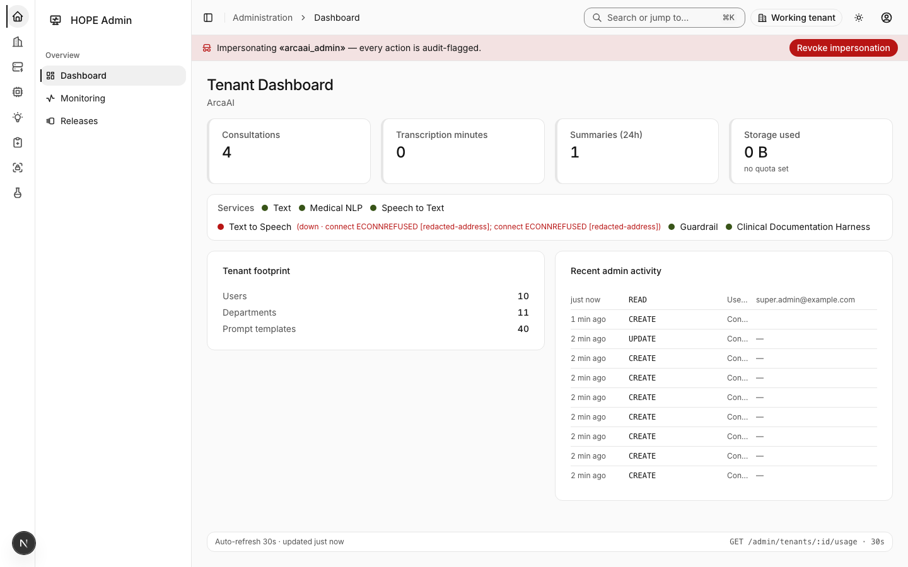
_The sign-in screen. Fill in Username and Password; put your organization's short code in "Tenant key (optional for super admins)" so you land in your own tenant._

The left rail groups everything by domain — **Tenancy**, **Knowledge & Agents**, **Clinical**,
**Workflow & Harness**, **Identity & Access**. The rest of this guide names the screen you want in
that rail.

If you are a platform administrator rather than a tenant administrator, you also have to pick which
tenant you are acting on. Once you do, a banner reading _"Acting on «Your Tenant»"_ appears on
every screen that changes data. If you see that banner naming a tenant you did not expect, stop and
switch before you touch anything.

---

## 2. Departments — the code your integrator sends

**Tenancy → Departments.**

A department decides three things about every consultation: which workflow governs it, which note
template writes it, and which agents run. Your integrator names a department by its **Code**, not
its name, so the code is a contract — pick it once and leave it alone.

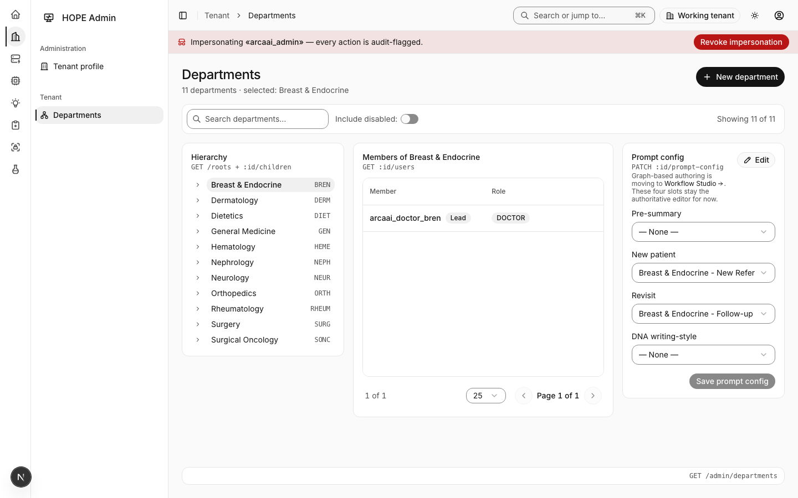
_Creating a department. "Name" is what your staff read; "Code" is what your integrator sends, and it is unique per tenant._

Practical advice:

- Keep codes short, uppercase and stable — `GEN`, `CARD`, `DERM`. They end up in your integrator's
  configuration, and renaming one breaks every request that still sends the old value.
- Create a department for every clinic area that needs its own note. Two areas that write the same
  note do not need two departments.
- Tell your integrator the code list as soon as it is settled. An unknown code is refused at the
  moment a consultation is opened, so a typo shows up as "no consultation was created", not as a
  quiet fallback.

---

## 3. Clinicians and auto-provisioning

**Identity & Access → Users.**

Every consultation belongs to a named clinician. Your integrator does not send HOPE's own user ids;
it sends the staff identifier its own roster already uses, and HOPE matches it to a user here.

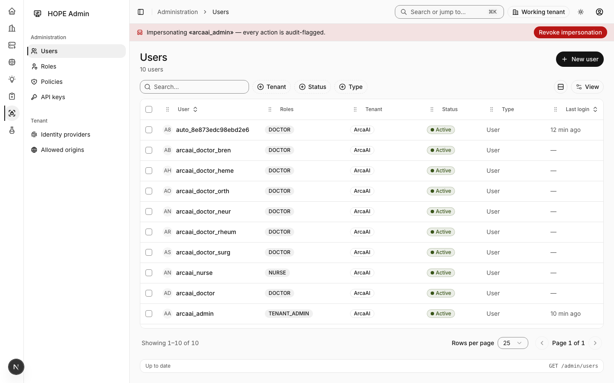
_The Users screen. Each clinician's staff id is what your integrator's system sends when it opens a consultation._

So you have two choices, and either works:

- **Create clinicians up front** and give each one the staff id your roster uses. Safest when your
  clinician list is stable and small.
- **Let HOPE provision them.** When auto-provisioning is on for your tenant and a consultation
  arrives with a staff id nobody here has, HOPE creates the clinician and carries on. Convenient
  for a large roster, and it means you never have to keep two lists in step.

With auto-provisioning off, an unrecognized staff id refuses the consultation instead — which is
the right setting if you want the roster in this console to be the only way a clinician appears.

A staff id that matches **more than one** user is refused as well. If you see that refusal, you
have a duplicate to clean up here, not a problem at your integrator's end.

---

## 4. Consent and the PHI posture, before the first consultation

**Clinical → Patient consent.**

HOPE records consultations, transcribes them and writes clinical notes, so consent is not an
afterthought — settle it before the first real patient. The consent register keys a grant to a
patient identifier and a purpose, so your integrator's own patient id is the join.

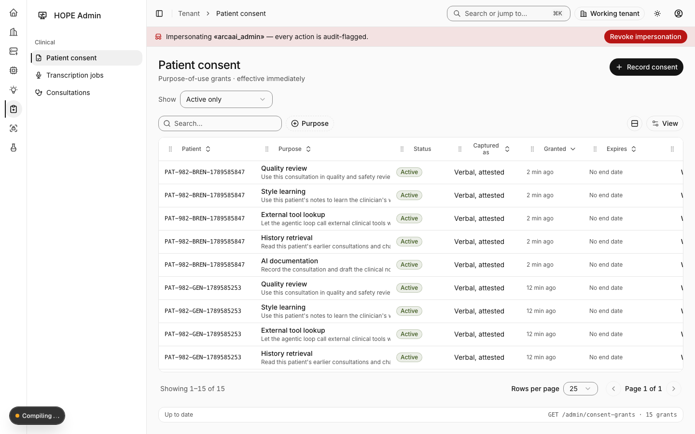
_The consent register. Grants are per patient identifier and purpose; the register is the record you can show an auditor._

Two platform behaviors worth knowing while you decide your policy:

- **Nothing clinical leaves HOPE by accident.** When HOPE notifies an external system of an event,
  it sends identifiers and a link, never the content behind them. The receiving system fetches what
  it needs with its own credentials.
- **Writing-style analysis is opt-out at two levels.** A tenant can decline it, and so can an
  individual clinician. Declining does not affect note generation; it only stops HOPE learning an
  individual's style.

---

## 5. Define the context schema

**Knowledge & Agents → Context Schemas.**

This is the declaration of what a consultation may carry: the vital signs your app sends, the
encounter details, the prior notes. Everything downstream is built on it — what your integrator can
send, what refusals they get, and what your prompts can use.

Open a schema to get its own page.

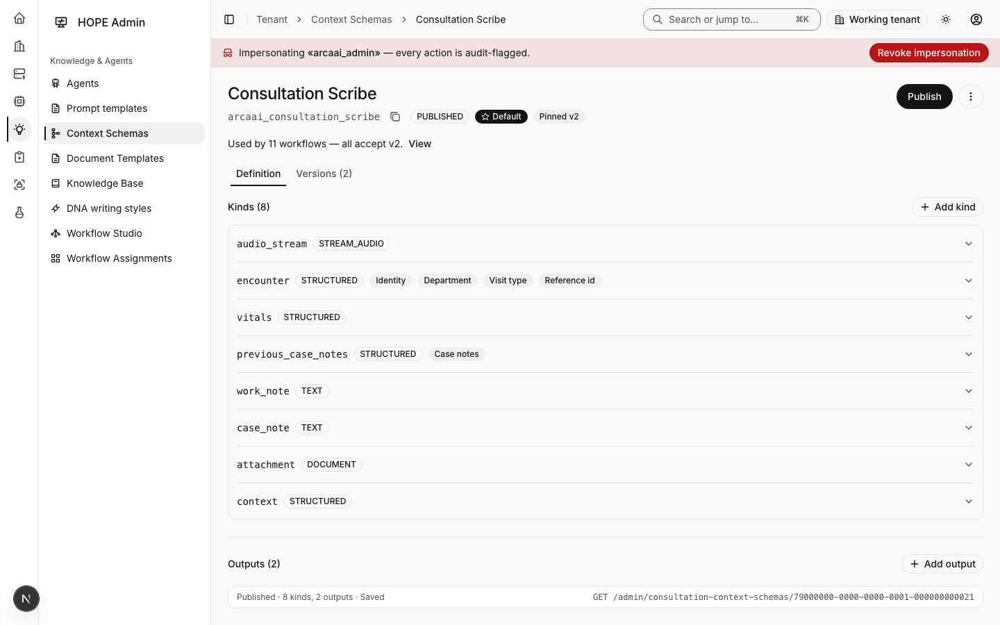
_A context schema. The header carries its status, whether it is the tenant Default, and which version is pinned; the line under it says who depends on it. Two tabs: Definition and Versions._

### Kinds

A **kind** is one thing a consultation carries. Add one per accordion row in **Definition**. Each
kind opens on six fields and nothing else:

| Field           | What to put in it                                                                           |
| --------------- | ------------------------------------------------------------------------------------------- |
| **Key**         | The name your integrator sends — lowercase, no spaces (`encounter`, `vitals`)               |
| **Label**       | What your staff read                                                                        |
| **Primitive**   | What kind of thing it is: structured data, free text, an audio stream, a document, an image |
| **Produced by** | Who sends it — your client app, an agent, or the platform                                   |
| **Required**    | Tick it if every consultation must carry this kind                                          |
| **Description** | One line. Your integrator reads it                                                          |

Everything else is folded away, on purpose:

- **Field roles** — _"Mark which fields tell HOPE the clinician, the department, the visit type or
  your own reference id."_ This is the section that turns data into behavior, and section 5.1 below
  is about it.
- **Advanced** — PHI class, cardinality, lifecycle, the fields' own structure, file types, size
  limits, and the switch that marks a kind deprecated.

Each kind also has a **Try a sample payload** button. Paste an example of what your integrator will
send and see whether this kind accepts it, before anything is published.

### 5.1 Field roles — four fields that do something

Marking a field with a role means HOPE **acts** on it rather than just storing it. There is at most
one field per role, and each one saves your integrator from having to learn HOPE's own identifiers:

| Role         | Effect                                                                                       |
| ------------ | -------------------------------------------------------------------------------------------- |
| Clinician    | The staff id in this field decides whose consultation it is (section 3)                      |
| Department   | The code in this field selects the department — and so the workflow and the note (section 2) |
| Visit type   | New visit or revisit; this wins over anything HOPE could infer                               |
| Reference id | Your own encounter id, kept as a label                                                       |

A typical setup is one structured kind called `encounter` carrying all four, plus separate kinds for
vitals and prior notes.

### 5.2 The status line under the header

_"Used by 11 workflows — all accept v2."_

That line is the whole point of this page. It counts the workflows and agents that depend on this
schema and says whether they would accept the version you are looking at. **View** opens the list,
refusals first, each row naming whether it follows the latest version or is pinned to an older one,
and a plain-word verdict: **Accepts**, **Refuses** or **Unknown**.

"Unknown" means HOPE could not read that consumer's configuration — it is a fact to look into, not
a quiet pass.

The footer keeps you honest about where you are: _"Draft · 4 kinds, 1 output · unsaved changes"_.

---

## 6. Publish, and read what it will do

Press **Publish** on the schema page. Before anything happens, a confirmation tells you the effect
in plain words, and which words you get depends on what the change actually does.

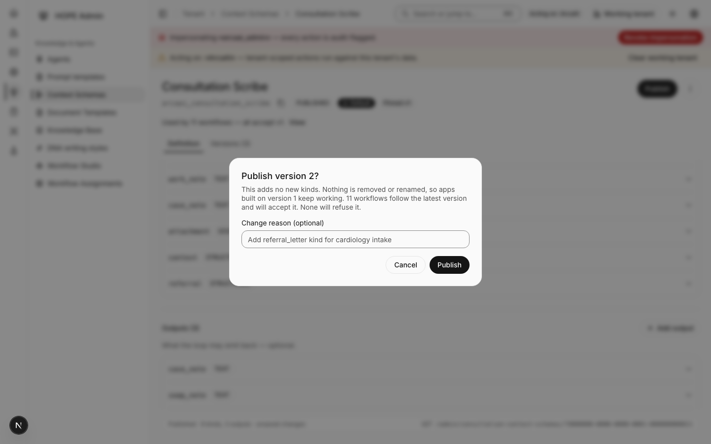
_The publish confirmation. It leads with the effect, names the consumers that would refuse, and asks you to acknowledge only when something real is at stake._

**Nothing refuses it.** The common case:

> Publish version 4? This adds one new kind, `referral`. Nothing is removed or renamed, so apps
> built on version 3 keep working. 11 workflows follow the latest version and will accept it. None
> will refuse it.

One button, no checkbox. Go ahead.

**Something refuses it.** A workflow pinned to an older version does not know about your new kind,
so it will turn away any consultation that sends it:

> Publish version 4? … 2 workflows will refuse it, because they are pinned to an older version.
> They will refuse any consultation that sends the new kind until you republish them:
> · Cardiology intake — pinned v2 …

You must tick _"I understand these 2 workflows will refuse new consultations until they are
republished."_ before **Publish** becomes available. The fix is section 8: open each named workflow
and republish it.

Only workflows and agents that are actually live count toward that checkbox. A draft or disabled one
is listed for information and refuses nothing today.

**It breaks apps already using the current version.** Removing or renaming a kind:

> This change breaks apps already using version 3 · Removes the kind `vitals` …

The checkbox reads _"I understand existing integrations will stop working until they are updated."_
and the button becomes **Publish anyway**. Do not tick it until you have told your integrator, with
a date.

### Rolling back

You cannot un-publish a version — published versions are permanent, which is what makes a
consultation readable years later as the thing it was. What you can do is move the **pin**.

Open the **Versions** tab, find the version you want to serve, and press **Pin**. Everything that
follows the latest version goes back to it immediately, with nothing to republish.

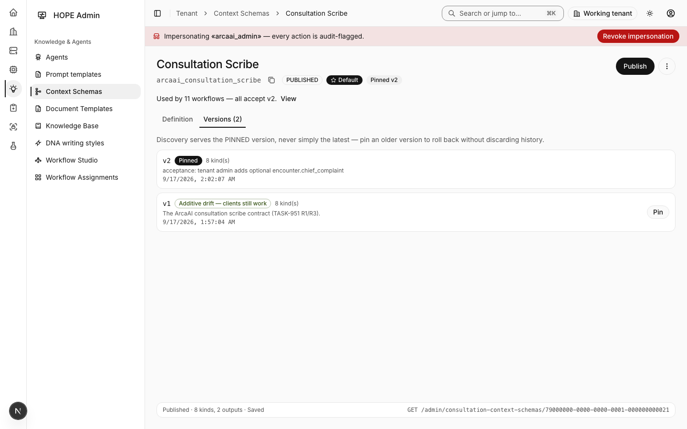
_The Versions tab. The pinned version carries a "Pinned" badge; every other row offers "Pin"._

---

## 7. Agents per department

**Knowledge & Agents → Agents.**

An agent is one AI job: transcribing speech, writing the running note, extracting medical terms.
Your tenant starts with a working set, and you assign which one each department uses.

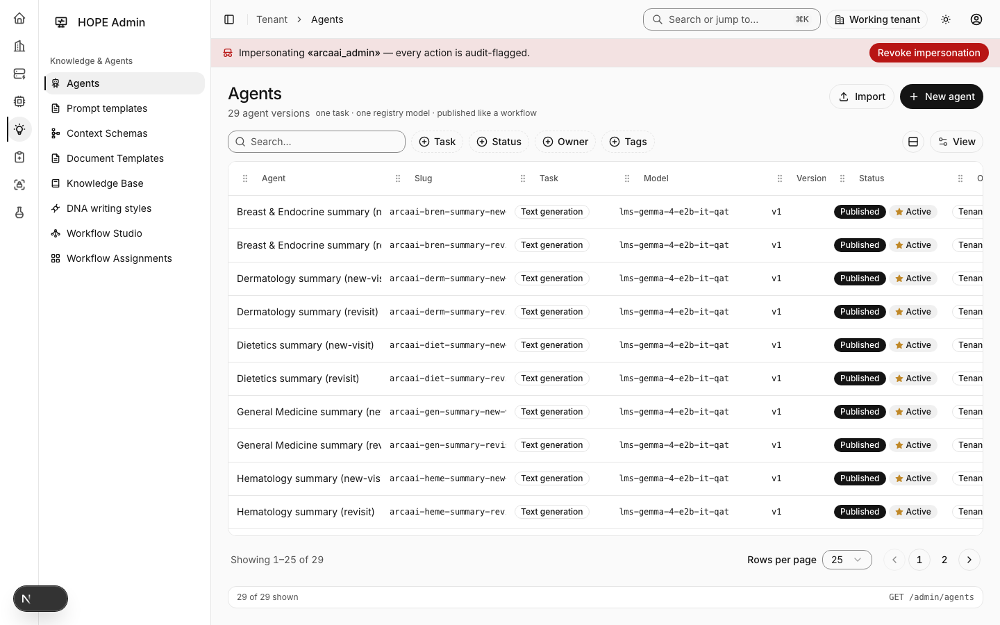
_The Agents screen. Each agent names its task; assignment decides which department it serves._

Two assignments matter most:

- **The speech-to-text agent** decides which transcription model listens. Your integrator does not
  choose this — their app names a department (or nothing) and the assignment decides. That is
  deliberate: the choice of model is yours, not theirs.
- **The note agent** writes the running note. Departments usually have two, one for new visits and
  one for revisits, which is why the visit-type field of section 5.1 matters.

An assignment is resolved department first, then tenant. A department with no assignment of its own
falls back to the tenant's; a tenant with none means no agent runs for that job.

---

## 8. Workflows

**Knowledge & Agents → Workflow Studio** to edit one, **Workflow Assignments** to decide which
department uses which.

A workflow is the sequence HOPE runs for a consultation: transcribe, extract, draft the note, park
for review, finalize. It is the thing that reads the context schema you published in section 6.

### The trigger's schema binding — the one setting to get right

Open a workflow in the studio, select its trigger node, and read the context-schema field. It has
two settings, and the helper text under it tells you which one you are on:

> **Follow latest** — "This trigger uses whichever version is pinned under Context Schemas —
> currently v2. Publishing and pinning a new version takes effect here immediately, with no
> republish."

> **Pinned** — "This trigger always validates against v1, whatever the schema is pinned to.
> Republish this workflow to move it."

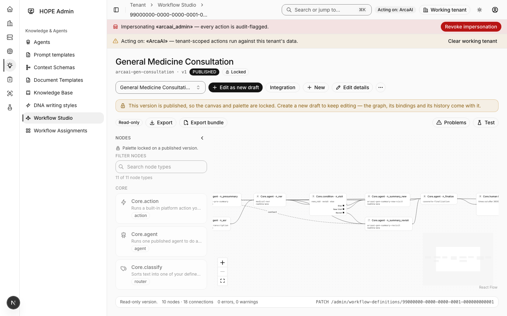
_The trigger's context-schema field. "Follow latest" tracks your pin; a pinned version is frozen until the workflow is republished._

**Follow latest is the setting you want by default.** It is what makes section 6's common case a
one-button publish: add a kind, and every workflow that follows the latest version accepts it that
moment.

Pin a trigger only when a workflow must keep validating against exactly one version — a regulated
flow you do not want moving underneath you. The cost is that it appears as a refuser on every
future publish that adds a kind, until you republish it.

### Assignment

**Workflow Assignments** maps a workflow to a department, the same shape as agent assignment:
department first, then tenant. A consultation whose department has no workflow — directly or by
falling back — runs **ungoverned**: the note is still written, but nothing supervises it. Section 10
shows how that looks afterwards.

---

## 9. Issue an API key

**Identity & Access → API keys → New key.**

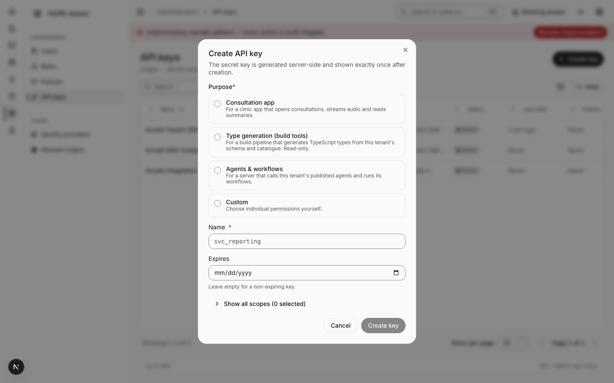
_Creating a key. Pick a Purpose first; the permissions follow from it._

Pick the **Purpose** that matches what your integrator is building. There are four:

| Purpose                           | Give it to                                                                     |
| --------------------------------- | ------------------------------------------------------------------------------ |
| **Consultation app**              | A clinic app that opens consultations, streams audio and reads summaries       |
| **Type generation (build tools)** | A build pipeline that generates code from your schema and catalogue. Read-only |
| **Agents & workflows**            | A server that calls your published agents and runs your workflows              |
| **Custom**                        | You want to pick individual permissions yourself                               |

Then a **Name** (make it say which system holds it — `mobile-app-prod`, not `key 2`), and an
**Expires** date if you want one. _"Show all scopes (12 selected)"_ opens the full permission list
if you want to see or adjust exactly what the purpose granted.

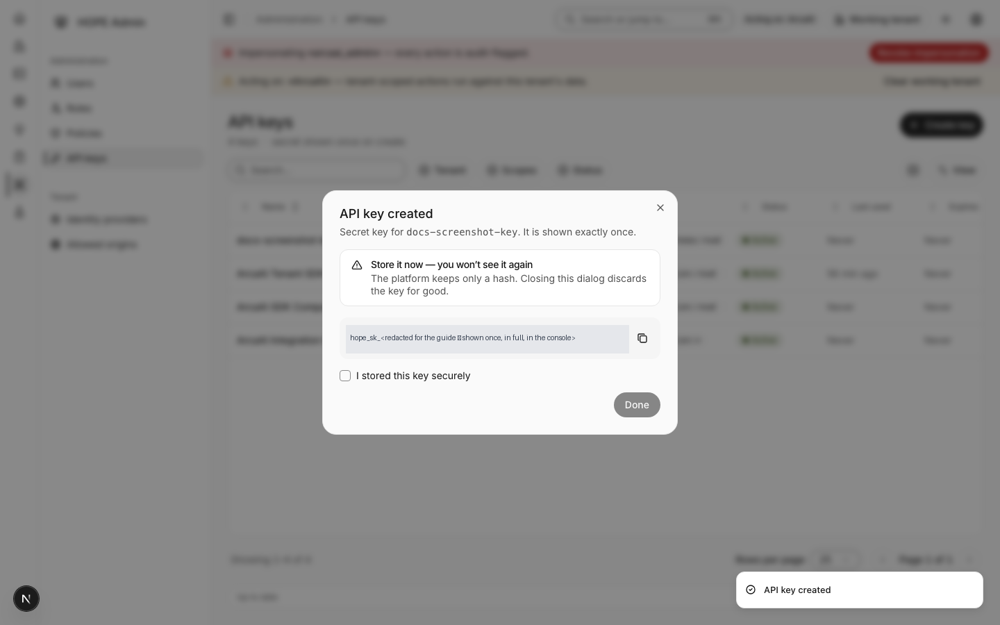
_The key, shown once: "Store it now — you won't see it again." Copy it, confirm you stored it, then Done._

The platform keeps only a hash of the key. Closing that dialog discards it for good — if it is lost,
rotate the key and hand over the new one. Rotation issues a new secret and leaves the old one
working for a 24-hour grace window, so plan the handover inside that window.

### When a service account is needed instead

Some things an API key can never do, by design: read anything under the console's own administrative
routes, subscribe a webhook, or generate types from your **context schema** (as opposed to your
published agents and workflows). Those need a **service account**, which is a platform-level
machine identity.

You cannot issue one. Ask whoever runs your HOPE deployment, and tell them what it is for — the
permissions are granted by name, and one webhook-related permission in particular is not included in
the usual administrative bundle, so it has to be requested explicitly.

---

## 10. Watch a consultation

**Clinical → Consultations.**

Open any consultation to see its detail. Next to its status is a **Workflow** row — the answer to
"did the thing I configured actually run?"

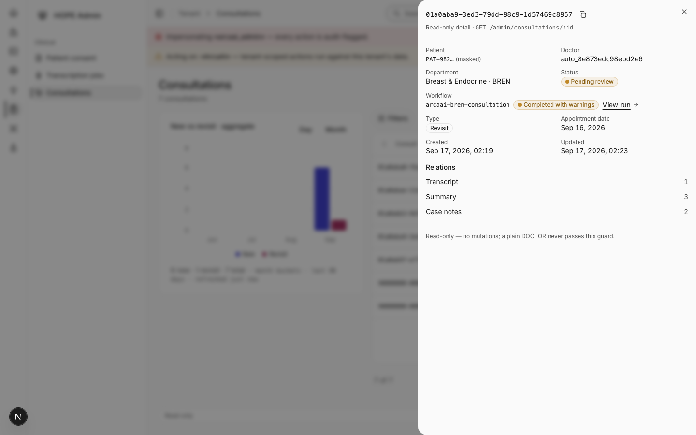
_The Workflow row on a consultation. The workflow's name, a status chip, and a link to the run itself._

What the row can say:

| It reads                       | It means                                                                                                                  |
| ------------------------------ | ------------------------------------------------------------------------------------------------------------------------- |
| **Not governed by a workflow** | No workflow was assigned for this department, or none could be started. The note was still written; nothing supervised it |
| **Running**                    | The workflow is still working                                                                                             |
| **Completed**                  | It finished cleanly                                                                                                       |
| **Completed with warnings**    | It finished, but some steps degraded or were skipped. The note exists; check the run to see what was missed               |
| **Failed**                     | It did not finish                                                                                                         |
| **Timed out**                  | It ran past its limit                                                                                                     |

A failed run adds a plain sentence and the raw reason underneath:

> This consultation ran without its workflow. Reason: the context didn't match what the workflow
> accepts.

That raw line is the one to send your integrator — it names exactly what was wrong. **View run**
opens the run itself, where you can see which step failed.

---

## 11. What each refusal means to your integrator

When HOPE turns a consultation away, it answers with a short code. Your integrator sees it; you
often have to fix it. Every one of these means **nothing was created** — there is no half-made
consultation to clean up.

| What went wrong, and what you do about it                                                                                                                                                         | The code your integrator sees           |
| ------------------------------------------------------------------------------------------------------------------------------------------------------------------------------------------------- | --------------------------------------- |
| The data sent does not match your published schema. Their problem to fix, using the detail HOPE returns with the code — unless the schema is wrong, in which case it is section 5                 | `CONTEXT_SCHEMA_VIOLATION`              |
| Your schema accepts it, but the workflow governing that department froze an older version. **Yours to fix:** republish that workflow (section 8), or set its trigger to follow the latest version | `WORKFLOW_CONTEXT_INCOMPATIBLE`         |
| The department code they sent does not exist here. Check section 2 and send them the current list                                                                                                 | `DEPARTMENT_UNKNOWN`                    |
| The department name they sent matches more than one department. Ask them to send the code instead                                                                                                 | `DEPARTMENT_AMBIGUOUS`                  |
| The department they named is not one they are allowed to open for                                                                                                                                 | `DEPARTMENT_MISMATCH`                   |
| The visit type they sent is not one HOPE recognizes                                                                                                                                               | `VISIT_TYPE_INVALID`                    |
| Their system did not say which clinician the consultation belongs to. HOPE never guesses                                                                                                          | `CLINICIAN_REQUIRED`                    |
| They named one clinician and their data implied another. One of the two is stale                                                                                                                  | `CLINICIAN_MISMATCH`                    |
| A person signed in as themselves tried to open a consultation for somebody else                                                                                                                   | `CLINICIAN_NOT_ALLOWED_FOR_USER_CALLER` |
| The staff id they sent is not a clinician here, and auto-provisioning did not create one. Section 3                                                                                               | `USER_IDENTITY_UNKNOWN`                 |
| That staff id matches more than one user here. **Yours to fix:** a duplicate in Users                                                                                                             | `USER_IDENTITY_AMBIGUOUS`               |
| The staff-id field held something that is not a usable identifier at all                                                                                                                          | `USER_IDENTITY_INVALID`                 |
| The person that staff id resolves to cannot act as a clinician here — check their role                                                                                                            | `USER_IDENTITY_NOT_USABLE`              |
| The clinician resolved, but no department could be worked out for them                                                                                                                            | `USER_IDENTITY_DEPARTMENT_UNRESOLVED`   |

One more code appears on your side rather than theirs: when a publish would make a live workflow
start refusing consultations, HOPE requires the acknowledgement described in section 6 before it
will go through.

---

## 12. Troubleshooting — five symptoms and the screen that answers

| Symptom                                                                                                                            | Where to look                                                                                                                                                         |
| ---------------------------------------------------------------------------------------------------------------------------------- | --------------------------------------------------------------------------------------------------------------------------------------------------------------------- |
| **"Our app can't open consultations at all."** Ask for the code. It is one of section 11's, and the table says whose problem it is | The code decides                                                                                                                                                      |
| **"Consultations open, but nothing is supervising them."** The Workflow row reads _Not governed by a workflow_                     | **Workflow Assignments** — is one mapped to that department, or to the tenant?                                                                                        |
| **"It broke right after I published the schema."** A workflow pinned to an older version is now refusing                           | **Context Schemas** → the schema → the _Used by_ line → **View**. Republish every row marked **Refuses**, or set its trigger to follow the latest version (section 8) |
| **"The note came out, but it looks thin."** _Completed with warnings_ means steps were skipped                                     | The Workflow row → **View run**, to see which step degraded                                                                                                           |
| **"A clinician's consultations are landing on the wrong person — or nobody."** The staff id does not resolve the way you expect    | **Users** — is the staff id there, exactly once, and does it match what their roster sends?                                                                           |

Two rules that resolve most of the remaining confusion:

- **A schema publish takes effect immediately for anything that follows the latest version, and
  never for anything pinned.** If a change did not take, check the binding before anything else.
- **When HOPE cannot see something, it says so rather than guessing.** A verdict of _Unknown_, a
  workflow row reading _Not governed_, a consent grant that is missing — each is a real answer, and
  each has a screen above that fixes it.

---

## Related

- [Client-side Development & Integration Guide](./client-integration-guide.md) — your integrator's half
- The console's own **Developer** page carries the same refusal codes and key presets, rendered live
  from the platform, plus the commands your integrator runs
