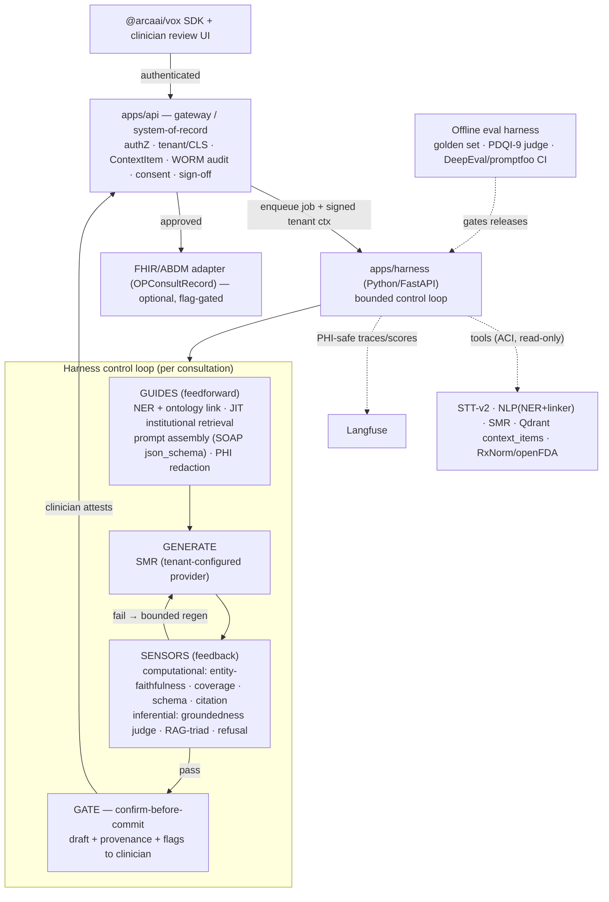

# TASK-330 — Clinical Documentation Harness (Harness-Engineering HLD)

| Field | Value |
|---|---|
| Ticket | TASK-330 |
| Title | Clinical Documentation Harness — applying Harness Engineering to the AI consultation / clinical-document build workflow |
| Type | research + high-level design (architecture) |
| Created | 2026-06-02 |
| Updated | 2026-06-06 (**v3** — codebase re-review post-TASK-331, SOTA reconciliation, **durability locked = Temporal**, detailed implementation plan) |
| Status | **Review** (design + plan ready for approval; no code written) |
| Scope | `apps/{stt-v2,nlp,smr,api}` + new `apps/harness`; `packages/{agentic-sdk-v2,med-ner,applications,domains,database}`; infra `Qdrant` + `Langfuse` + **Temporal**; India `ABDM/FHIR` adapter |
| Research | Fully-cited research archive: [`research/clinical-harness/`](../../../research/clinical-harness/README.md) (8 docs, 182 sources) |
| Plan | Detailed phased implementation plan: [`implementation-plan.md`](./implementation-plan.md) |
| Interpretation | "Harness Engineering" = the 2026 AI-agent discipline (*Agent = Model + Harness*). "Build automation workflow" = the automated **clinical-document build pipeline** (transcribe → detect entities → summarize → assemble note → clinician sign-off), **not** Harness.io / CI-CD. |

> Phase-3 (Plan) document per `01-development-workflow.mdc`. No code is written until the plan + use cases
> below are approved. "Implementation Summary" is intentionally empty.

---

## 0. What changed

### v3 (2026-06-06) — codebase re-review + SOTA reconciliation + implementation plan
Three review agents re-evaluated the **current** codebase (post **TASK-331**) and one research agent gathered the
**2026 implementation SOTA**; all six research reports are now archived with full citations in
[`research/clinical-harness/`](../../../research/clinical-harness/README.md). Net changes vs v2:
- **Durability/HITL locked = Temporal** (D11). Sign-off can lag hours/days → the loop must be a *resumable* durable
  workflow with zero-compute waits, SLA/escalation timers, and replay-grade audit. LLM/tool calls live in Temporal
  **Activities**; workflow code stays deterministic.
- **SOTA stack chosen** (D12): **Outlines+vLLM `guided_json`** / OpenAI Structured Outputs for schema enforcement;
  **Bespoke-MiniCheck-7B** as the self-hosted groundedness sensor; **Presidio + clinical NER → John Snow Labs** for
  PHI; **Llama Guard 3** for safety; **DeepEval + promptfoo** CI gates + **RAGAS** + **Epic's open-source PDSQI-9**
  LLM-judge; **Langfuse over OTel** with masking at *both* SDK and Collector. (See `06-sota-harness-implementation.md`.)
- **Faithfulness-judge strategy resolved** (was open #3): small judge **≤20B self-hosted via LM Studio** (priority),
  large judge via **Azure OpenAI / AWS Bedrock** — model-agnostic, honours D3.
- **Reconciled to current codebase** (new §3.4): TASK-331 added `SummaryMeta.promptResolvedFrom/resolvedPromptId`,
  dual-capture `AudioRecording.rawMediaId/processedMediaId`, `prompt-template-read` for `DOCTOR`, DNA-generate
  isolation, assembled-IDs default summary, and a tenant-scope drift guard. Confirmed still-missing: NER→prompt
  injection, activated SOAP schema, sensors, Qdrant ingestion, WORM/attestation/consent/lifecycle-status/FHIR-id/
  eval tables, Langfuse wiring. `AuditLog` exists but is **mutable (not WORM)** with no `ATTEST` action.
- **Detailed implementation plan added** as [`implementation-plan.md`](./implementation-plan.md) (phased, TDD,
  layer order, concrete file touch-points).

### v2 (2026-06-02)

v1 was the initial research + HLD. v2 **locks the design** against an interactive brainstorm (10 decisions, §1.4)
and **5 parallel deep-research agents** focused on the medical domain + harness engineering for medical
applications (ambient clinical documentation, medical knowledge grounding, clinical evals/governance, India
regulation, clinical interoperability/tool-calling — folded into §2.5–2.9). The biggest changes:

- **Topology decided**: a **dedicated Python/FastAPI orchestrator `apps/harness`** (services-as-tools via ACI),
  not a module inside `apps/api`.
- **Grounding narrowed** to **internal faithfulness + institutional (tenant-owned) knowledge** — which neatly
  sidesteps the external-corpus licensing minefield (StatPearls is non-commercial; UpToDate/DynaMed proprietary).
- **Governance is now India-first** (DPDP Act 2023 + Rules 2025, ABDM/NRCeS FHIR, Telemedicine Guidelines 2020,
  CDSCO non-device line) on a multi-region common-denominator baseline.
- Added **component breakdown, data flow, error-handling/degradation, governance, and testing/eval** sections.

---

## 1. Requirement Analysis

### 1.1 Description
Apply harness-engineering techniques to make the **full AI consultation product flow as built today** — *open
consultation → record → live transcript → NER → summarize → review/edit/approve → DNA personalization* —
**best-practice**, optimised for **clinical accuracy & safety** with **grounded, provenance-backed** notes.

### 1.2 Business context
The dominant quality risks in clinical documentation are **omission** (the single most frequent error, and the
hardest for a human reviewer to catch — it needs *recall*, not *recognition*), **hallucination/fabrication**
(highest-harm: fabricated meds/doses/labs), and **lack of provenance**. Peer-reviewed 2024–26 evidence (§2.5)
shows clinician proofreading alone is a *weak* safeguard. Harness engineering is the discipline that turns a
probabilistic model into a dependable, verifiable, auditable system — i.e. HOPE's value is in the **harness**
(automated grounding/coverage checks, linked evidence, attestation gates, audit, monitoring), **not the model**.

### 1.3 Acceptance criteria (for this design)
- Grounded, source-cited definition of harness engineering + the medical-domain techniques relevant to HOPE.
- A business-flow review with a harness reading + best-practice per flow.
- A target HLD ("Clinical Documentation Harness") as a **dedicated orchestrator** reusing existing services as
  tools, with the four use cases mapped to concrete services/files.
- Components, data flow, error-handling/degradation, **India-first governance**, and testing/eval strategy.
- A phased roadmap, success metrics, risks, and the **resolved + remaining** decisions.

### 1.4 Locked design decisions (brainstorm)
| # | Decision | Choice | Design implication |
|---|---|---|---|
| **D1** | Scope | Full AI consultation product flow as built, made best-practice | lifecycle + context assembly + DNA + documentation harness |
| **D2** | Primary driver (tie-breaker) | **Clinical accuracy & safety** | sensors/grounding > latency/automation when they conflict |
| **D3** | Deployment / PHI residency | **Tenant-configurable** cloud *or* on-prem | harness must be **model-agnostic**, degrade gracefully on local models |
| **D4** | Control posture | **Mandatory clinician sign-off; AI never auto-finalizes** | HITL is an **architectural** confirm-before-commit gate, not a prompt |
| **D5** | Grounding | **Internal faithfulness + institutional** (tenant-owned) knowledge | no external public corpora → **no licensing exposure** |
| **D6** | Regulatory | Multi-region common-denominator, **India-first** | DPDP/ABDM/Telemedicine/CDSCO + HIPAA/EU-AI-Act baseline, region-configurable |
| **D7** | Tool-calling | **Bounded, read-only, cited, advisory** | drug/allergy + terminology + prior-visit lookup; never auto-applied |
| **D8** | Sequencing | **Eval harness first** | golden set + judge + CI gates *before* any model/prompt change |
| **D9** | Topology | **Dedicated orchestrator service** (ACI) | `apps/harness`; reuse STT/NLP/SMR as tools; propagate tenancy/authZ |
| **D10** | Orchestrator stack | **Python / FastAPI** | co-locate the ML control stack; `apps/api` = gateway + system-of-record |
| **D11** | Durability / HITL layer *(v3)* | **Temporal** | resumable durable workflow; signal-based confirm-before-commit; SLA/escalation timers; replay audit. LLM/tool calls in Activities; adds a Temporal server/cluster to ops |
| **D12** | Eval/guardrail/judge stack *(v3)* | **Adopt SOTA** (see §0/§4.3) | Outlines/OpenAI structured outputs · Bespoke-MiniCheck-7B · Presidio→JSL · Llama Guard 3 · DeepEval/promptfoo/RAGAS + Epic PDSQI-9; judge ≤20B via LM Studio, large via Azure/Bedrock |

---

## 2. Research

### 2.1 The three-layer evolution → `Agent = Model + Harness`
| Layer | Answers | Era |
|---|---|---|
| Prompt engineering | "What do I *say* this turn?" | 2022–24 |
| Context engineering | "What *information lands in the window* before it reasons?" | 2025 |
| **Harness engineering** | "What happens *around* the model — loop, tools, checks, memory, gates — and **what happens when it's wrong**?" | 2026 |

The harness is *everything in an agent that isn't the model*: orchestration loop, tool definitions, retries,
context pipeline, validation, memory, permissions, observability. Term coined by **Mitchell Hashimoto** (Feb
2026), formalised by **Birgitta Böckeler / Martin Fowler**
([martinfowler.com](https://martinfowler.com/articles/harness-engineering.html), Apr 2026), building on
Anthropic's and OpenAI's agent-engineering work.

### 2.2 Böckeler's control model — *the mental model to adopt*
A harness is a **cybernetic control system**: two control types × two implementation styles. Maps cleanly onto
a regulated medical workflow:

|  | **Guides** (feedforward — *before* the model acts) | **Sensors** (feedback — *after* the model acts) |
|---|---|---|
| **Computational** (deterministic, fast, cheap) | JSON schema, department template, allowed-tool list, system prompt | Schema validators, **entity-faithfulness (NER↔note)**, coverage/omission check, citation-presence, drug/dose rules |
| **Inferential** (LLM-based, semantic) | Retrieved institutional guidelines injected as context, few-shot exemplars | **LLM-as-judge**, NLI/entailment faithfulness, completeness-vs-template |

Two theses that drive HOPE's sequencing:
- *"Once you have something objective, a formal deterministic check gives more assurance than human review."* → prefer **computational sensors**.
- *"A weak harness means better prompts just produce more sophisticated bugs."* → **build verification first** (= D8).

### 2.3 Anthropic building blocks ([Building effective agents](https://www.anthropic.com/engineering/building-effective-agents))
**Do the simplest thing that works; workflows beat autonomous agents for well-defined, high-stakes tasks.**
Augmented LLM · prompt chaining · routing (by department) · parallelisation · orchestrator–workers ·
**evaluator–optimizer** (generate→critique→regenerate, the key accuracy pattern) · autonomous agent (sparingly) ·
**ACI** (invest in tool docs/schemas as much as prompts; *poka-yoke* them).

### 2.4 Context engineering ([Effective context engineering](https://www.anthropic.com/engineering/effective-context-engineering-for-ai-agents))
"Context rot" → smallest set of high-signal tokens. A 30–45 min consult exceeds the window → **compaction**,
**structured note-taking** (persist state outside the window), **sub-agents**, **just-in-time retrieval**.

### 2.5 Clinical evidence — ambient documentation accuracy & trust
*(AI-scribe research agent; peer-reviewed 2024–26)*
- **Omissions are the #1 error and the hardest to catch** — they require reviewer *recall*. Simulated-encounter
  study: 127 errors across 70% of draft notes (Mayo Clinic Proc: Digital Health 2025). Prospective pilot: omissions
  18%, hallucinations 11.5%, **~4–5% of notes carried potential for serious harm** (JMIR Med Inform 2026).
- **Hallucinations 20–31% of notes**; highest-harm class = fabricated/omitted **meds, doses, test results**,
  often propagated from ASR mis-recognition (Frontiers in AI 2025; Mayo 2025).
- **Clinician proofreading is a weak primary safeguard** — the literature's strongest single message.
- **Provenance is the trust mechanism**: Abridge **Linked Evidence** maps each note phrase → transcript span →
  replayable audio. Per-claim groundedness ("read like a code review") builds clinician trust.
- **Value/justification**: NEJM AI RCT 2025 — Nabla cut note time 9.5%; both vendors reduced burnout. JAMA Netw
  Open — burnout 51.9%→38.8%. But burden-reduction **does not** reduce the safety obligation.
- **Disclosure & provenance law**: CA **AB-3030** requires an AI-disclosure line that **survives export**;
  **USCDI v4 (2026)** makes **FHIR Provenance** a required data class.
- **→ HOPE**: make **NER the grounding layer**; build **Linked-Evidence** review UI; add an explicit
  **coverage/omission** check; **attestation gate** stamping model+version; instrument the **edit/correction loop**.

### 2.6 Knowledge grounding & ontology — and the licensing reality
*(clinical-RAG research agent)*
- **D5 (internal+institutional) is the licensing-safe choice.** Only **PubMed/MEDLINE + PMC-OA (CC-BY) + CDC +
  ICD-11 codes** are clearly commercial-usable; **StatPearls is CC BY-NC-ND** (no commercial/derivative use);
  **UpToDate/DynaMed are proprietary**. Tenant-owned approved guidelines/protocols/formulary avoid all of this.
- **Embedding-dimension fact**: the provisioned `context_items` collection is **1536-dim** → fits OpenAI
  `text-embedding-3-small` (clean baseline for institutional docs, **no migration**). MedCPT/BioLORD (768-dim)
  would need a *new* collection — defer unless we add biomedical-literature retrieval later.
- **Retrieval gold standard**: **hybrid BM25 + dense → RRF (k≈60) → cross-encoder rerank** top-50→~8; recursive
  **400–512-token chunks, 10–20% overlap**, rich metadata (source, section, date, code tags).
- **Ontology linking**: **scispaCy + UMLS** (fast start) → **MedCAT v2** (production SNOMED/UMLS); map spans →
  **UMLS CUI** → SNOMED CT / RxNorm / LOINC / ICD. Requires a (free) **UMLS license**.
- **Faithfulness**: **RAG triad** (context relevance, groundedness, answer relevance) + **ASTRID** refusal +
  **StrictCitations** (cite a chunk ID per claim) + **verify-citations** post-hoc (MedCite); MEGA-RAG reports
  **>40% hallucination reduction**. Watch numeric claims (doses/percentages/dates) — they hallucinate most.

### 2.7 Evaluation, guardrails & governance
*(medical-AI evals/governance research agent)*
- **No single tool is clinical-grade**; combine **DeepEval/promptfoo in CI** (regression + red-team gates) +
  **Langfuse** (already staged — LLM-as-judge on production traces) + **Arize Phoenix** (drift/post-market).
- **Validated clinical-note QA path**: clinician **golden set** scored against the **PDQI-9 / PDSQI-9** rubric;
  a **reasoning LLM-as-judge** reached **ICC ≈0.82** vs 7 clinicians (npj Digital Medicine 2025) — validate the
  judge (ICC ≥0.8 / Gwet AC2) before trusting it.
- **HITL = architectural gate, not a prompt** (confirm-before-commit, outside the model so injection can't bypass).
- **Audit is a hard requirement**: immutable/WORM log capturing **model *version*** (not just name), prompt/
  template version, citations, guardrail decisions, and **clinician accept/edit/reject + rationale**; retain
  **≥6 yr** (HIPAA §164.530(j)), surfaceable on demand (EU AI Act Art. 12).
- **Guardrails** (replace SMR's regex): **PHI redaction** (Presidio/GLiNER via NeMo Guardrails), groundedness/
  entailment, **schema enforcement** (Guardrails AI), a self-hosted **Llama-Guard-class** unsafe-advice filter —
  all **runnable locally** (no PHI egress; honours D3).
- **Regulatory line (unanimous)**: a **documentation drafter with mandatory clinician authorship/sign-off = NOT a
  regulated device** (US FDA enforcement discretion). The instant a feature **"drives/informs clinical
  management"** (diagnosis, CDS, auto-coded billing Dx) it trips **FDA SaMD + GMLP + PCCP**, **EU AI Act high-risk**
  (Annex I via MDR; long-stop **2 Aug 2028**), **UK DCB0129/0160**. → keep such features on a separate flag-gated
  regulated roadmap.

### 2.8 India-first regulatory & interoperability
*(India research agent + interoperability/tool-calling agent)*
- **DPDP Act 2023 + Rules 2025** (notified 13–14 Nov 2025; ~18-month phase-in): standalone **purpose-specific
  consent** notice + **withdrawal**; **72-hr breach** report to the Data Protection Board; likely **Significant
  Data Fiduciary** status for large health-data processors → **annual DPIA + audit + algorithmic-risk** review and
  possible **data-localization** of specified categories; **Consent Manager must be India-incorporated**;
  healthcare is **exempt** from children's-data parental-consent when limited to providing the health service.
  HOPE is most likely a **Data Processor** to tenant **Data Fiduciaries** → ship a **DPA** + sub-processor
  disclosures + "no PHI for training without consent".
- **ABDM / NRCeS FHIR** (voluntary today; effectively mandatory for AB-PMJAY/insurance): emit the signed note as a
  FHIR R4 **`OPConsultRecord`** Composition (SNOMED `371530004`) inside a `DocumentBundle` (**Composition first**),
  with **ABHA** (Patient), **HPR** (author), **HFR** (custodian), encounter, consent-artefact IDs; federated India
  storage; consent-gated exchange via HIE-CM. **Capture these identifiers in the schema now; flag-gate the exchange.**
- **Telemedicine Practice Guidelines 2020**: **recorded consent** (explicit if clinician-initiated), RMP + patient
  identification, durable record/prescription retention (~**3 yr**).
- **CDSCO MDR 2017 + Draft MDS Guidance (21 Oct 2025)**: a pure **documentation/scribe/storage aid is explicitly
  *not* a device**; **non-autonomous (aid-only)** + human sign-off keeps HOPE non-device — *until* output drives
  diagnosis/CDS → **SaMD Class A–D** + Algorithm Change Protocol.
- **MeitY AI Governance Guidelines (Nov 2025)** + healthcare **SAHI/BODH (Feb 2026)**: human oversight, transparency,
  clinical validation, continuous monitoring, grievance redressal.
- **Interop/tool facts**: the **NLM Drug-Drug-Interaction API is dead (since Jan 2024)** → use **RxNorm normalize →
  openFDA label → parse `drug_interactions`**; **DrugBank free checker retired Mar 2026**; **SMART on FHIR v2.2**
  (PKCE) is required for ONC; LLM→FHIR quality gate = **terminology retrieval → schema-constrained decoding → FHIR
  validator repair loop (≤3 passes)**.

### 2.9 Convergent conclusions (the design spine)
1. **Omissions > hallucinations**, and proofreading is weak → the harness must run **automated coverage +
   faithfulness** checks; the **NER↔note entity diff** (pinning meds/doses/labs/allergies/numbers to transcript
   spans) is the highest-leverage control.
2. **Provenance is trust** → every clinical claim links to a transcript span or cited chunk; unverified claims
   float to the top of the review queue.
3. **Eval-first is validated** (golden set + PDQI-9 + reasoning-judge ICC≈0.82 + CI gates) — and matches D8.
4. **HITL is architectural** + attestation + **WORM audit** (one log satisfies HIPAA, EU Art. 12, DPDP, SAHI).
5. **The non-device line is load-bearing** across US/EU/India — documentation aid + mandatory sign-off stays
   non-device; decision-support is a separate regulated track.

---

## 3. Current State Evaluation

**Headline: HOPE already implements ~60% of an agent harness — it just isn't *organised* as one, and three
layers are missing (sensors/verification, knowledge-grounding, eval harness).**

### 3.1 Harness primitives that already exist (reuse, don't rebuild)
| Harness concept | Where it lives in HOPE today |
|---|---|
| **Orchestration loop** | BullMQ jobs + Redis + SSE (`consultation-job.service.ts`, `summary.processor.ts`); SMR `task_manager` + SSE |
| **Memory / structured notes** | `ContextItem` + `ContextItemVersion` (`RAW_SUMMARY` / `MODIFIED_SUMMARY`, `approved`) |
| **Feedback loop** | DNA writing-style: approved/edited summaries → `DnaWritingStyleProcessor` → injected via `/text/generate/assembled` |
| **Context assembly** | `ContextService` (consultation chain + same-day linked); `previous_visit_service` (pre-summary) |
| **Guides (computational)** | **`PromptAssemblyService` + `PromptResolutionService`**: tiered template resolution, variable substitution incl. `{style_DNA_*}`, builds system+user prompt + hyperparameters + JSON schema |
| **Structured-output guide (unused)** | SMR supports `response_format: {type: json_schema}` (Azure `json_schema` / Ollama `format`) — **not used by the summary processors** (structured SOAP is low-lift) |
| **Embryonic sensors** | SMR `guardrails.py`/`external_guardrail.py` (regex), `generation_audit`, circuit breaker, JSON-repair; **STT hallucination heuristics** (RMS, short-word-count, filler regex) |
| **Orchestration primitive (unused)** | `packages/pipeline` **`PipelineOrchestrator`** (`register`/`connect`/`execute`) — built, not wired in prod |
| **Governance** | Per-job authZ, 4-layer tenant isolation + CLS, idempotency keys, cancellation/AbortController, SMR error→typed-code mapping |
| **Observability** | OTel + Prometheus + Grafana; **Langfuse** staged in deployment research |
| **Vector infra** | **Qdrant**: `stt_speaker_embeddings` (active) **+ a `context_items` 1536-dim cosine collection already provisioned (tenant/consultation/type-filtered) but unused** — ready for the institutional-knowledge pipeline |

### 3.2 Flow-by-flow review + best-practice recommendations
| # | Business flow | What exists | Harness reading | Recommended best practice |
|---|---|---|---|---|
| F1 | **Consultation lifecycle** (open/record/close/reopen, revisit chains) | `consultation.service` + lifecycle endpoints (TASK-322); idempotent transitions | Session/episode boundary for the loop + memory scope | Promote lifecycle `status` to a first-class state machine; emit lifecycle events as harness checkpoints |
| F2 | **Realtime transcription** | STT-v2 (Whisper/NeMo/Azure, Silero VAD, Pyannote+Qdrant); on-device Vox pipeline | Ingestion **guides** (VAD/noise/diarization gating) | Gate low-confidence/low-SNR segments before summarization; stream partials into incremental state (UC-1) |
| F3 | **NER / entity detection** | NLP `blaze999/Medical-NER`, diagnosis suggester; `@arcaai/med-ner`; Entity-Validate (TASK-261) | Standalone extractor → **should also be a computational sensor** | Add **ontology linking** (UMLS/SNOMED/ICD/RxNorm); entities drive retrieval, faithfulness, structure |
| F4 | **Summarization** (sync + async) | SMR multi-provider, templates, structured JSON, SSE, guardrails | Single-shot generate. **No grounding, no regen-on-fail** | Wrap in **evaluator-optimizer** driven by sensors; institutional grounding + citations |
| F5 | **DNA writing-style** | Learns from approved/edited; injects style; corpus = approved versions (TASK-299 D-11) | Real **feedback loop + memory** — keep | **Separate *style* from *facts***; never learn to suppress safety content (meds/sections) |
| F6 | **Context assembly** | Chain + same-day linking; ContextItem versioning | **Context-engineering** substrate | Just-in-time retrieval + compaction; rank prior context, don't dump history |
| F7 | **Pre-summary** | `previous_visit_service` (vitals/labs/prior visits) | Prompt-chaining precursor | Ground pre-summary facts to the record; mark inferred claims unverified |
| F8 | **TTS** (port 8863) | Text-to-speech | Output channel | Out of core scope; could read back the *approved* note only |
| X | **Cross-cutting** (tenancy/PHI, auth, observability, idempotency) | Strong (TASK-305/306/317, TASK-299) | Harness **governance + observability** | PHI-safe Langfuse traces, per-step spans, redaction, tenant-scoped knowledge, **WORM audit + consent** |

> **Notable misconfig (separate fix):** the NLP doc-type text-classifier is wired to an *emotion* model
> (`michellejieli/emotion_text_classifier`) — a placeholder. Small corrective ticket; doesn't block this design.

> **Wiring fact:** NER entities are extracted/stored as `NamedEntity` (`ner.processor.ts`) but **never injected
> back into the summarization prompt**. The injection point exists: `PromptAssemblyService.buildVariables()` —
> the cheapest path to both grounding *and* the faithfulness sensor (UC-2).

### 3.3 The three missing layers
1. **Sensor / verification** — nothing checks a note is *faithful* to the transcript/evidence. (Biggest accuracy gap.)
2. **Knowledge-grounding** — no institutional RAG, no citations/provenance. The Qdrant `context_items` collection
   (1536-dim) is **provisioned but empty** — only the ingestion/retrieval pipeline is new (lower lift than greenfield).
3. **Eval harness** — no golden set, no faithfulness/coverage metrics, no regression gate. (Böckeler: build *first*.)

### 3.4 Reconciliation with current codebase (v3 — post-TASK-331 re-review)
Three review agents confirmed §3.1–3.3 and pinned the exact integration points + governance deltas:

**TASK-331 baseline now in place (build on it):**
- `SummaryMeta.promptResolvedFrom` + `resolvedPromptId` (migration `20260603175719_add_summary_meta_prompt_tier`) —
  the start of a prompt-tier audit trail the harness WORM record extends.
- `AudioRecording.rawMediaId` + `processedMediaId` — dual-capture infra usable for transcript-faithfulness checks.
- `prompt-template-read` policy added to `DOCTOR` (`seed/03-role.ts`) → clinicians can select templates at the gate
  without admin privilege (prereq for the Gate adapter).
- `assertActingAsDoctor()` on DNA generate + default summary via `/text/generate/assembled` (IDs, not raw text) —
  closes PHI-in-prompt / ownership-bypass risks the sensor layer depends on.
- Schema-derived **tenant-scope drift guard** (`TENANT_SCOPED_MODELS`) — any new governance table must be
  consciously triaged or tests fail (prevents silent tenancy gaps).

**Confirmed still-missing (the work):**
| Area | Exact finding | Touch-point |
|---|---|---|
| NER→prompt injection | `PromptAssemblyService.buildVariables()` has no NER slot; `PromptAssemblyParams` has no `nerEntities` | `prompt-assembly.service.ts` + `summary.processor.ts` query `NamedEntityRepository` |
| Structured SOAP | `json_schema` wired end-to-end (all 4 SMR providers) but **never activated** — no template seeds `metaData.promptConfig.outputSchema` | seed a SOAP schema; `smr-v2-generate.ts:112`, `prompt-assembly.service.ts:97` |
| Sensors | zero faithfulness/grounding/coverage code anywhere; no `apps/harness` | new service |
| Qdrant `context_items` | 1536-dim cosine + indexes provisioned; **zero ingestion/retrieval**; `ContextItem.qdrantSynced` flag never read | new ingestion job |
| WORM audit | `core.AuditLog` exists but **mutable** (`resourceStatus` soft-delete), `data/previousData` untyped JSON, **no `ATTEST`/`CONSENT_*`/`BREACH_*` actions** | append-only table or constrained extension |
| Attestation | no `Attestation` model, no hash, no `APPROVED_NOTE`/`SIGNED_NOTE` ContextItemType; `approveSummary` only writes `ContextItemVersion changeReason='approved'` | new |
| Lifecycle status | no `ConsultationStatus` enum; status is an untyped string in `Consultation.metadata` | new enum + column |
| NER ontology | `NamedEntity` has `normalizedText`/untyped `metadata` but **no `umlsCui`/`snomedCode`/`rxnormCode`/`icdCode` columns and no transcript-span FK** (the faithfulness sensor's primary join) | schema + linker |
| FHIR identifiers | no `abhaId`/`hprId`/`hfrId`/`fhirEncounterId`/`abdmConsentArtefactId` columns | additive nullable columns day 1 |
| Eval storage | no `GoldenSet`/`EvalRun`/`JudgeResult` tables | new |
| Langfuse / evals | Langfuse deployed (VM 400) but **no SDK calls** in any service; DeepEval/promptfoo/RAGAS absent | wire in harness/SMR |
| NLP misfires | doc-type classifier defaults to `michellejieli/emotion_text_classifier`; STT-v2 Qdrant vectorstore source files deleted (`.pyc` only) → diarization in-memory/session-scoped | small corrective tickets |

---

## 4. Proposed HLD — the "Clinical Documentation Harness"

### 4.1 Topology (D9 + D10)
A dedicated service — **`apps/harness` (Python/FastAPI)** — owns a **bounded control loop** (Böckeler
*guides→generate→sensors→gate*; Anthropic *workflow, not autonomous agent*) and orchestrates existing services
**as tools** via a clean ACI. The loop runs as a **Temporal durable workflow** (D11): each guide/generate/sensor is a
Temporal **Activity** (non-deterministic LLM/tool calls), the workflow body stays deterministic, and the **gate is a
`wait_condition()` on a clinician-approval Signal** — so a 3-day sign-off consumes zero compute, survives
deploys/crashes by replaying Event History, and yields a replay-grade audit trail. **`apps/api` stays the gateway +
system-of-record**: authentication, tenant/CLS
resolution, BullMQ enqueue, Postgres (`ContextItem`/versions), the **WORM audit log**, consent, and the HITL
sign-off endpoints. Tenancy + per-job authZ are **propagated** to the harness via signed context — never rebuilt.



### 4.2 Design principles
1. **Workflow over autonomy** — prompt-chaining + routing(by department) + bounded tool-use + evaluator-optimizer, hard step cap.
2. **Sensors before prompts** (D8) — NLP NER is the primary **computational faithfulness sensor**.
3. **Accuracy & safety first** (D2) — every degradation path collapses toward *more human review*, never auto-accept.
4. **Model-agnostic** (D3) — the loop works on cloud *or* local; sensors/guardrails don't depend on a frontier model.
5. **Grounding = internal + institutional** (D5) — faithfulness to transcript/prior-context + tenant-owned approved knowledge; no claim without provenance.
6. **AI never finalises** (D4) — the gate is architectural, outside the model; attestation is the legal record.
7. **Observability + evals first-class** — PHI-safe Langfuse spans per step; offline eval gates releases.

### 4.3 Component breakdown
**`apps/harness` internal modules**
| Module | Responsibility | Default (v3 SOTA) |
|---|---|---|
| **Durability / HITL** | Temporal workflow; steps = Activities; gate = `wait_condition()` on approval Signal; SLA/escalation timers; Event-History replay audit | **Temporal** (D11) |
| **Loop controller** | guide→generate→sense→gate; bounded retries; 1 Langfuse span/step | evaluator-optimizer (deterministic workflow) |
| **Tool clients (ACI)** | narrow Pydantic-typed contracts for STT-v2, NLP, SMR, Knowledge, Drug-safety | one purpose each |
| **Guide: entity+ontology** | NLP NER → UMLS CUI → SNOMED/RxNorm/LOINC/ICD; keep transcript offsets | scispaCy+UMLS → MedCAT v2 |
| **Guide: JIT retriever** | hybrid BM25+dense over tenant `context_items`, RRF, rerank → top-k | text-embedding-3-small @1536 |
| **Guide: prompt assembler** | reuse `PromptAssemblyService` contract + DNA + evidence + entities → **SOAP schema** | **Outlines+vLLM `guided_json`** / OpenAI Structured Outputs |
| **Guide: PHI redaction** | de-identify on cloud egress; fail-closed | **Presidio + clinical NER → John Snow Labs** |
| **Sensors (computational)** | entity-faithfulness, coverage/omission, schema, citation-presence, numeric/dose cross-check | targets omission + med errors |
| **Sensors (inferential)** | per-claim groundedness + reasoning judge (PDSQI-9-aligned), RAG-triad, refusal | **Bespoke-MiniCheck-7B** + judge ≤20B (LM Studio) / Azure·Bedrock |
| **Safety classifier** | input/output unsafe-advice screening, self-hosted | **Llama Guard 3** (1B/8B) |
| **Verdict aggregator** | pass / bounded-regen / flag-claims-for-human | |
| **Gate adapter** | package draft + provenance map + per-claim confidence + flags → `apps/api` | confirm-before-commit |
| **Observability** | PHI-safe spans (IDs/scores/offsets, not raw PHI); store eval scores | **Langfuse over OTel**, mask at SDK + Collector |

**`apps/api` (reused/extended)**: authZ, tenant/CLS, lifecycle, BullMQ enqueue, `ContextItem`/versions, **WORM
audit** (model+version, prompt/template version, citations, accept/edit/reject + rationale, attestation hash),
sign-off endpoints, **FHIR/ABDM adapter**, **DPDP consent/withdrawal/72-hr-breach** machinery.

**Offline eval harness (separate, built first)**: clinician golden set → PDQI-9/PDSQI-9 rubric → reasoning
LLM-judge (validate ICC≥0.8) → **DeepEval/promptfoo in CI** as release-blocking gates + Langfuse datasets;
**shadow-mode** every model/prompt/RAG change before clinicians see it.

### 4.4 Tool surface (ACI) — minimal, read-only, poka-yoke'd (D7)
| Tool | Purpose | Backed by | Safety |
|---|---|---|---|
| `search_institutional_knowledge(query)` | Grounding passages + citations | tenant Qdrant `context_items` | tenant-scoped, read-only |
| `normalize_entity(text, ontology)` | Code an entity | `apps/nlp` + UMLS/RxNorm | read-only |
| `check_drug_interaction(meds[])` | Advisory safety flag | **RxNorm → openFDA** (NLM DDI API is dead) | advisory, cited, never auto-applied |
| `lookup_patient_history(patient_id)` | Prior context | `ContextService`/`previous_visit_service` | tenant-scoped |
| `get_department_template(dept, visit_type)` | Structure guide | SMR templates | read-only |
| `flag_for_review(reason)` | HITL escalation | API gateway / consultation status | always allowed |

Tools are the *only* path to external facts → bounded, auditable, tenant-scoped, **read-only**. Any
write/action tool (draft order, push to EHR/ABDM, schedule) stays gated behind clinician sign-off (and the
SaMD-line review per §2.7/§2.8).

### 4.5 Data flow (core safety path)
```mermaid
sequenceDiagram
    participant C as Clinician/SDK
    participant API as apps/api
    participant H as apps/harness
    participant T as Tools (STT/NLP/SMR/Qdrant)
    C->>API: open consult, stream audio (STT-v2)
    API->>H: enqueue job + signed tenant ctx
    H->>T: GUIDES (NER+link, JIT retrieve, assemble SOAP schema)
    H->>T: GENERATE (SMR, tenant provider)
    H->>H: SENSORS (entity-faithfulness, coverage, schema, judge, RAG-triad)
    alt sensors fail / low confidence
        H->>T: bounded regen (<=N) OR flag specific claims
    end
    H->>API: draft + provenance map + per-claim confidence + flags
    API->>C: review UI (linked evidence; unverified claims floated up)
    C->>API: edit + ATTEST (confirm-before-commit)
    API->>API: persist version(approved) + WORM audit + (opt) FHIR/ABDM
    API->>H: approved diff -> DNA style (format only) + Langfuse telemetry
```

### 4.6 Error handling & degradation
**Governing rule: fail safe, not fail open — every failure collapses toward more human review.**
| Failure | Behavior |
|---|---|
| NLP/linker down | Generate proceeds, entities *unverified* → force full human review (no sensor auto-pass) |
| Knowledge/Qdrant down | Internal-only faithfulness; badge note "no institutional grounding" |
| SMR provider down | Circuit breaker → tenant fallback provider *if configured*, else queue+retry; **never silently downgrade** without recording it |
| Faithfulness judge unavailable / weak local model | Computational sensors only + force human review; record *reduced-assurance mode* in audit |
| PHI redaction fails on cloud egress | **Fail closed** — don't send to cloud; switch to local model or abort with clear error |
| Provenance can't be established for a claim | Claim marked *unverified* — never dropped, never asserted grounded |
| Audit-log write fails | **Fail closed on sign-off** — no approval without a successful WORM write |
| Timeout/latency | Per-step budgets; rerank→raw-hybrid fallback; partial results OK *only if flagged*; reuse idempotency + AbortController |

### 4.7 Governance & compliance layer (India-first, region-configurable) (D6)
- **Consent (DPDP)**: per-*patient* standalone, purpose-specific notice (incl. AI processing + any cloud/cross-border
  model use), granular **withdrawal**, immutable consent log. Capture at record-creation/exchange, not just tenant ToS.
- **Breach machinery**: detection → "without delay" notice to principals + Data Protection Board → structured **≤72-hr**
  incident report; wired to audit/observability.
- **Data residency**: tenant toggle, **default India**; cloud egress explicit + consent-disclosed + PHI-redacted;
  keep an **on-prem / India-cloud model path first-class**; assume possible **SDF localization** for some categories.
- **Processor posture**: ship a **DPA** template + sub-processor disclosures; **no PHI for training without consent**;
  pre-build **annual DPIA + audit + algorithmic-risk** artifacts if scale triggers SDF.
- **Audit/attestation (WORM)**: who/when signed; original transcript vs AI draft vs final signed note (versioned) +
  edit diffs; model **name+version**; citations; guardrail decisions; consent state. Retain ≥6 yr; tamper-evident.
- **Interop (optional adapter)**: emit signed note as NRCeS **`OPConsultRecord` DocumentBundle**; capture
  **ABHA/HFR/HPR/encounter/consent-IDs** in the data model from day 1; validate against NRCeS profiles in CI;
  flag-gate live HIP/HIU exchange.
- **Telemedicine**: when note originates from a teleconsult — recorded explicit consent (if clinician-initiated),
  RMP + patient identity, timestamps, prescription record, **≥3-yr** secure retention.
- **Device line**: position/label HOPE as a **clinician documentation aid with mandatory sign-off** (non-device under
  CDSCO/FDA/EU). Any diagnostic/CDS/auto-coding feature is a **separate, flag-gated, regulated roadmap**.

---

## 5. Use cases

### UC-1 — Realtime transcription + incremental summarization *(deep dive)*
**Goal:** the note *builds itself live*; the final document is grounded + verified before the clinician reviews —
without a "click summarize and wait" stall.

**UX:** three synchronized live panes — (1) running transcript w/ speaker turns, (2) entity highlights, (3) an
incrementally updating **draft note** (chief complaint / problems / meds / plan), each line with a confidence
badge and (for clinical assertions) a **linked-evidence** chip. At "end consult," a short grounding+verification
pass runs, then clinician edit/approve.

**Harness techniques:**
- **Structured note-taking (state):** live `ConsultationState` persisted as a `ContextItemVersion` (reuse versioning as agent memory).
- **Incremental/streaming:** STT partials → a cheap *state-update* step revises state, not full re-summarization.
- **Compaction:** compact older turns into state + keep last N verbatim → a 45-min consult never blows the window.
- **Evaluator-optimizer (final):** generate from state → sensors → regenerate only the offending section (bounded) → present.
- **Routing:** by department/visit-type → right template (reuse SMR templates).

**Sensors (core):** *computational* — schema validity; **entity-faithfulness** (every entity/med/dose in the note
traces to a transcript NER span or a citation, else flag/regen — catches fabrication *and* omission); numeric/dose
cross-check. *Inferential* — groundedness judge / NLI of each section vs (transcript ∪ institutional evidence);
completeness vs template.

**Grounding (D5):** entity-triggered just-in-time `search_institutional_knowledge`; assertions carry inline,
dated citations to tenant-approved sources; if grounding unavailable → claim shown *unverified* (degrade, don't block).

**Maps to:** STT-v2/Vox stream + `consultation-job`/SSE; `apps/harness` loop controller is the
transcription→state bus; `ContextItemVersion` = live state/memory; `PromptAssemblyService.buildVariables()` =
injection point for NER entities + retrieved evidence; SMR `generate` (with **`json_schema`** SOAP) = generate
node; NLP NER = faithfulness sensor; Qdrant `context_items` = institutional knowledge.

```mermaid
sequenceDiagram
    participant STT as STT/Vox (partials)
    participant H as Harness (state updater)
    participant ST as ConsultationState (ContextItemVersion)
    participant NER as NLP NER (sensor)
    participant KB as Qdrant institutional KB
    participant SUM as SMR generate + evaluator-optimizer
    participant Dr as Clinician (HITL)
    STT->>H: transcript segment (final)
    H->>NER: extract + normalize entities
    H->>ST: merge into live state (problems/meds/plan)
    H-->>Dr: live draft pane update (confidence badges)
    Note over H,STT: repeat for the consult; compact when needed
    Dr->>H: end consult
    H->>KB: just-in-time retrieve for asserted entities
    H->>SUM: generate note from state + evidence
    SUM->>NER: entity-faithfulness check (note vs transcript)
    SUM->>SUM: groundedness/completeness judge
    alt sensor fail
        SUM->>SUM: regenerate offending section (bounded)
    end
    SUM-->>Dr: grounded, cited note for review
    Dr->>ST: edit + ATTEST -> DNA learning (format only)
```

### UC-2 — Named-entity detection (extractor *and* sensor)
NLP Medical-NER on the transcript → entity set drives retrieval, document structure, and the **faithfulness
sensor**. Add **ontology linking** so entities are codeable/checkable. The transcript-entity vs note-entity diff
is the single highest-leverage anti-hallucination control (§2.5, §2.9). Maps to `apps/nlp` (+linker),
`@arcaai/med-ner`, `ner.processor.ts` (stores `NamedEntity`), and `PromptAssemblyService.buildVariables()`
(entities extracted today but never fed to the prompt) — building on Entity-Validate (TASK-261).

### UC-3 — Tool calling (bounded, read-only, advisory) (D7)
Minimal, well-documented tool set (§4.4) per Anthropic ACI rules. Surfaced to the clinician only as **provenance
chips** ("checked institutional protocol X", "⚠ interaction flagged via RxNorm/openFDA"). Bounded, permissioned,
tenant-scoped, **never auto-applied**.

### UC-4 — Knowledge retrieval (institutional RAG) (D5)
Just-in-time, entity-triggered retrieval over **tenant-owned approved** content; **hybrid (dense+BM25) → RRF →
cross-encoder rerank → StrictCitations → verify-citations**; inline citations + hover provenance; "unverified"
badge on degrade. Reuse the **provisioned Qdrant `context_items` (1536-dim)** collection with
`text-embedding-3-small`; add the missing **ingestion/embedding** job for institutional docs. (External
biomedical corpora — PubMed/MedCPT — explicitly deferred to avoid licensing exposure.)

### 5.1 Best-UX principles (cross-cutting)
Progressive disclosure (transcript + entities + draft) · inline **linked-evidence**/citations · explicit confidence
+ "needs review" flags · **unverified claims floated to top** · **confirm-before-persist** + AI-disclosure line ·
per-step latency budgets · graceful degradation (mark unverified vs block) · idempotent actions.

---

## 6. Testing & eval strategy (TDD + "verify first")
1. **Unit (pytest)** — each guide/sensor/tool-client; deterministic computational sensors with crafted
   transcript/note fixtures (RED first).
2. **Eval harness** *(Phase-0 deliverable)* — clinician golden set; faithfulness, coverage/omission, hallucination
   rate, citation accuracy, schema validity, RAG-triad; judge validated vs clinicians (ICC≥0.8 / Gwet AC2);
   **DeepEval/promptfoo in CI as release-blocking gates**.
3. **Red-team (promptfoo)** — injection from dictated speech, PHI leakage, overreliance; local, no egress.
4. **Shadow mode** — new model/prompt/RAG runs silently vs replayed consults; compare scores + edit-rate before exposure.
5. **Integration/E2E** — full loop on synthetic consults; **assert the gate cannot be bypassed** (architectural HITL
   test); audit completeness; FHIR bundle validates against **NRCeS profiles in CI**.
6. **Post-deployment** — Langfuse/Phoenix drift on faithfulness + edit-rate; escalate **>15–20% correction**.

---

## 7. Roadmap, metrics, risks, decisions

### 7.1 Phased roadmap
| Phase | Deliverable | Regulatory guardrail |
|---|---|---|
| **0 · Verify first** | Golden set + PDQI-9 judge + DeepEval CI + Langfuse PHI-safe traces; audit + attestation schema (model+**version**) | no model change |
| **1 · Computational sensors** | `apps/harness` skeleton (loop + tool clients); entity-faithfulness + coverage + SOAP `json_schema`; provenance map in review UI; bounded regen | stays non-device |
| **2 · Inferential sensors + guardrails** | groundedness/RAG-triad judge; PHI redaction (fail-closed); layered guardrails replace SMR regex; refusal | reduced-assurance fallbacks logged |
| **3 · Institutional grounding** | ingest → tenant `context_items`; hybrid+rerank JIT; StrictCitations + verify; "unverified" badges | internal+institutional only → no licensing |
| **4 · Interop + India governance** | OPConsultRecord adapter (ABHA/HFR/HPR/consent IDs captured day 1, exchange flag-gated); DPDP consent/withdrawal/72-hr breach; residency toggle; DPA | ABDM optional; defer HIP/HIU cert |
| **5 · Bounded read-only tools** | drug/allergy (RxNorm→openFDA), terminology + prior-visit lookup — cited, advisory, never auto-applied | any "drives management" feature → separate SaMD track |

### 7.2 Success metrics
Hallucination/fabrication rate ↓ · entity coverage (stated findings captured) ↑ · % clinical claims with a valid
citation · clinician edit-distance on drafts ↓ · time-to-signed-note ↓ · RAG-triad faithfulness ↑ · correction
rate per doctor/specialty/provider (alert >15–20%) · judge-vs-clinician ICC ≥0.8.

### 7.3 Risks / constraints
- **Latency** (realtime) → incremental updates + async grounding at end-of-consult; cheap models on the hot path.
- **PHI** in traces/retrieval → redaction + tenant-scoped store + PHI-safe Langfuse; fail-closed on cloud egress.
- **Local-model assurance gap** (D3) → record reduced-assurance mode; keep computational sensors model-agnostic.
- **Over-autonomy** → HITL + hard step caps; workflow not free-roaming agent.
- **Regulatory drift** → DPDP Rules phase-in, CDSCO MDS guidance still draft, EU long-stop 2028 — monitor; keep the
  non-device positioning and the SaMD track flag-gated.
- **DNA × safety** → style learning must never learn to drop meds/safety sections.

### 7.4 Decisions resolved in v2
| Old open decision | Resolution |
|---|---|
| Orchestrator home | **Dedicated `apps/harness` service** (D9), **Python/FastAPI** (D10) |
| Knowledge corpora / licensing | **Internal + institutional only** (D5) — no external corpora, no licensing |
| Autonomy ceiling | **Bounded workflow + mandatory clinician sign-off** (D4); tools read-only/advisory (D7) |
| Citation UX | **Linked-evidence chips + inline citations**, unverified claims floated up (§5.1) |
| **Durability / HITL layer** *(v3)* | **Temporal** (D11) — durable workflow + approval Signal + SLA timers + replay audit |
| **Eval/guardrail/judge stack** *(v3)* | **Adopt SOTA** (D12) — Outlines/OpenAI · MiniCheck-7B · Presidio→JSL · Llama Guard 3 · DeepEval/promptfoo/RAGAS + Epic PDSQI-9 |
| **Faithfulness-judge model** *(v3, was open #3)* | small **≤20B via LM Studio** (priority) + large via **Azure OpenAI / AWS Bedrock**; Epic PDSQI-9 prompts + MiniCheck for groundedness |

### 7.5 Remaining open decisions
1. **Golden-set ownership** — which clinical SME(s) curate/maintain the golden consultation set + rubric weights?
Answer: TBD
2. **Institutional-knowledge ingestion** — formats/sources tenants will provide (PDF protocols, formulary, guidelines?) + who approves/versions them.
Answer: TBD
3. ~~**Faithfulness-judge model**~~ — **RESOLVED (v3, see §7.4)**: small **≤20B via LM Studio** (priority) + large via
**Azure OpenAI / AWS Bedrock**; pair Epic's PDSQI-9 judge prompts with Bespoke-MiniCheck-7B for per-claim
groundedness; validate any judge at ICC ≥0.8 / Gwet AC2 vs clinicians before trusting it (Phase 0).
4. **ABDM timing** — do any target tenants need AB-PMJAY/insurance exchange soon enough to prioritise the HIP/HIU certification beyond schema-readiness?
Answer: TBD
5. **SDF assumption** — do we design now for Significant-Data-Fiduciary obligations (DPIA/audit/localization) or treat as flag-gated until designated?
Answer: TBD

---

## 8. Implementation Plan
The detailed, phased, TDD implementation plan lives in **[`implementation-plan.md`](./implementation-plan.md)** —
7 phases (Phase 0 eval-harness first), per the layer order in `01-development-workflow.mdc`
(Database → Domain → Services → API → Python), red-green-refactor, with concrete file touch-points, Temporal
durability (D11), the SOTA stack (D12), and per-phase regulatory guardrails + exit criteria.

> **Gate:** the plan is **awaiting approval** (Phase-3). No code is written until approved.

## 9. Implementation Summary
*Empty — no code written yet.*

## 10. Change History
| Date | Description | Files |
|---|---|---|
| 2026-06-02 | Initial research + HLD: harness-engineering definition (sourced), full business-flow review + best practices, Clinical Documentation Harness HLD, four use cases (UC-1 deep dive), phased roadmap | this README |
| 2026-06-02 | Reconciled with full codebase exploration — concrete reuse points: `PipelineOrchestrator`, `PromptAssemblyService.buildVariables()`, SMR `json_schema` (unused), provisioned-but-empty Qdrant `context_items`, STT hallucination heuristics, NLP text-classifier misconfig | this README |
| 2026-06-02 | **v2 — decision-locked + medical-domain research.** Added 10 brainstorm decisions (§1.4); folded in 5 research agents (clinical-doc accuracy, grounding/licensing, evals/governance, India regulation, interop) as §2.5–2.9; replaced architecture with the **dedicated Python `apps/harness` orchestrator**; added components (§4.3), data flow (§4.5), error-handling/degradation (§4.6), India-first governance (§4.7), testing/eval (§6); reworked use cases to internal+institutional grounding + read-only tools; new 6-phase roadmap with regulatory guardrails; resolved 4 prior open decisions, surfaced 5 new ones | this README |
| 2026-06-06 | **v3 — codebase re-review + SOTA + plan.** 3 review agents re-evaluated the post-TASK-331 codebase; 1 research agent compiled the 2026 implementation SOTA; all 6 reports archived (with the v2 set, 8 docs) in `research/clinical-harness/`. **Locked Temporal** (D11) + the SOTA eval/guardrail/judge stack (D12); resolved the faithfulness-judge decision; added §3.4 codebase reconciliation; updated topology (§4.1) + components (§4.3) for Temporal + SOTA; added the detailed `implementation-plan.md`; status → Review | this README, `implementation-plan.md`, `research/clinical-harness/*` |

## 11. References
> **Full, categorised, fully-cited research archive (182 sources):** [`research/clinical-harness/`](../../../research/clinical-harness/README.md)
> — 00 foundations · 01 ambient documentation · 02 knowledge grounding · 03 evals/guardrails/governance ·
> 04 interoperability/structured-output · 05 India regulation · 06 SOTA implementation. Key sources below.

**Implementation SOTA (v3)**
- Temporal — human-in-the-loop approvals (durable signals/timers): https://temporal.io/blog/human-in-the-loop-approvals
- Bespoke-MiniCheck-7B (groundedness sensor): https://www.bespokelabs.ai/bespoke-minicheck
- Epic — PDSQI-9 LLM-as-judge (open source): https://github.com/epic-open-source/evaluation-instruments/tree/main/src/evaluation_instruments/instruments/pdsqi_9
- Outlines structured generation / OpenAI Structured Outputs: https://developers.openai.com/api/docs/guides/structured-outputs
- John Snow Labs vs Presidio clinical de-identification: https://www.johnsnowlabs.com/comparing-john-snow-labs-medical-text-de-identification-with-microsoft-presidio/

**Harness engineering**
- Böckeler / Fowler — Harness engineering: https://martinfowler.com/articles/harness-engineering.html
- Anthropic — Building effective agents: https://www.anthropic.com/engineering/building-effective-agents
- Anthropic — Effective context engineering: https://www.anthropic.com/engineering/effective-context-engineering-for-ai-agents

**Clinical documentation accuracy & trust**
- Ambient AI scribes RCT — NEJM AI 2025: https://ai.nejm.org/doi/abs/10.1056/AIoa2501000
- Quality of ambient-AI clinical notes (omissions/hallucinations) — JMIR Med Inform 2026: https://medinform.jmir.org/2026/1/e86474/PDF
- Quality & safety of ambient scribes (simulation) — Mayo Clinic Proc: Digital Health 2025: https://www.mcpdigitalhealth.org/article/S2949-7612(25)00099-9/fulltext
- SCRIBE evaluation framework — npj Digital Medicine 2025: https://www.nature.com/articles/s41746-025-01622-1
- Abridge Linked Evidence (provenance pattern): https://support.abridge.com/hc/en-us/articles/30235128433811-Verify-a-Note-With-Linked-Evidence

**Knowledge grounding, ontology, faithfulness**
- MIRAGE / MedRAG — Benchmarking RAG for Medicine (ACL Findings 2024): https://aclanthology.org/2024.findings-acl.372/
- MedCPT (biomedical retriever): https://pmc.ncbi.nlm.nih.gov/articles/PMC10627406/
- StatPearls license (CC BY-NC-ND — non-commercial): https://www.ncbi.nlm.nih.gov/books/NBK430685/
- MedCAT v2 (SNOMED/UMLS linking): https://github.com/CogStack/cogstack-nlp/tree/main/medcat-v2
- ASTRID — clinical RAG eval triad (ACL Findings 2025): https://aclanthology.org/2025.findings-acl.857/
- MedCite — verifiable citations for medicine (arXiv 2506.06605): https://arxiv.org/html/2506.06605v1
- MEGA-RAG — >40% hallucination reduction (Frontiers Public Health 2025): https://www.frontiersin.org/journals/public-health/articles/10.3389/fpubh.2025.1635381/full

**Evals, guardrails, governance**
- PDSQI-9 LLM-as-judge (ICC≈0.82) — npj Digital Medicine 2025: https://www.nature.com/articles/s41746-025-02005-2
- DeepEval: https://github.com/confident-ai/deepeval · promptfoo: https://github.com/promptfoo/promptfoo · Langfuse evals: https://langfuse.com/docs/evaluation/evaluation-methods/llm-as-a-judge
- NeMo Guardrails: https://docs.nvidia.com/nemo/guardrails/latest/about/overview.html · Guardrails AI: https://github.com/guardrails-ai/guardrails/
- FDA PCCP (Dec 2024): https://www.fda.gov/regulatory-information/search-fda-guidance-documents/marketing-submission-recommendations-predetermined-change-control-plan-artificial-intelligence
- FDA AI lifecycle draft (Jan 2025): https://www.fda.gov/regulatory-information/search-fda-guidance-documents/artificial-intelligence-enabled-device-software-functions-lifecycle-management-and-marketing
- HIPAA/EU-AI-Act audit-trail (Art. 12) checklist: https://www.kognitos.com/blog/ai-audit-trail-requirements-2026-checklist/

**India + interoperability**
- DPDP Rules 2025 notified (PIB): https://static.pib.gov.in/WriteReadData/specificdocs/documents/2025/nov/doc20251117695301.pdf
- NRCeS FHIR Implementation Guide for ABDM: https://nrces.in/preview/ndhm/fhir/r4/index.html
- NRCeS OPConsultRecord StructureDefinition: https://www.nrces.in/preview/ndhm/fhir/r4/StructureDefinition-OPConsultRecord.html
- Telemedicine Practice Guidelines 2020 (NMC/BoG): https://nmcn.in/public/assets/pdf/Telemedicine%20Practice%20Guidelines.pdf
- CDSCO Draft Guidance on Medical Device Software (21 Oct 2025): https://cdsco.gov.in/opencms/resources/UploadCDSCOWeb/2018/UploadPublic_NoticesFiles/Draft%20guidance%20document%20on%20Medical%20Device%20Software%2021%2010%202025.pdf
- India AI Governance Guidelines (MeitY, Nov 2025): https://regulations.ai/regulations/RAI-IN-NA-IAGGEXX-2025
- RxNorm API (drug normalization): https://lhncbc.nlm.nih.gov/RxNav/APIs/RxNormAPIs.html · openFDA drug labels: https://open.fda.gov/apis/drug/label/
