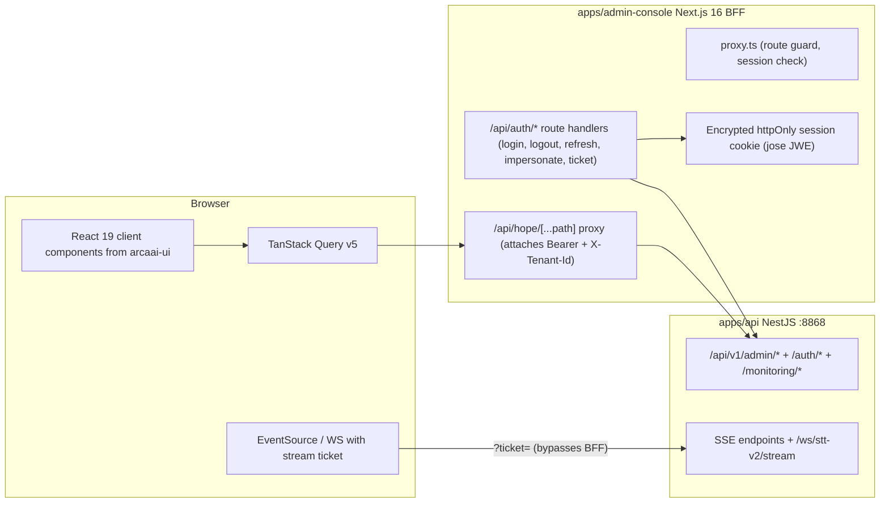

# TASK-415 — Hope Admin Console (Next.js)

- **Status**: In Progress (planning artifacts)
- **Type**: feature — new app (`apps/admin-console`) + capabilities documentation + frontend-rules modernization
- **Created**: 2026-07-04
- **Companion doc**: [capabilities-matrix.md](./capabilities-matrix.md) — the Global/Super-admin vs Tenant-admin capabilities matrix that drives design, routes, menus, and guards
- **Related rules**: `07-react-ui.mdc`, `10-skeleton-loading.mdc`, `11-ux-ui-principles.mdc`, `12-design-workflow.mdc`

## Requirement Analysis

Build a state-of-the-art Next.js Admin Console with two administration levels, each with dedicated routes and interfaces:

1. **Global/Super administrators** — see system status, all applications, current metrics and stats; manage tenants including all capabilities of a tenant.
2. **Tenant administrators** — manage their own tenant.

Required deliverables:

- A detailed **capabilities matrix** for both admin audiences, derived from the implemented business capabilities and best practices, prepared **before** UX-UI design, frontend development, and backend API integration.
- The app must follow the latest best practices and gold standard of Next.js, shadcn/ui and Tailwind CSS; all shared/customized components based on shadcn/Tailwind standards and aligned with the methodology in `packages/ui`.
- The **frontend monorepo rules** must be reviewed and updated; outdated rules removed and replaced with SOTA rules for developing, scaling and maintaining a Next.js app.
- Codebase structured per Next.js and monorepo standards, in the `apps/` folder.

## Current State Evaluation

- **Backend is ready — this is primarily a frontend program.** The API gateway (`apps/api`, port 8868, global prefix `/api/v1`) already exposes the full admin plane: tenants (CRUD + suspend/archive/restore + usage + tags + configs), users (bulk actions, roles, departments, export, reset-password, impersonation), RBAC roles/policies (CASL, break-glass step-up), API keys, storage (buckets/config/keys + object browser), entitlements & plans, rate limits, queues/schedulers, global settings (+ super-admin secret reveal), audit logs (+ CSV export), platform metrics (`/admin/platform/{metrics,sockets,consumption}`), monitoring/health (`/health/services`, `/monitoring/`*), harness admin suite, pipeline policy, prompts, DNA writing style, AI models, ASR pipelines, transcription-job admin, departments, consultations admin, and a dev-gated Prisma Studio BFF.
- **Auth**: homegrown JWT — bearer access token (~1h) + Redis-backed rotating refresh token (7d, family revocation); single-use stream tickets (`POST /auth/stream-ticket`) for SSE/WS; super-admin tenant elevation via `X-Tenant-Id` header; 404-over-403 cross-tenant posture; `If-Match`/ETag optimistic locking on admin PATCH routes. CORS already whitelists `admin.arcaai.com` and allows `Authorization` + `X-Tenant-Id`.
- **Roles**: `SUPER_ADMIN` / `GLOBAL_ADMIN` are the elevated cross-tenant set (`ELEVATED_ROLES` in `packages/applications/src/common/tenant-guards.ts`); `TENANT_ADMIN` is tenant-bound. Authorization is CASL policy-based (`PolicyEngine`), enforced by the global deny-by-default `UnifiedAuthGuard`; client menus/guards should mirror `action:Subject` pairs (via `POST /rbac/check/my-permissions`), not raw role strings.
- **Frontend estate**: `@arcaai/ui` provides 57 shadcn primitives (all `"use client"`) plus admin essentials — `sidebar`, `command`, `chart`, `VirtualizedDataGrid`, metrics components (`StatCard`, `MetricChart`, `ServiceStatusBar`, ...). Tailwind v4 is CSS-first; the single token source is `packages/ui/src/styles/globals.css` ("Calm Clinical Teal"). The package ships raw TSX via its `"./*"` export — a Next.js consumer must set `transpilePackages: ['@arcaai/ui']`.
- **No Next.js app exists yet**, but the repo is pre-wired: `turbo.json` build outputs include `.next/`**, `NEXT_PUBLIC_API_HOST` is in `globalEnv`, `packages/config-eslint/next.js` (eslintrc-style) and `packages/config-ts/nextjs.json` (outdated `target: es5`) exist.
- `apps/ui-playground` **is deprecated** (48 routes incl. a full `/admin/`* suite). It is the API-integration reference only; it forked its own design tokens — the new app must import the canonical tokens instead. Its sessionStorage token model is superseded by the BFF decision below.
- **Design governance**: rule `12-design-workflow.mdc` mandates design-first (Figma file `HOPE-Admin-Console`, approval before screen implementation) and the audience-tier taxonomy (00–09 foundations, 10–19 global-only, 20–29 shared, 30–49 tenant-scoped, 50–59 playground) that routes/menus/role-guards must mirror.
- **SOTA baseline (researched 2026-07)**: Next.js 16.2 (Turbopack default bundler, `proxy.ts` replaces `middleware.ts`, Cache Components/`use cache`, React 19.2); shadcn monorepo pattern (per-workspace `components.json`, Tailwind v4 `@source` scanning); enterprise feature-module structure with a thin `src/app` routing layer.

## Decisions

1. **Auth = server-side BFF.** Tokens never reach browser JS: login via Next.js route handler; access/refresh tokens sealed in an encrypted httpOnly session cookie (jose JWE); a catch-all route-handler proxy attaches `Authorization` + `X-Tenant-Id`; server-side refresh rotation. SSE/WS connect directly to the API using single-use stream tickets minted through the BFF. Rationale: gold-standard security for a healthcare admin surface (XSS token-exfiltration resistance) vs the deprecated playground's sessionStorage model.
2. **Playground tier (Figma 50–59) deferred** to a follow-up ticket. TASK-415 delivers admin tiers 10–49.
3. **App location/name**: `apps/admin-console`, package `@arcaai/admin-console`, dev port 5176, Next.js 16.2 / React 19.2 / TypeScript 5.9.
4. **"Store management"** in the rule-12 taxonomy is interpreted as **storage/bucket management** (matches the implemented `/admin/tenants/storage/`* backend; no retail-store capability exists in the platform).

## Architecture

Internal structure: `src/app` as a thin routing layer with route groups mirroring the Figma audience tiers; `src/features/<domain>` feature modules; `src/shared` cross-feature UI/hooks; `src/server` server-only session/proxy code (`server-only` enforced); `src/config` env validation.

## Implementation Plan

### Phase 0 — Ticket docs & capabilities matrix (in progress)

- This README (plan of record).
- [capabilities-matrix.md](./capabilities-matrix.md): capability → backend endpoints (verified against controllers) → Super/Global admin abilities → Tenant admin abilities → CASL guard → Figma tier → planned route → screens. Cross-checked against `docs/traceability-matrix.md` rows 1–36.
- **Gate**: user approves the matrix; it then drives Figma frames, routes, and menu/guard structure.

### Phase 1 — Frontend rules & shared-config modernization

- Rewrite the "App Patterns" section of `.cursor/rules/07-react-ui.mdc`; add `13-nextjs-apps.mdc` (Next.js 16 App Router SOTA: server components by default, `"use client"` at leaves, route groups per audience tier, `proxy.ts`, segment-scoped `loading.tsx`/`error.tsx`, Server Actions/route handlers, `server-only` boundaries, no secrets in `NEXT_PUBLIC_*`, feature-module structure, Turbopack). Mark the TanStack-Router/Vite pattern as legacy (deprecated playground only). Update `.cursor/rules/README.md`.
- `packages/config-ts/nextjs.json`: modernize (`target` ES2023, `moduleResolution: Bundler`, next plugin).
- `packages/config-eslint`: add a flat-config Next.js preset (ESLint 9) consumed only by the new app; legacy eslintrc files untouched.
- `packages/ui/package.json`: add source-token export `"./globals.css": "./src/styles/globals.css"`.
- **Verify**: existing packages' lint unchanged (`pnpm --filter @arcaai/ui lint` green); new configs load.

### Phase 2 — Design gate (rule 12, blocking for screens)

- Author Figma frames in `HOPE-Admin-Console` from the `globals.css` tokens: foundations 00–09, then tier frames for the screens in the capabilities matrix.
- Document the frame inventory here; **no screen implementation until frames are approved**. Phase 3 (non-screen infrastructure) proceeds in parallel.

### Phase 3 — App scaffold & foundation (`apps/admin-console`)

- Scaffold: `next.config.ts` (`transpilePackages: ['@arcaai/ui']`, `output: 'standalone'`), `@tailwindcss/postcss`, `src/app/globals.css` = `@import "tailwindcss"` + `@import "@arcaai/ui/globals.css"` + `@source "../../packages/ui/src"`, `components.json` (shadcn monorepo convention, aliases to `@arcaai/ui`), tsconfig extends `@arcaai/config-ts/nextjs.json`, flat ESLint config. Register root `dev:admin` script; add new env (`ADMIN_SESSION_SECRET`, server-side API URL) to `turbo.json#globalEnv`, `.env.dev`, `.env.example`.
- BFF (TDD): `src/server/session.ts` (jose-encrypted cookie, rotation), `/api/auth/{login,logout,refresh,impersonate,stream-ticket}` route handlers, `/api/hope/[...path]` proxy (forwards `Authorization`, `X-Tenant-Id`, `If-Match`/ETag passthrough), `proxy.ts` guard.
- RBAC layer: hydrate from `GET /auth/me` + `POST /rbac/check/my-permissions`; ability provider + `<RequirePermission>`; menu/tier visibility mirrors the matrix.
- App shell: shadcn `sidebar` grouped by tier, command palette, `next-themes` (class strategy), topbar tenant switcher (super-admin) with "Acting on: «Tenant»" banner + NoTenant empty states for tier 30–49, sonner toasts, skeletons per rule 10, error/404 pages.
- Data layer: typed fetch wrapper (`PaginatedResponse {data,count}`, error envelope, 404-over-403 awareness, `If-Match` on PATCH) + TanStack Query v5 provider.
- **Verify**: `pnpm --filter @arcaai/admin-console build lint test` green; login/logout/refresh round-trip against local API :8868.

### Phases 4–6 — Screens by tier (per screen: failing test → implement → verify, design-matched)

- **Phase 4, Global 10–19**: Platform dashboard (metrics/consumption/sockets), System status (health/services, monitoring, Redis), Tenants (list/detail/lifecycle/usage/entitlements/storage-config/frontend-config/create), Audit logs (filters + cursor + export), Rate limits, Queues & schedulers & jobs, Prisma Studio embed (dev-gated).
- **Phase 5, Shared 20–29**: Users (data grid, bulk actions, roles, departments, export, reset-password, impersonation entry/exit), Roles & Policies (CASL rule editor, break-glass), API keys (create/rotate/revoke, scopes, IP allowlist), Settings (global-setting editor, `If-Match`, secret reveal).
- **Phase 6, Tenant 30–49**: Departments (hierarchy + prompt config), Storage (bucket tree, object browser, access keys), Prompts/Agents (templates, versions, diff, test, department assignment, usage analytics), Transcription jobs, Audio pipelines, Harness console (policy incl. global default, workflows, live sessions, evals, audit chain, gate queue), DNA reports (dashboard + SSE job streams).

### Phase 7 — Hardening & deployment

- Playwright e2e smoke (login, tier gating, tenant switching, one CRUD per tier); WCAG 2.2 AA; both themes.
- `apps/admin-console/Dockerfile` (multi-stage, `next build` standalone, node:22-alpine, port 3000), `deployment/k3s/base/admin-console.yaml` + kustomization entry, `.gitlab/ci/build.yml` `build-admin-console` job, hope-deployments repo values, prod `CORS_ALLOWED_ORIGINS` note.
- Final Implementation Summary with evidence.

## Risks & Notes

- `@arcaai/ui` ships raw TSX via `"./*"` exports — `transpilePackages` mandatory; all primitives already carry `"use client"` and compose into server-component pages.
Solution: Improve all components, make sure thay are fit to NextJS based Admin Console
- ESLint estate is v8/eslintrc; the new flat preset is additive to avoid destabilizing 20+ packages (full migration = follow-up ticket).
Solution: Full migration first, create a follow-up ticket
- `docs/archive/TASK-371-Admin-Console-Redesign` (prior design exploration) is `.cursorignore`-blocked; consult manually during the design phase if needed.
Solution: Do not refer to `TASK-371`
- Taxonomy nuance: rule 12 places "Logs & Audit Logs" in tier 10–19, but `TENANT_ADMIN` is seeded with `audit-log-read` — the audit screen must work in both cross-tenant and tenant-scoped modes (record in matrix).
- TASK-415 numbering is out of sequence with existing tickets (411–413); used as specified by the user.

## Implementation Summary

*Pending — populated as phases complete with test/build/lint evidence.*

## Change History

| Date       | Change                                                                                                                                                                                                                                                                                                                                                                                                                                                                                                                                                                                                                                                                                                                                                                                                                                                                                                                                                                                                                                                                                                                                                                                                                                                                                                                                                                               |
| ---------- | ------------------------------------------------------------------------------------------------------------------------------------------------------------------------------------------------------------------------------------------------------------------------------------------------------------------------------------------------------------------------------------------------------------------------------------------------------------------------------------------------------------------------------------------------------------------------------------------------------------------------------------------------------------------------------------------------------------------------------------------------------------------------------------------------------------------------------------------------------------------------------------------------------------------------------------------------------------------------------------------------------------------------------------------------------------------------------------------------------------------------------------------------------------------------------------------------------------------------------------------------------------------------------------------------------------------------------------------------------------------------------------ |
| 2026-07-04 | Ticket created. Phase 2 exploration (4 parallel agents: capabilities, API surface, frontend estate, docs/deployment) and SOTA research completed. Plan approved by user; this README and the capabilities matrix drafted in parallel.                                                                                                                                                                                                                                                                                                                                                                                                                                                                                                                                                                                                                                                                                                                                                                                                                                                                                                                                                                                                                                                                                                                                                |
| 2026-07-04 | **Phase 0 complete**: [capabilities-matrix.md](./capabilities-matrix.md) authored — 33 capabilities (11 global tier 10–19, 10 shared 20–29, 12 tenant 30–49), all endpoints/guards verified against controllers; guard-vs-taxonomy discrepancies recorded (monitoring + audit logs tenant-readable, storage admin mixed posture, tenant frontend config shared-capable).                                                                                                                                                                                                                                                                                                                                                                                                                                                                                                                                                                                                                                                                                                                                                                                                                                                                                                                                                                                                             |
| 2026-07-04 | **Phase 1 complete** (2 parallel agents): `.cursor/rules/13-nextjs-apps.mdc` added (Next.js 16 SOTA standards) + `07-react-ui.mdc` App Patterns re-pointed to Next.js (TanStack Router demoted to legacy/playground-only) + rules README v6.1.0. `packages/config-ts/nextjs.json` modernized (ES2023, `moduleResolution: Bundler`, noEmit). New ESLint 9 flat preset `packages/config-eslint/next-flat.js` (typescript-eslint 8, @next/eslint-plugin-next 16, react-hooks, prettier-compat; smoke-linted; legacy `@arcaai/ui` lint canary exit 0). `@arcaai/ui` gained the `"./globals.css"` source-token export.                                                                                                                                                                                                                                                                                                                                                                                                                                                                                                                                                                                                                                                                                                                                                                    |
| 2026-07-04 | **Phase 3 complete** — `apps/admin-console` foundation (no feature screens; design gate honored). Next.js 16.2.10 / React 19.2.7, Turbopack. BFF auth: jose-encrypted httpOnly session (`hope_admin_session`), route handlers `api/auth/{login,logout,session,refresh,working-tenant,stream-ticket,impersonate,revoke-impersonation}`, catch-all `api/hope/[...path]` proxy (Bearer + `X-Tenant-Id` for elevated working tenant, `If-Match`/`ETag` passthrough, single-flight 401 refresh-retry; impersonated 401 restores original tokens). `src/proxy.ts` request guard (runtime-verified: 307 to `/login` for pages, 401 JSON for APIs). RBAC ability from `rbac/check/my-permissions` (`manage`/`all` superset semantics) + 30-route tier-mapped nav config (only `/dashboard` implemented, placeholder empty state). Shell: `@arcaai/ui` sidebar/header, next-themes, sonner, working-tenant switcher with "Acting on" badge. Notable deviations: `proxy.ts` must live in `src/` (Next picks it up from `src/` when a `src/` dir exists); tsconfig `@/`* fallback path array to resolve `@arcaai/ui` internal `@/` imports under Turbopack. Evidence: 41/41 Vitest tests, lint 0 warnings, `next build` clean (13 pages), `tsc --noEmit` clean. Root wiring: `dev:admin` script, `turbo.json#globalEnv` += `API_URL`/`ADMIN_SESSION_SECRET`, `.env.dev`/`.env.example` updated. |

