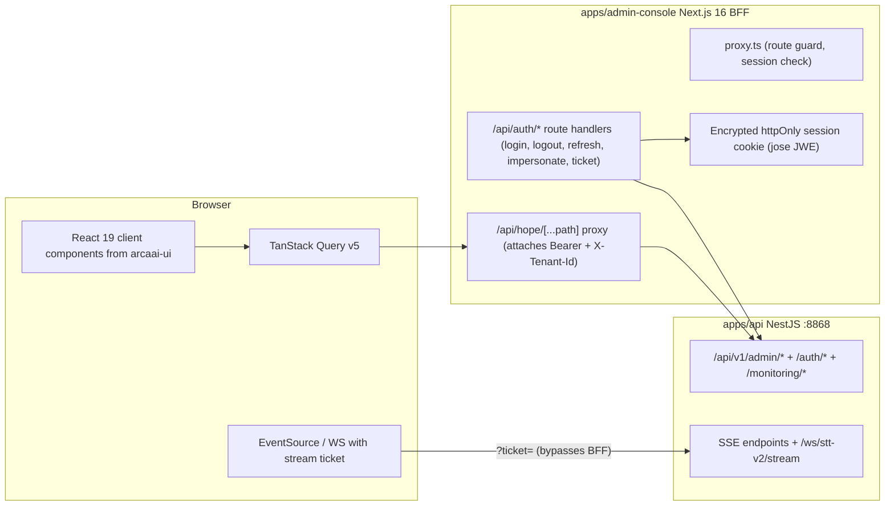

# TASK-415 — Hope Admin Console (Next.js)

- **Status**: In Progress (planning artifacts)
- **Type**: feature — new app (`apps/admin-console`) + capabilities documentation + frontend-rules modernization
- **Created**: 2026-07-04
- **Companion doc**: [capabilities-matrix.md](./capabilities-matrix.md) — the Global/Super-admin vs Tenant-admin capabilities matrix that drives design, routes, menus, and guards
- **Related rules**: `07-react-ui.mdc`, `10-skeleton-loading.mdc`, `11-ux-ui-principles.mdc`, `12-design-workflow.mdc`

## Requirement Analysis

Build a state-of-the-art Next.js Admin Console with two administration levels, each with dedicated routes and interfaces:

1. **Global/Super administrators** — see system status, all applications, current metrics and stats; manage tenants including all capabilities of a tenant.
2. **Tenant administrators** — manage their own tenant.

Required deliverables:

- A detailed **capabilities matrix** for both admin audiences, derived from the implemented business capabilities and best practices, prepared **before** UX-UI design, frontend development, and backend API integration.
- The app must follow the latest best practices and gold standard of Next.js, shadcn/ui and Tailwind CSS; all shared/customized components based on shadcn/Tailwind standards and aligned with the methodology in `packages/ui`.
- The **frontend monorepo rules** must be reviewed and updated; outdated rules removed and replaced with SOTA rules for developing, scaling and maintaining a Next.js app.
- Codebase structured per Next.js and monorepo standards, in the `apps/` folder.


## Current State Evaluation

- **Backend is ready — this is primarily a frontend program.** The API gateway (`apps/api`, port 8868, global prefix `/api/v1`) already exposes the full admin plane: tenants (CRUD + suspend/archive/restore + usage + tags + configs), users (bulk actions, roles, departments, export, reset-password, impersonation), RBAC roles/policies (CASL, break-glass step-up), API keys, storage (buckets/config/keys + object browser), entitlements & plans, rate limits, queues/schedulers, global settings (+ super-admin secret reveal), audit logs (+ CSV export), platform metrics (`/admin/platform/{metrics,sockets,consumption}`), monitoring/health (`/health/services`, `/monitoring/`*), harness admin suite, pipeline policy, prompts, DNA writing style, AI models, ASR pipelines, transcription-job admin, departments, consultations admin, and a dev-gated Prisma Studio BFF.
- **Auth**: homegrown JWT — bearer access token (~1h) + Redis-backed rotating refresh token (7d, family revocation); single-use stream tickets (`POST /auth/stream-ticket`) for SSE/WS; super-admin tenant elevation via `X-Tenant-Id` header; 404-over-403 cross-tenant posture; `If-Match`/ETag optimistic locking on admin PATCH routes. CORS already whitelists `admin.arcaai.com` and allows `Authorization` + `X-Tenant-Id`.
- **Roles**: `SUPER_ADMIN` / `GLOBAL_ADMIN` are the elevated cross-tenant set (`ELEVATED_ROLES` in `packages/applications/src/common/tenant-guards.ts`) — to be consolidated into `GLOBAL_ADMIN` per Decision 5 (TASK-417); `TENANT_ADMIN` is tenant-bound. Authorization is CASL policy-based (`PolicyEngine`), enforced by the global deny-by-default `UnifiedAuthGuard`; client menus/guards should mirror `action:Subject` pairs (via `POST /rbac/check/my-permissions`), not raw role strings.
- **Frontend estate**: `@arcaai/ui` provides 57 shadcn primitives (all `"use client"`) plus admin essentials — `sidebar`, `command`, `chart`, `VirtualizedDataGrid`, metrics components (`StatCard`, `MetricChart`, `ServiceStatusBar`, ...). Tailwind v4 is CSS-first; the single token source is `packages/ui/src/styles/globals.css` ("Calm Clinical Teal"). The package ships raw TSX via its `"./*"` export — a Next.js consumer must set `transpilePackages: ['@arcaai/ui']`.
- **No Next.js app exists yet**, but the repo is pre-wired: `turbo.json` build outputs include `.next/`**, `NEXT_PUBLIC_API_HOST` is in `globalEnv`, `packages/config-eslint/next.js` (eslintrc-style) and `packages/config-ts/nextjs.json` (outdated `target: es5`) exist.
- `apps/ui-playground` **is deprecated** (48 routes incl. a full `/admin/`* suite). It is the API-integration reference only; it forked its own design tokens — the new app must import the canonical tokens instead. Its sessionStorage token model is superseded by the BFF decision below.
- **Design governance**: rule `12-design-workflow.mdc` (rewritten 2026-07-04 per user direction) mandates the approved delivery process (batch design train with hard approval gates) and the Figma standards — naming grammar `<NN>[.<sub>][-<device>] - <Name>`, ranges 01–05 foundation standards / 06–09 shared components-layouts-shells / 10–49 screens by scope, grouped into Foundation, Global admins', Tenant admins' — which routes/menus/role-guards must mirror.
- **SOTA baseline (researched 2026-07)**: Next.js 16.2 (Turbopack default bundler, `proxy.ts` replaces `middleware.ts`, Cache Components/`use cache`, React 19.2); shadcn monorepo pattern (per-workspace `components.json`, Tailwind v4 `@source` scanning); enterprise feature-module structure with a thin `src/app` routing layer.


## Decisions

1. **Auth = server-side BFF.** Tokens never reach browser JS: login via Next.js route handler; access/refresh tokens sealed in an encrypted httpOnly session cookie (jose JWE); a catch-all route-handler proxy attaches `Authorization` + `X-Tenant-Id`; server-side refresh rotation. SSE/WS connect directly to the API using single-use stream tickets minted through the BFF. Rationale: gold-standard security for a healthcare admin surface (XSS token-exfiltration resistance) vs the deprecated playground's sessionStorage model.
2. **Playground tier (Figma 50–59) deferred** to a follow-up ticket. TASK-415 delivers admin tiers 10–49.
3. **App location/name**: `apps/admin-console`, package `@arcaai/admin-console`, dev port 5176, Next.js 16.2 / React 19.2 / TypeScript 5.9.
4. **"Store management"** in the rule-12 taxonomy is interpreted as **storage/bucket management** (matches the implemented `/admin/tenants/storage/`* backend; no retail-store capability exists in the platform).
5. **Role consolidation (review 2026-07-04)**: `SUPER_ADMIN` and `GLOBAL_ADMIN` merge into **`GLOBAL_ADMIN`** — the canonical elevated role; `SUPER_ADMIN` must not be used going forward. Platform-wide cleanup (seeds, guards, `ELEVATED_ROLES`, role assignments, docs/rules) is **TASK-417**; until it lands the console accepts both role strings as elevated but uses only `GLOBAL_ADMIN` in its own naming and copy.
6. **AI model registry is global-admin only (review 2026-07-04)**: moved from tier 30–49 to tier 10–19; the console gates `/ai-models` to `manage:all`. The backend guard re-pin (today tenant-scoped `manage:AiModel`) is tracked in TASK-419.
7. **Prisma Studio target (review 2026-07-04)**: available **in production behind a dedicated permission** (new CASL subject, e.g. `manage:PrismaStudio`). Backend is currently fail-closed dev-only; enablement + permission work tracked in TASK-419. The console ships the screen with a truthful enabled/disabled status card either way.
8. **`@arcaai/ui` fitness (review 2026-07-04)**: rather than treating raw-TSX shipping as a residual risk, Phases 4–6 include a per-screen component fitness pass — every consumed `@arcaai/ui` component is verified/improved for the Next.js console (client-boundary correctness, tokens, a11y) with fixes upstreamed to `packages/ui`, never forked.
9. **Follow-up tickets registered (review 2026-07-04)**: TASK-417 (GLOBAL_ADMIN role consolidation), TASK-418 (full ESLint 9 flat-config migration — prioritized before/alongside the screen phases), TASK-419 (admin API surface gaps: eval REST, notifications/resource-subscriptions/webhooks controllers, guardrail/NLP admin config, Prisma Studio production enablement, AiModel guard re-pin), TASK-420 (Playground tier 50–59). Backlog for later discussion (no ticket yet): knowledge/RAG gateway surface, federated learning.
10. **Delivery process & Figma standards (review 2026-07-04)**: the user-approved pipeline `Capabilities matrix → Figma designs → Approval → TDD implement + integrate → E2E tests → Closure` is operationalized as a **batch design train** (details in Phase 2 below and rule `12-design-workflow.mdc` §2): designs move in batches mirroring the Figma groups; a batch's designs must be **fully available** (all states, both themes) and user-approved before any of its screens are implemented; designers/developers/testers work in parallel one batch apart. Figma standards: naming grammar `<NN>[.<sub>][-<device>] - <Name>`; ranges 01–05 (foundation standards) / 06–09 (shared components, layouts, shells) / 10–49 (screens by scope); three groups (Foundation, Global admins', Tenant admins'); token-first (Figma variables generated from `globals.css`); WCAG 2.2 AA annotations required per frame before Ready-for-Dev.


## Architecture




Internal structure: `src/app` as a thin routing layer with route groups mirroring the Figma audience tiers; `src/features/<domain>` feature modules; `src/shared` cross-feature UI/hooks; `src/server` server-only session/proxy code (`server-only` enforced); `src/config` env validation.

## Implementation Plan


### Phase 0 — Ticket docs & capabilities matrix (in progress)

- This README (plan of record).
- [capabilities-matrix.md](./capabilities-matrix.md): capability → backend endpoints (verified against controllers) → Super/Global admin abilities → Tenant admin abilities → CASL guard → Figma tier → planned route → screens. Cross-checked against `docs/traceability-matrix.md` rows 1–36.
- **Gate**: user approves the matrix; it then drives Figma frames, routes, and menu/guard structure.


### Phase 1 — Frontend rules & shared-config modernization

- Rewrite the "App Patterns" section of `.cursor/rules/07-react-ui.mdc`; add `13-nextjs-apps.mdc` (Next.js 16 App Router SOTA: server components by default, `"use client"` at leaves, route groups per audience tier, `proxy.ts`, segment-scoped `loading.tsx`/`error.tsx`, Server Actions/route handlers, `server-only` boundaries, no secrets in `NEXT_PUBLIC_*`, feature-module structure, Turbopack). Mark the TanStack-Router/Vite pattern as legacy (deprecated playground only). Update `.cursor/rules/README.md`.
- `packages/config-ts/nextjs.json`: modernize (`target` ES2023, `moduleResolution: Bundler`, next plugin).
- `packages/config-eslint`: add a flat-config Next.js preset (ESLint 9) consumed only by the new app; legacy eslintrc files untouched.
- `packages/ui/package.json`: add source-token export `"./globals.css": "./src/styles/globals.css"`.
- **Verify**: existing packages' lint unchanged (`pnpm --filter @arcaai/ui lint` green); new configs load.


### Phase 2 — Design train & approval gates (rule 12 §2, blocking for screens)

The approved process, run as a pipeline of three design batches mirroring the Figma groups:

```
B0 Foundation (01–09) → approve → B1 Global admins' (10–29) → approve → B2 Tenant admins' (30–49) → approve
```

- **Batch content**: every screen frame fully available = default + loading-skeleton + empty + error states, light AND dark themes, desktop mandatory (tablet/mobile where the screen brief demands), a11y annotations (WCAG 2.2 AA), token-pure (Figma variables generated from `packages/ui` `globals.css`), Dev Mode "Ready for Dev" after approval.
- **Parallelism (design train)**: while batch N is being TDD-built (Phase 4/5/6), the designer produces batch N+1 and build-reviews landed batch-N screens; the tester writes Playwright E2E + axe plans for batch N from its approved frames and design-QAs the deployed batch N−1. Non-visual engineering (BFF, data layer, hooks — Phase 3, done) was never design-gated.
- **Hard gate per batch**: the user approves the full batch in Figma before any of its screens are implemented; each approval is recorded here (frame inventory + date). Phases 4–5 (screens 10–29) unlock on B1 approval; Phase 6 (screens 30–49) unlocks on B2 approval.
- Frame inventory and naming: capabilities-matrix section 3 (grammar `<NN>[.<sub>][-<device>] - <Name>`, groups Foundation / Global admins' / Tenant admins').

#### Phase 2 — Frame Inventory (awaiting approval)

Authored 2026-07-05 in the Figma file `HOPE-Admin-Console` via the `user-figma-bridge` MCP. Three top-level container frames act as the groups (the bridge cannot create true Figma Sections): `Foundation`, `Global admins'`, `Tenant admins'` (B2 placeholder note only — not designed). Screenshot evidence (1×, PNG) for every frame: [figma-evidence/](./figma-evidence/).

**Bridge constraints & fidelity approach** — the MCP bridge exposes low-level node ops only (no Figma components, styles, or variables can be created). Token fidelity is therefore by construction: every fill/stroke hex was transcribed from `packages/ui/src/styles/globals.css` (light + dark blocks), token names are annotated in frame 01 and in per-frame notes; spacing is 8-pt throughout; screens were built by duplicating the 07 App Shell / archetype screens so chrome stays pixel-identical. Auto-layout was applied where the bridge supported it; decorative/annotation layers are absolutely positioned.

**Batch B0 — Foundation (01–09), complete:**

| Frame | Content notes |
| --- | --- |
| `01 - Color Palette & Tokens` | Semantic token swatches (background/foreground/card/primary/secondary/muted/accent/destructive/success/warning/border/input/ring/chart-1..5/sidebar-*), light AND dark columns, hex + token name per swatch, contrast-pair verification rows (AA pass annotations) |
| `02 - Typography & Iconography` | Inter type scale (12→30px, weights), heading hierarchy h1–h4, JetBrains Mono usage (IDs, code, log lines), lucide-react icon examples with 16/20/24 sizing rules |
| `03 - Spacing, Radius & Elevation` | 8-pt grid demo strip, spacing scale (4/8/12/16/24/32/48/64), radius scale (sm→xl per `--radius`), border tokens, shadow/elevation levels (card, popover, dialog) |
| `04 - Accessibility Standards` | Focus-ring spec (2px `--ring`, 2px offset), landmark map (banner/nav/main/complementary), 44px touch-target demo, reduced-motion note, color-independence examples (status = dot shape + label, never color alone) — WCAG 2.2 AA |
| `05 - Interaction & Feedback States` | Button/input hover-active-disabled-loading rows, toast (sonner) success/error, destructive confirm dialog pattern (type-to-confirm), skeleton rules per rule 10 (animate-pulse, mirrors loaded layout, no spinners for layout) |
| `06 - Core Components` | @arcaai/ui primitives replicated 1:1: Button variants, Input/Select, Badge set (status colors), Dialog, Table/VirtualizedDataGrid shell, Tabs, chart shells (StatCard, MetricChart, ServiceStatusBar) |
| `07 - App Shell & Navigation` | 1440×900 shell: sidebar grouped by tier (PLATFORM 10–19 / ADMINISTRATION 20–29 / TENANT 30–49 + "needs working tenant" note), topbar (sidebar trigger, breadcrumb, ⌘K hint, working-tenant switcher, theme toggle, avatar), "Acting on: «Tenant»" banner spec — mirrors `apps/admin-console/src/shared` |
| `08 - Layouts & Data Patterns` | Page layout regions, form pattern with If-Match/ETag save flow + 412 Precondition Failed / 428 Precondition Required error states, filter bar anatomy, cursor pagination, detail-tabs pattern |
| `09 - Screen Templates` | List/data-grid template, detail template, dashboard template, empty/error/NoTenant/404 state cards, login shell (BFF session note) |

**Batch B1 — Global admins' (10–25), complete (light; dark variants for 10 + 12):**

Every screen: 1440×940, real shell chrome (tier-grouped sidebar with correct active item, topbar with breadcrumb), default state fully populated with representative data, plus a STATE VARIANTS strip (loading-skeleton per rule 10 / empty / error with trace_id + retry) and a matrix-traceability footnote (guard, endpoints, interactions).

| Frame | Content notes |
| --- | --- |
| `10 - Platform Dashboard` | 4 StatCards (tenants, users, active sockets, monthly consumption), MetricChart (7-day consumption area), ServiceStatusBar (7 services), recent-activity feed; matrix: `GET /admin/platform/{metrics,sockets,consumption}` |
| `11 - Monitoring` | Health summary cards, per-service status bar (api/stt-v2/smr/guardrail/nlp/harness + Redis/PG/MinIO/Qdrant), alerts list, queue-depth note; `GET /health/services`, `/monitoring/*` |
| `12 - Tenants List` | Filter bar (search, Status, Plan, Sort), VirtualizedDataGrid (Name/ID/Plan/Users/Status/Storage/Updated/⋯) 7 rows, row-menu note (Suspend/Reactivate/Delete w/ confirm), cursor pagination, `+ New tenant` |
| `12.1 - Tenant Detail` | Header (name, tnt id, Active badge, Suspend/Archive), tab bar **Overview · Entitlements · Storage · Frontend config · Tags · Danger zone**, overview form w/ If-Match note, usage stat row |
| `13 - Entitlements & Plans` | Plans grid (Starter/Pro/Enterprise), per-tenant entitlement override table, effective-entitlements resolve note |
| `14 - Tenant Storage Administration` | Storage config per tenant (bucket, quota, usage bar), access-keys table w/ reveal-once pattern, mixed-posture guard note |
| `15 - AI Model Registry` | Global-admin-only banner (Decision 6), model table (provider/model/capability/status/default), enable-disable + default-per-capability actions |
| `16 - Rate Limits` | Limit rules table (scope/route-class/limit/window/burst), per-tenant override panel, 429 behavior note |
| `17 - Queues & Jobs` | Queue cards (depth/consumers/oldest), jobs grid (id/queue/state/attempts/updated), retry/cancel actions, DLQ note |
| `17.1 - Schedulers` | Scheduler table (name/cron/next run/last result/enabled), run-now + toggle actions, cron helper note |
| `18 - Audit Logs` | Filter bar (actor, action, subject, date range), log grid with mono trace_id, cursor pagination, CSV export button; tenant-scoped mode note (matrix row 10) |
| `19 - Prisma Studio` | Status-truthful enabled/disabled card (Decision 7), embedded-studio placeholder region, production-permission note (`manage:PrismaStudio`, TASK-419) |
| `20 - Users` | Filter bar (search, role, status, tenant), data grid (Name/Email/Role/Tenant/Status/Last seen), bulk-action bar note, export + invite |
| `20.1 - User Detail` | Profile form (If-Match), roles + departments assignment, reset-password + impersonation entry (confirm dialog note), danger zone |
| `21 - RBAC Roles` | Roles table (name/subjects/members/updated), role-editor panel sketch (action:Subject pairs), break-glass step-up note |
| `22 - RBAC Policies` | CASL policy table (action/subject/conditions/effect), policy JSON editor note, validate + simulate actions |
| `23 - API Keys` | Keys table (label/prefix/scopes/IP allowlist/last used/status), create → reveal-once, rotate/revoke confirm pattern |
| `24 - Settings & Secrets` | Global settings form (If-Match/ETag), secrets list with masked values + step-up reveal (audit note), 412/428 error strip |
| `25 - Tenant Profile & Account` | Self-service profile/account form, session list, working-tenant context card |
| `10 - Platform Dashboard (Dark)` | Full dark-token remap of frame 10 (`.dark` block hexes) |
| `12 - Tenants List (Dark)` | Full dark-token remap of frame 12 |

**Deviations from the frame map**: none in numbering/naming. Groups are container frames, not native Sections (bridge limitation). Loading/empty/error states are rendered as a compact in-frame STATE VARIANTS strip rather than separate sub-frames (keeps one frame per screen per the naming grammar; content area only — shell chrome persists across states, as annotated). Dark coverage = dashboard + tenants list per the batch brief; full dark coverage follows user feedback.

**Awaiting**: user approval of B0 + B1 (gate for Phases 4–5 screen implementation), then B2 (Tenant admins' 30–40) may start.


### Phase 3 — App scaffold & foundation (`apps/admin-console`)

- Scaffold: `next.config.ts` (`transpilePackages: ['@arcaai/ui']`, `output: 'standalone'`), `@tailwindcss/postcss`, `src/app/globals.css` = `@import "tailwindcss"` + `@import "@arcaai/ui/globals.css"` + `@source "../../packages/ui/src"`, `components.json` (shadcn monorepo convention, aliases to `@arcaai/ui`), tsconfig extends `@arcaai/config-ts/nextjs.json`, flat ESLint config. Register root `dev:admin` script; add new env (`ADMIN_SESSION_SECRET`, server-side API URL) to `turbo.json#globalEnv`, `.env.dev`, `.env.example`.
- BFF (TDD): `src/server/session.ts` (jose-encrypted cookie, rotation), `/api/auth/{login,logout,refresh,impersonate,stream-ticket}` route handlers, `/api/hope/[...path]` proxy (forwards `Authorization`, `X-Tenant-Id`, `If-Match`/ETag passthrough), `proxy.ts` guard.
- RBAC layer: hydrate from `GET /auth/me` + `POST /rbac/check/my-permissions`; ability provider + `<RequirePermission>`; menu/tier visibility mirrors the matrix.
- App shell: shadcn `sidebar` grouped by tier, command palette, `next-themes` (class strategy), topbar tenant switcher (super-admin) with "Acting on: «Tenant»" banner + NoTenant empty states for tier 30–49, sonner toasts, skeletons per rule 10, error/404 pages.
- Data layer: typed fetch wrapper (`PaginatedResponse {data,count}`, error envelope, 404-over-403 awareness, `If-Match` on PATCH) + TanStack Query v5 provider.
- **Verify**: `pnpm --filter @arcaai/admin-console build lint test` green; login/logout/refresh round-trip against local API :8868.


### Phases 4–6 — Screens by tier (per screen: failing test → implement → verify, design-matched)

Every screen build includes the **`@arcaai/ui` fitness pass** (Decision 8): verify/improve each consumed component for the Next.js console and upstream fixes to `packages/ui`.

- **Phase 4, Global 10–19**: Platform dashboard (metrics/consumption/sockets), System status (health/services, monitoring, Redis), Tenants (list/detail/lifecycle/usage/entitlements/storage-config/create, frontend-config tab), AI model registry (global-admin only, Decision 6), Audit logs (filters + cursor + export), Rate limits, Queues & schedulers & jobs, Prisma Studio embed (status-truthful; production enablement per Decision 7 / TASK-419).
- **Phase 5, Shared 20–29**: Users (data grid, bulk actions, roles, departments, export, reset-password, impersonation entry/exit), Roles & Policies (CASL rule editor, break-glass), API keys (create/rotate/revoke, scopes, IP allowlist), Settings (global-setting editor, `If-Match`, secret reveal).
- **Data-layer prep (done 2026-07-05, not design-gated)**: the full typed API layer for tiers 10–29 is pre-built under `src/features/<domain>/api/` (15 domains: platform, monitoring, tenants, entitlements, storage, ai-models, rate-limits, queues, audit-logs, pstudio, users, rbac, api-keys, settings, account) — typed clients + TanStack Query v5 hooks + query-key factories on a shared `src/shared/api` core (envelope parsing, `GatewayError` 401/404/412/428 semantics, ETag→`expectedVersion` OCC plumbing, FormData upload, Blob export). Screens only add components on top.
- **Phase 6, Tenant 30–49**: Departments (hierarchy + prompt config), Storage (bucket tree, object browser, access keys), Prompts/Agents (templates, versions, diff, test, department assignment, usage analytics), Transcription jobs, Audio pipelines, Harness console (policy incl. global default, workflows, live sessions, evals, audit chain, gate queue), DNA reports (dashboard + SSE job streams).


### Phase 7 — Hardening & deployment

- Playwright e2e smoke (login, tier gating, tenant switching, one CRUD per tier); WCAG 2.2 AA; both themes.
  - ✅ *2026-07-05*: harness landed — `apps/admin-console/playwright.config.ts` + `tests/e2e/` (auth smoke: gate redirect, 401 JSON, login render, failed login, login→dashboard, logout; axe scan of `/login`, 0 WCAG 2.2 AA violations, light + dark). Specs probe the stack and skip with instructions when app/API are down. Run: `pnpm --filter @arcaai/admin-console test:e2e`. Tier-gating/tenant-switching/CRUD specs follow the screens (design gate).
- `apps/admin-console/Dockerfile` (multi-stage, `next build` standalone, node:22-alpine, port 3000), `deployment/k3s/base/admin-console.yaml` + kustomization entry, `.gitlab/ci/build.yml` `build-admin-console` job, hope-deployments repo values, prod `CORS_ALLOWED_ORIGINS` note.
  - ✅ *2026-07-05*: Dockerfile (multi-stage, standalone output, non-root, healthcheck), k3s base manifest (Deployment + Service `nodePort 30081` + Ingress `admin.hope.local`) registered in base kustomization + dev/prod overlays (dev host `admin-dev.hope.local`) + registry component rewrite; `NEXT_PUBLIC_API_HOST` added to `hope-config`; `ADMIN_SESSION_SECRET` added to both `secrets.*.yaml.example`; `build-admin-console` CI job. Outstanding: hope-deployments repo values, prod `CORS_ALLOWED_ORIGINS` for the console origin (browser-direct SSE/WS only — proxied REST needs none), and the client-bundle caveat that `NEXT_PUBLIC_API_HOST` is inlined at `docker build` time (CI must pass the real `--build-arg`).
- Final Implementation Summary with evidence.


## Risks & Notes (resolutions from the 2026-07-04 review)

- `@arcaai/ui` ships raw TSX via `"./*"` exports — `transpilePackages` mandatory. **Resolved**: per-screen component fitness pass in Phases 4–6 (Decision 8) verifies/improves every consumed component for the Next.js console, upstreaming fixes to `packages/ui`.
- ESLint estate is v8/eslintrc; the new flat preset is additive for now. **Resolved**: full flat-config migration is **TASK-418**, prioritized to run before/alongside the screen phases so the console never accumulates legacy lint debt.
- Prior archived design explorations will NOT be referenced; the design phase proceeds solely from the `packages/ui` `globals.css` tokens and the capabilities matrix.
- Taxonomy nuance: rule 12 places "Logs & Audit Logs" in tier 10–19, but `TENANT_ADMIN` is seeded with `audit-log-read` — the audit screen must work in both cross-tenant and tenant-scoped modes (recorded in matrix row 10).
- Ticket numbering: originally opened as TASK-315 (collided with the archived rate-limiting ticket); **renamed to TASK-415 by the user**. All repo references updated — the remaining `TASK-315` mentions in `apps/api` (throttling) and `.env.test` belong to the original, unrelated TASK-315 and are intentionally untouched.


## Implementation Summary

*Pending — populated as phases complete with test/build/lint evidence.*

## Change History


| Date       | Change                                                                                                                                                                                                                                                                                                                                                                                                                                                                                                                                                                                                                                                                                                                                                                                                                                                                                                                                                                                                                                                                                                                                                                                                                                                                                                                                                                               |
| ---------- | ------------------------------------------------------------------------------------------------------------------------------------------------------------------------------------------------------------------------------------------------------------------------------------------------------------------------------------------------------------------------------------------------------------------------------------------------------------------------------------------------------------------------------------------------------------------------------------------------------------------------------------------------------------------------------------------------------------------------------------------------------------------------------------------------------------------------------------------------------------------------------------------------------------------------------------------------------------------------------------------------------------------------------------------------------------------------------------------------------------------------------------------------------------------------------------------------------------------------------------------------------------------------------------------------------------------------------------------------------------------------------------ |
| 2026-07-04 | Ticket created. Phase 2 exploration (4 parallel agents: capabilities, API surface, frontend estate, docs/deployment) and SOTA research completed. Plan approved by user; this README and the capabilities matrix drafted in parallel.                                                                                                                                                                                                                                                                                                                                                                                                                                                                                                                                                                                                                                                                                                                                                                                                                                                                                                                                                                                                                                                                                                                                                |
| 2026-07-04 | **Phase 0 complete**: [capabilities-matrix.md](./capabilities-matrix.md) authored — 33 capabilities (11 global tier 10–19, 10 shared 20–29, 12 tenant 30–49), all endpoints/guards verified against controllers; guard-vs-taxonomy discrepancies recorded (monitoring + audit logs tenant-readable, storage admin mixed posture, tenant frontend config shared-capable).                                                                                                                                                                                                                                                                                                                                                                                                                                                                                                                                                                                                                                                                                                                                                                                                                                                                                                                                                                                                             |
| 2026-07-04 | **Phase 1 complete** (2 parallel agents): `.cursor/rules/13-nextjs-apps.mdc` added (Next.js 16 SOTA standards) + `07-react-ui.mdc` App Patterns re-pointed to Next.js (TanStack Router demoted to legacy/playground-only) + rules README v6.1.0. `packages/config-ts/nextjs.json` modernized (ES2023, `moduleResolution: Bundler`, noEmit). New ESLint 9 flat preset `packages/config-eslint/next-flat.js` (typescript-eslint 8, @next/eslint-plugin-next 16, react-hooks, prettier-compat; smoke-linted; legacy `@arcaai/ui` lint canary exit 0). `@arcaai/ui` gained the `"./globals.css"` source-token export.                                                                                                                                                                                                                                                                                                                                                                                                                                                                                                                                                                                                                                                                                                                                                                    |
| 2026-07-04 | **Phase 3 complete** — `apps/admin-console` foundation (no feature screens; design gate honored). Next.js 16.2.10 / React 19.2.7, Turbopack. BFF auth: jose-encrypted httpOnly session (`hope_admin_session`), route handlers `api/auth/{login,logout,session,refresh,working-tenant,stream-ticket,impersonate,revoke-impersonation}`, catch-all `api/hope/[...path]` proxy (Bearer + `X-Tenant-Id` for elevated working tenant, `If-Match`/`ETag` passthrough, single-flight 401 refresh-retry; impersonated 401 restores original tokens). `src/proxy.ts` request guard (runtime-verified: 307 to `/login` for pages, 401 JSON for APIs). RBAC ability from `rbac/check/my-permissions` (`manage`/`all` superset semantics) + 30-route tier-mapped nav config (only `/dashboard` implemented, placeholder empty state). Shell: `@arcaai/ui` sidebar/header, next-themes, sonner, working-tenant switcher with "Acting on" badge. Notable deviations: `proxy.ts` must live in `src/` (Next picks it up from `src/` when a `src/` dir exists); tsconfig `@/`* fallback path array to resolve `@arcaai/ui` internal `@/` imports under Turbopack. Evidence: 41/41 Vitest tests, lint 0 warnings, `next build` clean (13 pages), `tsc --noEmit` clean. Root wiring: `dev:admin` script, `turbo.json#globalEnv` += `API_URL`/`ADMIN_SESSION_SECRET`, `.env.dev`/`.env.example` updated. |
| 2026-07-04 | **User review applied** (ticket renamed TASK-315 → TASK-415 by the user; stale references updated in `apps/admin-console/README.md`, rules `07`/`13`, rules README, `config-eslint/next-flat.js`). Decisions 5–9 recorded: `GLOBAL_ADMIN` is the canonical elevated role (`SUPER_ADMIN` merged; platform cleanup = TASK-417); AI model registry moved to tier 10–19 global-admin-only (matrix renumbered, frames 10–40; tenant frontend config folded into the tenant-detail tab to fit the 10-slot frame budget); Prisma Studio targeted for production behind a dedicated permission; `@arcaai/ui` per-screen fitness pass added to Phases 4–6; matrix gaps resolved into TASK-419 (admin API surface gaps) + TASK-420 (Playground) + backlog (knowledge/RAG, FedL); TASK-418 (ESLint flat migration) prioritized. Console code updated: `/ai-models` nav entry re-tiered to 10–19 gated on `manage:all`, standalone frontend-config entry removed (29 routes), `GLOBAL_ADMIN`-canonical comments in `ability.ts`/`session.ts`. Follow-up ticket stubs created: TASK-417, TASK-418, TASK-419, TASK-420. |
| 2026-07-05 | **Dependency refresh** (user-directed). `next` moved to the `preview` dist-tag (`^16.3.0-preview.5`, graduates to 16.3 stable, never matches canaries) to unlock the ≥16.3 skills floor; app-local dev-tooling majors bumped: TypeScript 6.0.3 (tsconfig: `baseUrl` removed per TS 6 deprecation, `types: ["node"]` added for the new empty-array default), ESLint 10.6.0, `@types/node` 26. `@vitejs/plugin-react` intentionally held at 5.x (v6 peer-requires Vite 8; vitest 4.1.9 resolves Vite 7 here). Shared `next-flat.js` preset: `eslint-plugin-react` wrapped with `@eslint/compat` `fixupPluginRules` (plugin still calls the removed `context.getFilename()`; harmless on ESLint 9 consumers). All other deps verified already-latest. Lockfile importer diff confined to `apps/admin-console` + the additive `@eslint/compat` in `config-eslint`; legacy `@arcaai/ui` eslintrc lint canary still exit 0. Evidence: `tsc --noEmit` clean, lint 0 warnings, 42/42 Vitest, `next build` clean (13 pages, Turbopack 16.3.0-preview.5). |
| 2026-07-05 | **Phases 4–5 non-visual prep + Phase 7 partial** (engineering track; design gate untouched — zero screen/page/UI changes). (1) **Typed data layer, tiers 10–29**: shared client core `src/shared/api/` (BFF-proxied `request()` with `{data,count}` + cursor envelopes, `GatewayError` with 401/404-over-403/412/428 semantics, ETag capture + `versionFromEtag()` → `If-Match` **and** body `expectedVersion` OCC plumbing, FormData multipart passthrough, `getBlob()` for export streams) + 15 feature domains under `src/features/<domain>/api/` (`platform`, `monitoring`, `tenants` incl. configs + frontend-config, `entitlements`, `storage` buckets/config/keys, `ai-models`, `rate-limits`, `queues` + jobs + schedulers, `audit-logs` incl. cursor + export, `pstudio`, `users` incl. departments/settings/profile/reset-password + BFF-routed impersonation, `rbac` roles/policies/validate + break-glass, `api-keys` incl. rotate/revoke/scopes/usage, `settings` incl. step-up reveal, `account` self-service me-surfaces), each `types/keys/client/hooks/index` with TanStack Query v5 hooks; gateway envelope deviations encoded per the DTO audit (ai-models `{data,total,totalPages}`, jobs `{items,total}`, RBAC `{data,total,page,pageSize}`). (2) **E2E + a11y harness**: Playwright 1.61 + `@axe-core/playwright` (single batched install), config + `tests/e2e/` smoke + login axe gate (0 violations, both themes), environment-probing skips, `test:e2e` script. (3) **Deployment scaffolding**: Dockerfile, k3s base + overlays + registry entries, configmap/secrets examples, `build-admin-console` CI job. **Evidence**: Vitest 123/123 (23 files), lint 0 warnings, `tsc --noEmit` clean, `next build` clean; live E2E 8/8 against local API :8868 + dev server (seeded `super_admin`), then servers stopped; `docker build` green with container smoke (200 `/login`, 307 gate, 401 API, non-root uid 1001); `kubectl kustomize` dev + prod both green. |
| 2026-07-05 | **Phase 2 design batches B0 + B1 authored in Figma** (`HOPE-Admin-Console`, via `user-figma-bridge` MCP; awaiting approval). Foundation 01–09 + Global admins' 10–25 (incl. 12.1, 17.1, 20.1) + dark variants of 10 and 12 — 30 frames total under container-frame groups `Foundation` / `Global admins'` / `Tenant admins'` (B2 placeholder, not designed). Token-pure by construction (all hexes transcribed from `packages/ui` `globals.css` light+dark; bridge cannot create Figma variables/components — recorded as a deviation), 8-pt spacing, screens duplicated from the 07 shell archetype for chrome consistency; every screen ships default + loading/empty/error STATE VARIANTS strip + matrix-traceability footnote (guard, endpoints). Screenshot evidence: `figma-evidence/` (30 PNGs). Full inventory: "Phase 2 — Frame Inventory (awaiting approval)" under Phase 2. Gate: B0+B1 user approval unlocks Phases 4–5; B2 (30–40) not started. |
| 2026-07-04 | **Pre-Phase-2 process review applied** (Decision 10). Researched 2026 SOTA (dual-track/design-ahead pipelines; token-first Figma↔code sync; Dev Mode "Ready for Dev" + Figma MCP; three-checkpoint drift control) and operationalized the user's pipeline as a batch design train with per-batch hard approval gates. Rule `12-design-workflow.mdc` rewritten: delivery process (§2), Figma naming grammar `<NN>[.<sub>][-<device>] - <Name>`, ranges 01–05/06–09/10–49 + reserved 50–59, three groups (Foundation, Global admins', Tenant admins'), canvas/auto-layout/component rules, designed-in accessibility (§4). Rule `11-ux-ui-principles.mdc` gained §11 Accessibility checklist (axe scan 0 violations in the per-screen DoD). Matrix section 3 restructured to the new convention with a concrete Foundation frame inventory (01–09). Screen numbers 10–40 unchanged — `nav-config.ts` and route tiers unaffected. |


