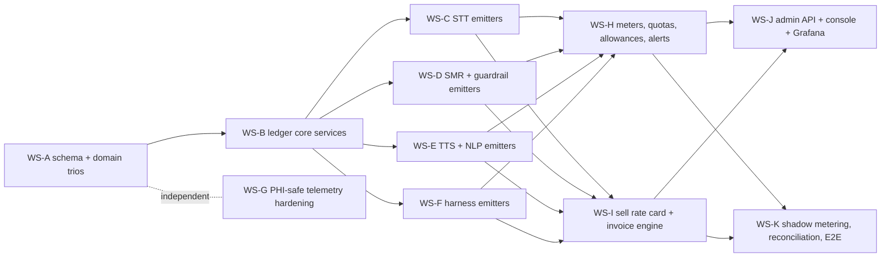

# TASK-615 — AI Usage Metering, Consumption Monitoring & Tenant Billing

| | |
|---|---|
| **Status** | Review — all 11 workstreams (Waves 0–3) merged; **Wave 4 (2026-08-08) closed the §7 engineering tail #4–#13** (schema custodian pass, 402 spend-limit, G16, dual-mic channelCount, STT reaper push-back, Grafana datasource, cross-tenant e2e). Remaining: owner commercial/credential decisions (#1–#3, #14) + design-gated console screens (#15). |
| **Type** | feature (cross-cutting: database → domains → applications → api → python services → admin console → infra) |
| **Created** | 2026-08-06 |
| **Branch** | dev-2.1 |
| **Supersedes** | **TASK-601** (Consumption Tracking & Monitoring). All TASK-601 research, findings, and design decisions are carried forward here and extended with the tenant **billing plane** (sell-side rate card, fixed plan + on-demand invoice computation), a full 2026-08-06 re-verification of the current state, and a workstream plan structured for a team of agents executing in parallel. TASK-601 is closed as superseded; do not implement from its README. |
| **Companion docs** | [current-state-review.md](./current-state-review.md) (codebase map, re-verified 2026-08-06) · [research-findings.md](./research-findings.md) (external research incl. §13 billing/pricing track) |

---

## 1. Requirement Analysis

Establish best-practice **usage metering, consumption monitoring, and tenant billing** for
the scribe platform's AI capabilities, per tenant and per capability:

1. **Speech-to-text** — ASR (self-hosted whisper.cpp pipelines + cloud/BYOK fallback,
   streaming and batch) plus secondary capabilities (noise reduction, VAD, diarization,
   embeddings). Metric decision: duration vs alternatives.
2. **Text generation** — SMR summarization, guardrail validation, harness agentic loops;
   built-in self-hosted providers (LM Studio, Ollama, llama.cpp) and third-party providers
   (Azure OpenAI, Bedrock, Anthropic, Vertex, +BYOK). Metric decision: tokens vs
   alternatives.
3. **Text-to-speech** — self-hosted (Kokoro, Indic Parler) and third-party (Azure Speech).
   Metric decision: duration vs characters vs alternatives.
4. **NLP / embeddings** — medical NER, classification, retrieval embeddings.
5. **Billing** — computation of each tenant's final billing amount under (a) a fixed plan
   with included allowances and (b) on-demand usage pricing above the allowances,
   including proration, caps/alerts, BYOK treatment, and an auditable invoice lifecycle.

Additional delivery requirement: the implementation plan must be decomposed into
**independent, file-disjoint workstreams executable by a team of agents in parallel**, with
explicit dependencies, interface freezes, and merge order.

---

## 2. Current State Evaluation (verified 2026-08-06)

Full detail with file:line evidence in [current-state-review.md](./current-state-review.md)
(§1–3 from the 2026-08-02 sweeps; §4 re-verification of 2026-08-06 — **all 16 gaps remain
open; TASK-601 produced no code**).

**Exists and is sound:** the entitlements/quota skeleton (`PlanEntitlement` /
`TenantEntitlement` / `TenantUsageMeter`, 3 business meters, 5 create-time caps, Redis
streaming-concurrency cap, storage soft-warn, admin API, reconcile cron) — all behind
`entitlements.enabled` (OFF by default); `SummaryMeta` per-summary token capture; complete
SMR provider-adapter usage propagation incl. streaming trailing chunks; append-only ledger
precedents (`AgentTrajectoryStep`, `DnaUsageRecord`); correct Prometheus discipline (no
tenant labels).

**Headline gaps (G1–G16, register in the companion doc):** no cost model, no per-request
usage ledger, no tenant × provider × model rollup; SMR streaming bypasses the generation
audit (and the audit event lacks `tenant_id`); guardrail computes token stats then discards
them; TTS records no characters or synthesis duration; NLP entity counting is dead code;
STT batch duration is encrypted into an unqueryable blob; enforcement + reconcile ship OFF.

**Sharpened 2026-08-06:** the ONE live meter (`TRANSCRIPTION_MINUTES` via
`AudioRecording.duration`) is fed only by the opt-in streaming `dual_capture` path
(default off) and **batch STT contributes zero** — flipping enforcement on today would
enforce against structurally wrong numbers. The only pricing artifacts anywhere are an
internal `$/1k tokens` map in the agent-trajectory admin rollup and an unwired mock billing
UI kit in `packages/ui`. **No billing/invoice/subscription/price implementation exists.**

---

## 3. Research Synthesis — units and norms per capability

Full citations in [research-findings.md](./research-findings.md) (§1–12 metering/telemetry,
§13 billing/pricing). The decisions that fall out:

| Capability | Record (ledger units) | Bill / quota on | Rationale (dominant 2026 norm) |
|---|---|---|---|
| STT batch | `AUDIO_SECOND` (decoded) | audio-seconds, 1 s granularity, **no minimum** | Google v2/Azure/Deepgram norm; 15 s minimums are legacy |
| STT streaming | `AUDIO_SECOND` **and** `SESSION_SECOND` (socket open→close) | **session-seconds** (owner decision OQ1) + idle-timeout auto-close | Market splits (Deepgram = audio, AssemblyAI = connection time); session basis protects against idle-socket cost but MUST pair with the TASK-612 watchdog to stay fair |
| STT dual-mic | 1× mixed + `channelCount` recorded | 1× (owner decision OQ2) | AWS-style; channel count kept for future repricing |
| STT secondary (server): diarization, lang-ID | folded into per-**pipeline-tier** `AUDIO_SECOND` rate; stage decomposition in metadata | pipeline-tier rate | Vendors sell flat add-on SKUs, but HOPE tenants select pipelines, not à-la-carte stages |
| STT secondary (client): VAD, noise filter | **not metered** | plan feature flags only | Runs on the user's hardware — zero platform marginal cost |
| Embeddings (diarization/RAG) | `INPUT_TOKEN` under `EMBEDDING` capability | tokens | Shipping OTel convention; distinct capability |
| Text generation | `INPUT_TOKEN`, `OUTPUT_TOKEN`, `CACHE_READ_TOKEN`, `CACHE_WRITE_TOKEN`, `REASONING_TOKEN` (row per unit kind, shared `requestId`) | tokens — provider-reported **billable** counts, never local tokenizer estimates | Universal; cache-read ≈ 90% off converged; reasoning bills as output everywhere; batch tier = 50% at all three labs |
| Text gen (self-hosted) | tokens + `GPU_SECOND` recorded alongside | tokens at an admin-configured per-model internal rate | Model-catalog platforms (Together/Fireworks/Baseten) sell tokens; GPU-time is the cost-truth unit, not the sell unit |
| Guardrail / harness LLM calls | metered fully as distinct `operation`s, attributed via `requestId`/`consultationId` | **metered, never quota-blocked, not line-itemed to tenants** | Platform-mandated safety/quality; belongs in per-encounter margin |
| TTS | `CHARACTER` (accepted input) + `AUDIO_SECOND` (synthesized output) | **characters** — pre-flight knowable, quota-checkable before synthesis | Dominant norm (Azure/ElevenLabs/OpenAI tts-1); duration kept for self-hosted COGS. Counting rule pinned: 1 Unicode code point = 1 char, no CJK/Indic double-counting |
| NLP (NER/classify) | `TEXT_UNIT` (chars/100) + `REQUEST`, consultation-batched | text units | Cloud NLP minimums make per-utterance calls ~10× dearer — batch to consultation granularity |

**Normalizer traps (encode in tests, not comments):** Anthropic/Bedrock `input_tokens`
EXCLUDE cache tokens (OpenAI/Gemini include); Vertex `candidatesTokenCount` excludes
thinking tokens (Gemini API includes); Anthropic streaming usage is cumulative — take last,
never sum; streaming usage must also emit from the **abort path** (TASK-470/471 bug class);
vLLM V1 cached-token reporting is broken; never bill from local tokenizer counts.

**Metering architecture consensus** (Stripe Meters / Metronome / Orb / OpenMeter / Lago):
append-only ledger, intent-derived idempotency keys, `occurredAt` vs `recordedAt`, bounded
acceptance window with an explicit backfill/correction path (never silent overwrite),
aggregation declared on the meter, effective-dated supersede-only price rows, finalized
periods immutable — corrections are credit memos. Transactional outbox for emission;
shadow-meter one full cycle and reconcile against provider usage APIs (>2% drift alert)
before enforcing anything.

**Billing-plane norms** (§13): per-capability allowances beat credit pools for
predictability-sensitive B2B (Windsurf reverted from credits for exactly this reason);
overage at parity or ≤15–25% premium, never punitive; alerts at 50/80/95/100%; soft caps
for paid tiers, hard caps only for TRIAL; BYOK = two independent bill flows (provider bills
the tenant directly; platform charges a flat fee, meters fully, zero-rates on the invoice);
**no mainstream billing vendor signs a BAA** (Stripe explicitly not; Metronome/Orb SOC 2
only) → rating stays in-house and only PHI-free finalized lines may ever be exported.

---

## 4. Design Decisions

### Carried forward from TASK-601 (unchanged, binding)

- **D1** Build on the existing entitlements/metering skeleton — don't replace it.
- **D2** One event shape: append-only, tenant-scoped **`AiUsageEvent`** ledger, row per
  unit kind sharing a `requestId`; `unit` enum (`INPUT_TOKEN`, `OUTPUT_TOKEN`,
  `CACHE_READ_TOKEN`, `CACHE_WRITE_TOKEN`, `REASONING_TOKEN`, `AUDIO_SECOND`,
  `SESSION_SECOND`, `CHARACTER`, `TEXT_UNIT`, `REQUEST`, `GPU_SECOND`); idempotency key;
  `occurredAt`/`recordedAt`; attribution ids (`consultationId`, `doctorId`,
  `departmentId`, `requestId`, `sessionId`); metadata allow-listed enums/ids only (PHI
  rule); no soft delete, no sys-events (AgentTrajectoryStep precedent).
- **D3** Emission where `tenantId` is known and the call is authoritative — the gateway,
  via **transactional outbox**; Python services return usage in responses; SMR forwards
  guardrail's usage block; streaming emits from teardown (complete OR abort).
- **D4** Rating at ingest against an effective-dated, supersede-only **`AiPriceBook`**
  (decimal micros; LiteLLM seed pinned by SHA + hand-verified rows); self-hosted rates are
  ops-owned configured platform costs; BYOK rates stamp `costBasis: BYOK_NOTIONAL`.
- **D5** Postgres-first aggregation (`AiUsageRollupHourly/Daily`); Timescale CAGGs are a
  later non-breaking swap; extend `UsageMeterMetric` with unit meters derived from the
  ledger.
- **D6** Enforcement stays simple first (post-hoc debit + `max_tokens` caps);
  reserve-then-settle deferred; **guardrail metered but never quota-blocked**.
- **D7** Telemetry-plane fixes independent of the ledger (bounded labels
  `{capability, provider, model, engine, status}`; `gen_ai.*` naming for LLM, `hope.*`
  for STT/TTS/NLP; no tenant labels in Prometheus — per-tenant analytics come from
  Postgres).
- **D8** Surfacing: admin Consumption & Cost screen + tenant self-service view + Grafana
  Postgres-datasource dashboard + quota/budget-burn alerting.
- **D9 (amended)** TASK-601 excluded invoicing entirely; TASK-615 **includes** the billing
  plane (D10–D17) but still defers: external billing-provider integration beyond PHI-free
  export, Kafka/ClickHouse/OpenMeter deployment, provider-side per-tenant attribution
  (Bedrock AIPs), and any HIPAA-audit-log coupling.

### Resolved owner questions (carried from TASK-601 §4)

| # | Question | Answer (recorded) |
|---|---|---|
| OQ1 | Audio-seconds vs session-seconds for STT | Record BOTH; quota/bill on **session-seconds** |
| OQ2 | Dual-mic ×1 or ×2 | **1× mixed** (AWS-style), record channel count |
| OQ3 | Flip enforcement flags | **ON in dev/staging** as part of this work; production stays a launch decision |
| OQ4 | Self-hosted cost-rate ownership | **Ops-owned settings-registry keys**, reviewed quarterly |
| OQ5 | Raw-event retention | **18 months raw, rollups indefinite** |

### New decisions (billing plane)

- **D10 — Two price planes, one mechanism.** `AiPriceBook` carries
  `plane ∈ {COST, SELL}`. COST rows = COGS rates (provider list prices + ops-configured
  self-hosted rates) used by the at-ingest rater. SELL rows = tenant-facing rate card
  (per capability × unit × plan tier; plus `PLAN_FEE` rows per plan) used only by the
  invoice engine. Both effective-dated, supersede-only, decimal micros. Never conflate:
  COST changes when vendors reprice; SELL changes when the product decides.
- **D11 — Per-capability allowances, not a credit pool.** `PlanEntitlement` /
  `TenantEntitlement` gain nullable included-allowance ceilings on the new unit meters
  (`monthlySttSessionSeconds`, `monthlyLlmTokens`, `monthlyTtsCharacters`,
  `monthlyNlpTextUnits`, …) over the existing UTC-calendar-month periods. A fungible
  credit pool is revisited only if sales demands it (Windsurf counter-signal; healthcare
  buyers price predictability over fungibility).
- **D12 — Overage policy.** Overage rate = SELL unit rate at parity or a small premium
  (≤15%, set per plan tier in the SELL book). Soft caps for paid tiers (keep serving,
  bill overage); hard caps only for TRIAL; optional tenant-set monthly spend limit.
  Threshold alerts at 50/80/95/100% of each allowance. Status codes: 429 throughput,
  402 credit/spend-limit exhausted, 403 capability not in plan, 409 quantity quota.
- **D13 — Invoice lifecycle.** New `BillingInvoice` / `BillingInvoiceLine` /
  `BillingAdjustment` models. Monthly computation from **rollups** (never raw events at
  invoice time):
  `invoice = prorated plan fee + Σ_capability max(0, usage − allowance) × overage rate − adjustments`.
  Draft → review → **finalize (immutable)**; corrections to finalized periods are credit
  memos (`BillingAdjustment`), never mutations. Integer micros everywhere; one documented
  rounding rule (half-up at line level). Raw events (18 mo) are the dispute evidence.
- **D14 — BYOK billing.** Meter fully, rate notionally (`BYOK_NOTIONAL`), invoice the
  provider cost **never**; the plan fee is the platform fee (no token markup — market
  norm). BYOK tenants see their notional spend as a product feature. BYOK→platform
  failover charges platform SELL rates and remains opt-in/logged/attested (TASK-601 BAA
  finding).
- **D15 — Proration.** Plan fee prorated daily on mid-period change; on upgrade the new
  allowances apply **retroactively to period start** (Chargebee model — avoids
  "upgraded and still blocked"); downgrades take effect at the next period.
- **D16 — What is never metered for billing.** Client-side VAD/noise-filter (browser
  compute); guardrail and harness internal LLM usage is metered for COGS but never
  line-itemed to tenants; Prometheus never gains tenant labels.
- **D17 — In-house rating, PHI-free export.** No billing/metering vendor in the raw event
  path (none signs a BAA). The invoice engine is in-house; if/when an AR system is
  adopted, only finalized, PHI-free invoice lines (opaque tenant ids, amounts, unit
  totals) are exported. Keeping the pipeline PHI-free keeps it outside §164.312(b) and
  HITRUST scope; its audit obligations are ordinary financial controls.

---

## 5. Implementation Plan — parallel agent workstreams

### 5.1 Workstream map and dependencies

**Execution waves** (a wave starts only when its dependencies' lane gates are green and
merged):

| Wave | Workstreams | Parallelism |
|---|---|---|
| 0 | WS-A → WS-B (sequential); WS-G may run alongside | 2 agents |
| 1 | WS-C, WS-D, WS-E, WS-F | 4 agents |
| 2 | WS-H, WS-I (WS-J API portion may start with WS-H) | 2–3 agents |
| 3 | WS-K; WS-J console screens (after the rule-12 design gate) | 2 agents |

### 5.2 Coordination rules (mandatory — read before spawning any agent)

1. **Commit first.** `dev-2.1` currently carries substantial uncommitted work
   (TASK-611–614). All of it must be committed (or explicitly stashed by the owner)
   before any agent executes — a prior incident (2026-07-21) destroyed uncommitted work
   when parallel sessions shared a tree.
2. **Isolated worktrees, branched from `dev-2.1`.** Each workstream runs in its own git
   worktree/branch (`task-615-ws-<x>`). Caution: agent-spawned worktrees default to
   basing off `main` — verify the base is `dev-2.1` (`git worktree add -b task-615-ws-c
   ../wt-615-c dev-2.1`).
3. **Exclusive file ownership.** The "Owns" list of each workstream below is exclusive.
   An agent needing to touch a file outside its lane STOPS and reports to the
   orchestrator; it never edits another lane's files.
4. **Interface freeze.** `IUsageLedgerService`, the `UsageEventInput` DTO, and the unit /
   capability / operation enums are frozen when WS-B merges. Wave-1 emitters code only
   against the frozen contract; contract changes require an orchestrator decision and a
   rebase of all wave-1 lanes.
5. **Schema custodian.** ONLY WS-A creates Prisma schema changes and migrations. WS-H/WS-I
   schema needs (allowances, invoice tables, SELL plane) are part of WS-A's single
   migration up front; anything discovered later goes back to WS-A as a follow-up
   migration — never a second lane editing `packages/database`.
6. **Merge order** = wave order: A → B → (C, D, E, F, G in any order) → H → I → J → K.
   Each lane passes its gates (build + tests + lint incl. only-warn, per rule 01) before
   merging; later lanes rebase after each merge.
7. **Generator discipline** (rule 03): `pnpm gen:model` only scaffolds models; entities /
   factories / mappers / repositories are hand-authored; NEVER run `gen:mapper` or
   `gen:repository`; finish with `gen:entity` + `gen:factory` reconcile/coverage checks.
8. **TDD everywhere** (rule 01): each workstream's test list below is written first and
   must fail before implementation; evidence pasted into §6 per workstream.

### 5.3 Workstream specifications

---

#### WS-A — Schema & domain foundation (schema custodian)

*Agent: opus-4-8, effort high · Wave 0 · Size L*

**Scope:** one migration `task_615_usage_ledger_and_billing` delivering the complete data
model: `AiUsageEvent`, `AiUsageOutbox`, `AiPriceBook` (with `plane COST|SELL`),
`AiUsageRollupHourly`, `AiUsageRollupDaily`, `BillingInvoice`, `BillingInvoiceLine`,
`BillingAdjustment`; new allowance columns on `PlanEntitlement`/`TenantEntitlement`;
`UsageMeterMetric` `ADD VALUE`s (`STT_SESSION_SECONDS`, `LLM_TOKENS`, `TTS_CHARACTERS`,
`NLP_TEXT_UNITS`, `GUARDRAIL_CALLS`); `ResourceType` `ADD VALUE`s for the billing models
(they emit sys-events; ledger/outbox/rollups/price book reads do NOT — price-book and
invoice MUTATIONS do). Allow-list updates (`TENANT_SCOPED_MODELS`,
`SYSTEM_SHARED_READ_MODELS` for the price book, `MODELS_WITHOUT_SOFT_DELETE` for
ledger/outbox/rollups). Hand-authored domain trios for every new model
(`AiTaskDefault*` exemplar); OCC mapper strip for `BillingInvoice` (versioned draft
updates); non-OCC for append-only models. Register repositories in `CoreDatabaseModule`;
barrels.

**Owns:** `packages/database/**` (new `usage-ledger.prisma`, `billing.prisma`, edits to
`entitlement.prisma`, `audit.prisma`, migration, allow-lists, seed for price-book COST
rows pinned by LiteLLM SHA + SELL placeholder rows) · `packages/domains/**` (new trios,
enums, `CoreDatabaseModule`).

**Tests first:** repository CRUD + idempotency-key unique-conflict no-op; enum-parity
tests (`resourceType.enum-parity.test.ts` pattern); soft-delete exclusion throws for
ledger models; migration SQL review.

**DoD:** `pnpm db:migrate` + `db:generate` green; `gen:model`/`gen:entity`/`gen:factory`
report no drift + coverage OK; `pnpm --filter @arcaai/domains build test` green.

---

#### WS-B — Ledger core services (interface owner)

*Agent: opus-5, effort high · Wave 0, after WS-A · Size L*

**Scope:** `packages/applications` services: `IUsageLedgerService.recordUsage()` writing
`AiUsageOutbox` in the caller's transaction; BullMQ outbox drainer (exactly-once-effective
under retry via idempotency key); `IPriceBookService` (COST-plane resolution effective at
`occurredAt`; BYOK notional rating; `priceBookVersion` stamping); rollup upsert
maintenance (drainer + periodic job); provider-usage **normalizer** implementing the §3
trap table as a pure, exhaustively-tested function. Publishes the frozen contract for
wave 1.

**Owns:** `packages/applications/src/services/usageLedger/**` (new),
`.../services/priceBook/**` (new), shared normalizer util + its tests.

**Tests first:** idempotency-conflict no-op; outbox drains exactly-once under injected
retry; rating picks the row effective at `occurredAt` (not `recordedAt`); BYOK notional
math; rollup upsert arithmetic; normalizer: Anthropic exclusive-input, Vertex thinking,
cumulative-delta take-last, cache TTL split.

**DoD:** `pnpm --filter @arcaai/applications build test` green; contract doc
(`UsageEventInput`, enums) committed and announced as frozen.

---

#### WS-C — STT emitters (streaming + batch + compat)

*Agent: sonnet-5, effort high · Wave 1 · Size L*

**Scope:** batch — lift `duration_seconds`/`processing_time_seconds` into typed fields on
the internal complete-job DTO (before encryption); emit `AUDIO_SECOND` rows on job
completion; make batch also feed the transcription-minutes signal. Streaming — emit
`AUDIO_SECOND` + `SESSION_SECOND` at session teardown (complete AND abort;
`total_duration_seconds` already accumulates), 1× mixed with `channelCount` metadata;
verify idle-timeout watchdog closes sessions (session-second billing fairness). STT
service telemetry: streaming duration histogram + RTF. Compat surface
(`stt-compat`) emits through the same gateway path.

**Owns:** `apps/stt/**` · `apps/api/src/modules/streaming/**` (STT files:
`transcription-job.*`, `stt-ws.gateway.*`) · `apps/api/src/modules/stt-compat/**` ·
internal STT controllers/services (`sttInternal.*`) ·
`packages/applications/src/services/transcriptionJob/**`.

**Tests first:** batch completion lands typed durations + a ledger row with correct
quantity; streaming close emits both units; **abort emits with `interrupted` metadata**;
dual-capture on/off both meter; compat path metered; pytest for the service-side DTO and
histogram.

**DoD:** `pnpm stt:test`, `pnpm test:unit` (api), applications tests green.

---

#### WS-D — Text-generation emitters (SMR + guardrail)

*Agent: opus-4-8, effort high · Wave 1 · Size L*

**Scope:** SMR — add `tenant_id` to `GenerationAuditEvent`; make the streaming path call
`generation_audit.log_generation` with REAL totals and return final usage to the gateway
proxy on stream teardown (abort included — emit whatever cumulative usage was seen);
extend response DTO passthrough with cache/reasoning token detail. Guardrail — surface
`GuardrailCallStats` in `MedicalValidationResponse` (+ batch and judge paths); add
guardrail Prometheus counters; SMR forwards guardrail's usage block. Gateway — emit token
rows wherever `SummaryMeta` is written (sync + async + compat) and `guardrail.validate`
rows from the SMR-response path, via the WS-B normalizer.

**Owns:** `apps/smr/**` · `apps/guardrail/**` ·
`apps/api/src/modules/streaming/smr-proxy.controller.ts` ·
`packages/applications/src/services/summary/**`.

**Tests first:** streaming generation logs real token totals with `tenant_id`;
stream-abort emission; guardrail stats present in response (all providers, batch + judge);
SMR forwards guardrail block; per-provider normalization goldens (Anthropic/Bedrock
exclusive-input, Vertex vs Gemini thinking, Ollama/llama.cpp/LM Studio field mapping);
`SummaryMeta` write co-emits ledger rows in one transaction.

**DoD:** `pnpm py:smr:test`, `py:guardrail:test`, api unit + applications tests green.

---

#### WS-E — TTS + NLP emitters

*Agent: sonnet-5, effort medium · Wave 1 · Size M*

**Scope:** TTS — record accepted `len(body.input)` (code-point rule per §3) + synthesized
audio-seconds (existing RTF byte math) in the response; gateway emits `CHARACTER` +
`AUDIO_SECOND` rows; TTS Prometheus counters + the shared `model_running_instances`
pair. NLP — wire `record_entities()` call-sites; Prometheus entities/documents counters
(not OTLP-only); gateway emits `TEXT_UNIT` + `REQUEST` rows, consultation-batched;
embeddings paths emit `EMBEDDING` token rows.

**Owns:** `apps/tts/**` · `apps/nlp/**` · the gateway TTS/NLP proxy modules.

**Tests first:** character count = accepted input code points (Malayalam/SSML cases);
synthesis duration recorded; 413-rejected requests emit nothing; NLP batch granularity
(one consultation = one `REQUEST` row); counters appear in `/metrics` with bounded labels.

**DoD:** `pnpm py:tts:test`, `py:nlp:test`, api unit tests green.

---

#### WS-F — Harness emitters

*Agent: sonnet-5, effort medium · Wave 1 · Size S*

**Scope:** per-step usage rows emitted through the existing gateway trajectory-persistence
path (stats already carried in `AgentTrajectoryStep.stats`), resolving the dual-writer
drift in the ledger's favor. **No workflow-determinism changes** — emission happens in
activities/persistence, never inside `@workflow.defn`; replay-compat tests must pass.

**Owns:** `apps/harness/**` (activities/persistence only) ·
`packages/applications/src/services/agentTrajectory/**` (emission hook).

**Tests first:** step persistence co-emits ledger rows; token budget figures match ledger
sums for a run; `test_replay_compat` green.

**DoD:** `pnpm py:harness:test` + applications tests green.

---

#### WS-G — PHI-safe telemetry hardening

*Agent: sonnet-5, effort medium · Wave 0–1 (independent) · Size S*

**Scope:** pin `OTEL_INSTRUMENTATION_GENAI_CAPTURE_MESSAGE_CONTENT=NO_CONTENT` in env
samples + boot-time assertion (JWT-placeholder-refusal precedent); CI test asserting no
content-bearing `gen_ai.*` attribute in any emitter; metadata allow-list test on
`AiUsageEvent` writes (enums/ids only, no free text); document the collector deny-list;
`gen_ai.*`/`hope.*` naming conventions doc.

**Owns:** env samples (`pnpm env:sync` flow), `turbo.json#globalEnv` additions, CI test
files, boot assertion in `apps/api/src/main.ts` + Python `create_app` factories
(assertion lines only — coordinate with C/D/E lanes if files collide; assertions land
first, in wave 0).

**Tests first:** boot refuses when the env var is unset/permissive in production mode;
allow-list violation test fails on a free-text metadata key.

**DoD:** `pnpm verify` green; CI job passes; no tenant labels in any `/metrics` diff.

---

#### WS-H — Meters, quotas, allowances, alerts

*Agent: sonnet-5, effort high · Wave 2 · Size M*

**Scope:** `MeteringService.getCurrentUsage` reads rollups for the new
`UsageMeterMetric`s; `assertMeterQuota` call-sites for TTS characters and (soft) LLM token
budgets — **guardrail explicitly exempt**; plan matrix gains the new nullable allowance
ceilings (admin API + `MyEntitlementsController` exposure); threshold alerting at
50/80/95/100% from rollups; wire `ENTITLEMENTS_QUOTA_BLOCKED_EVENT` to a real sys-event
consumer; reconcile job covers the new meters; flip `entitlements.enabled` +
`metering.reconcile.enabled` defaults ON **in dev/staging seeds only** (OQ3) — production
stays a launch decision.

**Owns:** `packages/applications/src/services/entitlements/**`, `.../metering/**`,
`.../sysEvent/**` (consumer), quota call-sites in tts/summary service files **after**
WS-D/E merge (rebase).

**Tests first:** rollup-backed `getCurrentUsage` matches ledger sums; new quota 429s with
correct codes (402/403/409/429 semantics per D12); guardrail exemption; alert thresholds
fire once per level per period; TRIAL hard-cap vs paid soft-cap behavior.

**DoD:** applications + api tests green; one full reconcile cycle in dev evidenced.

---

#### WS-I — Sell-side rate card + invoice engine

*Agent: fable-5 (or opus-5), effort high · Wave 2 · Size L — money-math correctness is the risk*

**Scope:** SELL-plane price-book service + GLOBAL_ADMIN CRUD (effective-dated,
supersede-only; `PLAN_FEE` rows; per-tier overage rates); `IBillingService`: monthly draft
computation from rollups per D13 formula, proration per D15, BYOK zero-rating per D14,
spend-limit enforcement hook (402), finalize (immutable — OCC-guarded state transition),
credit-memo adjustments; invoice endpoints (admin + tenant self-service read); sys-events
on all mutations.

**Owns:** `packages/applications/src/services/billing/**` (new),
`.../services/priceBook/sell/**`, `apps/api/src/modules/billing/**` (new controllers).

**Tests first (golden-file heavy):** invoice math goldens — allowance exactly consumed,
overage crossing mid-month, upgrade mid-month (retroactive allowance + prorated fee),
downgrade next-period, BYOK tenant (notional visible, provider cost absent), spend-limit
hit; finalize immutability (mutation attempt → 409/412); credit memo never mutates lines;
rounding rule property test (Σ lines == total, half-up); cross-tenant 404 posture on all
by-id routes.

**DoD:** applications + api unit tests green; a simulated month over seeded usage
produces a correct draft invoice — output pasted as evidence.

---

#### WS-J — Surfacing: admin API, console, Grafana

*Agent: sonnet-5, effort medium-high · Wave 2 (API) / Wave 3 (console, after design gate) · Size M*

**Scope:** `admin/usage/*` endpoints (rollup queries, cost-per-encounter distribution
p50/p90/p99, top-N tenants, budget burn-down) + tenant self-service usage endpoint;
admin-console **Consumption & Cost** screen (global tier, per-tenant drill-down) and
**Billing** screen (invoices, rate card) — **rule-12 design gate first: no screen until
its Figma frame is approved**; tenant usage panel in the AI-configuration hub; Grafana
consumption dashboard on the Postgres datasource.

**Owns:** `apps/api/src/modules/admin-usage/**` (new), `apps/admin-console/src/features/
usage/**` + `.../billing/**` (new), `infrastructure/grafana/dashboards/consumption.json`.

**Tests first:** endpoint DTO contracts; cross-tenant 404; e2e for rollup queries;
console unit tests + axe 0 violations; skeleton loading states per rule 10.

**DoD:** api e2e green; console `build lint test` green; both themes verified; design-gate
approval recorded here before screen implementation.

---

#### WS-K — Shadow metering, reconciliation, E2E evidence

*Agent: sonnet-5, effort high · Wave 3 · Size M*

**Scope:** shadow-metering report job (ledger totals vs `SummaryMeta` sums vs provider
usage APIs where configured; >2% drift alert); provider reconciliation clients (OpenAI org
usage, Anthropic usage report, Azure Cost Management — control totals only); streaming
-abort E2E for STT and SMR; cross-tenant E2E for every new admin/by-id surface; the
end-to-end evidence run: one consultation in dev produces STT second rows, LLM token rows
(incl. guardrail), NLP rows, TTS rows, a non-zero cost-per-encounter figure, and a correct
draft invoice.

**Owns:** `apps/api/tests/e2e/task-615-*.spec.ts`, shadow/reconcile job under
`packages/applications/src/services/metering/reconciliation/**`, test fixtures.

**Tests first:** drift computation unit tests; abort-path e2e; full-cycle evidence script.

**DoD:** `pnpm test:e2e` green; shadow report over one full dev cycle shows <2% drift or
documented explanations; evidence pasted in §6.

### 5.4 Verification criteria (Phase-5 gate for the whole ticket)

- All affected packages/services build + test + lint green (incl. only-warn warnings
  treated as errors in `packages/*`).
- The WS-K end-to-end evidence run pasted: per-capability ledger rows, non-zero
  cost-per-encounter, correct draft invoice for a simulated month (allowance + overage +
  proration case).
- Streaming-abort tests prove usage lands on interruption.
- Prometheus `/metrics` diff shows new bounded-label instruments and **no tenant labels**.
- Shadow-metering cycle complete before any enforcement default flips beyond dev/staging.
- One full billing period finalized in dev; finalize-immutability and credit-memo paths
  exercised.

---

## 6. Implementation Summary

_Updated per workstream on merge into `dev-2.1`._

### Wave 0 — merged 2026-08-06

**WS-G — PHI-safe telemetry hardening** (branch `task-615-ws-g`, merge `c4ef67e0`).
`NO_CONTENT` pin for `OTEL_INSTRUMENTATION_GENAI_CAPTURE_MESSAGE_CONTENT` registered via
`turbo.json#globalEnv` + `env:sync`; production boot assertions in the gateway
(`apps/api/src/bootstrap/genai-content-capture-audit.ts`) and SMR
(`TelemetryPhiGuardConfig` in `core/config.py`); static allow-list test over every
`gen_ai.*` literal in SMR; `docs/operations/telemetry-phi-guardrails.md`. Evidence:
env:sync:check OK; api build 8/8; 49/49 scoped unit tests; py:smr 1049 passed with the
4 failures proven pre-existing against a stashed baseline.

**WS-A — schema & domain foundation** (branch `task-615-ws-a`, merge `95718eb4`).
83 files, +5,907. New `usage-ledger.prisma` (AiUsageEvent/AiUsageOutbox/AiPriceBook/
rollups) + `billing.prisma` (BillingInvoice/Line/Adjustment); 9 enums; 6 UsageMeterMetric
+ 3 ResourceType values; 11 allowance columns; migration
`20260806000000_task_615_usage_ledger_and_billing` proven by an empty
`prisma migrate diff` against a scratch shadow DB; 8 hand-authored domain trios
registered in CoreDatabaseModule; placeholder price-book seed (29 SYSTEM rows,
`bookVersion 2026-08-06-placeholder-v1`). Evidence: gen checks no-drift + coverage OK;
database 943 tests, domains 1,483 tests green (84 new, red-first). Notable interface
decisions: ledger metadata column named `attributesJson`; rollup `model` is
`String @default("")`. Post-merge the shared dev DB was `db:push`ed and re-seeded.
Found pre-existing defect (filed separately): the entitlement plane has no migration at
all — `migrate deploy` replay fails before this ticket's migration.

### Wave 1 — complete 2026-08-06 (all four lanes merged)

**WS-C — STT usage emission** (branch `task-615-ws-c`, merge `9c3ff673`). Closes G9.
Batch: typed `durationSeconds`/`engine`/`deployment` on the internal complete-job DTO
(encrypted blob unchanged); in-transaction `AUDIO_SECOND` emission in
`sttInternal.service.ts#completeJob`. Streaming: ONE emission point —
`streamingSession.service.ts#removeSession` — emits `SESSION_SECOND` + `AUDIO_SECOND`
from the STT teardown summary (`stt:session:<id>` keys); `interrupted` derived at the
gateway and preserved across removal retries; STT teardown DELETE returns the summary
body. Real bug fixed: `stt-compat.gateway.ts#handleDisconnect` never tore down sessions
on abrupt WS drops — silent usage loss, now `removeSession(sessionId, true)`. New STT
streaming duration + RTF histograms. Applied the WS-D handoff (`UsageLedgerServiceModule`
into `streaming.module.ts`). Evidence: stt 2,752 unit tests; api streaming/compat 362;
applications stt+ledger 558 — all green post-rebase. Open items: `channelCount`
hardcoded 1 (no dual-mic signal reaches the backend yet); no queryable typed column for
batch duration outside the ledger; STT's idle reaper can finalize a session with no
gateway caller after gateway crash + retry exhaustion (~46s window) — usage summary
built but unreceived; closing it needs an STT-side push-back path (flagged for WS-K).

**WS-E — TTS + NLP usage emission** (branch `task-615-ws-e`, merge `95aa176c`). Closes
G7 + G8. TTS: `core/usage.py` (code-point counting, PCM/WAV/MP3 audio-seconds),
character/synthesized-seconds counters + the previously-missing cross-service
model-metrics pair, usage surfaced on every response mode (batch headers, SSE/WS
teardown frame, abort-safe; fixed a latent `CancelledError`-not-caught bug in
stream_ws teardown). NLP: `record_entities()` wired at `TokenClassifier.process` +
entities/documents counters. Gateway: speech proxy + TTS WS gateway emit
`CHARACTER`+`AUDIO_SECOND`; NER paths (async `ner.processor` + sync `extractEntities`)
emit per-invocation `TEXT_UNIT`+`REQUEST` (**revised in review**: original
consultation-keyed idempotency silently dropped every NER call after the first —
re-keyed to `nlp:<requestId>` with consultationId demoted to attribution; regression
tests proven RED against the old implementation). Evidence: tts 216 / nlp 194 green
(pre-existing service-token failures baseline-identical); api full suite 2,404/2,404;
applications baseline-identical + 15 new passing. Open items: embedding tokens exist
but unmetered in the harness knowledge-ingest path; playground NER
(`ai-inference.controller#extractEntities`) needs a requestId-based emission variant;
WS-duplex Azure TextStream provider attribution uses first-candidate.

**WS-D — SMR + guardrail usage emission** (branch `task-615-ws-d`, merge `54cbf3c7`).
Closes G5 + G6. SMR: `GenerationAuditEvent.tenant_id` on all four audit paths; the
pre-generation zero-token streaming audit placeholder is gone — streaming logs once at
teardown with real totals (complete AND abort); usage chunks reduce take-last (Anthropic
cumulative trap); the provider `done` frame is held back and re-emitted carrying the
usage block (frames appended after `done` were undeliverable); adapters preserve
provider usage detail (cache TTL split, reasoning, `service_tier`, Vertex JSON wire
spelling — the SDK spelling would have zeroed every Vertex row). Guardrail: stats on
single/batch/judge paths (`None` when no model reached; new Ollama stats builder);
`guardrail_requests_total`/`guardrail_tokens_total`, no tenant labels. Gateway:
`smr-usage.ts` builders; emission at `summary.service.ts` (presummarize + generate),
`chain-summary.service.ts`, and `smr-proxy.controller.ts` stream teardown
(end/error/close). SSE terminal frames (`done` AND `error`) carry `data.usage`;
**`task_id` is the billing identity** (`llm:<taskId>` converges across abort/retry).
Evidence: smr 1,074 passed (4 known pre-existing), guardrail 181 passed (3 pre-existing
verified on unmodified baseline), TS 596/0 post-rebase, eslint 0 errors. Open items
handed on: unmetered `SummaryMeta` writers outside the lane —
`comprehensive-summary.processor.ts:206`, `context.service.ts:513` (compat),
`harness-internal.service.ts:724` (copy `persistSummaryMetaWithUsage`); unknown SMR
providers normalize as `openai.chat` (inclusive-input assumption — alert-worthy);
bounded-JSON repair retries carry their own task id and are not billed; WS-C must add
`UsageLedgerServiceModule` to `streaming.module.ts` (handed to WS-C mid-flight).

**WS-F — harness per-step usage emission** (branch `task-615-ws-f`, merge `9872338b`).
LLM_CALL trajectory steps co-emit ledger rows: pure mapper
`agent-trajectory/harness-usage.mapper.ts` + `emitUsage` hook in
`agent-trajectory.service.ts:133`; activity-layer provider/model backfill on `llm_stats`
(`activities.py` only — zero `@workflow.defn` changes, replay-compat 13/13). Idempotency
key = `harness:step:<sessionId>:<runId>:<seq>:<UNIT>` (the same tuple that dedupes
trajectory persistence, NOT the row UUID). Double-emission analysis: harness-originated
`SummaryMeta` rows carry no token columns and harness calls SMR via `SmrClient`, never
the gateway summary path — `llm:<requestId>` and `harness:step:<...>` id-spaces are
disjoint by construction. Evidence: harness 1,021 tests green; applications
agent-trajectory + usageLedger 156/156; pre-existing vault-class failures verified
untouched. Open items handed on: (1) `Repository.createMany` lacks a `tx` param —
emission uses the contract's sanctioned no-tx fallback; adding `tx` to `createMany`
(packages/domains) is a wave-2 follow-up. (2) Reasoning tokens ride a separate THINKING
step and are not yet billed. (3) AD-1 stats carry no BYOK signal → harness rows are
always `costBasis: INTERNAL` for now.

### Wave 2 — complete 2026-08-06 (WS-I, WS-D2, WS-H merged)

_Note: mid-wave the owner linearized `dev-2.1` (merge commits rebased flat) and landed
`f5fdacbd`, fixing a production-dead DI wiring in WS-D's summary emission (see the
Change History row below). All wave-2 lanes were rebased onto the rewritten head and
fast-forward merged to keep history linear._

**WS-I — SELL rate card + invoice engine** (branch `task-615-ws-i`, ff-merge head
`399b1149`). Implements D10–D15/D17. Supersede-only SELL rate-card service + GLOBAL_ADMIN
API (no update method exists at any layer; supersede = OCC close + successor insert in
one tx); `IBillingService`: `computeDraft` from rollups (never raw events) — pooled
per-capability allowances, chronological daily overage crossing with pro-rata unit split,
each portion rated at the SELL row effective that day (mid-month reprice → split-rate
lines), **missing SELL rate fails CLOSED (409)**; integer micros, HALF-UP once per line,
Σ lines == total by construction (250-scenario property test + simulated-month golden);
D16/OQ1 exclusions (guardrail/harness tokens and streaming audio-seconds never bill);
BYOK units bill, notional cost is a DTO field, never a line; lifecycle
DRAFT→FINALIZED (OCC, only after periodEnd, immutable) / DRAFT→VOID; credit memos target
FINALIZED invoices and net as ADJUSTMENT lines on the issue-month draft;
`getSpendStatus` vs `monthlySpendLimitMicros` (402 wiring left to a later lane).
**Proration limitation (owner-visible):** no plan-change history exists →
`planFeeBasis: PERIOD_END_PLAN`; the proration engine is multi-segment and golden-tested,
so a future `TenantPlanHistory` table drops in with zero engine change. Endpoints:
`admin/billing/rate-card*`, `admin/billing/invoices*` (finalize/void with If-Match),
`billing/me/*`. Evidence: billing+priceBook 106/106, api billing 8/8, database 920/920.
⚠️ Seeded SELL prices are placeholders — supersede with real rates before billing anyone.

**WS-D2 — emission completion + platform debt** (branch `task-615-ws-d2`, ff-merge head
`b177e087`). Metered the two remaining self-calling SummaryMeta writers
(`comprehensive-summary.processor.ts`, `context.service.ts` via a new honest
bare-token-count builder in smr-usage.ts); harness-internal `persistDraft` explicitly
does NOT emit (double-bill guard test — step-level metering covers it); playground NER
emits `nlp:<requestId>` with clinician attribution; RAG embedding ingestion emits
`embed` INPUT_TOKEN rows (provider `lm-studio` — verified against the embeddings client
config; TEI is reranker-only); `Repository.createMany` gained `tx` and agent-trajectory
persistence + emission now share one transaction; `JobQueue.AiUsageOutboxDrain`
promoted. Evidence: domains 1,487, applications consultation 1,479/1,479, api
2,406/2,406. Independently rediscovered the summary DI bug already fixed by `f5fdacbd`.

**WS-H — meters, quotas, allowances, alerts** (branch `task-615-ws-h`, ff-merge head
`80e31a10`). `MeteringService.getCurrentUsage` gains the six unit meters summed from
`AiUsageRollupDaily` (guardrail calls counted from the raw ledger — rollups carry no
`operation` dimension); reconcile upserts all 9 `TenantUsageMeter` rows; D11 allowances
flow plan→tenant-override with `monthlyGuardrailCalls` made a COMPILE ERROR (guardrail
can never be quota-gated); quota call-sites — LLM tokens at `generatePreSummary`/
`generateSummary` entry, TTS characters pre-flight on REST synthesize (exact code-point
count) and WS connect (increment-0 "already over" check, close code 4429); the five new
capabilities map to 429; `ENTITLEMENTS_QUOTA_BLOCKED_EVENT` now enqueues an audit-log
job; `metering.*` settings descriptors registered (WS-B handoff); seeds gain an
env-driven `metering.reconcile.enabled` GlobalSetting (dev flips both defaults ON via
gitignored `.env.dev`; test/CI/prod stay OFF per OQ3). Evidence: scoped 623/623,
**full applications suite 7,554/7,554** (vault-class failures fully resolved by the
owner's vitest fix), api 145/145, database 949/949, env:sync:check clean. Known
approximations (owner-visible): `LLM_TOKENS` meter includes guardrail+harness tokens
(rollup grain limitation — WS-A follow-up: add an `operation`/`billable` dimension);
`TenantUsageMeter.usedCount` is Int32 (overflow risk on token meters, schema follow-up);
all allowance seeds are NULL (no commercial ceilings invented).

**WS-B — ledger core services + frozen contract** (branch `task-615-ws-b`, merge
`414204cb`). 31 files, +4,492. `IUsageLedgerService.recordUsage` (transactional-outbox
write, strict validation, derives nothing silently), BullMQ outbox drainer (retry state
on the outbox row; rating + ledger insert + rollup increments in one transaction, rollups
derived from the insert outcome so redelivery is a no-op), `IPriceBookService`
(most-specific-wins precedence, tested; price 0 is a real rate; unresolvable price →
event recorded unrated — metering fails closed, rating fails open), LLM usage normalizer
(disjoint counters, `endpointKind` branching, cumulative-delta take-last),
`attributesJson` 10-key allow-list, `UsageLedgerServiceModule` wired in
`app.module.ts` (granted exception). **The wave-1 emitter contract is FROZEN:**
[ws-b-contract.md](./ws-b-contract.md). Evidence: applications build green; 8/8 new test
files, 133/133 tests; full suite bit-identical to pre-change baseline (zero regressions);
api build 8/8. _(Listed here out of wave order — WS-B is a Wave-0 lane; kept in place to
preserve the document's edit history.)_

### Wave 3 — complete 2026-08-06 (WS-J + WS-K merged; all 11 workstreams done)

**WS-J — usage-analytics HTTP surface + Grafana** (branch `task-615-ws-j`, ff-merge head
`560e1cd5`). Endpoints (money as micros STRINGS, class-validator DTOs, 404-over-403):
`GET admin/usage/summary` (capability×provider×model×unit + BYOK notional split),
`GET admin/usage/timeseries` (bounded 92d daily / 72h hourly), `GET admin/usage/
cost-per-encounter` (p50/p90/p99/mean/total over consultations, INTERNAL costBasis only),
`GET admin/usage/top-tenants` (GLOBAL_ADMIN-only cross-tenant, imperative isSuperAdmin),
plus tenant self-service `GET usage/me/summary` and `usage/me/burndown` (linear
`projectedToExceed` flag). New hand-written `UsageAnalyticsAggregateRepository` for the
two shapes rollups can't express. Grafana `consumption.json` (7 panels, Postgres
datasource uid `hope-postgres` — the datasource itself still needs provisioning). G16
migration note recorded in `PlatformMetricsService`'s header (delegate to the
ledger-derived service once the response-shape change is signed off). Console screens
deliberately NOT built — design-gated per rule 12. Evidence: domains 1,499, applications
7,606/7,606, api 2,439/2,439 + boot permission audit 15/15, dashboard JSON validated.

**WS-K detail below** (branch `task-615-ws-k`, ff-merge head `af70931b`). Post-merge
tail fix by the orchestrator: the COST-plane seed gap WS-K's evidence run exposed
(TTS `AUDIO_SECOND` wildcard row added at 0µ so TTS duration events rate instead of
draining unrated — the CHARACTER row carries TTS COGS for now).

#### WS-K (shadow metering, reconciliation, E2E evidence)

**WS-K — shadow metering, reconciliation, E2E evidence** (branch `task-615-ws-k`, worktree
`hope-v2-wt-ws-k`, commit `e91b5a47`, NOT merged/pushed). Read-only shadow-metering report
job (`packages/applications/src/services/metering/reconciliation/`): pure `computeDrift`
math (2% threshold, research-findings.md §6) + `ShadowMeteringService`
(self-scheduling, OFF by default, mirrors `MeteringService`/`AuditRetentionService`)
comparing ledger rollup totals vs `SummaryMeta` token sums (LLM) and vs the persisted
`TenantUsageMeter` snapshot, emitting `metering.shadow-drift-detected` on breach (no
consumer wired — `sysEvent.service.ts` is outside this lane's file ownership). Provider
usage-API reconciler INTERFACE + a stub registry (openai/anthropic/azure — always
`unavailable`, each documenting the real credential/endpoint per research-findings.md
§11.2; no live HTTP client, per the task brief). `UsageOutboxPrunerService` closes the
WS-B handoff item (ws-b-contract.md §11): scheduled hard-delete of drained
`AiUsageOutbox` rows past a configurable retention (default 7d), OFF by default, wired
into `UsageLedgerServiceModule`. Settings descriptors registered for both jobs plus the
prune retention window. Three E2E spec files
(`apps/api/tests/e2e/task-615-{billing-cross-tenant,usage-ledger,invoice-lifecycle}.spec.ts`)
authored against the real controllers/DTOs but **not executed** — no live API instance
was up on 8868 in this session (single-instance rule; starting `nest --watch` was out of
scope). One live-execution integration test
(`packages/domains/src/integration/billing-usage-aggregate-repository.integration.test.ts`,
5/5 passing) proves `BillingUsageAggregateRepository`'s raw SQL (date_trunc, the
`AiCapability`/`AiCostBasis` casts, `Prisma.join`) against the isolated test Postgres
(port 5433) — the unit suites elsewhere only mock `$queryRaw`. Evidence: applications
7,614/7,614 (+41 new: 12 drift-math, 4 provider-reconciler, 11 shadow-metering, 9
outbox-pruner + governance/existing-suite baseline), applications + domains build clean,
lint clean on all touched files.

**Live evidence run** (`packages/applications/scripts/task-615-evidence-run.ts`) — a
standalone script with NO NestJS bootstrap and no API server: every
repository/service (`UsageLedgerService`, the real `UsageOutboxDrainer`,
`PriceBookService`, `MeteringService`, `BillingService`) constructed directly against
the shared dev Postgres (`localhost:5432/hope`), the same pattern the domains
integration tests already use. Ran against tenant ArcaAI
(`50000000-0000-0000-0000-000000000001`), synthetic ids prefixed
`task615-evidence-<run-id>`:

- Seeded one outbox batch per capability — STT (`transcribe.stream`: SESSION_SECOND +
  AUDIO_SECOND, 5000 each), LLM `generate` (INPUT/OUTPUT_TOKEN), LLM
  `guardrail.validate`, LLM `harness.step`, TTS `tts.synthesize` (CHARACTER +
  AUDIO_SECOND), NLP `ner.extract` (TEXT_UNIT + REQUEST), EMBEDDING `embed`
  (INPUT_TOKEN) — 7 outbox rows, 13 events after per-unit expansion.
- Drained with the real `UsageOutboxDrainer.drainBatch` (no BullMQ needed, invoked
  directly): `{ rows: 7, inserted: 13, skipped: 0, failed: 0 }`. 12 of 13 events rated
  (COST-plane wildcard rows resolved by capability+unit); **TTS `AUDIO_SECOND` (kokoro)
  recorded unrated** — `unitPriceMicros`/`costMicros` both `null` — because the seeded
  COST price book has no wildcard row for `TTS AUDIO_SECOND` (only `TTS CHARACTER`
  exists). This is the documented fail-OPEN rating behavior (ws-b-contract.md §8), not a
  script defect — **flagged as a real price-book seed gap**, file:
  `packages/database/src/prisma/db_main/seed/` (COST price-book seed), no fix applied
  (out of WS-K's lane; billing/priceBook code is off-limits per the task boundary).
- `AiUsageRollupDaily` accumulated correctly across all 5 capabilities (11 dimension
  rows for the day).
- `MeteringService.getCurrentUsage` reflected the drained totals:
  `sttSessionSeconds: 5000, llmTokens: 2570, ttsCharacters: 850, nlpTextUnits: 18,
  guardrailCalls: 1, embeddingTokens: 640`.
- `BillingService.computeDraft` BEFORE any override: 0 lines, `totalMicros: "0"`
  (tenant's `plan` was `null` — D3's "null plan = ungated-legacy, no overage" behavior,
  confirmed live). AFTER temporarily setting `tenant.plan = STARTER` +
  `TenantEntitlement.monthlySttSessionSeconds = 10`: a real 2-line DRAFT —
  `PLAN_FEE` (STARTER, 31/31 days, 199,000,000 micros) +
  `OVERAGE` (STT SESSION_SECOND, 4990 units over the 10-unit allowance rated at 5000
  total × 6 micros = 29,940 micros — the engine bills the full pooled quantity against
  the SELL rate, allowance already netted out upstream), `totalMicros: "199029940"`.
- **Cleanup verified independently** (fresh `psql` queries against dev, not just the
  script's own log): 0 leftover `AiUsageOutbox` rows matching the run prefix, 0
  leftover `AiUsageEvent` rows, `tenant.plan` restored to `null`, 0
  `TenantEntitlement` rows for the tenant (the override row this run created was
  deleted outright), 0 `BillingInvoice` rows for the tenant, 0 `AiUsageRollupDaily`
  rows for today for the tenant (all 11 touched dimension rows were newly created by
  this run — none pre-existed — so cleanup deleted them outright rather than
  decrementing a shared baseline).

**Defects/gaps found (documented, not fixed — outside WS-K's file ownership):**
1. COST price book has no `TTS AUDIO_SECOND` wildcard row (see above) —
   `packages/database` seed, WS-A's lane.
2. `EntitlementCapabilitiesResponse`'s exact field-name shape for the six TASK-615 unit
   meters was not independently verified in this pass (WS-H's lane); the
   `task-615-usage-ledger.spec.ts` E2E only asserts the endpoint is reachable and
   well-formed post-drain, not the specific field names.

**Not executed in this pass:** `pnpm test:e2e` (no live API on 8868); streaming-abort
E2E (out of WS-K's authored spec set — the task's Wave-3 scope note lists it but the
three required spec files named in the task body do not include it; flagged as a
follow-up spec, `task-615-streaming-abort.spec.ts`); Prometheus `/metrics` diff
(requires a live API instance); `admin/usage/*` E2E coverage (explicitly deferred —
WS-J owns that surface, built in parallel).

### Wave 4 — §7 engineering follow-ups #4–#13 (2026-08-08, owner-authorized, uncommitted)

The §7 engineering tail was closed in one pass (all Figma-gated console work #15 and the
commercial/credential owner decisions #1–#3, #14 explicitly excluded). Evidence: every
touched TS package builds clean (database, domains, applications, exceptions, api, `@arcaai/vox`,
`@arcaai/stt`); `gen:check` reports no drift + schema coverage OK across 84 models; the
edited Python files `py_compile` clean (pytest is owner-run — no `arcaenv` in-session).

**Schema custodian pass** — one migration
`20260808020000_task_615_plan_history_meter_and_price_dimensions` (authored from a pure
schema-to-schema `prisma migrate diff`; the shared dev DB is db-push-managed and was NOT
mutated). `gen:model` regenerated the model layer + scaffolded the new trio; the append-only
posture and OCC `_version` strip were preserved.
- **#5 `TenantUsageMeter.usedCount` Int32 → BigInt.** Domain entity/factory widened to
  `bigint`; `MeteringService.upsertMeter` writes `BigInt(usedCount)` (aggregates are rounded
  integers, so the conversion is exact); `shadow-metering` reads it through `toNumberSafe`.
- **#4 `operation` dimension on both rollups.** Added to `AiUsageRollup{Hourly,Daily}`
  (empty-string sentinel, extended the unique grain); the drainer stamps `event.operation`;
  `MeteringService` now excludes `guardrail.validate`/`harness.step` from the tenant-billable
  `LLM_TOKENS` sum (the documented over-count is gone). Red-first tests added.
- **#7 `cacheTtl` price dimension on `AiPriceBook`.** New nullable dimension; the pure
  `selectMostSpecificPrice` gained it as the LEAST-significant axis (weights rescaled to
  powers of two so provider > model > contextBand > planTier precedence is unchanged and a
  TTL-specific cache-write row beats the blended wildcard); the drainer passes
  `attributesJson.cacheTtl` into the COST query. Seeding per-TTL rate rows stays an ops
  decision (#2).
- **#6 `TenantPlanHistory` table + true proration.** New append-only, tenant-scoped,
  soft-delete-exempt model (allow-lists updated) + hand-reconciled domain trio with
  `findOpenWindow`/`findOverlappingPeriod` finders. `BillingService.computeLineDrafts` now
  builds one `PlanFeeSegment` per dated history segment (via the pure `clampPlanSegments`) and
  the response carries `planFeeBasis: 'TENANT_PLAN_HISTORY'`; with no history it reproduces the
  pre-#6 single-segment `PERIOD_END_PLAN` behavior byte-for-byte. Added `IBillingService.recordPlanChange`
  (append + close-prior, idempotent) as the writer a plan-change action calls. Golden test
  proves a 15/31 + 16/31 STARTER→PRO split.

**Application + gateway + infra**
- **#8 402 spend-limit.** New `SpendLimitExceededException` (`DOMAIN.SPEND_LIMIT_EXCEEDED`) +
  `exception.interceptor` branch → HTTP 402; `IBillingService.assertSpendLimit` (opt-in and
  cheap — a tenant with no limit set skips the draft entirely); wired at both LLM-token
  quota sites in `summary.service` (`@Optional() IBillingService`, `BillingServiceModule`
  imported). Tests cover the exception path and the no-op/over/under cases.
- **#11 `getConsumptionRollup` (G16).** `PlatformMetricsService.transcriptionMinutes` now
  derives from STT `AUDIO_SECOND` rollups (`AiUsageRollupDailyRepository.sumQuantityForCapabilityUnits`)
  so it agrees with `getUsageSummary`; `summaries24h` stays on `SummaryMeta` (a summary count
  has no ledger equivalent). Test updated.
- **#12 dual-mic `channelCount`.** Real signal threaded SDK → gateway → STT and echoed on
  teardown: `@arcaai/vox` `useArcaAudio` derives the requested source count →
  `PluginManager` runtime option → `@arcaai/stt` provider `createSession`; gateway DTO
  whitelists it, forwards `channel_count` to STT, and `emitStreamingUsage` reads
  `summary.channel_count` (was hardcoded 1); STT stores + echoes it (`_session_channel_counts`,
  `_build_teardown_summary`, schemas). SDK forwarding test added.
- **#13 STT reaper push-back.** New idempotent gateway endpoint
  `POST /internal/stt/streaming/usage` (`SttStreamingUsagePushbackRequest` DTO →
  `StreamingSessionService.recordStreamingUsageFromSummary`); the STT idle reaper now POSTs
  the teardown summary it builds (`APIGatewayClient.record_streaming_usage`) so a session
  finalized after a gateway crash + retry-exhaustion is still metered — idempotent on the
  session id, best-effort so it never fails the reaper.
- **#9 cross-tenant e2e.** `apps/api/tests/e2e/task-615-usage-analytics-cross-tenant.spec.ts`
  authored (foreign `?tenantId=` → 403, `top-tenants` global-admin-only → 403, global admin
  → 200, `usage/me` self-service). Execution owner-gated (needs a live API).
- **#10 Grafana `hope-postgres` datasource.** Provisioned in both the dev-mounted
  (`infrastructure/docker/configs/grafana/…`) and standalone (`infrastructure/grafana/…`)
  datasource files (postgres → `hope` DB on the compose network); the dev Grafana already
  mounts the dashboards dir holding `consumption.json`.

---

## 7. Remaining follow-ups & owner decisions

**Engineering follow-ups #4–#13 are DONE** (Wave 4, 2026-08-08 — see §6 "Wave 4").
Only genuine owner decisions and the design-gated console screens remain:

**Blocking real billing (owner action required — commercial values I cannot invent):**
1. **Supersede every placeholder SELL price** (`bookVersion 2026-08-06-placeholder-v1`)
   with real commercial rates via `admin/billing/rate-card` before invoicing anyone.
2. **Set real plan allowances** — all allowance columns seed NULL (unlimited); no
   commercial ceilings were invented. (The `cacheTtl` COST dimension is now available for
   per-TTL cache-write rate rows too — #7 — but seeding rates stays an ops/COGS decision.)
3. **Production enforcement flip** (`entitlements.enabled`, `metering.reconcile.enabled`)
   remains a launch decision (OQ3); shadow-meter one full cycle first (the
   `ShadowMeteringService` exists, OFF by default).

**Credential-gated:**
14. Real provider usage-API reconcilers (OpenAI/Anthropic/Azure) — interfaces + stubs
    exist; each needs org-level admin credentials (documented in the reconciler registry).

**Design-gated (excluded from this pass by request):**
15. **Console screens** (Consumption & Cost, Billing) — design-gated per rule 12: Figma
    frames → owner approval → build; the HTTP surface they need is complete.

**Owner-run verification of the shipped follow-ups:**
- The Python STT edits for #12 (`channel_count` round-trip) and #13 (reaper push-back)
  `py_compile` clean but were NOT run under pytest — there is no `arcaenv` conda env in
  the authoring session. Run `pnpm stt:test` after an STT restart.
- The authored e2e specs (the three WS-K specs + the new
  `task-615-usage-analytics-cross-tenant.spec.ts`, #9) need a live API:
  `pnpm test:up:api` → `pnpm test:e2e`.

## 8. Change History

| Date | Change |
|---|---|
| 2026-08-06 | Ticket created, superseding TASK-601. Carried forward: current-state review (re-verified same day — all 16 gaps still open), external research (§1–12), design decisions D1–D8 and the five resolved owner questions. Added: billing-plane research track (§13), decisions D10–D17 (sell/cost price planes, per-capability allowances, overage policy, invoice lifecycle, BYOK billing, proration, PHI-free in-house rating), and the parallel-agent implementation plan (11 workstreams, 4 waves, coordination rules). Status → Review. |
| 2026-08-06 | Plan approved by owner; execution started. **Wave 0 complete and merged** (WS-G `c4ef67e0`, WS-A `95718eb4`, WS-B `414204cb` — see §6); wave-1 emitter contract frozen (ws-b-contract.md). Status → In Progress. |
| 2026-08-06 | **Wave 1 complete and merged** — all four emitter lanes (WS-D `54cbf3c7`, WS-F `9872338b`, WS-E `95aa176c`, WS-C `9c3ff673`; see §6). Gaps G5–G9 closed at the emission layer. Cross-lane verification in the merged tree: api streaming/compat/speech 351/351, applications stt+summary+ledger+trajectory 852/852. Wave 2 (WS-H meters/quotas, WS-I billing engine, WS-D2 emission completion) launched. |
| 2026-08-06 | **Wave 3 complete — ALL 11 WORKSTREAMS DONE.** WS-J (usage-analytics API + Grafana, ff-head `560e1cd5`) and WS-K (shadow metering, outbox pruning, e2e specs, live evidence run, ff-head `af70931b`) merged; orchestrator tail fix for the TTS `AUDIO_SECOND` COST seed gap WS-K exposed. Live evidence: 13 synthetic events across all 5 capabilities drained → rated → rolled up → metered → a real 2-line draft invoice (PLAN_FEE + forced STT overage), cleanup psql-verified. Status → Review. Remaining: §7 follow-ups (placeholder SELL prices, allowances, schema tail, console screens behind the design gate). |
| 2026-08-08 | **Wave 4 — §7 engineering follow-ups #4–#13 closed** (owner-authorized "finish all remaining without Figma screens"; uncommitted on `dev-2.1`). Schema custodian pass (migration `20260808020000_task_615_plan_history_meter_and_price_dimensions`): #5 usedCount→BigInt, #4 rollup `operation` dimension (+ meter over-count fix), #7 `AiPriceBook.cacheTtl` dimension, #6 `TenantPlanHistory` + true multi-segment proration (`recordPlanChange` writer, `planFeeBasis: TENANT_PLAN_HISTORY`). App/gateway/infra: #8 402 `SpendLimitExceededException` + `assertSpendLimit` wired at the summary LLM path, #11 G16 ledger-derived `transcriptionMinutes`, #12 dual-mic `channelCount` threaded SDK→gateway→STT→teardown, #13 STT reaper `POST /internal/stt/streaming/usage` push-back, #10 Grafana `hope-postgres` datasource, #9 `admin/usage/*` cross-tenant e2e authored. Evidence: 7 TS packages build clean, `gen:check` no-drift + coverage OK (84 models), **applications suite 8284 passed / 0 failed**, edited Python `py_compile` clean. Owner tail: run `pnpm stt:test` (no `arcaenv` in-session) + the e2e specs against a live API; #1–#3/#14 (commercial/credential) and #15 (design-gated console screens) unchanged. |
| 2026-08-06 | **Wave 2 complete and merged** — WS-I (billing engine, ff-head `399b1149`), WS-D2 (emission completion, ff-head `b177e087`), WS-H (meters/quotas/alerts, ff-head `80e31a10`); see §6. Mid-wave, the owner linearized `dev-2.1` history and landed the `f5fdacbd` DI fix; all lanes rebased + fast-forwarded. Main-tree verification: billing/priceBook/ledger 212/212, consultation sweep 1,754/1,754, entitlements/metering/billing/summary 546/546, api speech+billing+interceptors 153/153. Wave 3 launched (WS-K evidence/shadow-metering + WS-J API/Grafana; console screens remain design-gated). |
| 2026-08-06 | **WS-K complete, branch `task-615-ws-k` (worktree `hope-v2-wt-ws-k`, commit `e91b5a47`) — NOT merged/pushed.** Shadow-metering drift report + provider-reconciler stubs + DISPATCHED-outbox pruning (see §6 Wave 3); 3 E2E specs authored (not executed — no live API on 8868); 1 live SQL integration test (5/5, isolated test DB port 5433); live evidence run against dev Postgres (synthetic per-capability batch → real drainer → rollups → `MeteringService`/`BillingService`, incl. a forced real overage line), fully cleaned up and independently verified. Found: COST price book missing a `TTS AUDIO_SECOND` wildcard row (documented, not fixed — WS-A's lane). Evidence: applications 7,614/7,614, domains + applications build clean, lint clean. |
| 2026-08-06 | **WS-D2 defect fix — WS-D's summary metering was dead in production.** `SummaryService` and `ChainSummaryService` injected the identically-named but UNWIRED `CoreUnitOfWorkService` from `services/baseServices/unitsOfWork/` (registered in no NestJS `providers: []` and absent from the applications barrel), so under `@Optional()` it resolved to `undefined` and `persistSummaryMetaWithUsage` ALWAYS took the unmetered fallback branch — no LLM/guardrail usage rows were ever written by `generateSummary`, `generatePreSummary`, or `generateComprehensiveSummary`. Unit tests could not catch it: they construct the services positionally with mocks and never exercise NestJS DI. Fixed by importing the DOMAINS `CoreUnitOfWorkService` from `@arcaai/domains` (provided + exported by `CoreDatabaseModule`, which both service modules already import) — the pattern WS-C's `SttInternalService` had already documented. Added `summary/__tests__/usage-ledger.di-wiring.task615.test.ts`, a container-free guard asserting the resolved constructor tokens against `CoreDatabaseModule`'s real exports (8 tests; verified RED against the broken imports first). The unwired class is retained (its own test is a named entry in the `cross-tenant-coverage` manifest) but now carries an explicit ⚠️ UNWIRED — DO NOT INJECT header. Evidence: `@arcaai/applications` build clean, 383 files / 7425 tests passing (baseline 7417 + 8 new), 0 new lint warnings. |
