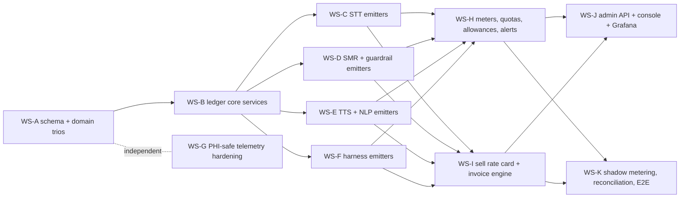

# TASK-615 — AI Usage Metering, Consumption Monitoring & Tenant Billing

| | |
|---|---|
| **Status** | In Progress — Wave 0 merged (WS-G, WS-A, WS-B; contract frozen); Wave 1 emitter lanes executing |
| **Type** | feature (cross-cutting: database → domains → applications → api → python services → admin console → infra) |
| **Created** | 2026-08-06 |
| **Branch** | dev-2.1 |
| **Supersedes** | **TASK-601** (Consumption Tracking & Monitoring). All TASK-601 research, findings, and design decisions are carried forward here and extended with the tenant **billing plane** (sell-side rate card, fixed plan + on-demand invoice computation), a full 2026-08-06 re-verification of the current state, and a workstream plan structured for a team of agents executing in parallel. TASK-601 is closed as superseded; do not implement from its README. |
| **Companion docs** | [current-state-review.md](./current-state-review.md) (codebase map, re-verified 2026-08-06) · [research-findings.md](./research-findings.md) (external research incl. §13 billing/pricing track) |

---

## 1. Requirement Analysis

Establish best-practice **usage metering, consumption monitoring, and tenant billing** for
the scribe platform's AI capabilities, per tenant and per capability:

1. **Speech-to-text** — ASR (self-hosted whisper.cpp pipelines + cloud/BYOK fallback,
   streaming and batch) plus secondary capabilities (noise reduction, VAD, diarization,
   embeddings). Metric decision: duration vs alternatives.
2. **Text generation** — SMR summarization, guardrail validation, harness agentic loops;
   built-in self-hosted providers (LM Studio, Ollama, llama.cpp) and third-party providers
   (Azure OpenAI, Bedrock, Anthropic, Vertex, +BYOK). Metric decision: tokens vs
   alternatives.
3. **Text-to-speech** — self-hosted (Kokoro, Indic Parler) and third-party (Azure Speech).
   Metric decision: duration vs characters vs alternatives.
4. **NLP / embeddings** — medical NER, classification, retrieval embeddings.
5. **Billing** — computation of each tenant's final billing amount under (a) a fixed plan
   with included allowances and (b) on-demand usage pricing above the allowances,
   including proration, caps/alerts, BYOK treatment, and an auditable invoice lifecycle.

Additional delivery requirement: the implementation plan must be decomposed into
**independent, file-disjoint workstreams executable by a team of agents in parallel**, with
explicit dependencies, interface freezes, and merge order.

---

## 2. Current State Evaluation (verified 2026-08-06)

Full detail with file:line evidence in [current-state-review.md](./current-state-review.md)
(§1–3 from the 2026-08-02 sweeps; §4 re-verification of 2026-08-06 — **all 16 gaps remain
open; TASK-601 produced no code**).

**Exists and is sound:** the entitlements/quota skeleton (`PlanEntitlement` /
`TenantEntitlement` / `TenantUsageMeter`, 3 business meters, 5 create-time caps, Redis
streaming-concurrency cap, storage soft-warn, admin API, reconcile cron) — all behind
`entitlements.enabled` (OFF by default); `SummaryMeta` per-summary token capture; complete
SMR provider-adapter usage propagation incl. streaming trailing chunks; append-only ledger
precedents (`AgentTrajectoryStep`, `DnaUsageRecord`); correct Prometheus discipline (no
tenant labels).

**Headline gaps (G1–G16, register in the companion doc):** no cost model, no per-request
usage ledger, no tenant × provider × model rollup; SMR streaming bypasses the generation
audit (and the audit event lacks `tenant_id`); guardrail computes token stats then discards
them; TTS records no characters or synthesis duration; NLP entity counting is dead code;
STT batch duration is encrypted into an unqueryable blob; enforcement + reconcile ship OFF.

**Sharpened 2026-08-06:** the ONE live meter (`TRANSCRIPTION_MINUTES` via
`AudioRecording.duration`) is fed only by the opt-in streaming `dual_capture` path
(default off) and **batch STT contributes zero** — flipping enforcement on today would
enforce against structurally wrong numbers. The only pricing artifacts anywhere are an
internal `$/1k tokens` map in the agent-trajectory admin rollup and an unwired mock billing
UI kit in `packages/ui`. **No billing/invoice/subscription/price implementation exists.**

---

## 3. Research Synthesis — units and norms per capability

Full citations in [research-findings.md](./research-findings.md) (§1–12 metering/telemetry,
§13 billing/pricing). The decisions that fall out:

| Capability | Record (ledger units) | Bill / quota on | Rationale (dominant 2026 norm) |
|---|---|---|---|
| STT batch | `AUDIO_SECOND` (decoded) | audio-seconds, 1 s granularity, **no minimum** | Google v2/Azure/Deepgram norm; 15 s minimums are legacy |
| STT streaming | `AUDIO_SECOND` **and** `SESSION_SECOND` (socket open→close) | **session-seconds** (owner decision OQ1) + idle-timeout auto-close | Market splits (Deepgram = audio, AssemblyAI = connection time); session basis protects against idle-socket cost but MUST pair with the TASK-612 watchdog to stay fair |
| STT dual-mic | 1× mixed + `channelCount` recorded | 1× (owner decision OQ2) | AWS-style; channel count kept for future repricing |
| STT secondary (server): diarization, lang-ID | folded into per-**pipeline-tier** `AUDIO_SECOND` rate; stage decomposition in metadata | pipeline-tier rate | Vendors sell flat add-on SKUs, but HOPE tenants select pipelines, not à-la-carte stages |
| STT secondary (client): VAD, noise filter | **not metered** | plan feature flags only | Runs on the user's hardware — zero platform marginal cost |
| Embeddings (diarization/RAG) | `INPUT_TOKEN` under `EMBEDDING` capability | tokens | Shipping OTel convention; distinct capability |
| Text generation | `INPUT_TOKEN`, `OUTPUT_TOKEN`, `CACHE_READ_TOKEN`, `CACHE_WRITE_TOKEN`, `REASONING_TOKEN` (row per unit kind, shared `requestId`) | tokens — provider-reported **billable** counts, never local tokenizer estimates | Universal; cache-read ≈ 90% off converged; reasoning bills as output everywhere; batch tier = 50% at all three labs |
| Text gen (self-hosted) | tokens + `GPU_SECOND` recorded alongside | tokens at an admin-configured per-model internal rate | Model-catalog platforms (Together/Fireworks/Baseten) sell tokens; GPU-time is the cost-truth unit, not the sell unit |
| Guardrail / harness LLM calls | metered fully as distinct `operation`s, attributed via `requestId`/`consultationId` | **metered, never quota-blocked, not line-itemed to tenants** | Platform-mandated safety/quality; belongs in per-encounter margin |
| TTS | `CHARACTER` (accepted input) + `AUDIO_SECOND` (synthesized output) | **characters** — pre-flight knowable, quota-checkable before synthesis | Dominant norm (Azure/ElevenLabs/OpenAI tts-1); duration kept for self-hosted COGS. Counting rule pinned: 1 Unicode code point = 1 char, no CJK/Indic double-counting |
| NLP (NER/classify) | `TEXT_UNIT` (chars/100) + `REQUEST`, consultation-batched | text units | Cloud NLP minimums make per-utterance calls ~10× dearer — batch to consultation granularity |

**Normalizer traps (encode in tests, not comments):** Anthropic/Bedrock `input_tokens`
EXCLUDE cache tokens (OpenAI/Gemini include); Vertex `candidatesTokenCount` excludes
thinking tokens (Gemini API includes); Anthropic streaming usage is cumulative — take last,
never sum; streaming usage must also emit from the **abort path** (TASK-470/471 bug class);
vLLM V1 cached-token reporting is broken; never bill from local tokenizer counts.

**Metering architecture consensus** (Stripe Meters / Metronome / Orb / OpenMeter / Lago):
append-only ledger, intent-derived idempotency keys, `occurredAt` vs `recordedAt`, bounded
acceptance window with an explicit backfill/correction path (never silent overwrite),
aggregation declared on the meter, effective-dated supersede-only price rows, finalized
periods immutable — corrections are credit memos. Transactional outbox for emission;
shadow-meter one full cycle and reconcile against provider usage APIs (>2% drift alert)
before enforcing anything.

**Billing-plane norms** (§13): per-capability allowances beat credit pools for
predictability-sensitive B2B (Windsurf reverted from credits for exactly this reason);
overage at parity or ≤15–25% premium, never punitive; alerts at 50/80/95/100%; soft caps
for paid tiers, hard caps only for TRIAL; BYOK = two independent bill flows (provider bills
the tenant directly; platform charges a flat fee, meters fully, zero-rates on the invoice);
**no mainstream billing vendor signs a BAA** (Stripe explicitly not; Metronome/Orb SOC 2
only) → rating stays in-house and only PHI-free finalized lines may ever be exported.

---

## 4. Design Decisions

### Carried forward from TASK-601 (unchanged, binding)

- **D1** Build on the existing entitlements/metering skeleton — don't replace it.
- **D2** One event shape: append-only, tenant-scoped **`AiUsageEvent`** ledger, row per
  unit kind sharing a `requestId`; `unit` enum (`INPUT_TOKEN`, `OUTPUT_TOKEN`,
  `CACHE_READ_TOKEN`, `CACHE_WRITE_TOKEN`, `REASONING_TOKEN`, `AUDIO_SECOND`,
  `SESSION_SECOND`, `CHARACTER`, `TEXT_UNIT`, `REQUEST`, `GPU_SECOND`); idempotency key;
  `occurredAt`/`recordedAt`; attribution ids (`consultationId`, `doctorId`,
  `departmentId`, `requestId`, `sessionId`); metadata allow-listed enums/ids only (PHI
  rule); no soft delete, no sys-events (AgentTrajectoryStep precedent).
- **D3** Emission where `tenantId` is known and the call is authoritative — the gateway,
  via **transactional outbox**; Python services return usage in responses; SMR forwards
  guardrail's usage block; streaming emits from teardown (complete OR abort).
- **D4** Rating at ingest against an effective-dated, supersede-only **`AiPriceBook`**
  (decimal micros; LiteLLM seed pinned by SHA + hand-verified rows); self-hosted rates are
  ops-owned configured platform costs; BYOK rates stamp `costBasis: BYOK_NOTIONAL`.
- **D5** Postgres-first aggregation (`AiUsageRollupHourly/Daily`); Timescale CAGGs are a
  later non-breaking swap; extend `UsageMeterMetric` with unit meters derived from the
  ledger.
- **D6** Enforcement stays simple first (post-hoc debit + `max_tokens` caps);
  reserve-then-settle deferred; **guardrail metered but never quota-blocked**.
- **D7** Telemetry-plane fixes independent of the ledger (bounded labels
  `{capability, provider, model, engine, status}`; `gen_ai.*` naming for LLM, `hope.*`
  for STT/TTS/NLP; no tenant labels in Prometheus — per-tenant analytics come from
  Postgres).
- **D8** Surfacing: admin Consumption & Cost screen + tenant self-service view + Grafana
  Postgres-datasource dashboard + quota/budget-burn alerting.
- **D9 (amended)** TASK-601 excluded invoicing entirely; TASK-615 **includes** the billing
  plane (D10–D17) but still defers: external billing-provider integration beyond PHI-free
  export, Kafka/ClickHouse/OpenMeter deployment, provider-side per-tenant attribution
  (Bedrock AIPs), and any HIPAA-audit-log coupling.

### Resolved owner questions (carried from TASK-601 §4)

| # | Question | Answer (recorded) |
|---|---|---|
| OQ1 | Audio-seconds vs session-seconds for STT | Record BOTH; quota/bill on **session-seconds** |
| OQ2 | Dual-mic ×1 or ×2 | **1× mixed** (AWS-style), record channel count |
| OQ3 | Flip enforcement flags | **ON in dev/staging** as part of this work; production stays a launch decision |
| OQ4 | Self-hosted cost-rate ownership | **Ops-owned settings-registry keys**, reviewed quarterly |
| OQ5 | Raw-event retention | **18 months raw, rollups indefinite** |

### New decisions (billing plane)

- **D10 — Two price planes, one mechanism.** `AiPriceBook` carries
  `plane ∈ {COST, SELL}`. COST rows = COGS rates (provider list prices + ops-configured
  self-hosted rates) used by the at-ingest rater. SELL rows = tenant-facing rate card
  (per capability × unit × plan tier; plus `PLAN_FEE` rows per plan) used only by the
  invoice engine. Both effective-dated, supersede-only, decimal micros. Never conflate:
  COST changes when vendors reprice; SELL changes when the product decides.
- **D11 — Per-capability allowances, not a credit pool.** `PlanEntitlement` /
  `TenantEntitlement` gain nullable included-allowance ceilings on the new unit meters
  (`monthlySttSessionSeconds`, `monthlyLlmTokens`, `monthlyTtsCharacters`,
  `monthlyNlpTextUnits`, …) over the existing UTC-calendar-month periods. A fungible
  credit pool is revisited only if sales demands it (Windsurf counter-signal; healthcare
  buyers price predictability over fungibility).
- **D12 — Overage policy.** Overage rate = SELL unit rate at parity or a small premium
  (≤15%, set per plan tier in the SELL book). Soft caps for paid tiers (keep serving,
  bill overage); hard caps only for TRIAL; optional tenant-set monthly spend limit.
  Threshold alerts at 50/80/95/100% of each allowance. Status codes: 429 throughput,
  402 credit/spend-limit exhausted, 403 capability not in plan, 409 quantity quota.
- **D13 — Invoice lifecycle.** New `BillingInvoice` / `BillingInvoiceLine` /
  `BillingAdjustment` models. Monthly computation from **rollups** (never raw events at
  invoice time):
  `invoice = prorated plan fee + Σ_capability max(0, usage − allowance) × overage rate − adjustments`.
  Draft → review → **finalize (immutable)**; corrections to finalized periods are credit
  memos (`BillingAdjustment`), never mutations. Integer micros everywhere; one documented
  rounding rule (half-up at line level). Raw events (18 mo) are the dispute evidence.
- **D14 — BYOK billing.** Meter fully, rate notionally (`BYOK_NOTIONAL`), invoice the
  provider cost **never**; the plan fee is the platform fee (no token markup — market
  norm). BYOK tenants see their notional spend as a product feature. BYOK→platform
  failover charges platform SELL rates and remains opt-in/logged/attested (TASK-601 BAA
  finding).
- **D15 — Proration.** Plan fee prorated daily on mid-period change; on upgrade the new
  allowances apply **retroactively to period start** (Chargebee model — avoids
  "upgraded and still blocked"); downgrades take effect at the next period.
- **D16 — What is never metered for billing.** Client-side VAD/noise-filter (browser
  compute); guardrail and harness internal LLM usage is metered for COGS but never
  line-itemed to tenants; Prometheus never gains tenant labels.
- **D17 — In-house rating, PHI-free export.** No billing/metering vendor in the raw event
  path (none signs a BAA). The invoice engine is in-house; if/when an AR system is
  adopted, only finalized, PHI-free invoice lines (opaque tenant ids, amounts, unit
  totals) are exported. Keeping the pipeline PHI-free keeps it outside §164.312(b) and
  HITRUST scope; its audit obligations are ordinary financial controls.

---

## 5. Implementation Plan — parallel agent workstreams

### 5.1 Workstream map and dependencies

**Execution waves** (a wave starts only when its dependencies' lane gates are green and
merged):

| Wave | Workstreams | Parallelism |
|---|---|---|
| 0 | WS-A → WS-B (sequential); WS-G may run alongside | 2 agents |
| 1 | WS-C, WS-D, WS-E, WS-F | 4 agents |
| 2 | WS-H, WS-I (WS-J API portion may start with WS-H) | 2–3 agents |
| 3 | WS-K; WS-J console screens (after the rule-12 design gate) | 2 agents |

### 5.2 Coordination rules (mandatory — read before spawning any agent)

1. **Commit first.** `dev-2.1` currently carries substantial uncommitted work
   (TASK-611–614). All of it must be committed (or explicitly stashed by the owner)
   before any agent executes — a prior incident (2026-07-21) destroyed uncommitted work
   when parallel sessions shared a tree.
2. **Isolated worktrees, branched from `dev-2.1`.** Each workstream runs in its own git
   worktree/branch (`task-615-ws-<x>`). Caution: agent-spawned worktrees default to
   basing off `main` — verify the base is `dev-2.1` (`git worktree add -b task-615-ws-c
   ../wt-615-c dev-2.1`).
3. **Exclusive file ownership.** The "Owns" list of each workstream below is exclusive.
   An agent needing to touch a file outside its lane STOPS and reports to the
   orchestrator; it never edits another lane's files.
4. **Interface freeze.** `IUsageLedgerService`, the `UsageEventInput` DTO, and the unit /
   capability / operation enums are frozen when WS-B merges. Wave-1 emitters code only
   against the frozen contract; contract changes require an orchestrator decision and a
   rebase of all wave-1 lanes.
5. **Schema custodian.** ONLY WS-A creates Prisma schema changes and migrations. WS-H/WS-I
   schema needs (allowances, invoice tables, SELL plane) are part of WS-A's single
   migration up front; anything discovered later goes back to WS-A as a follow-up
   migration — never a second lane editing `packages/database`.
6. **Merge order** = wave order: A → B → (C, D, E, F, G in any order) → H → I → J → K.
   Each lane passes its gates (build + tests + lint incl. only-warn, per rule 01) before
   merging; later lanes rebase after each merge.
7. **Generator discipline** (rule 03): `pnpm gen:model` only scaffolds models; entities /
   factories / mappers / repositories are hand-authored; NEVER run `gen:mapper` or
   `gen:repository`; finish with `gen:entity` + `gen:factory` reconcile/coverage checks.
8. **TDD everywhere** (rule 01): each workstream's test list below is written first and
   must fail before implementation; evidence pasted into §6 per workstream.

### 5.3 Workstream specifications

---

#### WS-A — Schema & domain foundation (schema custodian)

*Agent: opus-4-8, effort high · Wave 0 · Size L*

**Scope:** one migration `task_615_usage_ledger_and_billing` delivering the complete data
model: `AiUsageEvent`, `AiUsageOutbox`, `AiPriceBook` (with `plane COST|SELL`),
`AiUsageRollupHourly`, `AiUsageRollupDaily`, `BillingInvoice`, `BillingInvoiceLine`,
`BillingAdjustment`; new allowance columns on `PlanEntitlement`/`TenantEntitlement`;
`UsageMeterMetric` `ADD VALUE`s (`STT_SESSION_SECONDS`, `LLM_TOKENS`, `TTS_CHARACTERS`,
`NLP_TEXT_UNITS`, `GUARDRAIL_CALLS`); `ResourceType` `ADD VALUE`s for the billing models
(they emit sys-events; ledger/outbox/rollups/price book reads do NOT — price-book and
invoice MUTATIONS do). Allow-list updates (`TENANT_SCOPED_MODELS`,
`SYSTEM_SHARED_READ_MODELS` for the price book, `MODELS_WITHOUT_SOFT_DELETE` for
ledger/outbox/rollups). Hand-authored domain trios for every new model
(`AiTaskDefault*` exemplar); OCC mapper strip for `BillingInvoice` (versioned draft
updates); non-OCC for append-only models. Register repositories in `CoreDatabaseModule`;
barrels.

**Owns:** `packages/database/**` (new `usage-ledger.prisma`, `billing.prisma`, edits to
`entitlement.prisma`, `audit.prisma`, migration, allow-lists, seed for price-book COST
rows pinned by LiteLLM SHA + SELL placeholder rows) · `packages/domains/**` (new trios,
enums, `CoreDatabaseModule`).

**Tests first:** repository CRUD + idempotency-key unique-conflict no-op; enum-parity
tests (`resourceType.enum-parity.test.ts` pattern); soft-delete exclusion throws for
ledger models; migration SQL review.

**DoD:** `pnpm db:migrate` + `db:generate` green; `gen:model`/`gen:entity`/`gen:factory`
report no drift + coverage OK; `pnpm --filter @arcaai/domains build test` green.

---

#### WS-B — Ledger core services (interface owner)

*Agent: opus-5, effort high · Wave 0, after WS-A · Size L*

**Scope:** `packages/applications` services: `IUsageLedgerService.recordUsage()` writing
`AiUsageOutbox` in the caller's transaction; BullMQ outbox drainer (exactly-once-effective
under retry via idempotency key); `IPriceBookService` (COST-plane resolution effective at
`occurredAt`; BYOK notional rating; `priceBookVersion` stamping); rollup upsert
maintenance (drainer + periodic job); provider-usage **normalizer** implementing the §3
trap table as a pure, exhaustively-tested function. Publishes the frozen contract for
wave 1.

**Owns:** `packages/applications/src/services/usageLedger/**` (new),
`.../services/priceBook/**` (new), shared normalizer util + its tests.

**Tests first:** idempotency-conflict no-op; outbox drains exactly-once under injected
retry; rating picks the row effective at `occurredAt` (not `recordedAt`); BYOK notional
math; rollup upsert arithmetic; normalizer: Anthropic exclusive-input, Vertex thinking,
cumulative-delta take-last, cache TTL split.

**DoD:** `pnpm --filter @arcaai/applications build test` green; contract doc
(`UsageEventInput`, enums) committed and announced as frozen.

---

#### WS-C — STT emitters (streaming + batch + compat)

*Agent: sonnet-5, effort high · Wave 1 · Size L*

**Scope:** batch — lift `duration_seconds`/`processing_time_seconds` into typed fields on
the internal complete-job DTO (before encryption); emit `AUDIO_SECOND` rows on job
completion; make batch also feed the transcription-minutes signal. Streaming — emit
`AUDIO_SECOND` + `SESSION_SECOND` at session teardown (complete AND abort;
`total_duration_seconds` already accumulates), 1× mixed with `channelCount` metadata;
verify idle-timeout watchdog closes sessions (session-second billing fairness). STT
service telemetry: streaming duration histogram + RTF. Compat surface
(`stt-compat`) emits through the same gateway path.

**Owns:** `apps/stt/**` · `apps/api/src/modules/streaming/**` (STT files:
`transcription-job.*`, `stt-ws.gateway.*`) · `apps/api/src/modules/stt-compat/**` ·
internal STT controllers/services (`sttInternal.*`) ·
`packages/applications/src/services/transcriptionJob/**`.

**Tests first:** batch completion lands typed durations + a ledger row with correct
quantity; streaming close emits both units; **abort emits with `interrupted` metadata**;
dual-capture on/off both meter; compat path metered; pytest for the service-side DTO and
histogram.

**DoD:** `pnpm stt:test`, `pnpm test:unit` (api), applications tests green.

---

#### WS-D — Text-generation emitters (SMR + guardrail)

*Agent: opus-4-8, effort high · Wave 1 · Size L*

**Scope:** SMR — add `tenant_id` to `GenerationAuditEvent`; make the streaming path call
`generation_audit.log_generation` with REAL totals and return final usage to the gateway
proxy on stream teardown (abort included — emit whatever cumulative usage was seen);
extend response DTO passthrough with cache/reasoning token detail. Guardrail — surface
`GuardrailCallStats` in `MedicalValidationResponse` (+ batch and judge paths); add
guardrail Prometheus counters; SMR forwards guardrail's usage block. Gateway — emit token
rows wherever `SummaryMeta` is written (sync + async + compat) and `guardrail.validate`
rows from the SMR-response path, via the WS-B normalizer.

**Owns:** `apps/smr/**` · `apps/guardrail/**` ·
`apps/api/src/modules/streaming/smr-proxy.controller.ts` ·
`packages/applications/src/services/summary/**`.

**Tests first:** streaming generation logs real token totals with `tenant_id`;
stream-abort emission; guardrail stats present in response (all providers, batch + judge);
SMR forwards guardrail block; per-provider normalization goldens (Anthropic/Bedrock
exclusive-input, Vertex vs Gemini thinking, Ollama/llama.cpp/LM Studio field mapping);
`SummaryMeta` write co-emits ledger rows in one transaction.

**DoD:** `pnpm py:smr:test`, `py:guardrail:test`, api unit + applications tests green.

---

#### WS-E — TTS + NLP emitters

*Agent: sonnet-5, effort medium · Wave 1 · Size M*

**Scope:** TTS — record accepted `len(body.input)` (code-point rule per §3) + synthesized
audio-seconds (existing RTF byte math) in the response; gateway emits `CHARACTER` +
`AUDIO_SECOND` rows; TTS Prometheus counters + the shared `model_running_instances`
pair. NLP — wire `record_entities()` call-sites; Prometheus entities/documents counters
(not OTLP-only); gateway emits `TEXT_UNIT` + `REQUEST` rows, consultation-batched;
embeddings paths emit `EMBEDDING` token rows.

**Owns:** `apps/tts/**` · `apps/nlp/**` · the gateway TTS/NLP proxy modules.

**Tests first:** character count = accepted input code points (Malayalam/SSML cases);
synthesis duration recorded; 413-rejected requests emit nothing; NLP batch granularity
(one consultation = one `REQUEST` row); counters appear in `/metrics` with bounded labels.

**DoD:** `pnpm py:tts:test`, `py:nlp:test`, api unit tests green.

---

#### WS-F — Harness emitters

*Agent: sonnet-5, effort medium · Wave 1 · Size S*

**Scope:** per-step usage rows emitted through the existing gateway trajectory-persistence
path (stats already carried in `AgentTrajectoryStep.stats`), resolving the dual-writer
drift in the ledger's favor. **No workflow-determinism changes** — emission happens in
activities/persistence, never inside `@workflow.defn`; replay-compat tests must pass.

**Owns:** `apps/harness/**` (activities/persistence only) ·
`packages/applications/src/services/agentTrajectory/**` (emission hook).

**Tests first:** step persistence co-emits ledger rows; token budget figures match ledger
sums for a run; `test_replay_compat` green.

**DoD:** `pnpm py:harness:test` + applications tests green.

---

#### WS-G — PHI-safe telemetry hardening

*Agent: sonnet-5, effort medium · Wave 0–1 (independent) · Size S*

**Scope:** pin `OTEL_INSTRUMENTATION_GENAI_CAPTURE_MESSAGE_CONTENT=NO_CONTENT` in env
samples + boot-time assertion (JWT-placeholder-refusal precedent); CI test asserting no
content-bearing `gen_ai.*` attribute in any emitter; metadata allow-list test on
`AiUsageEvent` writes (enums/ids only, no free text); document the collector deny-list;
`gen_ai.*`/`hope.*` naming conventions doc.

**Owns:** env samples (`pnpm env:sync` flow), `turbo.json#globalEnv` additions, CI test
files, boot assertion in `apps/api/src/main.ts` + Python `create_app` factories
(assertion lines only — coordinate with C/D/E lanes if files collide; assertions land
first, in wave 0).

**Tests first:** boot refuses when the env var is unset/permissive in production mode;
allow-list violation test fails on a free-text metadata key.

**DoD:** `pnpm verify` green; CI job passes; no tenant labels in any `/metrics` diff.

---

#### WS-H — Meters, quotas, allowances, alerts

*Agent: sonnet-5, effort high · Wave 2 · Size M*

**Scope:** `MeteringService.getCurrentUsage` reads rollups for the new
`UsageMeterMetric`s; `assertMeterQuota` call-sites for TTS characters and (soft) LLM token
budgets — **guardrail explicitly exempt**; plan matrix gains the new nullable allowance
ceilings (admin API + `MyEntitlementsController` exposure); threshold alerting at
50/80/95/100% from rollups; wire `ENTITLEMENTS_QUOTA_BLOCKED_EVENT` to a real sys-event
consumer; reconcile job covers the new meters; flip `entitlements.enabled` +
`metering.reconcile.enabled` defaults ON **in dev/staging seeds only** (OQ3) — production
stays a launch decision.

**Owns:** `packages/applications/src/services/entitlements/**`, `.../metering/**`,
`.../sysEvent/**` (consumer), quota call-sites in tts/summary service files **after**
WS-D/E merge (rebase).

**Tests first:** rollup-backed `getCurrentUsage` matches ledger sums; new quota 429s with
correct codes (402/403/409/429 semantics per D12); guardrail exemption; alert thresholds
fire once per level per period; TRIAL hard-cap vs paid soft-cap behavior.

**DoD:** applications + api tests green; one full reconcile cycle in dev evidenced.

---

#### WS-I — Sell-side rate card + invoice engine

*Agent: fable-5 (or opus-5), effort high · Wave 2 · Size L — money-math correctness is the risk*

**Scope:** SELL-plane price-book service + GLOBAL_ADMIN CRUD (effective-dated,
supersede-only; `PLAN_FEE` rows; per-tier overage rates); `IBillingService`: monthly draft
computation from rollups per D13 formula, proration per D15, BYOK zero-rating per D14,
spend-limit enforcement hook (402), finalize (immutable — OCC-guarded state transition),
credit-memo adjustments; invoice endpoints (admin + tenant self-service read); sys-events
on all mutations.

**Owns:** `packages/applications/src/services/billing/**` (new),
`.../services/priceBook/sell/**`, `apps/api/src/modules/billing/**` (new controllers).

**Tests first (golden-file heavy):** invoice math goldens — allowance exactly consumed,
overage crossing mid-month, upgrade mid-month (retroactive allowance + prorated fee),
downgrade next-period, BYOK tenant (notional visible, provider cost absent), spend-limit
hit; finalize immutability (mutation attempt → 409/412); credit memo never mutates lines;
rounding rule property test (Σ lines == total, half-up); cross-tenant 404 posture on all
by-id routes.

**DoD:** applications + api unit tests green; a simulated month over seeded usage
produces a correct draft invoice — output pasted as evidence.

---

#### WS-J — Surfacing: admin API, console, Grafana

*Agent: sonnet-5, effort medium-high · Wave 2 (API) / Wave 3 (console, after design gate) · Size M*

**Scope:** `admin/usage/*` endpoints (rollup queries, cost-per-encounter distribution
p50/p90/p99, top-N tenants, budget burn-down) + tenant self-service usage endpoint;
admin-console **Consumption & Cost** screen (global tier, per-tenant drill-down) and
**Billing** screen (invoices, rate card) — **rule-12 design gate first: no screen until
its Figma frame is approved**; tenant usage panel in the AI-configuration hub; Grafana
consumption dashboard on the Postgres datasource.

**Owns:** `apps/api/src/modules/admin-usage/**` (new), `apps/admin-console/src/features/
usage/**` + `.../billing/**` (new), `infrastructure/grafana/dashboards/consumption.json`.

**Tests first:** endpoint DTO contracts; cross-tenant 404; e2e for rollup queries;
console unit tests + axe 0 violations; skeleton loading states per rule 10.

**DoD:** api e2e green; console `build lint test` green; both themes verified; design-gate
approval recorded here before screen implementation.

---

#### WS-K — Shadow metering, reconciliation, E2E evidence

*Agent: sonnet-5, effort high · Wave 3 · Size M*

**Scope:** shadow-metering report job (ledger totals vs `SummaryMeta` sums vs provider
usage APIs where configured; >2% drift alert); provider reconciliation clients (OpenAI org
usage, Anthropic usage report, Azure Cost Management — control totals only); streaming
-abort E2E for STT and SMR; cross-tenant E2E for every new admin/by-id surface; the
end-to-end evidence run: one consultation in dev produces STT second rows, LLM token rows
(incl. guardrail), NLP rows, TTS rows, a non-zero cost-per-encounter figure, and a correct
draft invoice.

**Owns:** `apps/api/tests/e2e/task-615-*.spec.ts`, shadow/reconcile job under
`packages/applications/src/services/metering/reconciliation/**`, test fixtures.

**Tests first:** drift computation unit tests; abort-path e2e; full-cycle evidence script.

**DoD:** `pnpm test:e2e` green; shadow report over one full dev cycle shows <2% drift or
documented explanations; evidence pasted in §6.

### 5.4 Verification criteria (Phase-5 gate for the whole ticket)

- All affected packages/services build + test + lint green (incl. only-warn warnings
  treated as errors in `packages/*`).
- The WS-K end-to-end evidence run pasted: per-capability ledger rows, non-zero
  cost-per-encounter, correct draft invoice for a simulated month (allowance + overage +
  proration case).
- Streaming-abort tests prove usage lands on interruption.
- Prometheus `/metrics` diff shows new bounded-label instruments and **no tenant labels**.
- Shadow-metering cycle complete before any enforcement default flips beyond dev/staging.
- One full billing period finalized in dev; finalize-immutability and credit-memo paths
  exercised.

---

## 6. Implementation Summary

_Updated per workstream on merge into `dev-2.1`._

### Wave 0 — merged 2026-08-06

**WS-G — PHI-safe telemetry hardening** (branch `task-615-ws-g`, merge `c4ef67e0`).
`NO_CONTENT` pin for `OTEL_INSTRUMENTATION_GENAI_CAPTURE_MESSAGE_CONTENT` registered via
`turbo.json#globalEnv` + `env:sync`; production boot assertions in the gateway
(`apps/api/src/bootstrap/genai-content-capture-audit.ts`) and SMR
(`TelemetryPhiGuardConfig` in `core/config.py`); static allow-list test over every
`gen_ai.*` literal in SMR; `docs/operations/telemetry-phi-guardrails.md`. Evidence:
env:sync:check OK; api build 8/8; 49/49 scoped unit tests; py:smr 1049 passed with the
4 failures proven pre-existing against a stashed baseline.

**WS-A — schema & domain foundation** (branch `task-615-ws-a`, merge `95718eb4`).
83 files, +5,907. New `usage-ledger.prisma` (AiUsageEvent/AiUsageOutbox/AiPriceBook/
rollups) + `billing.prisma` (BillingInvoice/Line/Adjustment); 9 enums; 6 UsageMeterMetric
+ 3 ResourceType values; 11 allowance columns; migration
`20260806000000_task_615_usage_ledger_and_billing` proven by an empty
`prisma migrate diff` against a scratch shadow DB; 8 hand-authored domain trios
registered in CoreDatabaseModule; placeholder price-book seed (29 SYSTEM rows,
`bookVersion 2026-08-06-placeholder-v1`). Evidence: gen checks no-drift + coverage OK;
database 943 tests, domains 1,483 tests green (84 new, red-first). Notable interface
decisions: ledger metadata column named `attributesJson`; rollup `model` is
`String @default("")`. Post-merge the shared dev DB was `db:push`ed and re-seeded.
Found pre-existing defect (filed separately): the entitlement plane has no migration at
all — `migrate deploy` replay fails before this ticket's migration.

### Wave 1 — merging as lanes land

**WS-D — SMR + guardrail usage emission** (branch `task-615-ws-d`, merge `54cbf3c7`).
Closes G5 + G6. SMR: `GenerationAuditEvent.tenant_id` on all four audit paths; the
pre-generation zero-token streaming audit placeholder is gone — streaming logs once at
teardown with real totals (complete AND abort); usage chunks reduce take-last (Anthropic
cumulative trap); the provider `done` frame is held back and re-emitted carrying the
usage block (frames appended after `done` were undeliverable); adapters preserve
provider usage detail (cache TTL split, reasoning, `service_tier`, Vertex JSON wire
spelling — the SDK spelling would have zeroed every Vertex row). Guardrail: stats on
single/batch/judge paths (`None` when no model reached; new Ollama stats builder);
`guardrail_requests_total`/`guardrail_tokens_total`, no tenant labels. Gateway:
`smr-usage.ts` builders; emission at `summary.service.ts` (presummarize + generate),
`chain-summary.service.ts`, and `smr-proxy.controller.ts` stream teardown
(end/error/close). SSE terminal frames (`done` AND `error`) carry `data.usage`;
**`task_id` is the billing identity** (`llm:<taskId>` converges across abort/retry).
Evidence: smr 1,074 passed (4 known pre-existing), guardrail 181 passed (3 pre-existing
verified on unmodified baseline), TS 596/0 post-rebase, eslint 0 errors. Open items
handed on: unmetered `SummaryMeta` writers outside the lane —
`comprehensive-summary.processor.ts:206`, `context.service.ts:513` (compat),
`harness-internal.service.ts:724` (copy `persistSummaryMetaWithUsage`); unknown SMR
providers normalize as `openai.chat` (inclusive-input assumption — alert-worthy);
bounded-JSON repair retries carry their own task id and are not billed; WS-C must add
`UsageLedgerServiceModule` to `streaming.module.ts` (handed to WS-C mid-flight).

**WS-F — harness per-step usage emission** (branch `task-615-ws-f`, merge `9872338b`).
LLM_CALL trajectory steps co-emit ledger rows: pure mapper
`agent-trajectory/harness-usage.mapper.ts` + `emitUsage` hook in
`agent-trajectory.service.ts:133`; activity-layer provider/model backfill on `llm_stats`
(`activities.py` only — zero `@workflow.defn` changes, replay-compat 13/13). Idempotency
key = `harness:step:<sessionId>:<runId>:<seq>:<UNIT>` (the same tuple that dedupes
trajectory persistence, NOT the row UUID). Double-emission analysis: harness-originated
`SummaryMeta` rows carry no token columns and harness calls SMR via `SmrClient`, never
the gateway summary path — `llm:<requestId>` and `harness:step:<...>` id-spaces are
disjoint by construction. Evidence: harness 1,021 tests green; applications
agent-trajectory + usageLedger 156/156; pre-existing vault-class failures verified
untouched. Open items handed on: (1) `Repository.createMany` lacks a `tx` param —
emission uses the contract's sanctioned no-tx fallback; adding `tx` to `createMany`
(packages/domains) is a wave-2 follow-up. (2) Reasoning tokens ride a separate THINKING
step and are not yet billed. (3) AD-1 stats carry no BYOK signal → harness rows are
always `costBasis: INTERNAL` for now.

**WS-B — ledger core services + frozen contract** (branch `task-615-ws-b`, merge
`414204cb`). 31 files, +4,492. `IUsageLedgerService.recordUsage` (transactional-outbox
write, strict validation, derives nothing silently), BullMQ outbox drainer (retry state
on the outbox row; rating + ledger insert + rollup increments in one transaction, rollups
derived from the insert outcome so redelivery is a no-op), `IPriceBookService`
(most-specific-wins precedence, tested; price 0 is a real rate; unresolvable price →
event recorded unrated — metering fails closed, rating fails open), LLM usage normalizer
(disjoint counters, `endpointKind` branching, cumulative-delta take-last),
`attributesJson` 10-key allow-list, `UsageLedgerServiceModule` wired in
`app.module.ts` (granted exception). **The wave-1 emitter contract is FROZEN:**
[ws-b-contract.md](./ws-b-contract.md). Evidence: applications build green; 8/8 new test
files, 133/133 tests; full suite bit-identical to pre-change baseline (zero regressions);
api build 8/8.

---

## 7. Change History

| Date | Change |
|---|---|
| 2026-08-06 | Ticket created, superseding TASK-601. Carried forward: current-state review (re-verified same day — all 16 gaps still open), external research (§1–12), design decisions D1–D8 and the five resolved owner questions. Added: billing-plane research track (§13), decisions D10–D17 (sell/cost price planes, per-capability allowances, overage policy, invoice lifecycle, BYOK billing, proration, PHI-free in-house rating), and the parallel-agent implementation plan (11 workstreams, 4 waves, coordination rules). Status → Review. |
| 2026-08-06 | Plan approved by owner; execution started. **Wave 0 complete and merged** (WS-G `c4ef67e0`, WS-A `95718eb4`, WS-B `414204cb` — see §6); wave-1 emitter contract frozen (ws-b-contract.md). Status → In Progress. |
