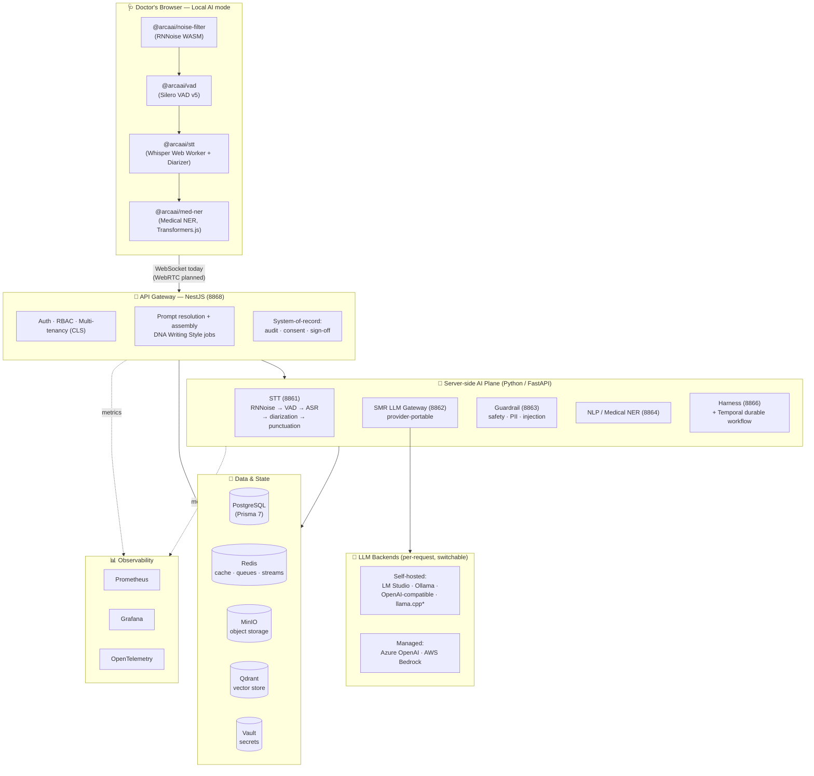

# HOPE v2 — Platform Marketing Overview

|                   |                                                                                                                                                                                                             |
| ----------------- | ----------------------------------------------------------------------------------------------------------------------------------------------------------------------------------------------------------- |
| **Product**       | HOPE — Clinical Documentation & Medical Voice-AI Platform                                                                                                                                                   |
| **Audience**      | Hospital & clinic decision makers, prospective customers, business stakeholders (technical appendix for evaluators)                                                                                         |
| **Status**        | Active development — core transcription → summarization pipeline shipped; several services and MLOps capabilities marked _(planned)_ below                                                                  |
| **Prepared from** | The HOPE v2 source repository (architecture docs, service READMEs, code/config). Every model and license claim below is grounded in the codebase; anything unconfirmed is flagged **"License: to verify."** |

> _Doctors don't go to medical school to type._ HOPE gives clinicians back the conversation — and gives hospitals a documentation engine they actually own.

---

## 1. Executive Summary

**HOPE is a clinical documentation platform that turns a doctor–patient conversation into a finished, structured medical note — automatically, in the doctor's own writing style, and without sending patient audio to a third party unless the hospital chooses to.**

A clinician simply talks to their patient as they normally would. HOPE listens (with on-device noise cleanup and privacy-first transcription), works out who said what, and drafts a specialty-appropriate clinical note — a SOAP note, referral letter, discharge summary, and so on — ready for the clinician to review and sign off.

Three things make HOPE different from generic "AI scribe" tools:

- **It runs where your data lives.** The entire pipeline can run on-premise (in the hospital's own data centre) or even on-device in the doctor's browser. Cloud AI services are _optional_ and used only when the customer opts in. Patient data sovereignty is the default, not an add-on.
- **It sounds like the doctor.** A per-clinician "DNA Writing Style" learns each doctor's phrasing and structure, so generated notes read like the clinician wrote them — which is the single biggest driver of real-world adoption.
- **It is provider-portable by design.** HOPE is not locked to one AI vendor. The same workflow can be served by self-hosted open-weight models (for cost and privacy) or by managed cloud models such as Azure OpenAI or AWS Bedrock (for peak capacity) — switchable per request, with no code changes.

The result: less time typing, more time with patients, lower documentation burden, and full institutional control over cost, data, and compliance.

---

## 2. High-Level Design (HLD)

HOPE v2 is a **modular microservice platform** built as a single monorepo (Turborepo + pnpm). It has four layers that a business reader can think of as: **the front door, the AI brain, the memory, and the control room.**

### 2.1 The building blocks in plain language

| Layer            | Component                                      | What it does (plain language)                                                                                                                                                                                                                                                                                                                       |
| ---------------- | ---------------------------------------------- | --------------------------------------------------------------------------------------------------------------------------------------------------------------------------------------------------------------------------------------------------------------------------------------------------------------------------------------------------- |
| **Front door**   | **API Gateway** (NestJS, port 8868)            | The single secure entry point. Handles login, permissions, multi-tenant isolation, routing, and is the system-of-record (it owns the database, audit trail, consent, and clinician sign-off).                                                                                                                                                       |
| **AI brain**     | **STT service** (port 8861)                    | Speech-to-Text — turns spoken audio into accurate text, figures out who is speaking (diarization), and adds punctuation.                                                                                                                                                                                                                            |
|                  | **SMR service** (port 8862)                    | Summarization — the multi-provider "LLM gateway" that drafts the structured clinical note from the transcript and the right specialty template.                                                                                                                                                                                                     |
|                  | **Guardrail service** (port 8863)              | A safety checkpoint — validates that input is medical-related, screens for unsafe content, personal-data leakage (PII), and prompt-injection attacks.                                                                                                                                                                                               |
|                  | **NLP / Medical NER service** (port 8864)      | Extracts medical entities (diseases, symptoms, medications, dosages), suggests diagnoses, classifies text, and corrects medical spelling.                                                                                                                                                                                                           |
|                  | **Harness service** (port 8866) + **Temporal** | Orchestrates the longer "clinical documentation loop" (_guides → generate → sensors → gate_) as a durable, resumable workflow, including the clinician sign-off step. (Currently a Phase-0 scaffold being built out.)                                                                                                                               |
| **Memory**       | **Shared packages**                            | Reusable building blocks: `database` (Prisma + PostgreSQL), `domains` (business rules), `applications` (services/use-cases), `ui` (component library), `agentic-sdk-v2` (`@arcaai/vox` consultation SDK), `room` (audio pipeline), `vad` (voice detection), `noise-filter` (noise cancellation), `med-ner` (in-browser medical entity recognition). |
| **Control room** | **Infrastructure**                             | Docker Compose for development, systemd-based single-server deployment for production, HashiCorp Vault for secrets, and Prometheus + Grafana + OpenTelemetry for monitoring.                                                                                                                                                                        |

### 2.2 The "runs twice" design

A defining feature of v2 is that **the same audio pipeline — noise-cancel → voice-detect → recognize → diarize — is implemented twice: once in the browser, once on the server.** This means a hospital can choose:

- **Local AI mode** — audio never leaves the doctor's laptop; the browser does everything. Maximum privacy.
- **Backend mode** — heavier models run on the hospital's servers for higher accuracy on longer or harder audio.

Either way, the output has the same structure, so the rest of the system doesn't care which path was used.

### 2.3 Architecture diagram

\* `llama.cpp` (self-hosted) and WebRTC transport are _planned_; a Text-to-Speech service and a self-hosted MLflow MLOps plane are also _planned_. Everything else shown is implemented in the codebase today.

---

## 3. Models & Licenses

HOPE is assembled from a curated set of open and commercial AI models. The table below is **grounded in the actual v2 codebase** — model identifiers come from service configuration, code defaults, and dependency manifests; license information comes from the repository's own model-license summary and inline configuration. **Where a license is not stated in the repo and could not be confirmed from a definitive in-repo source, it is flagged "License: to verify."**

A few important notes for evaluators:

- The LLM layer is **provider-portable** — the models below are the _defaults / typical models_ found in configuration; a customer can substitute their own.
- Several open-weight model families (e.g. Google **Gemma**) ship under **source-available "model use" terms** rather than a standard OSI open-source license; these carry use restrictions that warrant legal review for healthcare use.
- "Apache-2.0", "MIT", etc. for libraries refer to the inference _runtime/library_, which can differ from the model _weights_ license.

### 3.1 Speech-to-Text (ASR)

| Model / component                                           | Used in                        | Provider                    | License                                                    |
| ----------------------------------------------------------- | ------------------------------ | --------------------------- | ---------------------------------------------------------- |
| `openai/whisper-large-v3-turbo` (SafeTensor/PyTorch + ONNX) | STT backend, browser STT       | OpenAI / onnx-community     | **MIT** (turbo variant)                                    |
| `openai/whisper-large-v3`, `whisper-medium`                 | STT backend                    | OpenAI                      | **Apache-2.0**                                             |
| `onnx-community/whisper-large-v3-turbo` (+`_timestamped`)   | STT backend                    | onnx-community (HF)         | Inherits **MIT** (no explicit tag on HF)                   |
| `Xenova/whisper-{tiny,base,small,medium,large}`             | In-browser STT (`@arcaai/stt`) | Xenova (HF)                 | Whisper weights MIT/Apache-2.0; exact HF tag **to verify** |
| `nvidia/parakeet-tdt-0.6b-v2`, `parakeet-tdt-1.1b`          | STT backend (NeMo, optional)   | NVIDIA (+ Suno.ai for 1.1B) | **CC-BY-4.0** (attribution required)                       |
| `faster-whisper` / CTranslate2 engine                       | STT backend (engine)           | Systran                     | Library **MIT** (model id supplied at runtime)             |
| whisper.cpp + GGUF checkpoints _(planned)_                  | STT backend                    | ggml / Whisper              | **MIT**                                                    |
| Azure Speech Service                                        | STT backend (cloud engine)     | Microsoft                   | **Proprietary** (commercial; HIPAA BAA available)          |

### 3.2 Voice Activity Detection & Audio Processing

| Model / component                | Used in                               | Provider                   | License                                  |
| -------------------------------- | ------------------------------------- | -------------------------- | ---------------------------------------- |
| **Silero VAD v5**                | `@arcaai/vad` (browser) + STT backend | Silero (snakers4)          | **MIT** (v4+ moved from CC-BY-NC to MIT) |
| `@ricky0123/vad-web`             | Browser VAD wrapper                   | ricky0123                  | **ISC**                                  |
| **RNNoise** (upstream)           | Noise cancellation                    | Xiph.org (Jean-Marc Valin) | **BSD-3-Clause**                         |
| `@jitsi/rnnoise-wasm`            | `@arcaai/noise-filter` (browser)      | Jitsi                      | **Apache-2.0** (bundles BSD-3)           |
| `pyrnnoise`                      | STT backend noise cancellation        | RNNoise                    | **Apache-2.0** (bundles BSD-3)           |
| ONNX Runtime / `onnxruntime-web` | Inference runtime                     | Microsoft                  | **MIT**                                  |

### 3.3 Speaker Diarization (who-said-what)

| Model / component                                              | Used in                   | Provider           | License                                        |
| -------------------------------------------------------------- | ------------------------- | ------------------ | ---------------------------------------------- |
| `pyannote/wespeaker-voxceleb-resnet34-LM` (256-d, **default**) | STT backend diarization   | pyannote           | **CC-BY-4.0** (VoxCeleb attribution; HF-gated) |
| `speechbrain/spkrec-ecapa-voxceleb` (alternative)              | STT backend diarization   | SpeechBrain        | **Apache-2.0**                                 |
| `pyannote/segmentation-3.0` (ambiguity refinement)             | STT backend diarization   | pyannote           | **MIT**                                        |
| `pyannote.audio` toolkit                                       | STT backend               | pyannote           | **MIT**                                        |
| `deepghs/pyannote-embedding-onnx` (documented alt)             | STT backend (ONNX option) | deepghs (HF)       | **License: to verify**                         |
| In-browser `LocalSpeakerDiarizer` (hand-written MFCC features) | `@arcaai/stt`             | ARCA AI (in-house) | Part of `@arcaai/stt` (**MIT**)                |

### 3.4 Punctuation Restoration

| Model / component                                  | Used in                                       | Provider  | License                                                                                                                                            |
| -------------------------------------------------- | --------------------------------------------- | --------- | -------------------------------------------------------------------------------------------------------------------------------------------------- |
| `ai4bharat/Cadence` (~1B) / `Cadence-Fast` (~270M) | STT backend punctuation (disabled by default) | AI4Bharat | HF-tagged **MIT**, but **review required** — built on a Gemma-3 backbone, so **Gemma Terms of Use** flow down (restrictions on medical/health use) |
| `cadence-punctuation` (wrapper library)            | STT backend                                   | AI4Bharat | **MIT**                                                                                                                                            |

### 3.5 Summarization / LLM Backends (provider-portable)

| Model / component                                          | Used in                           | Provider                       | License                                                                                |
| ---------------------------------------------------------- | --------------------------------- | ------------------------------ | -------------------------------------------------------------------------------------- |
| `google/gemma-4` (LM Studio default; also Harness judge)   | SMR gateway, Harness              | Google                         | **Gemma Terms of Use** (source-available, use restrictions — legal review advised)     |
| `google/medgemma` (LM Studio default; also Harness judge)  | SMR gateway, Harness              | Google                         | **Gemma Terms of Use** (source-available, use restrictions — legal review advised)     |
| `qwen3.5`                                                  | SMR gateway (typical self-hosted) | Alibaba / Qwen                 | **Apache-2.0**                                                                         |
| `gpt-5` (Azure default)                                    | SMR gateway (managed)             | Microsoft / OpenAI (via Azure) | **Proprietary** (BAA available)                                                        |
| `anthropic.claude-4-6-sonnet` (Bedrock default)            | SMR gateway (managed)             | Anthropic (via AWS Bedrock)    | **Proprietary** (BAA available)                                                        |
| Serving runtimes: **LM Studio**, **Ollama**, **llama.cpp** | SMR gateway                       | LM Studio / Ollama / ggml      | llama.cpp **MIT**, LM Studio **Proprietary** (free for commercial use), Ollama **MIT** |

### 3.6 Guardrail / Safety

| Model / component                                                                       | Used in                          | Provider       | License                                                                                             |
| --------------------------------------------------------------------------------------- | -------------------------------- | -------------- | --------------------------------------------------------------------------------------------------- |
| `granite-guardian-4.1-8b` (LM Studio default, all tasks)                                | Guardrail, Harness safety sensor | IBM            | **Apache-2.0**                                                                                      |
| `granite-guardian-3.2-8b` (LM Studio default, all tasks)                                | Guardrail, Harness safety sensor | IBM            | **Apache-2.0**                                                                                      |
| `hivetrace/gliner-guard-uniencoder-onnx` (GLiNER ONNX — content safety, PII, injection) | Guardrail                        | hivetrace (HF) | **License: to verify** (GLiNER framework is Apache-2.0; this weight not stated in repo)             |
| `meta-llama/Prompt-Guard-86M` (referenced in technical brief)                           | Guardrail (documented)           | Meta           | **Llama Community License** — **to verify** (code defaults currently use GLiNER + Granite Guardian) |

### 3.7 Medical NLP & In-Browser NER

| Model / component                                                                   | Used in                        | Provider           | License                                       |
| ----------------------------------------------------------------------------------- | ------------------------------ | ------------------ | --------------------------------------------- |
| `blaze999/Medical-NER` (token classification, **default**)                           | NLP service, `@arcaai/med-ner` | blaze999 (HF)      | **License: to verify** (no license stated)    |
| `shanover/symps_disease_bert_v3_c41` (diagnosis suggestion)                         | NLP service                    | shanover (HF)      | **License: to verify** (no license stated)    |
| `michellejieli/emotion_text_classifier` (text/emotion classification — placeholder)   | NLP service                    | michellejieli (HF) | **License: to verify** (no license stated)    |
| `Xenova/bert-base-NER` (browser NER default)                                        | `@arcaai/med-ner`              | Xenova (HF)        | **License: to verify**                        |
| `Kushtrim/bert-base-cased-biomedical-ner` (biomedical preset)                       | `@arcaai/med-ner`              | Kushtrim (HF)      | **License: to verify**                        |
| `samrawal/bert-base-uncased_clinical-ner` (clinical preset)                         | `@arcaai/med-ner`              | samrawal (HF)      | **License: to verify**                        |
| **SymSpellPy** (spelling correction)                                                | NLP service                    | SymSpell           | **MIT**                                       |
| `rapidocr-onnxruntime` (OCR)                                                        | NLP service                    | RapidOCR           | Library **Apache-2.0**; weights **to verify** |

### 3.8 Retrieval / Embeddings (Harness RAG)

| Model / component                                  | Used in                  | Provider          | License                                                                |
| -------------------------------------------------- | ------------------------ | ----------------- | ---------------------------------------------------------------------- |
| `BAAI/bge-m3` (dense embeddings, 1024-d)           | Harness retrieval        | BAAI              | **License: to verify** (model card MIT; not stated in repo)            |
| `BAAI/bge-reranker-v2-m3` (cross-encoder reranker) | Harness retrieval        | BAAI              | **License: to verify**                                                 |
| `Qdrant/bm25` (sparse, via `fastembed`)            | Harness retrieval        | Qdrant            | Library **Apache-2.0**; **to verify**                                  |
| Microsoft **Presidio** + spaCy NER (PHI redaction) | Harness PHI egress guard | Microsoft / spaCy | Presidio **MIT**, spaCy **MIT** (downloaded spaCy model **to verify**) |

> **License risk summary.** _Low risk:_ Whisper, Silero VAD, RNNoise, pyannote.audio, ONNX Runtime, Qwen, IBM Granite/Granite Guardian, Ollama, llama.cpp. _Attribution required (CC-BY-4.0):_ pyannote WeSpeaker, NVIDIA Parakeet. _Needs legal review:_ Cadence and any Gemma-based model (Gemma Terms flow-down for healthcare use). _To verify before commercial deployment:_ the medical NER / diagnosis models and several HF community weights that ship without an explicit license.

---

## 4. Why It Matters — for End Users (Clinicians)

- **Get the conversation back.** HOPE drafts the note from the consultation itself, so clinicians spend their time with patients instead of typing. The documentation burden — a leading driver of clinician burnout — drops dramatically.
- **Notes that sound like you.** The DNA Writing Style overlay learns each clinician's phrasing, structure, and cadence. The draft reads like the doctor wrote it, so review-and-sign is fast and the output is genuinely usable — not a generic template to rewrite.
- **Specialty-aware from the first word.** Prompt templates are keyed to department and visit type (new patient vs. revisit), with a guaranteed SOAP fallback, so a cardiology follow-up and an orthopedic new referral each get the right note shape.
- **Accuracy you can trust.** Server-side noise cancellation, voice-activity gating (which prevents the well-known "transcription hallucinates on silence" failure), speaker diarization with reserved-speaker pinning (the doctor stays "the doctor" across the visit), and punctuation restoration combine for clean, attributable transcripts.
- **Privacy by default.** In Local AI mode, audio never leaves the doctor's device. Even in backend mode, processing stays inside the hospital perimeter unless the institution explicitly enables a cloud engine.
- **It doesn't blink under load.** Per-provider concurrency limits, circuit breakers, retries, and resumable streaming mean a dropped network connection or a busy model doesn't lose the doctor's work — the stream resumes from where it left off.

---

## 5. Why It Matters — for Businesses (Hospitals & Clinics)

- **Data sovereignty & compliance.** HOPE runs on-premise or on-device first. Patient audio and PHI can stay entirely within the hospital's perimeter. Where managed cloud models are used, they are enterprise services (Azure OpenAI, AWS Bedrock) with HIPAA BAAs available — and the choice is the customer's, per request.
- **Defense-in-depth security.** Multi-tenant isolation is enforced at four composed layers (request context, service/domain guards, the database query layer, and a deferred row-level-security backstop), plus a browser-side isolation layer in the SDK. Secrets are managed by HashiCorp Vault with dynamic, short-lived database credentials. A dedicated Guardrail service screens for PII, unsafe content, and prompt-injection.
- **No vendor lock-in.** The provider-portable LLM gateway means a hospital can run fully self-hosted open-weight models for everyday cost control and privacy, then burst to managed cloud models only at peak — switchable per request, with no code changes. The same applies across the model lifecycle.
- **Predictable, controllable cost.** Self-hosting the common path keeps per-note cost bounded and independent of cloud token pricing; cloud spend becomes an opt-in overflow lever rather than a fixed dependency.
- **Deployment flexibility.** Docker Compose for development; a systemd-based single-server production deployment for hospitals that want one box in their own data centre; container images for everything; opt-in profiles (Vault, Qdrant, Temporal) so you only run what you need.
- **Multi-tenancy & scalability.** A pooled multi-tenant data model (one database, tenant-discriminated rows) lets a provider serve many clinics cost-effectively, with composite tenant indexes designed for clean horizontal growth. Long-running work is offloaded to queues (Redis/BullMQ) and durable Temporal workflows.
- **Operational transparency.** Built-in Prometheus metrics, Grafana dashboards, and OpenTelemetry tracing across services give operations teams real-time visibility into latency, cost, error rates, and model behaviour.

---

## 6. Technical Appendix (for evaluators)

**Repository shape.** Turborepo + pnpm monorepo. `apps/` holds the NestJS **API Gateway** plus five Python/FastAPI services (`stt-v2`, `smr`, `guardrail`, `nlp`, `harness`) and the React 19 / Vite / TanStack Router UI (`ui-playground`, plus an admin console). `packages/` holds shared TypeScript libraries: `database` (Prisma 7), `domains` (DDD entities/factories/mappers/repositories), `applications` (NestJS services + DTOs), `ui`, `agentic-sdk-v2` (`@arcaai/vox`), `room`, `vad`, `noise-filter`, `med-ner`, plus `logger`, `exceptions`, `tools`, and `pipeline`.

**STT service.** Python 3.11 / FastAPI / Uvicorn; PyTorch 2.8.x, Transformers 5.5.4, ONNX Runtime ≥1.23, Optimum 2.1.0. Multi-engine ASR (Whisper ONNX, Whisper SafeTensor/PyTorch, NVIDIA NeMo Parakeet, Azure Speech; whisper.cpp planned) behind a model cache (LRU, 5 models, 1h TTL). Pipeline: `pyrnnoise` denoise → Silero VAD v5 (per-session LSTM state) → ASR → `pyannote` diarization (256-d embeddings, hybrid centroid/history scoring) → Cadence punctuation. Dramatiq workers on Redis; Qdrant for cross-session voice-profile enrollment (`vector(256)`). Reserved-speaker pinning flows the authenticated doctor's identity through the diarizer.

**SMR service ("hope-smr" v2).** Python 3.11 / FastAPI. A single internal `generate` / `generate_stream` abstraction routes per-request to LM Studio (default self-hosted), Ollama, any OpenAI-compatible endpoint, Azure OpenAI (`AsyncAzureOpenAI`), or AWS Bedrock (`boto3 converse`). Async generation returns `202 + task_id`, streams chunks to a **Redis Stream**, and supports **resume from `Last-Event-ID`** on disconnect. Resilience: per-provider concurrency caps, a global rate-limit queue, per-provider circuit breakers (5-fail / 30s recovery / half-open probes), bounded retries, and `json_schema` structured-output validation. Prompt templates live in PostgreSQL (`PromptTemplate`, `DRAFT → PUBLISHED` with version history); the **API Gateway** owns prompt resolution/assembly and DNA Writing Style — SMR "just generates."

**DNA Writing Style.** A BullMQ job pulls a doctor's past context items (up to ~50 samples / 100k chars), runs a `DNA_ANALYSIS` template through SMR, and stores a versioned `DnaWritingStyleReport`. At summary time, the report's style text populates per-specialty `{style_DNA_doctor_department_*}` template variables. Exposed via the `useDnaStyle()` SDK hook with SSE job progress.

**Guardrail service.** FastAPI; GLiNER ONNX (`gliner2-onnx`) for content safety / PII / prompt-injection, plus an LLM "Guardian" path (IBM Granite Guardian on LM Studio; Gemma on Ollama fallback) for medical-context validation. Sync and Redis-queued async modes; per-request audit logging.

**Harness service.** FastAPI + **Temporal**; runs the `guides → generate → sensors → gate` clinical-documentation loop as a durable workflow where the clinician sign-off gate is a `wait_condition()` on an approval Signal with SLA timers. Reuses STT/NLP/SMR/Qdrant as tools; `apps/api` stays the gateway and system-of-record. Includes an evaluation harness (LLM-as-judge, faithfulness/citation), safety sensors, RAG (Qdrant + BGE dense/reranker + BM25 sparse), and Presidio-based PHI egress redaction. Currently a Phase-0 scaffold under active build-out.

**Multi-tenancy.** Pooled model (one PostgreSQL DB, `tenantId` discriminator on tenant-scoped tables). Isolation enforced at four composed layers: `nestjs-cls` request context → service/domain guards (`assertEqualTenants`, `assertUserBelongsToTenant`) → a Prisma `$extends` tenant-scope extension → schema substrate (NOT-NULL `tenantId`, composite indexes, reserved system tenant). Row-Level Security is drafted but deferred behind the PgBouncer + Vault dynamic-credentials work. The browser SDK adds a fifth, client-side isolation layer (per-provider Zustand store, namespaced persistence keyed `tenantId::userId`, per-tenant cross-tab/WS keys).

**Data & infra.** PostgreSQL via Prisma 7; Redis for cache, queues (BullMQ), and streams; MinIO for object storage; Qdrant for vectors; HashiCorp Vault for secrets (AppRole + dynamic PG credentials). Observability via Prometheus, Grafana, and OpenTelemetry (OTLP). Deployment via Docker Compose (dev) and a systemd single-server stack (prod).

**Planned (not yet shipped), per the technical brief.** WebRTC transport (replacing the current WebSocket uplink / SSE downlink), a Text-to-Speech service (gateway stub present), a self-hosted MLflow MLOps plane (experiment tracking, model registry, dataset versioning), `llama.cpp` as a direct self-host engine, and the broader engineering harness (regression replay, shadow/canary, synthetic data, provider-conformance suites).

---