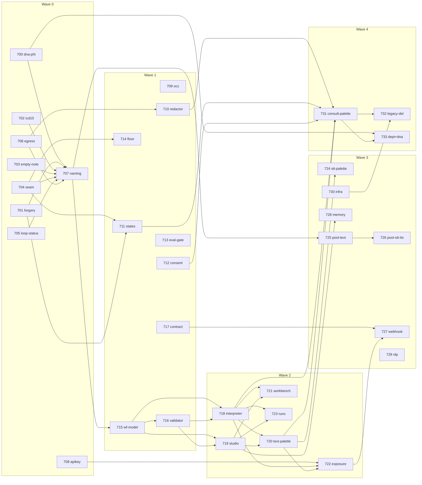

# Agentic Workflow Platform — Ticket Backlog

| | |
|---|---|
| **Status** | Planned |
| **Date** | 2026-08-16 |
| **Design** | [design.md](./design.md) (decision log D1–D8) |
| **Evidence** | [Consultation assessment](../../architecture/consultation-session-workflow/assessment/README.md) |
| **Numbering** | New-sprint block `TASK-700+` — deliberately reuses numbers that also exist in `docs/archive/` (pre-sprint work, off-limits this sprint). For ids 700–706, `docs/implementation/` is the sprint ticket; the archive folder of the same number is unrelated. |

Ticket detail lives in `docs/implementation/TASK-7XX-<Name>/README.md` — each with findings,
best practices, a TDD-ordered implementation plan, and an agent-allocation table for execution.

**Execution-agent tiers** referenced by every ticket:

| Tier | Model | Effort | Used for |
|---|---|---|---|
| T1 | haiku-4-5 | default | Extraction, formatting, mechanical rewrites, lookups |
| T2 | sonnet-5 | low–max | Standard coding, data transformation, test writing |
| T3 | sonnet-5 / opus-4-8 | low–max | Multi-file changes, tradeoff analysis, agentic tool use |
| T4 | opus-4-8 / opus-5 | low–xhigh | Architecture, re-design, security audit, long-horizon work |

## Wave 0 — Containment (all parallel except where noted)

| Ticket | Epic slug | Size | Depends on | Primary tier |
|---|---|---|---|---|
| TASK-700 | `dna-phi-containment` | M | — (decrypt-and-scan human-gated) | T3 + T4 review |
| TASK-701 | `signed-status-forgery` | S | — | T2 |
| TASK-702 | `icd10-prompt-containment` | M | — (seed edits + data migration) | T3 |
| TASK-703 | `empty-note-marker` | S | — | T2 |
| TASK-704 | `generator-entry-point-seam` | M | — | T3 |
| TASK-705 | `loop-status-discovery` | S | — | T2 |
| TASK-706 | `egress-failclose` | S | — | T2 + T4 review |
|  | `naming-alignment` | L | after 700–706 land (avoids rename collisions) | T2 (mechanical, wide) |
| TASK-708 | `apikey-scope-verification` | M | — | T3 |

## Wave 1 — Structure

| Ticket | Epic slug | Size | Depends on | Primary tier |
|---|---|---|---|---|
| TASK-709 | `note-occ` | M | — | T2 |
| TASK-710 | `phi-redactor` | L | 706 | T3 + T4 review |
| TASK-711 | `session-state-machine` | L | 701, 704 | T3 |
| TASK-712 | `consent-abac` | XL | — | T4 design → T3 build |
| TASK-713 | `harness-eval-gate` | M | — | T3 |
| TASK-714 | `legacy-safety-floor` | S | 704 | T2 |
| TASK-715 | `workflow-definition-model` | L | 707 | T3 |
| TASK-716 | `workflow-compiler-validator` | XL | 715 | T4 design → T3 build |
| TASK-717 | `async-contract` | M | — | T4 design |

## Wave 2 — Prove (substrate on the Summarization palette)

| Ticket | Epic slug | Size | Depends on | Primary tier |
|---|---|---|---|---|
| TASK-718 | `workflow-interpreter` | XL | 715, 716 | T4 design → T3 build |
| TASK-719 | `workflow-studio-v1` | XL | 715, 716 | T3 + T4 (a11y/canvas arch) |
| TASK-720 | `palette-summarization` | L | 718, 719 | T3 |
| TASK-721 | `workbench` | M | 718, 719 | T3 |
| TASK-722 | `exposure-v1` | L | 708, 718, 720 | T3 + T4 review |
| TASK-723 | `runs-observability` | M | 718, 719 | T2 |

## Wave 3 — Extend

| Ticket | Epic slug | Size | Depends on | Primary tier |
|---|---|---|---|---|
| TASK-724 | `palette-stt` | L | 720 | T3 |
| TASK-725 | `worker-pool-text` | L | 707 | T3 + T4 (k8s/KEDA design) |
| TASK-726 | `worker-pool-stt-tts` | M | 725 | T2 (follows 725's pattern) |
| TASK-727 | `webhook-channel` | M | 717, 722 | T3 |
| TASK-728 | `memory-management-screens` | M | 719 | T2 |
| TASK-729 | `nlp-task-expansion` | M | 707 (soft) | T3 |
| TASK-730 | `harness-infra-productionization` | L | — (gates Wave 4) | T3 + T4 review |

## Wave 4 — Flagship

| Ticket | Epic slug | Size | Depends on | Primary tier |
|---|---|---|---|---|
| TASK-731 | `palette-consultation` | XL | 710, 711, 712, 718, 720 | T4 design → T3 build |
| TASK-732 | `legacy-migration-deletion` | L | 713, 730, 731 | T3 |
| TASK-733 | `department-assignment-personalization` | M | 700 (scan clean), 731 | T3 |

**TASK-732 status (2026-08-17): shipped, scoped to the signable generator.** Phase 1
(readiness/thresholds) landed 2026-08-16 with the Task 3 verdict deliberately left unwritten
(no real traffic to compute a decision-grade rate). The owner then rendered a pre-production GO —
not the data-driven verdict R-1 envisaged — plus the R-2 boundary (keep the v1-compat
pre-summary/summary surfaces). Phases 2 (SYSTEM-default flip only; no real cohorts existed to
migrate through), 3 (deletion) and 4 (grep-gate + contract test + doc sync) executed against that
boundary. `docs/implementation/TASK-732-Legacy-Migration-Deletion/README.md` §7 has the full
record; `deletion-manifest.md` §5's finding on `ComprehensiveSummaryProcessor`'s signability was
resolved 2026-08-20 — its signable output is correct, by design, matching its sync twin
`ChainSummaryService.generateComprehensiveSummary` (README.md §8 Change History).

## Dependency graph

## Sequencing notes

- **707 `naming-alignment` is a deliberate barrier**: it lands after the Wave-0 code fixes so the
  rename doesn't collide with them, and before Wave 1 so all new code is born with the new names.
- **717 `async-contract` is a design ticket** — its envelope must exist before 722/727 build on it.
- **730 `harness-infra` is the Wave-4 gate**: Temporal in-cluster/managed, harness + worker in the
  k3s base, real namespaces. Without it, D1's migration cannot complete.
- **700's decrypt-and-scan is human-gated** and additionally gates 733's personalization re-enable.

## Authoring status (2026-08-16)

All 34 tickets are authored in `docs/implementation/TASK-7XX-*/README.md` (template-compliant:
verified findings with re-derived `file:line` evidence, best practices, TDD-ordered plans, per-task
agent-tier assignments — 320 tier-tagged tasks total). Authoring re-verification corrected several
assessment claims; the tickets, not the assessment, are now authoritative for evidence lines.

## Decision queue (HUMAN-GATED — blocking items first)

| # | Decision | Ticket(s) | Blocks |
|---|---|---|---|
| 1 | Legacy-consent posture for existing charts (legacy-grant backfill vs cutover exemption vs re-consent) — fail-closed day one would brick every existing chart | 712 | Consent seed posture; the program's schedule risk |
| 2 | Run the DNA decrypt-and-scan: authorize + name the target environment/DB | 700 | Latent-gap vs live-incident; 733's per-tenant re-enable |
| 3 | Clinical review of the initial validator rule set (authored by AI, not a clinician; 22 substrate + 19 consultation rules) | 716, 731 | Validator build phase; tenant full-build-power safety |
| 4 | Temporal hosting (self-hosted k3s vs Temporal Cloud) — sequences all of 730 | 730 | Wave 4 migration gate |
| 5 | Eval-gate judge backend (local CI model vs cloud spend vs scheduled-only) | 713 | CI clinical-quality gate |
| 6 | May a publicly-invoked workflow select a cloud LLM? (`text.*` is deliberately tenant-configurable; interacts with 706 egress) | 722 | Exposure flag flip |
| 7 | Migration go/no-go thresholds: define missing-note rate vs unverified-note-harm proxy BEFORE reading 730's data (a NO-GO/INVERT verdict is a complete outcome) | 732 | Legacy deletion |
| 8 | Scope of "legacy deleted": 3 of 7 entry points have no harness equivalent — retire pre-summary/comprehensive-summary, or keep them? | 732, 704 | Deletion scope |
| 9 | Per-environment intent for `harness.loop.enabled` (seeded ON is a documented owner decision; re-triage silent auto-adjudication) | 705 | Loop posture |
| 10 | API-key scope narrowing for currently-unscoped routes (breaking-change risk for existing keys) | 708 | Exposure precondition |
| 11 | `/agentic-policy` fold-in is a privilege change (tier 10-19 `manage:all` → tenant Studio) | 719 | Studio consolidation scope |
| 12 | Pseudonymization mechanism per artifact class (needs NLP entity-linking behavior input) | 710 | Redactor build |
| 13 | Rollout comms for tenants whose cloud providers become newly gated by fail-closed egress | 706 | Egress flip |
| 14 | `ChangelogAudience` rename vs a possibly-frozen external contract | 707 | Rename completeness |
| 15 | Design-gate Figma approvals for all Studio/Workbench/runs screens (rule 12) | 719, 721, 723, 728 | All console builds |

Secondary (per-ticket, non-blocking at program level): 711 `ABANDONED` state + tenant-admin close
authority · 712 patient-facing consent surface, per-purpose granularity, revocation grace,
patientId normalization · 715 DB-level immutability requirement · 721 fixture PHI treatment ·
723 run-row retention window · 727 pepper reuse vs dedicated · 728 Qdrant delete ordering ·
729 toxicity label shape · 731 HITL-wait delegation confirmation + permanent imaging deferral.
