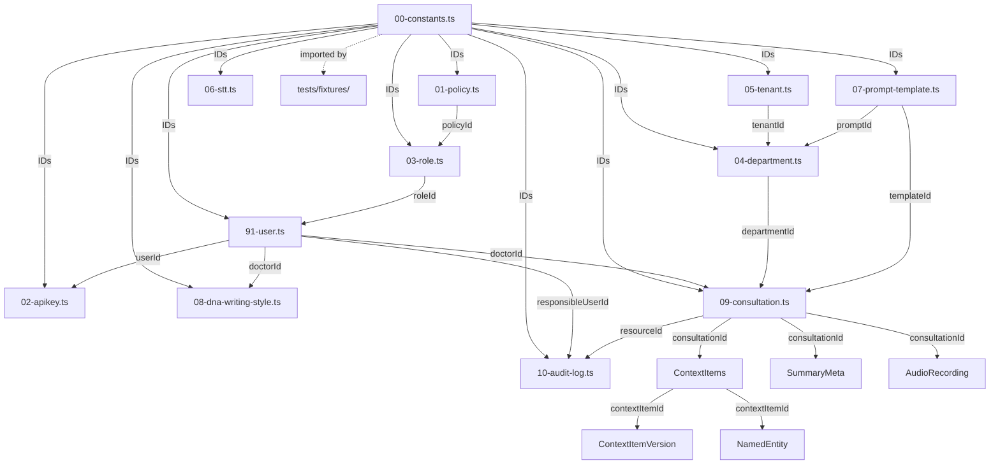

# Seed Data Reference

Complete reference for the HOPE database seed system. Covers the centralized constants module, all seeded entities, their relationships, and the test fixture API.

## Overview

The seed system populates the database with realistic, interlinked data for development and E2E testing. Every seed file imports IDs from `00-constants.ts` — the single source of truth — eliminating duplicated constants and ensuring referential integrity.

```
seed/
├── 00-constants.ts          # All shared IDs (single source of truth)
├── 01-policy.ts             # CASL authorization policies
├── 02-apikey.ts             # SDK + webhook + service-account API keys
├── 03-role.ts               # System and tenant-extendable roles
├── 04-department.ts         # Medical departments with prompt config
├── 05-tenant.ts             # Global and customer tenants
├── 06-stt.ts                # AI models, ASR pipelines, STT settings
├── 07-prompt-template.ts    # Prompt templates and versions
├── 08-dna-writing-style.ts  # DNA reports, versions, usage records
├── 09-consultation.ts       # Consultations, context items, summaries, versions, NER
├── 10-audit-log.ts          # Audit log entries (compliance & traceability)
├── 91-user.ts               # Users with profiles, settings, role assignments
└── index.ts                 # Orchestrator (FK-correct execution order)
```

## ID Prefix Convention

All seed IDs follow a prefix convention so entity types are identifiable at a glance:

| Prefix | Entity Type |
|--------|-------------|
| `00000000-xxxx` | Policies and Roles (RBAC) |
| `50000000-xxxx` | Tenants |
| `60000000-xxxx` | API Keys + System User |
| `70000000-xxxx` | Users (`0001`-`0009` admin, `0010`-`0019` clinical, `0020`+ service) |
| `70000000-xxxx` | Departments (separate entity, same prefix range) |
| `71000000-xxxx` | Prompt Templates |
| `72000000-xxxx` | Prompt Versions |
| `73000000-xxxx` | DNA Writing Style Reports |
| `74000000-xxxx` | DNA Writing Style Versions |
| `75000000-xxxx` | DNA Usage Records |
| `76000000-xxxx` | Prompt Usage Records |
| `77000000-xxxx` | DNA Regeneration Settings |
| `80000000-xxxx` | AI Models (ASR, VAD, Noise Reduction) |
| `81000000-xxxx` | ASR Pipelines |
| `82000000-xxxx` | STT Global Settings |
| `83000000-xxxx` | General User Settings |
| `84000000-xxxx` | SDK User Preferences |
| `90000000-xxxx` | Consultations |
| `91000000-xxxx` | Context Items |
| `92000000-xxxx` | Summary Metas |
| `93000000-xxxx` | Audio Recordings |
| `94000000-xxxx` | Context Item Versions |
| `95000000-xxxx` | Named Entities |
| `A0000000-xxxx` | Audit Log Entries |

## Execution Order

Seeds execute in FK-dependency order. The orchestrator in `index.ts` ensures parent entities exist before child entities:

```
1.  Policies          (no deps)
2.  API Keys          (no deps — deferred user FK)
3.  Roles             (needs policies)
4.  Departments       (needs tenants + prompt templates)
5.  Tenants           (no deps)
6.  STT               (no deps)
7.  Prompt Templates  (no FK deps)
8.  Users             (needs roles + tenants)
9.  Consultations     (needs users + departments)
10. DNA Writing Style (needs users + departments + prompts)
11. Audit Log         (needs users, consultations, API keys — last)
```

## Entity Relationship Diagram



## Seeded Entities

### System Constants

| Constant | Value | Description |
|----------|-------|-------------|
| `SYSTEM_USER_ID` | `60000000-0000-0000-0000-000000000000` | Default `createdBy` for all seed records |
| `SEED_TENANT_ID` | `50000000-0000-0000-0000-000000000000` | Global default tenant |

### Tenants (2)

| Key | Name | ID Constant |
|-----|------|-------------|
| `__GLOBAL__` | Global | `SEED_TENANT_ID` |
| `ARCAAI` | ArcaAI | `SEED_CUSTOMER_TENANT_IDS.ARCAAI` |

> The `4BITS` and `MUMBAI_HOSPITAL` demo tenants were removed in TASK-365. `ArcaAI`
> is retained as the single customer/demo tenant that backs the cross-tenant
> isolation E2E suite. The reserved `__SYSTEM__` tenant (shared catalog owner) is
> not listed here as it holds no customer data.

### Policies (12)

CASL-based authorization rules with `GLOBAL` or `TENANT` scope:

| Name | Scope | Constant |
|------|-------|----------|
| `system-full-access` | GLOBAL | `SEED_POLICY_IDS.SYSTEM_FULL_ACCESS` |
| `rbac-system-manage` | GLOBAL | `SEED_POLICY_IDS.RBAC_SYSTEM_MANAGE` |
| `tenant-full-access` | TENANT | `SEED_POLICY_IDS.TENANT_FULL_ACCESS` |
| `rbac-tenant-manage` | TENANT | `SEED_POLICY_IDS.RBAC_TENANT_MANAGE` |
| `rbac-delegate` | TENANT | `SEED_POLICY_IDS.RBAC_DELEGATE` |
| `consultation-own-manage` | TENANT | `SEED_POLICY_IDS.CONSULTATION_OWN_MANAGE` |
| `consultation-read-assigned` | TENANT | `SEED_POLICY_IDS.CONSULTATION_READ_ASSIGNED` |
| `consultation-department-read` | TENANT | `SEED_POLICY_IDS.CONSULTATION_DEPARTMENT_READ` |
| `user-profile-own` | TENANT | `SEED_POLICY_IDS.USER_PROFILE_OWN` |
| `api-key-own-manage` | TENANT | `SEED_POLICY_IDS.API_KEY_OWN_MANAGE` |
| `service-integration` | GLOBAL | `SEED_POLICY_IDS.SERVICE_INTEGRATION` |
| `federated-learning-access` | GLOBAL | `SEED_POLICY_IDS.FEDERATED_LEARNING_ACCESS` |

### Roles (7)

**System Roles (5):** `isSystemRole: true`, non-deletable.

| Name | Constant | Key Policies |
|------|----------|-------------|
| `SUPER_ADMIN` | `SEED_ROLE_IDS.SUPER_ADMIN` | system-full-access, rbac-system-manage |
| `TENANT_ADMIN` | `SEED_ROLE_IDS.TENANT_ADMIN` | tenant-full-access, rbac-tenant-manage, rbac-delegate, user-profile-own |
| `DOCTOR` | `SEED_ROLE_IDS.DOCTOR` | consultation-own-manage, user-profile-own, api-key-own-manage |
| `NURSE` | `SEED_ROLE_IDS.NURSE` | consultation-read-assigned, user-profile-own |
| `SERVICE_ACCOUNT` | `SEED_ROLE_IDS.SERVICE_ACCOUNT` | service-integration, federated-learning-access |

**Tenant-Extendable Roles (2):** `isSystemRole: false`, inherit from parent.

| Name | Parent | Constant |
|------|--------|----------|
| `DEPARTMENT_HEAD` | DOCTOR | `SEED_ROLE_IDS.DEPARTMENT_HEAD` |
| `SENIOR_NURSE` | NURSE | `SEED_ROLE_IDS.SENIOR_NURSE` |

### Users (13)

| Username | Role | Constant | Tenant | Department Context |
|----------|------|----------|--------|--------------------|
| `super_admin` | SUPER_ADMIN | `SEED_USER_IDS.SUPER_ADMIN` | null (global) | — |
| `tenant_admin` | TENANT_ADMIN | `SEED_USER_IDS.TENANT_ADMIN` | Default | — |
| `arcaai_admin` (ArcaAI Administrator) | TENANT_ADMIN | `SEED_USER_IDS.ARCAAI_ADMIN` | ArcaAI | — |
| `doctor` (John Smith) | DOCTOR | `SEED_USER_IDS.DOCTOR` | Default | General Practice |
| `doctor2` (Jane Doe) | DOCTOR | `SEED_USER_IDS.DOCTOR2` | Default | Cardiology |
| `department_head` (Michael Johnson) | DEPARTMENT_HEAD | `SEED_USER_IDS.DEPT_HEAD` | Default | General Medicine |
| `nurse` (Sarah Williams) | NURSE | `SEED_USER_IDS.NURSE` | Default | — |
| `senior_nurse` (Emily Davis) | SENIOR_NURSE | `SEED_USER_IDS.SENIOR_NURSE` | Default | — |
| `doctor_surgery` (Raj Patel) | DOCTOR | `SEED_USER_IDS.DOCTOR_SURGERY` | Default | Surgery |
| `doctor_neuro` (Lisa Chen) | DOCTOR | `SEED_USER_IDS.DOCTOR_NEURO` | Default | Neurology |
| `doctor_peds` (Maria Garcia) | DOCTOR | `SEED_USER_IDS.DOCTOR_PEDS` | Default | Pediatrics |
| `doctor_er` (James Wilson) | DOCTOR | `SEED_USER_IDS.DOCTOR_ER` | Default | Emergency |
| `service_account` | SERVICE_ACCOUNT | `SEED_USER_IDS.SERVICE_ACCOUNT` | Default | — |

Default password for all users: `password123` (bcrypt hashed).

Each department-specific doctor has SDK preferences including `primaryDepartmentId`, `workflowMode`, and `language`.

### API Keys (6)

| Key Name | Type | User | Status | Constant | Raw Key Constant |
|----------|------|------|--------|----------|------------------|
| SDK Doctor Key | SDK | doctor | ACTIVE | `SEED_API_KEY_IDS.SDK_DOCTOR` | `SEED_API_KEY_RAW.SDK_DOCTOR` |
| SDK Doctor2 Key | SDK | doctor2 | ACTIVE | `SEED_API_KEY_IDS.SDK_DOCTOR2` | `SEED_API_KEY_RAW.SDK_DOCTOR2` |
| Webhook Integration Key | WEBHOOK | tenant_admin | ACTIVE | `SEED_API_KEY_IDS.WEBHOOK_ADMIN` | `SEED_API_KEY_RAW.WEBHOOK_ADMIN` |
| Service Account Key | SERVICE_ACCOUNT | service_account | ACTIVE | `SEED_API_KEY_IDS.SERVICE_ACCOUNT` | `SEED_API_KEY_RAW.SERVICE_ACCOUNT` |
| ArcaAI Tenant SDK Key | SDK | arcaai_admin | ACTIVE | `SEED_API_KEY_IDS.SDK_ARCAAI` | `SEED_API_KEY_RAW.SDK_ARCAAI` |
| Revoked Test Key | SDK | doctor | REVOKED | `SEED_API_KEY_IDS.REVOKED_DOCTOR` | `SEED_API_KEY_RAW.REVOKED_DOCTOR` |

### Departments (15)

| Code | Name | Summary Template | Prompt IDs | Constant |
|------|------|-----------------|------------|----------|
| `GEN` | General Practice | SOAP | SYSTEM_DEFAULT / SMR_SYSTEM_BASE | `SEED_DEPARTMENT_IDS.GEN` |
| `CARD` | Cardiology | SOAP | CARD_CUSTOM / SOAP_SUMMARY | `SEED_DEPARTMENT_IDS.CARD` |
| `RAD` | Radiology | Radiology-Report | null / null | `SEED_DEPARTMENT_IDS.RAD` |
| `LAB` | Laboratory | Lab-Report | null / null | `SEED_DEPARTMENT_IDS.LAB` |
| `NEUR` | Neurology | Neurology-Structured | NEUR_NEW_REFERRAL / NEUR_REVISIT | `SEED_DEPARTMENT_IDS.NEUR` |
| `ORTH` | Orthopedics | Orthopedics-Structured | ORTH_NEW_REFERRAL / ORTH_REVISIT | `SEED_DEPARTMENT_IDS.ORTH` |
| `DERM` | Dermatology | SOAP | null / null | `SEED_DEPARTMENT_IDS.DERM` |
| `PSYCH` | Psychiatry | Psychiatric-Assessment | null / null | `SEED_DEPARTMENT_IDS.PSYCH` |
| `PEDS` | Pediatrics | SOAP | null / null | `SEED_DEPARTMENT_IDS.PEDS` |
| `ER` | Emergency | ER-Triage | null / null | `SEED_DEPARTMENT_IDS.ER` |
| `SURG` | Surgery | Surgery-Structured | SURGERY_NEW_REFERRAL / SURGERY_REVISIT | `SEED_DEPARTMENT_IDS.SURG` |
| `MED` | General Medicine | Medicine-Structured | MEDICINE_NEW_REFERRAL / MEDICINE_REVISIT | `SEED_DEPARTMENT_IDS.MED` |
| `BREN` | Breast & Endocrine | BreastEndocrine-Structured | BREN_NEW_REFERRAL / BREN_REVISIT | `SEED_DEPARTMENT_IDS.BREN` |
| `RHEUM` | Rheumatology | Rheumatology-Structured | RHEUM_NEW_REFERRAL / RHEUM_REVISIT | `SEED_DEPARTMENT_IDS.RHEUM` |
| `HEME` | Hematology | Hematology-Structured | HEME_NEW_REFERRAL / HEME_REVISIT | `SEED_DEPARTMENT_IDS.HEME` |

Every department includes a `promptConfig` object with `contextVariables`, `preferredSections`, and `abbreviationDensity` (`low` / `medium` / `high`).

### Prompt Templates (42)

Four base categories plus department-specific variants:

| Category | Examples | Count |
|----------|---------|-------|
| `SYSTEM` | System default, SMR system base, ER/PEDS/CARD/PSYCH specialties | ~9 |
| `SUMMARY` | SOAP summary format | 1 |
| `DNA_ANALYSIS` | DNA writing style analysis | 1 |
| `CUSTOM` | Department-specific (new-referral, revisit per specialty), pre-summary per department | ~31 |

Each template has a v1 `PromptVersion` record with matching content.

### DNA Writing Style (6 reports, 7 versions, 6 usage records)

| Report | Doctor | Department | isLatest | Versions |
|--------|--------|------------|----------|----------|
| `REPORT_1_OLD` | doctor | GEN | false | v1 |
| `REPORT_1` | doctor | GEN | true | v1, v2 |
| `REPORT_2` | doctor2 | CARD | true | v1 |
| `REPORT_DEPT_FALLBACK` | department_head | GEN | true | v1 |
| `REPORT_SURGERY` | doctor_surgery | SURG | true | v1 |
| `REPORT_NEURO` | doctor_neuro | NEUR | true | v1 |

Also seeds 2 prompt usage records and 5 DNA regeneration global settings.

### Consultations (10)

E2E-ready clinical workflow data covering the full consultation lifecycle across 6 departments:

| Consultation | Patient | Doctor | Department | Visit Type | Status | Parent |
|-------------|---------|--------|------------|------------|--------|--------|
| `GEN_COMPLETED` | PAT-001 | doctor (Smith) | GEN | NEW_PATIENT | CLOSED | — |
| `CARD_IN_PROGRESS` | PAT-002 | doctor2 (Doe) | CARD | REVISIT | REVIEW | — |
| `SURG_NEW` | PAT-003 | doctor_surgery (Patel) | SURG | NEW_PATIENT | SUMMARIZING | — |
| `SURG_FOLLOWUP` | PAT-003 | doctor_surgery (Patel) | SURG | REVISIT | OPEN | SURG_NEW |
| `NEUR_REFERRAL` | PAT-004 | doctor_neuro (Chen) | NEUR | REFERRAL | TRANSCRIBING | — |
| `PEDS_COMPLETED` | PAT-005 | doctor_peds (Garcia) | PEDS | NEW_PATIENT | CLOSED | — |
| `ER_RECORDING` | PAT-006 | doctor_er (Wilson) | ER | NEW_PATIENT | RECORDING | — |
| `MED_REVIEW` | PAT-007 | dept_head (Johnson) | MED | REVISIT | REVIEW | — |
| `GEN_REOPENED` | PAT-001 | doctor (Smith) | GEN | REVISIT | OPEN | GEN_COMPLETED |
| `CARD_CROSS_DEPT` | PAT-002 | doctor2 (Doe) | NEUR | REFERRAL | OPEN | CARD_IN_PROGRESS |

**Consultation chains:**
- GEN_COMPLETED → GEN_REOPENED (follow-up with addendum)
- SURG_NEW → SURG_FOLLOWUP (surgical follow-up chain)
- CARD_IN_PROGRESS → CARD_CROSS_DEPT (cross-department referral to Neurology)

**Context Items (24):**

| Consultation | Items |
|-------------|-------|
| GEN_COMPLETED | TRANSCRIPT, RAW_SUMMARY (v2 w/ edit), MODIFIED_SUMMARY, AUDIO, CASE_NOTE, PRE_SUMMARY |
| CARD_IN_PROGRESS | TRANSCRIPT, WORKNOTE, PRE_SUMMARY |
| SURG_NEW | TRANSCRIPT, AUDIO, CASE_NOTE |
| SURG_FOLLOWUP | TRANSCRIPT |
| NEUR_REFERRAL | TRANSCRIPT (partial — still transcribing) |
| PEDS_COMPLETED | TRANSCRIPT, RAW_SUMMARY, AUDIO |
| ER_RECORDING | AUDIO (in progress — no transcript yet) |
| MED_REVIEW | TRANSCRIPT, RAW_SUMMARY (v2 w/ review), MODIFIED_SUMMARY |
| GEN_REOPENED | TRANSCRIPT, WORKNOTE (addendum) |
| CARD_CROSS_DEPT | TRANSCRIPT |

**Summary Metas (4):** AI generation metadata for GEN, PEDS, MED (raw), and MED (modified) summaries.

**Audio Recordings (4):** GEN, SURG, PEDS, and ER consultations (webm format, 48kHz mono).

**Context Item Versions (4):** Edit history for GEN and MED raw summaries — each with v1 (AI-generated) and v2 (doctor-edited with change reasons).

**Named Entities (8):** NER results extracted from GEN (5 entities: 2 MEDICATION, 1 CONDITION, 1 PROCEDURE, 1 ANATOMY) and PEDS (3 entities: 1 MEDICATION, 1 CONDITION, 1 ANATOMY) consultations. Includes confidence scores, medical coding (ICD-10, RxNorm, SNOMED, CPT), and AI model metadata.

### Audit Log (10)

Compliance and traceability entries covering key system events:

| Entry | Action | Resource | Actor | Event Type |
|-------|--------|----------|-------|------------|
| Super admin login | LOGIN | User | super_admin | AUTHENTICATION |
| Doctor login (SDK) | LOGIN | User | doctor | AUTHENTICATION |
| Create nurse user | CREATE | User | tenant_admin | RESOURCE |
| Assign DOCTOR role | CREATE | UserRoleAssignment | tenant_admin | AUTHORIZATION |
| Create webhook key | CREATE | ApiKey | tenant_admin | RESOURCE |
| Create consultation | CREATE | Consultation | doctor | RESOURCE |
| Close consultation | UPDATE | Consultation | doctor | RESOURCE |
| AI generates summary | CREATE | ContextItem | system | SYSTEM |
| Doctor edits summary | UPDATE | ContextItem | doctor | RESOURCE |
| Reopen consultation | CREATE | Consultation | doctor | RESOURCE |

Each entry includes `correlationId` and `causationId` for distributed tracing, and realistic `data`/`previousData` payloads.

### STT Domain

- **20 AI Models:** Whisper variants, Silero VAD, DeepFilterNet, and more
- **7 ASR Pipelines:** Production, turbo, lightweight, ONNX-optimized, NeMo, minimal, and medical-grade
- **14 STT Global Settings:** Model cache, worker concurrency, storage, API gateway, default pipelines

### User Settings

- **General settings** (`83000000-xxxx`): Super admin preferences
- **SDK preferences** (`84000000-xxxx`): Per-doctor SDK configuration (theme, language, auto-record, etc.)

## Using Seed Constants in Code

### In Seed Files

```typescript
import {
    SEED_TENANT_ID,
    SEED_USER_IDS,
    SEED_DEPARTMENT_IDS,
    SEED_TEMPLATE_IDS,
} from './00-constants';
```

### In Tests

```typescript
import {
    SEED_TENANT_ID,
    SEED_USER_IDS,
    SEED_ROLE_IDS,
    SEED_CONSULTATION_IDS,
} from '../prisma/db_main/seed/00-constants';
```

### In Test Fixtures

```typescript
import {
    createDoctorFixture,
    createNurseFixture,
    SEED_USER_IDS,
    SEED_ROLE_IDS,
    SEED_TENANT_ID,
} from 'tests/fixtures';
```

## Test Fixtures API

Test fixtures live in `tests/fixtures/` and provide factory functions for creating test data. All fixtures accept an optional `prisma` client parameter and use the seed constants for default values.

### User Fixtures (`users.fixture.ts`)

| Function | Description |
|----------|-------------|
| `createUserFixture(options?)` | Creates a User + UserProfile |
| `createUsersFixture(count, options?)` | Batch-creates multiple users |
| `createDoctorFixture(options?)` | Creates a user with the DOCTOR role assignment |
| `createNurseFixture(options?)` | Creates a user with the NURSE role assignment |
| `createAdminUserFixture(options?)` | Creates a user with admin profile defaults |
| `deleteUserFixture(userId)` | Deletes a user |
| `findUserByEmail(email)` | Looks up a user via UserProfile email |
| `updateUserFixture(userId, data)` | Updates user and/or profile fields |

### Tenant Fixtures (`tenants.fixture.ts`)

| Function | Description |
|----------|-------------|
| `createTenantFixture(options?)` | Creates a Tenant with `key` (not slug) |
| `createTenantsFixture(count, options?)` | Batch-creates tenants |
| `deleteTenantFixture(tenantId)` | Deletes a tenant |
| `findTenantByKey(key)` | Looks up a tenant by key |
| `ensureDefaultTenant()` | Ensures the global default tenant exists |
| `createIsolatedTenants()` | Creates two isolated test tenants |

### Role Fixtures (`roles.fixture.ts`)

| Function | Description |
|----------|-------------|
| `createRoleFixture(options?)` | Creates a Role |
| `createPolicyFixture(options)` | Creates a Policy with CASL rules |
| `linkPolicyToRole(roleId, policyId)` | Links a policy to a role |
| `assignRoleToUser(userId, roleId)` | Creates a UserRoleAssignment |
| `removeRoleFromUser(userId, roleId)` | Removes a role assignment |
| `createRoleWithPolicies(roleOpts, policies[])` | Creates a role with policies in one call |
| `getSeededDoctorRole()` | Looks up the seeded DOCTOR role |
| `getSeededAdminRole()` | Looks up the seeded SUPER_ADMIN role |
| `getSeededTenantAdminRole()` | Looks up the seeded TENANT_ADMIN role |
| `createReadOnlyRole()` | Creates a read-only role template |
| `createAdminRole()` | Creates an admin role template |
| `createUserManagerRole()` | Creates a user-manager role template |
| `createTenantScopedRole()` | Creates a tenant-scoped role template |
| `createSelfOnlyRole()` | Creates a self-only access role template |

### Convenience Re-Exports

The `tests/fixtures/index.ts` barrel re-exports all fixtures plus key seed constants:

```typescript
export {
    SEED_TENANT_ID,
    SEED_CUSTOMER_TENANT_IDS,
    SEED_USER_IDS,
    SEED_ROLE_IDS,
    SEED_DEPARTMENT_IDS,
    SEED_CONSULTATION_IDS,
    SEED_CONTEXT_ITEM_IDS,
    SEED_SUMMARY_META_IDS,
    SEED_AUDIO_RECORDING_IDS,
    SEED_CONTEXT_VERSION_IDS,
    SEED_NAMED_ENTITY_IDS,
    SEED_AUDIT_LOG_IDS,
    SEED_API_KEY_IDS,
    SEED_API_KEY_RAW,
    SYSTEM_USER_ID,
} from '../packages/database/src/prisma/db_main/seed/00-constants';
```

## Test Coverage

The seed test suite (`packages/database/src/__tests__/seed.test.ts`) validates:

| Area | Tests |
|------|-------|
| Policy structure and completeness | 12 |
| Role structure, hierarchy, policy assignments | 14 |
| Department structure, prompt config, abbreviation density | 25+ |
| STT models, pipelines, settings, dependencies | 30+ |
| Prompt templates and versions | 15+ |
| DNA reports, versions, usage records | 15+ |
| Cross-reference integrity | 6 |
| Consultation seed constants | 10 |
| **Total** | **185** |
